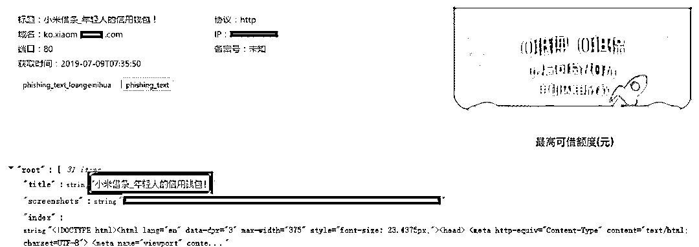

# 【蚂借蚁呗】是骗局？黑客缴获资料：借 6w，被骗 6w3！

> 原文：[`mp.weixin.qq.com/s?__biz=MzU4ODAwNzUwMQ==&mid=2247486017&idx=1&sn=5cc644145b58301611c86a9fc7c5a54f&chksm=fde21b63ca959275dc441001d7147108317f17a83436619eb3925799c38648c5299e6a52aa28&scene=27#wechat_redirect`](http://mp.weixin.qq.com/s?__biz=MzU4ODAwNzUwMQ==&mid=2247486017&idx=1&sn=5cc644145b58301611c86a9fc7c5a54f&chksm=fde21b63ca959275dc441001d7147108317f17a83436619eb3925799c38648c5299e6a52aa28&scene=27#wechat_redirect)

昨天的文章[洗脑、开直播、疯狂拉群，财经大 V 花式割韭菜，轻松诈骗上千万](http://mp.weixin.qq.com/s?__biz=MzU4ODAwNzUwMQ==&mid=2247486012&idx=1&sn=9adf40e324d7b911816e486c3acaa0e6&chksm=fde21b1eca959208df4bbec05eb10790aeb7fc5eacc2af0adfc53404af3b6700686e37dfc14b&scene=21#wechat_redirect)，发出来后，很多人问后续如何，这里简单给大家同步一下。

受害者自发组建了维权群，已经收集到了 citigroupglobal 平台的直播、入金，以及平台制作者的信息。平台制作者为深圳某公司，对方也承认了该平台后台确实是他们所做，也愿意配合警方调查。

除此之外，李鹏飞诈骗团伙的信息也已收集完毕，包括账号主体、公司备案信息、平台诈骗所使用的银行账户、订单信息、诈骗嫌疑人等。

关于公众号“炒股养家的飞飞”诈骗粉丝一事，受害者已进行报案，接下来就是等待处理。

关于炒股的文章这段时间写了两篇，希望那些想空手套白狼的人还是带点脑子。毕竟你走不完的路都是骗子的套路。

今天给大家分享一个更骚的套路，关于贷款骗局。

案子来自我的一位好朋友，他最近开个号叫**黑白呸**，专做反诈骗，里面的案子都是来源于真实事件，希望能让各位看到不一样的骗局。

**案件还原**

我被骗了，你能帮帮我吗？

正在知乎（摸鱼）找素材的我突然收到朋友发来一条消息。

自从我做了（正义的伙伴）反网络犯罪的宣传之后，发现周围被骗的人还真多（怕不是柯南附体）。

通过了解，我发现这是一个很常规的贷款诈骗。

我朋友创业中需要点周转资金。当然她也是吃我很多犯罪宣传安利的小白鼠，基本判断能力是有的。

比如这种她就不会上当！

当然，这种也不会！

这种短信有特定对象。如果没有用，他就不会存在了。

ps：后台有粉丝发过营销短信诈骗。购买营销短信也要当心呀。

出于信任以及自身现状：创业中资金紧缺。看见这条短信就轻信了。

然后她就点击了，通知网址下载了一个 app。（该网址我在第二天访问的时候已经不行了，可能是被打掉了叭，输入是 19.9 买牛仔裤）

然后她根据流程填完了所有资料，显示贷款成功 20w，但是提现失败。

她以为是自己操作失误，试了几次都不行，询问客服之后得到答案是要先交付：**【质押金】**

说到交钱，她留了个心。之前看过我朋友圈发很多类似的骗局，觉得可能是圈套，所以来问下我。（看来小灰灰我的转发还是有点用）

这是典型的贷款诈骗。

我这里有很多黑客缴获的贷款诈骗实际受害者。

**缴获真实案例分析**

部分资料

这是截取的部分拿回来的真实被骗案例。

我会截取主要流程给大家看一下。当然在每个流程下他们做的工作很多，并不局限于我发出来的这一些。

流程清楚了，被骗的概率就降低了。

**1、了解你的基本情况**

如果有贷过款的朋友，可以看出基本流程还是跟正规贷款一致，先询问你的基本情况（贷款金额、还款计划、贷款用途、有无不良记录），收集身份证、紧急联系人电话。

然后就跟你签合同，进一步加深你的信任。

**2、加深信任关系**

由于这是贷款诈骗，骗子是不会垫付任何一分钱的！

原因很简单，你都是来贷款的了，本身没多少钱，垫给你你没钱还不起怎么办？

这一点有区别与杀猪盘，杀猪盘骗子还真有可能先让你盈利（当然你的钱在小黑盘里面，能不能取出来就看骗子对你的利用价值考虑了）

我们这里重点看十一条。

这里有要求本人账户有贷款金额的 20%-50%。所以骗子知道了你账户的最低金额，第一步计划会按照你贷款金额的 20%来骗。

如果你说你金额不够怎么办？是不是骗子就骗不到了？

举个例子：你要贷款 6w，账户余额至少有 60000*0.2=12000，如果你不够 12000，并且也表示借不到那么多。你就只有 3000，那么骗子会跟你讲，那最多只能贷 15000。

要么降低贷款额度，要么增加账户余额。你看下怎么处理？

我第一次看见的时候，就产生了一个疑问：既然都是骗子，整个都是骗局，为什么一定要保证有 20%？反正又不会真的贷款给你！

后来有人给我说，是不是 20%对骗子没什么影响，反正都是假的。但是一切依照合同来，会显得专业、可信。会有更大的几率在后面骗的更多。

为了这个可能的几率，就必须严格执行！（在骗子内部对剧本非常的信任，不管貌似看起来多么不合理，都会严格执行。而且是从上到下的严格执行）

不符合 20%要求的，会尽力游说你去符合要求（当然增加账户余额是最好的）。如果不符合要求，这个钱宁可不挣的。

**3、骗取各项费用**

然后骗子就会一步步要求你：手续费：（为避免教唆情况，关键信息没有出现）

看到话术本上只有 7 步，那么有没有完呢？什么时候才算完呢？

其实这 7 步只是浓缩的。比如第 2 步保险金就能骗你打款几次。

这只是一个环节的，可以看到至少第 2 步就已经骗了 8400。

**这个骗局只有一个结束：直到你醒悟过来是骗局。不然就继续下去。 **

如果你还没有坚定的说要退款，就会默认你还有借款能力。只要你还有可能压榨的可能，他们就会稳住你，比如给你发工作照、发工牌。

工作牌、身份证、手持身份证在工作场所照片。背景的墙、其他工作人员、拍的很写实的照片。很难让人去怀疑这是一个不真实的人。

为什么能及时拿得出这些照片？（这涉及到另外一个犯罪链条：信息贩卖）

我跟朋友讲到这里，她还说要不是我信任了【蚂借蚁呗】，我不可能上当的。空口给我说我就信，我又不傻。

是呀，你不傻，但是骗子比你更不傻一点呀。不仅有话术，还花了钱做后台系统的。

选取部分截图。

我把这些案例图片给朋友看了，她才信真的是有人被骗到了这一步。她觉得非常不可思议。

这里要说一下我的朋友，她现在还没被骗是因为看见过之前的各种反网络犯罪宣传，她或多或少接触到过骗局信息，哪怕是这样，她也是并不确定是否是骗局。

犹豫就会败北。如果当时她找不到人求助，那么，会不会被骗？

**4、退款中……**

这个案例当然不会如此简单的结束。

受害人确实没钱了，本意想借 6w 元，现在都已经给了骗子 6w3 了。

那么，到了这一步，还是相信这是一个真的贷款网站，还没有反应过来。（由此可见，这个骗术也不是看起来那么简单）

如果你相信这是一个真实的贷款公司，你又确实借遍了朋友，拿不出钱了。

你会怎么办？

退款。

我不借了。

说实话，我看了还是觉得骗子难怪成功，做戏做全套。

哪怕到了受害人要退款这一步，其实已经没得骗了。骗子也没有放弃，甚至还要配合你出退款申请书。

为什么？

你要明白骗子永远不会做无用功。不会主动喊停。

你都到退款这一步，还老老实实写完了，说明你还没有看透是个骗局，哪怕你非常怀疑。甚至你还是祈求它不是个骗局，这种侥幸的心理也被骗子利用了。

退款时间 7-15 个工作日。至少还能拖你好几天，正因为这种程序的严格执行，你会觉得是真的。

那么，又给了骗子一些撤退时间。

我给朋友讲完整个流程，朋友说，是我小瞧了骗子。我要是有骗子这个本事，我何愁创业不成。

现在很多大公司确实都在做金融，比如支付宝真的有【蚂蚁借呗、花呗】京东真的有【京东白条、金条】。所以收到短信也是有真有假。

我在技术朋友的后台也看见了很多，发几个给大家看看。

依次是伪造的：小米借条、360 借条、蚂蚁借呗、京东借条。

这些都是骗子做的网站！跟正规的这几家公司没有关系，是骗子利用了这些大公司的名气跟群众的信任！

如有需要，请到各家银行/公司正规线下渠道/app 借款。

我在接到这个案子的时候，是 2018.12 月，平安普惠在 2018.2.2 还在官方微博上说明了这个事情。

截止目前，该条微博只有 15 个评论。

这是 2019.5 月的求助。时隔一年之后，依然有人被骗。

**多说几句**

很多时候我们都会小瞧了骗子，以为是在 1V1，其实不是的。

你是在以一己之力，抗衡整个犯罪集团。

这个剧本不是针对你，是针对你这一群人。每一个细节他们都有专业的人打磨过。

简单来说，就从人性窥探和利用这一步，又有多少人能说，自己能做到这一步？

一线的骗子确实可能没文化，但是他们不用有文化，他们背后有军师， 他们每个步骤严格执行，就可以了。

（骗子也有新入行的练级人员~也讲经验丰富。你要是以为遇见的所有骗子都是菜鸟，可是要吃亏的）

**黑白呸，所写的案子均来自真实事件，平时除了吐槽各种网络犯罪黑幕，还会写写关于黑客的故事。**

**如果各位想认识我的这位朋友，可以关注一下。**

**我和作者小灰灰打了一个赌，有多少人关注，他就给老师傅买多少钱的烟，你们看着办吧！**

**彩蛋：**

🌚 回过神来，我朋友被骗的是**【蚂蚁借呗】**还是**【蚂借蚁呗】**你看出来了吗？