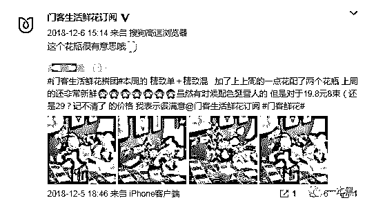
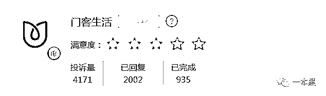
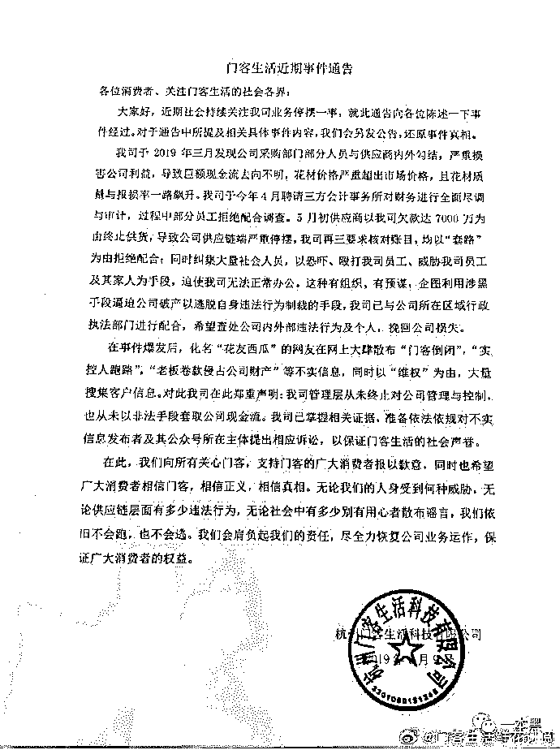
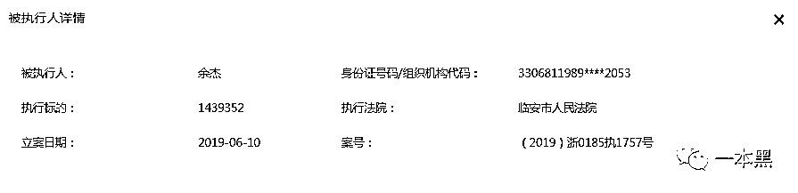
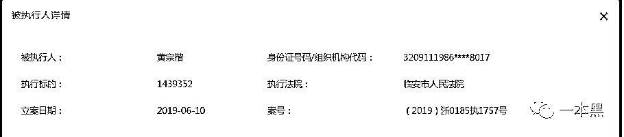
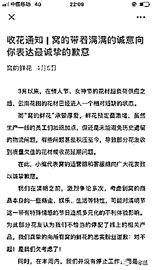
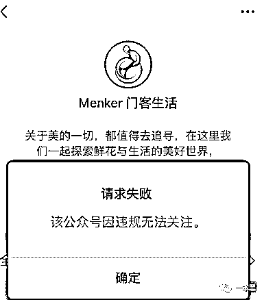
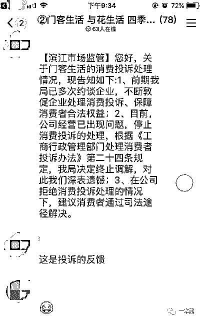
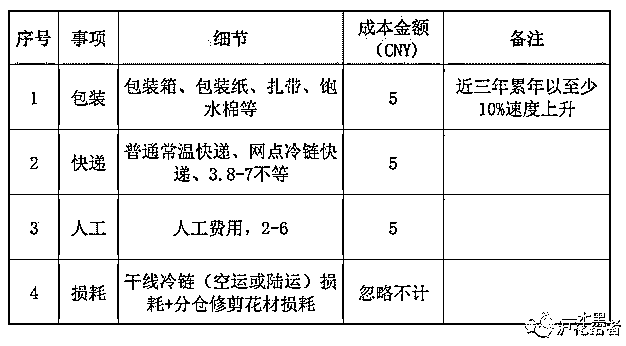

# 买花吗？299 包年，收到钱就跑路的那种

> 原文：[`mp.weixin.qq.com/s?__biz=MzU4ODAwNzUwMQ==&mid=2247486027&idx=1&sn=c62816d0face05dc2e83790866d002f0&chksm=fde21b69ca95927fb5609db492cacc0df26decb7c3c76dc3112f9bdbb5fabec2cde091b6f203&scene=27#wechat_redirect`](http://mp.weixin.qq.com/s?__biz=MzU4ODAwNzUwMQ==&mid=2247486027&idx=1&sn=c62816d0face05dc2e83790866d002f0&chksm=fde21b69ca95927fb5609db492cacc0df26decb7c3c76dc3112f9bdbb5fabec2cde091b6f203&scene=27#wechat_redirect)

【黑话连篇】

**该栏目更多的是揭露事件或对事件的看法，以达到让人精神得到升华的目的。**

* * *

**“我在网上订了两年的花，结果才送了 4 次，就不送了。钱也要不回来，说是退款正在处理，但一个月过去了，钱还没到账。”贴吧里，一个名叫门客生活的吧内，大家正在商讨如何维权。**

**发出去的帖子，打出去的电话，至今没收到官方的回复。之前的承诺和服务就和风一样飘散，一个没画完的大饼就这样大喇喇地摊在地上，落满了苍蝇和灰尘。**

****不送花、不退款、不回复****

******喵叔/文******

******当各大电商平台告诉你，“工作是为了生活不是为了活着、年轻人就应该精致”，潜台词其实是，“快来花钱吧，伙计们，快把口套里的钱都掏出啊！不够花的话去借呀，花呗、信用卡，再不济还有网贷”。******

******也就说，不管你有没有钱，不管你赚多赚少，你都要可劲花钱。******

******于是她经济和悦己经济成新的风口，女性的钱好挣，从来就如此。但是还不够，现在的女性也开始理性和独立，所以想让她们花钱 ，就得换个借口，比如“一切为了讨好自己”。这样女性即使花更多钱也会开心，毕竟钱没给渣男，也没浪费。******

******精致的生活少不了鲜花点缀，于是一时间各大鲜花电商纷纷冒出水面。知名的有野兽派，roseonly、花加等品牌。但是大品牌往往意味着更高的品牌溢价，已经在生活各个方面花费了太多，没那么多钱买很贵的花。******

******于是各色小程序订花平台来了，299 包年，一周一束，平均下来一束花才不到 6 块钱。******

******多划算啊，买到就是赚到啊。******

******门客生活就是这样一家公司，2014 年就成立了，但 2017 年之前，没人知道这家公司是干嘛的。2017 年开始，门客生活的微博开始频繁更新，内容自然是和花相关。******

******2018 年，平台开始发力宣传，公众号、小程序统统做起来了。但此时市场上的鲜花电商也多了起来，除了头部资源，新平台要获客，低价是最快的方法。******

******最便宜的时候，在门客生活，你只要花 19 块 8 就能买到 8 束鲜花。9 块 9 就能包月。******

****** ******

******低价带来了巨大的客流量，平台满意，用户也满意，但事情在 2019 年开始发生变化。大概在四月份开始集中爆发，多名用户在黑猫投诉对门客生活发起投诉。理由是大多是，“交了钱不送花”、“平台不送花、不退款、客服不回复”、“发起退款，对方已受理，但一个多月过去钱至今未到账”。******

******       ******

******门客生活旗下多家公众号消失、小程序停止服务、有赞的官方店铺无法访问，线下店铺也随之关门。那些已经订购一年甚至三年鲜花的用户意识到平台出大事了。******

******在被曝光之后，门客生活官方微博 6 月 9 号最后一次发公告，称：******

> ******“公司资金出现问题，巨额资金不知去向。公司欠了供应商 7000 万，对方称不还钱就不供货，甚至召集黑社会对公司员工进行恐吓。公司目前已无法正常运营，但公司没有卷钱跑路，管理层也还在。”******

******       ******

******虽说没跑路，但点击门客生活提供的用户售后渠道，却被告知公众号违规已无法关注，而所谓的自助服务通道，根本就无法登录，多次拨打人工客服，也一直占线。******

******一句话，找不到门客生活的人了。******

******几乎所有的用户遇到的都是同样的情况，要么找不到人，要么找到了也退不了钱；客服多方推诿，有时候甚至连敷衍都没有。******

******目前黑猫累计投诉量已经超过 4000 条了，但处理完成量还和一个月前一样，保持在 586 条，所有的【已回复投诉】时间停止在 6 月 13 号。******

******投诉量每天都在增加，但门客生活却再也没有露过面。******

********投资结构变更，老板变老赖********

********从企查查了解到，就在门客生活发完最后一条微博的当天，也就是 6 月 9 号，门客生活旗下多家子公司出现经营异常，异常原因是通过住址无法联系到公司人员。********

********6 月 10 号，公司法人代表余杰、大股东黄宗楷被临安市人民法院列为被执行人，也就是俗称的老赖。********

****************

********此外，2019 年以来门客旗下多家子公司法人代表以及投资结构都发生较大变动，黄宗楷和余杰多家法人代表身份转移至公司其他成员。********

********公司频繁变动的背后是否是因为资金断裂引发的连锁反应，又或是有其他内情？对此，门客并未做出任何解释。********

********虽然他们没有明说，但是欠钱不还，还完失踪是不争的事实。********

********6 月 19 号，公司法人代表余杰在接受 1818 黄金眼采访时表示，公司不会倒闭，也不会跑路。********

********公司从 2018 年底就陆续接到用户投诉表示鲜花质量下降、以次充好等问题，但直到今年 4 月份，管理层才发现采购部门和供应商勾结，导致公司资金大量外流。目前公司正在搜集证据，同时也在筹集资金准备复盘。至于具体复盘时间，暂时还不能确定。********

********一句话总结：**我不会跑路，我一定会回来的，但是我没有钱，所以你们慢慢等**。嘿嘿嘿~********

********除门客生活这个品牌以外，门客旗下开通了多个订花公众号，如风和日丽、窝的鲜花、与花生活等。但这些公众号在门客生活被爆出资金问题之后，纷纷以物流问题、花材紧缺为由停止运营。********

********用户在平台订购的鲜花也未如期送达，且，申请退款无果。********

********但媒体求证后发现，彼时云南当地的并未出现公告中所说的鲜花价格大幅上涨、花材供应不足等问题。********

****************

********当我在微信试图联系这些平台的客服时，发现公众号都因违规无法关注，小程序全部不知所踪。********

****************

********他们什么都没说，他们就消失了。********

********在“与花生活”的维权群里（曾经的售后群）有读者发布她了的维权结果。在向当地市场监督管理局投诉之后，却被告知该公司出现经营问题，已停止消费投诉处理，故停止调解，建议消费者通过司法途径解决纠纷。********

****************

********工商部门连投诉都不受理了，至于那些鲜花和钱，能不能拿回来，大概只能靠命。********

********或许等 ofo 押金拿到手的那天，买花的钱也就能拿回来了。********

********据报道，小黄车的押金全部退还，大概需要 12.5 年 。********

**********一场烧钱续命的乱局**********

********有网友感叹“躲过了 ofo 的坑，却没能躲过门客。”但其实出现问题的鲜花电商远不止门客生活这一家，爱尚鲜花、花加、花点时间也同样被爆出过问题，其中鲜花品质是最大的问题。********

********这几家成立时间相对较久，花材质量较好，相应的价格也会贵许多。一般定价为 99 元包月，每周一束花。********

********可即便如此，高价也并不总是带来好的体验。********

********在黑猫和聚投诉等平台，最多的投诉仍是花材质量问题：用户实际收到的鲜花和宣传图片差距太大以及物流配送原因导致鲜花出现损伤的问题。********

> *********“同一个价位的花，有时候收到的是价格相对高一些比如向日葵、睡莲、玫瑰等，有时候只能收到康乃馨、满天星、菊花等；**就算收到同样品种的花，花量也不一样，有时候能插满一个花瓶，有时候很少，或全是无法开花的花骨朵；另外，物流的水平也不太稳定，有时候收到的花已经受到严重挤压。一般买来的花，两三天就全部凋谢了。”*********

*********有业内人士透露，即使是 99 块包月的鲜花，实际每束花的成本也不到 10 块钱。价格决定质量，时间久了，成本无法负担，用户体验必然受到影响。*********

*********就算薄利多销，门客生活那种 19 块 8 的定价也不足以支撑每个月四束花的成本支出。所以平台倒闭，是迟早的事。*********

********* *图片来源：**见水印**********

*********如果用户给的钱连买花的成本都捞不回，那收到的花是个什么品质就可想而知了。*********

*********和共享单车一样，这个行业正在经历前期的市场洗牌，大品牌融资烧钱抢市场，小品牌没钱硬撑着也要抢市场。于是大品牌口碑下降，小品牌倒闭的倒闭，跑路的跑路。*********

******************

*********赔本赚吆喝，是目前很多鲜花电商的常态，这个市场才打开不久，混乱一定是会有的。*********

*********如果既想精致，又不想被割韭菜。*********

*********那就，要么选择大品牌，要么线下买。*********

*********贵，总归有贵的道理咯。*********

***********参考资料：***********

**********起底门客生活：**旗下 10 个公司 5 个是卖花的“马甲”！**疑似撤退前“割韭菜”；**新快报**********

**********2018 年我国鲜花电商行业现状分析 资本市场下沉，规模持续增长；**前瞻产业研究院**********

**********鲜花电商进入下半场：**供应链决定其生死；**亿邦动力网**********

******************

*********还原事实｜专扒黑产*********

*********微信 ID：darkinsider*********

******************

*********知乎 一本黑*********

*********微博 一本黑 007*********

*********投稿、爆料、招聘、转载*********

*********请联系微信：chenchen_19940612*********

*********约稿、内容合作、联系：yibenheiSW*********