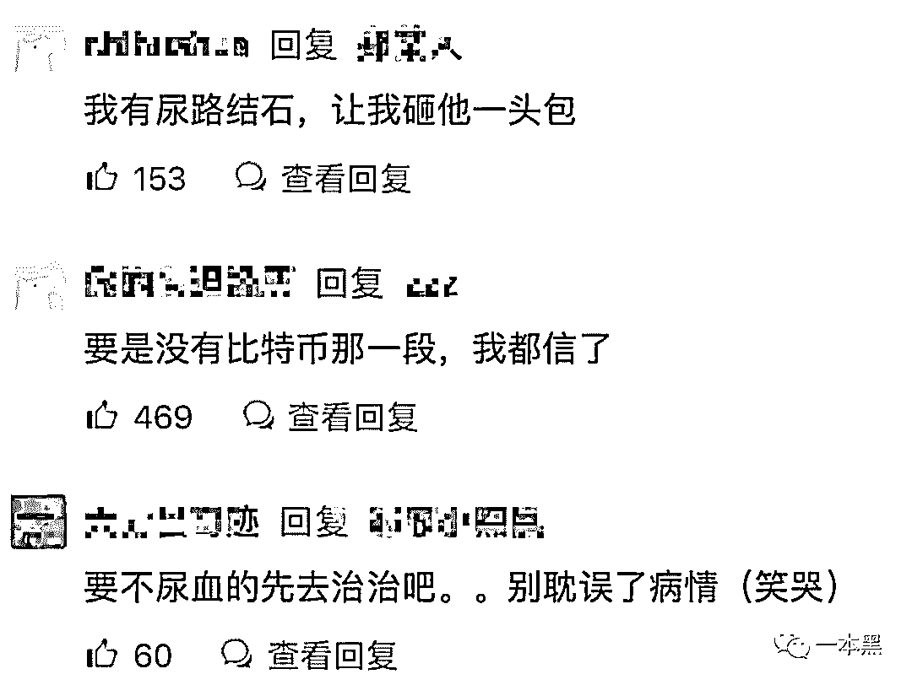
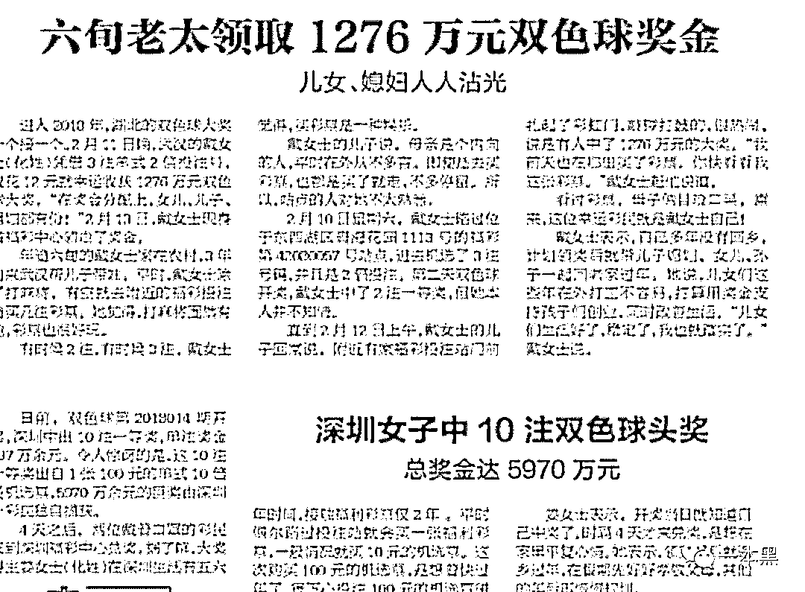
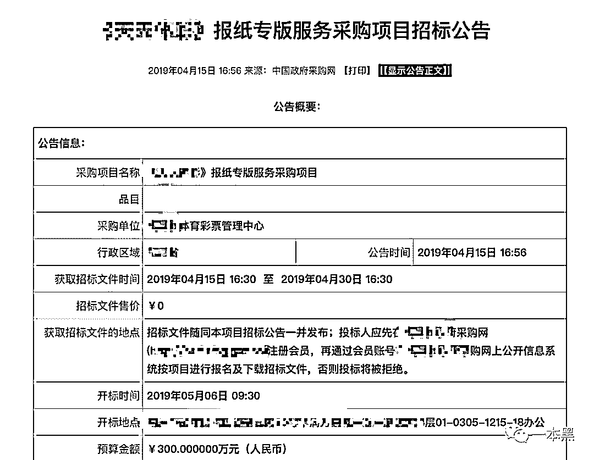

# 彩票中奖 500 万是种什么样的体验？中国上亿人在交智商税？

> 原文：[`mp.weixin.qq.com/s?__biz=MzU4ODAwNzUwMQ==&mid=2247485974&idx=1&sn=87ec4006208513eae54cc5942e9a32e9&chksm=fde21b34ca9592222dbce0a7f4a4f27e5d7d760f40935dcb8efb450771e03495bb97fce10e8e&scene=27#wechat_redirect`](http://mp.weixin.qq.com/s?__biz=MzU4ODAwNzUwMQ==&mid=2247485974&idx=1&sn=87ec4006208513eae54cc5942e9a32e9&chksm=fde21b34ca9592222dbce0a7f4a4f27e5d7d760f40935dcb8efb450771e03495bb97fce10e8e&scene=27#wechat_redirect)

【黑话连篇】

**该栏目更多的是揭露事件或对事件的看法，以达到让人精神得到升华的目的。**

* * *

大家好，我是老黑。

这两年写公众号曝光灰黑产，可以说让我见识了不少人性和欲望的东西。

想想以前做技术的时候多单纯啊，敲敲代码、找找 bug，偶尔写个程序逗逗妹子啥的。

虽说日子过得平淡了一点，但我依然是当年程序员里最帅最风骚的一个，这一点倒是业界公认，就连楼下卖早点的阿姨每次遇见我都要叫声靓仔，由内到外的帅气真的藏都藏不住。

那几年我的青春平凡却又无处安放，直到我认识老师傅，这一切的宁静才彻底被打破。

当我和老师傅干起揭露灰黑产的行当后，我发现生活真的太难了。我看到越来越多的人身上带着十几二十万就开始往赌博这个火坑里跳。

说好听点有种狼牙山五壮士的悲壮之感，说难听点这他么就是在送人头。

大家都想用仅有的本钱去博更大的收益，运气好的可能就此翻身，运气不好的可能这辈子都只能是条咸鱼了。

这几天有个读者和我聊，说自己以前就是个赌鬼，自从看了一本黑的文章之后，才发现原来这世上很多东西都是能操控的。

后来他问了我一句，赌博从此是不会再碰了，但现在会时不时买个彩票啥的，问我彩票这东西到底有没有内幕。

关于中国福利彩票，一直以来众说纷纭，有人认为是智商税的，也有人坚定不移整天研究走势。

今天我就简单和大家聊一聊，买彩票到底算不算智商税。

**一**

**以前我说过一句话，要想了解一个产品的供需现状，你去淘宝搜一搜就明白了。**

**同理，要想了解中国福利彩票，你得找到这群人在哪，他们都在讨论什么。所以，我挑选了一个比较有说服力的平台——著名讲故事平台知乎，溜达一圈后发现，我没有来错地方。**

**我选了好几个题目，比如”彩票中奖 500 万是种什么样的体验”、“中彩票是种什么感觉”，“突然中奖 5000 万你会辞职吗？”在这些问题的答案里，我找到了中国彩票中奖的得主们和即将中奖的彩民们。**

**他们所描绘出自己中奖后的场景真的让人热血沸腾，各种细节描写得那叫一个到位，简直太真实了。**

****

**看着他们写出的答案，我默默掏出烟盒里仅有的一根黄鹤楼并留下贫穷的泪水，哎，有钱人的快乐真的是这么朴实无华，且枯燥吗......**

**当时我还和老师傅开玩笑，要不咱写个爬虫，做个数据分析，估计知乎上回答中奖的人数和金额早就超出了彩票的中奖人数和金额了吧。**

**看来知乎果真是应了那句江湖传言——分享你钢鞭的故事。**

**首先，我在“突然中奖 5000 万你会辞职吗？”这条问题下，看到了太多人的压抑生活，看完后真的想为各位感叹一句，生活究竟是有多难，才能逼得你们 YY 出这么多骚想法。**

**有人说，如果自己真的中了 5000 万，马上把公司买下来，第一件事就是开了那个天天扯犊子逼话连天的混球产品经理。**

**这样看来，这位产品经理应该没少给你提手机壳变色的问题。**

**还有人说，“不用 5000 万，有 500 万我立马辞职，我会把工作全丢掉，把键盘砸个稀巴烂，给下任留个巨大无比的烂摊子，和乱七八糟的材料报表，就像我当初接受上任的烂摊子那样。”**

****

**这哥们估计工作中确实是挺难的，毕竟成年人的生活里没有容易二字嘛，他们除了难还没钱，不像我，除了没钱最起码还有点帅。**

**如果说以上回答都只是对生活的抱怨，那接下来这些回答简直就是异想天开，骚人说骚话了吧。**

**有人直接把税收都算好，如果中了 5000W，第一件事当然是先把税交了，然后兜里剩个 4000W，把自己喜欢的房子给买了，最好还是那种带车库的跃层独栋别墅，再添俩新车，一辆用来日常通勤，一辆用来平时出去玩。**

**学区房当然也得梭哈一把，直接搞四套，连买带装修各种花销下来还剩个 2500W，剩下的给双方父母各买一套复式，一边一辆 50W 左右的车，每年再给他们 1W 资金去旅游。**

**卡里留个百来万，用于不时之需，剩下的全部用于理财和保险，接下来找个小工作，下班就在家陪孩子，周末没事就出去钓个鱼，平平淡淡度过一生，简直美滋滋......**

****

**这种算是穷久了的报复性写法，当然也有含蓄且诗意的。**

> **有人说：“我会很低调，中奖的第二天下楼吃一份 6 块钱的青菜素面配馒头，引来同事的赞许眼光，我会朝他们抿一抿嘴，眼神坚毅而诚恳。**

> **下班后，穿上路边摊买的穿了几年的短裤，和淘宝买的廉价背心，提上两瓶啤酒，在公园找一个能突显气质的地方，一边喝酒一边 45 度仰望天空。**

> **引来广场舞大妈感叹的同时，还能吸引路边男男女女的对视，他们的步伐逐渐远离，我仿佛听到一句“他好像一条狗啊”。**

> **然后拖着我臃肿的身体，甩着啤酒肚回到我简陋的出租屋，对着镜子，低下头，表情一定要委婉，然后再抬起来，随后发出一连串猪叫般的笑声......”**

**不知道为什么，这些评论我看着看着就哭了，人生啊，他太么难了。**

**面对这些回答，评论区直接砸了锅，他们纷纷呼唤有糖尿病的同学。**

****

****

**我也不知道为啥，也不敢问。**

**其实说实在的，幻想中大奖基本上谁都有过，毕竟这个时代，没有人会对钱有偏见。**

**在知乎上，关于彩票的各种话题，浏览量基本都在几百万上下，甚至上千万。**

****

**这里有无数的彩民，幻想自己如果有一天真的中了大奖，生活里百分之 99 的问题都将得到解决。**

**当然，对面彩票，还有一群人持完全反对的态度，认为彩票是智商税，是一场彻彻底底的骗局。**

****二****

****至于彩票到底是不是智商税，是不是骗局，我觉得因人而异，我也不想太过具体的论述这个问题。****

****倒是可以简单聊聊国家为什么要发行彩票。****

****其实，彩票算是博彩中的一种，中国福利彩票在 18 年的销售额是 4500 亿，从这个销售额你完全可以看出全中国有多少人在买，从这一点来看，你说他是智商税吗。****

****你要知道，在几年前，地下私彩的销售额甚至比中国福利彩票的销售额还要高得多。****

****由此看来，彩票这种单车变摩托的玩意，简直就是刚需啊。而国家发行彩票的原因，第一就是打击私彩，对抗境外赌博。****

****因为任何利益性的东西，都是不可能被彻底清除掉的，地下私彩常年泛滥甚至一年比一年凶猛，国家发行彩票能在一定程序遏制私彩的泛滥。****

****其二，为了满足广大人民的冒险精神，毕竟对金钱的追求是人性，这东西没法扼杀，任何人都有。****

********

****在满足人民需求的同时，还可以顺带做些公益，增加财政收入，创造就业机会等。****

****至于内幕不内幕的，早年网上也有过很多爆料，但真实性值得商榷。不过有一点倒是可以说一说。****

****以前传统媒体还没有没落的时候，大家会经常看到报纸上出现这样的报道，某某彩票店开出 500 万大奖，中奖者却未现身；又或者是六旬老太意外中奖，儿女人人沾光。****

********

****其实，各个省市的彩票中心每年会花很多钱购买报纸的版面，用途我就不用说了吧。****

****那些意外的中奖事件、高额的中奖资金，谁看了都会心动想去买几张试试。****

********

****但现在不一样了，纸媒早已退出历史舞台，现在信息传播得靠各种新闻平台，所以你的手机上会时不时弹出一条信息：“20 岁打工小伙喜提大奖，领奖后声称要回村买房”；又或者“彩票中奖 2454 万，至今无人认领”。****

****你看，人家彩票也得紧跟时代步伐啊，转战互联网当然是件顺其自然的事。****

******三******

******前面说过，我以前是做技术的，那会仗着自己懂点概率懂点代码就觉得自己啥都知道，总觉得买彩票这帮人是傻逼，在交智商税。******

******但随着年龄慢慢变大，对面房贷的压力，面对大城市生活的压力，面对一个月苦苦挣扎也不一定能在大城市买个房子的压力。******

******我冷静分析后发现，我错了，我慢慢能理解一个人对生活失去希望的那种绝望心情。******

************

******其实他们何尝不知道彩票这东西是可遇不可求的，但万一呢，万一真中了这辈子就咸鱼翻身了，他们在幻想那个万一，这是一个盼头，一种希望。******

******很多人出身平凡，但都有一颗不甘于平凡的心，在多种尝试后依然以失败告终，而买彩票对他们来说并不是交智商税，而是给自己的生活一个白日梦的机会，谁也没指望那一张两块钱的纸能换来一生无忧。******

******对大多数人来说，每个人都是普通的上班族，每天坐在高楼大厦的格子间，但想要打工一辈子是不可能赚到这么多钱的。******

******中 1000 万的概率要远高于打工赚到 1000 万，所以所谓的智商税对他们来说，可能是个逆天改命的机会。******

******大家都在骗自己，多花两块钱不会破产，但它是一个维持自己梦幻般泡沫的幻想借口。******

******你看，这世界多可怕啊，人人都在为了更好的活下去找各种借口。******

******但我想说的是，财富这东西真的没必要去比，越比你的幸福指数就会越低，人比人那真的会气死人。******

******你要知道，在当代中国，月薪 5000 元已经算是高薪了，仔细看看每年的全国人均可支配收入，你会发现自己过得其实还是挺幸福的，毕竟这世上没用过手机、没坐过飞机的人还有好几亿呢。******

******其实，说白了，这世上大多数人都想走捷径，买彩票对普通人来说，就是一种玩得起的方式，但我认为娱乐一下可以，可千万别上头了。******

******偏偏就有一群人，把生活的期待全部寄托在彩票上，上次就有个读者给我说，他有个朋友沉迷彩票，整天泡在彩票店里研究走势和规律，玩起来简直比股票的 K 线图还要专业，每次买彩票都是几百几千的买。******

******但依然没有任何卵用，彩票消耗了他几乎全部全家，最后还走上了贷款买彩票的道路。******

******这种玩法显然太过极端，正儿八经的傻 X 行为，身份已经从彩民上升为赌狗，彩票对他来说早已变成了智商收割机。******

******所以彩票到底是不是智商税，我想还是因人而异，如果 2 块钱能买到你对生活的期待，那就挺好。但如果彩票让你沉迷，到了一种“不疯魔不成活”的地步，那就得不偿失了。******

************

******彩蛋 1：******

******明天是一本黑的读者日，每月 24 号，我给大家准备了丰厚的礼物，绝对超乎你的想象。******

******读者日每个月 24 号都会举行，至于为什么是 24 号，不是因为 1024，也不是因为科比球衣，更不是因为一本黑第一次发文的时间。******

********读者日是一种仪式感，我希望每个人都能参与进来。********

******彩蛋 2：******

******最后，是一条推荐，如果你想提升自己的认知和赚钱能力，我推荐一位互联网大佬，caoz（曹政），资深 IT 人，互联网当之无愧的技术大牛，江湖绰号“互联网百晓生”。******

******早年我在曹大的公众号**caoz 的梦呓**看过他的很多文章，受到过无法用金钱衡量的启发，圈内人都说近曹大者富，讲的就是曹大对互联网的独到见解和思考方式。******

********

******总之一句话，认识曹大，你的互联网就算入门了。******