# 月薪 3000 教人炒币：黑平台、全是托、分分钟让你输掉 20 万

> 原文：[`mp.weixin.qq.com/s?__biz=MzU4ODAwNzUwMQ==&mid=2247485949&idx=1&sn=c70c5d350237fdbcb0107c2b3e44554d&chksm=fde218dfca9591c9bd7e470a9ff4be49412c3c17514cde846e84eea006b34406a4c1ce28ea30&scene=27#wechat_redirect`](http://mp.weixin.qq.com/s?__biz=MzU4ODAwNzUwMQ==&mid=2247485949&idx=1&sn=c70c5d350237fdbcb0107c2b3e44554d&chksm=fde218dfca9591c9bd7e470a9ff4be49412c3c17514cde846e84eea006b34406a4c1ce28ea30&scene=27#wechat_redirect)

【地下职业】

**该栏目主要讲述大众看不到的职业故事、人生经历，与黑暗有关、与欲望有关、与人性有关。**

* * *

大家好，我是老黑。

前几天，我在网上看到一个帖子，讨论的是 20 年前就开始炒股的人，现在都怎么样了。确实，自 90 年代末股票上市交易开始，至今已过去整整 20 年。

有人通过股市实现财务自由，咸鱼翻身，把股市当作自己的提款机；有人浑浑噩噩度过 20 年，算下来不输不赚，但同时也输掉了时间，输掉了青春。

但无疑这部分人都是幸运的，他们见证股市发展的同时，也成为了股市的弄潮儿。

还有人就比较惨了，20 年来一直处于亏损状态，但他们仍心存侥幸，仿佛股市信徒一样一直坚守着。

总的来说，20 年前就开始炒股的人，要么是赚到钱退出，要么是亏损退出，坚持到现在的基本没有多少人，他们早已过上了与股市无关的生活。

但这并不妨碍后来者前赴后继。

时间放在 20 年前，如果有人叫你炒股，你肯定会心存戒备，心想这他么什么玩意。但现在不一样了，时代在变，各种投资理财产品到处都是，大家都在用心琢磨怎么让钱生钱。

但一夜暴富的心态任何时代的人都有，**幻想着搏一搏单车变摩托，可到头来却输得一地鸡毛。**

投资当然是好事，但如今这个年代，越来越多的人开始打着教你投资的口号疯狂敛财，仔细想想就能明白，人家既然懂怎么投资赚大钱，为什么不闷声发大财反而来教你呢。

难道你和我一样除了帅，一无所有了吗？

前几天，我和几个玩股票输得内裤都不剩的读者聊了聊，发现他们所经历的事情基本上都大同小异，以下，我会用亲历者口述的视角讲述他们的经历，希望能给想单车变摩托的各位带来一些思考。

**月薪 3000，教人炒币**

首先我得说一下，我是在一个叫 GME 的金融 APP 上炒币，类似期货、黄金，可以买涨买跌，有三个产品，BTC20、BTC50、BTC100，分别对应的 20、50、100 倍的杠杆，一周之内，输掉 12 万。

事情的起因是这样的，因为玩股票，我加了一些微信群，后来群里有人叫我，说他们会有一些股市的早晚评和盘中解析走势预判，然后就把我拉到了另一个群里。

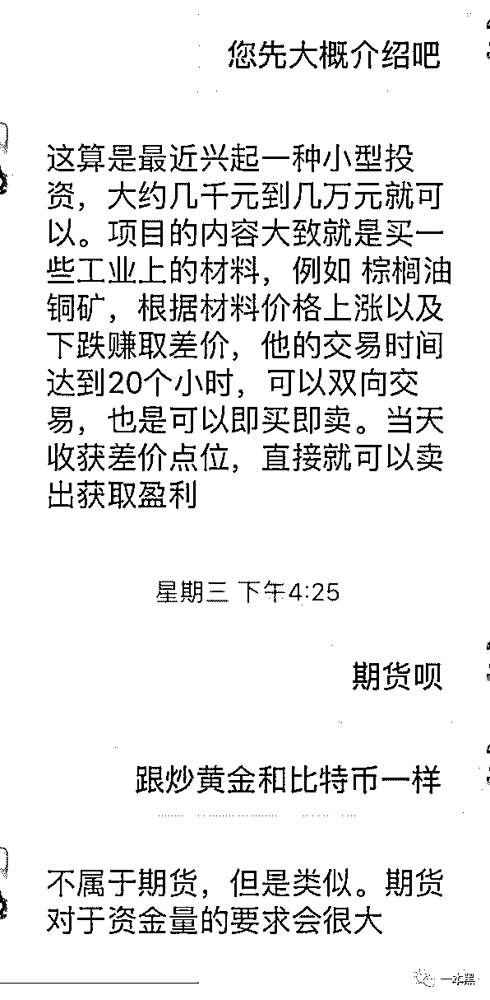

在这个群里，他们有一个直播间，每天都会有好几个时间段，不同的老师进行直播。

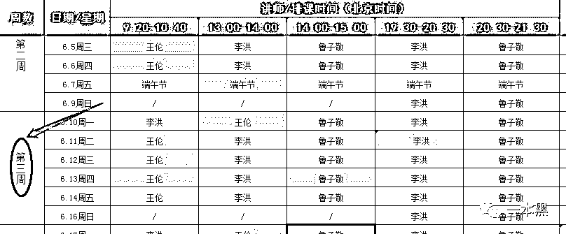

刚开始我就无聊随便听听，直播的老师听声音大概四五十岁的样子，讲话还都很幽默，时不时讲一些我没听过的段子，感觉还挺有意思的，所以我就听了下去。

慢慢的就听到他们提起一个战狼计划，大概就是说他们每个月都会有一期和私募合作的计划，达到要求的学员可以一起参与。

所谓的战狼计划就是学员提前潜伏进去一只股票，然后他们大资金进去做拉伸，学员达到盈利点位，陆续退出，然后私募的钱进场。

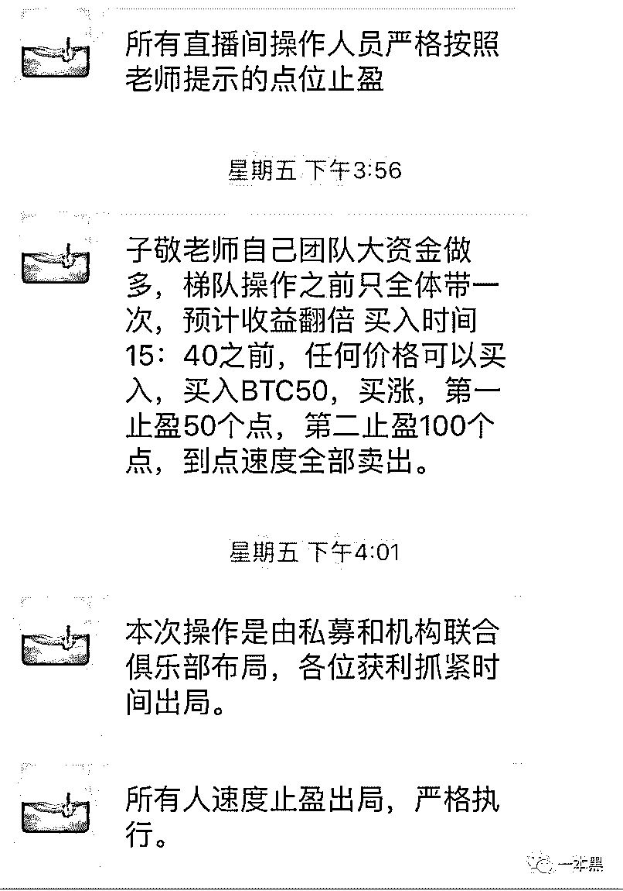

我当时是 5 月份进群的，所以没有达到他们入选战狼计划的要求。

后面又听到直播间里的人分享自己每天赚多少个点，马上就能达到预期收益，从股票代码和走势图来看，倒是很符合他们说的那样有拉伸和涨停，然后就开始半信半疑。

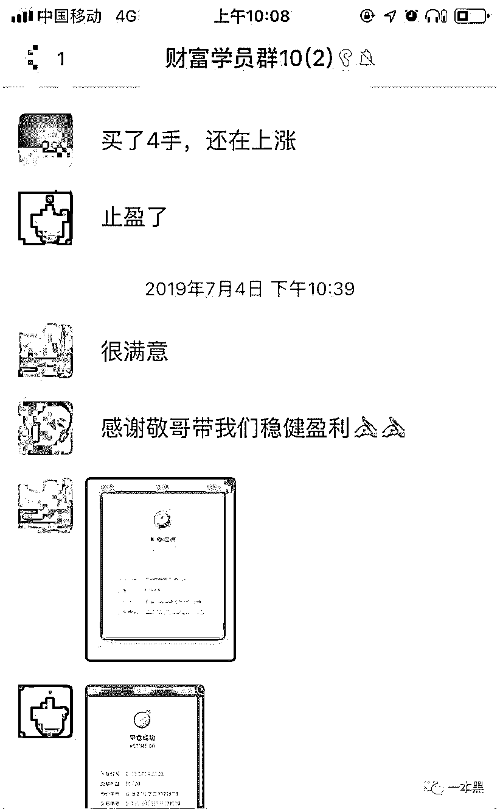

（发盈利截图的其实全是托）

接着群里就说战狼 6 马上开始启动，学员要按时听课拿积分，只有积分达到才能入选战狼 6，所以我平时上班都在听他们的直播。

有一个周末，他们搞了个庆功会，在直播间抽奖，一等奖 8.8 万，二等奖 8888，三等奖 888，当时我正好有事就错过了，也不知道所谓的中奖到底是真是假，反正群里有人说他中了，还在群里给大家发了个大红包。

那段时间，我基本养成了听他们直播的习惯。

渐渐的，直播间里就提到区块链最近行情大涨，老师说她在玩区块链，就有人问怎么玩，老师说他也是跟着别人在玩，如果大家感兴趣可以联系那边的客服统一教大家怎么玩。

随后我就添加了那个 GME 金融的客服，他给我推了一个二维码让我下载 APP，下载后这个 APP 还是需要添加信任的那种，在 AppStore 是搜索不到的。

到这一步，我依然还存在着戒备心理，一直在观望直播间老师带其他学员操作，但慢慢的，一些学员开始在群里分享自己的盈利截图。

**看着这些盈利截图，说实话，不心动那是假的。**

因为一千美元是最少的额度，所以我抱着试一试的心态先充了一千美元，看着 APP 的走势图和火币网的是一样的，我在心里告诉自己，这应该不是他们自己操控的。

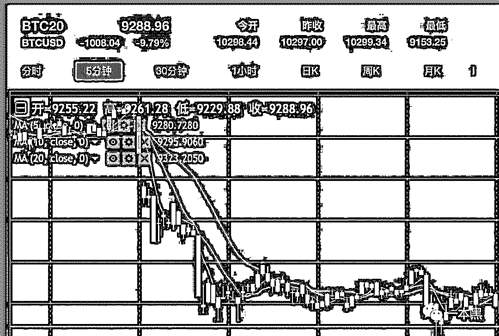

当晚就跟着操作了俩手，结果竟然直接翻了两倍，到第二天我赶紧试试能不能正常提现到银行卡，确定之后我继续跟着操作。

可结果最后却爆仓了，我就懵了，完全不知道什么原因，事后沟通老师告诉我，是因为资金不够，相当于半仓操作，这样很容易爆仓，接着我又充了一万美元进去，和直播间老师傅指示的一样，慢慢开始有了小幅盈利。

直播间里有三四位老师，有一个老师每次都很稳健，但另一个的操作就会有很大震荡，我第二次完全按他们的操作跑下来又被爆仓了，接着第三次第四次，后来我就不玩了。

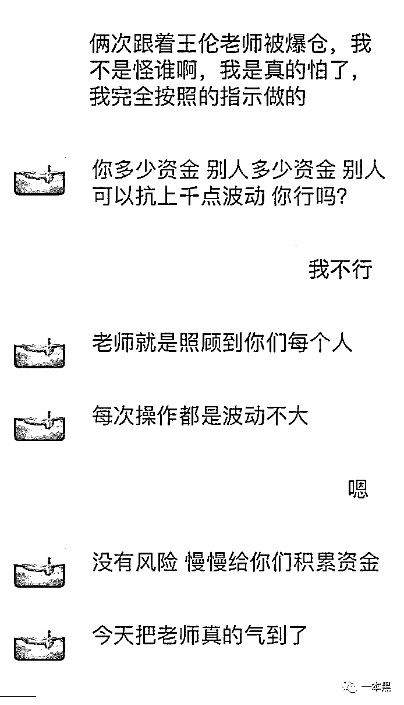

我一直没有想过是他们那边的问题，只是觉得自己资金太少没办法做到用更小的仓位去控制，承受不起大的波动我也就没再继续跟着操作，但还在继续听他们的直播。

后来我和另一群的人聊到这个事情，发现我和他的经历是一样的，只是我们在不同的群里，但是不同群里说话的人竟是同一个人。

那些老师标榜他们是一个叫百姓财富基金的，他们平时就是带着学员炒股赚钱，然后让赚钱的学员去购买他们的基金支持他们，这样听起来带你赚钱的动机还算合理，而且直播间操作股票或者 BTC 的时候，老师的账户资金量也确实很大，不像是为了坑我们的钱。

**但直到前几天我被踢出群的时候，才发现，我被骗了。**

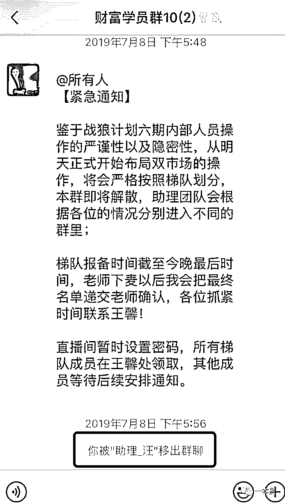

后来我和很多人聊过之后，发现和我相同经历的人越来越多，很多人和我一样先被诱惑，不少年轻人工作两三年赚的钱一下子就赔进去了。

从 6 月 25 日开始玩，到 7 月 2 日全部输完，一周时间，我输了 12 万。

**炒股吗？******一周输 20 万那种****

****其实，遭遇这类骗局的人不在少数。****

****大多数人起初都会被陌生人拉进一个股票群里，群里面的老师会对市场上的股票做出分析，还时不时开直播讲课。****

****这类骗子其实都有一个团队，他们在一个个的群里扮演不同的角色，有时候甚至好几个角色都是同一人扮演。****

****在贴吧里看到另一个受害者王先生的遭遇，起初因为前几年炒股赚了点小钱，本身对投资类产品就比较感兴趣，也是被莫名其妙拉入这种群，开始在直播间听别人讲课。****

****有一次在直播间，群内的老师说现在股票行情不好，某某指数比较好做，T+0 模式，涨跌都能买，一开始他也是比较怀疑，但**看着其他学员不停地在晒自己的盈利截图**，王先生也没抵挡住诱惑，**抱着试试看的心态开了户。******

****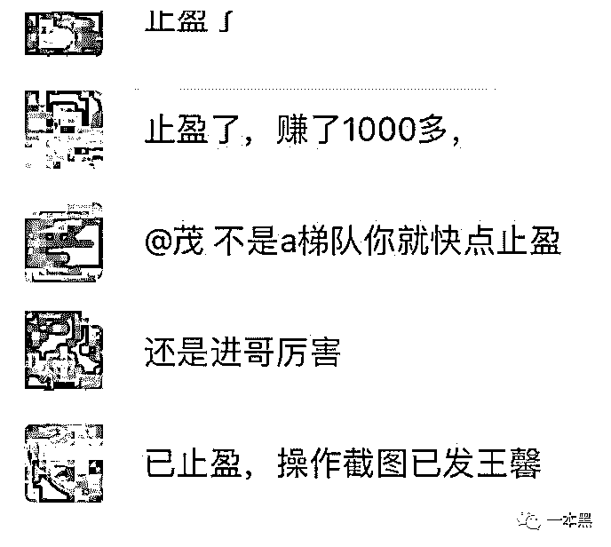****

****（全是托）****

****后来因为听信所谓指导老师的话，他先后入金 20 多万，在这期间操作有亏有赚，但每次都是小赚大亏，直到最后 20 多万全部输完。****

****在整个 GME 金融平台骗局中，有三位老师分别是鲁子敬、李洪、王伦，这三人前期天天讲区块链，然后群里很多学员发盈利截图。****

******其实那些发所谓盈利截图的学员都是他们自己的托，目的就是吸引真正的玩家入场。******

****首先他们入金时候用的都是私人账户，**学员第一次操作，基本都会盈利，这招叫勾人**，也是建立信任，让你完全相信，只要跟着老师们的操作肯定就能赚钱。****

****然后后续每一次做单，你会发现软件会出现卡顿，甚至无法操作的情况，没办法按照老师的指令平仓，这时候就开始亏损乃至爆仓强制出局。****

****当你质问群内的老师为什么会出现这种情况的时候，他们一般都会坚持说他们没有问题，是你自己的资金不够，扛不住上千点的波动。****

****访问 GME 金融的官网平台时，我发现他们在 7 月 4 日开始进行系统升级，声称遭遇 DDOS 攻击，其实这个时间点是为自己的跑路做准备。****

****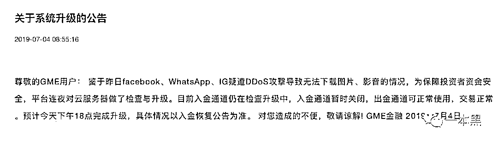****

****果不其然，7 月 9 日，平台宣布停止运营。****

****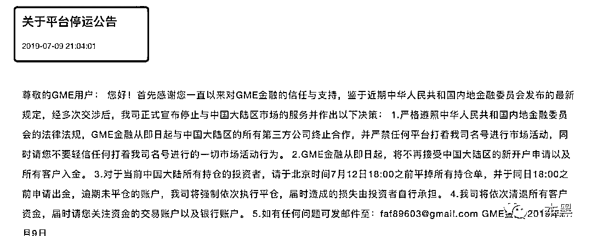****

****很多人发现自己被骗后，纷纷在网上寻求法律援助。****

****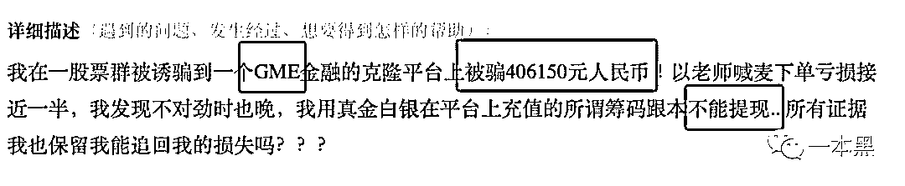****

****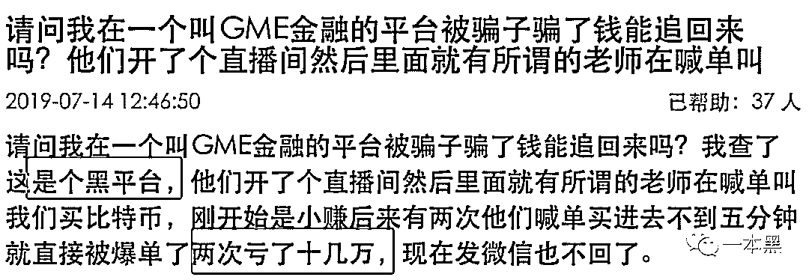****

****其实，**GME 金融平台就是一个彻彻底底的黑平台、一场骗局。******

****通过查询，我发现它连最基本的资质都查询不到，他宣称自己是一家专业的比特币投资平台，包装得有模有样，实际上完全是挂羊头卖狗肉。****

****再者说，GME 平台入金的账户都是私人账号，这明眼人都能看出问题，不知道怎么还会有那么多天真的人。（这一点国家是有规定的，任何指数、外汇等交易平台的入金必须存管银行。）****

****GME 平台实际上就是一个虚拟盘，完全是借比特币市场的风，虚构比特币指数，骗取股民入金。他们可以在后台随意更改交易数据，造成正常入金的假象，但实际上股民的钱是直接进入了私人账号。****

****当玩家发现不对劲的时候，再去登录平台，却发现，自己的账号早已被禁用，而里面的资金也不可能再提现出来。****

****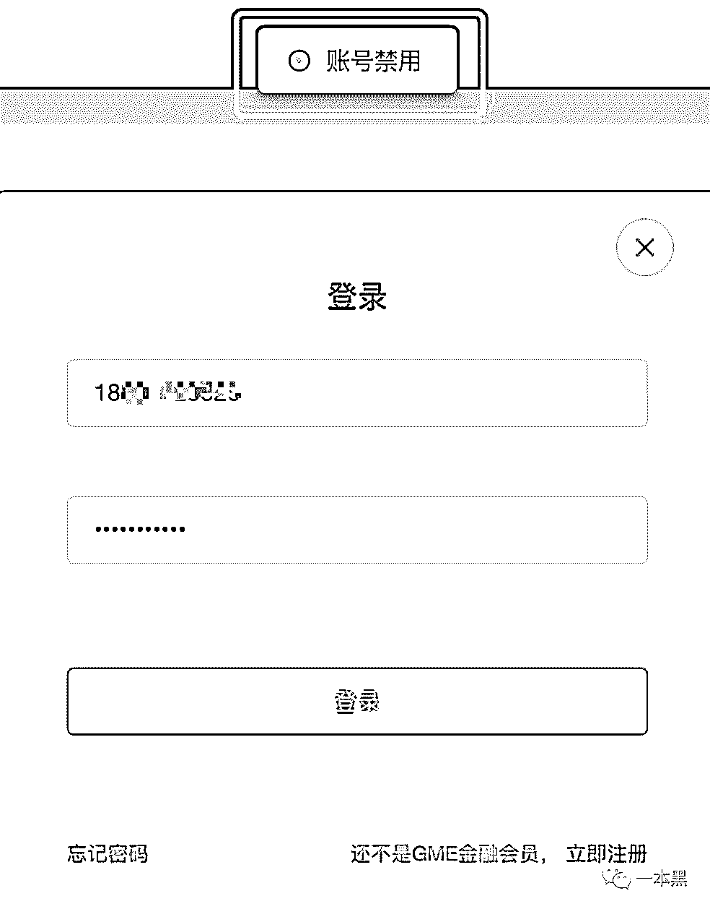****

********

****其实，这类炒股骗局已经很常见了，但还是会有源源不断的人上当，任何一个平台都是圈一波跑路，过段时间换个马甲又继续圈钱。****

****玩法上基本都大同小异，通过设置输赢概率、限制提现等手段，非法集资并占有他人财产。****

******国人的智商真是感人，特别是这群跟着别人学炒股的人。******

****你用脚指头就可以想清楚，为什么一个赚钱的项目，会有陌生人哭爹喊娘的非要带上你。****

****如果这些高回报的投资都是真的，为什么他们不自己闷声发大财，还非得搞个直播免费给你上课，人家不可能是吃多了没事干。****

******你所信奉的老师，其实背后都是些拿着三四千月薪，普普通通的上班族罢了。******

****要想这群人教你炒币赚钱，我想你不赔个几十万，应该是醒不来了。****

********

****还原事实｜专扒黑产****

****微信 ID：darkinsider****

********

****知乎 一本黑****

****微博 一本黑 007****

****投稿、爆料、招聘、转载****

****请联系微信：chenchen_19940612****

****约稿、内容合作、联系老黑：yibenheiSW****