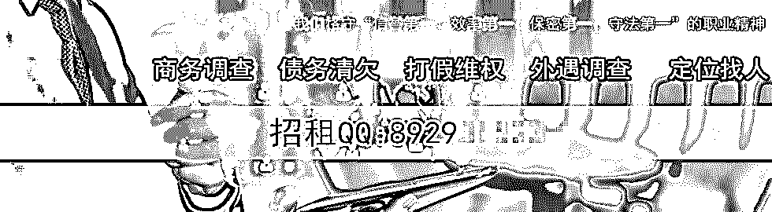
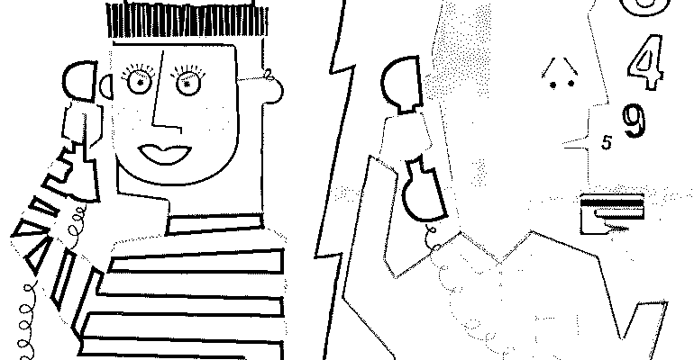
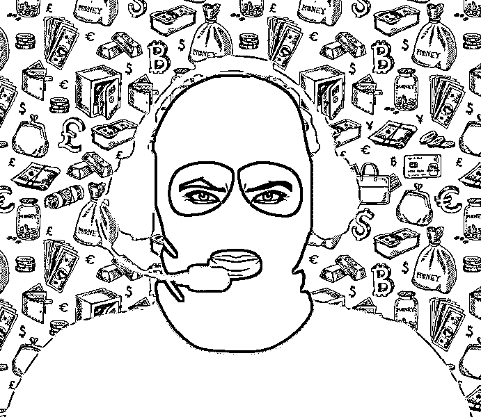
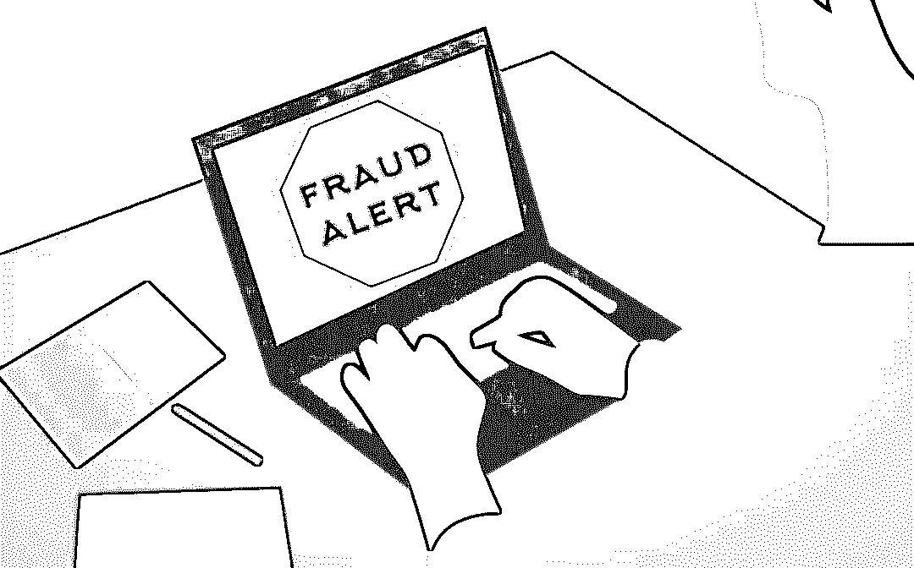
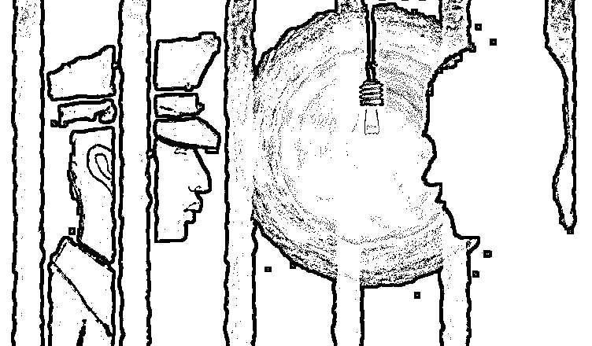

# “我是一个私家侦探，调查婚外情、和帮你杀人”

> 原文：[`mp.weixin.qq.com/s?__biz=MzU4ODAwNzUwMQ==&mid=2247485933&idx=1&sn=b65da9f7fd5437bac1296f455823c5fb&chksm=fde218cfca9591d92c9926a5596d50e7a1f4d90cee1802cff485e3253ea7a99bad61a8502b19&scene=27#wechat_redirect`](http://mp.weixin.qq.com/s?__biz=MzU4ODAwNzUwMQ==&mid=2247485933&idx=1&sn=b65da9f7fd5437bac1296f455823c5fb&chksm=fde218cfca9591d92c9926a5596d50e7a1f4d90cee1802cff485e3253ea7a99bad61a8502b19&scene=27#wechat_redirect)

大家好，我是老黑。

我总能在后台收到类似这样的留言：“我怀孕了，男朋友跟人跑了，能不能帮我调查下他现在在哪。”

“老婆出轨了，能不能帮我调查一下。”

“朋友借钱不还跑路了，一直联系不上，能不能帮我定个位。”

这类求助，基本都是想查一个人的信息，但一本黑不是一个帮人调查的平台，这种涉及侵犯个人隐私的行为恕我帮不了。

其实，在中国，私家侦探是没有调查权的，但现实中却依然有从业者以侦探身份进行商业调查，这类调查大多数存在地下，且是一种灰色、违法犯罪的行为。

私家侦探这一行，不仅侵犯他人隐私安全，还会引发各种犯罪事件，我认识一哥们叫爱哲，他专门收集世间真实故事，并把故事制作成音频。

他曾经采访过一个私家侦探，21 岁，接到过杀人的单子，还没来得及金盆洗手，就被警察叔叔请去喝茶了。

这一喝，就是三年。

本文转自 故事 FM 「 ID：story_fm」

讲述者 **/** 王凯旋

不知道你有没有在网上看到过类似这样的小广告： 

「我公司是一家私人侦探公司，专门为您提供：外遇咨询、婚姻挽救、商务调查、寻人找人等服务。本着诚实守信的原则，我们为您提供最真实的调查真相，欢迎您的来电！ 」

今天的讲述者告诉我们，这样的小广告，几年前，他在网上发过几千条。 

******「** **想赚钱吗？跟我做生意吧 **」 ****

我记得很清楚，那顿改变我命运的午饭是在一家苍蝇馆子吃的。 

那是 2015 年的某一天，我才 21 岁，在外头干了好几年销售。钱没怎么挣，普通话倒练得不错。 

表哥约我吃饭，去了家苍蝇馆子。我们点了三个菜，一个汤，两瓶啤酒。 

酒足饭饱，表哥给我递了支烟。他说，「我这有个事儿，你要不要考虑一下。反正据我所知，做这个事情的人基本都有房有车。」 

我隐约知道，表哥干的是某种「偏门生意」。但既然能赚钱，我不妨跟着他一起干。两三天后，我们买了一台电脑，两部手机，去黑市搞了几张银行卡、几张电话卡，生意就这么开始了。 

****「** 您好，我们是私家侦探， **

**有什么可以为您服务的？**」 ****

那个时候，在我的印象中，新闻媒体上关于这一类「骗术」的报道还不多，我也是几天之后才搞明白其中的门道。 

第一步，我们会在各种门户网站上发布小广告，说我们是一家私家侦探公司，再留一个电话。 

那个时候，在网上发这种广告是很容易的，百度管得也不严。一般来说，你只要在百度上搜索自己所在城市的私家侦探，基本上搜到的都是我们这类人发的广告。 

第二步，守株待兔，等那些想找私家侦探的人打来电话。接到电话后，我们会用固定的话术骗取对方的信任，告诉他，如果想得到我们的服务，得先交一笔定金，事成之后，再付尾款。 

在我的经验中，来找私家侦探的绝大部分都是来调查婚外情的。面对这些客户，我一般会声称自己能够监控她丈夫的手机和行踪，拍到他出轨的证据。 

第三步，等了几天之后，我们会打一个电话过去，声称事情已经办成了，想拿证据的话，先付尾款。在这个时候，如果对方提出质疑，我们一般会声称，由于私家侦探属于灰色行业，我们需要您用担保金来证明自己不是卧底的记者或警察云云。总之，想尽办法，总归要骗到这笔钱。 

最后，如果在其中的任何一步，客户起了疑心，发现我们是骗子，我们就会以他的隐私作为要挟，逼对方息事宁人。 

没过几天，我就搞清楚了这一整套流程。因为我声音好听，普通话标准，表哥让我负责接电话。 

**「我想杀一个人」「好的，五万块」 **

在我接到的客户当中，大部分都是普通的婚外情委托，但是偶尔，我们也会碰到非常奇葩的客户。 

有一次，我接到一个委托电话，听声音似乎是一个四五十岁的大姐。 

她说，「我想让你们帮我杀一个人。」

我说，「可以。」

她说，「那要多少钱？」 

我说，「五万。」 

她说，「太贵了，一两万行吗？」 

我说，「大姐，这年头，杀一头猪都不止一两万，何况杀一个人。」 

她说，「也对，但我现在没那么多钱，等我凑到钱再来找你们。」

我说，「好。」

放下电话后，我没怎么把这件事放在心上。没想到，一个星期后，她真的打电话来了，说自己只筹到了三万块钱，问我们行不行。 

我一下子懵了，因为以前实在没有遇到过这么奇怪的案子。毕竟，我们不可能真的等人死了，再找她要钱。 

我琢磨了大约 15 分钟，决定能走一步是一步，便回复她，三万可以，但她得先交一万五的定金。三天之内，我们会杀掉她想杀的人，到时候再收尾款。 

她考虑了好一阵子，竟然同意了。 

拿到定金后，我其实很发愁，怎么也想不出来，我要怎么做才能让她相信我已经帮她杀了人。可是，转念一想，既然这个人连「三万块杀个人」都能信，那我随便编一个谎话，她没准也会信？

于是，三天后，我给她打了个电话，告诉她，我们已经给「那个人」的食物里下了毒，24 小时之内，他就会毒发身亡；可是，如果在此之前没有收到尾款，我们就会给他吃解药。 

那位大姐将信将疑，却还是把剩下的一万五打了过来。 

第二天中午，她又打了电话过来，说自己去了那人的家里，发现他竟然没死，便来兴师问罪。 

我又编了一个蹩脚的谎言，说可能是毒药的分量没有掌握好，但问题是，我们的毒药成本非常高，如果想再下一次毒，她还得再加一万块。 

大姐居然又信了，说，「好，我去凑钱」。 

过了大概三四天，她打电话来，说，这个钱我实在凑不到， 你要不把这个钱退过来。我一想，也行，就以这个方式先拖着她，便告诉她，我们的毒药和人工加在一次花了大概 2 万块钱，只能给你退 1 万。她说，那也行。 

我又告诉她，我们退款按照流程要等到月底。这其实是我们的惯用伎俩，因为一个月之后，我们的电话卡和银行卡早就换了，人也到下一个城市了，受害人报警也没用。 

可是，那一次，我们犯了一个小失误。那个月，我们的广告效果实在太好了，那个电话号码就没舍得换。于是，到了月底，那位大姐便又打来了电话，说人也没死，钱也不退，你们到底在耍什么花样。 

看来，她是终于醒过来了。我们便按照惯用的话术，威胁她说，买凶杀人是犯法的，我们把事情捅出去，你是要坐牢的。她似乎立刻就被我们吓住了，从此再没找我们的麻烦。 

****「 **好险，差点惹了不该惹的人 **」 ****

一般来说，我们接到单子都会甄别一下，尽量挑选警惕性不高的人，成功几率会高很多。但有一次，大约是大意了，我们差点骗了惹不起的人。 

当时，打电话来的是一个大约三四十岁的女人，调查丈夫的婚外情。言谈之中，我能感觉到她是一个精明能干的女人，但是，骗局的每一步，她都爽快地打了钱过来，我也就没舍得放弃这个单子。 

直到她交了尾款后，我还企图骗她交点别的什么费用，她便确定了我们是骗子，在电话中威胁我们，要求我们不得把事情透露给她的丈夫。 

当时，我们本该及时收手，可是，我表哥心存侥幸，总觉得这个女人既然这么怕她丈夫知情，那么，我们应该还有回旋的余地。 

于是，我们又打了电话过去，威胁她再打两万块钱过来，否则，我们就把她找私家侦探的事情告诉她丈夫。没想到，过了半小时，她竟然发了一条彩信过来，调出了我表哥去银行取钱的录像，以及银行网点的信息。我们这才知道，这次真的惹错人了。 

惊吓之余，我们关掉了所有手机，还给大姐发了条短信，苦苦哀求。在此之后，她没有再找过我们的麻烦。 

**「其实，你是一个好人」 **

半年之后，我们的团队增加了两名经验丰富的得力同伙，生意也越来越好。我过上了理想中「挥金如土」的日子，心安理得。 

如果要说我的良心会不会受到谴责，细想之下，似乎只有那么一瞬间。 

有一次，我接了一个婚外情的单子。那个客户听起来很谨慎，交完尾款之后，很快就意识到自己上了当。但是，她还是给我们打了五千块钱。 

那天晚上，她又给我打了个电话，告诉我，她已经知道自己被骗了。她之所以最后还是给我们打了五千块钱，是因为，她把自己对婚姻最后的一点信心寄托在了我的身上，她想赌一次，看自己有没有信错人，可是到头来，却还是失望了。 

她说，其实我觉得你是一个挺好的人，以你的口才和情商，如果做别的事情，也是可以成功的。可是，你为什么要做这样的事呢？ 

听完这番话，我的内心是有一些松动的，似乎被戳中了软肋。但很快我就清醒了过来。 

很遗憾啊，我并不是什么好人。 

**「 没来得及金盆洗手 」**

**第二年，我开始厌倦这样的生活。在这个见不得光的世界里，我没有朋友，也没有正常年轻人该有的充实与快乐。 **

**我决定先停下来，好好想一想以后的路该怎么走。于是，我向表哥请了三个月的假，去西藏旅游。 **

**从西藏回来后，我跟着表哥去了福建，盘算着再干一阵子，我就慢慢撤出这笔生意，过正常人的生活。 **

**可没想到，就在那年的中秋节之后，我连家里的月饼都没吃完，就被捕了。 **

**警察是从湖北来的，蹲了我们一个月，在我们的住所门口当场铐住，人赃并获。 **

**我们被连夜带到了湖北，即刻开始审讯。起初，我还想狡辩，声称自己前几个月都在西藏，有不在场证明。但不到一个星期，我还是把该说的全都说了。 **

**最终，我被判了一年半。我表哥判了三年。另外两个同伙一个四年，一个五年。 **

****

****人生哪里有什么如果 ****

**每个跌到命运谷底的人难免都会去想「如果」 ，——如果我没有走错哪一步，会怎样。我也不例外。 **

**在牢里的日子，我总忍不住想起，自己的人生到底哪一步出了差错，最后沦落至此。 **

**我最后悔的是自己没读大学。当年，读高三的时候，我一心想着出去打工，放弃了高考。我爸给了我一天的时间，让我冷静下来，想想清楚，但最终，我还是踏上了离家的旅程。 **

**如果我选了别的路，那么，会有什么不一样吗？ **

**我不知道。人生哪里有什么如果呢？ **

**如今，我已经刑满出狱，回归了正常的生活。回想起这些年的日子，我失去了什么？我失去了最好的青春时光。我得到了什么？挥金如土的快乐吗？ **

**这值得吗？ **

* * *

**故事 FM 的这篇关于私家侦探的故事我很感兴趣，所以分享给大家。**

**除此之外，他们还采访过深受套路贷危害的亲历者、传销亲历者、DNA 亲子鉴定师、我最喜欢的还得是一篇关于毒贩儿女的讲述。**

**这些故事通过亲历者口述，能给大家提供一种观察世界的不同视角，它带有情绪、带有时代印记。**