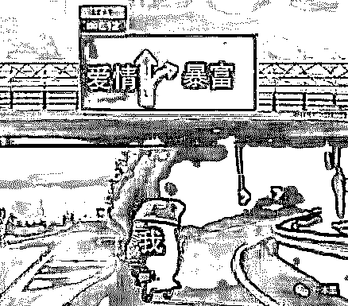
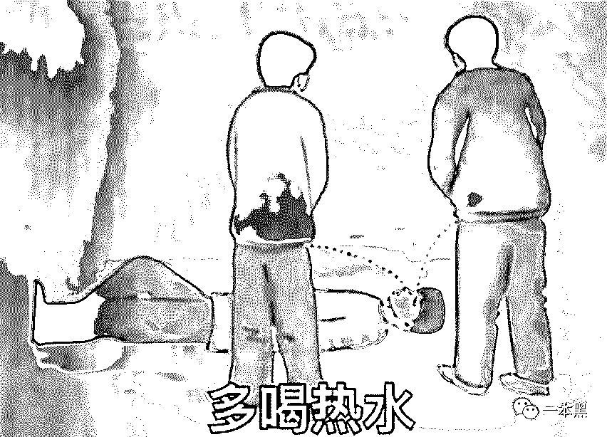

# 菲律宾干博彩日入上万？你他娘的可醒醒吧

> 原文：[`mp.weixin.qq.com/s?__biz=MzU4ODAwNzUwMQ==&mid=2247485905&idx=1&sn=23afd809b167149a079ffb1eefda6a54&chksm=fde218f3ca9591e5a95b27d5715b846c116b4191667bf2fb0cd3635d37973002cdc2ec29d699&scene=27#wechat_redirect`](http://mp.weixin.qq.com/s?__biz=MzU4ODAwNzUwMQ==&mid=2247485905&idx=1&sn=23afd809b167149a079ffb1eefda6a54&chksm=fde218f3ca9591e5a95b27d5715b846c116b4191667bf2fb0cd3635d37973002cdc2ec29d699&scene=27#wechat_redirect)

【地下职业】

**该栏目主要讲述大众看不到的职业故事、人生经历，与黑暗有关、与欲望有关、与人性有关。**

* * *

一本黑的读者里，有不少人是干技术的，我总能收到这样的留言：“老黑，能不能介绍点资源，听说在菲律宾干博彩老挣钱了，现在经济形势不好，干正行赚不到什么钱。”

这样的留言不在少数，每隔一段时间都会有，最让我意外的是，还有不少 20 岁左右刚毕业的学生想踏入博彩这条道。

我知道大家都很焦虑，背负房贷车贷，看着新闻里那些懂点技术就能日进斗金的人，何尝不是一种诱惑。

但我想说的是，也许你看到的只是一些幻象。

确实，这几年关于菲律宾网络博彩的报道越来越多，很多新闻把博彩行业描绘得热闹非凡、财源广进，迷惑了不少吃瓜群众，大家都以为这个行业轻松、来钱快，但殊不知有着各种各样的坑。

其实，任何行业都是行内看门道、行外看热闹，博彩行业也不例外。

现在很多关于菲律宾博彩的报道其实并非完全属实，大多数作者靠道听途说和推测臆想了博彩行业的繁荣。不仅有违报道真实性，还误导了不少年轻人对这个行业的痴迷。

**一**

**很多人都知道，国内干博彩属于违法行当，但菲律宾就不一样了，只要你有合法牌照，就可以在菲律宾合法经营赌博。**

**所以会有很多中国人跑到菲律宾开博彩公司，而大多数博彩公司员工，比如各种做开发的程序员、推广、客服基本都是被所谓的高薪“骗”过去的。**

**为什么说是被骗过去的，这种套路已经写过很多次了，这里就不在多说。**

**今天要说的，主要是黑客这个职业在博彩公司的一些故事。**

**前几年我认识个黑客，暂且叫他老白吧！最初是一名白帽子，后来因为高收入被一福建老板给“骗”了过去，在菲律宾待了四年，一开始在博彩公司上班，后来因为各种矛盾问题，他自己开了一家博彩公司。**

**但他的创业经历可没那么一帆风顺，最终公司倒闭，几年来，他也算是见证了菲律宾博彩行业的发展。**

**前段时间他回国，联系上我，说想和我见面聊聊。我和他约在一家小酒吧，见面的时候已经是晚上十一点。**

**寸头、胡渣、黑色短袖、破洞牛仔裤，嘴唇似乎还有点干裂，不知道是不是因为气候不适应的原因，他的打扮就像电影里，刚从监狱走出来的古惑仔。**

**其实老白并不白，在黑色短袖的映衬下，似乎还有点黝黑。**

**刚见面老白就给我递了一根黄鹤楼，他说他平时也看一本黑的文章，知道我和老师傅爱抽这烟，来的时候在路上买了一包。**

**坐下后，他先是和我寒暄了几句，后面才慢慢打开话匣子，述说了他这几年在菲律宾的情况。**

**“那会不是刚毕业吗？手里有点技术，就跟着一博彩老板去了菲律宾，原本以为能搞到大钱，但其实博彩这行的水深得很。**

**菲律宾很多干博彩的公司，做得比较大的都会有自己的黑客团队，有从国内找过来的，也有其他国家过来的，技术那真的没得说，都是搞劫持和渗透的老手。**

**我在那边认识不少同行，有几个哥们就被一家大公司养着，住在高档小区，平时干活也很轻松，不会像普通程序员一样天天敲代码，有时候还要 996 加班啥的。**

**这群黑客一般一天就干几个小时，只要把任务做完，该打的网站打掉，该拿的数据拿到，基本剩下的时间就是各种泡妹子。**

**平时甚至还会有保镖跟着他们，保护他们的安全，不过说是保护其实就是盯着，防止你乱搞事情。**

****

**有人运气好点，干个几年就能攒不少钱，然后回国洗白干正行，但这是在公司赚够钱且老板人还不错的情况下，完全不具有普遍性。**

**其他更多的人是被高薪骗过来，每天工作 12 小时候以上，证件全没收，住在集体宿舍，每天装成美女骗人下注。”**

**“我还认识一哥们，技术挺不错的，因为贪心想吃两份，他把自己公司的数据高价卖给了同行，最后被老板发现，后果不太清楚，反正不可能好过。**

**这些基本都是大公司才能养得起的黑客团队，一般小公司根本没这待遇，而我当时所在的博彩公司就是一家小公司，当时也是被各种诱惑骗过去的。**

**去之前狗日的老板给我洗脑、描绘了这个行业多么赚钱，但实际上一去就把我的证件给扣了，每天在老板的监视下工作，平时干的活也很单调，就搞搞站拿别人数据。**

**那时候也没见过这种场面，整天担惊受怕，过得相当惨，原本承诺的一样都没给兑换，还时不时被威胁，人身安全都得不到保障。”**

**说到这里，老白端起桌上的酒给我碰了碰杯说：“菲律宾的菠菜可没有妈妈炒的菠菜好吃。”**

**二**

**干黑客这行的，要么用技术干正事，也就是俗称的白帽子，要么就是搞破坏偷数据，这是两个极端，也就是所谓的非黑即白。**

**而菲律宾博彩行业里的大多数黑客，他们的主要工作就是后者，老白在初入博彩行业的时候，就曾帮公司干了不少坏事，在这段经历中，他慢慢摸透了博彩行业的运作模式。**

**破坏、劫持、漏洞攻击，不仅干翻同行，还利用各种骚操作搞推广，玩法上可以说是很下沉。**

**老白从桌上拿起一根烟点上说：“人为财死鸟为食亡，在干同行这件事上，就曾经因为留下痕迹，最后被同行反将一军。**

**那会搞了一个体量差不多的博彩网站，先拿到对方网站的客户数据，再让对方的网站瘫痪，客户无法正常登陆。这样一来，在一边掌握对方客户数据的同时，会让推广人员大力把这群人拉到自己的平台。**

**因为这群人都是玩彩的，转换率自然会高很多，远比其他方式让人上套效率高。**

**黑客攻击的工作一般会安排在晚上，因为这个时段客户的上线率是最高的，攻击手段一般来说是低剁死攻击或者维 C 银翘片（CC）攻击。**

**说人话就是，利用大量的”肉鸡“或者服务器对攻击目标发动大量请求，消耗目标主机的资源，从而使被攻击的目标无法正常提供服务。**

**（肉鸡：也称傀儡机，指可以被黑客远程控制的机器，黑客可以随意操纵它并利用它做任何事情）**

**举个例子，就好比老师傅喜欢抽烟，但一次只能抽一根，我把十包烟全塞到老师傅嘴里，他自然没办法抽，这样下来，老师傅不仅不能展示自己的帅气，嘴巴还有可能会被撑破，这就是所谓的低剁死攻击，是一种恶意的网络攻击行为。**

****

**除了干翻同行，拖同行客户数据，黑客们还会在推广上下一些功夫。**

**最早的推广是直接在百度上打广告，但这条路由于百度的风控越发严格，现在基本上已经行不通。**

**后来又发展到广告联盟、挂外链，大家都见过的就是在有色网站上挂广告引流，那种不断闪动的广告条，都在暗示那些在网站上学习动作交流技术的朋友们，别光顾着学习，快来玩彩票赚钱啊。**

****

**另外，为了让自己的博彩网站可以轻松被客户搜索到，这群黑客会入侵一些比较知名的网站，这种方式叫做劫持，通过在知名、或者权重比较高的网站上挂上自己的链接，当用户一旦点击这个网站，就会自动跳转到自己的博彩网站。**

**打个比方，比如你某天突然看到一个教人“打架”的网站，正怀着激动的心情点进去的时候，却发现网页跳转到了一个博彩网站。**

**你可能会一边心里骂娘、抱怨怎么没有干货，一边会试试这东西到底怎么玩。**

**老白说，有一次大半夜的，紧急接到公司的加班要求，让他们疯狂做流量劫持和关键词劫持、那段时间，老白和自己的黑客团队搞了几万个网站。**

**别的推广方式除了这些外，还有垃圾短信，但从转化率来说，这些推广方式的效果都没有直接偷同行的客户数据来得实在。**

**这就是黑客在博彩公司所干的事，基本就是破坏、攻击、拿数据。**

****三****

****老白在菲律宾待了两年，慢慢摸清了博彩行业的运作模式，他叫上另一个黑客，两人凑了点钱，准备自己开一家博彩公司。****

****他们兵分各路，那哥们负责在网上发布招人信息把人骗过来，老白则负责搞定博彩系统。****

****在菲律宾，大多数博彩公司所用的博彩系统都是由专门的公司开发，一套系统年租金大概在一百万元左右。****

****老白的博彩公司筹备了没多久就开张了，起初因为成本问题，只从国内骗了一个刚毕业的小姑娘过来当推广，好在他们手里掌握了不少同行的客户数据，所以在前期的推广上没费太多功夫。****

****一切看起来都很顺利，不到半年，老白的公司就扩张到了二十来人。但要想在这一行混饭吃，可不是那么容易的。****

****因为前期搞了不少博彩公司的数据，别人也不傻，你既然敢在太岁头上动土，人家照样能把你给办了。****

****所以有段时间他们的网站总是被别人低剁死，导致很多用户反映网页打不开，没法正常使用，次数多了，自己的客户也就自然而然的流失掉了。****

****“这一行就这样，你搞我我搞你，大家都在抢资源”，老白吐出烟圈说道。****

****“最后赚到钱了吗？”我一边倒酒一边问老白。****

****“哎，别提了，赚到钱我还会回国吗？”老白一脸无奈的样子。****

****“其实博彩这一行，你别看现在很多新闻说什么日入斗金，年产值几十上百亿，那都是那些大公司，一般的小公司根本赚不到钱。****

****和金字塔一样，只有站在顶端的人才能分到最多的蛋糕，这一行里有一半的人目前还是在做赔本的买卖。****

****想来菲律宾捞钱？你可醒醒吧！****

********

****博彩公司的经营成本非常的高，光一套系统就够呛的了，加上现在的获客成本越来越高，行业入局者越来越多，导致竞争压力越来越大。****

****老白当时经营了两年的博彩公司，最后算下来不仅一分钱不赚，还赔了一百来万，为了尽快止损，他只能关掉网站。****

****“也算是减少了一些人被害的可能性吧！”老白只能用这种话安慰自己。****

****说到害人，老白说他现在觉得自己真的害了不少人，除了通过高薪从国内骗来的员工，最害人的还得是那些赌博上瘾的人。****

****“有一次我们的一个推广拉到一个客户过来玩彩，这个客户特别相信她，每天嘘寒问暖的，最后一步步陷进去，在平台上充值了一百来万。****

****原本我以为这哥们特有钱，最后才知道，他这些钱都是从各种网贷平台上撸来的。不出意外，他这辈子算是完蛋了。”老白说完一口喝干了酒杯里的酒。****

****四****

****区别于传统赌博，这种线上博彩的形式更能让人上瘾和输掉巨额财产。****

****基本上所有的赌客都会有这样的感受，线上赌博没有实物筹码，金钱对他们来说就是个虚拟的数字，在这种环境下进行下注，并不会产生心理压力。****

****往往在这种时候，赌徒们因为快感，就可能在一瞬间倾家荡产。****

****以往留言求助我的人不少，基本都是在某个博彩平台输了几十上百万，问能不能帮忙把钱给要回来。****

****对于这种人，我一开始会同情他们，但最后想想还不是因为你自己贪，想以小博大单车变摩托，天底下哪有这么多狗屎运非得让你踩到了。****

****玩赌博之前过过脑，这东西就像吸毒一样，但凡沾上了，是很难戒掉的。****

****前几年菲律宾博彩行业确实发展得如火如荼，也有不少人捞到钱然后回国洗白，但如今早已不可同日而语。****

****大量的高薪诱惑依然铺天盖地，无知者前赴后继，沉醉在紫醉金迷挣大钱的幻想中，到头来却发现是一场空。****

****做这行的，不管怎么说都是在害人，干得好的害别人，干得不好害自己。****

****而那些上岸的人也清楚地知道博彩并非长久之计，不管是金盆洗手还是被迫收手，他们其实都知道踏实赚钱才是最稳当的选择。****

****但人总要要撞了南墙才肯回头，那些还沉迷在东南亚暴富梦里的年轻人，正在凭借一腔之勇，义无反顾地朝南墙狂奔而去。****

******但他们却不知，菲律宾的菠菜真的没有妈妈炒的菠菜好吃。******

******在线荷官发的牌，也并不性感。******

********

****还原事实｜专扒黑产****

****微信 ID：darkinsider****

********

****知乎 一本黑****

****微博 一本黑 007****

****投稿、爆料、招聘、转载****

****请联系微信：chenchen_19940612****

****约稿、内容合作、联系：yibenheiSW****