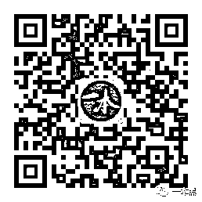

# 如果我不见了，记得来找我

> 原文：[`mp.weixin.qq.com/s?__biz=MzU4ODAwNzUwMQ==&mid=2247485884&idx=1&sn=a0b8311467f22442dafd1ab8c994a841&chksm=fde2189eca959188f869d9e3dd287b4b8cce05348f2300de19c9c0ebc3b9dff54396956a8b2a&scene=27#wechat_redirect`](http://mp.weixin.qq.com/s?__biz=MzU4ODAwNzUwMQ==&mid=2247485884&idx=1&sn=a0b8311467f22442dafd1ab8c994a841&chksm=fde2189eca959188f869d9e3dd287b4b8cce05348f2300de19c9c0ebc3b9dff54396956a8b2a&scene=27#wechat_redirect)

大家好，我是老黑。

很久之前，就有人给我说，你这种曝光灰黑产的写法很危险，说好听点是弘扬正义、惩恶扬善，说难听点你这是在传播 XX。

起初是为了表达，觉得这事儿我们不做的话，照样有人会做。

但当一件事有了传播和关注度那就不一样了，就总有人盯着你，总想抓你的小辫子。

其实，自媒体这行，无论起初三观多正，写着写着，你会发现自己容易变成一个鸡贼的人，往往情不自禁地想要煽动更多人的情绪。

这是人性使然，任何自媒体都不例外，包括我。

所以我一直在纠结所谓的流量、影响力和账号安全的问题，是小范围传播继续表达，让自己的声音一直存在，还是啥都不管闷头就干。

我想总能找到一个能平衡的点。

最近又有不少自媒体朋友的声音消失，相比他们的内容，黑客题材的爆料确实会更 XX。

但如果有一天我不见了，请记得来找我。

（你扫我，还是我扫你？）