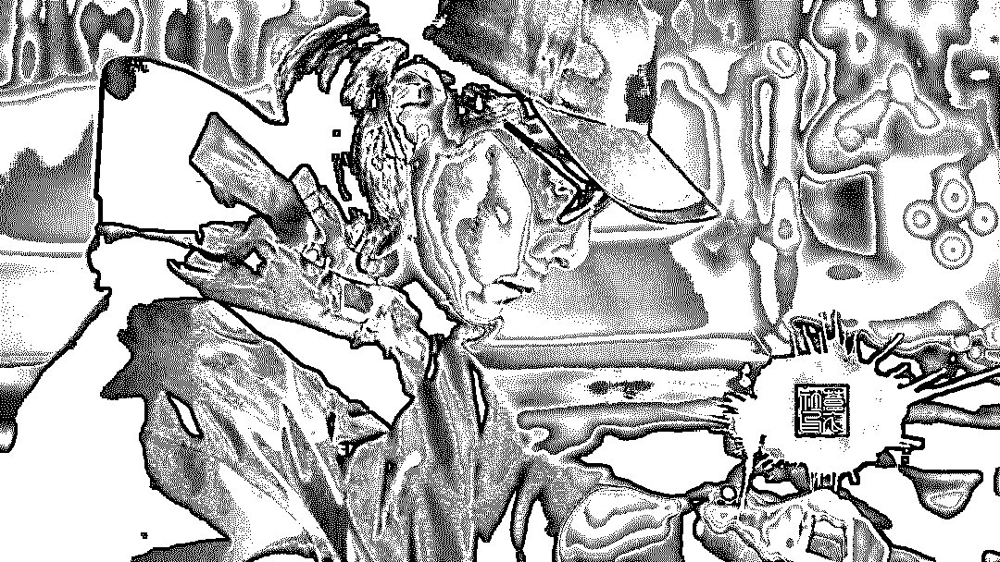
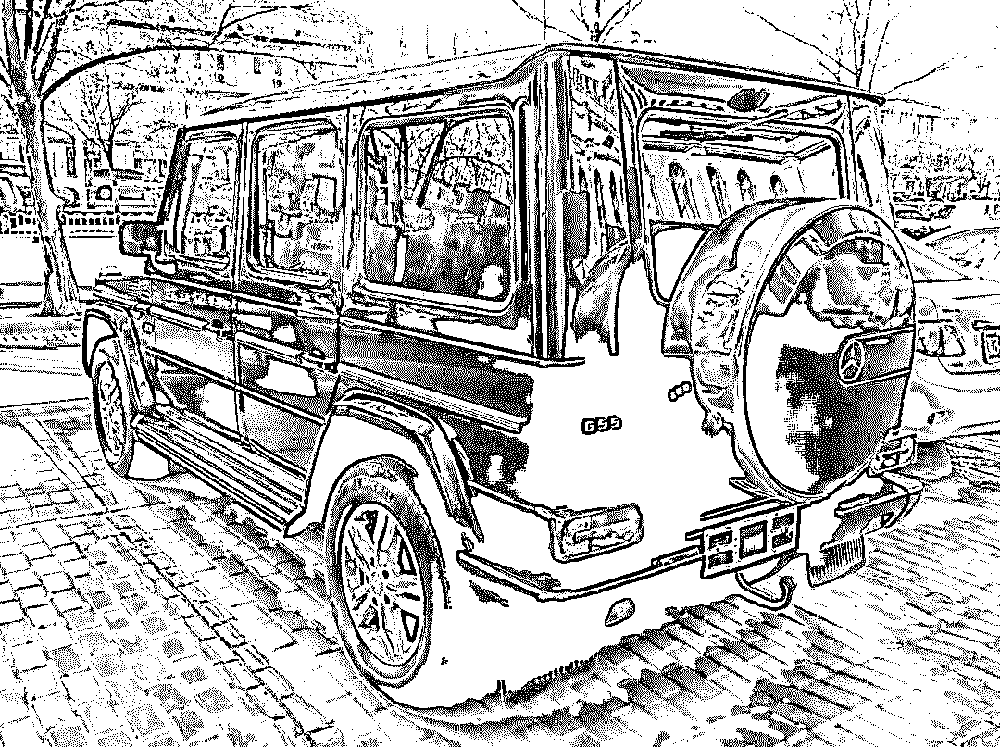
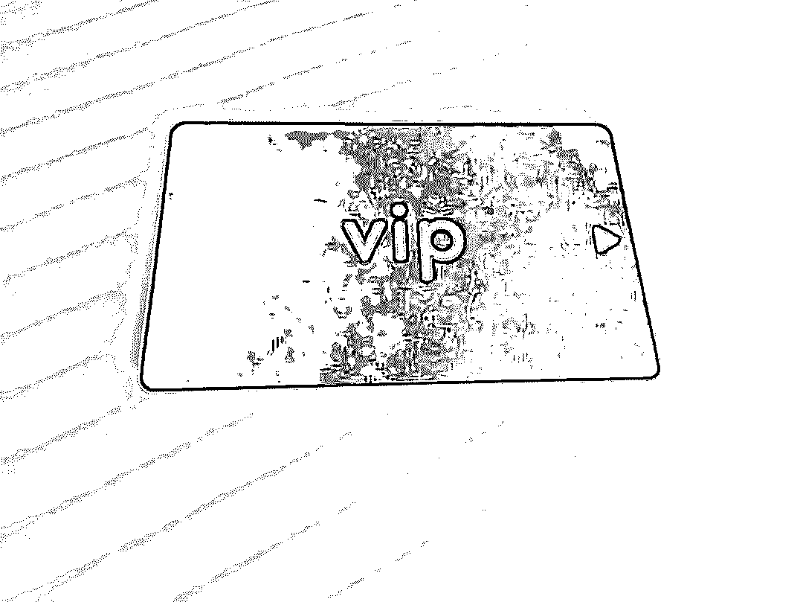
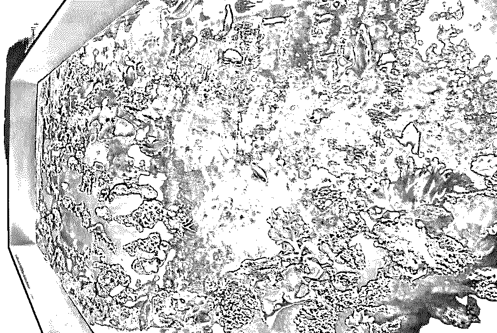
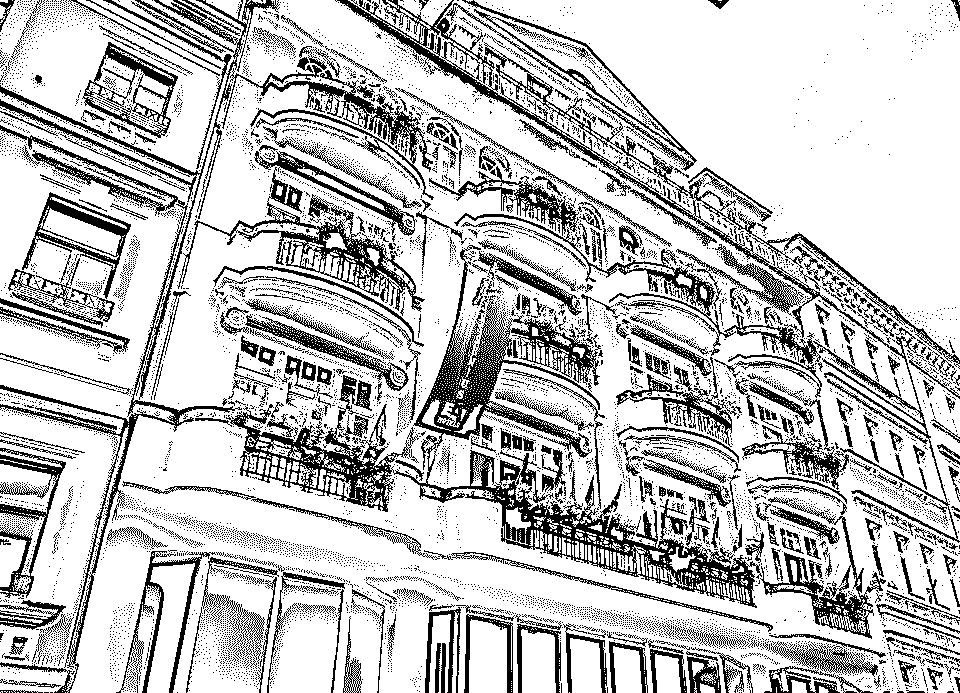
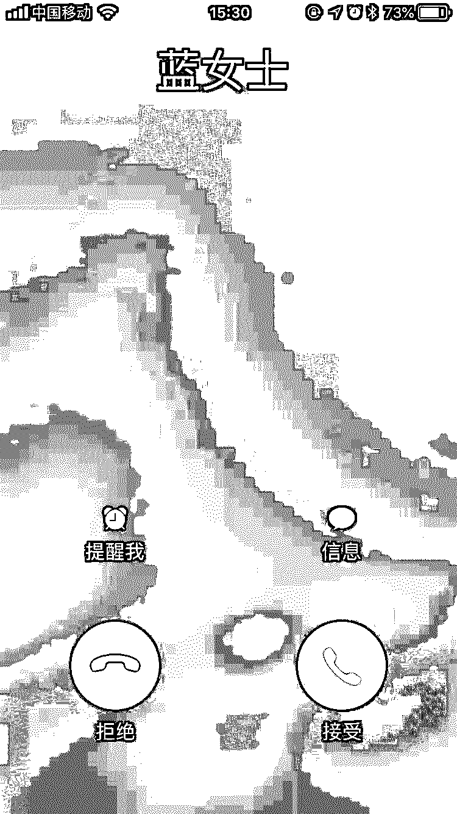
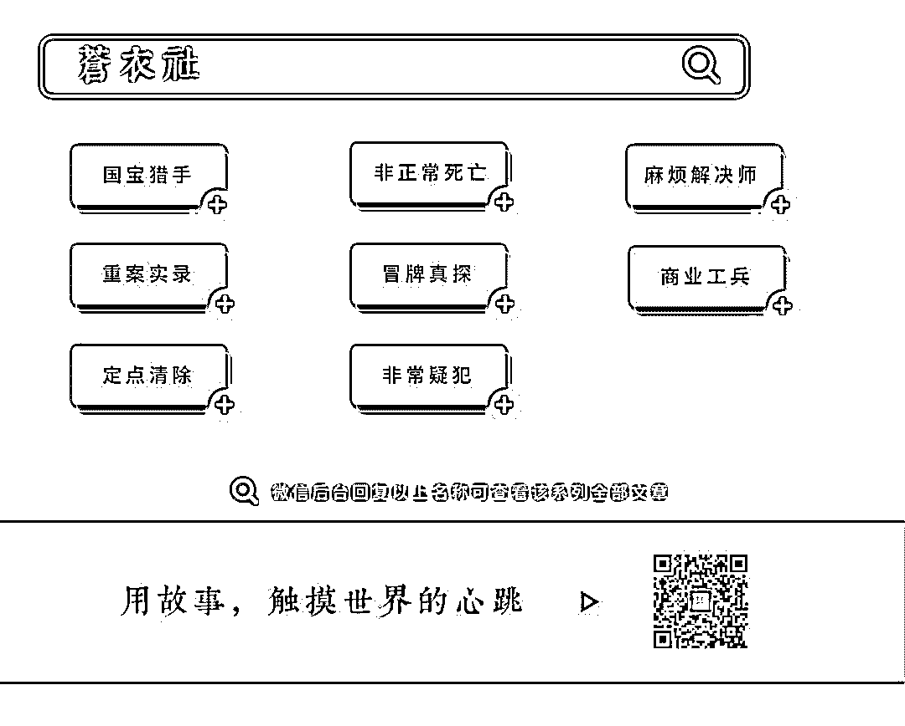

# 卧底北京最隐秘的私人会所，我差点被掰弯

> 原文：[`mp.weixin.qq.com/s?__biz=MzU4ODAwNzUwMQ==&mid=2247485764&idx=1&sn=e421b3be3b597d38fd789ee2553b7fc8&chksm=fde21866ca9591707baa924c69fa1077b96277aa57a18cda2c59e1aaf1ca2901858b34bb7a39&scene=27#wechat_redirect`](http://mp.weixin.qq.com/s?__biz=MzU4ODAwNzUwMQ==&mid=2247485764&idx=1&sn=e421b3be3b597d38fd789ee2553b7fc8&chksm=fde21866ca9591707baa924c69fa1077b96277aa57a18cda2c59e1aaf1ca2901858b34bb7a39&scene=27#wechat_redirect)

大家好，我是老黑。

基于工作的关系，平常会接触到很多隐蔽行业，私家侦探就是其中一个。

我认识一哥们，他叫金宇，是个警校肄业生，他和朋友鸣哥就曾经有过这么一个经历。私家侦探原本是隐秘而严肃的职业，但这两人半路出家，总会发生一些啼笑皆非的事。今天拉来金宇给大家讲个故事。

干私家侦探这行，平时接触的案子百分之八十都和婚外情有关。

这些案子我一般不会写，类似的事情见过太多之后，会觉得特无聊，来来去去就是那点事儿，真心没什么看头。

不过我还蛮喜欢接这类案子的，原因很简单——活儿好干，来钱快。

经手这么多婚外情案件后，我发现其中有个规律——不论男女，只要其中一方出轨，另一方都会展现出惊人的洞察力。尤其是女人。

上次我和鸣哥从山西回来之后，没过两天，鸣哥就接到一个神秘的婚外情调查委托。

为什么说神秘呢？因为自始至终我们都没跟客户见过面，全程电话沟通。

原则上讲，每次接活儿，我们都会要求跟客户面谈，这样双方才会建立信任关系。毕竟现在打着私家侦探的名头招摇撞骗的人太多了，别说客户怕被骗，我们也怕白忙活一场。

电话里，客户的自我介绍无比简短，只告诉我们，她姓蓝，让我们称她为蓝女士。

蓝女士的声音偏中性，冷冷清清的，有种莫名的吸引力。

事情从蓝女士在微博上看到一张女网红的照片开始。

女网红长得很漂亮，网红标配，瓜子脸，高鼻梁，眼睛比常人要大一圈，身材也是那种男人一看就会想入非非的前凸后翘型。

当蓝女士看到这张照片时，一眼就断定是在自己家里拍的。

女网红的自拍照背景一半是天空，一半是树林，选择拍摄的位置和角度都很不错。

这些看似平常，不过蓝女士确信，这张照片只有站在她家客厅的落地窗前才拍得出来。对于自家后院的一草一木，蓝女士都再熟悉不过，她说自己绝不会看错。

一个陌生的美女网红在自家落地窗前拍了一张照片，很明显——她丈夫出轨了。

果然，每个女人在捉奸时都是福尔摩斯。

蓝女士用了不到五分钟的时间就把这件事讲得清清楚楚，然后告诉我们，只要我们拿到她丈夫出轨的证据，她会支付十万块酬劳。

鸣哥告诉蓝女士需要先付一半的定金，而且最好能面谈一下。

蓝女士说定金没问题，不过不方便跟我们见面，让我们直接把银行卡号发给她。

鸣哥想了想，反正调查婚外情也没什么难度，就同意了。

五万块很快到账，蓝女士又用短信发来了他丈夫的个人信息，照片，以及女网红的微博名。

这时我才发现，整个委托过程从开始到结束竟然没超过十五分钟。

★★★

得到这些资料后，鸣哥本着女士优先的原则，先打开微博，在搜索栏输入了女网红的微博名。

女网红的微博名是一串以 L 开头的英文，鸣哥问我这英文名怎么念。

我憋着气看了半天，也没拼读出来，“这什么鬼名字，真特么拗口。”

为了方便记忆，我俩索性给她起了个简称——艾露（L）。

艾露有十万粉丝，算是一个小网红。她的微博注册时间是 2016 年，一共发过七百多条微博，每条微博基本都有上百点赞，评论和转发也不少，粉丝活跃度很高。

最近一条微博是在一家高档的西餐厅里的照片，桌上摆着一盘还带血丝的牛排，手上端着一杯红酒。虽然没有露脸，但有意无意地秀出了左手食指上一枚镶着碎钻的银色戒指。

我看不出这戒指什么牌子，只觉得挺高级的，问鸣哥：“这戒指看着不便宜，怎么着也得三四万吧？”

“卡地亚镶钻白金戒指，十多万吧。”

好吧，这很粗暴，贫穷限制了我的想象力。

我们仔细看了看她的微博内容，除了发一些自拍和生活照之外，她还会发很多名牌包包的照片，不过不单是为了炫富，她在做生意——海外代购。

她在微博上的人设是一名留学美国的富二代，喜欢世界各地旅游。特别宠粉，几乎每条评论都会回复，经常帮粉丝代购名牌包包，偶尔还会低价卖一些自己闲置的包，深得粉丝喜爱。

鸣哥咂摸着嘴：“你说这姑娘长这么漂亮，也不差钱，为什么非去勾引人家老公。”

我觉得不能一锤子就下定论，反驳鸣哥：“万一人家是真爱呢？”

鸣哥一脸不屑：“拉倒吧，我要是有一个亿，我也能找个美女网红玩真爱。”

女网红的信息我俩就先了解到这里，没有再深入调查。毕竟，私家侦探的工作不包括多管闲事，我俩只需要拿到蓝女士老公出轨的证据就行了。

蓝女士的丈夫姓姜，42 岁，某上市公司高管，妥妥的成功人士。

看姜先生的照片，身材保持得很好，穿一身黑灰色的高级西装，梳着一个背头，全身上下都散发着精英气质。如果不是事先知道他已经四十多岁了，绝对会认为他只有三十出头，可以说是中年油腻大叔的反面写照了。

姜先生的常用座驾是一辆奔驰 G500，车牌号是京 H 开头。除了姜先生的公司地点之外，蓝女士还给了几个他常去的场所地点，有私人会所，高尔夫球场和高档酒店。

看完这位姜先生资料，我察觉到这件事并不是想象中那么简单。越是有身份地位的人越是难以接近，调查难度也是成倍增加。

“鸣哥，这单活儿有点棘手啊。”

“嗯，你看他常去的这些地方，哪个不是高档场所，特别是这私人会所，我估计一般人都进不去。”

鸣哥叹了口气，“不过定金都收了，不能砸招牌，硬着头皮咱也得把这事儿给办喽。”

★★★

我和鸣哥商量后决定，还是先按老套路开始——跟踪。

姜先生的公司位于海淀区，离我们住的管庄比较远，第二天早上七点钟我们就出发。北京的交通状况有目共睹，一个小时的路程硬是开了一个半小时，气得鸣哥路怒症都犯了，差点把方向盘给砸坏。

根据蓝女士给的地址，快九点钟的时候，我们来到了姜先生公司所在的大楼，鸣哥把车停在大楼外的马路边。

我俩准备等姜先生的车一到，先偷偷安上定位器，以便随时掌握他的行踪。

这时，上班族陆陆续续地走进大楼。

我和鸣哥从九点一直等到十点四十，一辆霸气的黑色奔驰 G500 从路东驶来，正是姜先生的座驾。

等奔驰开进大楼停车场后，我和鸣哥立马下车跟了过去。一个穿着修身西装，带着墨镜的男人从奔驰后座上下来。虽然没见过真人，不过我和鸣哥都很肯定，这个人就是我们的目标——姜先生。

姜先生下车之后，径直走进大楼。司机把车往前开了一段，转了个弯，把车倒进了停车场左下角的一个车位上。

鸣哥的梦想

司机在车上，安装定位器很容易被发现，我问鸣哥：“车上有人，咱们怎么放定位器？”

鸣哥没说话，做了个回撤的手势。

我俩回到车里，鸣哥一边发动汽车一边跟我说：“司机也是人，只要是人就有松懈的时候，他一松懈咱们就有机会。”

鸣哥把车往前开了二十米，伸手指着窗外，“你看，从这里看过去，正好能看到车里。”

说完，鸣哥递给我一支小望远镜，把车窗打开十公分。

我仰起头，把望远镜伸到车窗外，往停车场一看。果然，看得清清楚楚，司机是个三十多岁的男人，正坐在驾驶位上，双手横拿着手机，应该是在玩游戏。

过了半个小时，司机伸了伸懒腰，把座椅放倒，躺着开始闭目养神。

“机会来了，”鸣哥拍了拍我肩膀，“你在这儿等着，我去安定位器。”

一般安装窃听器和定位器的事都是鸣哥去弄，他对这些玩意比我精通。鸣哥去后座把定位器拿出来，直奔停车场。

不到三分钟鸣哥就搞定了。

中午我去附近找了家饺子店，打包了两份饺子，我和鸣哥在车上把午饭给解决了。

一下午，奔驰车都没挪动过。期间司机去便利店买了点吃的，一直等到晚上七点半，姜先生才从楼里出来。

虽然这一天啥也没干，不过在车里坐久了，也挺熬人，浑身发酸。

我和鸣哥开车跟了奔驰不到二十分钟，蓝女士发来一条短信，说她丈夫现在正在回家路上，如果我们正在跟踪的话，就不用继续了。

我特惊讶，“我靠，这蓝女士是什么人啊，怎么有种我们一举一动都尽在她掌握之中的感觉？”

鸣哥摇头说不知道，“北京卧虎藏龙，别瞎琢磨了，干该干的活，拿该拿的钱。”

★★★

我俩就这么连续跟了三天，没发现姜先生有任何异常，他每天基本就是两点一线——公司和家。

直到第四天，晚上七点钟，姜先生从公司出来，没有直接回家，而是去了朝阳区五环附近的一家私人会所。这家会所并不在蓝女士所提供的她丈夫的常去地中。

这家私人会所外面没有挂牌，门口没有停车，不过在不远处的路边，零零散散地停着七八辆豪车，其中就有姜先生的奔驰。

会所一共五层楼，从外表看，甚至有些破旧，门窗紧闭。一楼入口是一扇暗红色的厚重木门，姜先生进去的时候，我瞄到有两个门卫站在里面接待。

很明显，这是一家不对外开放的私人会所，我有点泄气，跟鸣哥说：“这种不对外开放的私人会所，咱俩肯定是进不去啊。”

鸣哥也是一脸愁容，点了根烟，想了一会儿，然后掏出手机：“我问问蓝女士吧。”

鸣哥给蓝女士发完短信，过了两分钟，蓝女士回过来短信，让鸣哥留一个地址，明天她让人给我们送一张私人会所的会员卡，卡是不记名的，让我们放心用，拿着卡可以享受会所里的所有服务，不用另外掏钱。

第二天早上七点多，我和鸣哥刚起床，就听到有敲门声。打开门一看，门口放着一个信封。我拆开信封，里面有一张黑卡。卡片上没有文字，仅有一串数字编号。

一张神秘的黑卡

信封里还有一张纸，大概给我们介绍了一下这家私人会所的情况。

会所一共五层，每个楼层的服务功能不同。一层不开放，二层有餐厅、酒吧、雪茄吧，三层是按摩洗浴中心，四层则是提供房间休息的地方，最后一层是一个小型赌场。

鸣哥咂摸着嘴，“就冲这设置和服务，估计这 VIP 卡的入会费一年至少得六位数。”

去那种高档私人会所，穿得太寒碜，肯定会被人注意到。

于是我和鸣哥先去朝阳区建国路的一家阿玛尼专卖店，一人置办了一件衬衣和一条休闲裤，光这四件衣服就花了将近一万块。

从阿玛尼店里出来，鸣哥捂着胸口唱了一路张学友的《心如刀割》。

★★★

又跟踪了两天，周六晚上，姜先生去了上次那家私人会所。

我和鸣哥穿着新买的阿玛尼，带着黑色 VIP 卡，再次来到这家私家会所。等姜先生进去二十分钟后，我们才推开了暗红色的大门。

一推开门，首先映入眼帘的是一个昏暗空荡的大厅，大概有二十多平，暗黄色的大理石地板显得有些冰冷，两侧墙壁都钉着棕色木板，走廊尽头是一个普通升降式电梯，感觉很怪异，就像进入异世界，瞬间与门外的车水马龙隔绝。

两个一米八几，穿着黑衬衣的平头大汉站在门口拦住我们，用低沉的嗓音说了句“欢迎光临”。

鸣哥用食指和中指指尖夹着卡片递给大汉，大汉接过去看了两眼，双手拿着卡片还给鸣哥，微微鞠躬，伸手向电梯方向做了个请的姿势。

讲实话，我跟鸣哥都是第一次来这种地方，说不害怕是假的，不过不是怕遇到危险，而是怕不懂规矩，出糗，被人家给看出来。

鸣哥毕竟江湖阅历深，稍微比我镇定些，不过我还是瞥到他偷偷在裤腿上擦了两把手汗。

我看着几个按钮，不知道该按哪层，问鸣哥：“鸣哥，咱去哪层？”

鸣哥按下二楼的按钮，“从第二层餐厅开始吧，不就是会所嘛，又不是龙潭虎穴。”

电梯的速度不快，大概过了五六秒，电梯门打开。一瞬间，橘黄色的灯光射入眼中，一名穿着黑色小马甲的服务生站在电梯口替我们挡住电梯门，递过来两条毛巾。

我和鸣哥不动声色，拿过毛巾擦了擦手汗。

电梯外面是一条长廊，长廊的地上铺着黄白相间的花纹地毯，踩在上面没有一点脚步声，服务生微笑着示意我们跟着他走。

长廊有二十多米长，尽头是一扇深棕色的雕花大木门。

右侧挂着一些油画，还都是抽象派，对于我和鸣哥这种浑身充满了艺术细菌的人，完全看不懂，更别说欣赏了。

左侧是一个和长廊等长的水族箱，白色的射灯打在水箱里折射出非常漂亮的光晕，好多种五颜六色叫不出名字的热带鱼在里面游来游去，仿佛置身于海洋馆。

镶嵌在墙壁中的水族馆，就是这么壕

一边是海洋馆一边是油画展的设计，我还是第一次见，这家私人会所果真是别有洞天，品味不俗。

我和鸣哥连走路都变得紧张起来，我的大腿肌肉不受控制地开始紧绷僵硬。门口的一名服务生看到我们过来，替我们拉开大门。

门一开，耳边就传来优雅的小提琴声。

一个将近两百平的大餐厅展现在我俩面前，全欧式装修风格，顶部是一盏直径两米的水晶大吊灯，大厅里面立着三根金色的雕花立柱，灰色的地毯覆盖着整个大厅地面。

大厅中间是一个小舞台，一名长相帅气的长发青年正微闭着眼睛拉小提琴。大厅的右侧是一个吧台，吧台前坐着两个窃窃私语的女人，年轻的男调酒师正全神贯注地调着酒。

七八个卡座，分散在大厅里面。

一瞬间感觉像是走进了五星级酒店，不，应该说这种奢华感已经超过了五星级酒店。

大厅里人不多，只有三桌客人。我快速地扫视了一圈，突然发现姜先生正坐在大厅的左上角，靠近窗户的一个位置。跟他在一起的还有一个微胖的中年男人，以及两个女人，不过距离太远，看不清这两个女人的脸。

我刚想提醒鸣哥，鸣哥却一把拉住我的胳膊，我微微扭头，看到鸣哥给我使了个眼色，示意我不要说话。

我跟着鸣哥往前走，深吸了两口气，尽量让自己镇静。我俩不动声色地坐在姜先生斜对面的卡座上，倒也没有引起任何人的注意。

坐下之后，我偷偷瞄了好几眼，才敢确认，其中一个女孩就是艾露。不是我脸盲，也不是我记忆力差，是因为那桌坐着的俩女孩都是标准网红脸，辨识度的确不高。

我和鸣哥用眼神交流了一下，表示目标已经确认。

★★★

为了今天这趟会所之行，我和鸣哥可以说是全副武装，鸣哥连眼镜偷拍器都戴上了。为了以防万一，我俩还一人带了一把匕首。

所以说私家侦探这行真不轻松，没点胆量，一般人还真干不了。

我俩坐下不到五秒钟，一个穿着白色衬衫的女服务员走过来，弯腰微笑着问我和鸣哥需要点什么？

我和鸣哥对视一眼，俩人眼睛里都是同一个字——懵。

没有菜单，我俩该点什么？

我迅速扫了一眼四周，发现真正吃饭的并没有几个，大部分都在喝酒，或者喝果汁，外加一点甜品小吃之类的。

我急中生智，挤出一个帅气迷人的笑脸，冲服务员伸出两根手指：“两杯马天尼，再来一份水果拼盘，谢谢。”

马天尼作为鸡尾酒之王，选它绝对没错，真正懂鸡尾酒的人一般都喝这个。

不到五分钟，两杯马天尼和果盘就端了过来。

我和鸣哥肯定没有心情吃东西，一直注意着姜先生和艾露那边，因为角度问题，鸣哥的眼镜偷拍器拍不到正面，只能看到几个晃动的人头。

姜先生说话很小声，和艾露之间也没有什么亲密的举动，我和鸣哥只能按兵不动地等待时机。不过我相信，他们来这里绝对不会只是吃东西这么简单，一定还会有其它项目。

现在可以确定的是，姜先生和艾露肯定是有一腿。我们跟着姜先生进来的时候并没有碰到艾露，显然艾露先一步来会所等他，目的就是防止被人撞见。他们把这家会所当作幽会地点，因为这里够隐蔽，普通人根本进不来。如果我们没有蓝女士提供的会员卡，肯定也进不来。

他们俩人离开的时候肯定不会一起离开，所以我们一定要在会所里拍到姜先生出轨的证据。

过了大概不到十分钟，我和鸣哥的马天尼还没喝完，就看到姜先生那桌四个人都起身往门外走。

我和鸣哥没有说话，等到姜先生他们四个人踏出大厅，我们同时起身朝门口走去。

快步走出大厅，等我们走到电梯口的时候，姜先生四人刚踏进电梯，不等服务生说话，我就抢先按了上楼的按钮。

电梯里的四个人同时看向我们，我和鸣哥冲他们笑着点了点头，侧身步入电梯。

电梯里，姜先生正搂着艾露的腰，他身边的中年男子也搭着旁边另一个女孩的肩膀。

在我和鸣哥进电梯之前，他们已经按了四楼，我和鸣哥就直接跟着他们上了四楼。

电梯上升很快，出电梯之后，两名服务生立刻迎了过来，姜先生走在前面冲服务生说：“两个房间。”

“好的，这边请。”一名服务员带他们四个人往走廊右侧走去。

跟二楼一样，电梯外依旧是一条走廊，走廊两侧是两排房间，跟酒店一样。

另一名服务生问我们：“两位，需要几间房？等会有女伴来吗？”

服务生说完，我立刻就反应过来，这地方不就是特么的“P 房”吗？

没有女伴，两个大男人开什么房？可是如果不把握机会的话，下次不知道要等到什么时候，我跟鸣哥实在是不愿意就此离开。虽然刚才在电梯里拍到了姜先生搂着艾露的照片，不过当做出轨证据的话还不够。

我正纠结这事儿该怎么办的时候，突然感觉一只大手摸上了我的屁股，低头一看，鸣哥的一只手正放在我的屁股上，紧接着，他又顺势搂住我的腰。

鸣哥嘿嘿笑道：“小伙子，我们不等女伴，你给我俩找个房间，要隔音好点的。”

服务生不动声色：“好的，这边请。”

这时我才恍然大悟——我特么被掰弯了！

★★★

整个四层房间并不多，只有八间房，电梯左边没有走廊，被一堵墙封着，右边的走廊两侧分别各有四间房，错落相对。

我们说话的时候，姜先生一行四人已经走进房间，胖中年人和一个女孩住进了走廊左侧的第一间房，姜先生和艾露在他们隔壁。

紧接着，服务生把我们安排在了姜先生和艾露的隔壁，把房卡帮我们插在插卡器上。

进门之后，我赶紧把鸣哥的手打开，我一个钢铁直男竟然被摸屁股了，简直是奇耻大辱。

“我靠，鸣哥，下次能不能提前让我有个心理准备啊。你这突然给我来这么一下，我鸡皮疙瘩都起了一身。”我强烈表示不满。

鸣哥悻悻地笑了笑：“紧急情况，不就摸了一下屁股嘛，别在意，哈哈。”

“切。”我摆摆手，懒得再说。

当下也顾不上跟鸣哥生气，毕竟还是任务要紧，我和鸣哥先在房间里转了一圈，感觉跟普通的五星级酒店差不多。进门右侧是洗手间，往里走是卧室，卧室与阳台的门可以打开，阳台外面放着一张白色沙滩桌，两把椅子。

我打开阳台门往两侧看了看，发现跟隔壁的阳台相隔三米左右，要跨过去基本不可能。

鸣哥在旁边说：“太远了，没工具肯定过不去。”

类似这种阳台

“要不咱们叫服务员进来，从他那里偷张房卡，然后假扮服务员，进去拍照片？”

“你当是拍电影呢？007？一定要记住，安全第一，要留退路，不到万不得已别犯险。”

我一想也对，这么一来直接就暴露了，这私家会所的安保力量肯定不弱，到时候怎么逃跑是个大问题。

“那现在怎么办，如果要拍到他们的亲密照，肯定要进房间啊。”

鸣哥点了一根烟，皱眉思索了两分钟，“我去看看楼道里有没有摄像头，如果能制造出一些混乱，说不定有机会进他们房间放针孔摄像头。制造混乱最简单的办法，就是触发楼道里的烟雾警报。”

鸣哥去楼道里勘察了几分钟，回来后一脸沮丧：“行不通，楼道里有两个摄像头，而且没有死角，如果烧东西触发烟雾警报，一定会被拍到，到时候还没等进去装好摄像头，估计保安就把咱俩给抓住了。”

我和鸣哥当天晚上在酒店里商量了俩小时，把能想到的办法都模拟了一遍，没有一个能行得通。

临走时，为了不引起怀疑，我们还刻意把床上弄得像是经过一场大战一样。

今天是彻底被掰弯了。

当天晚上开车回去之后，鸣哥把我放下，又开车去了酒吧，用他的话说：人在放松的时候点子最多。

回去之后我也睡不着，打游戏打到两点多，等我睡的时候鸣哥还没回来。

第二天早上我醒来时已经十点半，我去鸣哥卧室一看，鸣哥睡得跟死猪一样，叫了半天都叫不醒。

鸣哥一直睡到下午三点，醒来就说了两句话：“今天不调查了，帮我定份外卖。”

鸣哥吃饱喝足后，点了根烟，躺沙发上看起了电视。

看着鸣哥悠然自得的样子，我特无语，就问他：“鸣哥，这件事咱接下来该怎么查？总不能在家里坐着吧？”

鸣哥笑笑：“着什么急嘛，我已经想到一个办法了，等下次他再去会所的时候就能派上用场。”

“真的假的，什么办法？”

鸣哥故作神秘，“到时候你就知道了。”

鸣哥这人就喜欢玩神秘，不过既然他这么说了，应该是有一些把握的，我也不再多问，任由鸣哥去准备接下来的行动计划。

接下来的几天，我和鸣哥依旧时刻注意着姜先生的行踪，一直等得到周五晚上，定位显示，姜先生再次坐车前往那家私人会所。

★★★

我们住的地方离那家私人会所不算远，我和鸣哥没跟着姜先生的车，而是先他一步来到会所。

现在已经确定，这家会所就是姜先生和艾露的幽会地点。姜先生每次都是下班后直接过来，过来之后会先去二楼吃一点东西，再去四楼开房。我们先他一步来的话，可以避免被怀疑。

到会所之后，我俩先去四楼开了一个房间，然后下二楼餐厅点了一些吃的。

我们刚坐下没多久，穿着吊带热裤，性感火辣的艾露也来到餐厅里面，挑了一个中间的位置坐下，跟我们隔着大概有六米远。

过了十分钟左右，姜先生一个人走进餐厅，坐到艾露旁边，俩人开始窃窃私语。

吃了大概不到二十分钟，姜先生和艾露起身准备上楼，鸣哥轻轻地敲了敲桌子，然后冲我使了个眼色，我立刻意会，胳膊轻轻把高脚杯往怀里勾了勾，红酒瞬间就撒了我一身，白色的阿玛尼衬衫上一片暗红。

我立马站起身，两根手指捏着衬衫，提高嗓门：“哎呀，酒撒我身上啦。”

鸣哥帮我拿纸擦了擦，不过肯定是擦不掉，他说：“你看你，怎么这么不小心，快上去换一件吧。”

这时，餐厅里所有人的目光都聚集在我俩身上，我装作一脸不高兴的样子，转身快步往门外走。姜先生和艾露还偷偷回头看我，嘴角微微咧起。

我跟俩人一起上了电梯，到四楼之后，服务生带他俩去开了一个房间，就在我和鸣哥的斜对面。

把酒撒身上，然后跟着他们上楼，确定他们的房间位置，这些都是我和鸣哥提前设计好的，为了演好这出戏，我不得不牺牲自己的色相。

换好衣服之后，我给鸣哥发微信，让他上楼。

我从包里掏出一包用卫生纸包着的烟灰，把烟灰洒在床头柜上，鸣哥也从口袋里抓出十几根提前从浴室地漏收集来的头发，放在浴缸里面。

做完这一切，鸣哥出门在楼道里喊来服务生。

服务生小跑过来，“你好先生，请问有什么事吗？”

鸣哥侧身请服务员进房间，“来来来，你看看，你们的房间卫生怎么做的？又是头发，又是烟灰！”

鸣哥领服务员看了看头发和烟灰，服务员立马鞠躬道歉，说给我们换房间。

服务员先是想给我们换到隔壁，隔壁是走廊尽头，我说不行，我们不住走廊尽头的房间，不吉利。

服务员被我们刁难得冷汗都流下来了，赶紧又给我们安排了一间房，就在姜先生他们隔壁，正合我们心意。

★★★

关上房门，我问鸣哥：“鸣哥，你到底准备了什么秘密武器，现在该拿出来了吧？”

鸣哥“嘿嘿“”笑了笑，拉开自己的手提包，从里面拿出一根三十多公分长的碳合金棍子，我还没问他这时啥东西，鸣哥就双手握着棍子，用力一抽，棍子变成了六十多公分，再一抽，又长了一截。

“看到没有，定制版自拍杆，三米长，伸缩自如。”

整了半天，鸣哥的秘密武器就是加长版自拍杆，不过这倒也是个办法。

事不宜迟，鸣哥拿出 Go Pro 相机，把它安装在自拍杆的顶端。

一切准备就绪，我俩走到阳台，看到隔壁姜先生他们的窗帘已经关上了，不过这些房间里的窗帘都比较短，下面会露出大概六七公分的宽度，而且中间部分也会有缝隙。

我和鸣哥慢慢把自拍杆伸了过去，自拍杆不重，不过还是需要两个人才能抓紧。

自拍杆伸过去架在对面的阳台地板上，鸣哥掏出手机，打开跟 Go Pro 相机匹配的 APP，这样可以直接在手机上看到相机拍摄的画面，拍摄的时候只需要在手机上操作就可以。

“怎么样，能不能拍到？”我蹲在鸣哥对面，看不到他的手机。

“嘿嘿，有点劲爆哦，我多拍几张。”

鸣哥拿着手机，脸上露出一丝淫荡的笑容，看得我一阵鸡皮疙瘩。

这时，突然一道强光从下面照射上来。

我心里暗道一声“不好”，往下一看，楼下一个保安正拿着手电筒往上照，我和鸣哥赶紧把自拍杆收了回来。

等我们起身的时候，楼下的保安已经跑得不见踪影。

“他们肯定要来敲门，鸣哥，咱从哪跑？”我能感觉得心脏噗通噗通的。

鸣哥锁着眉头没说话，把自拍杆收缩了一半，然后拿着手机和 Go Pro 相机一阵鼓捣。

“把衣服脱了。”

我没反应过来：“什么？”

“快脱衣服，来不及了！”

鸣哥说完，迅速脱掉自己的上衣，连裤子也脱了，全身上下只剩下一条内裤。

我当时也管不上那么多，赶紧像鸣哥一样把衣服脱掉。

脱完衣服，鸣哥一把搂住我，拿着自拍杆，用 Go Pro 狂拍照片。

突然，门口传来一阵急促的敲门声。

鸣哥：“谁啊？”

“先生，请开门。”

鸣哥走过去把门打开，瞬间冲进来五个酒店工作人员。他们看到床上的自拍杆和 Go Pro，不由分说地拿起来，“这是什么？”

“相机啊，哎，你们进来干什么？”鸣哥的气势一点不弱，再加上一身腱子肉，蛮有威慑力。

其中一个领头的男人，打开 Go Pro，在相册里翻了半天，脸色越来越难看。

“我们俩喜欢拍照片，你们连这个也管？你们会所就是这么服务客人的吗？”我一把拿过 Go Pro，冷冷地说道。

领头的男人瞪了一眼身后发现我们的那名保安，一脸怒气。

“先生，不好意思，是我们搞错了，实在是抱歉，我们也是为了客人的安全着想，阳台这么高，请注意安全。”

说完，给我们鞠了一躬，领着一帮人退出房间。

人一走，我和鸣哥都长舒了一口气。

我俩是一分钟都不想在这儿多待，穿上衣服，收拾好东西，迅速下楼离开。

“鸣哥，你把照片都删了，咱不就白忙活了吗？”我一屁股坐在床上，有点泄气。

鸣哥举起手机，“这么低级的错误我怎么可能犯，刚才我就已经云备份了，回去下载下来就 OK。”

我这才恍然大悟，还是鸣哥的手段高明。

为了防止被人跟踪，当天晚上我俩在五环边上绕了一个多小时，确认安全之后才开回家。

第二天早上，鸣哥联系了蓝女士，把拍到的照片通过彩信传给了她。传完彩信，五分钟后，五万元尾款打到了鸣哥的账户里。

这件事结束之后，我和鸣哥在家里睡了整整两天。

我俩刚缓过劲，鸣哥又接到了蓝女士的电话。

神秘蓝女士的来电

蓝女士：“我见过艾露了，给她 100 万让她离开我丈夫，没想到被她直接拒绝了。你去帮我查查她的底细，我要在不牵涉我丈夫的情况下，拿到足以让她身败名裂的证据。”

经过姜先生这件事，我和鸣哥都有些后怕，鸣哥不打算接这单活。不过还没等鸣哥把拒绝的话说出口，就收到了银行发来的短信，提示十万元已经到账。

“定金十万，事成之后还有十万。”

*文中图片均来自网络，仅用于补充说明，与内容无关。

* * *

金宇写的《冒牌真探》系列在我朋友脸叔 苍衣社（ID：cang1she）公号上发表，说来我们还是通过脸叔认识的。

脸叔早些年干过调查记者，身边有一堆狐朋狗友。**他干苍衣社******的初衷就是**卧底那些少为人知的职业领域，****聚集一批特殊的当代“职业侠客”，****挖掘惊心动魄的故事，打造一个专属于这些人的“都市江湖”。**

上线一年多，苍衣社推出了七个系列：私家侦探金宇的**冒牌真探系列**，信息工程师（拆窃听器的）阿鬼的**商业工兵系列**，金牌法医刘晓辉的**非正常死亡系列**，文物研究生肖然的**国宝猎手系列**，私人订制专家林欢的**麻烦解决师系列**，十年刑警刘星辰的**重案实录系列**，GPS 拆解师朱星的**定点清除系列**。

所涉作者，各有传奇，都是各自行业里的佼佼者；所涉行业，林林总总，有的刀尖舔血，有的隐秘奇绝，既带感又得劲。

当然这些职业都涉及到一定的隐私，所以苍衣社的内容都是基于事实基础进行改编，严格意义上来说，是半虚构故事系列。但是，精彩度堪比大片，欢迎关注。

金宇这事其实根本没结束，蓝女士下一单活具体是怎样

扫描下方二维码微信后台回复【蓝女士】自提取阅读

【苍衣社】后台回复以上名称可查看该系列全部文章