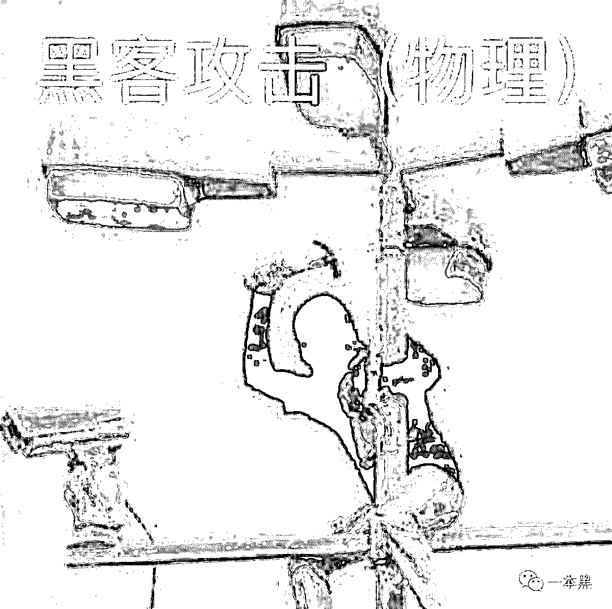
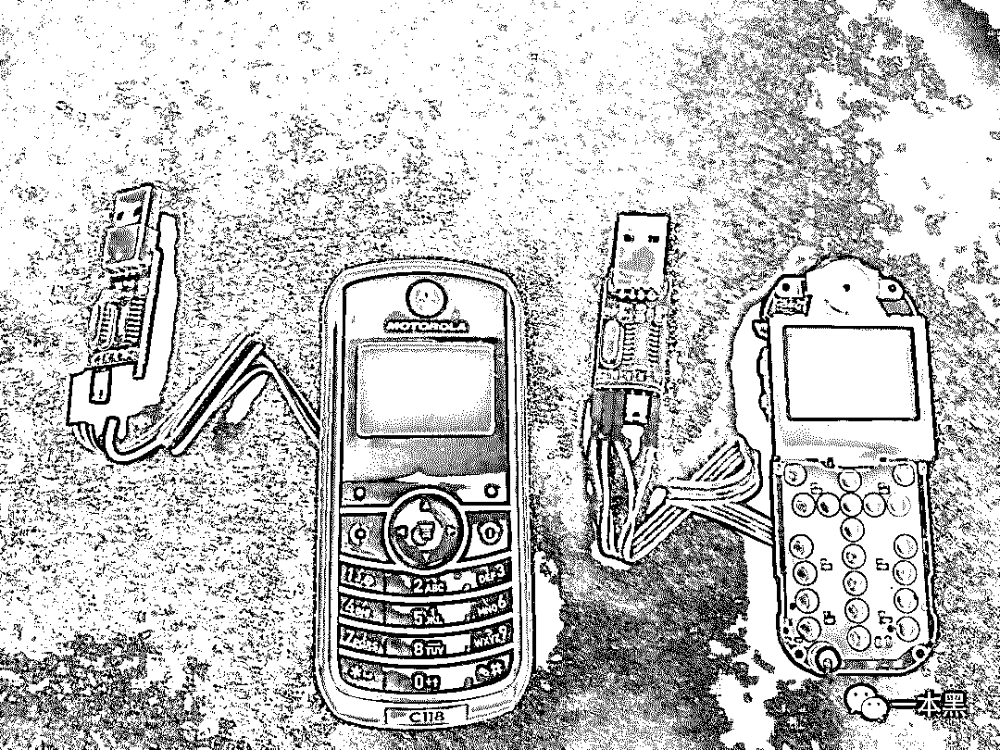
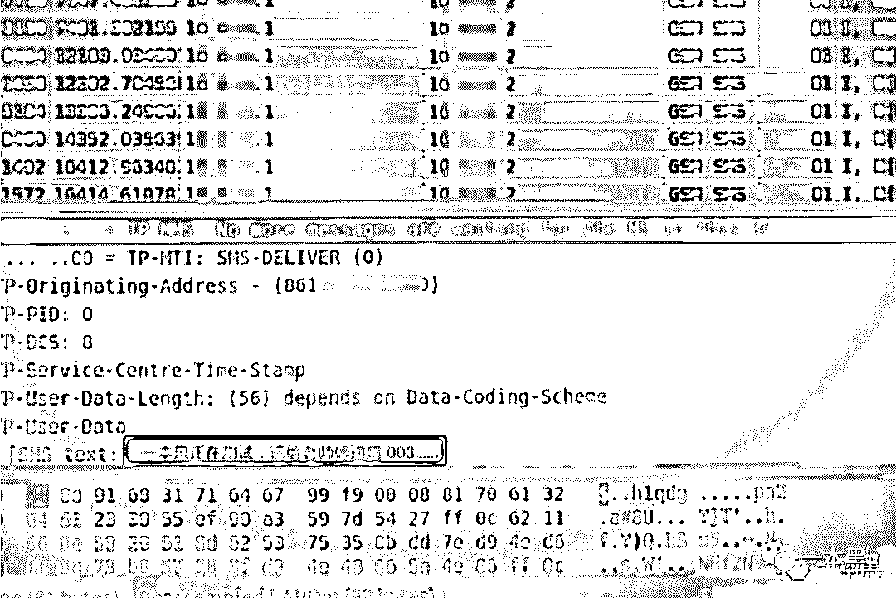
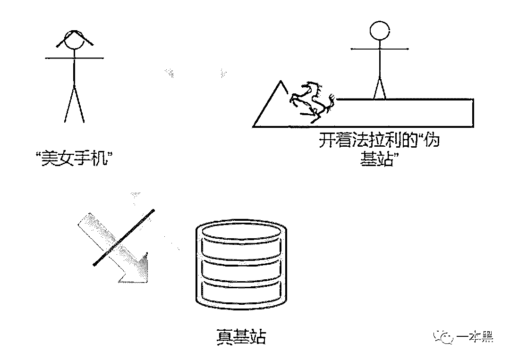
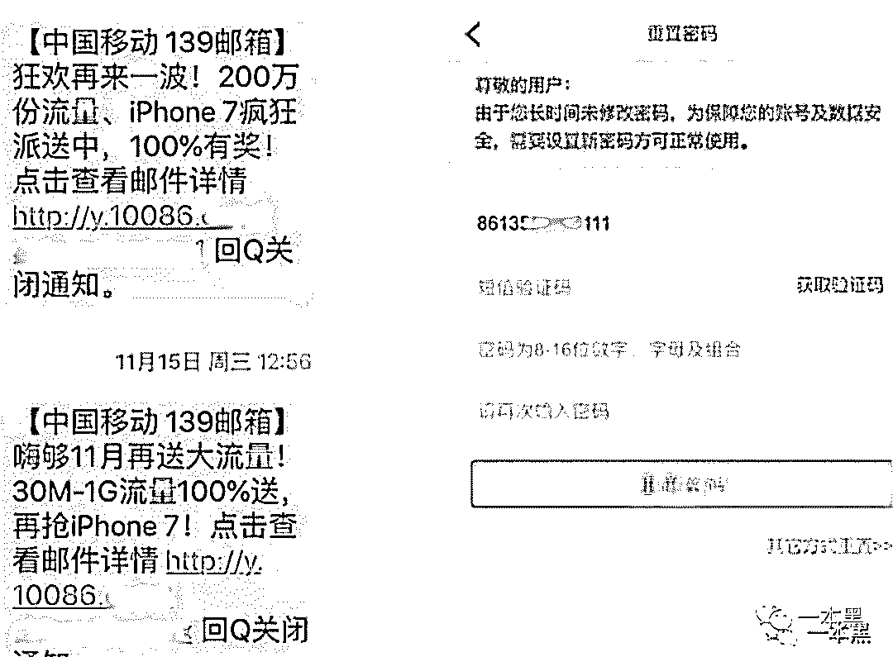

# 银行卡一夜丢失 10 万，新型“嗅探”盗刷技术又来了

> 原文：[`mp.weixin.qq.com/s?__biz=MzU4ODAwNzUwMQ==&mid=2247485735&idx=1&sn=8651943d47e22f478ec7dcc43897be86&chksm=fde21805ca959113a187627987675969aa705b924e28ac2f2a417d6c8725d0ef3a73d0f07a47&scene=27#wechat_redirect`](http://mp.weixin.qq.com/s?__biz=MzU4ODAwNzUwMQ==&mid=2247485735&idx=1&sn=8651943d47e22f478ec7dcc43897be86&chksm=fde21805ca959113a187627987675969aa705b924e28ac2f2a417d6c8725d0ef3a73d0f07a47&scene=27#wechat_redirect)

【黑话连篇】

**该栏目更多的是揭露事件或对事件的看法，以达到让人精神得到升华的目的。**

* * *

说起黑客，大众的第一反应肯定会想到电脑屏幕上不断滚动的代码，和那个永远也看不清脸的背影。

大家都会觉得黑客是一个很神秘的群体，他们的技术很高超，随便写个脚本就能把五角大楼给黑了，回车一敲整栋楼的摄像头都能被控制住。

当然，大众对于黑客形象的概念大多来自于影视剧，而影视剧为了艺术创作就进行了想当然的形象呈现。

其实黑客并没有大家想象的那么神秘，有可能你走在大街上看到的小学生就是个黑客；写字楼里普通的上班族就是个黑客；甚至开着大 G 买菜的油腻中年也是名黑客。

虽说现实生活中的黑客不像影视剧中显得那么高调，但这群人的思维可以说是非常的独特。

就拿老师傅来说，大家都以为老师傅是个油腻秃头中年，但其实并不是，老师傅不仅不老不秃头，还很风骚和浪荡，偶尔也会聊聊妹子泡泡吧，唯一的缺点就是爱抽烟爱喝酒，就差烫头了，我是劝也劝不动。

黑客讲究逆向思维，有时候你以为得花很多时间才能解决的事情，反到只需要“一锤子”。就比如下面这张图。

之前我写过好几次文章说盗刷这事，无非就是利用一些工具把卡的磁条信息给复制到另一张白卡上，以此实现盗刷。

这种方式如果非要用黑客的话来说，其实就相当于物理攻击。

物理攻击简单粗暴，一般不会涉及太多技术手段，但在关键时候也会有出其不意的效果。

比起物理攻击，真正利用黑客技术干坏事的，才是真正的骚操作。

以前移动支付还不是很普及的时候，大家都在使用银行卡，但随着微信支付宝的发展，现在只要绑定了银行卡就能进行消费。所以也就慢慢导致了传统盗刷行业的没落。

但这帮黑产从业者的思维就是这么骚，物理的不好搞就另辟蹊径找别的路子，所以区别于传统的盗刷手段正在肆意蔓延。

你能想象在不接触对方手机的情况下，获取对方的短信内容，最终利用短信验证码实现银行卡盗刷吗？

**一**

**前两天，我看到一条新闻，说的是郑州某小区附近的十几位居民发现，自己一觉醒来，银行卡里的钱竟然不见了。**

**后来民警经过调查才发现，原来是这个小区附近出现了“**嗅探设备**”，犯罪团伙通过这种“嗅探”设备，可以劫持附近居民的手机短信，进而盗取受害者卡里的钱。**

**因为这些犯罪团伙通常是在凌晨作案，所以受害者往往不能第一时间察觉。经过调查核实，在短短的十几天里，受害人的银行卡被盗刷十几万。**

**同样的事情在去年也发生过，当事人半夜起床发现手机收到多条验证码，发现京东支付被开了白条，而且被转走 10000 多元......**

**可能各位有点好奇，这种“嗅探设备”究竟是什么玩意，居然能神不知鬼不觉的、在不接触对方手机的情况下把别人的钱盗走。**

**其实，关于嗅探设备的调查我们也曾经做出过报道，这里的“嗅探设备”是指**“GSM 劫持+短信嗅探技术”**，这一技术可实现实时获取用户的手机短信内容，然后根据这些内容筛选出有用信息进行盗刷或者诈骗。**

****

**没错，设备就长这样。**

**经过改装的老式摩托罗拉，低调的外观依然藏不住它风骚的内核，沉稳但又略有一丝霸气。**

**这款设备最早是来自某黑产从业者，除了设备之外，还有配套的使用教程、编译环境和补丁。**

**我当时和老师傅还真的通过实验，还原了它的实现过程。**

**以下是当时的记录。**

> **为了能尽快看到是否真的能嗅探到别人的短信内容，我发动了身边的所有人相互发短信，短信内容统一为：**“一本黑正在测试，请给老师傅递烟 001......”** **

> **按照顺序，一样的短信相互发了 15 条，只是每一条的最后用序号来标记。**

> **短信发出去没多久，老师傅这边就收到了反馈，果真在上面嗅探到了带有**“一本黑正在测试，请给老师傅递烟......”**的短信。**

> ****
> 
> **至于实现原理，其实很简单。**
> 
> **以前的手机基本都是 2G 移动通信，所以那时候会有一些人购买设备搭建‘伪基站’，然后再冒充运营商给用户发送一些垃圾广告、或者说是诈骗短信。基站范围内的手机用户就可以收到这些短信。**
> 
> **我想大多数人应该都接收过这类垃圾短信。**
> 
> **伪基站：能够搜寻以其为中心，一定半径范围内的 GSM 移动电话信息，并任意冒用他人手机号码强行向用户手机发送诈骗、推销等垃圾短信。**
> 
> **伪基站运行时，用户的手机信号会被强制连接到该设备上，无法连接到公用网络，以其影响用户正常使用。**
> 
> ****
> 
> **举个例子：就好比一个美女正在和真基站约会，这时候突然有一个开着法拉利的伪基站过来对美女抛了个媚眼说：“看到我的车了吗，跟我走吧。”**
> 
> **这时候美女就甩开真基站的手，坐上了伪基站的法拉利。**
> 
> **而这一现象就相当于嗅探设备，它能探到这个基站区域内所有用户收到的短信，然后对受害者的手机短信进行劫持，并且受害者是无感知的。**
> 
> **但这种设备往往都有一个缺点，就是距离。**
> 
> **基站一般是有一定范围的，他只能服务这个范围内的手机用户，理论上来说，这种嗅探设备只能探到 30-300 米之间的距离。**
> 
> **当骗子嗅探到受害者手机中的短信时，会通过筛选，留下一些有用的短信进行下一步操作。**
> 
> **比如，当骗子劫持到运营商发过来的短信后，复制其中的链接到浏览器，点击进去，就可以看到机主的手机号。**
> 
> ****
> 
> **掌握了对方实名的手机号以后，再通过使用对方手机号码，用验证码登陆的方式，去各平台尝试登陆，然后再利用嗅探的方式“窥探”到验证码，即可实现登陆。**
> 
> **另外，但凡知道了对方的实名手机号，想要知道对方的身份证号码不是一件难事。**
> 
> **所以事件中受害者被盗刷，也就是因为自己的银行账户被远程登陆进行的转账行为。**
> 
> **但说实话，这种嗅探小伎俩其实是很有局限的，首先它必须离受害者很近才能完成，而且这种设备只能嗅探短信内容，但也不是百分之百都能嗅探得到。**
> 
> **还必须满足以下条件：受害人手机开机，信号处于 2G 制式下，手机处于静止状态，掌握受害人的身份证号等个人信息，支付只要密码不要指纹或其他验证等。**
> 
> **可能有人会问，那支付宝和微信有没有被盗刷的可能呢？**
> 
> **其实是有的，但是概念远远低于银行卡被盗刷的风险，因为支付宝安全实验室有一套风控系统，能够实时识别“嗅探”风险并进行阻拦。**
> 
> **即使是遇到了小概率的盗刷事件，也别烦心，支付宝承诺“你敢付，我敢赔”：如果账户被盗，能获得全额赔付。**
> 
> ****
> 
> **这种嗅探盗刷事件虽然早就出现过，但还是有很多人不知道其到底是如何实现的。所以今天给大家做个普及，以便让大家能更好的保护自己的隐私。**
> 
> **当你发现自己的手机信号突然从 4G 降到 2G，这时候你就要注意了，你的附近有可能正在有人用设备对手机信号进行降频攻击，这时候你可以马上启动飞行模式。因为飞行模式状态下的手机信号是无法被劫持的。**
> 
> **如果大家遇到这种类似的情况，不用慌张，先快速冻结自己的银行卡，及时报警，做最大限度的止损工作。**
> 
> **其实，遇到这种事也没必要慌，**毕竟你的银行卡里也没多少钱......****
> 
> ****
> 
> **还原事实｜专扒黑产**
> 
> **微信 ID：darkinsider**
> 
> ****
> 
> **知乎 一本黑**
> 
> **微博 一本黑 007**
> 
> **投稿、爆料、招聘、转载**
> 
> **请联系微信：chenchen_19940612**
> 
> **约稿、内容合作、联系老黑：yibenheiSW**