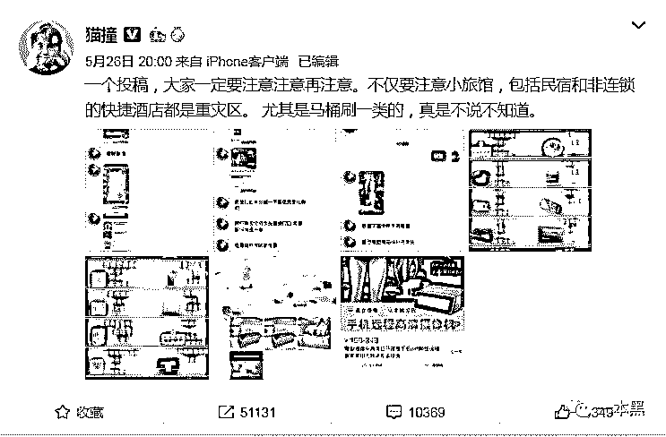
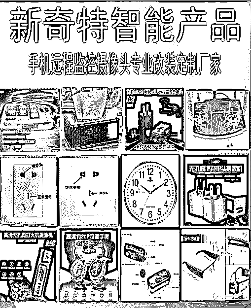
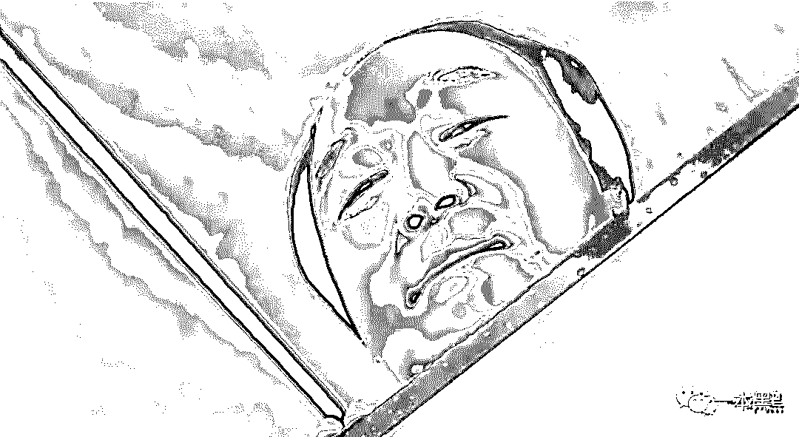
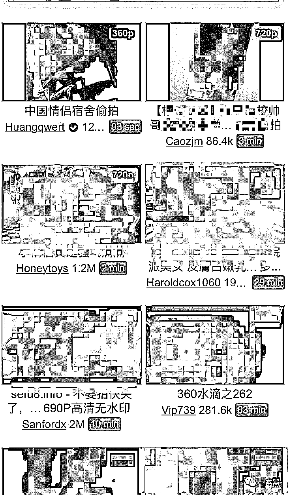
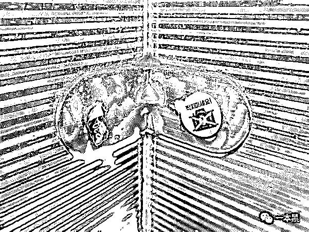
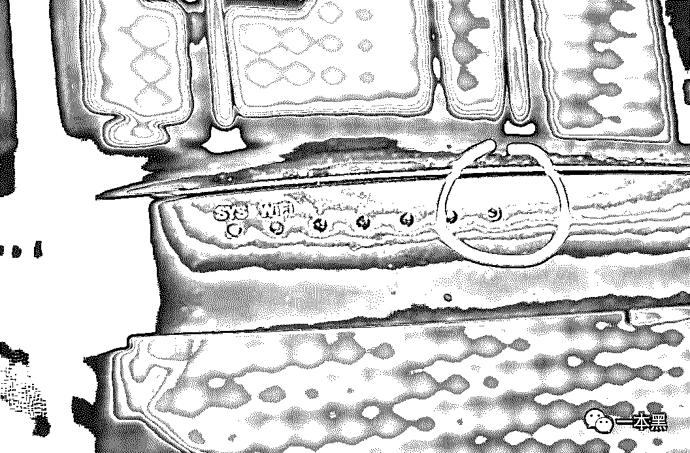
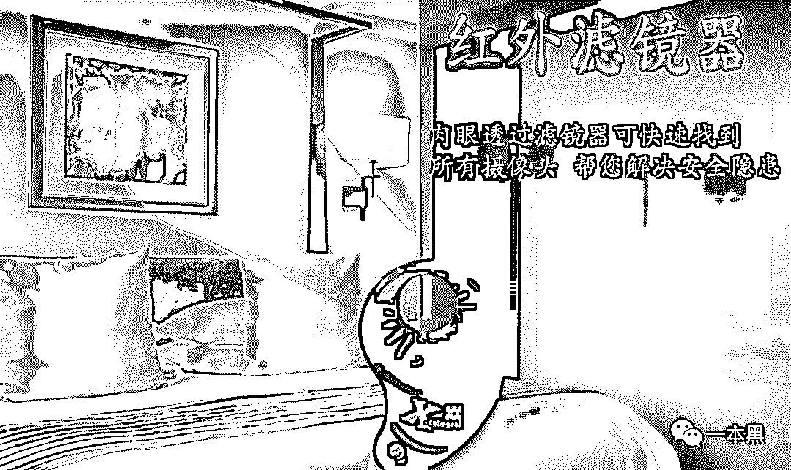
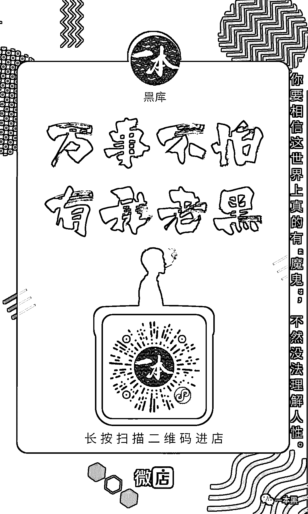

# 刚从酒店出来，就发现自己成了色情网站的 AV 主角？

> 原文：[`mp.weixin.qq.com/s?__biz=MzU4ODAwNzUwMQ==&mid=2247485728&idx=1&sn=bb5ef92f204b74ee086eff2d152a2e2b&chksm=fde21802ca95911404e83afd21364ae49c66b7a9512ae0fefeea570cad0c7a820fc25dd1bc5f&scene=27#wechat_redirect`](http://mp.weixin.qq.com/s?__biz=MzU4ODAwNzUwMQ==&mid=2247485728&idx=1&sn=bb5ef92f204b74ee086eff2d152a2e2b&chksm=fde21802ca95911404e83afd21364ae49c66b7a9512ae0fefeea570cad0c7a820fc25dd1bc5f&scene=27#wechat_redirect)

【黑话连篇】

**该栏目更多的是揭露事件或对事件的看法，以达到让人精神得到升华的目的。**

你有想过自己会成为色情网站的男女主角吗？

每当节假日，大多数人都会出门旅游，免不了要住酒店或住民宿，这时候我就在想，节后很多色情网站的板块又该更新了。

各种酒店民宿偷拍事件屡屡发生，很多人都没有安全意识，也不懂得如何检测自己所入住的房间是否有偷拍设备，所以也就导致了自己的私人生活被人偷偷录下来发到网上供人观摩。

色情网站上分类清晰，酒店偷拍、民宿偷拍、厕所偷拍、也许，你就是下一个“网站之星”。

**今天这篇文章，将会针对针孔偷拍事件给出一个解决方案**，接着往下看。

**一**

**前阵子微博上又爆出住民宿被偷拍事件，不过这次却让人只想拍手称快。**

**一小哥在爱彼迎上预定了一间青岛的民宿，该民宿评价非常高，而房东更是被平台评为“超赞房东”。但是，就在这家评论极高的民宿内，居然安装了偷拍摄像头。**

**不过，得亏这位小哥曾经上过安全隐私课，在进门的时候就发现了猫腻，在检查一圈后发现，哟，路由器里还藏着一个摄像头。**

**于是小哥拆了路由器，报了警，最后房东被警察带走，罚款 500 并拘留 20 天。**

**这大概是我关注个人隐私这么久以来，第一次看到因为偷拍被反杀上了热搜的。激动归激动，但这毕竟只是少数，大部分人甚至连自己被偷拍了都不知道，更别说反杀了。**

****来自马桶刷里的偷窥****

****你以为这些针孔摄像头关灯后就会暴露吗？你以为检查了插线板和路由器就安全吗？你以为断电就没事了吗？****

****5 月 26 号，微博网友曝光了一家改装摄像头的淘宝店，卖家专门改装各类摄像头，只要你花钱，什么样子的都能做。这些摄像头主要被安装在各类酒店，其中民宿和连锁酒店是重灾区。****

********

****马桶刷、打火机、水杯、空气净化器、插排、射灯、洁厕液，只要你想得到的，都可以放进摄像头。这些摄像头不亮灯，可夜视、可充电使用、带储存卡，隐蔽性极高。****

********

****不只是外观可以改造，镜头也行，卖家那还有透视镜头、窃听器、听墙角机器。偷看、偷听、偷拍、录像、直播，统统可以实现。****

****卖家当然知道找他买设备的都是些什么人，毕竟朋友圈里都写着呢：****

****“4K 镜头，定制优惠，做视频必备”。****

****“抓小三、防小偷、防保姆，手机实时监控，想怎么用都行。”****

****你看，现在干坏事的人越来越嚣张了。****

******变态的韩国式偷拍******

******有记者曾通过国内各地法院查询到 2016 年以来我国酒店、出租房等房间内被偷装针孔摄像头的案件达 33 件，当然这只是被判刑的案件。******

******但是相较于韩国，这个数字简直小到可以忽略不计。当“李胜利”案在网上被曝光时，我们以为这只是娱乐圈的一起涉及人数众多的性交易及偷拍个案。******

************

******随着了解地深入，我们发现韩国这个国家，偷拍偷窥狂简直多到令人发指。据《卫报》报道，从 2018 年底到 2019 年 3 月，韩国就有 30 家酒店被安装了偷拍摄像头，**1600 人的生活在网上被公开直播。********

********经调查发现这是一起团伙作案，成员共 4 人。他们在韩国各个酒店共安装了 30 枚偷拍摄像头。********

********此外，还**设立了一个直播网站**，网站共有 803 个私密直播间，付费就能进入房间观看。截止网站被封，该网站付费用户为 97 名，约收入 4 万元人民币。********

************

******而这仅仅是韩国偷拍现状的一个缩影，比酒店偷拍更广泛的是公共场合偷拍，公车、地铁、电梯、卫生间，只要是有人的地方，就有偷拍。******

******2017 年韩国被曝出 6470 起公共场合偷拍女性事件，普通民众被偷拍，大部分会选择忍气吞声，所以 6470 也仅仅只是管中窥豹。******

******韩国公共卫生间最显眼的标语不是“小心滑倒”，而是“小心偷拍”。无处不在的偷拍让女生在洗手间时都必须佩戴口罩。******

******因为不知道什么时候，自己就会成为色情直播中的主角。******

************

******公共卫生间内禁止拍摄的标语******

******有人偷拍为钱，有人偷拍为欲，归根结底都是为了满足自己。******

******关于偷拍的案例实在是太多太多了，韩国的变态偷拍，日本的电车痴汉，哪哪都是针孔摄像头。除了国内各酒店、民宿、出租屋、可能暗藏的摄像头，国外的偷拍案例也是数不胜数。******

******拥挤的地铁，匆忙的行人，谁也不知道擦肩而过的到底是个正经人还是满腹偷窥欲的死变态。******

******今年 5 月，日本一 28 岁男子在某便利店的卫生间安装偷拍针孔摄像头，试图偷拍女性如厕的视频。不久后，该男子被逮捕，随后在其家中搜查出近 10 套针孔偷拍设备。******

******今年五一小长假之际，中国一对情侣出国旅游，在新西兰某民宿中，偶然发现暗藏在路由器中的针孔摄像头。******

************

******前段时候有读者给我们发来消息，一个刚毕业的女大学生，自己在北京租了个单间，住了大半年后才发现，自己房间天花板上的烟感器里居然藏着针孔摄像头，还好用了之前我们推荐的检测设备检测了出来，不然不知道自己的私生活还会暴露多久。******

************

******实际上，不管是国内还是国外，酒店、民宿、出租屋都是偷拍的高发地点。******

******他们都有一个共同特点，这些偷拍视频都会被传到网上供人下载观看，某色情网站上关于偷拍的**视频点击量可以高达几百万**，简直让人唏嘘。******

******甚至有些色情网站的板块上还会分出具体国家地点，比如泰国马杀鸡偷拍、泰国人妖按摩偷拍。******

********如何防偷拍********

********首先，千万别相信网上说的用手机照明就可以检测这种谣言。********

********因为手机照明发出的灯光，照射的距离很近，是没办法做到聚焦远处的，很多房间的环境是根本没办法检测出来的。********

********想要避免偷拍，可以和文首的那个小哥一样，主动去学习安全防护知识。江湖险恶，不要寄希望于犯错的人自己良心发现。********

********一般来说房间内的偷拍无非三个角度，俯拍、平视和仰拍。********

********仰拍摄像头通常隐藏在烟雾感应装置、灯具内、窗帘、空调出风口、装饰画以及正对着床的物品；平视一般就是电视机、路由器、插排、水杯等物件；俯拍一般是拖鞋、脚凳、垃圾桶以及网线孔等位置。********

********如果我们用肉眼去检测的话，不管是效率还是成功率都是非常低的。********

********但如果我们利用一些带有红外检测功能的小设备，那效果肯定是事半功倍的，下面这款**红外光+无线便携式的反偷拍检测装置**或许能帮到你。********

****************

********它是一款便携式红外检测设备，利用红外光源进行检测针孔摄像头，光源比较稳定，有频闪和稳定光两种模式，设计小巧，非常便于携带。********

********适合经常出差的商务人士、经常旅游住酒店民宿的、在外租房等任何人士，特别是姑娘。********

********毕竟，保护姑娘，人人有责。********

****************

********其实这款小设备算是一款入门级别的针孔检测设备，基本不用教学，上手就能使用。********

********至于比较进阶的设备，价格相对来说比较贵，这次就不给大家推荐了。********

****************

********那么......哪里才能能买到呢？********

********扫描下方二维码，即可进店购买，也可点击一本黑**菜单栏**——**黑库**——**扫码进入微店**。********

********售价仅需**99**元，全国包邮。********

********便宜，简单，童叟无欺。********

****************

********店铺目前暂时上架了三类商品，**摄像头检测设备**、电脑、手机**摄像头防偷窥小滑盖**，和**老师傅的衣服**。********

********摄像头检测设备可以帮助你检测身边是否暗藏有针孔摄像头。********

********防偷窥小滑盖可以帮你物理防止电脑摄像头被黑。********

********老师傅的衣服是风骚纪念款，一种纪念。********

********最后我想说，之所以开个微店上架这几款小东西，主要是因为我觉得这些东西能帮到大家，写了这么多文章告诉大家这个世界存在的恶意，该给大家一些解决方案了。******** 

********希望各位，保护好自己。********

****************

********还原事实｜专扒黑产********

********微信 ID：darkinsider********

****************

********知乎 一本黑********

********微博 一本黑 007********

********投稿、爆料、招聘、转载********

********请联系微信：chenchen_19940612********

********约稿、内容合作、联系老黑：yibenheiSW********