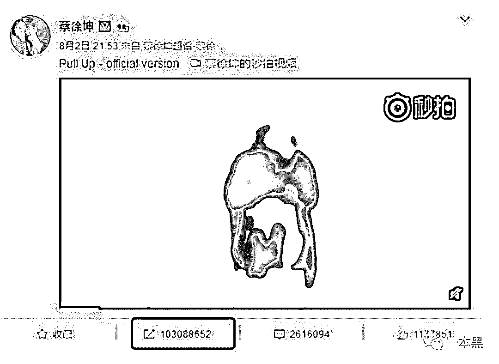
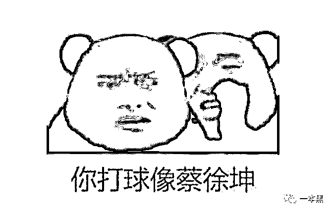
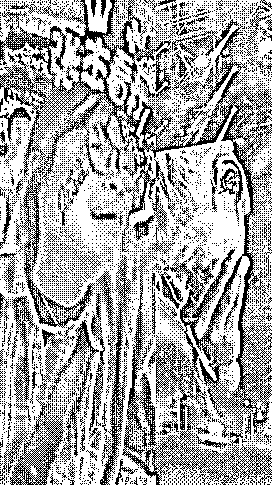
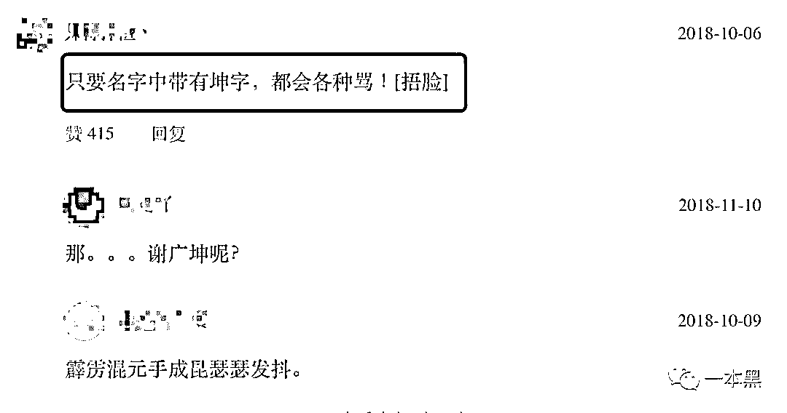
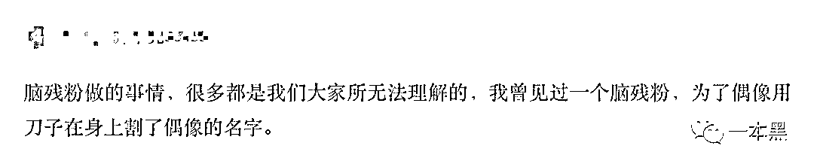
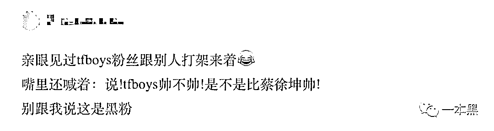
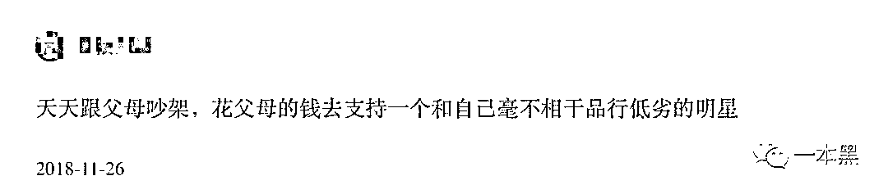
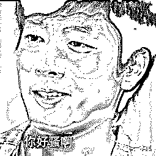
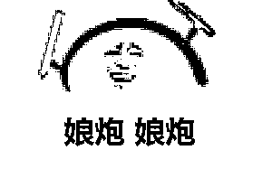

# 4 人半年吸金 800 万，蔡徐坤一亿转发量被查，粉丝的钱到底有多好赚？

> 原文：[`mp.weixin.qq.com/s?__biz=MzU4ODAwNzUwMQ==&mid=2247485693&idx=1&sn=858210775dbdb631b3b446e63839647e&chksm=fde219dfca9590c9e2ae8a9502592b7d12d862dcafdaf366046939ce391fbb1730f8b704ab35&scene=27#wechat_redirect`](http://mp.weixin.qq.com/s?__biz=MzU4ODAwNzUwMQ==&mid=2247485693&idx=1&sn=858210775dbdb631b3b446e63839647e&chksm=fde219dfca9590c9e2ae8a9502592b7d12d862dcafdaf366046939ce391fbb1730f8b704ab35&scene=27#wechat_redirect)

【黑话连篇】

**该栏目更多的是揭露事件或对事件的看法，以达到让人精神得到升华的目的。**

某种程度来说，这是一个人傻钱多的时代。

更是一个缺乏独立思考的年代。盲目、随从、迎合、舔狗，有人愿意为所谓的偶像倾家荡产，也有人疯狂到终身追星，害人害己。

但有一帮人不仅追星，还从追星这一群体中发现商机。利用粉丝这一最不具备独立思考能力的群体，半年内疯狂吸金近千万。

** 一**

前天晚上，我和老师傅找了个野酒馆喝酒，期间刷到一条新闻，讲的是曾经帮助蔡徐坤制造一亿微博转发量的幕后推手被查封。

一款名叫“星缘”的 APP，利用粉丝给自己喜欢的明星刷流量这一需求，疯狂牟利，半年内吸金 800 余万元。

这样的收入放在任何一个创业项目或者黑灰产项目上来说，都是比较可观的状态，正儿八经实实在在的月入百万。

这款 APP 在粉丝圈内流传甚广，就像提到成年人打架的片子，大家都知道苍井空一样，知名度还是有那么一点的。

据新京报报道，粉丝可以通过该 APP 直接登录新浪微博，充钱开通会员后，就可以在自己的账号下绑定多个小号，数量从几十个到几千个不等。

粉丝也可以在平台上领取“刷量”任务，任务完成后，粉丝可以参加活动进行抽奖，奖品一般是自己偶像的签名照片、周边之类的物品。

等等，如果你看到这里一脸懵逼，不知道蔡徐坤是谁的话，那我就有必要给你普及一下知识点了。

蔡徐坤，一个篮球打得贼好的骚年。

开个玩笑，蔡徐坤最早是参加了《偶像练习生》后名声大噪，但随着名气越来越大，他的黑料也越来越多，曾经就因为几次事件上过微博热搜。

有一次，潘长江在某节目中玩游戏，误把蔡徐坤认成吴亦凡，之后潘长江还发微博表示姓蔡的他只认识蔡明，随之而来的是蔡徐坤脑残粉丝的疯狂 diss，各种口诛笔伐。微博上也因此上演了一段脑残粉丝之间的互相掐架。

于是潘长江再次发文，劝导各位网友还是多关心关心父母，不要在无关紧要的人身上浪费时间。

还有一次，蔡徐坤在微博发布了一个视频，此视频获得微博一亿多的转发量，再次把他推上热搜。

很多人都表示质疑，要么是蔡徐坤的人气太高，要么就是他背后有人在操控这一亿人次的转发量。

要知道，微博的总用户也才三亿多，这一亿的转发量就相当于三个微博用户里，就有一人转发了蔡徐坤的微博，有点头脑的人都清楚，这简直就是扯淡。

针对这件事，央视针对蔡徐坤一亿的转发量也做了报道，微博还因此把转发量上限调整为了 100 万+。

就这样的影响力，完全可以说是屎无前例，让人大吃一斤。也正是这样的影响力，让很多网友总结出了一套调侃人的话语，比如：“你打球好像蔡徐坤。”

其实，开头提到的这款“星缘“APP，从产品上来说是比较有想法的，它链接了粉丝和偶像之间的关系，让粉丝能实时的关注自己的偶像，查看排行榜，如果粉丝发现自己的偶像排名掉后，他们就会花钱为其打榜。

虽然微博账号要求实名制，但在这种情况下，还是会有很多虚拟运营商号段被用于非实名制注册，以便方便给流量明星们刷数据。

至于这次操控蔡徐坤一亿转发量背后的团队被抓事件，是否真的只是此团队所为，还是他们只是个背锅侠，我们不得而知，但这种现状在现如今什么都造假的年代，太普遍了。

**二**

人有偶像是件好事，在理智的前提下，它算是一种引导，或者激励。它能让一个人变成更好的自己，但也能让一个人变成随波逐流的脑残。

我认为，追星没有高级和低级之分，只有脑残之分。而最初级的追星我想大部分人都经历过。

就拿我自己来说，曾经作为一名年少轻狂的骚年，我也曾是新坦结衣和苍井空老师研究协会的一名认证会员。

这种状态的”追星“不需要任何成本，无非就是追追老师们饰演的电影，给予一定的观看支持，不仅为其打 call，自己还得到了一些启蒙，这是一种正向的学习状态。

这种状态往往只会停留在一个浅显的表面，也没有想着为其去投入一些其他的成本或者精力。

点到为止，也就够了。

但说起现在某些人的追星行为我就想笑。

前不久网上流传一个视频，在歌手张杰的演唱会上，一名女粉丝撕心裂肺的喊着自己偶像的名字，那状态想必自己的亲爹亲妈都没见过。

网上有个问题叫做：“你知道哪些脑残的追星行为？”

有人说蔡徐坤的粉丝，逮到人就骂，原因是不说蔡徐坤帅。

还有人说，一个画漫画的人画的漫画因为反派人物有个坤字就被怼得体无完肤。

这些粉丝的脑洞也是够新奇的，一点都没把我谢广坤放在眼里。

除此之外，还有这样的。

这样的！

这样的！

哎，现在的人呐，完全没有半点独立思考能力，处处维护自己的偶像，比起我们那个只有光盘的年代来说，真的是太不单纯，太没有主见了。

其实，很多脑残粉丝近乎偏执的疯狂做法，就曾经导致过不少人做出不可挽回的结果。

有人家破人亡、有人割腕自杀、有人后悔终生，他们用自己的实际行动证明了一件事，太过脑残的追星行为，只能害人害己。

还记得杨丽娟吗？16 岁开始痴迷刘德华，于是辍学开始疯狂追星之路。

父母劝阻无效后，开始卖房卖肾以筹款供她赴港寻见刘德华。

她靠着”见不到刘德华，就终身不嫁“的信念，疯狂了 13 年，最终导致 68 岁的父亲跳海身亡。

这样的例子不在少数，少年因母亲没买到张国荣 CD 而自杀；26 岁女子因黎明而欠债吞药自杀；谢霆锋女粉丝跳河自杀；周杰伦演唱会上偏瘫少年吞药自杀......

其实，我越来越看不惯现在所谓的偶像文化，但还是有源源不断的粉丝喜欢这样的“文化”，批评的话我也懒得说，**毕竟人家这种文化是在“娘性循环”。**

本来这篇文章是不想写的，总感觉没啥意思，但一想到那些没半点独立思考能力的脑残粉丝们我就来气。

所以就简单逼逼两句，还是希望各位能多点自己的思考吧！

对了，前面不是说我和老师傅前天晚上找了个野酒馆喝酒吗？

期间也聊到过这个话题，老师傅突然问我，你对 tfboys 怎么看，我能怎么看，我只能说王源在抽烟咱别打扰人家就是了。

不说了，我要去打球了！

还原事实｜专扒黑产

微信 ID：darkinsider

知乎 一本黑

微博 一本黑 007

投稿、爆料、招聘、转载

请联系微信：chenchen_19940612

约稿、内容合作、联系：yibenheiSW