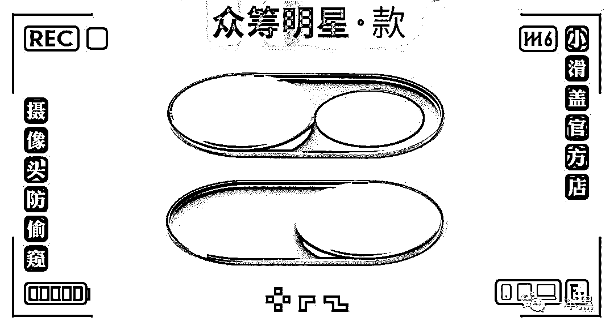
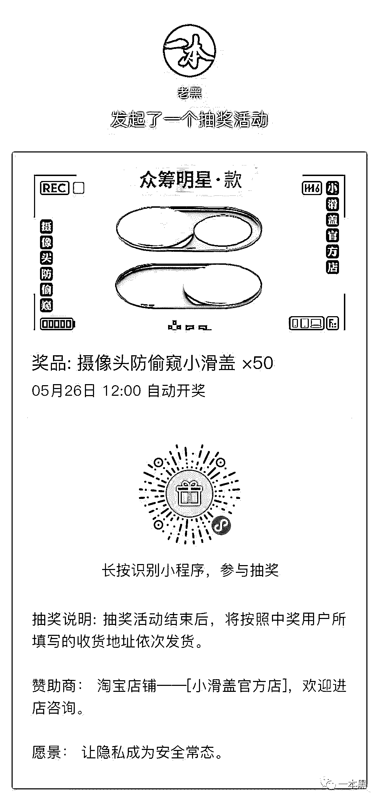

# 为什么接广告？说点心里话

> 原文：[`mp.weixin.qq.com/s?__biz=MzU4ODAwNzUwMQ==&mid=2247485579&idx=1&sn=3137b614c34d3d8fb9cb0a8de891cc11&chksm=fde219a9ca9590bf4b80c421464c0ee9385e744597b7f5efdd08fed262eb1f4ef39296906ed5&scene=27#wechat_redirect`](http://mp.weixin.qq.com/s?__biz=MzU4ODAwNzUwMQ==&mid=2247485579&idx=1&sn=3137b614c34d3d8fb9cb0a8de891cc11&chksm=fde219a9ca9590bf4b80c421464c0ee9385e744597b7f5efdd08fed262eb1f4ef39296906ed5&scene=27#wechat_redirect)

七年前，张小龙不会想到，他带领的微信团队能在几年后带动几千万人就业。

那会，微信刚满一周岁。

自媒体三个字算是一个统称，是近几年发展起来的一个掘金行业。

不管是做公众号写文章、还是抖音快手拍短视频，几乎各行各业都想涌进来分一杯羹。

一个自媒体，但凡有个几万以上的粉丝，就能想法设法进行变现，方式多样，广告是万年不变的变现途径，除此之外还会有知识付费、电商服务等等。

虽然一本黑都尝试过，但比起大多数公众号，从商业化的角度来说，我们是不及格的。最大的原因我想还是因为我们太过于理想主义。

从两年前一本黑发表第一篇文章开始，我们压根就没想过能把这账号做起来，当然也不会想到今天会有几十万读者。

整个过程完全是无心插柳，既然有人看，那就接着写呗！所以就一直写到了今天。

期间接到过很多广告主的广告需求，那会还是 17 年，可能是由于新鲜感的原因，我们接下了第一条广告，随后收到不少读者的反对意见，为了不对读者造成信息干扰，此后我们就没再怎么接过广告。

我们专心生产内容、调查、采访，尽量用真实去还原整个事件的面貌。

关注一本黑的各位都知道，它是一个揭露互联网灰黑产、行业黑幕或故事的公众号，它有高度的辨识度和风格，它所传达的价值观是整个团队内心都认可的东西。

02

最近这段时间，我们发了几篇广告，很多人发来消息恭喜我们终于接广告了，但这只是极少数人，更多的是反对。有说我们忘记初心的，有说我们垃圾的，甚至还有骂娘取关的，人数还不少。

收到这样的反馈我并不意外，太正常不过，网络世界嘛！过嘴瘾的人一抓一大把，假如你让他当面说几句，可能连个屁都放不出来。

**我觉得关于接广告之所以出现这么多负面评价的原因，是因为我们从不接广告到接广告这之间形成的反差。**

对大多数人来说，他们会认为网络上的任何东西都应该是免费的，并且你不应该给我灌输一些我不需要的东西，他们所需要的是他们眼里所谓的“干货”。

其实“干货”这东西本身就是个伪命题，对自己有用那就是干货，对自己没用那就是垃圾呗！

至于为什么接广告，当然是因为钱，过去我们因为理想主义四个字拒绝了无数广告商，但现在可能不会了，因为团队要吃饭啊！老师傅要抽软中华啊！

至于一本黑后续规划，我们会去做比较多的尝试，做产品、做社群、做线下可能都会涉及，这一切的前提都需要团队和钱。

大家可以翘臀以待，不是，翘首以待。

**总之一句话，商业化是为了能更自由的表达。**

从广告类型各位应该看得出，我们不会接害人的广告，拒接 P2P，拒绝医药类、拒绝含色情赌博性质等广告。

我们基本上都是接一些品牌类、教育技能类的广告，如果刚好有人有需求那再好不过，如果没有需求，忽略就是，没必要恶语相加，有人上来咬我一口，我不可能学他反咬一口是吧。

还有一点需要强调的是，之所以有不少广告很硬很直接，是为了做用户筛选，让各位一眼就能识别是广告，尽量减少大家消耗在广告上的时间。

我知道大多数人喜欢看软文，但我向来不太喜欢套路，性格使然。

愿意支持点进去看一下完事，不愿意忽略就行，如果你觉得我们一条广告就对你产生了信息干扰，取关走人的同时我也欢迎你再来。

03

另外，很多人质疑，我们揭露了很多灰黑产套路和擦边模式，为什么不自己做一做，这利润可比做自媒体来钱快多了。

非法的东西当然来钱快，但我想说原因可能还是和一个叫价值观的东西有关吧。

两年来我们写的文章触碰了绝大多数人的利益，我们曾让某些光明正大做色情擦边的企业倒闭，让一年吸金十几亿的传销组织被查封，还让某知名企业在一天内下架所有非法广告。

我们也曾遭遇过威胁和恐吓，甚至有人花几十万要求我们删稿，说没有心动那是假话，但最后还是坚持了心中仅有的价值观。

我曾把完整的镜子打碎，夜晚的枕头都是眼泪......

不为别的，只为日后酒桌上吹起牛逼来，我能拍着胸脯大声告诉别人这些都是真的。

**不做舔狗，就这一点来说，我觉得一本黑挺性感的，也很骚。**

花钱就删稿？我们又不是一个靠碰瓷写黑稿赚钱的自媒体。

最后，还是想说，感谢那些一直以来默默支持我们的读者，是你们让一本黑走到了今天。

我们也会继续为大家揭露更多的黑暗，带大家看清这个世界，同时，我们也会陆续带给大家一些新鲜有趣的东西。

前几天发了几条广告，今天我想给大家抽个奖，奖品是很多读者期待的防摄像头偷窥小滑盖，可以贴在电脑或者手机的摄像头上，防止自己的设备被黑，导致私密画面外流，造成后悔千万遍也无法挽回的结果。

所有的黑客攻击都是技术型攻击，但是针对电脑、手机摄像头的防御，我想还是这种小滑盖的物理防御来得更直接。

该奖品是我们去年联合淘宝店铺小滑盖官方店出品的一款周边产品，当时这款产品面世后，他们给我说了一句话：**“隐私这事儿被踢爆之前，普通人贴上小滑盖至少可以保障一点就是，第一个出事儿的人不会是你。****”**

所以，这次我给大家准备了 50 份，识别下方小程序即可参与抽奖。

抽奖顺序：**先****点赞，后抽奖。**

开奖时间：**2019.5.26 12：****00**

还原事实｜专扒黑产

微信 ID：darkinsider

知乎 一本黑

微博 一本黑 007

投稿、爆料、招聘、转载

请联系微信：chenchen_1994061