# 黑掉诈骗集团的电脑，我给受害者打了电话，对方却说我是诈骗犯

> 原文：[`mp.weixin.qq.com/s?__biz=MzU4ODAwNzUwMQ==&mid=2247485530&idx=1&sn=65bdccde18acdcb9dc1035e599ea3b6d&chksm=fde21978ca95906e41d3dbcaca5e27b268cb110143d35b5c7a7d292a6e2eda2334dd6936a3c2&scene=27#wechat_redirect`](http://mp.weixin.qq.com/s?__biz=MzU4ODAwNzUwMQ==&mid=2247485530&idx=1&sn=65bdccde18acdcb9dc1035e599ea3b6d&chksm=fde21978ca95906e41d3dbcaca5e27b268cb110143d35b5c7a7d292a6e2eda2334dd6936a3c2&scene=27#wechat_redirect)

当看客变成了当局者，内心还能否保持晴明，是个值得探讨的问题。

一通电话，复杂却恰到好处的环境音，环环紧扣，步步下套。

整场骗局中，最匪夷所思、也最为关键的环节在于：

**诈骗团伙如何获取受害者的证件等个人信息？**

**网站中的“通缉令”从何而来？**

毫无休止的恐吓和诱导，使得整场“演出”转化成了双方的“心理博弈”。

这个局，且看老师傅如何破？

**01 ****您有一通电话等待接听**

去年五一，与几个好久未见的老友约了一场说走就走的旅行。

其中有个认识快十年的妹子，外号哈皮，因为她总是很快乐，大学专业是计算机，毕业后却朝着心理咨询方向发展，果然兴趣是最好的老师。

在一个夜宵摊上，酒足饭饱之后，我们吐槽起了各自的工作，哈皮突然对我说：“你那公众号我经常看，让我更加坚定做心理咨询，市场需求太大了。”

话赶话，我对她说：“以后遇到什么骗局尽管来找我，我给友情价。”

她不屑一顾的回答：“小看我？这种事情不可能发生的，倒是你，天天接触这些，有需要来找我，我给你友情价。”

谁知，旅行结束未满一月，哈皮就给我发来了微信。

文字三言两语讲不清楚，我就抽午休时间给她打了个电话，问了问具体情况。

原来，就在前一天早上，哈皮接到一个电话，开口就问：“你是 XXX 吗？”哈皮有点懵，正寻思着是否要挂断电话时，电话那头又传来了声音：“你的身份证号码是 XXXXX，手机号码为 XXX，做咨询工作，回答是或不是？”

由于受到了“是或不是”的引导，哈皮下意识的回答是，这时，对方开始自我介绍，自称是 XX 市刑侦队，并报上了自己的警号、姓名等信息。

容不得哈皮提出疑问，对方又开口了，称哈皮之前的一个顾客，往海外邮寄的包裹被截获，里面有大量的银行卡，其中一张，卡主是哈皮，希望哈皮能够配合调查，并强调相信是哈皮的个人信息被盗用，但只有积极配合才能证明清白。

对方咄咄逼人的语气，让哈皮一时没了想法，虽然怀疑，却没有质疑的机会。

随后，对方让哈皮找一个安静的地方，称下午需要哈皮前往 XX 市（外省）公安机关配合调查，哈皮一听，自己和 XX 市隔着几千公里，表示无法到达，结果对方给出了一个案件编号和网站，让哈皮登录，网站显示为“中华人民共和国最高人民检察院”。

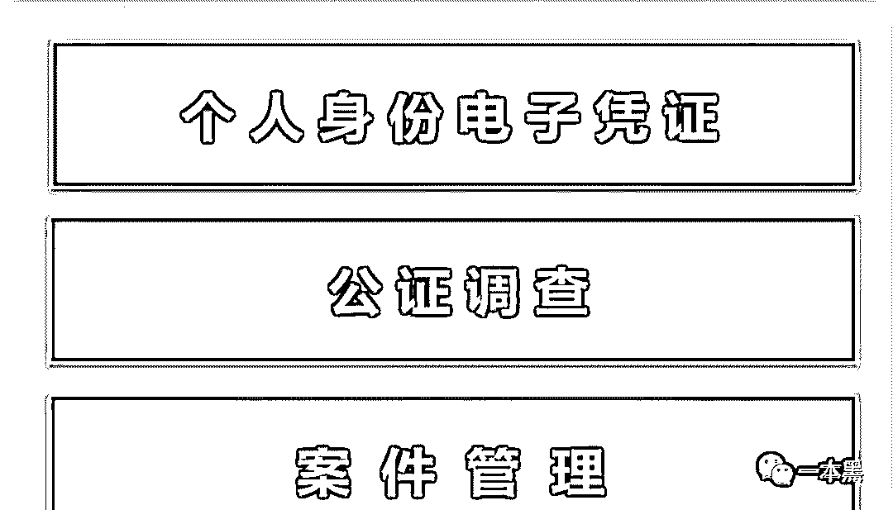

哈皮打开网站，输入了所谓的案件编号和身份证号码后，她看到了一张挂着自己头像的通缉令，里面信息完全真实。

感觉到不可思议，哈皮表示自己真的什么都没有做，对方竟然立刻严厉的呵斥：**不要说这么多，照做！**

紧接着，对方让哈皮在该网站下载一个叫做“个人身份电子凭证”的 App，以便验证自己的身份，并让哈皮在二级页面输入银行卡账号和密码，以证实自己的银行账户没有不明来历的收入。

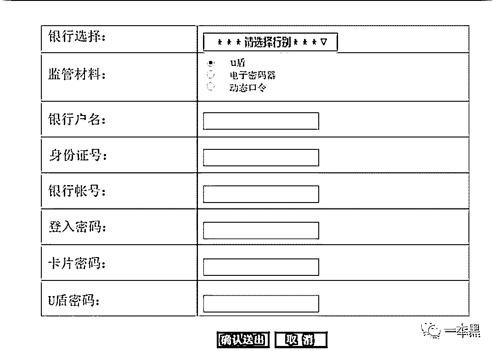

铁公鸡的哈皮，一看要输入银行卡信息，毫不犹豫的挂断了电话。

这就是哈皮所遭遇的事情。

哈皮：“想要老娘的银行卡密码，想得美。”

我：“你不是说经常看我们公众号嘛，怎么还能被套进去？”

哈皮：“经常看不等于篇篇看，再说，就算看了，当局者迷、旁观者清，稍微一松懈，满盘皆输。”

我：“我可以深入查查，不过...”

哈皮：“不过什么？”

我：“友情价结一下，不谢。”

**02 ****深度追踪**

老朋友的忙必须得帮，于是我找老师傅聊了聊，眼看着一支烟尽数化成了烟灰，老师傅表示可以去看看。

按照哈皮提供的网址，老师傅对这个网站进行了一番深入灵魂的观察，却意外的发现，这个站点目前并没有在正常使用，或许它不是这个诈骗团伙的主要站点。

进一步分析，老师傅发现网站主（诈骗团伙）用同一个邮箱注册了一批同类域名，用计算机基础知识获取到最近使用中的几个域名后，果不其然，这几个站点使用的是同一套网站系统，初步可以确定为诈骗团伙目前重点使用的站点。

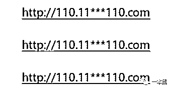

这几个网站中，都存在三个相同的诈骗模块。

*   个人身份电子凭证

*   公证调查

*   案件管理

其中，“个人身份电子凭证”模块需要下载 App，这让老师傅嗅到了一丝猎物的气息。

随后，老师傅通过计算机基础知识分析出了这个 App 的“后台指挥部”，在对其进行深度研究后，利用对方的相关弱点，成功拿到进入该“指挥部”的钥匙。

“指挥部”里别有洞天，具备**直接查看受害者手机中的操作短信，通话记录，联系人，GPS 地址，操作通话**等功能。

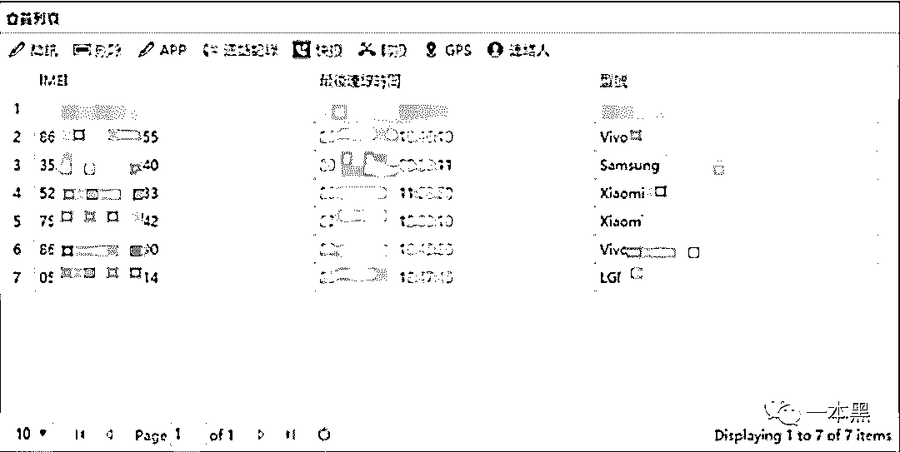

诈骗团伙通过短信验证码，就可以直接转走受害者银行卡中的余额，甚至还会以受害者的身份申请贷款，以此形式来继续诈骗受害人。

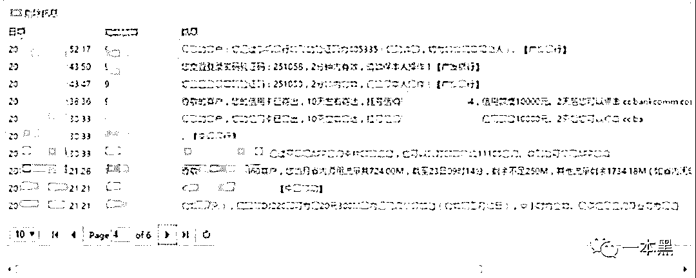

经过对该诈骗流程中的相关信息进行查看和管理，已经具备了通知受害者的条件，但**此时仍然无法锁定诈骗团伙的具体身份信息**。

于是，老师傅准备进一步获取该团伙的信息。老师傅通过计算机基础知识部署了“水坑”，在诈骗分子频繁登录后台进行操作后，老师傅成功获取到部分访问后台的 IP 信息。

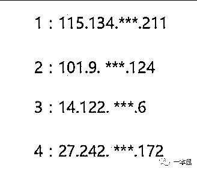

经过分析发现，IP：115.134\. ***.211 访问频率很高，便重点对该目标进行突破，借助于之前部署的“水坑”，爬取到了这名犯罪分子的相关信息。

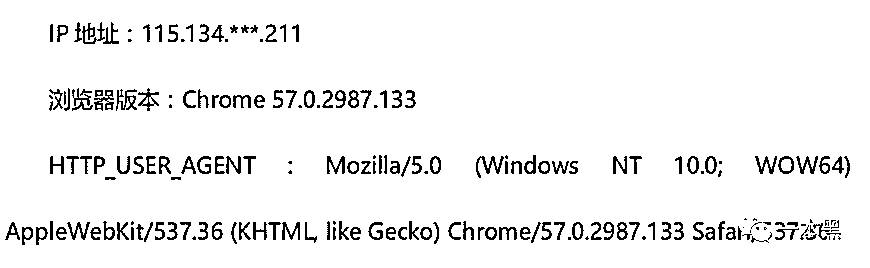

拿到这些信息后，老师傅准备开展精准打击。

目标已经锁定，老师傅通过计算机基础知识升级版，获取到这名诈骗分子电脑上的一些资料。

对该电脑 IP 进行分析，所属地点为马来西亚。

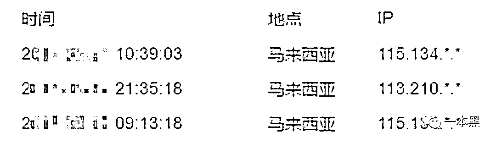

通过暗中观察，老师傅发现这名诈骗分子正通过 Skype 在沟通制作“伪造通缉令”，未被遮挡的电脑桌面上铺满了文件，其中肉眼可见数张已制作完成的“伪造通缉令”。

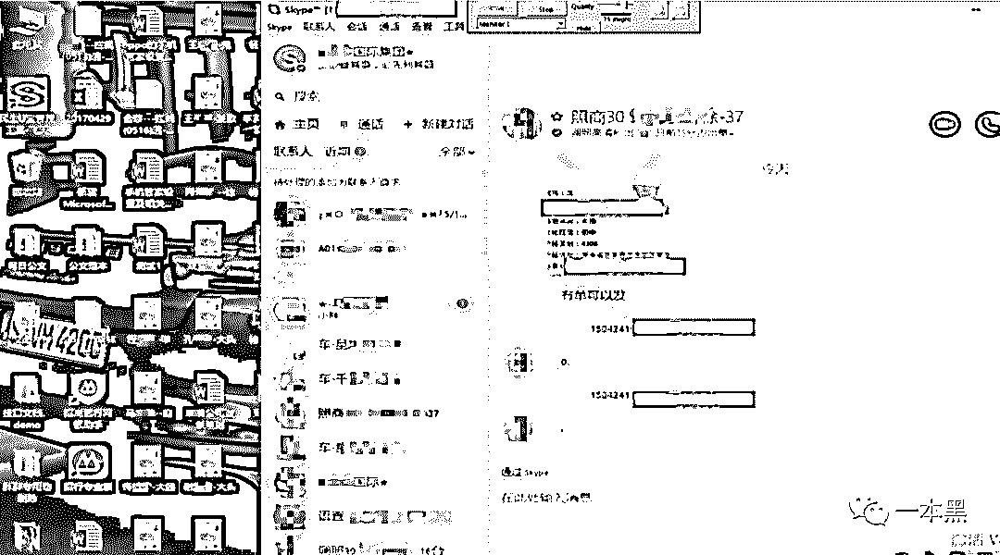

除此之外，还有其他的诈骗证据：

诈骗分子电脑访问的管理系统。

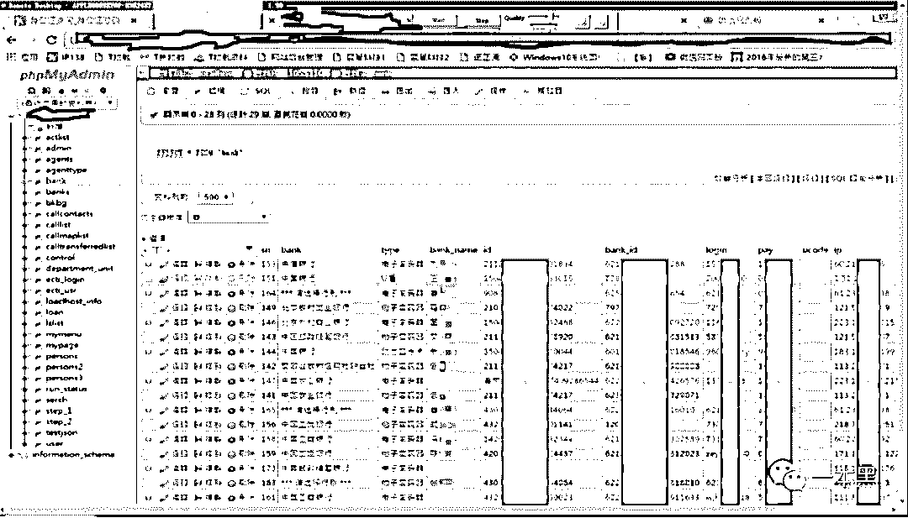

诈骗分子电脑中的文件管理。

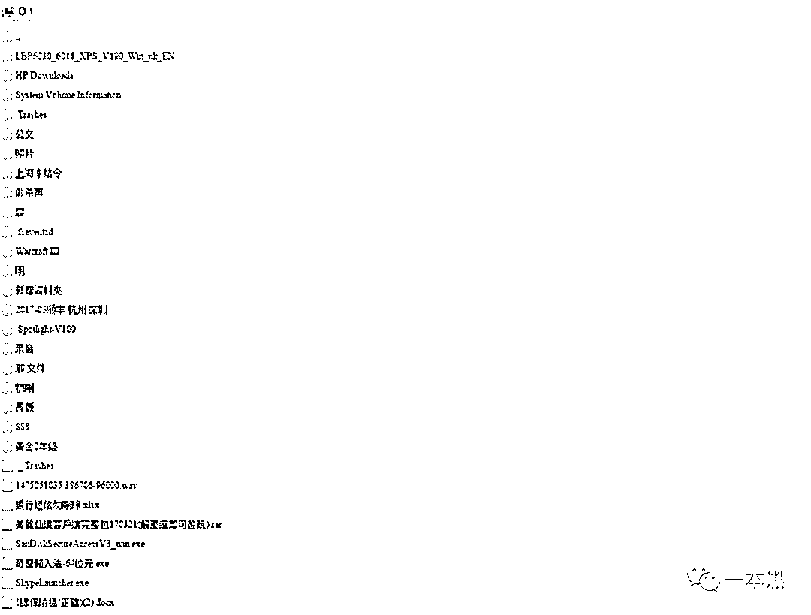

我看到了什么？魔兽三？

搞诈骗了还玩游戏，不务正业。

诈骗分子电脑中相关诈骗素材。

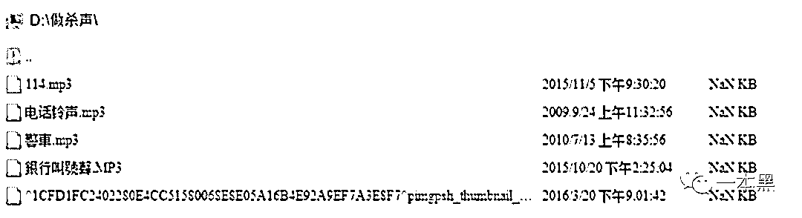

最后，在一个隐秘的地方，躺着一个名为“密码”的 txt 文件，里面记录了对方的一些账号信息，以及一名诈骗成员“宝”的 QQ 号及网厅信息。

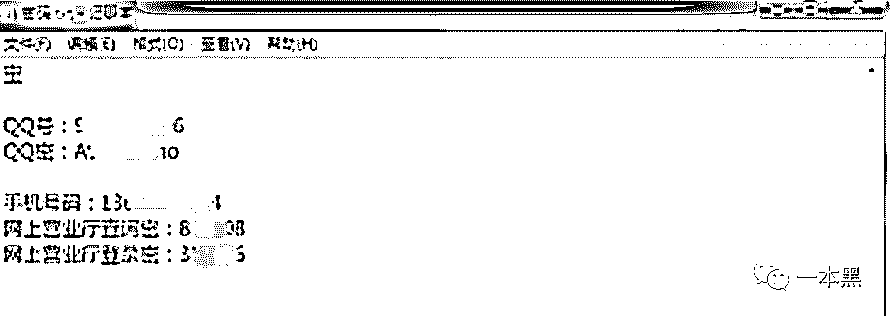

而后老师傅进入这位诈骗分子的 QQ 空间，对其好友进行分析后，发现他的好友处在诈骗链条的各个环节中。

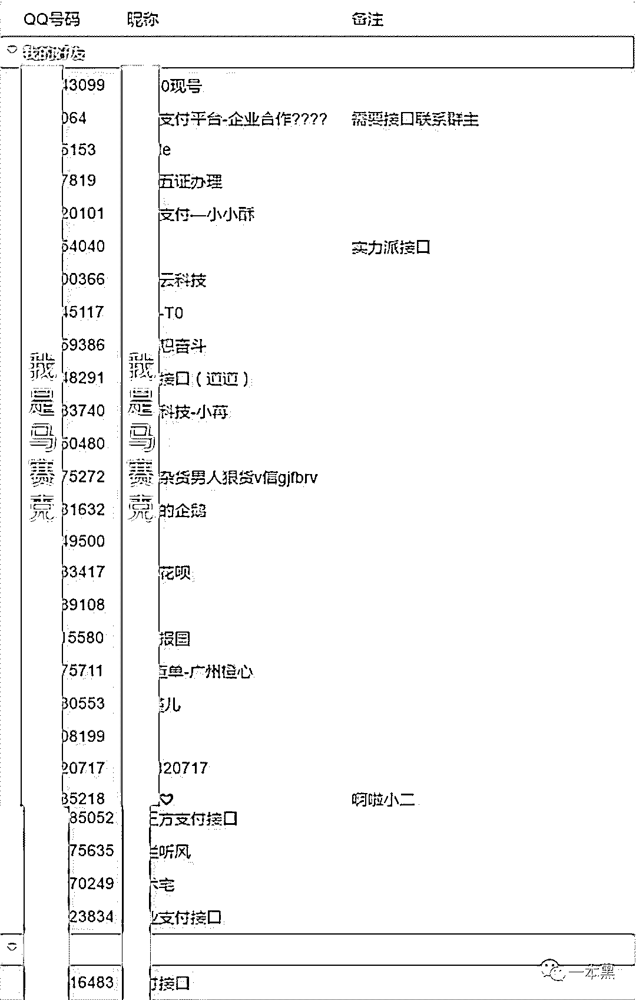

从该 QQ 所加入的群来看，身份证、支付、验证、充值等属高频词汇。

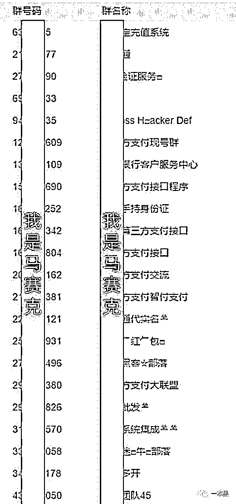

综上可判断，此人为该诈骗团伙的核心成员之一。

再根据“密码”文档中所记录的网厅信息，登录“宝”的移动营业厅后，可以看到此号码一个月的通话费用就高达 2500 多元，分析这个号码可能是用来诈骗的主要通讯号码之一。

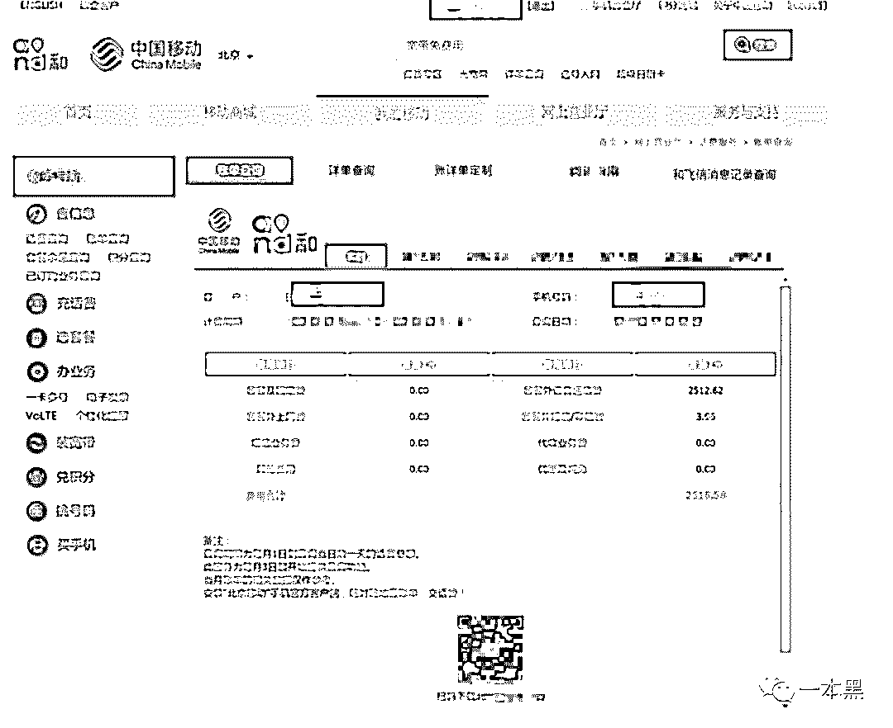

通过话单查询，可以看到诈骗分子的联系记录，这里可能都是一些受害者。

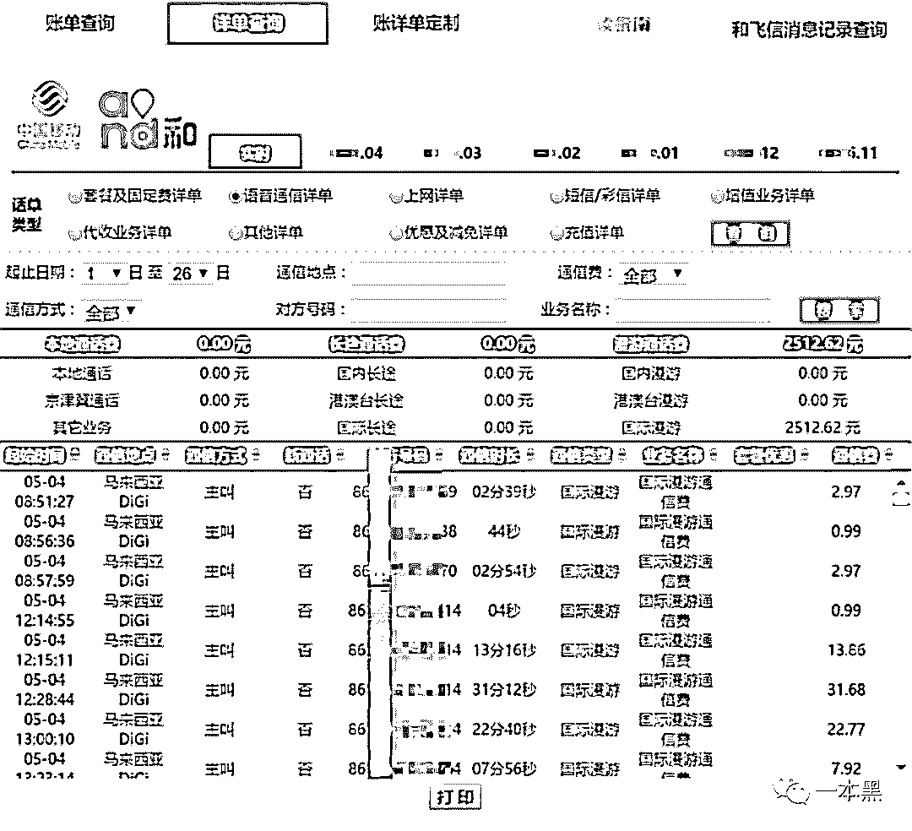

我们先尝试通知了这些受害者，告诉他们最近接到的电话其实是诈骗团伙的套路，根据反馈来看，受害者年龄和地域分配不均，零散分布在全国各地，有年轻人，也有中老年人。

但最让我们意外的是，在我们随机拨打的一些电话中，竟然有人觉得我们是搞诈骗的，话还没说完，直接就把电话给挂了。

这真是干挠头皮、没辙。

而后，老师傅在电脑中又发现了一个文档，里面记载着一个支付宝账号信息。

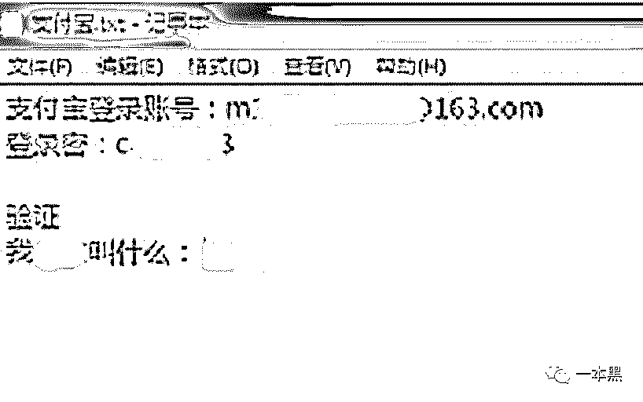

尝试性进入其中一个账号后发现，该账号日流水达到 30 多万，而这只是该团伙众多账号中的一个，由此可以推断整个诈骗团队的规模之大。

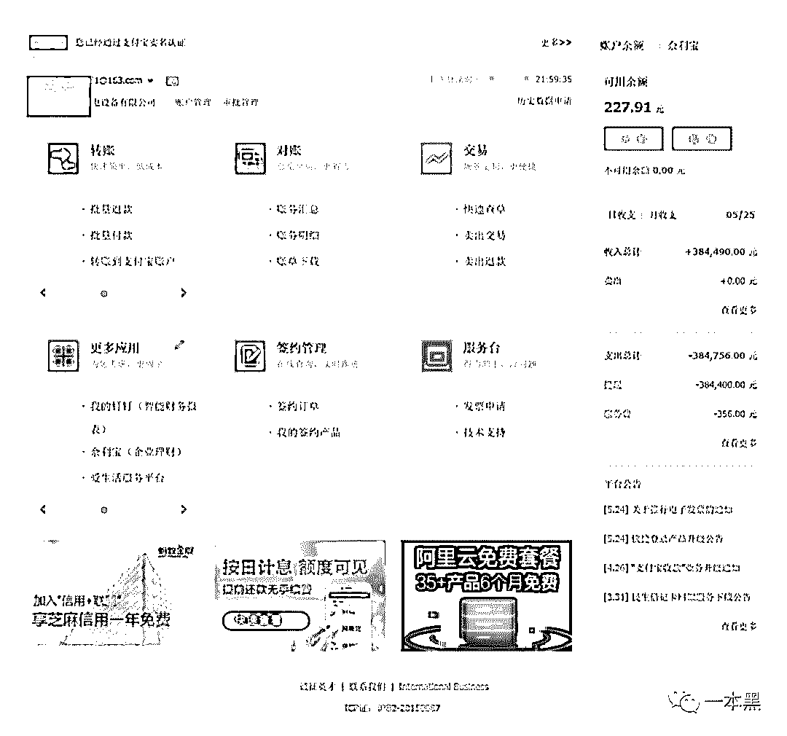

“伪造通缉令”的唬人能力和盈利能力，真是不容小觑。

最后，老师傅经过梳理，侧方面挖掘到了这个诈骗团伙其他部分成员及诈骗时所使用的电话号码。

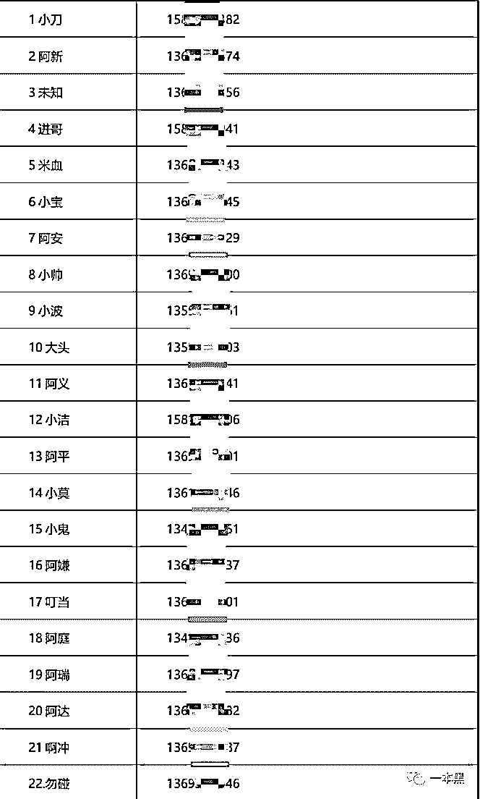

后续处理妥当后，我给哈皮打了个电话，简要说了一下调查结果，又跟老师傅一起找了个海鲜大排档，搓了一顿。

饭桌上，不停递烟。

考虑到保卫钱包身体健康，看来，劝老师傅戒烟要提上日程了。

**03 ****还原诈骗流程**

根据老师傅拿到的信息，与我朋友所遇到的情节相互映衬后，我尽可能还原了这个“伪造通缉令”主题的诈骗拼图。

整个诈骗流程，由五个环节构成。

*   非法获取受害者个人信息

诈骗分子在 Skype（即时通讯软件）的上游卖家处，购买受害者的基础信息，包含个人身份证号码、真实姓名及电话号码，然后在一个叫做诺正通的网站上，通过输入身份证号码及真实姓名，就能够查询到对应受害者的身份证照片。

*   构造特定受害者诈骗环境

整理受害者的证件信息及身份证照片，制作假通缉令和其他诈骗相关素材。

*   诱导受害者打开诈骗网站

通过对受害者基础信息的掌握，诈骗分子开始打电话联系受害者，通话时刻意强调自己虚构的权威身份，营造紧张气氛，并时不时重复受害者身份信息，以此起到震慑作用，骗取对方初步信任。

紧接着，诱导受害者访问诈骗分子搭建好的假网站，如 http://110.11****110.com、 http://110.11****110.com 等。

*   诱导受害者验证“三大模块”

当受害者按照指示打开诈骗网站后，进一步诱导其进行验证。

案件管理模块：诱导受害者“验证案件编号”，输入案件编号、受害者身份证号，调出通缉令以获取受害者信任。

个人身份电子凭证模块：诱导受害者进行”个人身份验证”，下载手机 APP(安卓)，其实就是个手机木马，它能获取受害者通讯录、短信/验证码等。

公证调查模块：诱导受害者进行“财产公证”，输入个人财产相关信息，获取受害者开户行/银行卡号/密码等。

*   电话诱导受害者进行转账

前面所有的铺垫，都是为了这一步，骗子会利用改号器，通话过程中还会刻意播放准备好的警笛声之类，伪造真实场景，若受害者完全顺从，就会被骗取钱财。

下面这张图，更加直观。

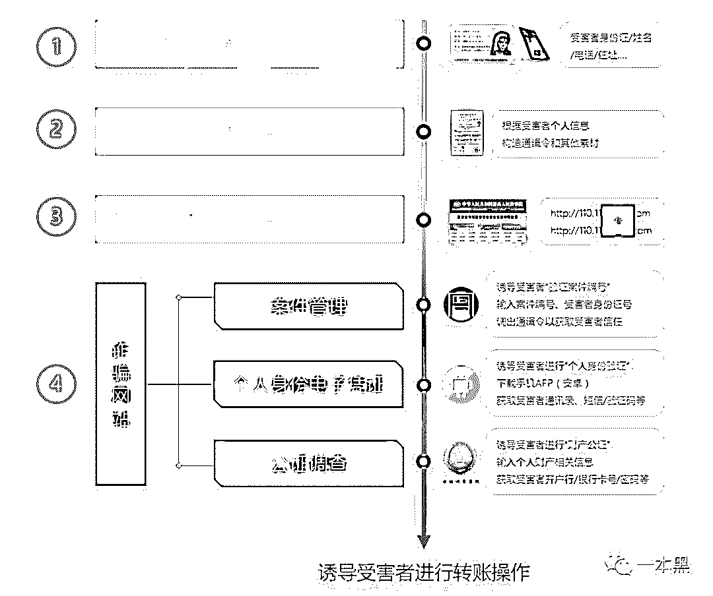

各位看官，乐事薯片涨价了，趣多多涨价了，奥利奥涨价了，水果涨价了，520 也马上到来了，面对骗子可千万不能开门迎客啊。

前不久，“鲁迅说过的话检索系统”上线了。

以前，如果拿不准一句话是谁说的，都说是鲁迅说的，但以后，恐怕不行了。

我觉得，互联网灰黑产也需要这样一个系统，收录所有已知的骗局套路。

在骗局面前，甭管你是什么职业、什么年龄，不论你平日多理智、多睿智，在那一刻，你都有可能掉进骗子构建的“情绪陷阱”中。

**只在于剧本高明与否，只在于成功概率大小。**

我不怕面对黑暗，怕的是不停看到有人深陷在相同套路的骗局中，却无力伸手挽救。

悲。

还原事实｜专扒黑产

微信 ID：darkinsider

知乎 一本黑

微博 一本黑 007

投稿、爆料、招聘、转载

请联系微信：chenchen_19940612