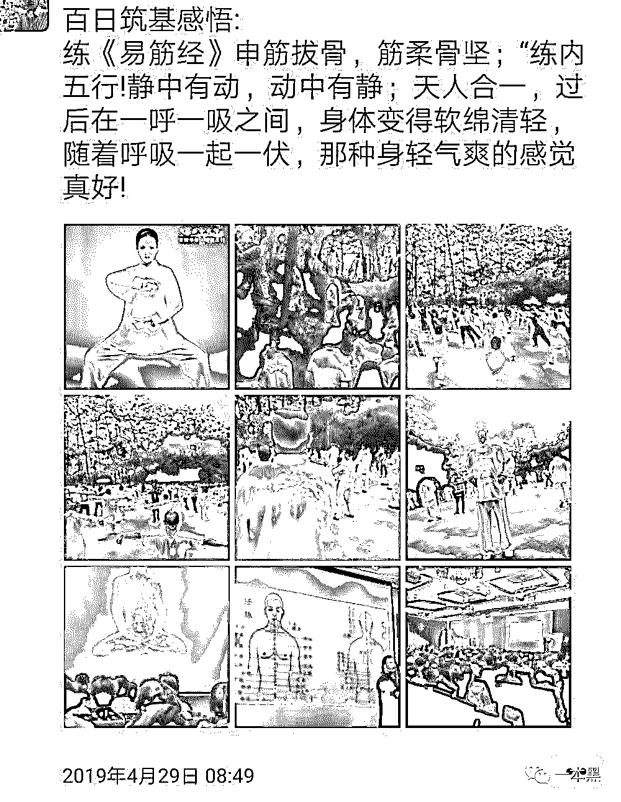
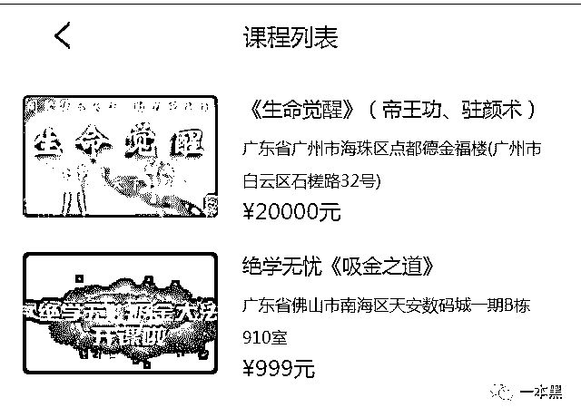
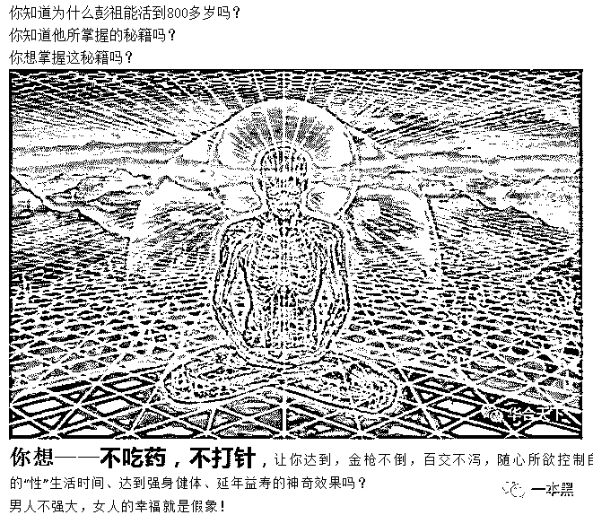
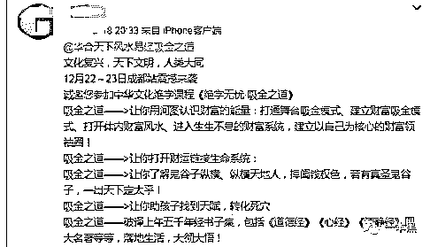
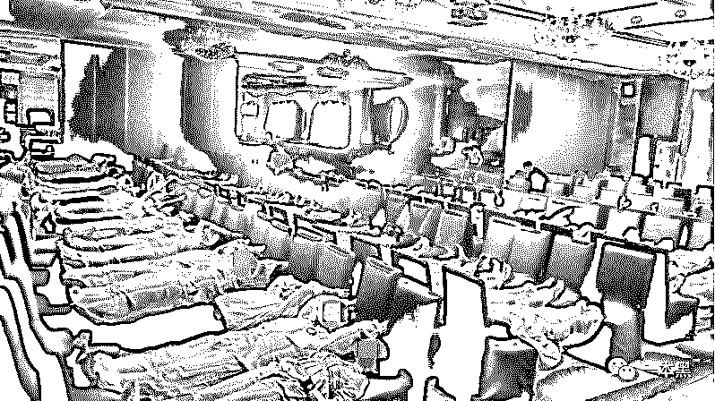
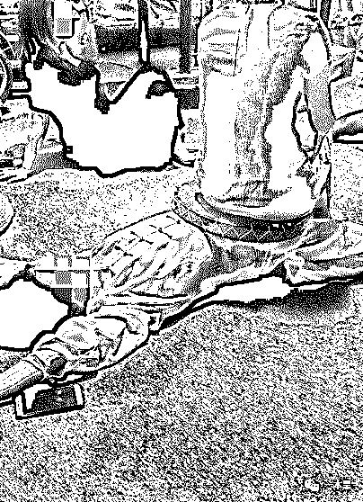
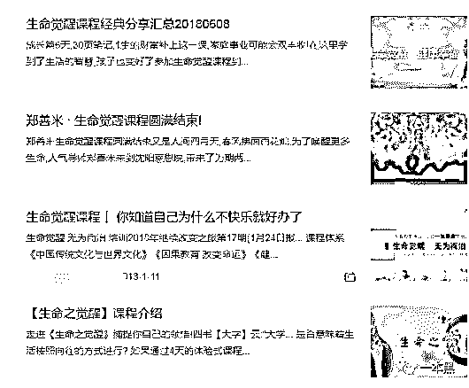
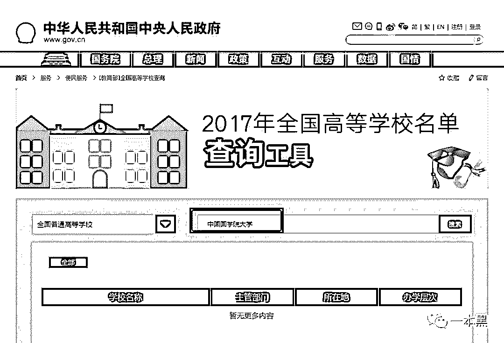

# 3000 块打通任督二脉，20000 块返老返童，中老年人健身狠招，闪瞎了我的腰

> 原文：[`mp.weixin.qq.com/s?__biz=MzU4ODAwNzUwMQ==&mid=2247485511&idx=1&sn=287f657cbf58b472746b1e919a49de6b&chksm=fde21965ca9590737520fab6d83de6bc89729a6988f026ae2d5fb06da145a9ae252fd8fb9826&scene=27#wechat_redirect`](http://mp.weixin.qq.com/s?__biz=MzU4ODAwNzUwMQ==&mid=2247485511&idx=1&sn=287f657cbf58b472746b1e919a49de6b&chksm=fde21965ca9590737520fab6d83de6bc89729a6988f026ae2d5fb06da145a9ae252fd8fb9826&scene=27#wechat_redirect)

【黑话连篇】

**该栏目更多的是揭露事件或对事件的看法，以达到让人精神得到升华的目的。**

> 你想夫妻和睦，X 生活和谐吗？
> 
> 你想延年益寿、长生不老吗？
> 
> 你想打通任督二脉、天人合一吗？
> 
> 你
> 
> ......
> 
> 你别想了，快洗洗睡吧。

前几天一本黑的后台收到一条爆料，有读者说自己的家人在参加完一场高端集会之后，被演讲者的魅力征服，花 3000 块让大师打通了任督二脉，每天都在家练功。身体是否更加健壮不知道，但是双腿乌青肿胀，无法直立......

**01****3000 块帮你打通任督二脉**

**要论健身，没有人能狠得过中老年人。这一点，你不要质疑。**

**因为没有亲身体验过，你永远也不会知道，把双腿折叠起来压在背后睡觉，究竟是一种怎样酸爽的体验。**

**事情是这样的，约摸在一个月前，爆料人的父亲在朋友的邀约下，参加了一场名叫“生命觉醒”的高端集会（中老年高端养生趴）。会上学了好几套强身健体的姿势，顺便由高人打通了任督二脉。**

**当然了，这得花钱。3000 块。**

**主讲人是该集团的创始人，他自称是上清派通灵门第 57 代弟子，全真教龙门派 20 代传承弟子，鬼谷子智慧绝学传承者，觉醒时代开创者。**

**说实话，这堆头衔，看字都认识，但却又不明白。我得查一查。**

**这一查，可不了得。我仿佛窥见了生命永恒的奥义。**

*****上清派通灵门**，**道教的衍生分支，也叫茅山派（没错，茅山道士的那个茅山），主张精神修炼，通过调节气息修身养性，直至长寿成仙。不画符、不炼丹、不做法事、不行房中术。代表人物有张果老和吕洞宾。至于通灵门，抱歉，我没找到资料。但我知道《笔仙》，既然都是通灵，那通灵门应该差不多。***

*****全真教龙门派**，**全真教是道教的主流派别，喜炼丹、画符、做法事，主张身心双休，灵肉合一、清心寡欲。王重阳、东华帝君是开山祖师，全真七子是其中的佼佼者。而丘处机正是龙门派的创始人。***

**鬼谷子就不说了，中华第一神秘、第一全能人物。**

**查资料的时候，我以为自己穿越了，穿到了金庸的《射雕英雄传》里，而我则是丘处机路过牛家庄时，郭夫人肚子里那个尚未出世的郭靖，期待着日后大展抱负，遇见我的蓉儿。。。**

**扯远了扯远了。这个所谓的创始人，怕不是和我一样，幻想自己穿越了吧。以为自己留着山羊胡就是张三丰吗？**

**辗转联系上了该集团联合创始人-芹姐，芹姐一年前还是客服，现如今已经是联合创始人了，想来能力不一般。**

**我问芹姐【生命觉醒】最近开课吗？她在五个小时后给我发了一张课程安排表，4 月到 6 月共开 13 场课，很不幸，我错过了四月那一场，等下一次的【生命永恒】要到 5 月 21 号才开课。**

**想知道课程的报名费是多少，但是芹姐一直不理我，估计在干大事。**

**于是我又联系上了一名销售，小姐姐人长得好看，说话又好听。开口就叫我师兄，顿觉心里美滋滋。**

**：你好，生命觉醒最近有课吗？**

**：师兄你好，最近一期是在佛山，从 5 月 15-19 号。**

**：这个课主要是讲什么的？**

**：生命觉醒就是你说的吸金之道啊，师兄。**

**：我不要讲赚钱的，有关于健康的课吗？**

**：师兄，5 月 21-23 号，在中山有健康课【生命永恒】。**

**：好的，健康课是关于哪一方面呢？**

**：师兄，这个课程主要讲的是打通身体机能的任督二脉。**

**：打通任督二脉有什么用？**

**：师兄，我打通任督二脉之后，身体变好了，浑身充满了力量。加上我每天练功，练凤凰涅槃和站桩，现在精神饱满，做事效率都特别高。**

**：怎么报名啊？**

**：师兄，你如果要去的话，要找你的邀约人报名哦。**

**：可以在你这报名吗？**

**：师兄，可以在我这报名，你把名字和电话发给我，然后缴纳 3000 块的报名费就可以了。**

**：课程包含什么？**

**：这个课程就是打通任督二脉，激活肾功能的。我给你发个资料，你先看看，有问题再问我哦。**

**：好。**

**听到“激活肾功能”这五个字，我觉得我的肾一阵阵抽搐。**

**怕我不信，小姐姐还发了好几张前几天深圳一群中老年人集体打拳的照片给我。嗯，和爆料人父亲第二次参加的活动一模一样。**

****

**小姐姐发的课程介绍里写了，课上除了打通任督二脉，还会讲解《易筋经》、《洗髓经》的内功心法。**

***“女人通任脉，小鸟依人，柔情似水”***

***“男人通督脉，霸气十足，精力旺盛”***

***“量子禅修和共振，打通身体玄关窍，实现精气神通达”***

***“课程价值三百万，结缘只需 3000 元”***

**看完介绍，的确精力旺盛，因为我想骂人。这都是些什么东西。**

**打通任督二脉只是扣开了身体机能的一扇门，想要真正强身健体，还需勤加练功。站桩是基本，凤凰涅槃是进阶。需得内修心法，外练招式，才能实现天人合一。**

****02 ****20000 块返老还童****

******在该公司的官方网站，我找到了他们的全部课程价值 999 元的《吸金知道》和售价 20000 的《生命觉醒》。******

******但随着公司业务的扩大，课程实际上已经不止上述两种，3000 块的《生命永恒》和 999 的《二代觉醒》以及《演讲觉醒》是最近新推出的课程。******

************

******吸金之道讲风水和财运，生命觉醒讲健康，哦，不。讲如何提升 X 生活品质。毕竟它是*，“男人称霸天下的法门，女人母仪天下的密码”。*******

******我曾以为帝王功要告诉我如何拓展王图霸业。后来我发现，我是多么无知和短视，连小姐姐暗示我肾亏都没发现。******

******所谓帝王功是指*激发男女的潜力，全方位提升 X 生活能力，只有 X 生活和谐。**“缺乏“X”智慧、“X”功夫，让男人自尊毁灭，让女人一生悲惨”！*学了帝王功，让你七八十也能像十七八一样，金枪不倒，精神抖擞。**（此处只有一句话能代表我的心情：放屁）******

************

******生命觉醒课程宣传文案******

******所谓的吸金之道，更是无稽之谈，通过摆放各类物件，调整家中风水，就可以财运亨通，坐享荣华富贵。******

************

******假使钱真的这么好赚，那我早就成亿万富翁了。呵呵。******

************

************

******练功现场******

******我不知道这个靠着风水和玄学的捞金课是怎么给中老年洗脑的，微博上我们也能发现一些【生命觉醒】的追随者，她们每日站桩练功，希望以此保存身体健康。******

******爆料人的父亲说，自己在被打通任督二脉之后，已经能够感受到人的真气。我不知道真气是个什么东西，我也不信玄学。所以我至今还没能窥见生命永恒的奥秘。******

******原以为这只是中老年人的智商税，结果，他们连孩子都不放过。******

******如果说生命觉醒是为中老年人量身打造，那么【二代觉醒】就是特地为孩子挖的坑。******

******这个课的售价为 999 元，参加这个课的孩子，最大的 19 岁，最小的不过 1 岁半。除了所谓的练功，他们还要学习弟子规和孝道。******

******当然这些课程并不都是三天就结束了，微信群里偶尔也会有其它国学经典的讲解。至于讲师嘛，还是那个销售小姐姐呢，我有幸在她朋友圈听过她的一节课，关于生命智慧和人生永恒。******

******要是你问我观后感，emmmm，咱还是谈谈心灵鸡汤吧。******

********03****10 万块成为集团合伙人********

****前段时间朋友圈卖课的特别火爆，社群裂变、消费返现火的一塌糊涂。我原以为这个养生课只是玩些忽悠的手法，没想到这些营销手法他们也都用的炉火纯青。****

****爆料人说，他父亲想要成为课程合伙人，条件是交 10 万块，就可以享受集团分红，至于比例，因为还没交钱，所以暂时不是很清楚。****

****合伙人这件事，问芹姐，似乎更可信，毕竟她可是联合创始人。****

****芹姐和我说，只要在他们那消费满一万并推荐朋友买课，就可以享受朋友消费金额 10%的返利，消费满 3 万就可享受 30%的返利。消费金额越大，返利比例越高。****

****可这和爆料人所说的似乎有些出入，于是我又问了销售小姐姐，她给我的回答又不一样。感情是一人一个价。****

****芹姐说公司希望在传道布法的同时，能给大家带来更多的收获，除了身体上的健康，金钱上同样能有所收入。****

****不久后公司还会开启线上商城，希望我也加入。****

* * *

****类似的生命觉醒系列课程在网上一搜一大推，有的需要先成为会员，交了会费才有资格买课。有的报名的必须要有邀请人。****

****尽管参会的要求各不相同，但他们却有一个共同点：收费都不便宜。从几百上万都有，课程时间都在 3-7 天，有的打着传播国学的幌子，有的则是以心理疗愈为借口。****

******** 

****我们该如何定义这类课程呢？****

****传销吗？不算，不符合传销的定义。****

****诈骗吗？也不是，都是心甘情愿掏钱，还上了课的。****

****灰黑产？也不是。****

****这大概就是我们常说的智商税，还是专为中老年人设计的。都说国人有四大智商税：男人怕穷，老人怕死，女人怕丑，孩子怕笨。****

****这些课程也正好这么设计的，不要 9 万 9 也不要 9 千 9，只要 999 块就可以用风水轻松化解厄运，福来运转。想要长命百岁当然也行，多花个一两万块就好了。****

****怕老、怕病、怕给家人添麻烦的老人多半会心动的，要是觉得贵，花 3000 块打通任督二脉，再传授你两套内功心法，一样可以童颜鹤发。****

******** 

****爆料人的父亲所参加的这个生命觉醒课是由一个名叫 XX 天下的公司所举办的，公司地址在深圳，主营业务为教育培训和经济演出以及文体用品销售。说白了就是一个专门搞巡回演讲卖课的。****

****一般打着国学名义的也都会借着知名学府的旗号，XX 天下说创始人是中国国学院大学广东研究分院的院长，但是教育部官网查不到该学校的任何有效资质。****

********

****假学历，假背景，无资质的培训讲师，打着国学的旗号招摇撞骗，偏偏还有那么多人上当。****

****芹姐说他们的目标是招满三万名学员，将中国传统文化传播到每个角落。****

****一个月 8 场活动，一场邀请 100 人，成交 20 人，一人 3000，一个月就可以收入 48 万。一年就是六百多万。****

****嗯，“国学”的魅力真大。****

****他们说，当钱币扔在钱柜里叮当作响的时候，你就可以飞升成仙了。****

******** 

****还原事实｜专扒黑产****

****微信 ID：darkinsider****

********

****知乎 一本黑****

****微博 一本黑 007****

****投稿、爆料、招聘、转载****

****请联系微信：chenchen_1994061****