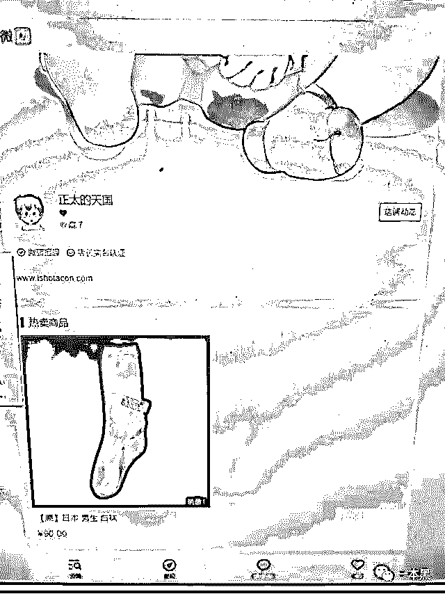
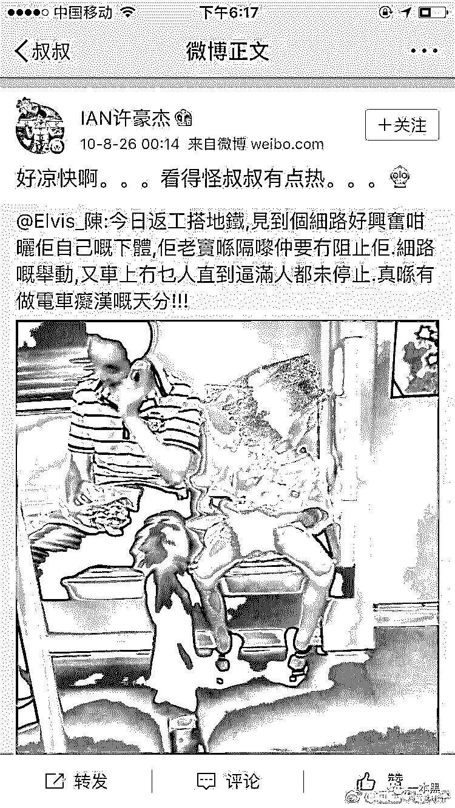
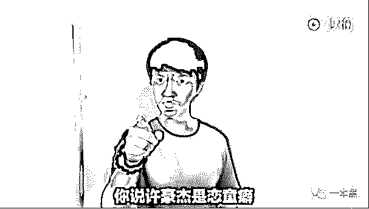
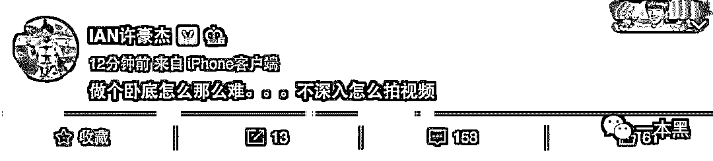
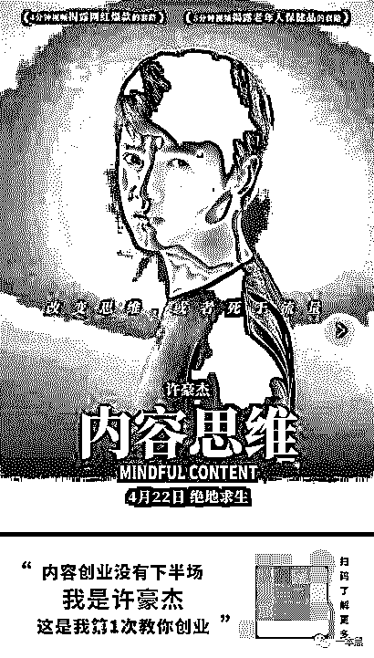
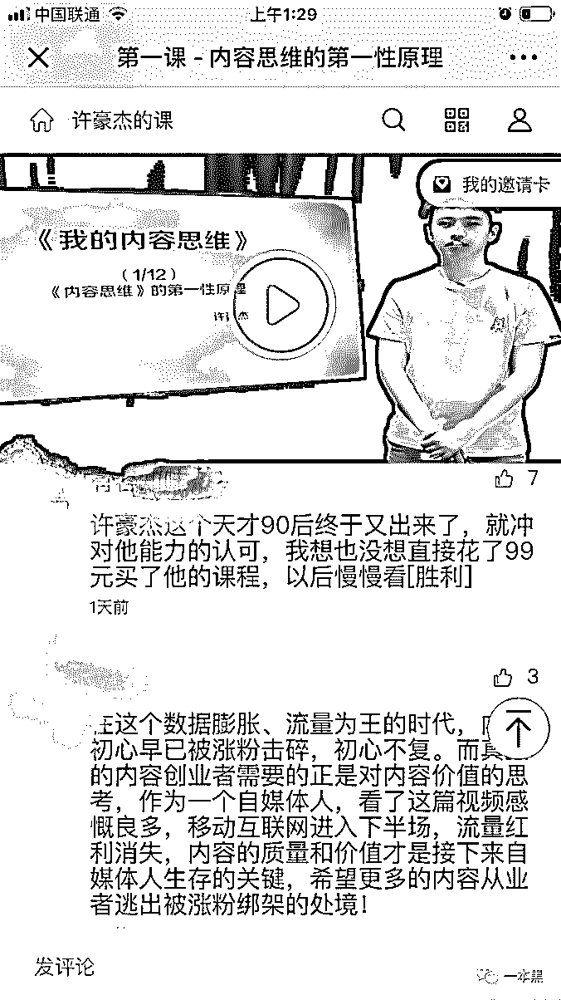
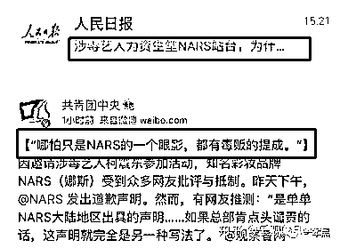

# 自称“卧底”、注册儿童色情网站，恋童癖变身自媒体导师？

> 原文：[`mp.weixin.qq.com/s?__biz=MzU4ODAwNzUwMQ==&mid=2247485477&idx=1&sn=8d4f8973b0a74daf25ceaf6e9acce984&chksm=fde21907ca9590112984e391b6402a5cf45fe977290c40db624610e240692060f5417f70937c&scene=27#wechat_redirect`](http://mp.weixin.qq.com/s?__biz=MzU4ODAwNzUwMQ==&mid=2247485477&idx=1&sn=8d4f8973b0a74daf25ceaf6e9acce984&chksm=fde21907ca9590112984e391b6402a5cf45fe977290c40db624610e240692060f5417f70937c&scene=27#wechat_redirect)

> “我不是恋童癖，我只是正太控”
> 
> “我创立儿童摄影网站，不是色情网站”
> 
> “我承认我买卖原味产品，但我绝对不是恋童癖”。
> 
> “我注册儿童色情网站，因为我是个卧底。”

如果有一天，你发现你喜欢的大 V 是个恋童癖......

**01 ****创业大神与恋童癖**

五一放假找老师傅一起出去吹风，我们坐在广场边的台阶上一边抽烟，一边看那些学滑板的小孩，顺便感叹一下我们逝去的童年。

“那个恋童癖回来卖课了。”老师傅突然来了这么一句话。

“谁？哪个恋童癖？卖什么课？”

除了在网上搜过“如何不动声色地对付熊孩子”之外，对于儿童安全知识我一无所知，直到我开始了解许豪杰及其往事。

2013 年，超级演说家大火的时候，一个叫许豪杰的年轻人获得全国季军，开始进入大众视野；

2016 年，许豪杰在 B 站等平台发表多个创业及揭秘类视频，因其犀利的言语被网友称为男版 papi 酱；

2017 年，许豪杰被豆瓣网友扒出是恋童癖后销声匿迹；

2019 年 4 月 22 号，沉寂近两年的许豪杰高调回归，并开始卖课。

六年前，许豪杰成为第一届超级演说家的全国季军，那大概是他前 23 年人生里的高光时刻，鲜花、掌声、光环时刻环绕。

当年大家对于 90 后的印象还是“颓废、没担当、垮掉的一代”，在一片批判声中，许豪杰成为 90 后的异类，他的一篇演讲稿《不是所有 90 后都是许豪杰》成为了 90 后正名的呐喊。

他的每一次演讲都有固定的开场白或是结束语 “我叫许豪杰，是一名 90 后，这是我第 XX 次创业的一个项目”，也正是因为这句话，他被网友戏称为创业大神。

在这之前他曾是童装摄影师、直播主持人、业余作家以及脱口秀演员。

在 B 站上，我们依然能看见许豪杰发布的视频，关于创业、关于保健品骗局、关于行业揭秘，评论区都是对他才华的赞许。

人们为他的仗义执言而喝彩，一些人认为他是当代鲁迅，能够敢于言他人而不敢言之事。

但，也有一些人让他滚出互联网，永远消失。

这个转折发生在 2017 年。

那一年的 7 月 16 日，豆瓣网友沉默如海发表了一篇名为《怎么能想到我喜欢的微博大 v 段子手竟然是恋童癖！！》的文章，正是这篇文章揭开了段子手、创业大神许豪杰深藏已久的另一面。

文章中写到，许豪杰创立的“正太天国”网站，长期发布极具暗示性及挑逗性的儿童色情视频，并且提供资源买卖。

尽管该网站早在两年前已经被关闭，但今天在百度上，我们仍能看到一些照片。比如，网站注册人 xuhaojie，比如微店所售卖的**男童原味白袜。**

来自百度快照

沉默如海指证许豪杰的资料远不止这些，经查验许豪杰的微博关注了好几百个买卖儿童色情资源的博主，而他也曾多次在微博发表一些低劣、猥琐的言论。譬如，对着地铁上没穿裤子的小男孩照片说，好热。再譬如，转发如何使用 ipad 骗走幼儿园小朋友的微博。

来自豆瓣用户 沉默如海

甚至，有贴吧和知乎用户爆料说，许豪杰曾公然向他们约 P，而那时他们尚未成年。（注：与 14 岁以下的未成年人发生关系，不管是否出于自愿，都是 qj 行为）

在众多实锤下，许豪杰接受了采访，他说：图是 P 的，证据是假，自己是无辜的，沉默如海这是在造谣。

     

> “我不是恋童癖，我只是正太控”
> 
> “我创立儿童摄影网站，不是色情网站”
> 
> “我承认我买卖原味产品有些恶趣味，但我绝对不是恋童癖”。
> 
> “我只是喜爱儿童摄影，我没有买卖儿童色情影片，我没有违法。”
> 
> “我憎恨恋童癖，但网友觉得我在演戏。”
> 
> “我注册了很多儿童色情网站，因为我是个卧底。”

“我的确注册了很多的色情网站，那是因为我又一次无意发现其中包含儿童色情，这种事情不合理也不合法的，所以我看到一个就会举报一个。为了进一步摸清情况，我在一些网站连续签到 675 天，掌握了大量证据，并提交给了警方，我是公安部第八批奖励人名单之一。你看这些银行流水，都是警察给我的现金奖励。”

       

随后许豪杰发了一封律师函，要求沉默如海在内的几名网友以及豆瓣等平台删除帖子，并道歉。

**02**  **i will be bak**

当然，那场官司，许豪杰输了。

之后许豪杰的微博注销，B 站账号被封，微信停止更新。他消失了，去了哪，不知道。

但是 2018 年 8 月，他在 B 站更新了一张自己的照片，上面写着 “ I'll be back。”评论区一片叫好，一些人在狂欢，一些人在庆贺，一些人在为许豪杰洗白。理由是：他动了行业的奶酪，被报复了。那些污蔑他、诽谤他的人良心不会痛吗？这样的人早晚狗带。

而许豪杰也回复，凡事忍耐。一副委屈的模样引来无数的怜悯。

为他站队的人称“当愚昧成为主流，清醒便是犯罪！”还有一些人并不清楚许豪杰的为人，但他们认为作品反应人品，无论如何支持他。

那些清楚他过往的人觉得“人孰无过”，没有犯罪就不是大事，一切都可以从头再来。

2019 年 3 月，有网友发现抖音上有个叫星座袋头哥的号疑似许豪杰回归，但遭到了否认。

紧接着，4 月 22 日，许豪杰高调回归。在同名微信公众号上，他发布了一篇文章《，》开始正式卖课了。

课程名字叫《内容思维》限时售价 99，几天后价格重新调整为 299，主要教如何用手机+99 块钱的三脚架做原创视频自媒体。

> **299 块，12 节课，让你的内容估值一个亿。**

 

除了花钱买，转发朋友圈集赞也可以免费领取课程。看来“许老师”虽然离场虽久，但对自媒体玩法依然熟悉啊。

按照要求，我转了海报，集了赞，我以为小助手会给我一个课程兑换码。结果她只给了我一个百度网盘的链接以及一个提取码。

她还提醒我，课程是录播，可以反复观看的哦。

打开链接，我才知道原来免费课程只有两节总时长为 15 分钟的体验课。**呵，套路真多。**

第一节课劝诫大家，做视频要做有价值的内容；第二节课讲的拍视频一定要有四件套：三脚架、电脑、充电宝和麦克风。另外，工具不重要，内容才是王道。

然后课程就结束了。

按照许豪杰的说法，12 节课就能让我创作的内容估值 1 个亿，那看完这两节课怎么着也能得到 1000 万的投资了。呵呵。

 

我不知道评论区那些吹得天花乱坠的留言到底是他的粉丝还是水军。但我知道 B 站和知乎一直有人为他洗地，“没有证据证明他是恋童癖，那些都是造谣”、“没漏点就不是色情”、“没发生性侵就不是犯罪”、“意淫无罪”。

尽管我厌恶熊孩子，但要是有一天，一个中年变态大叔留着口水对着家里的熊孩子说：“乖乖，你让叔叔好热啊”。我 TM 一定一拳打爆他的头。

**03** **污点明星复出有多容易**

有人说恋童癖是一种先天的性取向，改不了；有人说这是一种心理疾病，得治。但不管是病还是天生，只要引发 X 高潮的对象是孩子，就是禽兽。

抛开恋童癖不谈，在中国，公众人物犯错，怎么那么容易就能被谅解呢？是网友太宽容，还是互联网太健忘？

不管是吸毒、酒驾还是偷税漏税，道个歉、鞠个躬、再撒几滴眼泪就可以名正言顺地复出了，从网红到明星，无一例外。

17 岁辍学、整容、泡夜店的土嗨蹦迪女神，凭借那段著名的车库摆手舞 “古驰古驰普拉达普拉达”，短短十天之内俘获千万粉丝，成为抖音大神级别的网红，后因黑历史被挖出，一夜之间被封杀。

然而仅过了两个月，温婉换了个平台便再次复出，不过这次她做的是美妆博主。尽管风头不再，但人气依然不可小觑。

温婉仅仅是整个娱乐圈或者说这个社会的一个小小缩影。

2014 年 8 月 14 日，柯震东因聚众吸毒在北京被捕。三天后，事件在网络被曝光，引起一片哗然，大家纷纷发声，希望他永远退出娱乐圈。

半个月，柯震东在北京举行道歉会，会上痛哭流涕，泣不成声，他说为自己愚蠢的行为后悔莫及，辜负了大家对他的期望及厚爱，希望大家不要学这种违法的行为。自己一定会好好反省，努力改正。

然而事情才过了不到 5 个月，柯震东就出席了商业活动，宣布正式复出，虽然观众并不买账。

虽然他每一次宣布复出都会等来观众的一句“滚回去”，但是柯震东似乎成为了娱乐圈吸毒明星最执着复出的那一个。

知乎网友说他这种行为是在试探，试探网友的心理防线，等到一天大众开始松懈的时候，就是他重回巅峰的时候。

2018 年他为 NARS 站台，遭到了共青团的点名批评“哪怕只是 NARS 的一个眼影，都有毒贩的提成。”但是 so what，他在 ins 上哭戚戚，依然有粉丝心疼的呼喊“救救孩子”。

 

在柯震东复出的微博底下，有一些留言格外让人心酸。

**“他吸毒了可以复出，我兄弟禁毒牺牲了能复活吗？”**这条留言来自一名缉毒警察。

自媒体时代个体影响力被无限放大，每一个公众人物都是一个超级个体，对他们过错的极度包容就是队底线良俗的挑战。因为你压根不知道追随他们的究竟是你我这样的成年人，还是不谙世事的孩子。

在庞杂无序的互联网中，什么的勾当都有，什么样的人都在。我们无法过滤掉每一个杂质，但我们仍应竭力创造一个干净的、安全的环境。

**THE END**

百年前鲁迅先生在《狂人日记》的末尾中写着：救救孩子。

百年后的今天我们对着瘾君子和谎话精，大喊“回来吧，原谅他吧，他还是个孩子啊！”

简直可笑至极。

还原事实｜专扒黑产

微信 ID：darkinsider

知乎 一本黑

微博 一本黑 007

投稿、爆料、招聘、转载

请联系微信：chenchen_19940612