# 有房有车还去筹款 100 万，德云社演员还要不要 B 脸？

> 原文：[`mp.weixin.qq.com/s?__biz=MzU4ODAwNzUwMQ==&mid=2247485466&idx=1&sn=7b04aefedcf34dac9aaf0c8453eaa39f&chksm=fde21938ca95902e5c2953a87433eba90d3e53611889809ba9afc9a0186cd49824f90c21dd5c&scene=27#wechat_redirect`](http://mp.weixin.qq.com/s?__biz=MzU4ODAwNzUwMQ==&mid=2247485466&idx=1&sn=7b04aefedcf34dac9aaf0c8453eaa39f&chksm=fde21938ca95902e5c2953a87433eba90d3e53611889809ba9afc9a0186cd49824f90c21dd5c&scene=27#wechat_redirect)

【黑话连篇】 **该栏目更多的是揭露事件或对事件的看法，以达到让人精神得到升华的目的。**

* * *

4 月初，我在睡前例行批阅“微博奏折”之时，刷到了德云社相声演员吴帅（艺名：吴鹤臣）突发脑出血昏迷入院的消息，心中一惊，才 30 多岁的年轻人啊，唉，希望能快点好起来。

看看时间已过零点，想想卡里的余额，吓得我赶紧放下手机，闭上眼睛。

毕竟这年头，不敢病、不敢老、不敢死，家里没矿，水龙头里也流不出 SK-II。

万万没想到，时隔多日，当我再次看到吴鹤臣的消息，却是在舆论的风口浪尖之上。

**众筹变成了“众愁”。**

**01 ****车房不能卖，治病靠众筹**

5 月 1 日，广大劳苦大众迎来了期盼已久的小长假，也正是在这一天，一场“劫贫济富”的苦情大戏拉开了帷幕。

吴鹤臣的家人在网络社交筹款平台“水滴筹”上发起众筹，急需筹款一栏，金额显示为 100 万元，没过多久，已筹金额就超过了 14 万。

果然，世上还是好人多。

但是，好人并不傻。

很快，就有网友指出，作为土生土长的北京人，**吴鹤臣月收入 6000+，拥有北京医保，家里在北京有两套房、一辆车，父母均享有退休工资，月合计 8000+。**

这样的家庭条件，在面对脑出血的时候，**居然需要众筹 100 万？**

关于这 100 万的金额设置，吴鹤臣的妻子张泓艺回应：第一次发起众筹，不懂规则，便输入了上限额度。

并且三次重复已筹到的金额，着重强调没有逼捐，没有骗捐，纯属自愿。

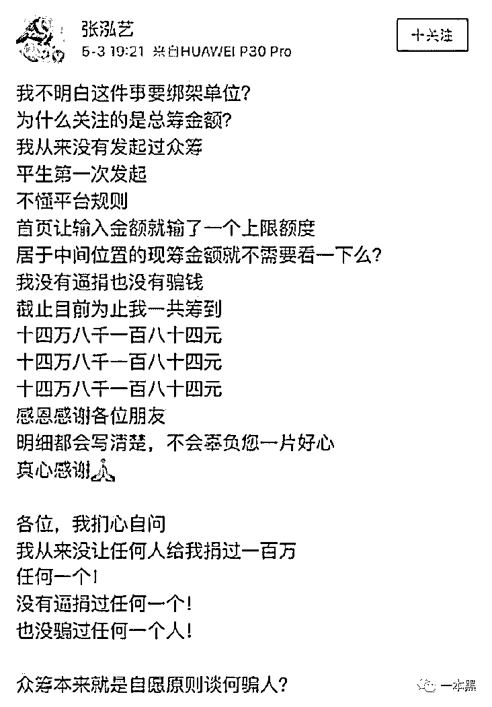

看这语气，丝毫感受不到对好心人的真诚谢意，反而体会到了浓浓的不满意。

不光是网络筹款平台，社区居委会还为其募捐一万多元。

不说别的，医保就已经能够报销相当比例的费用了，就算还有缺口，亲朋好友就没有一个能搭把手的？

在被质疑若缺钱治病，为何不考虑卖车卖房，或者借钱以度过难关的时候，张泓艺再次出来回应，她解释到：

**两套房子不能卖**，因为都是六环外的公租房，一套在父母名下，一套在爷爷名下，但爷爷已经过世；

**两套房子不能出租**，因为搬家需要时间，且两位老人年纪已大，不宜奔波，若期间老人出现问题，无法应对；

**一辆车不能卖**，因为车是婚前购置，且家中有两位瘫痪病人，日常出行不能没有车，还特意强调，在北京生活的人都知道车的重要性；

**不能找亲戚借钱**，因为家家有本难念的经。

       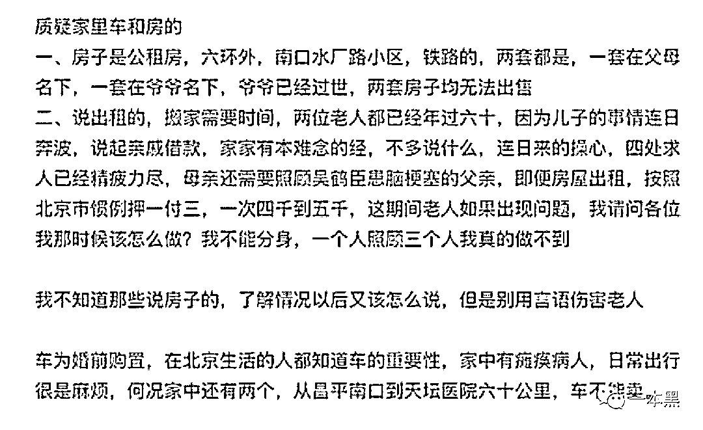

此外，张泓艺还给出了后续花费计划：包括天坛医院附近整租两居室两年的费用 12 万，半年护工 4 万，三个月针灸推拿 1 万，颅骨修复手术费用 4-10 万，术后康复治疗费用预估 5 万及其他多项费用不详的项目，并注明康复期内夫妻俩无任何经济来源。

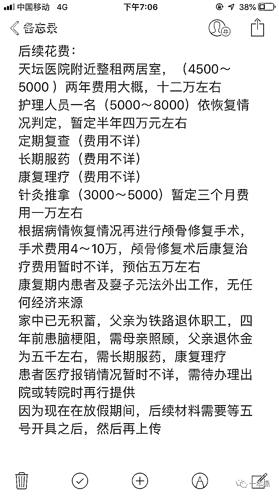

这样的计划，真是令人吓到头掉：**敢情租房、请护工、康复费用等，都得众筹来买单**。

不知吴鹤臣家里是有本多难念的经，张泓艺不但能把网友的质疑一一怼回，还能接连发长文，在冷静、有条理地讲述家中困境的同时，不忘附上筹款链接，号召善良人士继续向着 100 万元的众筹目标迈进。

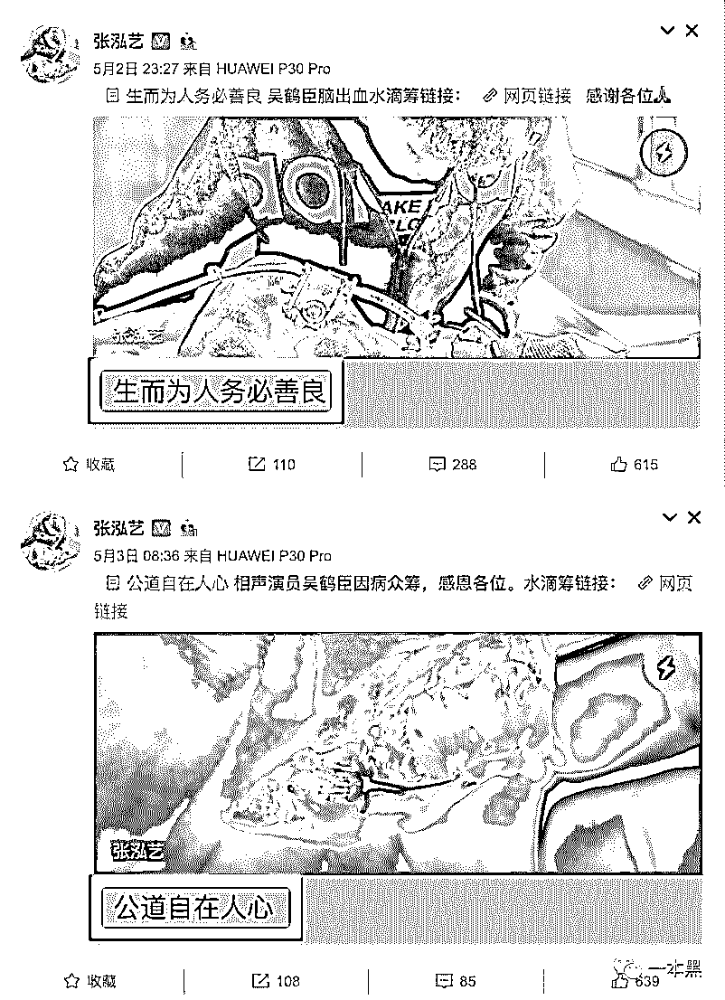

我就想问一句：这标题是认真的吗？

而且，微博的小尾巴却诚实的显示出她所使用的手机型号：**华为 P30 Pro。**

嗯？要是没记错的话，华为 P30 系列是 4 月 11 日才正式发售的，而那已经是吴鹤臣脑出血入院的第三天了，买最新旗舰款手机能拿出钱来，交医疗费的时候开始喊穷？

对此，张泓艺接着回应：夫妻俩平日都是月光族，毫无存钱意识，这手机是在老公吴鹤臣生病之前订的，没有挪用善款。

嗯，你说的都对，但凌晨点赞搞笑微博这种操作，放在当下的处境中，实在是令人匪夷所思。

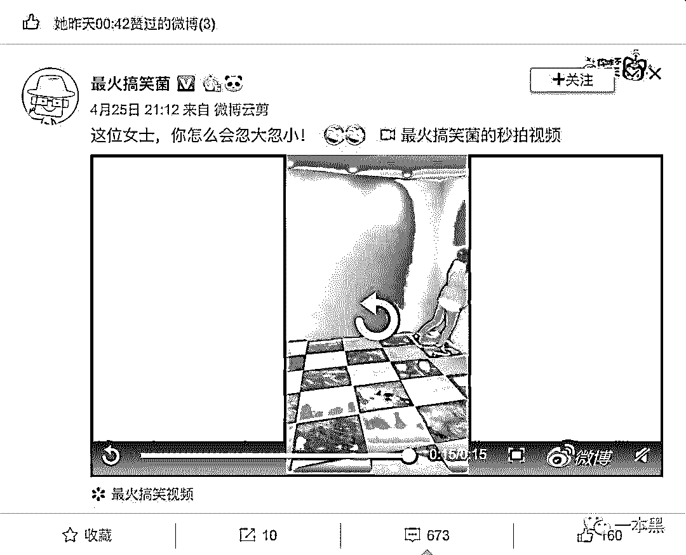

是家人不好陪，还是困境不好思考，还是太年轻不知道微博点赞会有所显示，还是…？

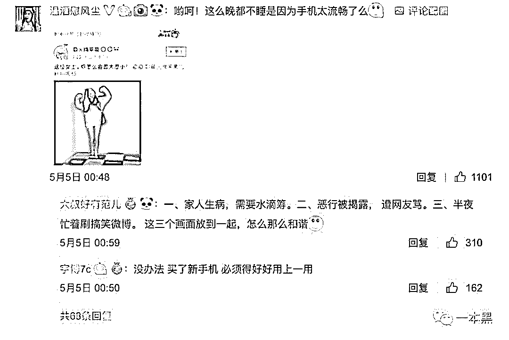

当事人的心理谁也不能透彻把握，但此举无疑是给社会信任当头一棒，有网友这样评论到：

**“给你捐款的可能是家里炒菜不敢多放一片肉的，也可能是面朝黄土背朝天的农民，亦或者顶着烈日工作的农民工，也有可能是起早贪黑的环卫工人，还有可能是舍得捐出自己生活费的学生。不是因为他们的钱多到花不完，是因为他们善良，有良心。而你，这个点还在忙着刷搞笑微博。”**

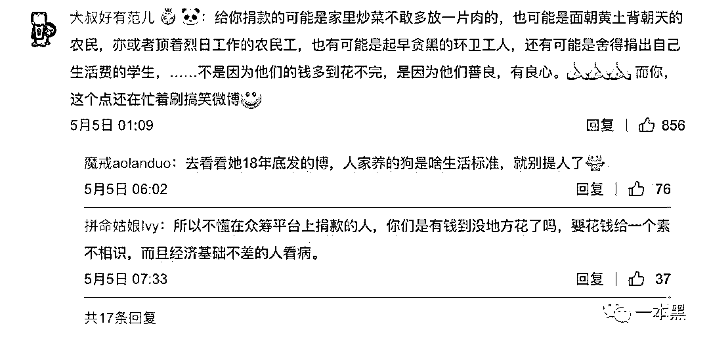

谁也无法叫醒一个装睡的人，她只是悄无声息的更改了微博机型小尾巴。

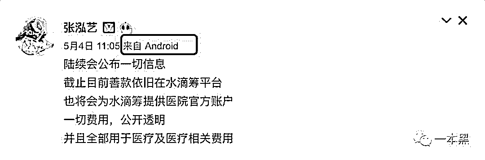

多方质疑，不断升温的舆论，让张泓艺被迫停止了众筹计划，许是为了缓和一下局面，张泓艺澄清：善款还一分未动。

 

众筹原本是雪中送炭，但以目前的情况来看，张泓艺根本不需要这些炭。

你可知道，有多少人正徘徊在生死线上，盼着每一分救命钱，而你，却肆无忌惮的消耗着社会信任。

消费善良，透支信任，简直可耻至极！

**02 ****水滴筹“无资格审核发起人车产和房产”**

5 月 1 日发起众筹，3 日停止众筹，5 日水滴筹在微博发布声明，称患者病情属实，尚未申请提现，若申请提现平台会进行公示，患者治疗情况和款项用途会持续公示。

同时，声明委婉的表示：**平台没有强制规定有车有房就不能发起筹款**。只能最大程度要求发起人最大化公布实际情况，用户需要按平台规定去提交相应的审核资料，捐赠与否的选择权依然在社会大众手中。

**且平台无资格对发起人的车产和房产进行审核。**

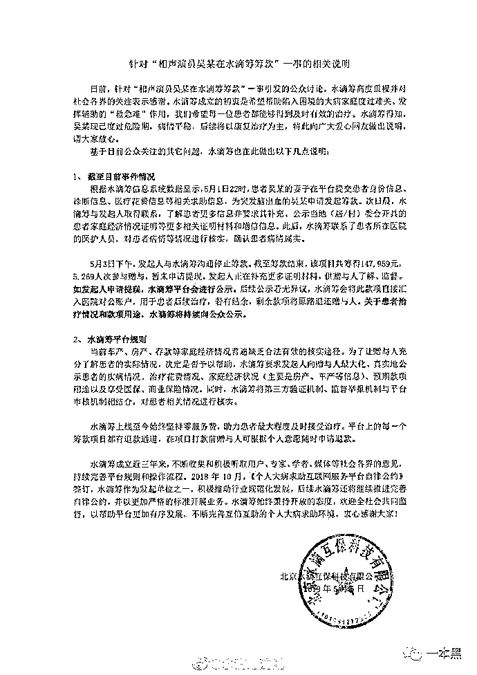       

声明一出，非但没有得到网友的谅解，反而引出更多的质疑声，很多人表示无法接受，要收回捐助，水滴筹随机表示，可以申请退款。

       

原本是一场充满善心的捐助，却让人觉得像吃了苍蝇一般不适。

正当大众在跟进事件发展的同时，有媒体发布文章称“网购虚假诊断书，可轻松通过众筹平台审核，**众筹文案代写仅 50 元一篇”。**

水滴筹于今日凌晨对此事作出回应，在阐述了平台流程严格后，称水滴筹借助熟人社交网络验证，在筹款的整个过程中进行风险控制，求助人提交的证明材料在通过平台审核后，还需要在涉及社交网络进行传播验证，否则视为无效求助项目。

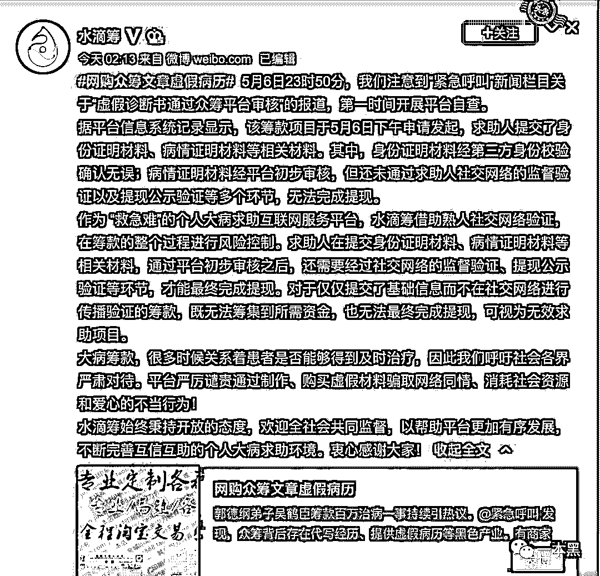       

水滴筹 CEO 转发该微博称，“不明白为什么这么多媒体喜欢通过‘钓鱼’或标题党来带热点”。

热点？这不是热点，这是大众痛点！

首先，网购病例并不是虚假捏造，而是真实存在。

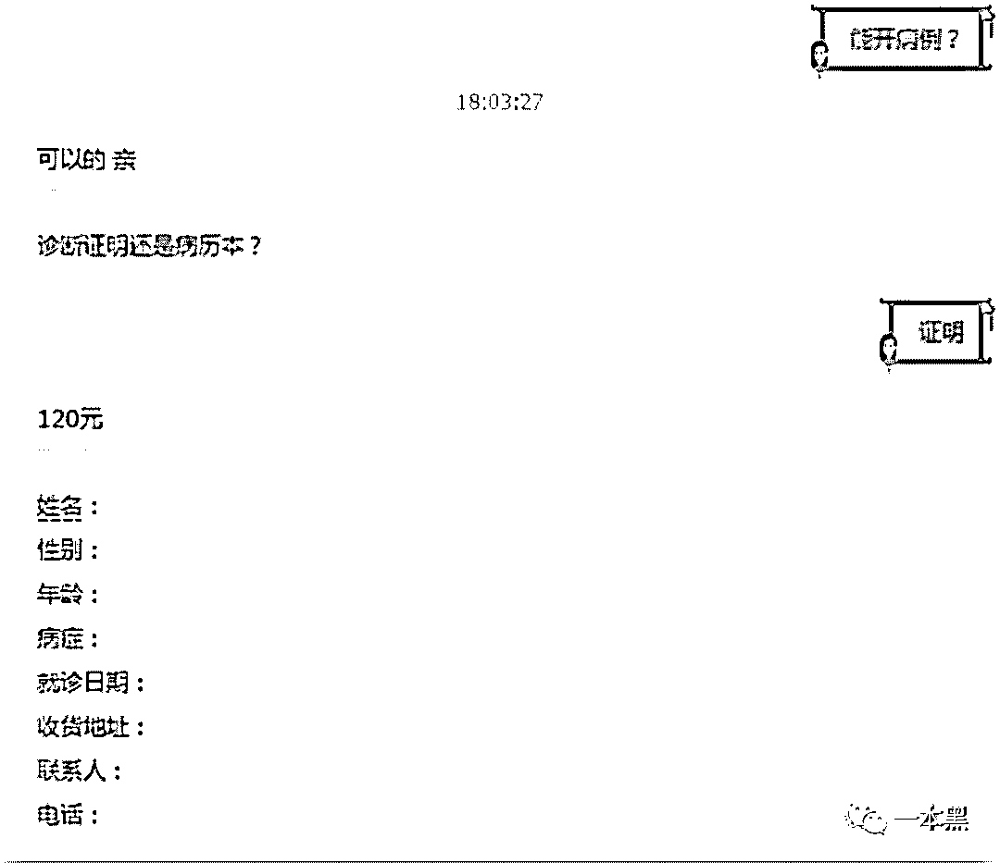

其次，筹款资料代开也确实存在。

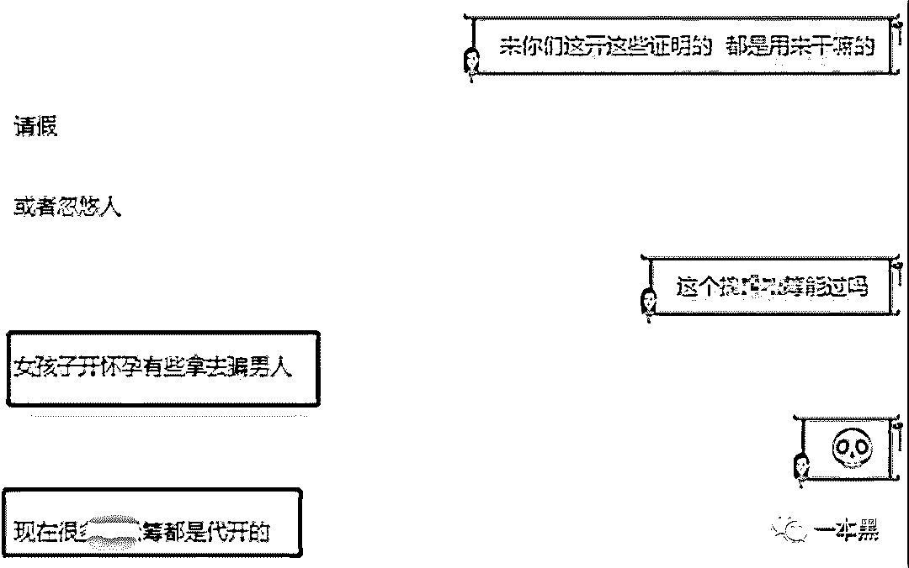

最后，社交验证也不是问题，假资料筹款会有群来帮忙做实名认证。

作为平台，应该持有“有则改之，无则加勉”的心态，做好自查。行业中真实存在的现象，平台中如果存在，就尽快整改；如果清白，就保持并积极做的更好。

这才是面对舆情最应该有的样子。

这种教科书式众筹，我们坚决不约。

**03** **网络众筹罗生门连环杀**

罗生门，在百度百科中这样解释：借指人世与地狱之界门，事实与假象之别。事件双方当事人各执一词，分别按照对自己有利的方式，进行表述证明或编织谎言，最终使得事实真相扑朔迷离，难以水落石出。

在一位叫做**郭美美**的人，牵扯出捐款运作流程中的各种内幕后，将大众对红十字协会的信任摧毁殆尽；

一篇**“罗一笑，你给我站住”**的朋友圈爆款文章，在获得高达几百万的赞赏后，大众才发现，原来卖惨的“带血营销”可以这么赚钱；

一篇名为**“王凤雅小朋友之死”**的文章，在网络上掀起轩然大波，让诈捐众筹再度成为热点，而后事件的多次反转，令人摸不着头脑；

今日的**吴鹤臣**众筹事件。

而这样的事件，没有被推上热搜的，还有很多。

 滥用善款：白血病男孩要化疗，母亲却失联带走十几万爱心款。

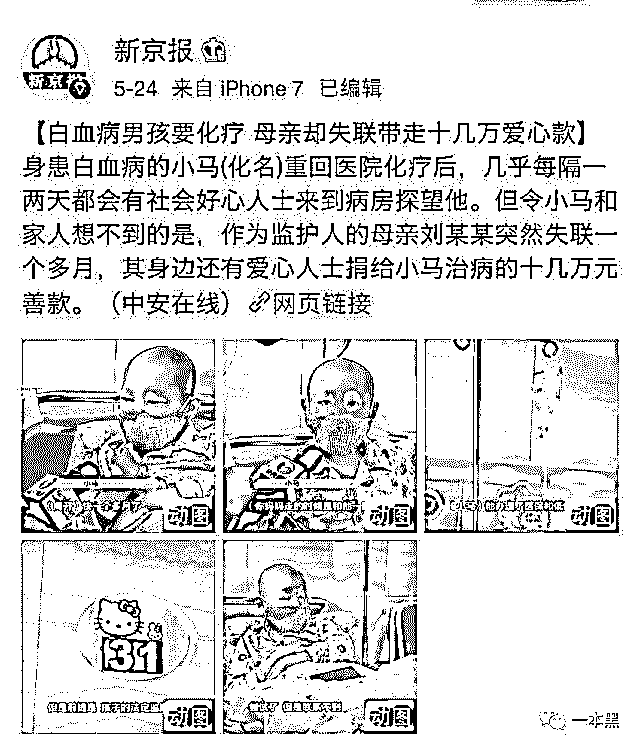

 劫贫济富：开着公司，营收百万，占股 48%，有房又有车，老公在国外工作，被举报后，当事人称营业额不是自己一个人的。

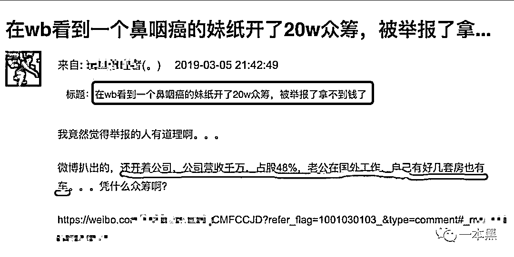

当被问到为何不借款的时候，当事人称只是试试。

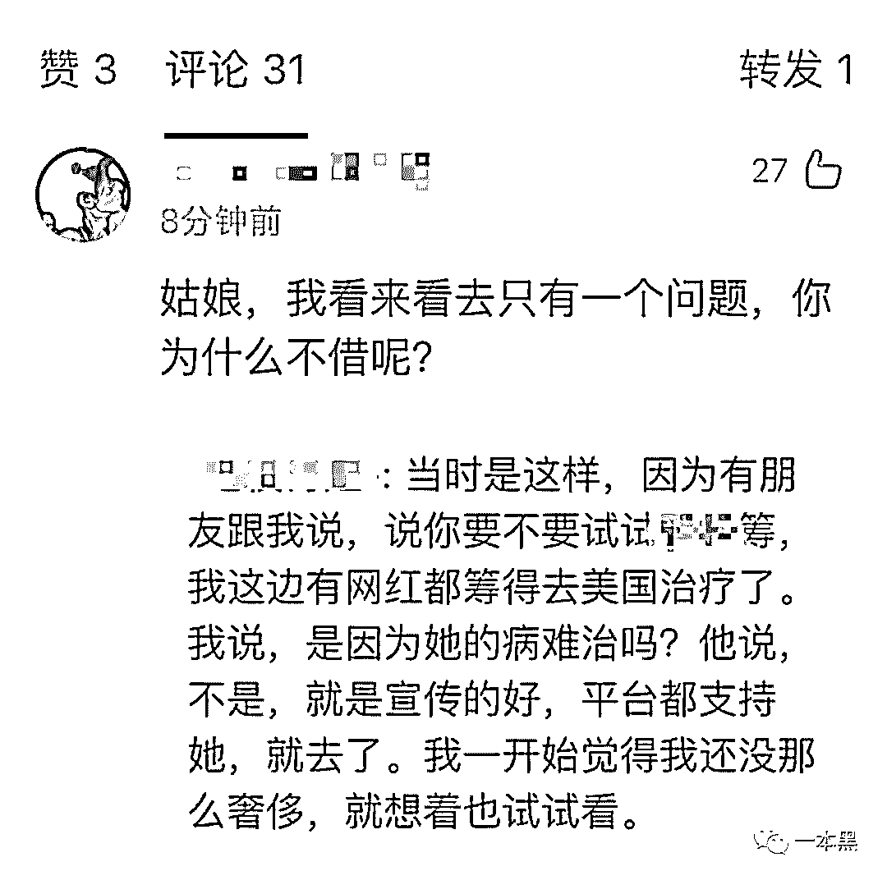

大病乱筹已经成为一种社会现象，它就近在你我身边，不知道像孙悟空那样的火眼金睛，能否分辨何为真、何为假？

不知道相类似的事件能罗列多少。

不知道下一次会是什么。

**THE END**

没有制度做把控，只将网络慈善与人性紧密相连，如何能够？

要知道，人性本就脆弱。

更何况，不是人人都有。

还原事实｜专扒黑产

微信 ID：darkinsider

知乎 一本黑

微博 一本黑 007

投稿、爆料、招聘、转载

请联系微信：chenchen_19940612