# 又被盗了！营销号抄我文章，还说我诽谤

> 原文：[`mp.weixin.qq.com/s?__biz=MzU4ODAwNzUwMQ==&mid=2247485342&idx=1&sn=7023a27b41f023ace9b51e142303a87c&chksm=fde216bcca959faaa517a73b16b931eaa2511bea0f647ac4839b9a9c4c86ab8541d9bfed2144&scene=27#wechat_redirect`](http://mp.weixin.qq.com/s?__biz=MzU4ODAwNzUwMQ==&mid=2247485342&idx=1&sn=7023a27b41f023ace9b51e142303a87c&chksm=fde216bcca959faaa517a73b16b931eaa2511bea0f647ac4839b9a9c4c86ab8541d9bfed2144&scene=27#wechat_redirect)

一本黑的后台每天都能收到很多热心读者的提醒，有的激动，有的淡定，更多的是恨铁不成钢。大家用各种或委婉或直接的方式提醒我们— 一本黑的文章被偷了。

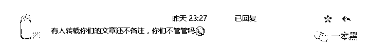 

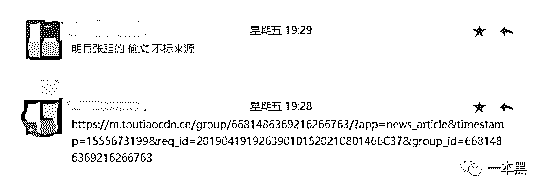 

偷的意思并不是顺走了，而是......好吧，就是顺走了。还是不打招呼的那种。

这种行为我们也称之为剽窃（**读书人的事，怎么能算偷**）。

文 | 喵叔

**01 ** **我们的文章被“剽窃”了**

是的，我们的文章被剽窃了，这种事情每天都在发生。虽然我们也很想要去管管，但是敌方人多势众又爱打游击战，老黑我只能在角落瑟瑟发抖。搞不赢搞不赢。

原本我们打算睁一只眼闭一只眼就过去了，但是**有位特别热心肠的朋友，已经连续好几天在后台提示我们了。**

这次，我决定不能再辜负大家的信任。

根据提示，在百度百家、天天快报、简书以及今日头条等多个资讯平台内均发现了我们被盗的文章。于是我依次下载了这几个阅读 App，然，天天快报没有搜索的功能，想要找到我们被侵权的文章，相当于大海捞针。

今日头条倒是有搜索框，我在搜索栏输入文章标题，果然发现有“转载”。点开一看，文章未标注任何来源及作者信息，印象里该账号从未向我们申请过授权。当然，要了我们也不会给。

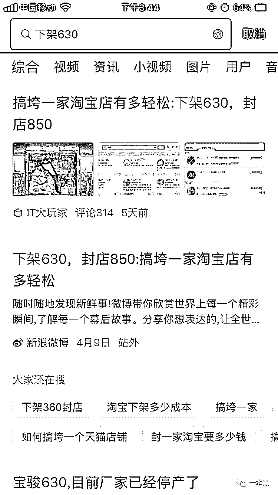

随后我们又在百度百家、简书、新浪、搜狐等多个平台也都找到了被侵权的文章。之所以说是侵权，是因为一本黑目前只开放了微信公众号以及少数几个网站的转载权限。

其它的，你在任何平台看到的基本都属于不打招呼就拿走的类型。这种不文明不礼貌的行为，我们称之为“剽窃”。

我在今日头条上询问那个窃取我们文章的自媒体，至今没有收到任何回应。而当我质问简书的作者为什么不问自取时，他先是回应核实情况后会删除，展现极高的行业素质，后表示**“我眼瞎看不见”**，尽显无赖精神！

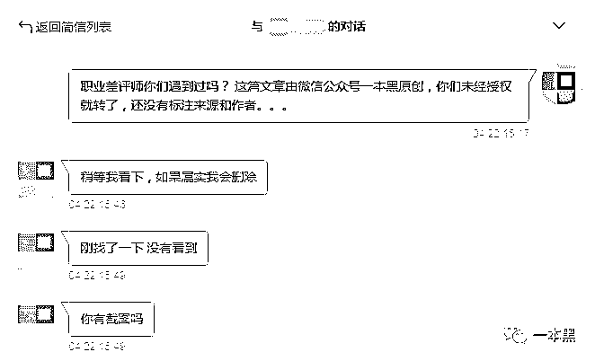 

简直无耻至极，是不是你写的，你心里没点数吗？

 

更过分的是，当我甩出一本黑的链接并再次重申让他们删除时，对方说不确定我是不是一本黑的员工，没有证据能证明他抄袭。

**这是诽谤。**

**02** **不写不拍，月入十万**

大概会有人好奇，同样是做自媒体，为啥他们要到处偷别人的文章？

当小偷就能轻松月入十万（还不违法），和辛苦搬砖月入 3000，你会选哪一个呢？

有良知的人会选后者，可是做小偷的人又怎么会有良知呢？所以，你懂得。

老黑写一篇文章，要经历选题-调研-写稿-修改-分发这几个流程，耗时在 3-7 天不等，但是复制粘贴大概只需要 3-7 秒。

偷我们文章的自媒体，**主要****集中在 全网 任意资讯平台**，他们也被亲切地成为营销号。他们不像一本黑这样，明确聚焦某一领域。

**只要有流量，他们什么内容都能发。**

譬如，你爸妈爱转的养生知识和政经杂谈；你女朋友喜欢的明星八卦；你朋友圈里微商最爱的过时政策新闻。这些内容都是顶级流量来源。

营销号所要做的就是从网上搜集最劲爆最有话题性的内容，不论是文字、音频还是视频，统统复制到自己的账号上，然后进行全网分发，就可以坐等流量收成了。

当然每个平台的收成都是不一样的，以搜狐号为例，一本黑 4 月份共发布了 6 篇文章，总阅读大概是 9w 左右，但是收入仅为 80 元。80 块是我们大半个月的收入，但是这连营销号一天的收入都抵不上。

而更加热门的今日头条，一本黑的至今没有产生过收益。（当然，赚不到钱也不能怪别人）

下面这张图是我从一个百家号交流群里找来的，在他们的交流中我得知，只要你会起标题，你就能赚钱。

> **他们的运营策略就是：**
> 
> **找一个热门话题，改一个惊悚标题。**
> 
> **坐等收钱。**
> 
> **完美。**

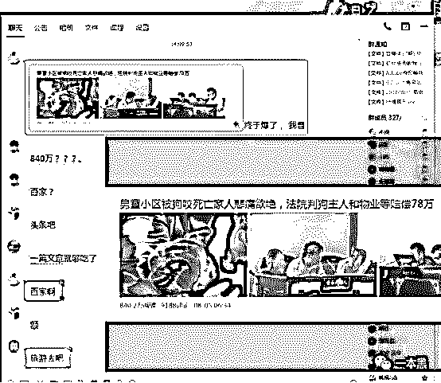 

按照今日头条的收益规则，1w 阅读的收入为 15 元，该篇文章的阅读为 840 万，最低收入为 12600。

单单是一篇爆款文章就能轻松带来过万的收入，而营销号们要做的只是动动鼠标而已。所以当你看到各路资讯平台上都是标题党和低俗内容时，也就不要奇怪了。

为了进一步了解营销党的现状，当天晚上我又伪装成了一个自媒体新人，听了一堂据称是日均收入 4K+的**自媒体大师**公开课。

课程开始前，客服反复问我，今晚八点，老师直播的课程你会去的吧？在得到我多次肯定的回答后，客服嘱咐我要记笔记，因为课程不录播。之后他安心地下了线。

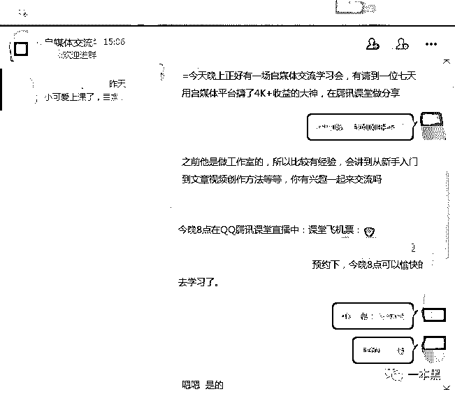 

八点一到，我就进入直播间，刚进去就听到大师的谆谆教诲：我们这个公开课只有直播没有录播，是因为这样更加能够激励你们，让你们破釜沉舟努力学习。希望你们不要辜负老师的一番心意，你们能够有所得，就是对老师最大的回报。

说罢，大师决定开始进入高潮。（刚开始两分钟就这么刺激吗？）

满怀期待的我立马搬来小马扎，拿上笔记本开始做笔记。但是大师讲课的速度太快了，我只能截图为敬。

这次公开课，我的收益很大。作为一枚新媒体从业者，**我感觉自己离暴富又近了一步。**

从大师的讲课中我了解到，想要从事自媒体，首先你需要很多亲戚朋友，因为要借他们的身份证去注册账号。实在借不到就去花钱买吧。

其次，你要了解各个平台的收益规则。

以下是各个自媒体平台的收益比例，其中百度最为财大气粗，每发表一篇文章，阅读量达到 1w 便能获得 15 元的收入；企鹅号次之，为 10 元；而今日头条则是按照是否开通文末广告、是否原创及独家，相应给予不等同级的奖励。1w 阅读的最低奖励为 2.5 元，最高为 135。（**我如果没算错的话**）

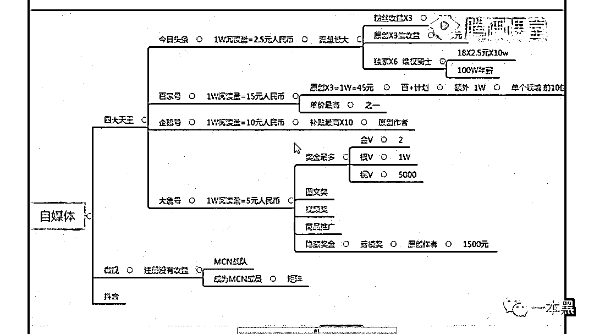

流量为王的时代，只要要流量就会有收益。这句话果然不是吹的。

**03  ****当小偷开班授课**

在了解了规则之后，你就要开始写文章了，哦不，是抄或者偷文章了。

不过搬砖肯定比不上造砖赚钱，所以即使是营销党也千方百计要产出原创内容。

当营销党开始做原创，所有的自媒体人大概都会肝颤。因为他们所说的原创可不是你想象中的原创。

“自己写自己拍不是原创，只有原创标才能代表你是原创。”“就算是抄、是偷，我们也能做出百万爆文。”这是大师在课上多次强调的。

“与其生搬硬造，不如选择去抄。**做自媒体最要紧的是赚钱。**”大师让我们这些新人不要钻牛角尖，要多向前辈学习，向钱看齐。

为了方便大家抄文的时候能够更快更高更强，大师还特地推荐了一款由他们自主研发专门用来收录自媒体文章的工具，名叫小*猪。

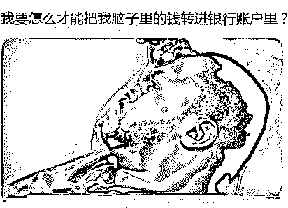 

我原本以为我听的是一堂自媒体教学课程，结果。。。越听越觉得不对劲，从推荐工具之后，大师开始卖课了。说好一个小时直播的，这课还上了不到半小时呢。

这 TM 就是一个培训机构的宣讲会，还假借公开课的名义。（不过想想也对，不赚钱，他怎么会给我讲课呢？）

课程售价 3980 一个人，一期招 15 人，目前已经开到第 22 期。课程主要教人如何光明正大的剽窃他人的文章，并给你提供各种工具以躲避平台处罚的方法。

公开课上，大师还给我们实际演示了一遍：

当晚，菲律宾发生了地震。他在百度搜索之后，将主流媒体发布的视频下载下来，去掉水印，然后加上固定的片头片尾，再从另外两篇文章中各自摘取一些内容，然后发布到自己的百家号和今日头条，开启原创标。这篇文章就成功地变成了他的原创。

而大师总共花费的时间还不到 5 分钟。

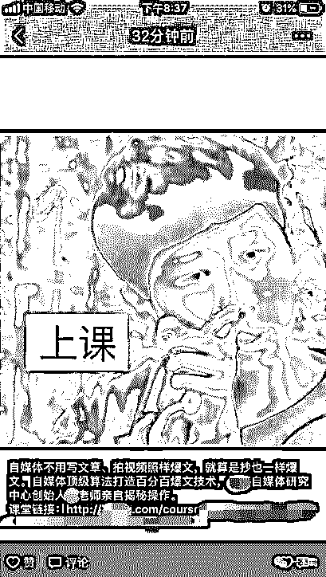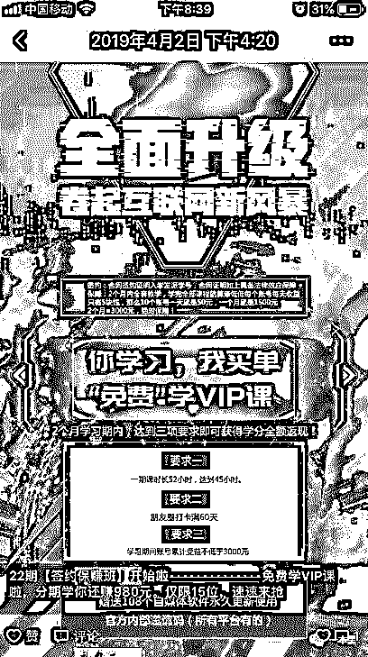 

大师不停地强调，这个热点很及时，几百块少不了。

不止教“原创”，大师说 vip 培训课程会教大家怎么做视频、做海报、写文案以及各种平台自媒体账号的运营技巧。

大师还说**粉丝变现就是把你的粉丝变成现金**；综合领域就是所有领域。

大师的金玉良言，我将永远铭记在心。

毕竟，**在营销党面前，哪个自媒体人还敢称王。**

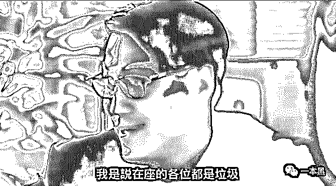 

**04 **** 嗯~真香**

自媒体时代，内容为王。这个真香定律连营销号都逃不掉。

 

靠流量和系统广告赚钱是自媒体最低级的玩法，**高级玩法自然是打造自有 IP**，卖课卖广告卖周边卖焦虑。但前提是你得产出具有独立观点的文章而不是东拼西凑全网抄。

这时候，一些具有前瞻性的营销号开始转型，招一批写手，从洗稿做起，通过蹭热点贩卖焦虑迷惑一大波努力奋斗的年轻人。他们是社会的中流砥柱，是营销党眼里最绿的韭菜。

因为他们周周 996 还是买不起房；年近三十可能依然母胎 solo；他们名校毕业但聚会依然自卑。。。他们善良富有同情心又急于改变自己，花钱替代焦虑是他们最喜欢的方式。

所以一系列为他们量身定做的广告应运而生。

但是广告不能天天发，读者会反感，阅读会下降，金主爸爸会不开心。

**这时候刷量业务就可以开始了。**

粉丝量减少了怎么办，刷！阅读量降低了怎么办，刷！客户爸爸要求该篇广告要有互动怎么办，刷！

增加 100 个粉丝只要 30 块，刷 1000 阅读只要 18 块，此外点赞评论都是可以买的哦，亲。

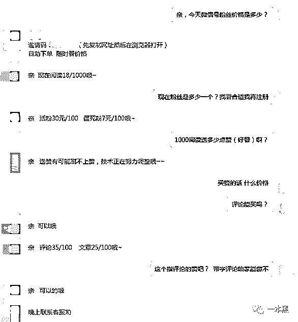 

有内容，有数据，有大品牌的广告认证，营销号借此彻底摆脱自己是营销号的事实，并通过创立自媒体矩阵，打造多 IP，进行全网多平台布局。

自此，从营销号到自媒体大 V 的转型已然完成。用户喜爱，金主青睐，指日可待。

随着互联网巨头的加入，自媒体这块蛋糕也越来越大，玩法也自然越来越多。

逐利的人越多，市场越混乱，一些能产出优质内容的自媒体因为内容得不到有效曝光，逐渐退出市场。而以刷量起家的营销号反而越挫越勇，占据的市场份额越来越大，有的甚至能估值上亿。

这就是**自媒体市场的劣币驱逐良币。**

* * *

此时，你是否也想在自媒体市场参一脚呢？

千万别！当营销号都开班卖课了，你觉得这钱还那么好赚吗？

市场总有一天会回归理性，

如果不是今天，

那，或许是明天。

还原事实｜专扒黑产

微信 ID：darkinsider

知乎 一本黑

微博 一本黑 007

投稿、爆料、招聘、转载

请联系微信：chenchen_19940612