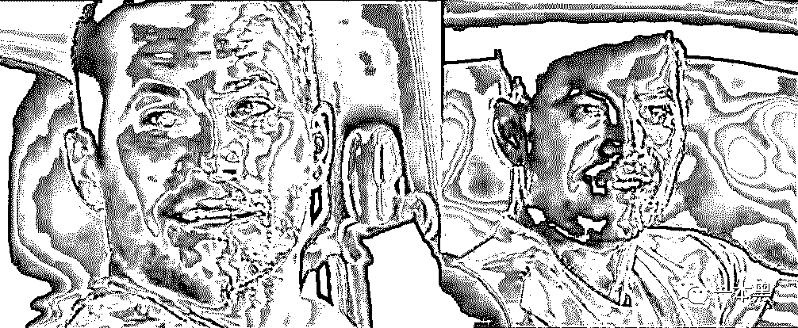
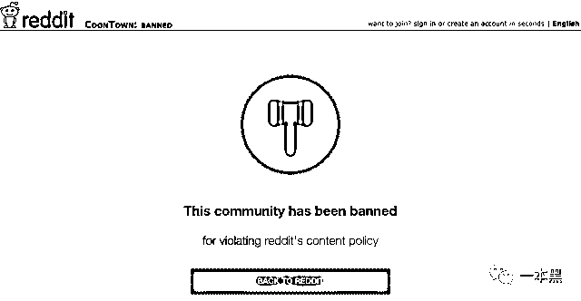
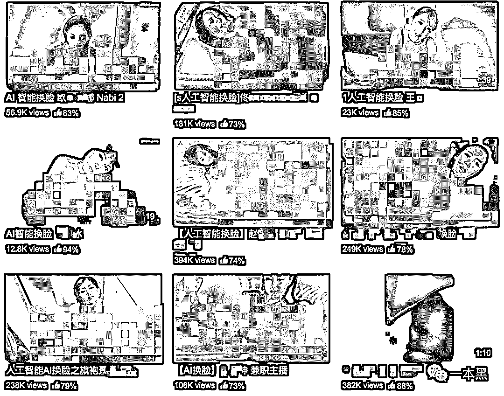
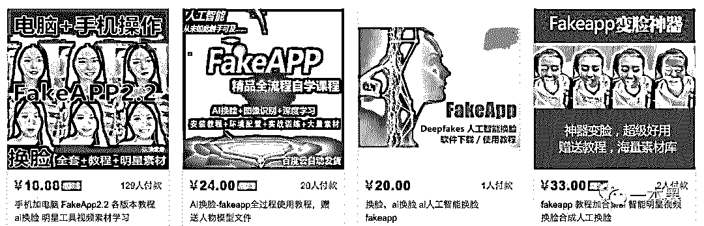
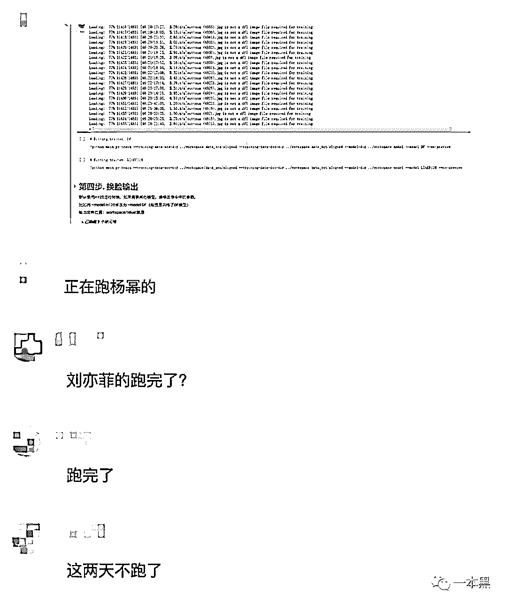
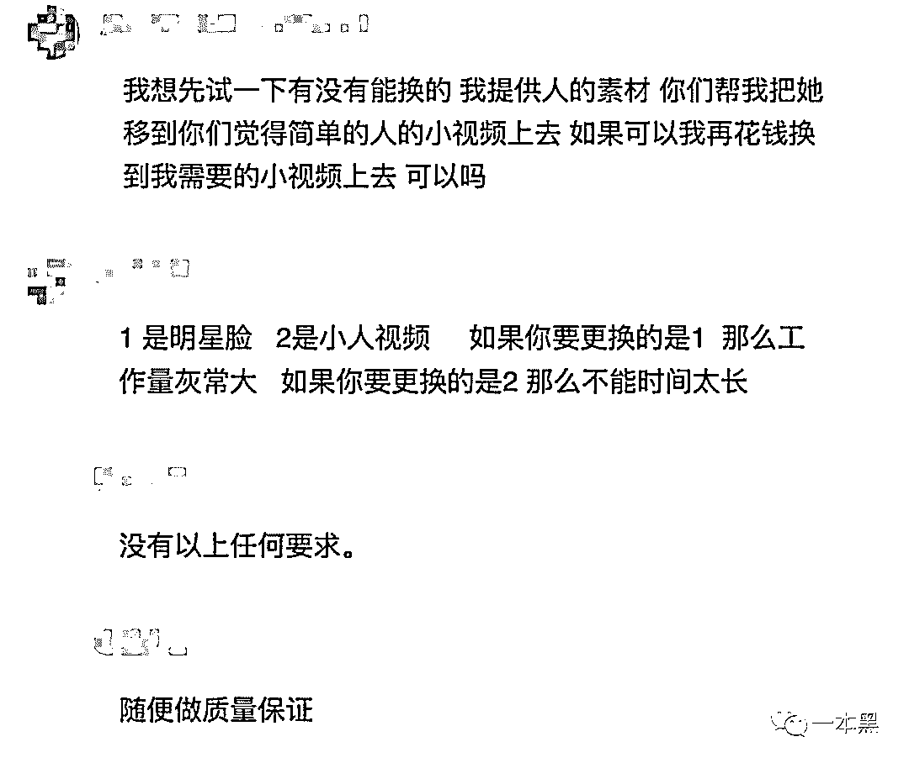
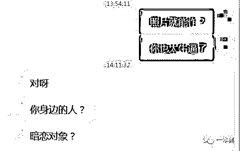
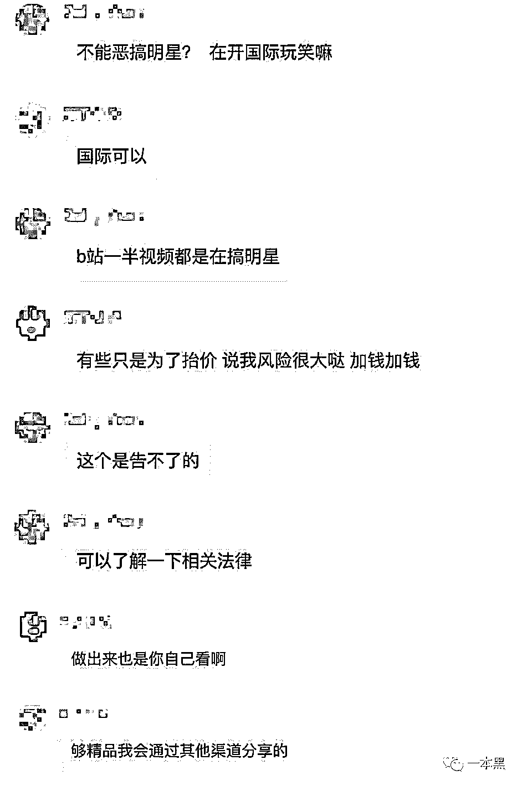

# “一张生活照，几十块的软件，我成了爱情动作片里的女主角”

> 原文：[`mp.weixin.qq.com/s?__biz=MzU4ODAwNzUwMQ==&mid=2247485354&idx=1&sn=41a07313b43b482f2d87d12c78db81a3&chksm=fde21688ca959f9e150a3cedb543fe625f3f6e5d3dfa603b2908516201378fd2ac330643cd55&scene=27#wechat_redirect`](http://mp.weixin.qq.com/s?__biz=MzU4ODAwNzUwMQ==&mid=2247485354&idx=1&sn=41a07313b43b482f2d87d12c78db81a3&chksm=fde21688ca959f9e150a3cedb543fe625f3f6e5d3dfa603b2908516201378fd2ac330643cd55&scene=27#wechat_redirect)

最近的 B 站，热闹非凡。

六小龄童变身蔡徐坤大秀球技，苏大强一言不合帅成了吴彦祖，黑寡妇在同福客栈里过了把佟湘玉的瘾，李云龙一头长发唱生僻字歌的样子令人格外着迷。

因为 DeepFakes（深度假货）的存在，你可以变成任何人，任何人也可以变成你。

只是，当你在捧腹大笑的时候，有人正毫不知情的成为爱情动作电影的女主角，甚至在网络上被数万陌生人大肆围观。

**在 DeepFakes 面前，除了耍帅和逗笑，更多的、却是为了满足私欲和色情报复。**

**你看，那一串串代码，正要撕开人性的遮羞布。**

文 | 木子梨

**01** **确认过眼神，你不再是我睡前的“安眠女神”**

“最近，我发现自己的脸盲越来越严重了，就连视力也急剧下降了。

别说五米开外雌雄莫辨，十米开外人畜不分，就连每晚睡前的“安眠女神”，我都找不到了。”

这是我的一位朋友（搞笑担当）在微信上发给我的原话。

一问才知道，他每晚睡前都要听一个名叫阿冷的主播唱歌，不然就睡不着觉，谁知就在那么突然的一个瞬间，他发现自己阿冷的视频被网友“换脸”了。

有时候，被换成了杨幂的脸。

（图片来源于网络：合成视频）

有时候，被换成了刘亦菲的脸。

    （图片来源于网络：合成视频）

还有的时候，被换成了范冰冰的脸。

（图片来源于网络：合成视频）

**一搜索才发现，原来“换脸”已经成了流行。**

不止阿冷，冯莫提的视频也被网友换成了赵丽颖的脸，在直播间里唱着沙漠骆驼。

（图片来源于网络：合成视频）

这不是乱搞么？

我朋友第一想法是去社交平台吐槽这一恶劣行径，谁知转了一圈，回来告诉我说，幸好只是换脸，没干别的。

原来他发现，这种单纯的换脸已经是一种恩赐了，各个平台有着大把不堪入目的换脸视频，相比之下，他竟然心生感恩。

于是我也去搜索了一下，嗯，他说得对。

****02** ******科技是第一 X 产力****

“换脸”是 DeepFakes 的杰作。

AI DeepFakes 是人工智能领域下的一个分支应用，其本质是一种深度换脸技术，也就是面部替换。

在 DeepFakes 出现之前，人脸交换技术就已经存在，并在电影制作领域得到了较为广泛的运用，但需要耗费很多的时间和精力。

举个大众所熟知的例子，在保罗·沃克离世后，《速度与激情 7》还能够拍摄完成，就是运用了人脸算法，借助已有的素材，合成保罗未拍摄完成的戏份，最终顺利完成了整部电影。

 （图片来源于网络：左为真人，右为合成）

而 DeepFakes 的出现，可以称得上是一种突破。

它在保证面部肌肉的和谐，口型和声音匹配的前提下，降低了人脸交换的技术操作门槛，哪怕没有任何经验，按照教程的引导同样可以完成。

2017 年 12 月，在线论坛 Reddit 上，一位 ID 叫做 “deepfakes” 的用户发布了一个足可乱真的“换脸视频”，他通过 AI 深度学习，将一部“小电影”中女主角的脸，堪称完美的用神奇女侠（盖尔·加朵）的脸做了替换，引起了很多人的关注。

（图片来源于网络：合成视频）

随着该视频关注度的增长，这位 “deepfakes” 用户在 Reddit 上创建了一个同名主题，吸引了数万用户的关注，在他手下惨遭“换脸”成色情女主角的明星也越来越多，艾玛·沃特森、安妮·海瑟薇等人都被无辜卷入。

（图片来源于网络：合成视频）

用户 “deepfakes” 仿佛不满足于独自创作，他干脆开发了一款名为 FakeApp 的软件，让更多人掌握了“换脸”的技能。

这一软件的出现，将 deepfakes 拉下了人工智能的神坛，只要拥有人像数据和一个符合配置的电脑，就可以完成“换脸”，技术门槛的降低，导致“换脸”爱情动作小电影的数量急剧增加，并在各大平台迅速扩散。

越来越多的人在合成“换脸”视频的过程中，将自己心中的“女神”安排进种种色情电影中，只为满足自己的 X 幻想。

**未经同意，便将女性的脸“任意移植”到性爱镜头中，是一件彻底暴露人性丑陋的事情。**

**因为 DeepFakes ，成人影片产业获得了巨大的助推力。**

**科技是第一 X 产力，但凡与色情元素沾边，哪怕初衷再好，变味儿也是迟早的事情。**

如同 ASMR 的出现，原本只是为了助眠和释压，结果反而让更多人难以入眠一样，DeepFakes 也很快走上了一条歧路。

******03** **********虚假视觉引发色情报复******升级************

就在 DeepFakes 开足马力朝着成人电影方向飞奔的时候，官方封禁来了。

Reddit 关闭了 DeepFakes 论坛，并称会严格审查涉及“非自愿换脸色情”的内容，该抵制行动受到了各大平台的支持，以 Twitter 为代表的社交平台和以 Pornhub 为代表的色情网站，一并开展了抵制行动。

 （图片来源于网络）

然而，各平台的联手抵制，并没能彻底遏制住 DeepFakes 蓬勃发展的劲头，依然有众多小电影网站可以照常观看，就连此前表态要公开抵制此类视频的 Pornhub ，由于语言等原因，输入关键字，同样能够在站内搜索到很多不可描述的视频。

正是在禁不能止的局面下，越来越多的人开始意识到，DeepFakes 的滥用，很有可能会升级成色情报复的新方式。

在此之前，色情报复的资本，还仅限于一段关系中所留下的回忆，我们暂且不讨论这些回忆所留下的影音资料当事人是否知情，资料是以何种手段取得，但它最起码是真实的。

而现在，不用如此麻烦，只要有 FakeApp ，一切都不是难事。

只要拥有照片和视频资料，就能任意合成多种色情小视频，这都将成为意图进行色情报复者手中的利刃。

**在 DeepFakes 的世界里，一段小视频，就能给受害者留下一生的阴影。**

此外，既然机器学习能够完成“换脸”，那么也很有可能通过采集声音，从而“模仿”出想要的人声，这正是 DeepFakes 2.0 版本所追求的效果。

若效果实现，就意味着：

**小额贷款公司很可能不会再要求贷款者提供手持身份证照片，只需要一些生活照片，他就可以制作出远比你能够提供的信息更具有恐吓力的证据；**

**那些通过社交软件向你借钱的亲戚朋友，你也无法再通过视频通话的方式，来辨别对方究竟是本人还是骗子；**

**不论生活还是职场中，你可能在无意中得罪的某位心胸狭隘之人，都可能会为了出心中恶气，而想法设法通过社交平台收集你的信息，进而制作以你为主角的“非自愿换脸色情片”，并大肆传播。**

诈骗、诬陷、报复、勒索等场景，离每个人都很近。

基于 AI 机器学习的换脸技术所引发的信任危机，将每一个人都牵涉其中，我们不得不开始担心，若 DeepFakes 的门槛和易用度越来越低，效果越来越逼真，相对应的却没有有效的验证方式时，何谈信任？

**双眼所见亦无力辨别真假，谨小慎微却依然危机重重。**

**DeepFakes 的边界，已经不单单局限于恶搞和满足个人 X 欲，更潜藏着更深的恶。**

**但人性的约束力，是很脆弱的。**

很多人在寻找可以有效分辨验证视频真假的方式，但所获甚微。

也曾有瑞典科学家尝试对真假视频进行分辨，一种方法是性能最优的图像分类模型 VGG ，另一种方法是基于 Facenet 的算法，最终得出的验证结果：错误率高达 95%。

DeepFakes 堪称数字时代的“新恐怖主义”。

********04** **************阴暗心理所催生出的交易********

如此危险的算法和软件，不知道在国内的“普及”有多广，我试着去探索。

万能的淘宝，不但能让我在卖家秀和买家秀之间那条巨大的鸿沟里，一次次尴尬的死去活来，还能在我每次试探性去搜索关键词的时候，高傲的凝视我：猜猜，我怀里到底有没有你想要的？

别闹，我知道你有。

不费吹灰之力，我就在淘宝上找到了几十个售卖 FakeApp 教程及软件的商家，有些商家还“贴心”的附上了样片链接，供意向买家参考。

在我咨询的过程中，一位卖家邀请我进入了一个 QQ 技术交流群，为了打开了一扇大门。

群里有近五百个人，气氛非常活跃，我手插兜旁观了一会儿，发现聊天内容可以分为三类。

第一种是大佬炫技，分享进展。

第二种是私人订制，付费体验。

特别好奇用非明星脸来制作小电影的难度如何，于是我私聊了两位，得到的反馈相似，只要有照片就能接。

我还顺道儿得知了行情。

第三类是试探危险，售卖资源。

在群里潜水的几个小时，令我开始思考，什么是人性？良久，觉得难以解释。

**一张照片，只要付费，就能把一个毫不知情的人暴露在数双饥渴的眼睛下，而背后的作者，却是一群再普通不过的人。**

他们自诩为极客，在宣称只是热爱钻研技术的同时，却乐此不疲的炫耀自己的最新作品，并打包售卖，还在议论网上那位因制作“朱茵换脸杨幂”视频而道歉的作者，认为他根本没必要道歉，偶尔恶搞一下，帮明星提提人气，人家高兴还来不及，怎会追究？

同时，只要有人付费，他们就接单，不问目的，只谈价格。

“愿意为好作品付费的人，一抓一大把。”

**在私欲和利益面前，不管是女明星还是寻常女性，个人隐私都变得一文不值。**

**这个百人 QQ 群，折射出的、是一个跑偏的 DeepFakes 世界。**

**THE END**

当隐私不再成为隐私，人们仿佛回退到原始社会。

行走于大地之上，却又裸露于天地之间。

不说了，蔡徐坤喊我去打篮球了。

还原事实｜专扒黑产

微信 ID：darkinsider

知乎 一本黑

微博 一本黑 007

投稿、爆料、招聘、转载

请联系微信：chenchen_19940612