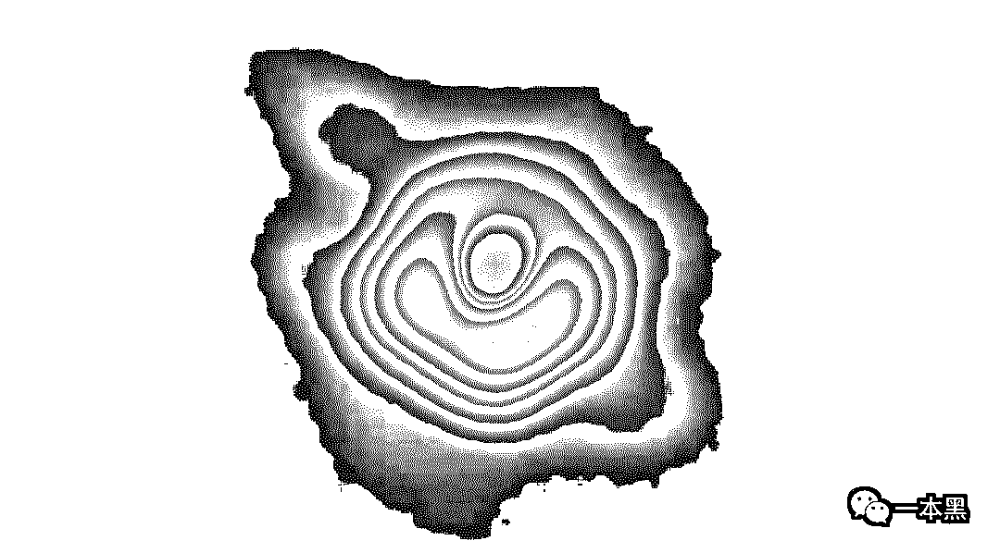
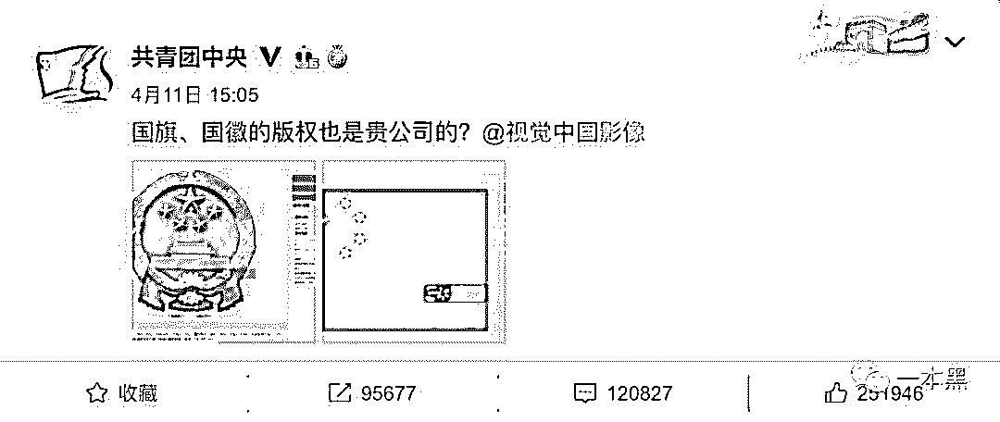
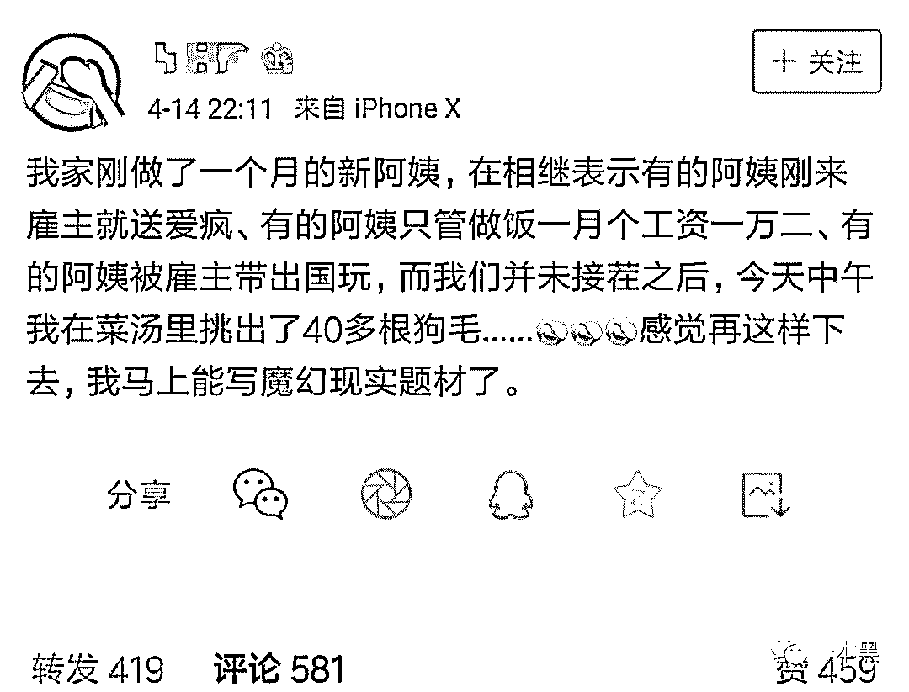
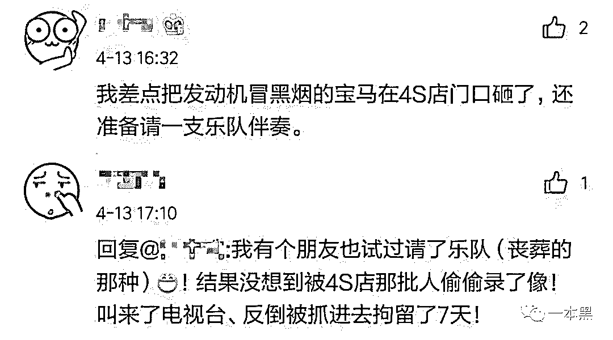
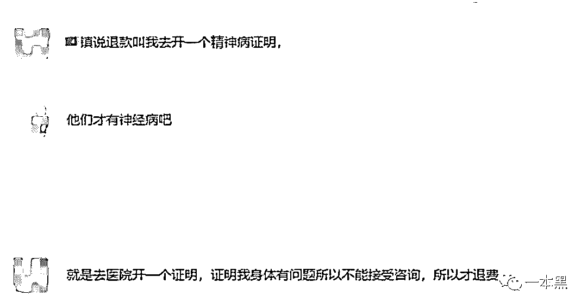

# 被羞辱、恐吓、倾家荡产：普通人维权到底有多难？

> 原文：[`mp.weixin.qq.com/s?__biz=MzU4ODAwNzUwMQ==&mid=2247485335&idx=1&sn=9841e634e5a1b8428406dfb59bae18b6&chksm=fde216b5ca959fa33667d094ccb1f7fc08fe67dbd732471f45e27b3e2a728a430e9b729cecd4&scene=27#wechat_redirect`](http://mp.weixin.qq.com/s?__biz=MzU4ODAwNzUwMQ==&mid=2247485335&idx=1&sn=9841e634e5a1b8428406dfb59bae18b6&chksm=fde216b5ca959fa33667d094ccb1f7fc08fe67dbd732471f45e27b3e2a728a430e9b729cecd4&scene=27#wechat_redirect)

每年 3·15 前后，**“维权”**都会上升为一个高频词汇。

近日，奔驰女车主哭诉维权的视频热传，与此同时，却伴随着个人信息的泄露和威胁报复，可敬又可悲。

随后，兰州又出现一起女研究生车主坐奔驰引擎盖维权的事件，车主称刚买的车才开 2 公里，安全气囊就报警了，4S 店甚至还“私吞”了厂家给老客户购车的万元优惠。

**女研究生车主维权专座已出现：****奔驰引擎盖。**

这年头，没为维权磨破嘴，都不算真正的社会人。

于是，我和老师傅探讨了一下：**作为普通人，维权到底有多难？**

文 | 木子梨

## 

**01** **共青团带我们去维权**

**人类历史上第一张黑洞照片，人们还没看的真切，已经有物体被吸入，仔细一看，竟是视觉中国。**

北京时间 4 月 10 日 21 时，全球六地召开新闻发布会，“冲洗”耗时近两年的黑洞照片，首次被大众“看见”。

次日中午，有网友发现黑洞照片已被视觉中国拿下版权，并被标注：如用于商业用途，请致电或咨询客服代表。

此举引发全网质疑，包括百度、苏宁、海尔、新浪在内的众多知名企业开启围怼模式，称自家企业标志被视觉中国收录。

**网友调侃，啥都是视觉中国的。**

下午，共青团中央发布微博，对视觉中国发出灵魂拷问：“国旗、国徽的版权也是贵公司的？”

中国警察网也发博@视觉中国：“警徽与其图案不得用于商标、商业广告。”

而后，视觉中国发表致歉声明，并下线了不合规图片，闭站整改，当晚被天津网信办约谈。

12 日，视觉中国开盘跌停。

欧洲南方天文台（ESO）回应称，视觉中国从未就黑洞图片联系过 ESO，版权主张不合法。

16 日，天津市网信办依法对视觉中国作出**从重处罚**，**30 万**。

**这张黑洞图片，怕是无人能比视觉中国看的更真切了。**

**02** **微博天天都在上演“维权段子”**

作为一个普通人，维权大多围绕着生活日常，忙碌之余，还要为维权“愁白头”，一个不小心，也许祸从天降。

**你请的保姆，可能是个“狗界发型杀手”**

**为何家政行业从业者的待遇持续走高？**

**为何寻找保姆的难度超过企业招聘？**

**是市场供求失衡还是妖魔作祟？**

**欢迎收看：保姆的秘密。**

前几日，某知名作家在微博爆料称，家中新请的阿姨，言语间有意无意的在暗示，说市场中有很多阿姨遇到的雇主，有的会送爱疯，有的活儿少钱多，还有的会被带出国旅行之类。

在没有得到想要的回应后，这位知名作家在午饭的菜汤中挑出了 40 多根狗毛。

狗要是会说话，肯定要报警。

**维权弄不好，反转少不了**

近日，奔驰女车主的“哭诉维权”，引起了众多网友的共鸣，一波又一波的吐槽，让整个行业都不安起来。

某知名博主在微博控诉宝马的不作为时表示，自己就差把发动机冒黑烟的宝马在 4S 店门口砸了，并请一支乐队来伴奏，言语间燃着怒火。

万万没想到，另一位网友剧透了这种做法的后果。

原来，这位网友的一个朋友就试过请乐队（丧葬的那种），结果不但没有震慑住他们，反而被 4S 店的人偷偷录了像，还找来了电视台，最后惨被拘留 7 天。

唉，骚不过、骚不过。

**03** **素人维权到底能有多难？**

对于大 V 来讲，维权尚属不易之事，作为一个素人消费者，维权更是难上加难，耗费时间、精力不说，还要考验知识水平，走过最长的路，可能就是商家的套路。

众凡人苦维权久矣。

在办公室“众筹”了一下小伙伴们的维权经历，发现中招人数最多的，是预付式消费。

说不清从什么时候开始，预付费办卡享优惠开始流行起来，预付充值金额不限于三四位数，五六位数的也很常见。

很多充值办卡的人，并不一定是人傻钱多、自制力差，比如老师傅，这么有“内涵”的人，也难逃商家的魔爪，只能说，是商家传销式推销办卡的功力太深厚。

**“头发代表一个人的精气神，得常来修修，充值有优惠，人精神了才能升职加薪啊，办卡吧。****”**

**“你看你还不到 30，这皮肤还没我另一个 40 出头的客户好，得抓紧保养才行啊，办卡吧。****”**

**“你看你这肩颈硬的，手法已经没有太大作用了，得搭配仪器才行啊，办卡吧。****”**

**“久坐办公室不行啊，容易肾虚，得抽空多健身才行啊，办卡吧。****”**

更有甚者，在店家准备向你推销会员卡时，立刻就会有三四个人出现，围在你身边轮番进行劝说，大有你要是今天不办卡，肩颈就要断，这辈子升职加薪无望，只能孤独终老的阵势。

当你晕晕乎乎交钱办卡后，可能在某个时间点突然就醒悟了，回头找商家协商退款，然而得到的答复，可能会超出你想象。

**凭本事让你充值的钱，根本不可能退给你。**

曾在广东省电视台某节目任职的主持人，花费三万元购买美容项目，却被美容师按出淤青，经过长达两年的维权，终未拿回余款。

**退卡必须要扣除已经享受的优惠，掐指一算，这还得倒赔几千块钱，简直比炒股还可怕。**

江苏的林先生办了一张健身卡，后来想退，被告知退卡还要倒贴钱，问要赔多少，店员笑称要赔到倾家荡产。

**就算你安安稳稳享受服务，也很有可能在某日登门时，却发现不知何时已人去楼空，只留你原地凌乱。**

亲亲，预付式消费，建议您搭配速效救心丸哦~

除预付式消费外，最常见的互联网购物，也让消费者苦恼不已，不敢留真评。

据黑龙江消协调查显示，**消费者因“中评”或“差评”而遭到商家恶意报复的比例，高达 85.9%。**

一旦收到非好评，某些店家的报复手段令人发指，包括但不限于**羞辱、谩骂、威逼、恐吓的短信或电话**，以及**给买家寄去裹尸布、粪便、冥币、寿衣**等。

一位刘女士网购时，因发现店家有刷单嫌疑，便在评论区曝光此事，没想到店家将刘女士的手机号码曝光出去，成为招嫖热线。

**令人不解的是，明明选择匿名评价，为何还会遭到商家报复？**

其实，此处的匿名，指的是除卖家以外的其他人，所以准确的说，是半匿名评价。

翻了翻过往订单，后背有点凉。

**别说面对商家维权了，上次老师傅从我这里借走的买烟钱，承诺第二天就还，结果到现在我还没见到钱。**

一个普通人，维权就是这么难（摊手）。

**04** **天生我材必有用，独辟蹊径来维权**

素人维权，尤其是面对企业，想靠单枪匹马赢得胜利，基本属于超级困难模式，但你要相信，这个世界真的有超人（脑洞超级大的人）。

**“我是外国人”**

还记得某共享单车退押金难的问题吗？

退款不到账，联系客服的道路已严重拥堵，千万万人在苦苦等待押金的时候，一位机智的朋友出现了。

他给自己建了个新人设，以外国人的身份用英语给单车公司发去了一封要求立即退款的邮件，万万没想到，不但很快拿到了押金，还意外收获了一封“维持国际友好关系”的英文道歉邮件。

当事人表示，尽管维权成功，但背后逻辑深深的令人不适。

商家这波跪舔也是没谁了。

**“玩的就是速度”**

一杯红酒配电影，是多少 996、007 等群体向往的惬意生活。

一部 90 分钟的电影，当男女主角正要打架（动作片），或者揭开凶手真面目的一瞬间（悬疑片），整个人屏住呼吸，瞪大双眼，急切等待下一个画面，然而，一个占领 C 位的沙雕广告却夺屏而出。

**为了拯救因焦虑而越来越少的发量，很多人选择充值会员，因为会员可以免广告！****！！**

**然而充值以后才发现，普通会员看普通广告，会员另有“专属”广告！****！！**

不少人去微博借吐槽而维权，其中，有位给力的博主表示已经通过热线电话联系到客服，客服表示可以在后台帮其取消广告推送，这一消息通过微博迅速扩散，很多人亲测成功后来报喜。

然而好景不长，很多人反馈说客服已经明确拒绝这一要求，看来是打电话的人太多。

大概充值会员的意义，就在于把关闭广告的权利交给你，毕竟金主爸爸们不好得罪，容易伤“钱途”。

这种维权方式，成功度与参与时间成反比。

**“自证有病”**

花钱购买情感咨询服务，后期因种种原因想要终止并退费的时候，“自证有病”的戏码就上演了。

去医院开证明难不难，我不知道，我只知道，微博上与之有关的信息越来越少，维权群里也只剩下 5 个人了。

莫名的，我的脑海中出现了奔驰女车主在视频中所说的几句话：

**“我是受过文化教育的人，但这件事情让我觉得我几十年的教育受到了奇耻大辱，我就是太讲道理，如果这事儿有的谈，我就不用做出这么不要脸的事情。****”**

你瞧瞧，中国的文化真是博大精深，大伙儿一起来猜猜，不要脸的到底是谁？

**THE END**

维权本不应依靠舆论来推动，也不应由舆论来代替法律下定论。

按闹分配本应是影视剧中的剧情增强剂，如今却成为赤裸裸的现实。

尽管舆论不能治国，但在制度不完善的时候，我们应该庆幸，至少还有舆论来推动正义现身。

这个社会需要解决的是问题，而不是提出问题的人。

你若放弃，正义就输了。

还原事实｜专扒黑产

微信 ID：darkinsider

知乎 一本黑

微博 一本黑 007

投稿、爆料、招聘、转载

请联系微信：chenchen_19940612