# “我辞了月薪 8000 的工作，带着老公一起干 Q 步”

> 原文：[`mp.weixin.qq.com/s?__biz=MzU4ODAwNzUwMQ==&mid=2247485321&idx=1&sn=66d91f7d0296b832eb2297114d898932&chksm=fde216abca959fbd68e1e2806abb704f1ab7c4a2318a3ffa92dd39eccf2bf5e979d47915cf7a&scene=27#wechat_redirect`](http://mp.weixin.qq.com/s?__biz=MzU4ODAwNzUwMQ==&mid=2247485321&idx=1&sn=66d91f7d0296b832eb2297114d898932&chksm=fde216abca959fbd68e1e2806abb704f1ab7c4a2318a3ffa92dd39eccf2bf5e979d47915cf7a&scene=27#wechat_redirect)

一夜暴富或许是当代人最大的梦想，于是一边疯狂迷信锦鲤，一边埋头努力工作成为像你我这样普罗大众的常态。

但是也有人例外，躺着赚钱是他们最爱研究的事。所以当听说刷新闻、发朋友圈能赚钱时，没有人迟疑，赶紧搞起！

这不，听说现在走路也可以赚钱了。

于是，铜锣一响，黄金万两！机会不多，先赚再说！

冲鸭！

文 | 喵叔

01 **一个要实名认证的跑步 APP**

这款浑身洋溢着暴富气息的 APP，叫做趣步，下载之后例行注册登录，然而注册需要填写推荐人的邀请码。这个我没有，于是我百度了一下，找了一个看起来比较吉利的数字填了进去，完成了注册。

App 主界面有四个模块，分别是俱乐部，组队，任务和商学院。我想商学院大概是新手学习的地方，行吧，那就按照流程走一遍。

我准备在商学院好好历练一番再去闯出一番天地，但是系统提示我必须实名认证才能使用，每一个模块都是如此。

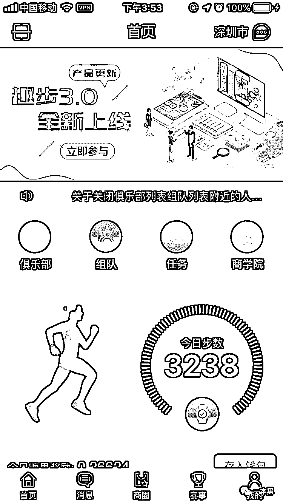     

一个跑步 App 不实名就不能用，这是什么操作？

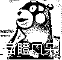 

我的内心很矛盾，毕竟街上那种扫码送脸盆的诱惑都没能使我屈服，但是为了刺探“敌情”，我认了。我填了我的身份证、支付宝等各项资料，还献上了我的帅脸。（还学支付宝人脸验证，呸！不要脸。）

结果，实名认证还要交一块钱。我脸都给你了，居然还要收我钱？算了，一根烟钱而已，给你！

 

一切都搞定之后，我点开了商学院，找到新手指南。指南告诉我这是一款以区块链为技术支撑，借助运动产生的糖果激励用户持续运动，帮助用户关注身心健康的的运动 APP。

虽然定义是一款运动 App，但却没有提供任何运动教程或者课程，只有一个计步器能稍微凸显它的运动气质。

App 可以配合手环使用，于是我翻出角落里落了灰的华为手环，充电连接，结果连了半小时也没动静。我以为我的手环坏了，后来我才知道，只有趣步牌手环才能连接趣步牌计步器，哦不，是 App。

总而言之，**这是一款很鸡肋的运动 App，但是玩趣步的用户并不 care 这一点，真正吸引他们的是糖果。**

糖果是由趣步发行，总量为 10 亿枚的数字货币？只要你每天步行达到 4000 步，系统就会赠予。

糖果只能在趣步商城使用，可用于兑换商城产品或是优惠券。平台不出售糖果，糖果只能依靠运动产生，但是用户之间可进行交易。

根据这些特性，我们可以将糖果理解为积分或是虚拟货币，也就是 Q 币一类的存在。

可是从趣步交流群了解到，那些热衷于糖果的用户，会购买、卖出、储存一定量的糖果。在他们看来糖果比 比特币更牛的存在。在某些线下指定店铺，糖果还能充当人民币使用。

但有一个让我摸不着头脑的点就是，既然糖果是由运动产生，那么理论上来讲，**每天运动量越大，产出的糖果数量应该越多才对。**

可实际上却并非如此。

02 **夫妻辞职干趣步**

为了进一步了解趣步的玩法，我加了我上级（推荐人）的微信，在简单的自我介绍之后，她将趣步的情况对我做了大致的说明和答疑，随后将我拉入了两个交流群。一个为四百人的大群，一个是三四十人的小群，大群以交易信息为主，小群用于新人之间的学习交流。

我的上级姓吴，今年 36 岁。她给我发了一张图片，让我先去学习一下，根据图片的指示，我去 APP 内了解了一下具体操作。但还是有很多东西不清楚，于是我决定向吴小姐咨询。

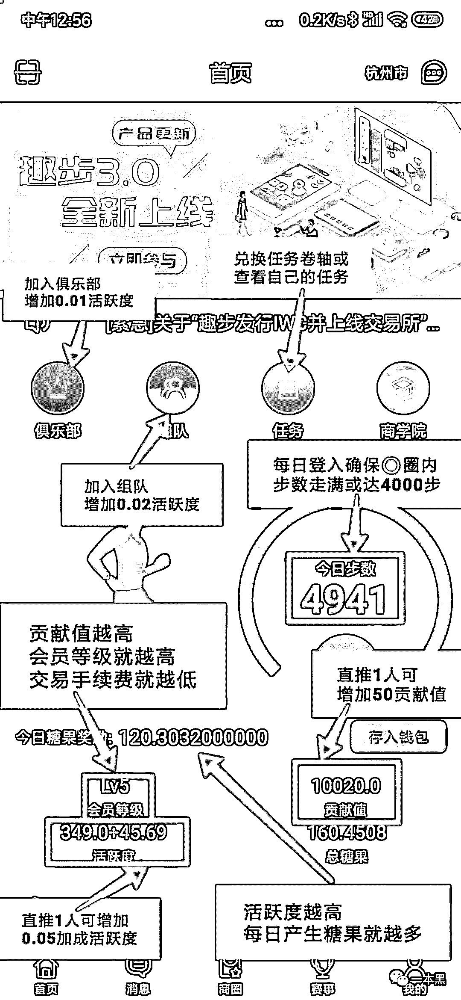

> ：我每天走的路越多，得到的糖果数越多吗？
> 
> ：不是的，每天步数的上限是 4000 步，糖果主要是根据用户活跃度发放，活跃度越高，每天产生的糖果越多。
> 
> ：那怎么才能拿到更多的糖果呢？
> 
> ：推人。推一个人增加 5%的活跃度和 50 的贡献值。当你的团队达标之后，可以升级达人，每天都能享受分红。
> 
> ：糖果可以交易吗？
> 
> ：可以的，平台内 15.56 元/个，场外 18-25 元/个。
> 
> ：平台里的糖果、卷轴和桂花糖分别是什么东西啊？
> 
> ：每天走 4000 步就可以产生糖果，糖果置换成桂花糖 GHT 进行交易；卷轴用来增加糖果产量，卷轴也可以用糖果兑换，卷轴级数越高，活跃度越高，产生的糖果也会更多。

从吴小姐那，我进一步证实了这个运动 APP 不单纯。

用户使用趣步的唯一目的是为了赚糖果，想要获得糖果每天就必须走满 4000 步。当然了。你想多走几步也没问题，就是没奖励而已。每天的步数达标之后，趣步会奖励你 0.2-0.3 个糖果。

想要获得更多的糖果，那就去拉人，让更多的人下载趣步，成为你的下级（团队成员）。当你拉来的人达到级别要求，系统奖励的糖果就会更多。糖果可以私下买卖或者在趣步搭建的交易所进行交易。

据我的上级吴小姐透露，她每天能获得 4 个糖果，额外分红有 6-7 个，换算成人民币，每天大概能收入 140 元左右。她说趣步群里有个女孩辞了月薪 8000 的工作，现在带着老公全职干趣步，赚的很多。

我问吴小姐目前团队大概有多少成员，她不愿透露，但是从系统发布的会员等级规定可以推测出：吴小姐目前等级为 4 级，总活跃度为 17.29，每增加一个下级，活跃度增加 0.05。以此推算，吴小姐目前的下级至少有 345 人。

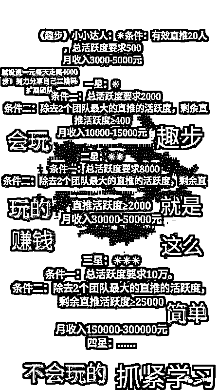

这是吴小姐发给我的图，我看了看我的活跃度是 1，**要是我想月入过万，总活跃度需要达 2000，那么我需要拉 40000 个人！****！****！**

这相当于我们镇的总人口。也就是说上到九十九，下到刚会走，人人都得攥着手机玩趣步才行。（因为趣步限制 1 机 1 号）

 

03 **自说自话的虚假交易**  

通过三天的努力，我终于拿到了 1.02 个糖果。我和吴小姐说我想卖掉这个糖果，她说太少了，一般都是 5 个起卖。她建议我去发朋友圈、拉人，攒了糖果就去兑换卷轴做任务，然后就能赚更多的糖果了。

吴小姐还说，糖果是蛋，卷轴是鸡。用蛋去换鸡，鸡能生蛋，蛋又换鸡，源源不断的鸡能产生源源不断的蛋。做生意要有持续性思维，不能只赚一次的钱。

嗯，听起来好像很有道理的样子，但是我不想拉人下水。于是我决定自己去交易所交易。打开网址一看，GHT（桂花糖）涨势十分喜人，在一片惨淡的市场中一枝独秀。当日 GHT 的单价为 1.59 美元/枚，涨幅达 1.92，堪称逆势飞扬。

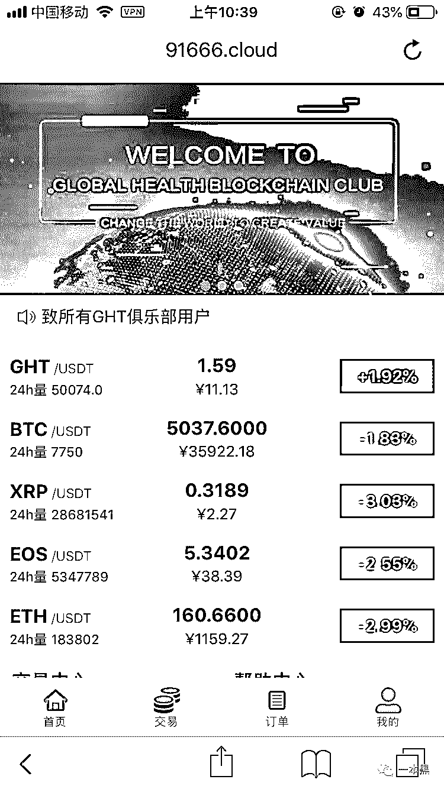

打开交易中心，有【我要卖】和【我要买】两个区域，【我要卖】 用来展示出售需求，【我要买】展示购买需求。

要卖糖的多达几十上百个，但是买糖的需求却显示为 0。

这是什么情况？

所有人都选择私下交易吗？

其它浏览器能查到交易记录吗？

带着这些疑问，我打开了以太坊浏览器，输入 GHT 查询。系统显示，一共有 4 个 GHT，根据与趣步成立时间对比，确定我们所说的桂花糖是第一个 GHT。

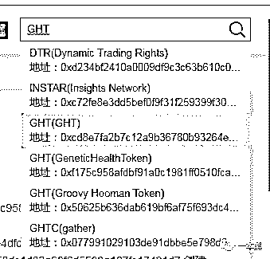

GHT 自 2018 年 9 月份上线后，仅有过一次交易记录，交易量为发行总量，共计 3 亿 3000 万枚。

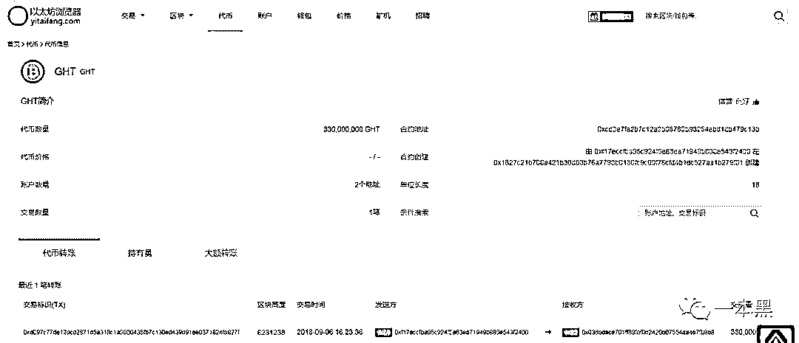

到这里，我想你应该明白了，10 亿枚发行总量是一个虚数，而群内的所谓交易只是在趣步内盘进行的一场数字游戏，糖果持有人从发行开始就没变过。

不知道等到崩盘的那一天，那些高价囤积糖果的人会做何感想？

04 **只赚差价的中间商**

随后我又查了查趣步这家公司的情况，2018 年 6 月成立，经营范围：区块链相关技术研究（趣步链 IWC）、运动防护用品制造（趣步手环？）、网上百货批发及零售。

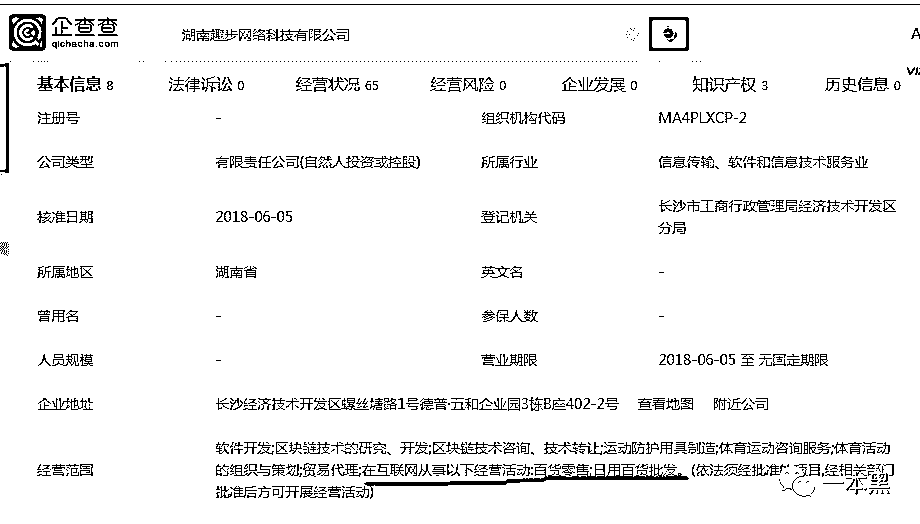

所以，趣步的实质是一个披着区块链外衣，做运动手环生意的杂货店（手动狗头）。

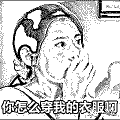

这时候我突然想起，糖果还可以兑换商品的呀，不能换钱，那我换东西也行。一个糖果 11 块，够买三块肥皂了，但是肥皂居然没货？这让我该怎么想呢？

不止是肥皂，沐浴露、纸巾、消毒液也没货，所有商品都显示库存不足。

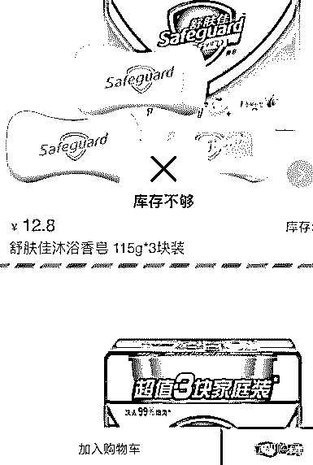

趣步这家公司无处不透露出诡异，我不知道为什么大家会被洗脑。反正我加入的那个交流群每天都有新人加入，咨询怎么赚糖果。

从我这几天的使用体验来说，我发现趣步有以下诸多疑点：

**0 投资的噱头**：在趣步的宣传中，用户只要每日步行 4000 步，就能获得收益。但是一天就赚几块钱怎么能满足广大人民群众日益增长的物质需求呢？

于是城市合伙人应运而生。

想要成为城市合伙人就要交 9 万 8，交钱之后合伙人能够获得 8 个月的分红权，瓜分趣步全球 20%的收益（现在是 10%，具体数值不确定，因为一直在变动）。吴小姐说目前几乎所有城市的合伙人都已经被拿下。

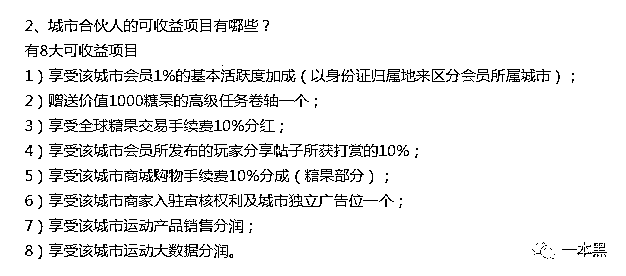      

**实名认证，无法注销：**下载必填推荐码，使用需注册，实名要缴费，赚钱拉人头。并且用户一旦注册，终身无法注销。

作为一个计步器，需要这么多套路吗？

在趣步系统内，上级不直接从下级收益的糖果中分成，一切以贡献值和活跃度替代。更鸡贼的是，当人头费以活跃度替代时，你会发现，拉一个人的收益连一根烟钱都不够。

**高额手续费：**用户获得的糖果可以交易，但是需要给平台手续费。用户等级越低，手续费越高，1 级用户的手续费高达 50%。卖糖果不仅要给平台钱，还要给当地城市合伙人 10% 的手续费，而剩下的 40%才是你的收入。

趣步多次称平台不出售糖果，只提供交易平台。按照这个说法，趣步就是个中间商，专赚差价。

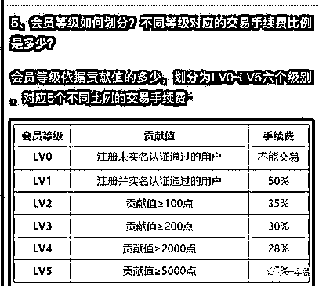

**负面新闻缠身：**天眼查的舆情统计分析显示，趣步的负面新闻比例高达 70%。而趣步的也喜欢用负面新闻包装自己，在百度上搜素趣步骗局，看标题是骗局揭秘，打开一看十有八九是趣步的宣传文。

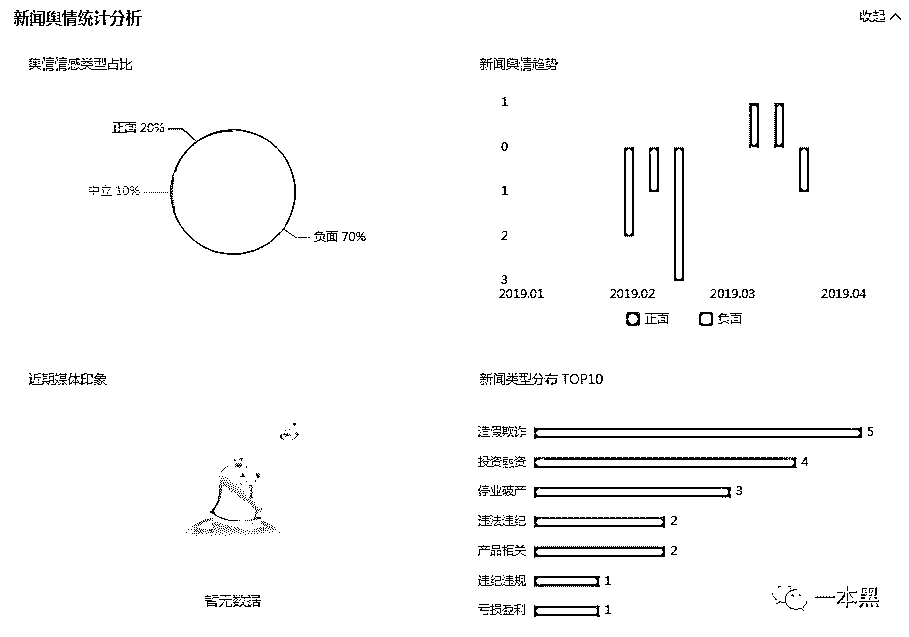

**“三无公司”：**

**无资质**：趣步曾在用户群中说自己具有区块链牌照，但业内人士称该牌照没有任何意义。趣步所谓的资质只有一张注册资金为 300 万的营业执照。在网上这样一张营业执照，3000 块就能搞定；而一个 App 的模板，5000 块就能买到。

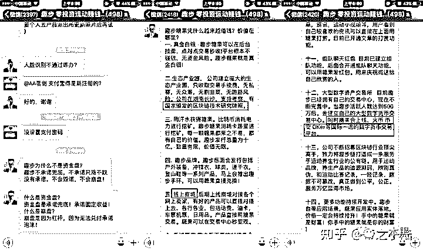

该图来自知乎

**无官网**：www.51qub.com 是趣步的官网，但实际上这只是一个软件下载页面。我们无法通过任何官方渠道了解到趣步的业务信息。甚至使用 iPhone 下载趣步，还需要手动添加软件信任。

**无客服**：在趣步 App 内，我联系不到任何客服，反倒是我的上级在我一注册后就立即与我取得联系。要想在 App 内提交问题反馈，需要填上真实姓名、电话、身份证号码以及证据截图，提交之后能不能得到解答也是个未知数。

* * *

没有客服、没有资质，没有商品，没有交易记录，请问趣步到底是个啥？

所谓的走路赚钱是一个噱头远大于实际意义的击鼓传花游戏，但每个人都坚信自己不是接盘侠。反正 0 投入，所以绝对不会亏。

可是那些辞掉的工作，浪费的时间以及高价囤积的糖果，又该怎么算呢？

如果你不是最后一个，那么谁才是呢？

还原事实｜专扒黑产

微信 ID：darkinsider

知乎 一本黑

微博 一本黑 007

投稿、爆料、招聘、转载

请联系微信：chenchen_19940612