# 10 分钟赚 60 万，在中国，算命到底有多野？

> 原文：[`mp.weixin.qq.com/s?__biz=MzU4ODAwNzUwMQ==&mid=2247485187&idx=1&sn=b598904f600647170cc581563286790f&chksm=fde21621ca959f3703a68e7fe0faeaf0884631f58a2e0f7c43d22b786a389c25686ebff1b443&scene=27#wechat_redirect`](http://mp.weixin.qq.com/s?__biz=MzU4ODAwNzUwMQ==&mid=2247485187&idx=1&sn=b598904f600647170cc581563286790f&chksm=fde21621ca959f3703a68e7fe0faeaf0884631f58a2e0f7c43d22b786a389c25686ebff1b443&scene=27#wechat_redirect)

近期微博总是给我推荐算命看相，不知道它是怎么知道我今年水逆的事情。我一向是不相信玄学的，但考虑存在即合理，我决定去看看。 

出现频率最高的一个微博粉丝 110 万的大师，大师的微博日常是发布一些风水命理相关的知识，其次则是免费帮粉丝们看看手相和面相。

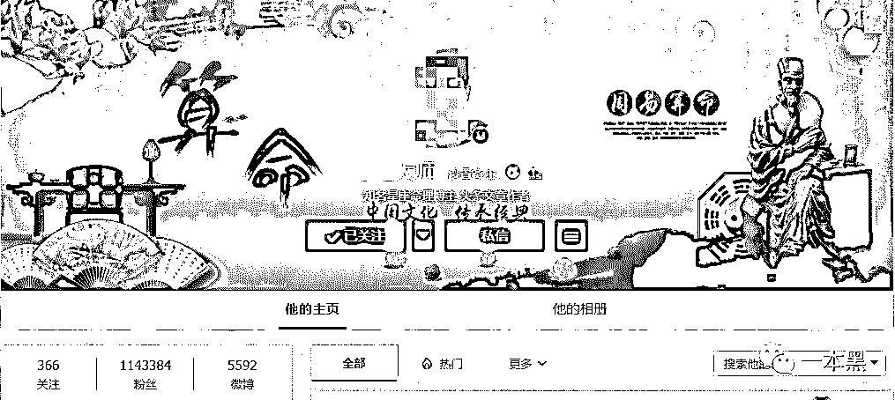

大师的每一条微博下面都有几十上百条评论，粉丝们发布自己的照片，希望大师能翻牌看看自己的性格和命运，甚至还有人会让大师帮自己断定前程和姻缘。

他们把算命大师当成了人生的导师，似乎一句话就可以指明前路。

文 | 喵叔

**01** **算命：我，大师！打钱**

早前神棍局被封，我才知道算命这个行当原来已经渗入到自媒体领域。在我们老家，婚丧嫁娶、新房动土都是需要算日子的，虽然没人完全相信算命，但这似乎已经成为了一种风俗或者说习惯。

原以为算命这种事情只有父母那辈人才会相信，没想到在网上依旧受欢迎。为了了解互联网算命和传统算命有什么区别，我按照微博显示的联系方式加了大师的微信。

输入大师的微信号，发现大师的微信昵称为【**（微博）扫码支付】。

好友申请通过之后，大师问我要测什么，我说姻缘。

于是大师发给我下面这张报价表。

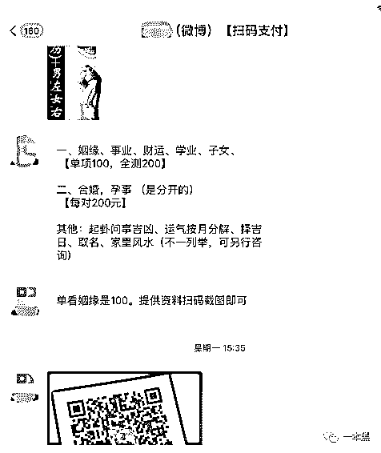

大师让我先扫码付钱，付完钱再详谈。由于收款码出现错误，大师建议我直接转账。

收款码显示凤栖禅寺，我问大师在何处修行，他给我发了一个地址-安徽省宁国市梅林镇凤栖寺。

我以为大师是寺庙住持，他说不是，是知事。可是大师最近发的微博都加上了道士、居士这几个标签。

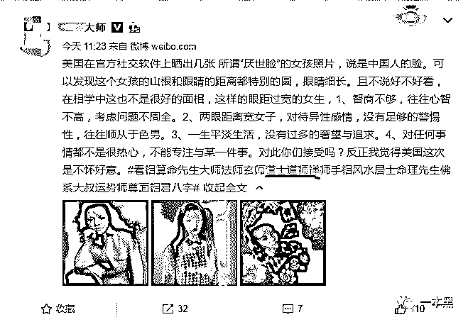

对于三教九流的知识我一窍不通，只晓得这位大师**大概是个寺里的和尚，当然也有可能是寺的一个道士？或者是在家修行的居士？**

不过这位大师的脾气是真的不太好。因为我一直提问又不消费，隔天我发现自己被大师删掉了。

于是我又加回了大师，我问大师怎么把我删了。大师说他们只看相，不聊其他的。

我问大师能不能和我聊聊佛经，于是。。。

大师又把我删掉了。

不得已，我又加了第二个微博粉丝 80 万的大师，大师照例给我发了一张报价表。

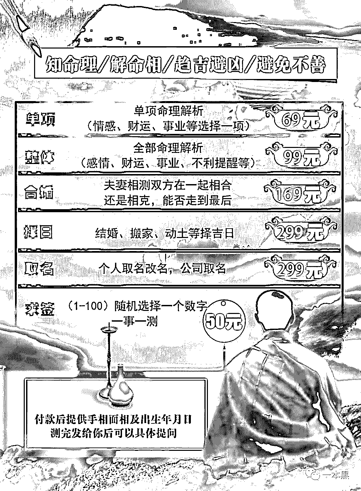

可能是这位的大师的粉丝级别不够，所以收费也比较实惠。当然相比于淘宝还是贵一些的，毕竟是个大 V。

这位大师也是在安徽修行，具体地址是九华山西天寺，一个著名景区内。

我问大师：学佛要考证吗？大师没有理我。

：是否用周易解卦？大师没有回复我。

：不准退款吗？大师说没有完全准确的测算。

：可以提供发票吗？大师让我另寻高明。

之后不管我发什么大师都没再理过我，即使我说想算命。并且大师还对我屏蔽了朋友圈。

后来我又咨询了几家淘宝店铺，得到的也都是类似的回答。

不论是 QQ 群，还是微博大 V，这些算命先生的做生意的方式都是一样的。

：算命吗？朋友

：算

：算的话，打钱。

：大师，我想问。。

：先别问，打钱。

：大师，我想和和你探讨一下。

：拉黑。

大师们的日常推广，除了靠免费看相就是蹭一蹭各路明星的热点了。

如果明星正当红那就说她们面相好，以后还会继续红，如果近期有负面新闻，就说他们最近时运不济，命里带煞。要是猜错了也不打紧，毕竟花无百日红，他们早晚有翻船的一天。

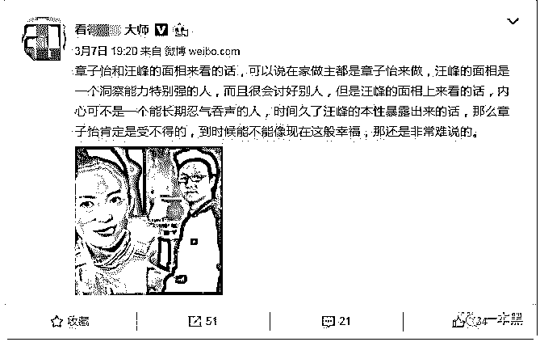

而大师在评论区帮粉丝免费看相的点评也毫无参考意义，所谓的解析和星座的概述极其类似，看似精准其实放诸四海皆准。

淘宝上搜算命，销量最高的店铺月销三千单；百度搜算命会出现 4820 万条结果；国内最大的算命论坛显示会员数量为 63 万，而这样的论坛网上比比皆是，更不论 QQ 群和贴吧了。

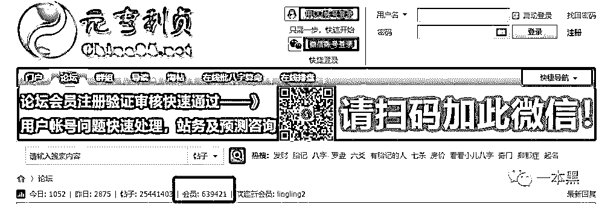

**02** **主营贴膜、副业算命**

当然了，算命不止有个人生意，还有团体的。开头提到的神棍局就是其中的代表。

公众号 s 神棍局 s（现已被封）是一个主营业外为贴膜的风水算命公众号，但其受众怕是一本黑的数倍，几乎每篇文章都能达到 10W+的级别。

这个被业界称为开过光的公众号，团队人数仅 7 人，但却在不到两年时间里获得了近千万的融资。它的传奇不止于此，开号半年，粉丝 35W；推出算命服务，10 分钟的销售额达 60 万。

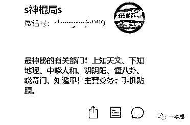

神棍局的创始人杨苗波称**正确普及应用玄学知识**是他创业的初衷。作为自媒体人，神棍局团队深谙自媒体传播的定律，标题党技术更是运用的炉火纯青。

他们第一篇爆文《未来二十年，色情行业将席卷全球》在朋友圈疯狂传播，第二篇爆款《香港维多利亚港风水之战：中国银行力战群雄！》获得了 39W 的阅读量，粉丝也达到了 10 万级别。有了粉丝基数之后，几乎每篇文章都是爆款。

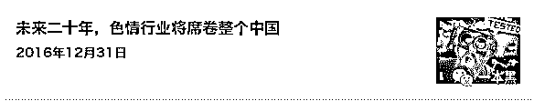

有了人，做什么都很方便了，于是神棍局顺理成章推出了命理咨询业务，白天 90 分钟微信对话收费 880，夜间 1200。

不过这是一年前的价格了，现在的价格是 1200 起步，算命先生（军师）等级越高，收费越贵。最贵的 90 分钟收费可达 10000 元。

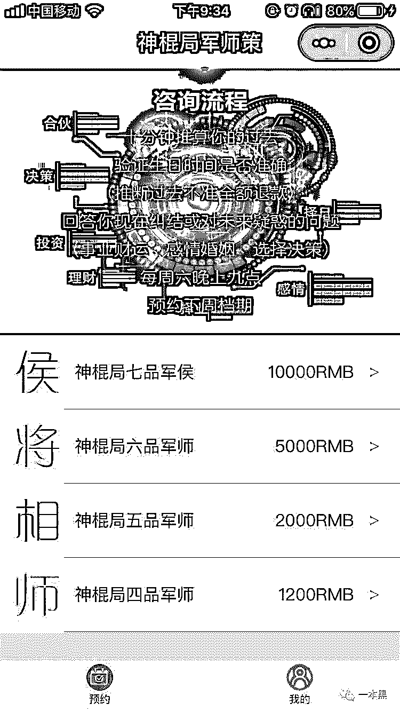

神棍局最初有 20 名命理师，每周可预约的次数为 66 次，总收入约为 60 万/周。一年单靠算命就能获得 2280 万的收入。（经过严打之后，如今命理师的数量减少了，可预约次数反而翻了好几番，收入就更不用说了。感兴趣的可以自己去查询）

之后神棍局还推出了电商小程序—神棍博物（当然了，还是被封了），并且他们还计划推出 APP、线上课程（也没了后续）。

另外，起名的收费是每人 3000。

神棍局称自己推出的咨询服务并不是迷信活动，而是咨询服务的一种，通过八字推算等手段为客户决策提供参考。

互联网让算命更加普及。根据中科协发布的相关报道显示，每四个人当中就有一个人相信算命，而每五个人当中就有两个人曾经算过命。尽管对于算命的结果并不会完全相信，但排斥算命的人却很少。

不止是中国，全世界人民似乎都对算命这种行为兴趣浓厚。西方的星座、塔罗牌虽然和算命的方式不同，但本质上是一致的，都是通过某种介质来对人的性格及命运进行归纳及预测。

而我们的邻国，韩国和日本对于算命的的迷信甚至不亚于中国。以韩国为例，根据经济学人的调查显示，2016 年韩国的占卜行业达到了 37 亿美金的规模远超当年的电影票房—14.4 亿美元。

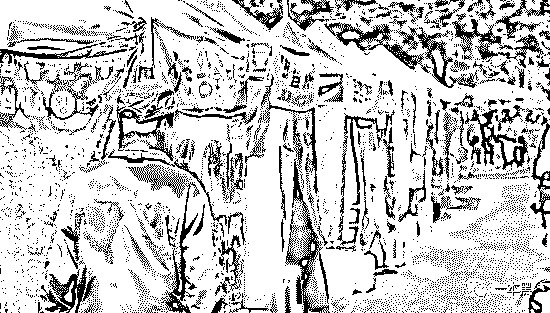

韩国算命一条街（来自网络）

韩国人算命时问的最多的问题是，工作不顺心何时跳槽、被戴了绿帽要不要分手、查出不孕不育还能不能怀上孩子。似乎全世界人民算命都是在关心这些问题。

追根究底，我们去算命，看风水，是因为我们**害怕变故**。

从农耕时代开始，我们就一直在追求稳定，当世界变化的越来越快，风险越来越多时，我们就会寻找各种办法来维系这种稳定。

科学如此，算命亦是如此。因为**算命的门槛相较于科学更低**，更贴近生活，所以很多人在遇到事情的时候会去寻找算命先生的帮助。

有的时候我们去算命也并非是真的希望能得到什么结果，或许只是想要**倾**诉一下近期的遭遇，或许只是希望能**获得一些心理安慰**。

此外，当对于无力改变的现状，我们通过算命这个行为，便可以将一切归咎于是命运的安排，而非是个人的能力造成，一定程度上能够给我们**减轻心理压力**。

我母亲也曾经去算过命，那阵子她身体不太好，于是算命先生和她说，“你不要急，你的好运还在后头。你前三四十年可能会过的比较辛苦，但是 50 岁以后就会有好运。你的儿女会很孝顺你，身体也会越来越好......”。我母亲听完很高兴，她丝毫没有察觉算命先生的说法有什么问题。

那时我母亲已经过了四十岁，她的身体一向很好，只是那阵子得了结石，所以算命先生说她以后身体会很好。我们兄妹二人向来比较听父母的话，所以算命先生说孩子会孝顺。等我们都大学毕业时，母亲也接近五十岁，不论是工作还是生活，都已经没有什么压力，自然是过得顺遂。

你看，他们只是把算命人说的话，换个方式复述了一遍，并且加以总结就能够获得极大的赞同和信任。

对于算命，有时候我们只是为了让他人认同自己的想法罢了。

**03** **转发这个杨超越，你将好运连连**

当然对于 90 和 00 而言，算命这种行为似乎有些可笑，但他们依然没能逃脱迷信的魔咒。“转发这条锦鲤，你就能获得好运“”、“转发这个杨超越，你就能事事顺利，好运连连“”。

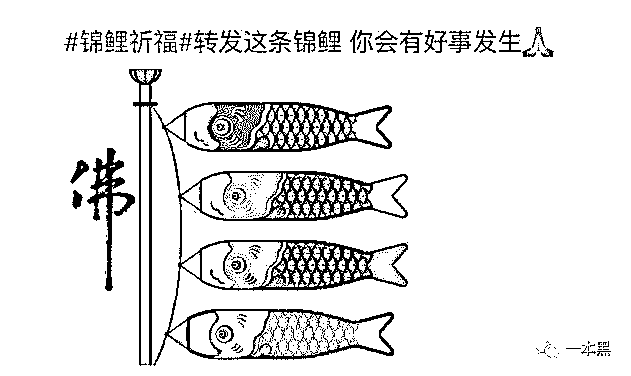

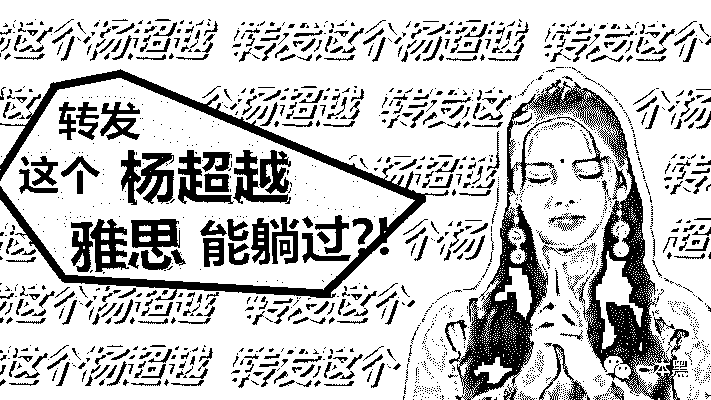

于是杨超越和锦鲤在很长一段时间里霸占了我的朋友圈，并且我相信它们还将继续霸占。因为今年很多朋友说他们水逆，于是，各种水逆退散符开始出现。

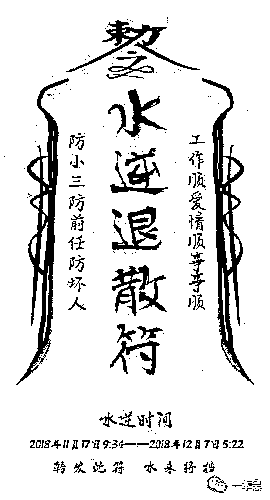

我问过很多朋友，他们转发杨超越之后，是不是真的运气有变好，她们的回答是没有。但是她们还是会继续转发，因为说不定就成真了呢？就当是许了个愿。

下面这张图，我曾经在数个长辈的朋友圈见到过，尽管画作者表示他画这幅画的原意并不是如此，但这丝毫不妨碍我们转发的热情。

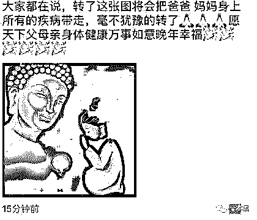

大家都知道这种行为对于现实生活都不会带来任何实质性的改变，但是一旦有需要，他们还是会义无反顾地选择转发。

因为，说不定呢......

命，这种东西，可以信，但**一定不要迷信。**

哦，也别找微博上的大 V 和淘宝上的卖家算命，他们中的大部分不是神算，是神棍。

算命的真正意义在于让你认清现状，不断地调整自身以便于平和地面对生活的起伏，不至于惊慌失措。

但，也仅止于此。

**参考资料：**

*   占卜在韩国是个价值约 37 亿美金的大生意，连总统都愿意为它花钱 | 好奇心小数据 ，好奇心日报 

*   《第三次中国公众对未知现象的抽样调查”报告》；中科协 2003

*   当代算命占卜的自我合理化，《民俗研究》2014 年第 4 期，李耕

*   《中国人的命理信仰》，董向慧

*   ## 中国人为什么痴迷算命，浪潮工作室，魏小乐

*   神棍局：如何做到 1 篇文章斩获 10W+粉丝，10 分钟销售收入 60W？，坤龙老师，研溪

还原事实｜专扒黑产

微信 ID：darkinsider

知乎 一本黑

微博 一本黑 007

投稿、爆料、招聘、转载

请联系微信：chenchen_19940612