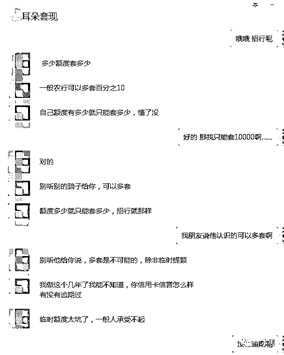
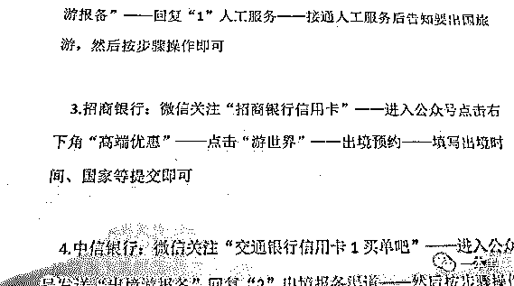
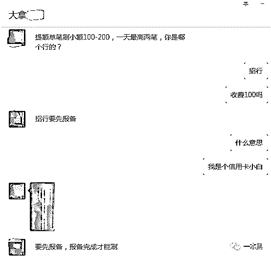
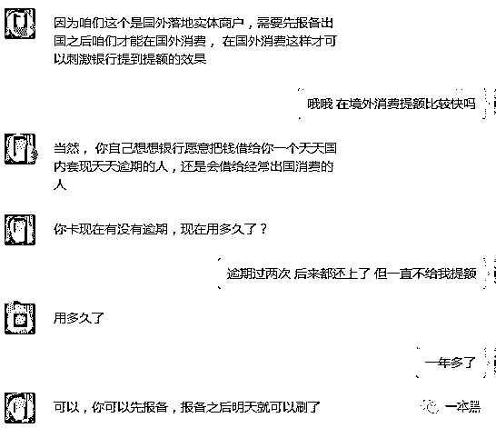
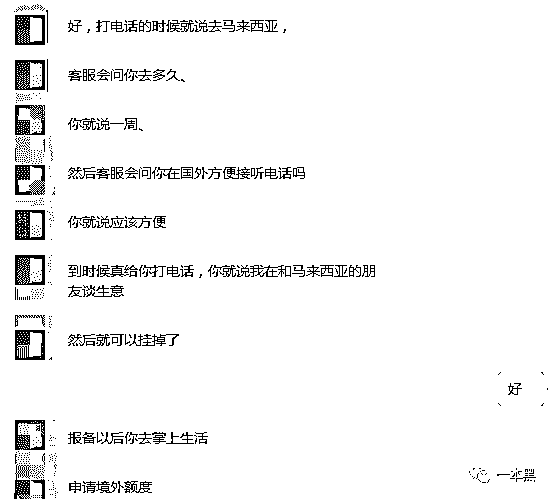
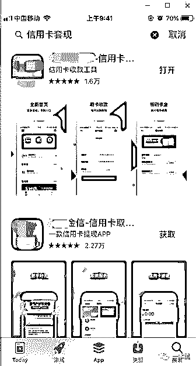

# 月入 3000，信用卡欠了 10 万怎么办？

> 原文：[`mp.weixin.qq.com/s?__biz=MzU4ODAwNzUwMQ==&mid=2247485174&idx=1&sn=fcaf55b00e03fcdc9aeffafb228df8b7&chksm=fde217d4ca959ec2debd6506690c1d0c1c3a025acd912036314913e67dcbef06cc5e830b2948&scene=27#wechat_redirect`](http://mp.weixin.qq.com/s?__biz=MzU4ODAwNzUwMQ==&mid=2247485174&idx=1&sn=fcaf55b00e03fcdc9aeffafb228df8b7&chksm=fde217d4ca959ec2debd6506690c1d0c1c3a025acd912036314913e67dcbef06cc5e830b2948&scene=27#wechat_redirect)

在知乎的信用卡话题下，排行前几的讨论是“月入 3000，信用卡欠了 10 万怎么办？”以及“我月入过万是如何被买买买拖垮的”。

不论收入高低，信用卡已经成为年轻人的普遍选择。

室友是个酷爱篮球的男生，他说自己看上了一双 AJ 联名鞋，还缺点钱，问我能不能借他点钱。我想着一双球鞋最多几千块，便同意了。

当他把链接发我的时候，我的双眼瞬间就模糊了。不是两三千，不是四五千，居然是两万五。于是我后悔了，我没那么多钱可借啊。

我向室友表达了歉意并羞涩地表示我只有两千块可借。室友很大方地表示没关系，说剩下的自己去套现。

“套现？”室友见我很惊讶就问我，“你没有套现过吗？”

“没有啊，怎么弄的？”见我好奇，室友便推了几个微信给我。

作者 | 喵叔

**01 ****刷 POS 机套现**

这几个人的生意都很相似，业务范围当然也很广，包含从包装办卡—代刷提额-远程套现-逾期代还的一条龙服务。

每个人的收费都不同，**当然了他们都自称自己是最可靠的，其它人都是骗子**。

在这几个人中，看起来最靠谱的是一个四川小哥。小哥的微信名叫小耳朵，听起来就是个有爱心的好人。

一般他们会先问哪个行？额度多少？是否逾期？是否绑定支付宝和微信？

在回答一连串问题之后，小哥说可以搞，要收**两个点的手续费，秒到账。**

我问小哥是否需要信用卡，他说绑定了支付宝扫码给他的店铺付款就好。

我问小哥，扫的是什么码？他说是店铺的 POS 机收款码。

我以为小哥开了淘宝店，他解释说只是在银行开了个户头而已。

小哥说把二维码发给我，让我用信用卡付款，他扣除手续费之后，会把剩余的钱返还到我的支付宝里，非常方便。

小哥问我卡的的额度是多少？要套多少？

我说 10000 的额度，要套 15000。

小哥沉默了几分钟之后，给我发了一句“自己的额度有多少就只能套多少，懂了没？？？”

没等我回复，小哥又接着说“别听骗子和你说的，可以多套。

额度多少就只能套多少，X 行的规则就是这样。

 

那些和你说多套的都是骗人的，不要信。除非是临时提额，但是临时提额太坑了，一般人承受不了。

银行有系统算法帮助用户提额，人工是无法干涉的。不要相信那些和你说可以随便提额的，知道不？

我在这行干好几年了，这些事清楚着呢。”

小哥说转款的时候不要给他转整数或者带零头，比如套现 8000 转 7999 就行了，不然容易被银行系统检测到。

同样是 POS 机套现，另一个小姐姐的收费就比耳朵哥高了一个点。当然了，这个名叫露丝的小姐姐业务范围也更广。

撸口子、黑户提额、空卡套现都能做，我问她花呗做不做。

小姐姐说花呗套现要分是否风控，价格自然也不同。风控花呗走淘宝 C 铺，10-15 个点，非风控 6-8 个点，具体收费按套现金额算。

至于怎么看自己的花呗是否风控，她让我上网自己搜。

小姐姐问我套多少，我说 15000，但是额度只有 10000，小姐姐说可以。一会把 POS 码发我，让我先转 2000 试一下。

我问小姐姐超过额度套现会不会影响征信，她耐烦地说，不会！她每天都要做几十单，没人说影响征信，让我放心，要是还不信就别转。

**02** **假境外游提额**

加的几个人里边有个叫大拿的，我和他咨询的是提额的事，这位兄弟的收费就稍微贵点。提额刷单小笔的价格是 100-200，一天最多刷两笔。

大拿让我先去招行报备。

**“我就小幅度提个额，咋还要报备。”**

他回答说，“因为我们提额刷单的是国外实体商户，必须要现在所在行报备之后才能在国外消费。

至于为什么要在境外刷，自然是因为比起一个天天在国内套现和逾期的人，银行自然更相信经常出国消费的人。

那代表他们的经济实力更强，懂吗？”

然后大拿就发给我这样一张照片：

大拿说，“报备完了后你就去掌上生活申请境外额度，第二天我就能帮你刷。

银行的人打电话过来咨询的时候，你就说去马来西亚。

客服问你去多久，你就说一星期。

之后客服还会问你在国外的时候方便接听电话吗？你就说应该方便。

要是一周后真的给你打电话可，你就说在和朋友谈生意，暂时不方便接听，然后挂掉电话。”

 

大拿和我说，下次还款的时候尽量全额还款，这样下次提额的速度会更快。

提额之后套现会更方便，到时候可以找我。

如果你到期还不上款的话，我们还能帮你代还。二次生意就收你 5 个点的手续费。（这是要把我套在这了吗？玩不起玩不起......）

于是我和大拿说先去报备，第二天再联系他，然后下了线。

**03** **“**良心**”****的****套现 APP**

信用卡套现的方式有很多种，除了 POS 机还有一种更加便捷的方式，那就是利用软件进行套现。在信用卡吧里，有很多人发帖表示可以帮忙套现，并且手续费十分的良心。

于是我加了其中的一位，这位兄弟的收费在几位之中是最低的。

**首单合作免费，8000 以内每单收取 20 块的手续费，当天到账。**

8000 以上手续费翻倍，隔天到账。

这位兄弟是潮汕人，他和我说**“长做长有生意”**。一个软件就可以搞定的事情，自然不能收费太贵。做生意要有良心。

出于好奇，我在应用商店搜索信用卡套现，出来了多款 APP。

      

从介绍来看，这类 APP 本身就是充当 POS 机的功能。用户只要同时绑定自己的信用卡与借记卡便可实现资金的自由流动，费率约为 6‰-7‰。而会员的费率相对会更低。

平台宣称因为没有中介，所以用户无需担心资金安全问题。

但从评论来看，这类 APP 也存在着诸多隐患，譬如服务器不稳定系统经常崩溃，到账无故延时、恶意收集用户隐私等。

**04** **助力还是桎梏**

信用卡套现如今已形成一条完整的产业链，从 POS 机代理商、设备制造商、收单机构、代理商、第四方聚合支付公司，各中小服务商等，约有数百万人参与其中。

不仅是信用卡，蚂蚁花呗、京东白条、苏宁任意付、大众点评、美团，**只要是能发生交易的平台都可以实现套现。**

但最受欢迎的仍然是 POS 机套现这种方式，尤其是有实体店铺的 POS 机，因为有店铺做支撑，消费行为看起来更加合理，因此也最不容易被银行察觉。

一般来说持有 POS 机商户需要向银行及相关单位缴纳 0.5%-2.5%的手续费，他们在向客户收取套现手续费时却高达 100%以上。而不管此比交易是真实发生还是虚假消费，只要产生了金额的流动，商户就需要向银行缴纳税费。

这就是为什么套现明明是一个不合规的行为，但却一直存在的原因。

在这场交易中，承担风险最大的自然是你我这样的普通消费者。我们一方面要向中介缴纳高额的手续费，另一方面还要承担可能被银行降额、封卡甚至影响征信的风险。

所以**套现这种行为不管怎样看，都是一场不划算的买卖****，还有可能涉嫌违法。**

**根据法律规定：**恶意透支信用卡 5000 元以上就构成刑法上的信用卡诈骗罪，判处 3 年以下有期徒刑；恶意透支 5 万元到 20 万元之间就属于数额巨大，判处 5 年到 10 年有期徒刑；20 万元以上属于数额特别巨大，刑期在 10 年以上。

信用卡本质上一种金融工具，使用得当会是一个非常好的生活助手，但是对于自制力差而欲望强烈的人来说，则是一个致命的诱惑。以卡养卡，以贷养贷是最不理智的行为。

一念卡奴，一念卡神。不要让信用卡变成生活的桎梏。

**所以，如果你月入 3000，信用卡欠了 10 万，你会怎么办？**

还原事实｜专扒黑产

微信 ID：darkinsider

知乎 一本黑

微博 一本黑 007

投稿、爆料、招聘、转载

请联系微信：chenchen_19940612