# “搞慈善吗？摆拍视频就可以年入百万的那种”

> 原文：[`mp.weixin.qq.com/s?__biz=MzU4ODAwNzUwMQ==&mid=2247485126&idx=1&sn=21ac5d77d0b3a5188acc04049f677f93&chksm=fde217e4ca959ef2ededd79b759ecd47466d3e1edf6a0bf35c72c0e1440d71b3fbe024d176be&scene=27#wechat_redirect`](http://mp.weixin.qq.com/s?__biz=MzU4ODAwNzUwMQ==&mid=2247485126&idx=1&sn=21ac5d77d0b3a5188acc04049f677f93&chksm=fde217e4ca959ef2ededd79b759ecd47466d3e1edf6a0bf35c72c0e1440d71b3fbe024d176be&scene=27#wechat_redirect)

慈善是心甘情愿的付出，一旦和利益挂上钩，就不免让人反感。

若是有人以贫穷的名义博眼球，用善心的幌子敛财，大概人人都会唾弃。

互联网上的慈善究竟是善举还是一门生意呢？

文 | 喵叔

**01 ****神一样的男人—王子清**

春节在家闲得慌，没事就喜欢刷刷抖音。无意间刷到了一个叫王子清的民间慈善人，二十几年来行走在云南四川各个偏僻的乡村，为无数贫苦家庭送米送油送温暖。

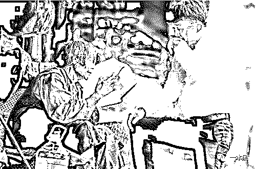

在抖音上，王子清有 360 多万粉丝，这些人之中大部分是他的拥护者，对于王子清的善行他们坚信不疑。

但也有一部分人认为这些视频是利用穷人摆拍博眼球，树立好人形象为公司做宣传。

王子清究竟是个什么样的人呢？

根据王子清视频里极力推荐的关键词“王子清简介”，**我们看到了一个神一般男人的传奇人生经历：**

*   14 岁时和同学打架逃跑，被当地派出所抓去暴打，因家里交不起 500 块罚款，被拘留 14 天。出来后辍学在家务农。

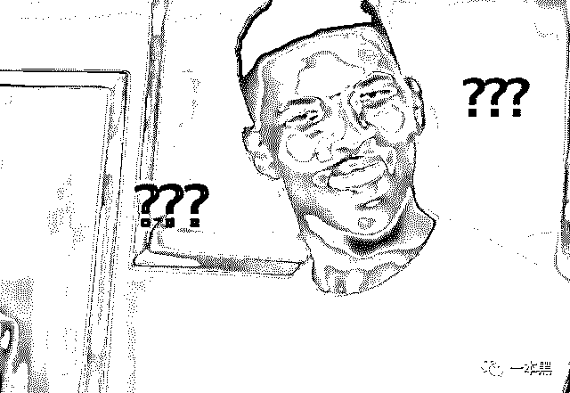

*   15 岁和人外出打工卖苦力。17 岁的一个深夜，王子清带着 30 块钱悄悄离开了家，开启了他的商业之路。

*   19 岁时，开的河沙厂被大水冲走，一无所有开始行乞。一年后用乞讨来的钱做玉石生意赚得了人生的第一桶金，100 万。

*   21 岁和人合伙开珠宝加工厂被骗光财产，只得去花鸟市场摆摊卖花。半年后之后攒够钱重开珠宝店。之后还开过餐厅，因为生意火爆遭房东嫉妒，在合同未到期的情况被扫地出门。

*   30 岁后开始从事电商至今。

尽管人生际遇跌宕起伏，但他始终不忘改变世界的使命，在穷困潦倒之际依旧坚持帮助他人。

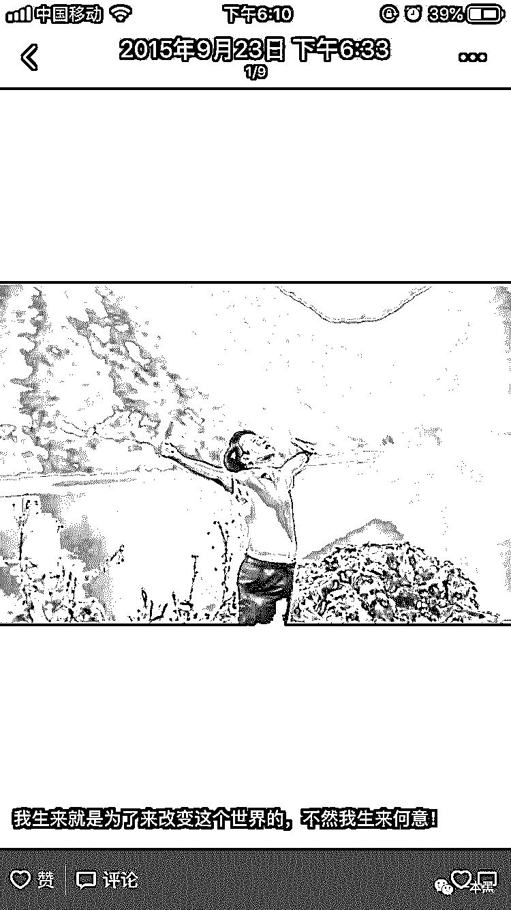

图片来自王子清朋友圈

在行善途中他还曾数次遭遇报复，被恐吓、抢劫、毒杀。**甚至还多次遭遇诱奸，对象中有变态老头？淫僧？妇女？****当然最终都是未遂。**

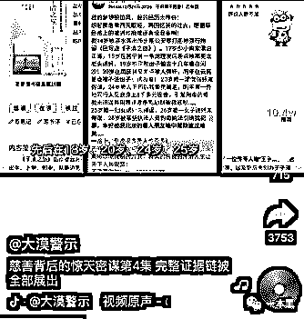

图片来自大漠警示抖音

生为成就事业利人人，死求下地狱救济孤魂度苦鬼！是王子清的抖音签名。抖音的视频记录了他这些年慈善路上的点滴。

双目失明的孤寡老人、病痛缠身的年轻母亲、自强不息的深山孤儿是他重点帮扶的对象。爬山游水坐吊索是他最主要的通行方式。

单从视频来看，我们不得不相信他就是一个彻头彻尾的好人。

可是近期也有一些声音开始质疑王子清，认为他不是真心做慈善，而是摆拍，利用穷人博取同情心树立自己的好人形象，以此达到宣传公司品牌的目的。

[`v.qq.com/iframe/preview.html?width=500&height=375&auto=0&vid=b1359hqtlso`](https://v.qq.com/iframe/preview.html?width=500&height=375&auto=0&vid=b1359hqtlso)

视频来自抖音【假的真不了-揭伪善王子清】 

这段视频中，**王子清前言不搭后语**，先是说自己和小助理在开车路上看到老人家独自一人，便下来搀扶，打听情况。后面又说道路塌方，车开不进来，他和小助理两人是步行进的山。

[`v.qq.com/iframe/preview.html?width=500&height=375&auto=0&vid=x1359bznjk1`](https://v.qq.com/iframe/preview.html?width=500&height=375&auto=0&vid=x1359bznjk1)

视频来自抖音【假的真不了-揭伪善王子清】

在这个看望孤身老人的视频里，王子清一会说自己去老人家里去了 10 年，一会儿是 3 个 10 年，一会儿是 7、8 次。

甚至还说老人家之前身体不好，在吃了他送的几百瓶油之后，吃好了。视频的末尾，王子清像是逗猴一样不停地拍打老人手臂。老人最终忍无可忍让王子清带着他的东西赶紧走。

这究竟是在做慈善还是玩杂耍呢？

除了这些充满争议的视频，在王子清的微博和抖音里还经常会出现一个名叫赶马商城的 App，这个 App 正是王子清公司旗下的一个新项目。

**02 ****三万变百万，子清人的暴富梦**

根据视频里的联系方式，我们添加了王子清线上招商代理的微信。

从代理的的介绍中我们了解到赶马商城是王子清旗下一款新的电商 App，商城内产品要么是自有品牌，要么是由合作基地提供，以山货和各类保健品为主。

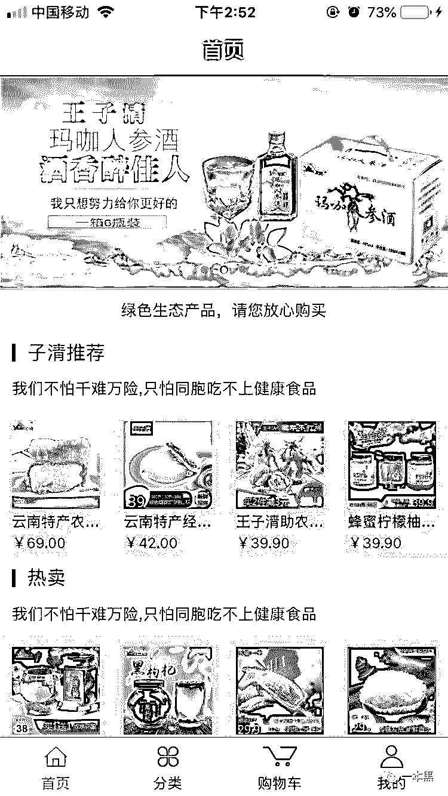

图片来自赶马商城 app

商城的主要有如下几个卖点：

**38000 的结盟费：**加盟商城需缴纳 38000 的代理费，其中包含 3000 元的产品代理费和 35000 元的诚信经营保证金。如果以后不再代理，可以退还 35000 的保证金。

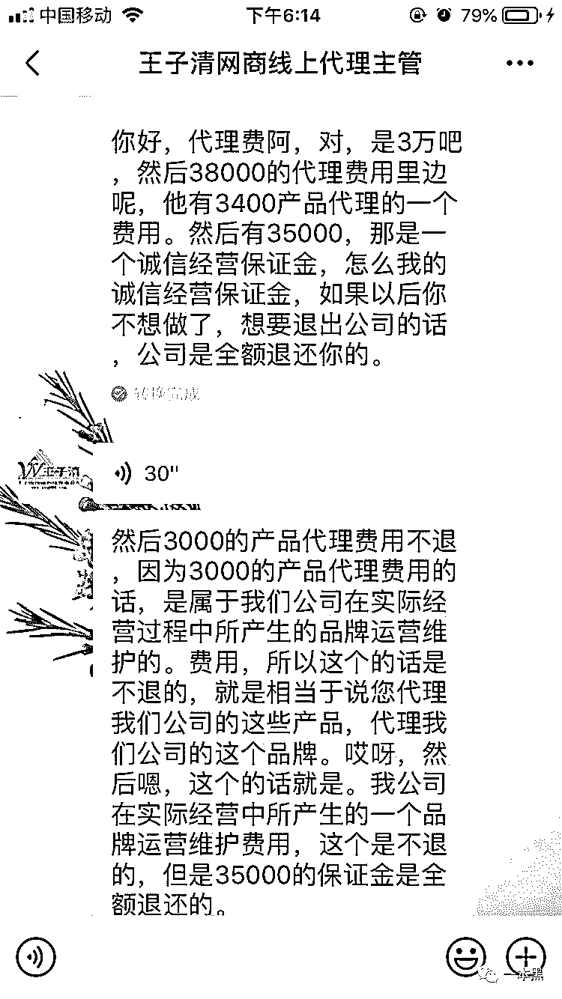

**代理不招下线：**每个区/县城招一名代理，代理之间是平级关系，代理之下不再招收下级。加盟区域可以自主选择，据代理透露目前已有 1300 多人加盟。

**不进货、不囤货：**代理商只需要负责代理区域的售后和宣传即可，顾客下单后，利润将自动划归所在区域代理商所有。代理商城不需要进货，产品由公司总部统一调度发货，产品利润在售价的 15%-45%之间。

**微店+商城双盈利：**除赶马商城 App 外，加盟商还可以开设个人微店，微店的销售利润同样归个人所有。

目前 App 已推出测试版，当问及商城何时正式上线，代理只回复说两三个月之后会推出二版，之后还会持续更新版本，App 功能会陆续开放。

看到这，大家或许会有些疑惑。这就是一个正常的电商加盟项目，和微商性质类似。既不是传销也不是非法集资，为何会引发网友声讨呢？

直到我看到这样一篇叫《王子清赶马商城经营模式》的文章（文章来自公众号王子清山货李世朋店）：

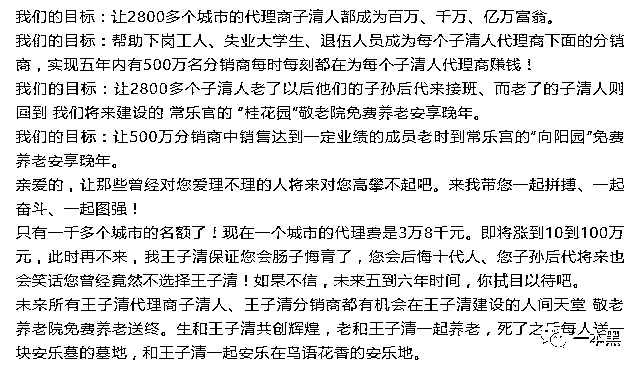

感情这**代理权还是爵位，可以子孙世代传承。**

王子清在给加盟成员讲课时称，未来三五年将带领所有子清人致富，让人人都能成为百万富翁，最终实现**人人有豪宅住，人人有豪车开**的伟大目标。

[`v.qq.com/iframe/preview.html?width=500&height=375&auto=0&vid=n1359xx2e5x`](https://v.qq.com/iframe/preview.html?width=500&height=375&auto=0&vid=n1359xx2e5x)

来自大漠警示抖音视频

不仅如此，王子清团队还将建设长乐宫养老院，**所有子清人老了均可免费入住。死了之后公司还会提供免费安葬墓地。**

只要加入王子清团队，就不怕没人给你养老送终。生是子清人，死是子清鬼。大概就是这么个意思了。

**03** **啪啪打脸的天然绿色食品**

经营模式只是赶马商城招商的槽点之一，更加让人诟病的产品本身。赶马商城的产品据称都是来自大山深处，其中很多产品都是扶贫产品，由合作基地直接提供，现采现卖，绝对的绿色食品无添加。

但是店铺热销的鲜花饼、百香果蜂蜜的配方上赫然标注着食品添加剂这几个字。

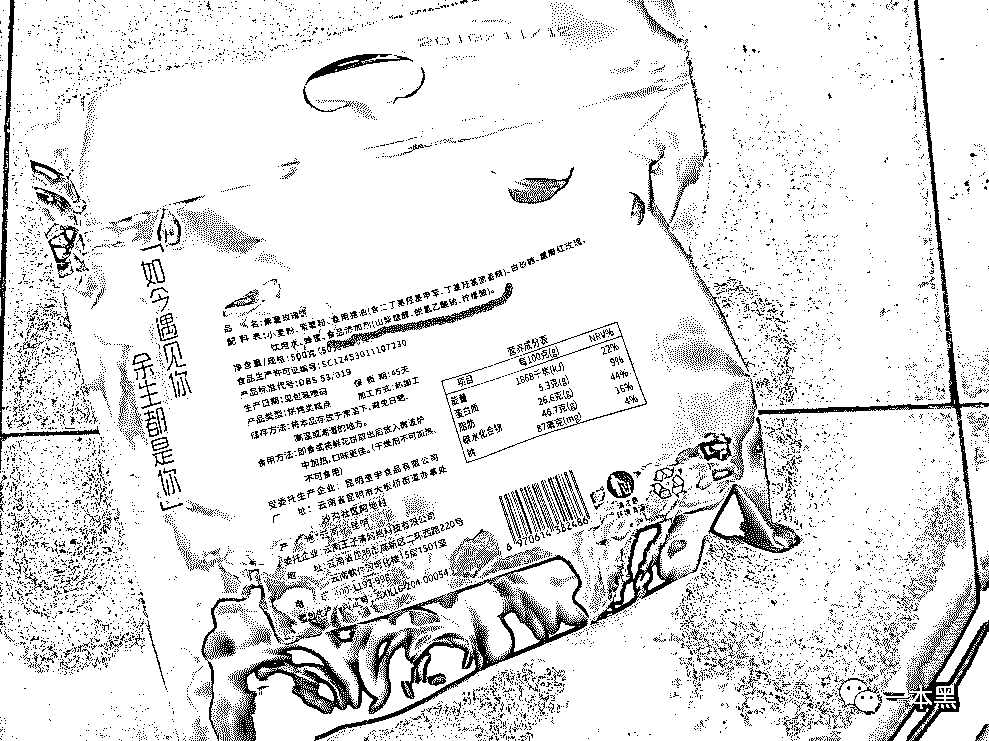

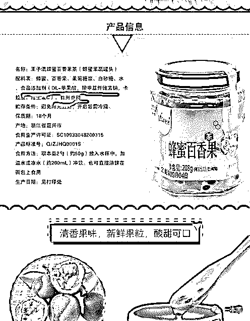

来自赶马商城、王子清微店评论

这脸打的有点响哦。

说好的无添加、说好的纯天然呢？而这样一袋鲜花饼的售价为 69 元，价格明显高于淘宝同类型产品。

**而店里的核桃，更是了不得，吸取了日月精华和天地灵气。**

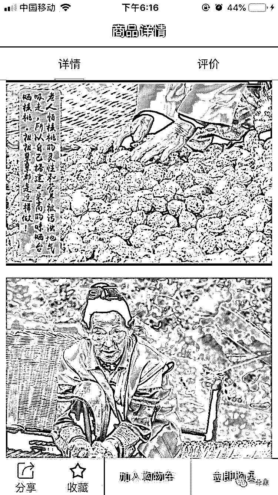

来自赶马商城 App

赶马商城在宣传时称将不断增强扶贫力度，和更多的优质农产品生产基地建立合作关系，在扶贫的同时给用户提供更加优质的产品。

企查查上显示云南赶马网络科技公司的注册时间为 2018 年 11 月 20 号，而王子清本人晒出的资料也显示赶马商城 App 是在 2018 年的 12 月 6 日完成开发。

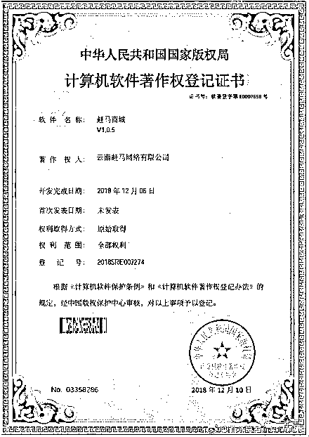

来自王子清微博

也就是说**短短两个多月的时间里，王子清已经靠赶马商城这个项目轻松赚得了近 5000 万。**

代理称加盟费将持续上涨，目前加盟只收 3 万 8，六月一号以后将上涨至 6 万 8，年底或将上涨至 10 万以上。

与此同时赶马商城将开启线下千店的计划，并将同步启动王者投资公司项目，玩转资本，实现商城上市。

这些套路是不是和资金盘的模式高度类似。**高额返利和分红、资本运作上市、网络讲堂培训洗脑。**

赶马商城究竟是网友口中的非法集资还是一个正常的电商平台呢？

**04** **画皮下的真面目**

网友质疑的不仅是王子清电商平台的可靠性，还有王子清多年慈善的真实性。

抖音上，多名用户发声质疑王子清的所谓行善视频是摆拍作秀，其主要目的是为了宣传公司品牌。在王子清店铺的产品评论中，大部分人表示都是正是被他的慈善行为所感动才选择去消费。

来自王子清微店评论

抖音打假专业户“大漠警示”、“假的真不了”、“38000 背后的阴谋”就发布了多个视频，揭发王子清善行的真相（有兴趣的可以去抖音观看）。

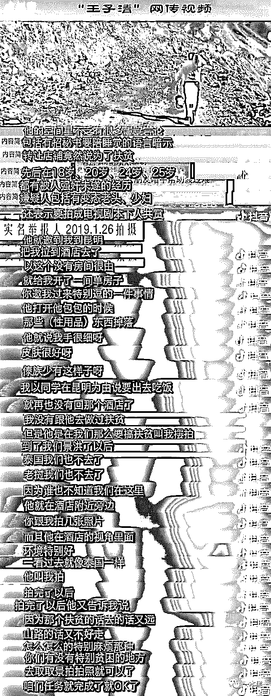

图片截图来自【大漠警示】抖音视频

视频中女子实名举报王子清利用穷人摆拍。

王子清曾邀请她一起去昆明拍摄扶贫视频，并以泰国、老挝交通不便为由让该女子就近寻找贫困的村落进行摆拍。因为不标注时间和地址，没有人知道具体位置在哪。

视频中该女子还透露，当晚王子清在安排住宿时称酒店无房，想和她同住一间房。还给了她一些暗示：你的手好细啊，皮肤也很好。。。其中有个细节令人震惊，王子清在整理自己的行李时，竟从包里掉出了一些，情趣用品。

王子清不仅对粉丝下手，对穷人也没有丝毫尊重。有网友将他模仿残疾人的片段剪成鬼畜视频。这些对穷人尊严肆意践踏的行为难道是真的关心他们吗？

**（因微信规则限制无法插入视频，请后台回复“****鬼畜****”提取）**

在一系列实锤的面前，王子清及其团队即时做出了反击，他们称这些行为是小人的狂欢。而每一条实锤视频发布后，他们就去所在地重新拍摄视频以证清白。

令人惊讶的是所有的指证王子清的人最后都神奇的变为了王子清的“粉丝”。

**有知情人士透露，只要钱给的够，剧情反转完全不成问题。**

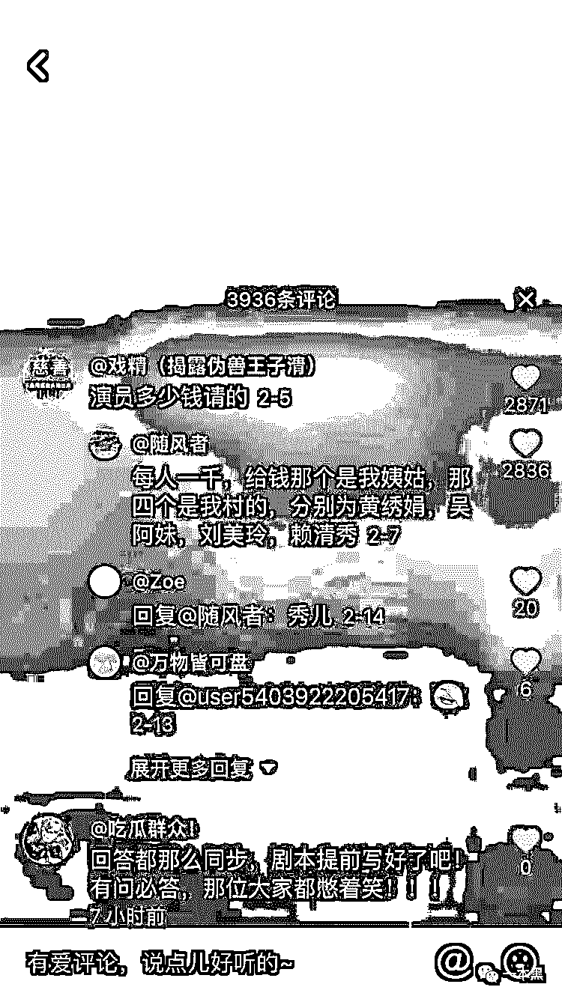

来自抖音评论

王子清也因此被广大网友亲切地成为王导，他拍摄的视频被称为**大型网骗连续剧**，目前已更新到 719 集。但该剧剧情雷同，套路相似，全靠王导演技撑场面。

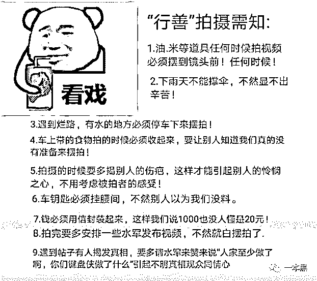

网友总结的行善视频拍摄套路（来自知乎）

近期王子清的视频的主旋律统一变成了**感谢政府、感谢党**，在国家的带领下，人民集体奔小康，而自己不过是一片绿叶。

在王子清最新一期的洗白视频里甚至还点名了大漠警示。和网友总结的套路一样，上来就是质问三连：

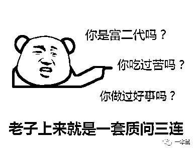

“你是富二代吗？你吃过苦吗？你做过好事吗？你这个键盘侠，人家做慈善了。你什么都没做你还抹黑王子清。

* * *

王子清还曾多次在朋友圈晒出被帮扶人的裸照，照片里他们的身上长满了脓包，赤条条的在镜头下展示自己的难堪和残缺。我想即便是出于帮助的目的，穷人的尊严和隐私也值得被保护。

传奇的人生经历、坎坷的行善之路以及天花乱坠的投资项目，究竟有几个是真的？

网友的实锤，王子清的反驳，到底孰真孰假？

没有人会去无缘无故批判一个做好事的人。与其声嘶力竭说人抹黑，倒不如拿出些真凭实据更让人信服。

**参考资料：**

抖音用户：假的真不了【揭伪善王子清】、大漠警示

王子清摆拍“慈善”虚构公司上市“钱景”发展会员吸金集资

http://www.baiguanw.cn/bgzx/20181011/193674.html

知乎：云南王子清究竟是什么样的人？

https://www.zhihu.com/question/51271858

 

还原事实｜专扒黑产

微信 ID：darkinsider

知乎 一本黑

微博 一本黑 007

投稿、爆料、招聘、转载

请联系微信：chenchen_19940612