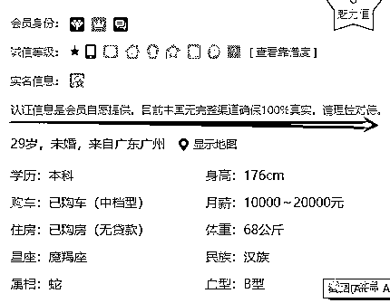
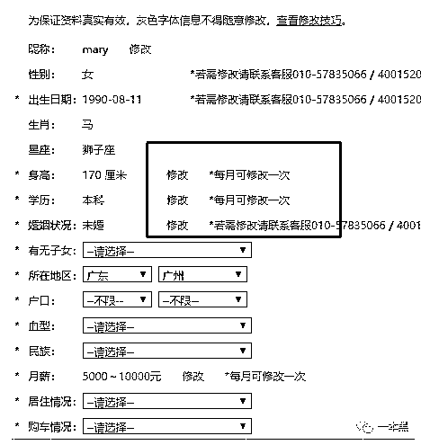
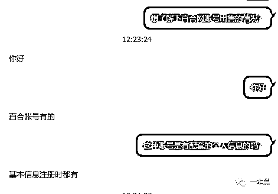
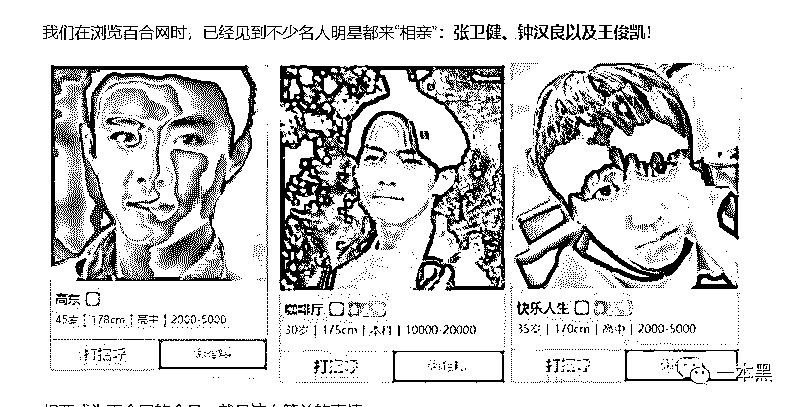
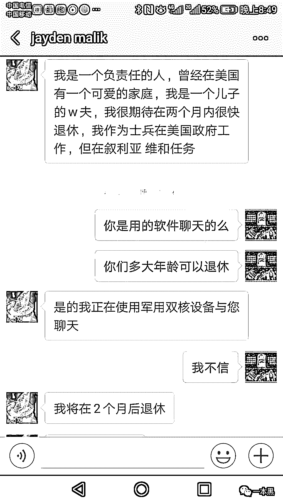
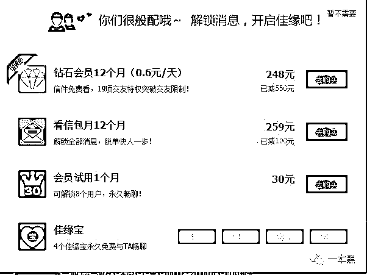
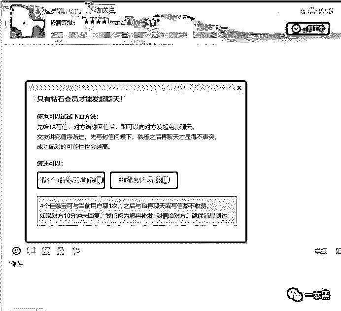
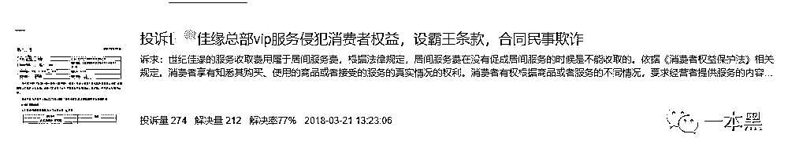

# 我去婚恋网站逛了逛，发现全是他妈的骗子

> 原文：[`mp.weixin.qq.com/s?__biz=MzU4ODAwNzUwMQ==&mid=2247485009&idx=1&sn=51850429ea62efee7b4034109619ed61&chksm=fde21773ca959e65a88d31c31bcc82081669eeee79265746d6fc0e361aab6a0ae648ab1ecfde&scene=27#wechat_redirect`](http://mp.weixin.qq.com/s?__biz=MzU4ODAwNzUwMQ==&mid=2247485009&idx=1&sn=51850429ea62efee7b4034109619ed61&chksm=fde21773ca959e65a88d31c31bcc82081669eeee79265746d6fc0e361aab6a0ae648ab1ecfde&scene=27#wechat_redirect)

契诃夫说：男女结婚，是因为彼此没有了别的办法。

男女选择婚恋网站，则大概是已经走投无路，且最终可能被婚恋网站逼得无路可走。

“我在相亲网站上逛了五年多，遇到过酒托、花托、开业骗子、生日骗子、金托、红包、衣服、话费、淘宝、传销、股票等等，她妈的全是骗子……”

他的遭遇可以说只是婚恋网站平台的一个缩影，在这里，你想要找的是人生伴侣，可你遇到的人可能只想找到传销下线，或者一个取款机。

文 | may

# 

**01 ****你不知道屏幕的那一头是不是条狗**

打着 “严肃婚恋” 和 “实名制” 的旗号，大多数婚恋网站却往往连最基础的身份真实都无法保证。对此，婚恋网站自身也毫不避讳，强调会员信息是由会员自愿提供，且目前中国无完整渠道确保 100%真实。

 

婚恋网站注册流程简单，注册时，随手填写性别、学历，头像照片，而身高、学历、婚姻状况、月薪等可以每月修改一次，对注册会员，并无合适的审核机制。

那认证会员又如何呢？

据相关媒体报道，有用户将一张经过 PS 处理、更改了身份证号和照片的身份证上传后，当天即收到了 XX 佳缘认证通过的通知；在百 X 网，认证需要输入照片和身份证信息，**即使头像照片和身份证照片不对应，系统也提示“成功通过身份认证”。**

在互联网上，购买个人信息也易如反掌。网上多的是专门出售真人信息的不法分子，从他们那里可以买到各个年龄段的男女身份信息，有了这些信息，骗子们可以在多个婚恋网站注册成 N 多个实名会员。

身份信息和会员显示的照片大多对不上号，想要什么文凭，婚姻状况，收入多少，有没有公司，有没有车房，身高多少都可以按骗子们的设计随便填写。

也就是说，**你根本无法判断在你屏幕另一边的人到底是谁****。**照片，婚否、职业、财产状况、甚至国籍都可能是一个诱使你上钩的诱饵。这些却是你花钱找来要与自己共度一生的人。

照片，这是最容易造假也是最容易被拆穿的部分。使用百度或 Google 的“以图搜图”功能，很多骗局一开始就会被轻松拆穿。

明星照片还可能只是玩笑，很多西装革履、成功人士造型的照片则更可能被盗用，以营造自己的成功形象。无业游民也可以自吹月入数万，三和大神也敢说自己有房有车且无贷款。

当然，不仅有人假冒成功人士，还有人冒充 IT 行业从业人员，**程序员似乎正在成为婚恋网站上相当抢手的选择。**

而已婚人士乔装未婚，辅以 “夜读金刚经” 类的低劣手段，欺骗女性。其中不乏女性未婚怀孕后遭渣男否认，不得不一人独自抚养孩子。

“我 15 年遇到同是老乡的那个骗子，很快怀孕，尽管当时我特地拍了他的身份证，还寄信到他老家验证，结果到他老家后还是被骗钱。如果是正常我也不会想离婚，现在离婚带孩子自己过。”

有些人会主动上传自己离婚证书以证明自己的未婚身份，但即便这样依然不能轻信，毕竟此人目前状态是二婚进行时。

# 

**02** **婚恋平台乱象**

利用伪造的身份进行诈骗，婚托、酒托、花托，这些只是入门，在婚恋网站上，官方会主动提醒用户注意骗局，这已经是平台最大程度地“负责”了。

“我交了 1 万块的会员费，有 6 个名额。我第一次见面的女孩，直接说她不是自愿来的；第二个见面一开始聊得挺好，转个身发信息都不回一条，感觉就是托”

幸运的是，锋行顺利地从平台要回自己的 1 万元会员费，并无太大损失。

更多人是人财两空。

“有一个说自己是开公司的，一天打几个电话嘘寒问暖，买了机票说要来见我，还把航班信息发给我看。来之前他说他的公司开业，然后说他父母比较迷信，让我以女朋友的身份送他公司**六棵发财树**，骗了我三万块。”

还有不少已婚人士活跃在婚恋网站上，随意勾搭，把婚恋网站当成约炮的平台。

“有些人根本不是来找结婚对象的，就是想找炮友的。”

骗局与时俱进，从最简单的人在外地，需要路费回家，到现货投资。更有各种奇葩招式，让人防不胜防。

“我遇到的一般都是骗钱的，聊一段时间就开始让你投资，以前是做现货，现在是外汇。对方说自己是程序员，能够黑进博彩网站。相处不久就发来一个链接，让我用他的账户去下注赌钱。”

**为了骗取钱财，有些骗子甚至真的与对方结婚。**

在某婚恋平台，张华认识了五星会员明明。会员资料介绍，明明本科学历，在一家外企工作。因为平台提供了身份证、户口本等认证，张华对此深信不疑。

两人相处一年后结婚，这时张华才知道，明明学历造假，所谓的外企工作也是谎言。而此时，他原来的 50 多万元的积蓄，也被明明以做生意等各种理由骗走。

**还有不少传销组织将婚恋网站当作发展下线的平台。**

“这些传销组织将受害者骗到窝点之后，通过成型的“套路”，“加工厂”“流水线”式操作，分工明确，依靠暴力、洗脑等手段，半个月就可将受害者培养成合格犯罪工具。”

# 

**03** **骗局才刚刚开始**

**伪造身份，只是骗局的开始。**有了不一样的身份，骗局才算有了底子。

网友 “锦华” 在佳缘网站上遇到了这样的骗局。

“我是在佳缘网站上认识的，去年九月二十八号加的微信。他自我介绍说是驻叙利亚的美军，今年 51 岁，离异，有一个 7 岁的儿子。”

“年底的时候，他突然告诉我说他在美国的儿子生病急需用钱，以联合国不允许在营地存钱为借口，且儿子所在学校的老师怎么凑钱后还差 3200 美刀，犹豫再三之后，我让他给我发个银行账号。”

“然而，他发来了一个招商银行账号，开户行在河南许昌。”

即便如此，锦华还是抱着一线希望打钱过去，最终的结局自是让人伤心。

这件事之后，这个叫做潇洒哥的男性还想继续从锦华手中骗钱，但遭到了锦华的拒绝。

“那个骗子又想找我要 6500 美元，当然被我拒绝了。”

先恋爱，然后再慢慢找各种理由要你给他汇款，这是骗子一贯的套路。

**骗局中其实是满满的诚意，诚恳的自我介绍，时不时的嘘寒问暖，甚至还有精心准备的视频通话。**

“ 这些其实都是提前录好的视频，也有可能是在社交网站上下载的视频”

尽管该类案件早有曝光，但仍有许多人深陷其中。**在情感的裹挟下，有的人甚至卖房卖车，甚至不惜借高利贷将钱借给骗子。**

有内幕人士反映这可能涉及到国际团伙作案，但具体情况无法知道。在外网上，我们也可以看到，通过婚恋网站找到目标，利用社交网站上的照片伪造身份，感情设陷。

# 

**04** **推销洗脑和诱导消费**

婚恋网站作为垂直类平台，只能满足用户某一个时期某一个方面的需求，用户的生命周期短。尽可能榨取用户价值也就成为重中之重。

在婚恋网站上，注册成功之后，就会有人给你发来站内信。如果你觉得对方不错，想要回信，就需要购买会员，或者支付 4 个钻石币。你想要看访客信息，同样需要花钱。

平台更主要的收入之一则是依靠 “VIP 会员费”，这也是平台最为人诟病的地方。

**红娘所能提供的服务与收费不成正比，霸王条款，退费难。**在聚投诉上，这是婚恋平台被投诉最多的事项。

有爆料者给我们讲述了他在某平台线下店的经历。

先后换了三个导师，了解过往经历，分析感情失败原因。你跟她倾诉的爱情经历，成为他抨击你的利器。为什么渣男都让你碰见了？想想是不是自己的问题？

无论是情感挽回机构，或者是相亲平台，**想让你购买服务的主要手段就是，诋毁你，贬低你。**

理发店的 Tony 说你发型老土，头发干枯，从而让你办卡买护理套餐。整形医生说你大腿过粗，最好做个抽脂。

接下来，就开始吹嘘自己手上有适合的资源，只要你花钱购买套餐。先后换过三个导师，前仆后继的车轮战，就是要把你拿下。

说有合适男性推荐，只要购买会员就能开始相亲，开始全新生活。于是，这位朋友就被忽悠着花了 3.6 万元买了个会员。接下来，她就开启了漫长的退款维权之路。

**在跟老师傅讨论催婚问题的时候，****老师傅跟我透露了他的一个心得，叫先发制人。**

“大姑，我还没对象呢，你们单位有没有合适的啊？”

“二嫂，你上次来的那个朋友有对象了吗？”

表现得足够不要脸，能够直接减少 80%的春节无聊催婚寒暄。你父母表现得再急切，结婚之后的生活也不能一手包办。

下次被催婚催急了，不如直接把案例直接甩过去，你知道每年有多少对夫妻离婚吗？有多少人因相亲受骗吗？

********

还原事实｜专扒黑产

微信 ID：darkinsider

知乎 一本黑

微博 一本黑 007

投稿、爆料、招聘、转载

请联系微信：chenchen_19940612

拒绝白嫖，请点好看