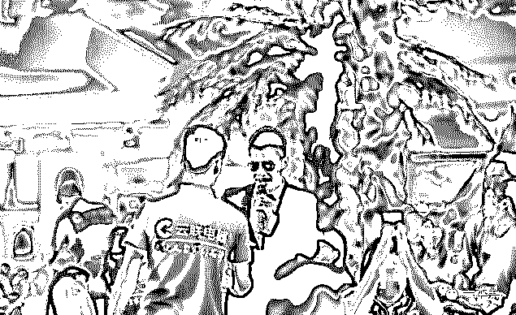
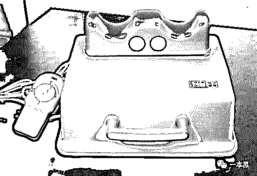
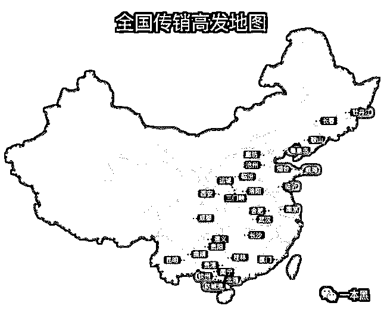
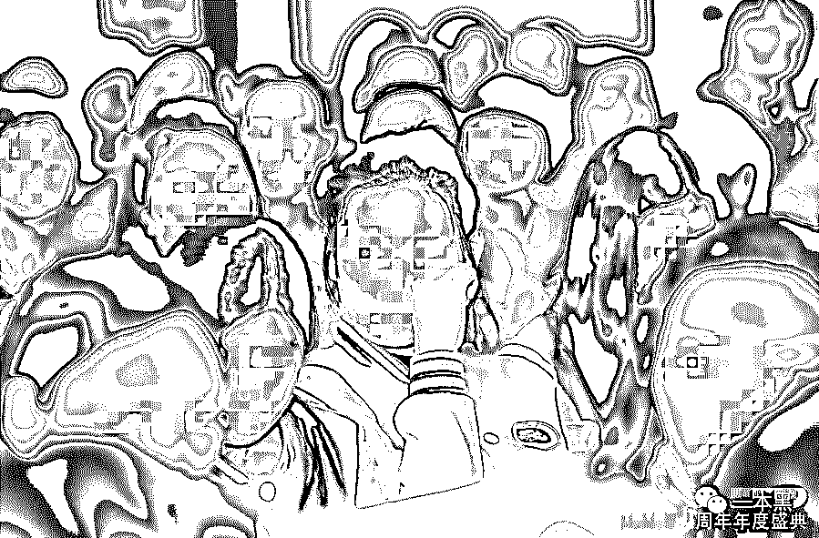

# 抢劫、强奸、杀人，吃人的传销窝，不死的暴富梦

> 原文：[`mp.weixin.qq.com/s?__biz=MzU4ODAwNzUwMQ==&mid=2247484943&idx=1&sn=6af8f326ecb981f4e3b3c89d0888fa9a&chksm=fde2172dca959e3b76255ae6642cc0513d387f65f9c626e6fd671b54cfde7dd505b14fe32649&scene=27#wechat_redirect`](http://mp.weixin.qq.com/s?__biz=MzU4ODAwNzUwMQ==&mid=2247484943&idx=1&sn=6af8f326ecb981f4e3b3c89d0888fa9a&chksm=fde2172dca959e3b76255ae6642cc0513d387f65f9c626e6fd671b54cfde7dd505b14fe32649&scene=27#wechat_redirect)

数亿人深陷其中的骗局，一个靠谎言和大饼维系的经营模式，一场无疾而终的财富悲剧。

年关将至，各路骗子也纷纷出动，想要在年前再捞一波。所以今天黑哥就和大家来聊聊传销。

文 | 喵叔

2018 年 4 月底的一天，黄明身着一身灰色笔挺西装，正在情绪高涨的给台下几百名销售精英描绘云联惠的美好明天。为了助兴，黄明还重金邀请了刘德华的扮演者前来表演。

*       刘德华的扮演者*

这次大会，全国各地的销售精英几乎倾巢出动直奔佛山，有的甚至拖家带口。他们希望能够借助云联惠这艘共享经济的大船，实现财富自由的美好愿望。

**在现场几百号销售的簇拥下，黄明满面春风。**这是属于他的光荣，历史将永远铭记这一刻。

人间四月芳菲尽，刚过完春天，云联惠也走到了尽头。5 月 9 日，黄明因涉嫌组织非法传销被捕，云联惠总部被警方捣毁。

**“干掉淘宝,饿死天猫”这样的豪言壮语也随着春风一起消失的无影无踪。**

云联惠创办的云联商城靠消费返利获客，号称”花多少返多少".商城的商品单价比京东天猫都要高，层级递减的返利模式最高也只能返现 5%。**倘若你在云联商城消费了 10000 元，想要获得全额返利，大概需要 505 年的时间。**

利益共享是云联惠最吸引消费者的项目，通过逐级发展下线瓜分返现金额，其本质等同于传销。当这个价值 3300 亿的泡沫破灭时，依然有人对云联惠深信不疑，并坚持为他辩白。

**01 ****从庞氏骗局到老鼠会**

1919 年，一个名叫查尔斯·庞兹的意大利人瞄准了一战后经济市场的混乱，利用信息不流通向美国市民兜售一种欧洲邮票，并声称只要购买这种邮票再卖到美国，90 天之内就可以获得 40%的回报。为了让骗局看起来更可信，庞兹的确让首批投资者尝到了甜头。于是越来越多的人不断涌入这个骗局。

当时经济一片萧条，人们食不果腹，一旦有赚钱的机会便不再考虑其真实性，尤其是穷人。当时仅波士顿一个城市，便有 4 万居民持有庞兹的所谓投资。在一年时间里，庞兹骗取了近 1500 万美金的的投资。

然而，这个投资神话在 1920 年 8 月便破灭了，因为庞兹破产了。

直到这时人们才意识自己被骗了，在清点庞兹的财产时，一共只发现到两枚邮票，根本没有他声称的几亿张。而庞兹本人却利用骗来的钱财购买豪华别墅和镶金权杖，过上了穷奢极欲的生活。

这便是著名的庞氏骗局，也是传销的雏形。

河提一旦决了口，再怎么修补也无济于事。于是越来越多的人利用庞氏骗局开始敛财。

1945 年，安利公司在美国发明了一套独特的销售方法， 也就是如今传销的基本模式。

这一模式后来被模仿改进，产生了一套名叫金字塔销售计划的传销模式，该模式也被称为老鼠会。

随后的几十年里，老鼠会在美国不断壮大。因为受到政府的打压，老鼠会在美国无法立足，于是漂洋过海进入日本及中国各地。

80 年代末期，传销从日本流入中国。90 年代传销开始在我国大行其道，台湾兴田生产的“爽安康有氧健康摇摆机”，在当时风靡大陆，这种成本低廉售价 6980 元一台的摇摆机一度让无数中国家庭家破人亡。

人们怀着一夜暴富的梦想将全部身家投入其中，以为摇摆机能摇来财富和未来，却不知那摇摆的规律里是早已算计好的陷阱。

**

*  风靡一时的摇摆机*

摇摆机就是一个简单的健身机器，用来促进腿部血液循环，除此之外没有任何用途。

为了拉更多人入伙，经销商擅自将产品价格从并将 6980 元的价格降到 1980 元，甚至将亲人朋友纷纷拖下水。很多人为了买摇摆机，卖田卖地，四处举债。

当人们意识到这事不对劲的时候，想退出却也不再可能。传销从自愿加入变成了人身控制和精神洗脑。只有跟着组织走，才是唯一的出路。

1998 年 4 月 21 日，国务院发布《关于全面禁止传销经营活动的通知》，规定“立即停止传销经营活动”。传销在我国开始转入地下。

**02 ****北派打地铺，南派住别墅**

传销界流传着这么一句话叫”北派打地铺，南派住别墅“，说的是南北两派传销在操作上的区别。

北派主要是多人聚居、吃大锅饭、睡地铺，甚至存在非法限制人身自由等情况；这些参与者一般为刚毕业的大学生或者工人、农民等缺乏经济基础的群体。

北派传销的代表有“天津天狮”。近 15 年来，以“天津天狮”名号开展传销活动的北派传销组织，已成为我国分布最广、最具暴力性的传销派别。这个令人闻风丧胆的组织在 10 年时间里，犯下各类刑事案件高达 2781 例，主要以非法拘禁、故意伤害、抢劫、过失致人死亡、故意杀人等罪行为主，期间共导致 155 人死亡。

在以“天津天狮”为名的传销活动中，抢劫和故意伤害是常见的犯罪类别。

2014 年，漳州市一“天狮”传销窝点，传销人员用毛巾将曹某活活捂死，在其死后，传销人员还将大量高浓度白酒灌入吴某口中，造成酗酒猝死的假象，并抛尸野外。

2015 年 5 月 14 日，福州市一“天狮”传销窝点，吴某在这里经历了脖子挂水瓶、吃辣椒、从颈部至脚部盖压棉被、毛巾捂压口鼻等暴力行为，直至机械性窒息死亡。

非法拘禁是“天狮”最常用的手段。在将人骗至传销点之后，通过剥夺自由、攫取他人财产、暴力殴打使其丧失反抗意识，再利用精神洗脑逼迫参与者认同其模式，直至主动参与传销。

在一次次被警方端掉窝点，又一次次被媒体曝光之后，“天狮“们依旧活跃在全国各地。不过这个“天狮”与大名鼎鼎的保健品帝国天狮集团却并无关联。

南派则是通过对参与者洗脑以达到精神控制，这些参与者大多具有独立的经济能力，他们来去自由，一般居住在高档的小区，彼此之间相处和谐。由于南派传销中不乏高级知识份子、退休政企干部的存在，因此南派传销一般是打着政府项目、资本运作、西部开发的名头。

1040 阳光工程是其中的“翘楚”，这个组织兴起于 2007 年，源自广西北部湾。1040 工程对外称这是国家秘密工程，入会需缴纳 69800 元的会费，购买 21 份、每份 3800 元的份额，入伙次月，“组织”会退 19000 元，实际出资额即为 50800 元。

入会成功之后需要发展 3 个下线，每个下线也需要分别再发展 3 个下线。当你的下线总数达到 27 人时，便能成为组织的老总，直接从组织拿工资。当拿满 1040 万，就要从组织出局，完成资本运作。

当然，**这个组织从发展初始到被一锅端，没能发展到 1040 个参与者，也没有人拿到 1040 万。**

不管是北派传销还是南派传销，其相同点都是交会费，拉人头拿返利。传销从进入我国发展至今完成了实物传销到无实物传销，从异地传销到网络传销的转变。从新生物的无序发展到国家明令禁止的违法行为，传销已被彻底定性。

有数据统计，截至到 2018 年 2 月 28 日，已累计发现涉嫌传销平台 3534 家，活跃参与人数 3176 万，其中本科、硕士及以上学历参与传销的人群占总体的近 13%。高学历，年轻化是网络传销新的特性。

*       网上流传的传销高发区地图*

在裁判文书网上搜索传销，共出现 40897 例案件，其中刑事案件 19724 例，这当中强奸 306 例，抢劫 2140 例，故意杀人 198 例，非法拘禁 7552 例。

尽管新时代的传销早已有了很多马甲，但是以暴制暴依然是他们最熟练的手段。传销早已不再是单纯的经济犯罪，伴随着的是一系列刑事案件，一些传销组织甚至会专门聘请打手负责看管，一旦有人想要逃跑反抗，就往死里打。可以说，**当你一脚踏进了传销窝，就相当于一脚踏进了坟墓。**

那些深陷传销的人，幸运的能够被警方解救，重获新生，不幸的至今执迷不悔。

贴吧里，许多传销参与者的家人在发帖寻求帮助。或许是为了挽留一段即将破灭的婚姻，或许是为了拯救即将支离破碎的家庭。

有人发帖称自己的妻子被岳父带进了传销。两人在武汉为“国家某秘密工程”工作，据组织介绍现在只要投资 103800 三年便赚一千三百多万，如今这父女俩对此深信不疑。因为组织每月还会定期给他们发工资，鼓励他们去发展下线。

被洗脑的妻子和岳父带着求助者本人每天走街串巷，找人下手。求助者的妻子甚至希望他能够一起加入，留在组织听课赚钱。如果不愿意就离婚。

这个所谓的项目其实就是“1040 阳光工程”的另一个版本，只是被洗了脑的人，不愿意从这一夜暴富的黄粱梦里醒来。

**03 ****慈善、微商与传销**

随着网络的普及，传销也开始往线上发展，各种打着互联网理财、网络培训、网上商城的传销纷至沓来，**传销的触角伸到了我们生活的每一个角落。**

更有甚者，利用人们之一，对于弱者的同情心来传销牟利。善心汇便是如此，从 2015 年到 2017 年，善心汇打着“扶贫济困、均富共生”的名号，在微信群和朋友圈广招会员，两年时间里累计在全国各地发展近 500 万会员，涉案金额高达百亿。

正在朋友圈里活跃的那些微商，或许其中就掺杂着传销。微商售卖的产品大多是三无产品，但是售价却比很多知名品牌都贵。

黑哥有朋友就代理了一个微商品牌的洗护用品，一个套装的售价在两百元左右，其中包含一瓶洗发水，一瓶护发素和一瓶沐浴露。为了挽救我日渐后退的发际线，朋友曾经送过一套给我，但用过一次之后我宁愿放弃我的发际线。

朋友在加入该品牌时，缴纳了两万元的费用，成为该品牌的总代理（实际上总代理有很多个），在他之下还分省代、市代等各级代理。总代理可以从下级代理的商品中抽成，不过具体的比例我并不清楚。

为了营造微商赚钱的假象，他们全副武装，大到房屋装修摆设，小到餐具风格配色，都一定要看起来有钱。为了拍照发圈，朋友更换了自己所有的餐具和窗帘。原来一年难得发几条状态的他，自从做了微商也开始刷屏。各种鸡汤、美图、过时新闻，从早发到晚。朋友圈里，他永远是最忙的那个，但钱，还真没赚到几个。

当我将自己的质疑告诉他时，他并不相信，并反驳我说，“都说传销可以一夜暴富，你看我现在这样，像赚了大钱的样子吗？”

或许他并不会等到崩盘的那一天，因为电商法在元旦颁布了，一大批代购和微商将受到管制。此时的他正在东莞参加品牌年度庆典，创始人拿着话筒在台上口若悬河，台下几百名代理正热泪盈眶，为自己找到好组织而感动。

会场上飘扬的红灯笼，现场身着红色制服的销售，似乎一切都象征着希望和光明。

**THE END**

传销就像潘多拉的魔盒，自打开那日起，就带来无尽的灾难。千千万万个家庭因传销毁于一旦，但也依然有千千万万个人前仆后继。

这世上没有捷径，想要不劳而获是需要付出代价的。而这代价，你我都无法承受。

参考资料：

*腾讯安全实验室：腾讯 2017 年度传销态势感知白皮书*

*澎湃新闻：从“李文星案”看我国传销发展史 *

*重案组 37 号，赵吉翔：科普 | 中国 30 年传销史，2 分钟就能看完！*

*达人说钱：骗了 3300 亿的云联惠被查处的背后，隐藏着一个惊人的真相.....*

还原事实｜专扒黑产

微信 ID：darkinsider

知乎 一本黑

微博 一本黑 007

投稿、爆料、招聘、转载

请联系微信：chenchen_19940612

拒绝白嫖，请点好看