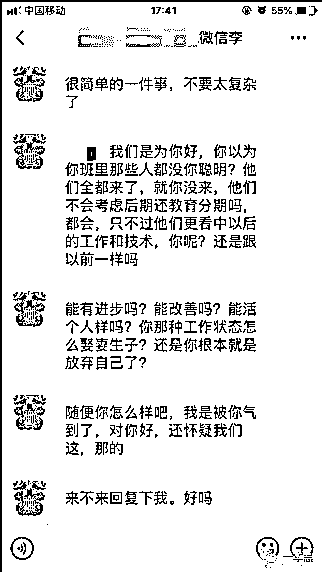
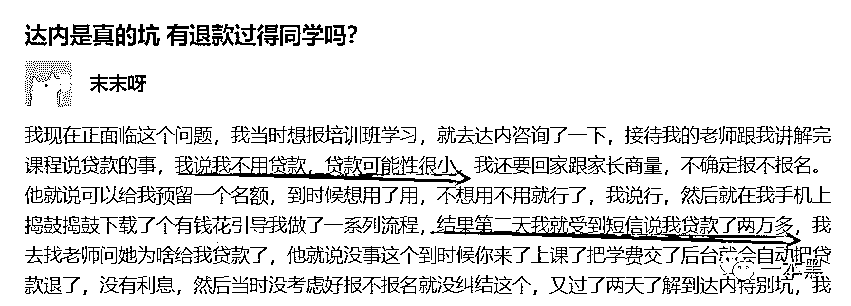
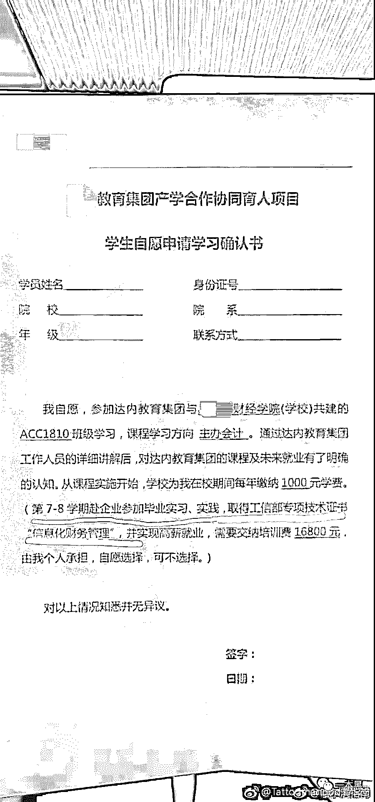
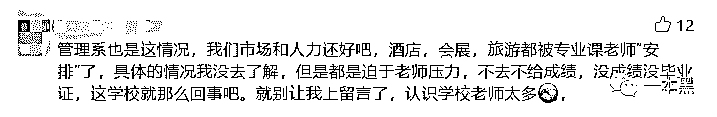
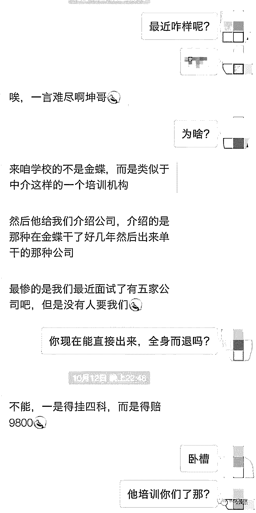
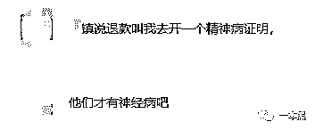
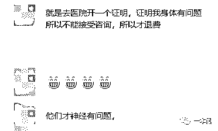

# 一年输出 2 百万“设计师”，培训机构如何掏空你的钱袋？

> 原文：[`mp.weixin.qq.com/s?__biz=MzU4ODAwNzUwMQ==&mid=2247484937&idx=1&sn=0fd8489d18780acc0cd0a9dd8a776a2a&chksm=fde2172bca959e3d301c417d8f0c06da6c64610c44a011c92a736261f6ebc5e11d1327f1607f&scene=27#wechat_redirect`](http://mp.weixin.qq.com/s?__biz=MzU4ODAwNzUwMQ==&mid=2247484937&idx=1&sn=0fd8489d18780acc0cd0a9dd8a776a2a&chksm=fde2172bca959e3d301c417d8f0c06da6c64610c44a011c92a736261f6ebc5e11d1327f1607f&scene=27#wechat_redirect)

“

本来是找工作的，却被忽悠着花钱参加了培训。

正常情况下应该是这样的：你去找工作，有些公司觉得你不适合，你就不去；有些公司觉得你合适，那你就多了一个 offer.

然而，也可能有这样的 HR：

“我们觉得你不行，但是你总体素质还不错，可以先参加培训，培训完上岗，月薪 15K.”

“你所在的行业决定了你的未来，现在大数据最火，现在开始转行也不晚啊”，当然，这里的大数据还可以换成已经凉凉的 UI……

这也就是我们常说的招转培。

文 | may

# 

**01** **常见套路**

常见的套路大概是这样的：利用 58 等招聘平台发布招聘信息，大都是类似文员、平面设计类的职位，并由此获取用户的联系方式。

更常见的方式是直接向招聘网站购买个人信息，然后打电话邀请面试。如果你压根儿没投过那个职位，却接到了面试邀请，大概率是遇到了骗子。

“他们的流程看上去很正规，先是打电话邀请面试，然后还会有短信提示确认面试时间，结果去了才发现是 XX 培训。”

“一开始就要求填写各类表格，然后是各类测试，甚至还有乐嘉的颜色性格测试，接下来就是面试。”

“面试的过程相当让人不适。问完你应聘的岗位后，各种灌输该岗位前景堪忧，与他们推荐的 UID 设计、计算机运维、JAVA 等他们公司的培训职位做对比，让你觉得你应聘的岗位很差劲，让你参加他们所谓的培训。”

除了贬低职位的前景，这类机构还擅长贬低个人，从你的能力到背景，以此打压，从心理上击垮你，并诱使你付款。

初出校门的毕业生，在就业压力下很容易进入这样的陷阱。

“完全就是太年轻，把社会想得太美好，才会中他们的圈套。他们面试的手法太成熟了，给你一种来这边学习出去之后工作会很美好的假象，想尽一切办法圈你进来。”

# 

**02 ****掏空钱袋**

一开始，培训机构会告诉你，说学费从工资里扣，但接着就会让你办理分期借贷。

培训机构一般会选择跟互联网金融机构合作，就算你经济拮据，也完全不用担心费用问题。而即便是你根本不缺钱，不需要贷款，也同样可能会背上债务。

二者之间互惠互利，团结合作，将高额的贷款压在初出校门的大学生身上。

“他们会跟你讲，学习期间的三到四个月间不用支付很高的学习费用，等到就业阶段才会提高每月所需支付的金额，这样十几个月的分期合算下来约 25000 元。”

“一开始看到那么高的金额当然会拒绝啊，他们就会一直灌输，只要你认真学习完，就会有不错的就业前景和职业发展，工资待遇和福利跟当前更是不可同日而语。”

“他们还会说跟很多公司有合作，保证就业。至于这种合作，你总不能因为用了 Office 办公软件，就说自己跟微软有长期合作关系吧。”

如果真的是名师教学，培训质量尚可，花点钱，真正提高自己能力，倒真的不是一件坏事。

但现实却是，教师质量参差不齐，质量难以保证。

每天都有很多人在那边面试，班级开了一个又一个。也不知道那些学 UID 毕业的出去是不是能做 UID，还是都去做什么。

毕竟课堂上老师都会让你各种包装自己，欺骗企业，说自己工作有多少年的经验。让你调查就业城市的情况，针对性的地根据就业城市情况制作自己的作品，为的就是后期求职，然而所谓的帮助就业也就是帮你去各个企业投投简历而已。

也就是说，花费的巨额投入，可能换来的只是一份伪造的简历，或者说伪造简历的能力。

推荐工作，包分配？不可能的。推荐的工作从招聘网站上来，能不能进全看你自己。如果不行，那就再去下一个啊。

在类似机构培训之后就业失败的比比皆是，大学生李文星的悲剧正是其中之一。在某培训机构接受四个月的 Java 培训之后，李文星仍然找不到满意的工作，改变人生的机会没有如期到来。

对用户而言，这是一个巨大的心理落差。“我花了两万多，就给我看这个？”

而在培训、咨询类行业中，人们往往要面对的一个问题是，到底值不值这个价？

在贴吧里，有人洗白说，我觉得自己最起码有了学习的动力。可这是我们花费巨资参加培训机构的目的吗？这是培训机构向我们承诺的价值吗？

宣传的时候说是包过，交钱之后就跟你说是培训班只是起辅助作用，关键还是靠自己。

当有学生质疑老师能力时，还会得到这样的答复：为什么别人都能过，就你过不了？或者，为什么别人就有效，就你不行？

上课技术不行，甩锅技巧倒真是天下第一。是不是说培训机构的教学质量是否有一个评价标准，是按照教师吹嘘的，还是按照学生抱怨的？

当然，我们不能说培训机构一无是处，其中肯定有靠谱的老师和教学，也肯定有学生从中受益，但我们不能让学生自己承担起辨别的责任。

# 

**03** **校企合作**

如果这些还只是部分大学生误入陷阱，那么高校与培训机构的合作则更令人心惊。

大学自身无法提供完善的教育，培养学生的一技之长，相反却要求学生额外付钱给培训机构进行职业培训，以提升学校的就业率。

来自东北某财经学院的爆料者称，从大二开始，他们就被要求与培训机构签约。

据称，XX 教育是教育部产教融合的项目指导，在大学校园中开设必修课程，如果拒绝签约，就会因为四门必修课挂科而无法毕业。 

学校强制大二学生签订合约，前两年的学费，名义上由学校代为支付。大四时，学生个人需要另交 16800 的培训费，安排到该机构培训。但往往都是培训完结束之后无法提供工作岗位，学生要自己去找工作。

而学校收集到足够的三方证明，提高学校就业率，为即将到来的评估做好准备。

同样的情况在往年也有发生。学校利用大公司诱惑，让学生去了所谓的"金蝶"中介机构。

# 

**04 ****维权艰难**

当控诉某个企业的非法行为时，就会有洗白者出来说：出发点是好的，就是被这些没有底线的人把整个行业弄得乌烟瘴气。

但如果一个行业良性发展，不可能仅仅因为几匹害群之马就成为公害。

高昂的收费，以及与之并不相称的教学质量，整个行业究竟是靠什么在维持？虚假营销，还是不断提高的教学质量？

往往在这样的骗局之后，维权将成为另一个的难关，这是咨询、培训类行业的共性。

“工商部门、聚投诉，反正只要能投诉的地方我都去了。”

如果你没有那么多精力，那就只能自认倒霉。而即便投诉成功，机构还会有各种各样的要求。

    

最好提出退款是因为“个人原因”，而不是因为咨询/培训机构本身的“不靠谱”。 

“不让我把退学的真实原因告诉同学，说什么怕怂恿同学退学，影响他们公司的经济利益什么，各种恶心人的操作”。

经过不懈的努力之后，终于投诉成功，这时机构会要求再次签订一个“保密协议”。也就是撤评，在今后不能再提起该机构的所作所为。

在百度上顺手一搜就能搜出不少负面新闻，为什么还会有人受骗呢？

在自媒体上，各种各样直戳人心的标题，就像保健品广告，不管是不是真的有病，总会让人觉得自己需要吃药。

《不自律的你，正慢慢毁掉你的人生》《你的同龄人，正在抛弃你》

从自媒体上看世界，仿佛每一个人都过得比你好，当然也可能是真的比你好。

各类知识付费走进生活，从生活方式到三天学会一项小工具，你总是在不知不觉间被“忽悠”着买了许多用不到的内容。

如果说“知识付费”许诺给你的是一个小小的改变，而培训机构却敢于许诺给你一个人生的重大转折。

面临改变人生的机会，谁又能不心动呢？

正是瞅准人们的这种心理，该类培训机构制造了一个完整的产业链条，每一个误入其中的人，总要被脱下一层皮。

在知乎问题 “培训班输出的 2 百万“码农”会对 IT 行业造成什么影响？”下，有这样一个答案：

我花一万八的学费，学的 java，最后进了美团，美团氛围特别好，就是送餐特别累。

在送餐送到我的项目经理跟就业老师手里时，他们的脸确实红成了猴屁股，而我也确实成了他们的笑柄，我决定要奋发图强。

所以，我现在成美团的电话销售了。

还原事实｜专扒黑产

微信 ID：darkinsider

知乎 一本黑

微博 一本黑 007

投稿、爆料、招聘、转载

请联系微信：chenchen_19940612

拒绝白嫖，请点好看