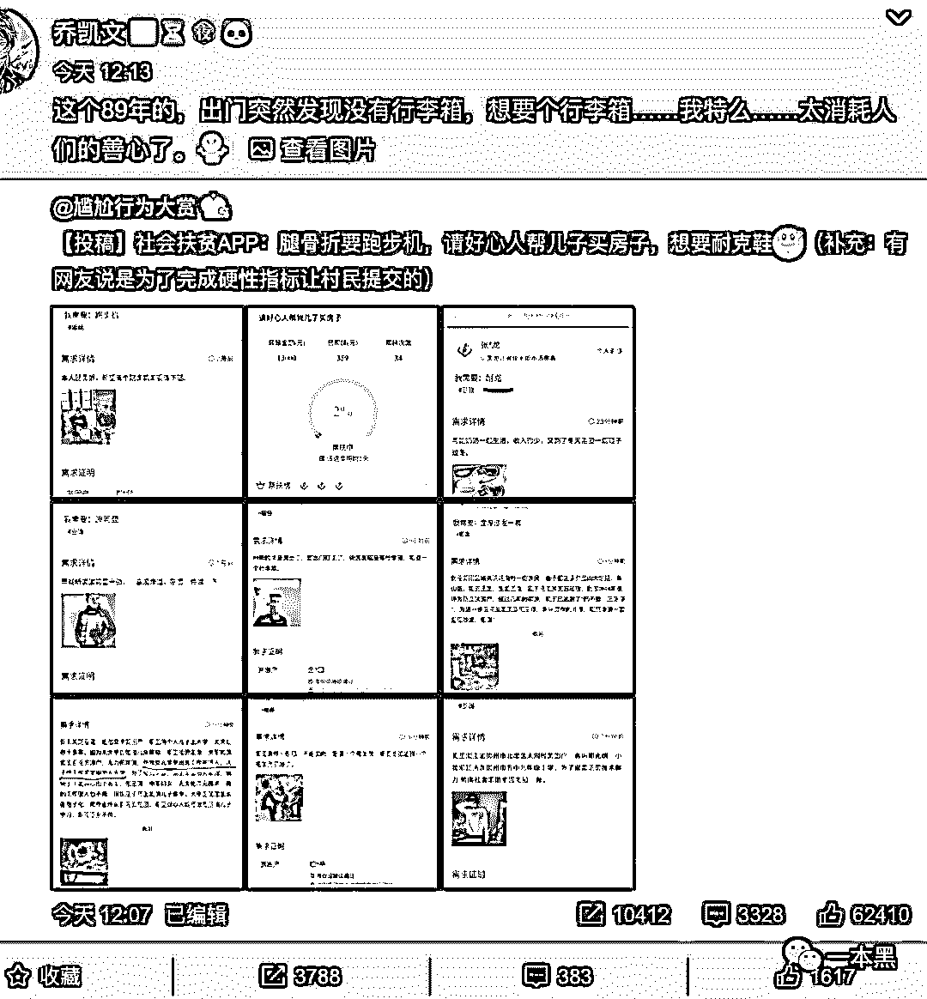
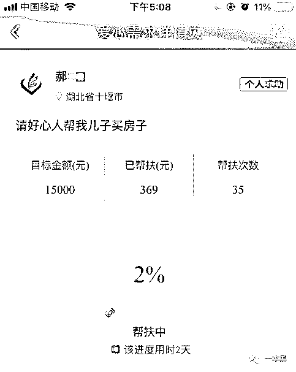
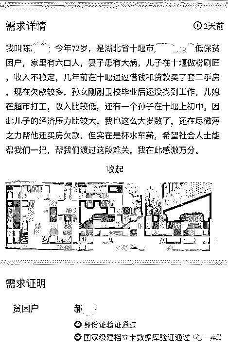
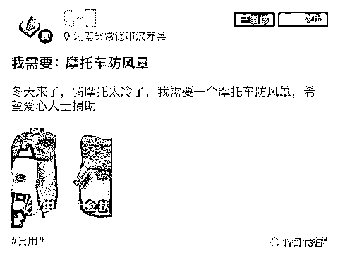
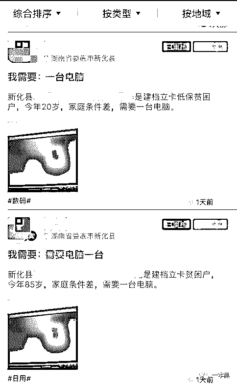
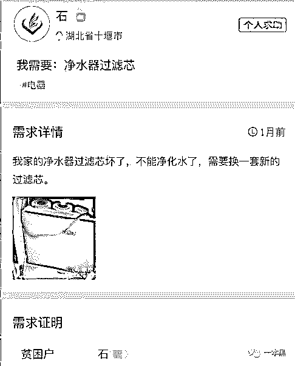
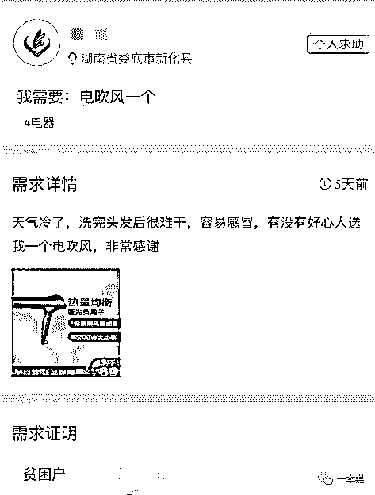
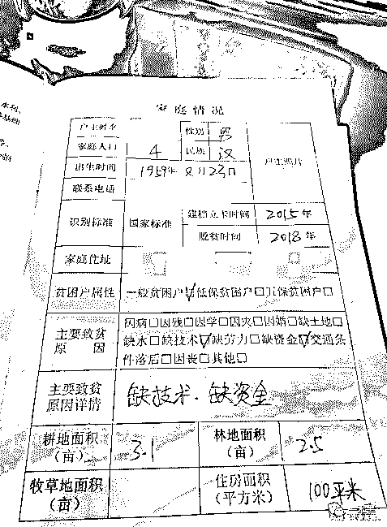
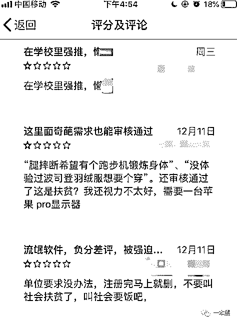
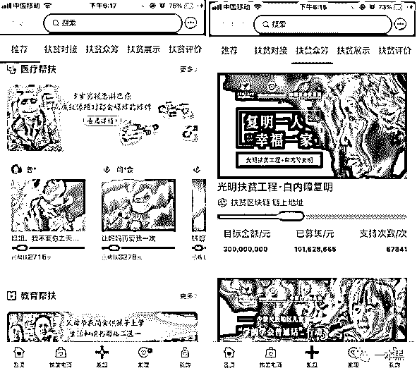

# 扶贫 App 里“众筹”买房？穷疯了吧

> 原文：[`mp.weixin.qq.com/s?__biz=MzU4ODAwNzUwMQ==&mid=2247486909&idx=1&sn=1b47a3d2c37cae47c7d4b11db3278856&chksm=fde21c9fca959589999617f1ae34e5d75ece9ecbebf6abc84d876d7f1cdb965affbf662cfa80&scene=27#wechat_redirect`](http://mp.weixin.qq.com/s?__biz=MzU4ODAwNzUwMQ==&mid=2247486909&idx=1&sn=1b47a3d2c37cae47c7d4b11db3278856&chksm=fde21c9fca959589999617f1ae34e5d75ece9ecbebf6abc84d876d7f1cdb965affbf662cfa80&scene=27#wechat_redirect)

 【黑话连篇】

该栏目更多的是揭露事件或对事件的看法，以达到让人精神升华的目的。

* * *

12 月 17 日睡前，微博爆出春蕾计划专款被挪用，原本是为资助贫困女童设置的基金，结果却被发现使用者中存在男童。虽然都是做慈善，但是“专款专用”这个词不是白叫的。12 月 18 号，春蕾计划的事还没过呢，又看到有博主爆出社会扶贫 App 存在使用不当的问题。
从名字我们就能知道这个 App 的存在是为了对接社会爱心人士与贫困人群，帮助贫困人群解决暂时性资金困难，而 App 的定位也同样写着爱心公益众筹帮扶平台。扶贫是件好事，毕竟人人奔小康，是全社会共同的奋斗目标。然而，不知何时开始，众筹已经变成了一些人暴富的手段，想买车造个假病例去众筹，想买奢侈品造个假病例去众筹。如今连爱心扶贫也没能例外，有人正在试图把扶贫变成许愿池。该博主爆料在社会扶贫 App 中，有人以骨折要买跑步机为由发起众筹，希望大家能帮他完成这个目标。也有网友说，这是为了完成硬性指标让村民提交的。什么时候，扶贫是这样的了？爱心扶贫是以浪费国家资源、消费众人爱心为代价？扶贫不是为了脱贫而是为了享受生活？甚至是为了完成指标？**众筹扶贫还房贷**社会扶贫 App 共有以下几个板块【爱心帮扶】【帮扶电商】【扶贫众筹】【扶贫评价】【扶贫展示】【排行榜】。从 App 数据展示来看，目前已成功对接 459 万个需求。倘若每一个需求都落到实处，每一个贫困家庭的困难都有人帮助，那自然是一件好事。但，在这个 App 里，我看到了很多让人匪夷所思的需求。身体残疾，需要帮助，不论是钱是物，只要合理，我们都可以尽力帮助。家庭贫困，无力支撑孩子学费，我们当然应该伸出援助之手，不使其被拒于知识门外。可是，我们是否需要帮助一个家庭去买跑步机呢？在该 App 上我并没有搜到上图中众筹购买跑步机的需求，或许是事件被公开在微博，有舆论压力，又或者是当地村委会/平台也觉得该需求不妥当，做了下架处理。具体原因不得而知，但它的确存在了两天之久。虽然买跑步机的需求不见了，但我发现了更多让人目瞪口呆的需求，比如众筹给孩子还房贷的。在湖北十堰市某村，有村民发布需求，称自己是低保贫困户。儿子在几年前借款了在十堰买了套二手房，至今未还清借款，儿媳在超市打工，工资较低，孙子尚在读初中，孙女今年卫校毕业还没找到工作。而自己至今还在外工作帮助儿子还欠款，希望大家能献出绵薄之力帮助他们一家渡过难关。   ***不知为何，证明里的贫困户名字与需求发起人的名字不同，连姓氏都不同***照片里还晒出了他们一家在村里的一栋两层独立民房。？？？这算哪门子难关，现在的年轻社畜们，别说还房贷了，房子首付都付不起。可是还有人在筹钱帮自家还房贷。这样的扶贫是否合理？倘若在家人都有工作的情况下，还要向外界众筹还房贷，那我们明天是否也可以众筹一个首付去买房？北漂一族每天花三四个小时通勤，辛苦一天回到家都是深夜，别说在北京安家，就算是在隔壁的天津也不一定能买得起一套一居室。深漂就更不说了，人均十平米的城中村是多少年轻人的劳累一天之后“温暖的家”。这又让我想起我们大学班有个同学，在毕业那年到处找人借钱，三五百也可，一两千更好，就这么借遍全班，甚至隔壁班也不乏被借钱的。如今多年过去，还钱？从没听他说过，但人家早在毕业那年，通过班级众筹的方式在老家买下了一套房子。这事还真挺讽刺，那会大家都是刚毕业出来工作，扣扣索索每月省点钱，出于同学情谊借了。结果人在买了房之后一句感谢没有，还玩失踪。这同样是利用他人信任实现买房自由的最佳例证。除了买房，我还在该 App 上看到了要众筹买摩托车防风罩的。理由是冬天来了，骑摩托车太冷，希望好心人士能给他捐一个。没错，图片还是从淘宝上扣下来的。凭借着这张照片，我轻易在淘宝搜到了同款，加绒加厚款仅需 30 块，如需送手套，再加 3 元。 不止如此，我还看了要吹风机的，要电烤箱、要儿童积木，以及 30 岁爱好诗词的母亲因孩子上学开支太大要众筹买电脑的.....就在买电脑这一项需求下，我发现了一个更有意思的事。娄底市新化县有人说自己现年 20 岁，因家贫需众筹买电脑，紧接着下一条：同村一 85 岁老人因家贫，仍需众筹买电脑。 村级审核人都为同一人。逗我呢？敢情现在是互联网时代，下至刚会走，上至九十九，人人都需要一台电脑才能连接地球村吗？是村里没通网还是没手机咋地？手机不能上网冲浪吗？甚至还有指定要买平板电脑来提高学习成绩的职高生。有人要电脑，那就一定有人要电脑桌。电脑和电脑桌就像一对好朋友，要两个在一起才更好呢。是真的把扶贫 APP 当许愿池了吗？家里净水器滤芯坏了，都要帮扶更换的。都用上净水器了，还买不起滤芯呐。   这不是和你家养了头猪，说过年了要杀猪吃肉，无奈家贫买不起刀要人送，一个意思嘛。众生魔幻相，扶贫 App 里见一半。**众筹一支笔算扶贫吗？**当我逛了一圈该 App，我不禁陷入沉思，扶贫到底应该扶谁？这个社会，到底是朝九晚五蹲在格子间的社畜穷，还是独栋大房还不起房贷、换不起滤芯的朋友更穷。扶贫这个事是好事，扶贫的效果也的确很突出。小时候，我们村最好的家电是冰箱、彩电，汽车绝对是稀罕物件。但如今，逢年过节村里甚至会堵车。大部分人逐渐离开村庄，去镇上置房，家里条件更好点的，就直接去城里了，毕竟教育、医疗资源更好。都说中国人勤奋，这的确和每个人的勤劳分不开，但是国家的扶贫政策在其中扮演的是领路人的工作，方向对了，路才能对。这才是最关键的。我理解中的扶贫是什么？是架桥修路，是各种帮助农户发展养殖、畜牧等产业的补贴，是给贫困低保户的定期资助，是各种专项资金，专款专用。是钱用到实处，力用在准处。虽说现在我们已经不再那么穷，不是人人都需要国家补给的粮米油盐才能活下去。提高人民的生活幸福指数是新时代扶贫的新内涵、新方向，但众筹买跑步机和摩托车挡风罩，我想这尚且不属于扶贫的内容，何况是扶贫款还房贷。在 App 上，你仔细观察会发现一个很有趣的现象，很多人的需求根本达不到需要扶贫的标准，比如一支笔、一个书包、一个工具箱、一个热水壶、几个暖宝宝、一袋洗衣粉。从迫切程度上来看，这些都是日常必需品，很多人都写着急需。但其中一些关于急需用笔的需求早在 12 月 1 号就已发布，至今仍未对接成功，也不知道孩子这大半个月里是拿什么写的字。还有那些要暖宝宝和电暖炉的，冬天早已来临，怕是等到需求对接成功，东西寄到的时候春天都来了。那时这个需求算是对接成功了吗？毕竟雪中送炭才叫送温暖，夏日送暖炉，是锦上添花吗？最重要的是，那些人真的缺这一支笔吗？一个书包吗？几块钱的支出是真的无法负担吗？从提交的证实材料来看，的确都是村民的真实信息，甚至包括身份证号码、家庭住址、家人成员，而且是由村委实名证明。这些信息都是真实可信的，但这些需求却都的确让人摸不着头脑，这是为何呢？

* * *

想要使用该款 App 必须实名，而使用对象只有两种，贫苦户和驻村干部。我搜了一下啥是驻村干部，看了下解释，说是专门在村里蹲点，开展调研、收集村民困难，帮村里出点子解决问题的干部，由于长期驻村，又叫驻村干部。新闻报道说在各位驻村干部的手把手教学之下，村民们学会了使用这个 App，直接在网上发布自己的真实诉求。况且众筹这个方式正流行，社会上的爱心资金也能专门对接到位，一切都是实名制。App 还是由 中国扶贫志愿服务促进会开发，国家级背景，靠谱。为了扩大这个 App 在民间的影响力，甚至一些大学生也纷纷下载，主动帮助做宣传。作为社会主义的接班人，有一分热发一分光，应该的。虽然 App 的总体评分只有 2.1 分，但没事，这可能是由于使用基数大造成的。毕竟被强迫，再好的东西，体验也会打折扣。扶贫是好事，但如何落到实处，需要好好把关。希望有一天众筹不再消费大众的爱心，扶贫能真正落在准处。扶贫不是造贫，社会扶贫不是社会要饭。提高公民素质，加强审核把关，咱们还得继续进步。其实除了上面这些奇葩需求，扶贫 App 里更多的是等待帮助的真实需求，比如缺钱救命的重症患者以及全国各地的贫困学子们。       在抨击不良现象的同时，我们也不要忘记对真正需要帮助的人伸出援助之手，让更多人看见生的希望。扶贫落到实地应该是使每一个老百姓都能亲自发声，而社会扶贫 App 的初衷也正是如此，通过 App 成功完成线上帮扶，走出困境才是大部分人的真实写照。平台暂时的不完美需要时间去改善，但前进的脚步不应该停下，我们的善举不应该止于此。在反思的同时我们或许可以尽力去帮助这个 App 的进步，评论也好，推广也好，只要能实现作用最大化。混乱的背后是更多的真实，这需要我们去发现、去分辨。去看看 App 里真实的部分，去帮助那些身患重症的人，去努力让我们的世界变得更美好。愤怒不能解决问题，盲目抨击只会煽动不安定的情绪。因为片刻的黑暗总是不能阻挡光明的脚步，对吧。大家好，我是老黑。
早年做过技术，也做过自由调查记者，曾协助警方打掉产值上亿的色情网站、也干掉过骗了无数人的非法集资。之所以写【一本黑】公众号，是想用最简单的语言，告诉大家，这个世界上真的存在魔鬼，不然你没法理解人性。如果你想认识我，不妨加我微信：**ofcourse9528****推荐阅读：**[私密社群，快上车](http://mp.weixin.qq.com/s?__biz=MzU4ODAwNzUwMQ==&mid=2247486383&idx=2&sn=0821d0bff33285d235b2e1b9af9a9e27&chksm=fde21a8dca95939b496421a2177f83d8022e5a25ce95ea8b2929b17b26fe95aeb5ca902b722a&scene=21#wechat_redirect)[心灵培训才是当代智商收割机的 top1](http://mp.weixin.qq.com/s?__biz=MzU4ODAwNzUwMQ==&mid=2247486873&idx=1&sn=5f0a2b851c0f036379c759c54086f055&chksm=fde21cbbca9595ad9353ad10160aebd04399ae7bff000dc4e7894538950c385282d193730121&scene=21#wechat_redirect)[暴富野路子：](http://mp.weixin.qq.com/s?__biz=MzU4ODAwNzUwMQ==&mid=2247486896&idx=1&sn=dbfeed8f3e0b05b61e34b070686a206c&chksm=fde21c92ca95958427b7d9d0fdebb5e6e934205e7e53f1e1677995743f0dafb63b165a1f25b6&scene=21#wechat_redirect)[借足 100 万，去学成功学](http://mp.weixin.qq.com/s?__biz=MzU4ODAwNzUwMQ==&mid=2247486896&idx=1&sn=dbfeed8f3e0b05b61e34b070686a206c&chksm=fde21c92ca95958427b7d9d0fdebb5e6e934205e7e53f1e1677995743f0dafb63b165a1f25b6&scene=21#wechat_redirect)