# 心灵培训才是当代智商收割机的 top1

> 原文：[`mp.weixin.qq.com/s?__biz=MzU4ODAwNzUwMQ==&mid=2247486873&idx=1&sn=5f0a2b851c0f036379c759c54086f055&chksm=fde21cbbca9595ad9353ad10160aebd04399ae7bff000dc4e7894538950c385282d193730121&scene=27#wechat_redirect`](http://mp.weixin.qq.com/s?__biz=MzU4ODAwNzUwMQ==&mid=2247486873&idx=1&sn=5f0a2b851c0f036379c759c54086f055&chksm=fde21cbbca9595ad9353ad10160aebd04399ae7bff000dc4e7894538950c385282d193730121&scene=27#wechat_redirect)

【黑话连篇】

该栏目更多的是揭露事件或对事件的看法，以达到让人精神升华的目的。

* * *

前几天老黑给我发了一个视频，视频标题写着 “XX 企业魂培训”、“阴阳舞”、“交钱 40 万”，一堆看起来很是了不得的字眼。结果我百度完才发现，这个东西 2017 年就因为传销被警方一锅端了。老黑这消息真是流通的可够慢的，但他非嘴硬，说传销打了那么多年都没打完，这个也不可能消失的，让我再去找找看。你猜怎么着？还真被他说对了，这玩意的确没有消失，它换马甲了。虽然当年那场培训，相关工作人员最后都跟警察叔叔一起去了警局。背后的公司也都已注销，网站关停。然而......      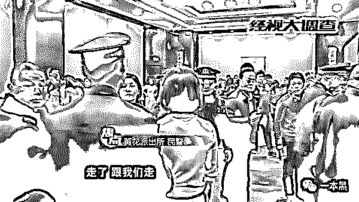**打着培训旗号的传销活动**然而，我前两天百度的时候，又发现了他们的培训课程。查了查发现，诶，母公司还在继续营业呢。原以为这只是祖国大陆的原生玩意，后来才晓得人家也是飘洋过海来的。所谓的“企业魂”培训说是精神培训，本质还是通过传销的方式拉学员入伙，各种“阴阳舞”、“重返 3 岁”只是宣传的噱头。1380 元一期的培训课，到了现场之后才发现，POS 机的滴滴声一直没停过。只要你人去了，导师就有一百种方法从你口袋里掏钱，什么高阶培训、加盟代理都是常规操作。费用从几千到几十万不等，具体得看你卡里有多少钱。不过这都是以前的定价了，现在不一样，就算你卡里没钱也没关系，他们还可以让你去贷款参加培训。钱财乃是身外之物，只有存在脑海里的知识才是一个人真正的财富。懂？企业魂背后的公司叫心灵海国际教育集团，一般叫集团，还要加上国际的，其实是想说他们在海内外有多个分部，忽悠的人数一般十万起步。心灵海自然也不例外，开头说它漂洋过海来的，只不过这个海有点窄，只是飘过了台湾海峡而已。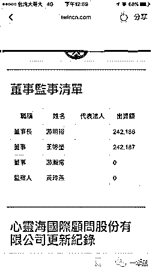心灵海的总部位于台北市忠孝东路，公司创立至今已近 30 年，是一家历史悠久的培训机构。旗下还有盖娅生活国际、生命大师咨询顾问等多个品牌。创始人是一对夫妻，据说深谙心灵之道，他们是台湾地区比较有名的富商，曾在 2018 年，因为儿子开豪车撞死人上过台湾热搜。但这个事情很有意思，死者家属帮求情，学员表示继续支持。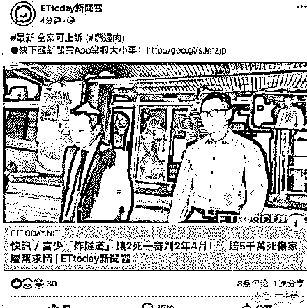在台湾东森电视台的采访中，我发现【老板儿子开车撞死人】这种事对于企业声誉居然没有丝毫影响，学员们表示“出现这种事情大家都不想的啦，事情一码归一码。课程我还是会照旧上，我觉得很有收获。企业是好企业，老师是好老师。”企业魂一类课程，台湾和大陆的内容差不多，但是收费就差了十万八千里。怎么说呢，从前有个韩国明星叫张娜拉，她曾经说过，“每当我没钱的时候，就会去中国工作一段时间 ”。emmmmm，心灵海也是这么干的。他们的课程在台湾售价是 9000 新台币，折合成人民币接近 2000，老学员还能打五折，也就是 7 天的培训课，只收 1000 块还包餐。这没问题，行业培训差不多都是这个价。    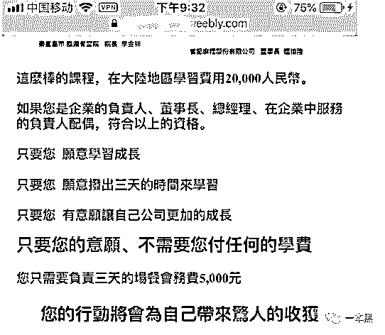但是来到大陆就不一样了，大陆要卖 20000 人民币，价格直接翻了近 20 倍，而且这还是 18 年的定价。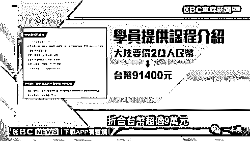所有的课程都有进阶，一阶觉醒，二阶领袖，三阶使命，和升级打怪似的。钱给的越多 课上的越多，你的人生就越辉煌。      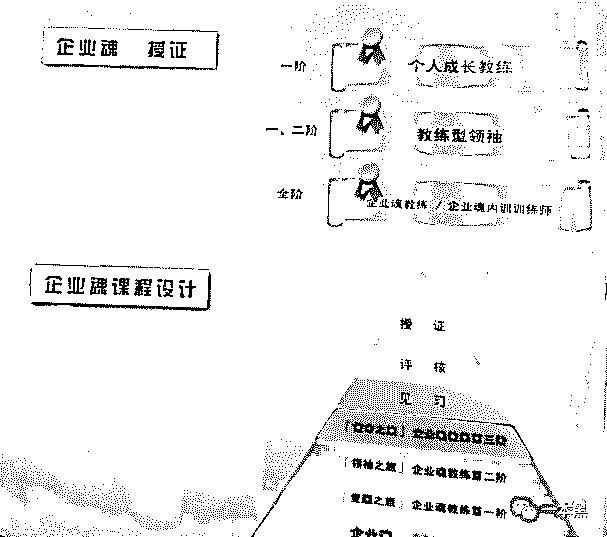这就和中世纪欧洲教会贩卖赎罪券一个套路，“只要买赎罪券的钱币落进钱柜叮当一响，你的灵魂就能从地狱直飞天堂。”只要你参加了这个培训课，你就一定能找到自己的路。糟糕的亲子关系能够破镜重圆；坎坷的职场道路会变得一帆风顺；穷困潦倒的立马日进斗金；病痛缠身的即刻健步如飞......真是有意思。**心灵培训是个大杂烩**心灵培训到底是个啥，科学？还是迷信？为什么参加过的人都觉得自己受益匪浅，即使自己复盘的时候也说不出个 123，但就是觉得这钱花的值？这类课程在台湾叫做心灵培训/心灵咨询，大陆更喜欢用领导力、XX 觉醒、XX 先知、XX 创造，来命名，本质都是一样的。想要了解更具体的内容，这个时候你可以上某度搜一下“灵修”，你会看到水晶排列、宇宙能量、玛雅预言、灵性催眠、爆破呼吸等一堆神奇又好玩的词汇。我在百度问答区发现了一部分人对【企业魂】这门培训课程给予了高度赞赏，即使这个培训早就因为传销被一锅端了。两年后却仍然还能看到好评，暖暖奇迹啊。

> *你不懂是因为你思维境界低，高度不够；**你觉得龌龊是因为你心里龌龊，淫者见淫；**该死的卧底记者，霍霍了这么好的一门课程，阻挡了无数家庭的成长。*

       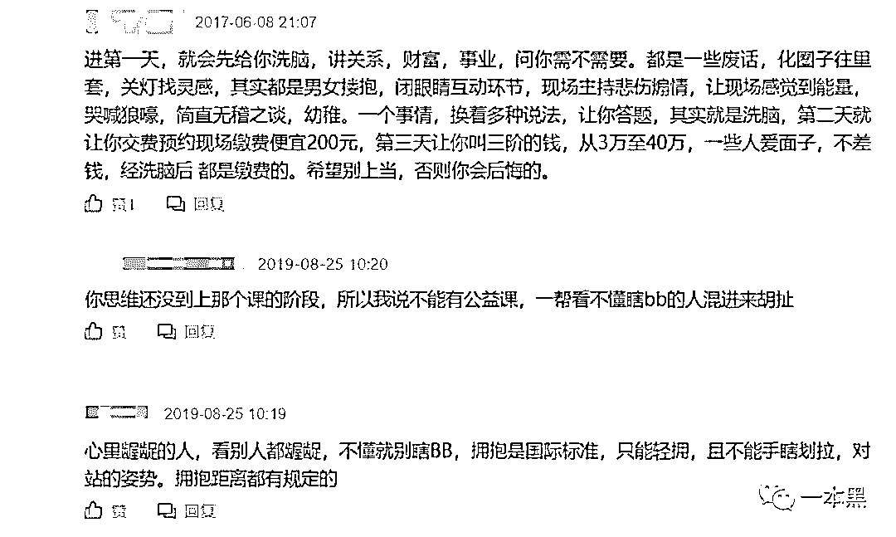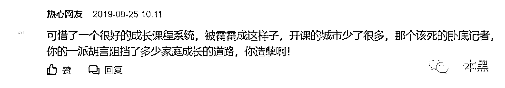心灵培训总是强调开发身体潜能，增强个人意识，必要的时候还会拿量子力学和宇宙能量出来晃晃。遇事不决，量子力学。解释不通，穿越时空。脑洞不够，平行宇宙。优秀优秀，真是优秀。培训的导师大多声称自己是资深心理咨询师，甚至称此类培训也是建立在心理学的基础上，但实际上这只是一场“大型团体觉醒培训”（LGAT）。说白了就是一场大型的精神洗脑，玩的是传销最擅长的东西。此类培训机构，每个都有自己的一套理论，有的号称能帮助用户实现身体的能量流动，从而掌控自己的人生；有的号称从宇宙中吸收日月精华以达到人生的永恒。不管从哪种渠道吸收能量，媒介都只有一个，那就是钱。

[`v.qq.com/iframe/preview.html?width=500&height=375&auto=0&vid=v0021c6rgkk`](https://v.qq.com/iframe/preview.html?width=500&height=375&auto=0&vid=v0021c6rgkk)

*视频来自新京报*比如视频中的所说的创造丰盛系列培训，交 5 万就成会员，300 万成督导，800 万成校长，3000 万就可以变成集团的心灵导师。进阶都不要你掌握多少门技能，只要给钱就行。就靠着这种鬼话，这个机构轻轻松松就收了 10 亿的培训费。（最后还是因为传销被端了）要不总有人说，中国人不缺钱呢。这就是最好的例证。     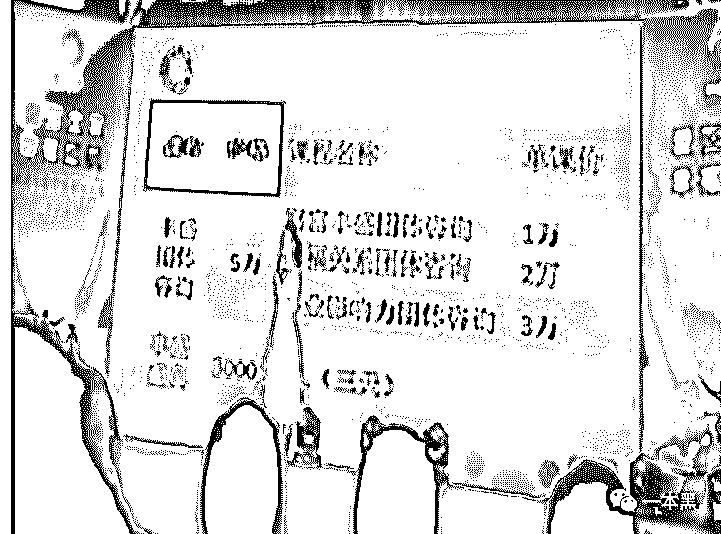*创造丰盛一堂课最低 1 万*在知乎上一个“为何心灵培训有如此多狂热信徒？”的问答下，北京大学的一个心理学硕士给出了一个比较客观理性的回答：市面上所谓的心灵培训其实都是心理学与伪科学的大杂烩。里面的各种观念是对科学、社会学、心理学、伦理学的偷换概念和扭曲事实。所谓的觉醒培训系列课程实际上是利用团体心理治疗的技术以及思维控制方法，包括冥想、催眠、神经语言程式（又叫 NLP，是一种不被主流承认的心理学）等。过程大抵是先让你回忆人生中最痛苦最糟糕的事情，并在旁添油加醋，让你觉得自己的人生差劲极了。之后在各位导师的辅导之下，你又觉得人生也并不是那么糟糕，一切都有重来的机会。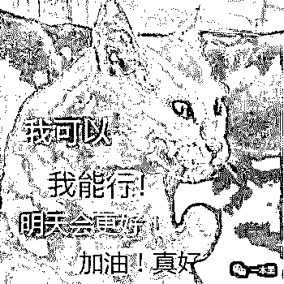丢掉负面的自己，获得积极的自己。抛弃过往的自己，迎接新生的自己。他们说，这叫重生。重生之后就开始造梦，就和李阳英语一样，强调说话声音越大越接近理想。不管你想要的是什么，大声说出来就等于能实现。听起来这和普通的励志教育没啥两样，但它太过于狂热了，脱离现实只会喊口号的梦想就是空中楼阁。人人都有梦，但实现梦想的人都不是靠吼叫和做梦，而是数年的耕耘和努力。可是这类培训从来只会造梦，却不教如何人脚踏实地去实现梦。人人造梦，人人信梦。现实生活越是一塌糊涂，梦想越是宏大。一个虚幻的、美丽的、看起来坚不可摧的未来，仿佛是他们通往美丽新世界的唯一捷径。还有种风靡一时的培训方法叫“EST 训练法”，就是先限制学员的人身自由，并且用言语对他们进行侮辱，什么傻 X、垃圾、废物之类随口就来。据说这样做是为了帮学员清除心里那些不堪的的想法，消除内心的恶，同样是为了让他们获得新生。这类培训擅长通过打鸡血，卖希望的方式，达到敛财的目的。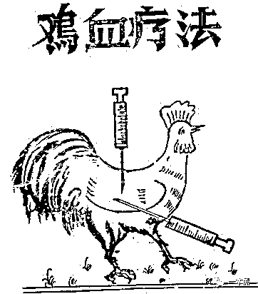而 EST 培训法、神经语言程式（NLP）至今仍然争议很大，部分人在参加 EST 培训后出现了应激反应，比如神经症发作，有的人对于现实的判断能力出现错误。说人话就是脱离现实，分不清现实和虚幻。参加培训的人，回想起来总觉得自己受益良多，但现实生活却依然没有任何改变。小职员还是没有变老板，病痛缠身的也没能健步如飞。可下一次再开课，依然有人踊跃报名。因为人要“活在当下”，毕竟 “千金难买我开心”。不知道这样讲，你们能不能理解。你可以理解成玄学、智商税或者其他形而上的东西都成，反正看不见摸不着，也没有具体的作用，但用过都说好。

> *“我在接触了**丰盛之后，没吃药，没打针，糖尿病、心脏病全没了。”*这是一个参加完培训的学员，她的亲身体验。摊手~~

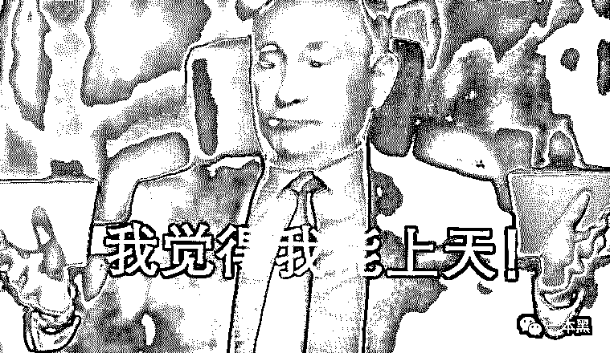总之，玄之又玄。

* * *

这些都不是什么新东西，归根结底都涉及传销。从面世至今，传销发展了几十年，内核还是没有变化，只是套路越来越多。但不管是哪种骗局和幌子都经不起推敲，只要你不跟着他们的思路走。一本黑的后台，还是时不时就收到一些读者的爆料，说自己的家人朋友，有的被此类培训洗脑，说要筹钱去上课，或者卖房做代理。还有的从传销窝里摸爬滚打之后逃出来，身上的钱财被剥了个干净，唯一庆幸的是人还在。马上就 2020 年了，被 1024 阳光工程骗的还是大有人在。传销，国家一直在打，但一直没法根除，因为它会变形，会伪装，会自我繁殖。只要你信了传销，身边总会有人被你拉扯进去。各种打着灵修旗号的培训、各种玄之又玄的养生产品以及五花八门的电商 App，都是通过拉人头的方式发展壮大，通过层级代理的方式赚取利润。其实我们也写过很多传销盘、资金盘，只是文章刚发出来总有人说我们满嘴胡言见不得人赚钱，比如趣步，比如影视版权投资。等过几个月再看，那些所谓的新模式、新机遇，抓的被抓，跑路的跑路，倒闭的倒闭。但你永远叫不醒一个装睡的人，没有当头棒喝，或许暴富的美梦依然触手可及。我命由我不由天，是句好话。但盲目自信，不是件好事。一个人的潜能可以开发，可以提升，但不是无限的。我们的社会发烧了，人人都想赚快钱，人人都想一帆风顺，于是各种骗局应势而生。互联网上一地鸡毛，各种赚钱神话相继破灭。要知道风口少有，而套路常新。*大家好，我是老黑。*
*早年做过技术，也做过自由调查记者，曾协助警方打掉产值上亿的色情网站、也干掉过骗了无数人的非法集资。**之所以写【一本黑】公众号，是想用最简单的语言，告诉大家，这个世界上真的存在魔鬼，不然你没法理解人性。**如果你想认识我，不妨加我微信：****ofcourse9528***

**推荐阅读：**

[私密社群，快上车](http://mp.weixin.qq.com/s?__biz=MzU4ODAwNzUwMQ==&mid=2247486383&idx=2&sn=0821d0bff33285d235b2e1b9af9a9e27&chksm=fde21a8dca95939b496421a2177f83d8022e5a25ce95ea8b2929b17b26fe95aeb5ca902b722a&scene=21#wechat_redirect)

[9000 块买手机号改运？算命大师治不了穷病](http://mp.weixin.qq.com/s?__biz=MzU4ODAwNzUwMQ==&mid=2247486806&idx=1&sn=92574d152815f74887ba342ee093763e&chksm=fde21c74ca9595628844c3a7e292c3d1bcebfab33f6d24dd49ba1842427fc2ef9bd3e5f850b6&scene=21#wechat_redirect)

[F**K , PUA](http://mp.weixin.qq.com/s?__biz=MzU4ODAwNzUwMQ==&mid=2247486823&idx=1&sn=96cbe9b197102cccb48198b33fe3993d&chksm=fde21c45ca9595530156202cabb46d4b06d0f8a7bc315d33e2227b0e8b6803acc8de34ad5d20&scene=21#wechat_redirect)