# 21 岁日本女星惨遭猥亵，只因自拍瞳孔倒影暴露住址？

> 原文：[`mp.weixin.qq.com/s?__biz=MzU4ODAwNzUwMQ==&mid=2247486655&idx=1&sn=e73f91d91b01f02a800b3e7603b8a314&chksm=fde21d9dca95948bf16401f41d0d01907e126deacb31f32293850b134c366b2aa85bc403c7d8&scene=27#wechat_redirect`](http://mp.weixin.qq.com/s?__biz=MzU4ODAwNzUwMQ==&mid=2247486655&idx=1&sn=e73f91d91b01f02a800b3e7603b8a314&chksm=fde21d9dca95948bf16401f41d0d01907e126deacb31f32293850b134c366b2aa85bc403c7d8&scene=27#wechat_redirect)

不管你是才男俊女还是相貌平平，在朋友圈中点赞最高的永远都是自拍照，特别是到了放假期间，通过朋友圈你可以感受全世界的爱。
各位在各大社交网站晒图享受赞誉的同时，跟随着有一些风险也悄悄到来。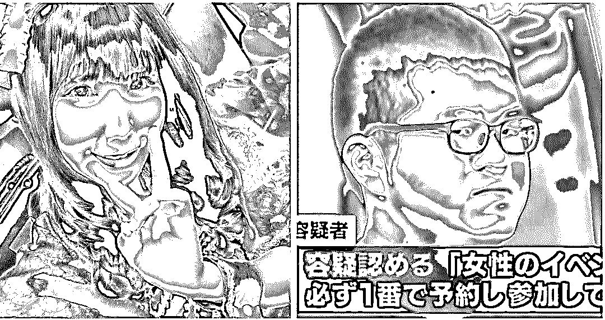前一段时间有一个日本宅男干了一票大的，通过女偶像的晒图发现了明星的家庭住址，然后这名宅男竟然循着地址去猥亵了女明星...文章后面会给大家详细介绍这名宅男是如何找到女星家庭地址，先来给大家看看一些低段位的泄露手段。**01.照片中信息是怎样出卖你的？****我先给大家举个例子。****前一段时间我在美国西海岸自驾，在海边碰到了一群人在冲浪，不是普通的冲浪是滑翔伞冲浪，近距离看到这项运动感到很震撼，于是我在某个社交网站分享了拍的照片。****就是下面这张照片：****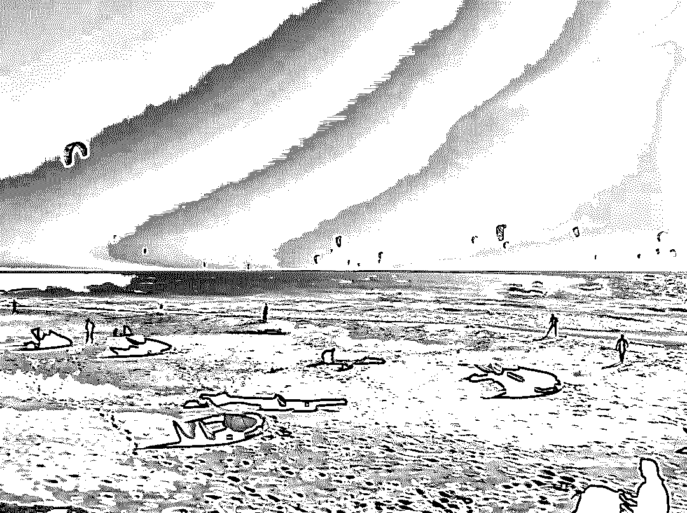****过了一会，有一个读者在微信中联系到了我：****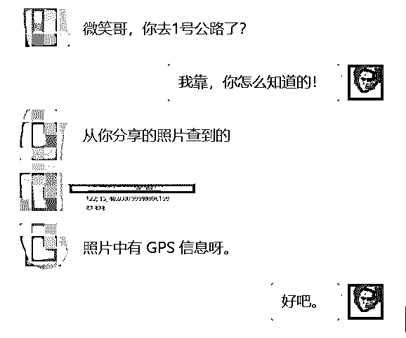****然后这位读者再使用谷歌地图，输入图片中的相关 GPS 信息后，就可以找到我在哪个地方拍摄的照片。****当然这个读者没有什么恶意，只是单纯的和我聊了几句而已，但试想一下如果哪个妹子平时爱晒图，如果别有用心的人拿到其中的信息可能会发什么？******02.去掉 GPS 的照片也可能泄密********大家千万不要以为在照片中去掉 GPS 信息就万事大吉了，可能自己非常普通的一张自拍照就可以被人分析出你家的地址。********再给大家找一个案例，有一个网友在网上上传了一张私密照片（下图），就有人通过这个照片找到了这位姑娘的家庭住址。********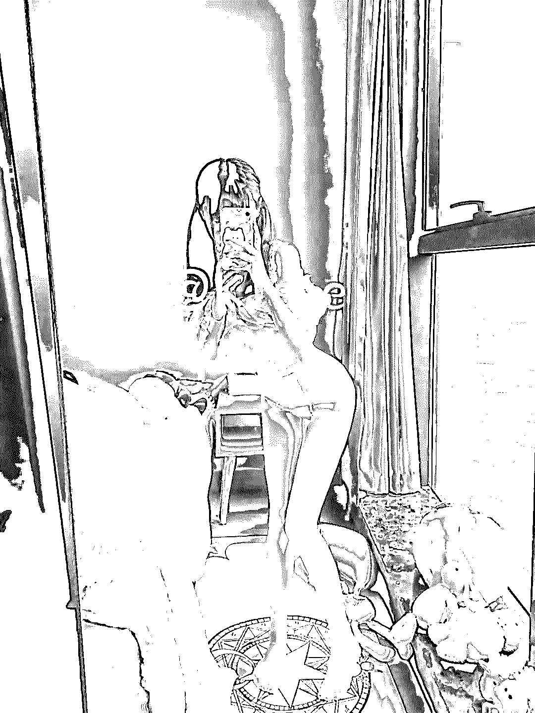********具体怎么操作呢，把这张照片放大可以看到右侧的外景信息。********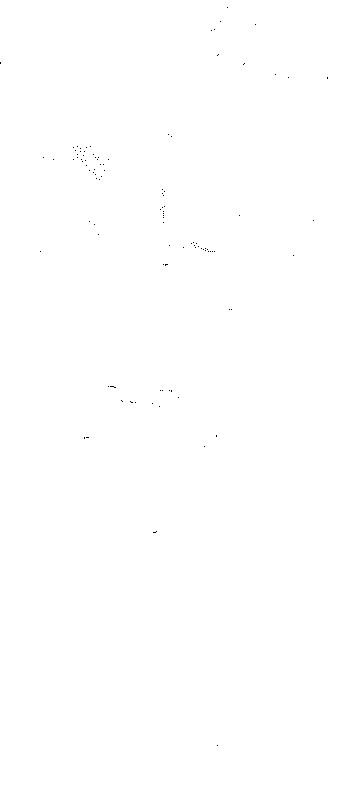********翻转过来可以看到：天汽车城****************接下来使用百度查询一下国内都有哪些叫 XX 天汽车城。****************这是百度的一个结果，排在第一个是长沙的。我们查看一下实景地图中长沙河西蓝天汽车城的相关景貌。********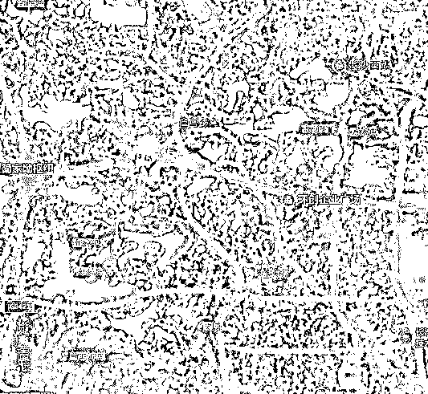********这个在地图上看周围都是绿的，而照片背景是大片建筑，所以排除。********照片中建筑比较多，应该是比较发达的地区或者市区，那些没听过的小县城基本可以排除。********再使用 360 搜索“天汽车城”，发现第一个是泉州海天汽车城。********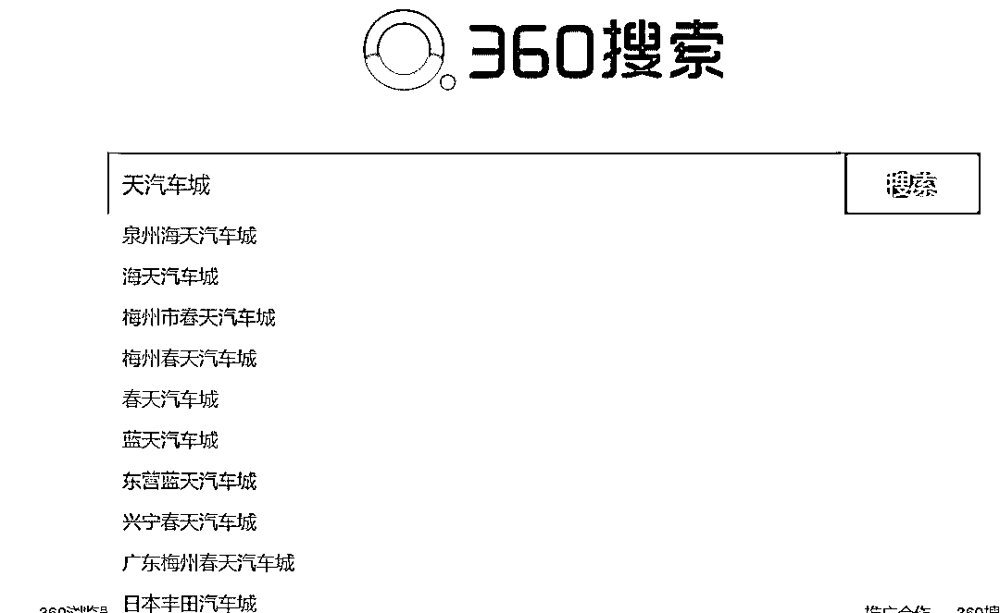********再使用地图看一下********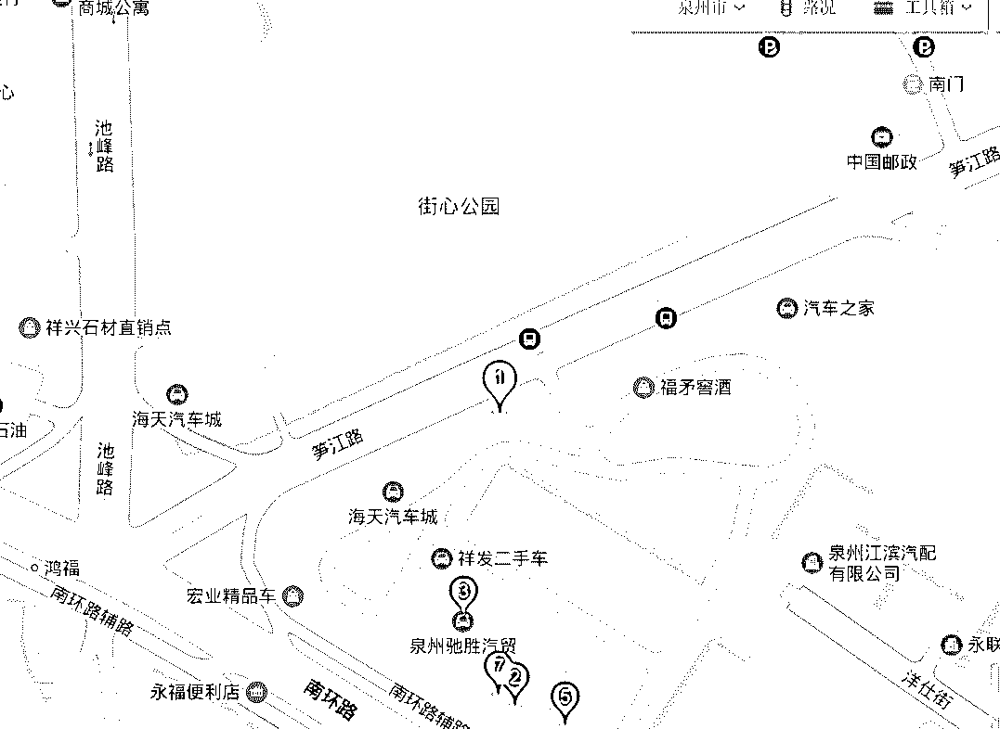********再对比照片中有个公园，感觉应该差不多。********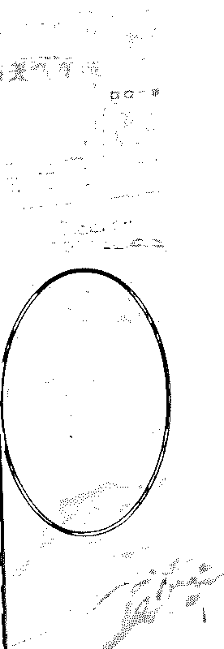********再从网上找到海天汽车城的照片和上图的照片做对比，应该可以确认就在这个地方。********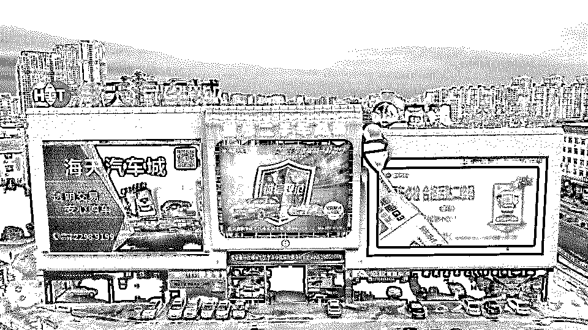********再使用谷歌地图来确认下，更加明显了，公园应该在汽车城和女孩住所的中间。********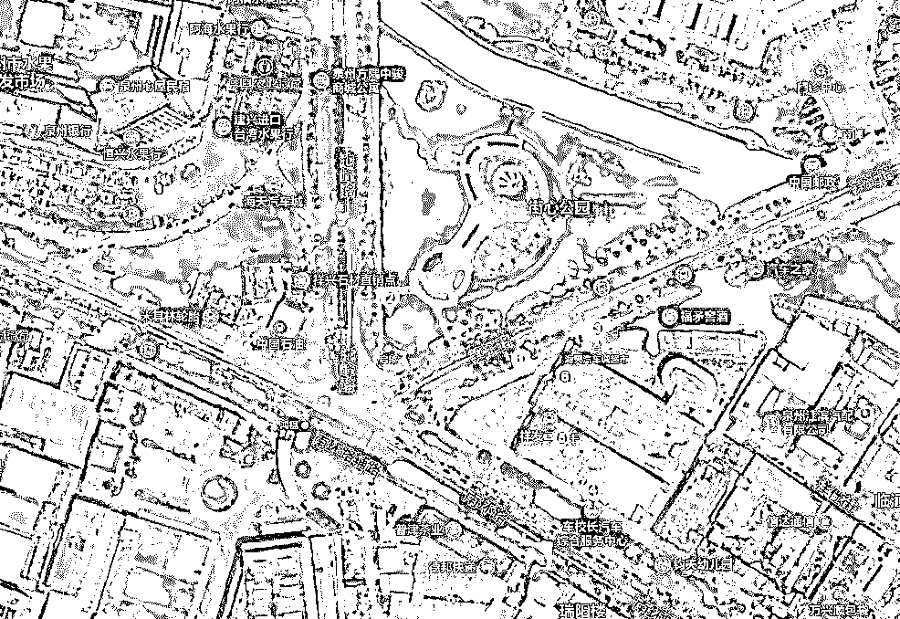********再看女孩的照片，以公园的位置来说，她就在公园左侧，根据左侧方位可以发现有一个泉州万隅中骏商城公寓。********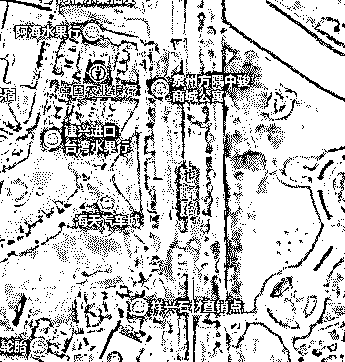********从女孩的自拍照来看公寓应该是靠近公路。********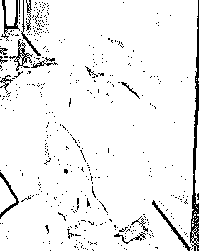********在百度上寻找这个公寓的信息可以找到这个图片。********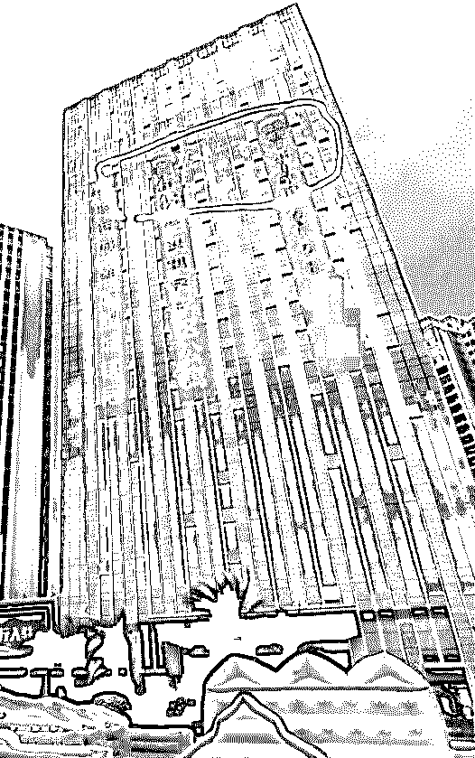********然后再根据谷歌地图看看公寓底层的照片，通过底层门上的反光可以看到树的影子，再对比女孩上传照片中的外景树木。********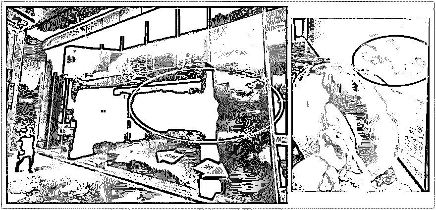********然后再根据照片中窗子露出的柱子，以及向下看的角度大概可以推断出女孩住在几楼。********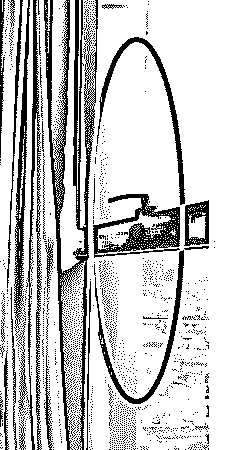********因为是商城公寓，所以可以电话咨询公寓在几楼，上面的公寓图中有公寓的招商电话：2728xxxx。********通过以上手段就可以精准定位一个人的地址，看完这些手段是不是很恐怖，一个普通人的自拍照就足以泄露自己的隐私。********我们以为只有普通人会犯这种错误，但其实明星也着过道，再给大家说一个国内明星照片泄密家庭地址的事件。**********03.王珞丹家庭地址泄密事件************曾经网上有一篇很有名的文章叫做《我是如何推理出王珞丹住址》，文章中就给大家描述了他的推理过程，推理过程大概如下。************第一阶段：信息获取************首先他在百度上搜索到了王珞丹的博客和微博，并对其上的信息进行筛选，获得了以下两张比较有价值的图片：************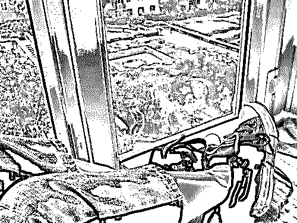************上下这两张照片，是她发表在微博上的从她家里往外拍的照片，表面上看，这是两张极为普通的照片，或许浏览者不会过多地注意，而实际上，这两张图片所传递的信息已足以推理出她家的位置。************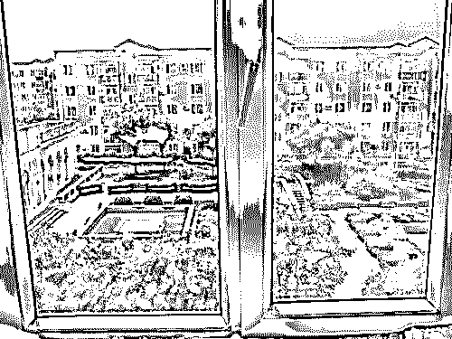************从以上照片可以分析得出这是西式小区，小区建成有一段时间，房子住在顶层，小区有三个同样大小的正方形花坛，正方形连线的一段是一个俯视图为长方形的拱门建筑。************下一步要锁定这个小区。************打开 Google Earth 截取的一张北京城区的俯视图，为了方便解说作者的分析过程，将其划分为九个区域。划分方式我是按照四环为标准的，也就是 E 区域的边界便是四环。************很显然，这仅仅是一张大比例的俯视图，放大比例尺寸之后，每一个区域都够浏览几个小时的。************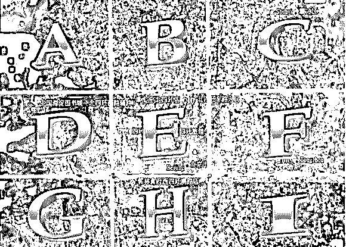************下面要做的工作就是一一排除这些待选区域，有的区域无法立即排除，需要在其它某个关联区域被排除掉之后才能够排除，这个稍后会具体解释。************第二阶段：区域筛选************以下是原作者排除非关联区域的过程，在王珞丹的微博上，注意到有这样一条：************************联排要到城里的摄影棚去，而她堵车堵在四环，时间是下午一点五十左右，刚好是从家里吃过午饭往摄制组赶的时间，说明她家不在四环以里。************虽然不够充分，但极有可能是这样的。在她另一条微博里，她提到演出这么多年，自己还没有在北京中心地带买一套房子，便是佐证。因此排除 E 区域。************后面他再根据微博上的其它信息排除了其它区域，认为 C 区域的可能性最大，重点排查 C 区域的小区。************下面要做的工作就是一一排除这些待选区域，有的区域无法立即排除，需要在其它某个关联区域被排除掉之后才能够排除，这个稍后会具体解释。************第三阶段：搜索************之前的分析大概花去了二十多分钟的时间，接下来的工作就是搜索。在 Google Earth 上作者截取了如下这张俯视图，乍看上去，没有什么特别之处。************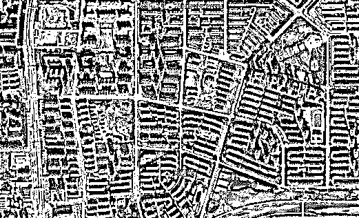************让我们对局部放大看一看：************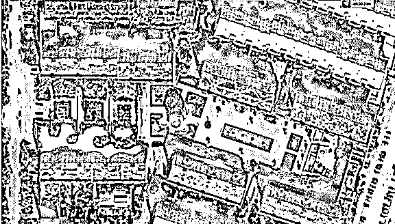************请注意图片中间左部的三个正方形区域，注意这三个正方形在俯视图上的不同体现，再加上正方形区域边上的那个长方形区域，基本上可以确定，这就是他所要找的目标小区。************第四阶段：实地检验************为了验证这个确实是所寻找的目标小区，去年暑假，作者还特意前往此地，下图是作者在现场拍摄的照片。************和之前王珞丹从阳台上往外照的照片进行比较，便可获证这确实是作者所寻找的目标小区。************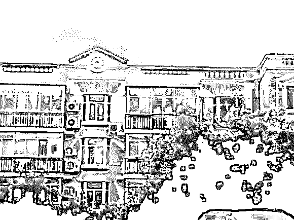************下图是作者拍的另一张小区照片，可以看到三个正方形花坛中的一个，以及背后的长方形拱形门。************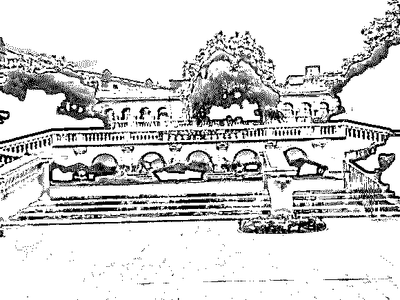************以上便是作者分析推理加搜索的全部过程，前后用时四十多分钟，其中信息采集、分析推理占了较长时间，二十分钟左右，搜索也接近二十分钟。************另外王珞丹早已经搬家，作者的文章也只是为了证明自己的推理过程。尽管楼主表示自己并没有恶意，等王珞丹现在已经搬走了才分享出来给大家。************但仔细想想，通过微博中的几张照片再结合谷歌地图就能找上门来，还是挺恐怖的。**************04.日本女明星被猥琐事件************终于讲到日本女明星这次的泄露地址事件了，她比王珞丹泄密地址的方式更要传奇得多，真的是连电影里面都不敢这样演，就活生生的发生了。********前段时间，一位名叫佐藤响的日本宅男，看起来老实巴交的，结果却干了一件轰动世界的大事情，顺便把自己送进了监狱。********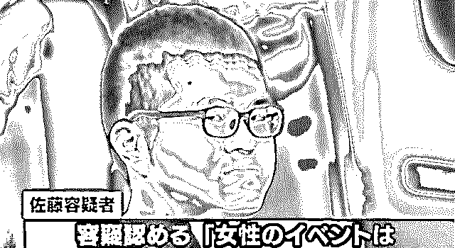********日本 21 岁的女明星松冈笑南（Matsuoka Natsumi）有很多歌迷，其中包括一些狂热的男人。为了调动粉丝们的热情，松冈笑南经常在网上发布自己的自拍照片，以供他们欣赏。********佐藤响做为松冈笑南的粉丝之一，对她更是疯狂的迷恋，在每条推特下都会留言，同时每次演出都会到现场支持，当然也会仔细观察她的每一张照片。****************有一天他终于在女明星的照片中发现了线索，找到了女明星的家庭地址，就这样悄咪咪的摸到了女明星的家门口，在松冈进家门前用毛巾捂住了她的嘴巴，并对年仅 21 岁的她上下其手。********幸运的是，由于松冈不断挣扎、尖叫连连，害怕被发现的佐藤放弃了猥亵，立刻逃走。不过终究还是逃不过法网，不久后就被警方逮捕了。********按理说女星们的住址都是高度私密的，那佐藤是怎么找到的呢？说出来你可能不信，关键就是：自拍中的瞳孔倒影！！！********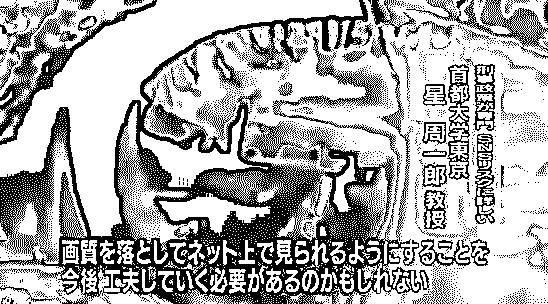********根据佐藤交代，他放大松冈在车站的自拍后，在瞳孔倒影中得到了大致的街景轮廓，再用谷歌地图的街景功能逐个排除，还真的让他找到了自拍中的车站。********随后他到车站蹲点跟踪，进一步锁定了松冈住的那一栋公寓。他还对松冈在家里拍的短视频进行了仔细分析，提取出太阳角度以及窗帘颜色等关键信息。********最终成功推断出松冈具体住在公寓中的哪一个房间，并实施了邪恶的计划。********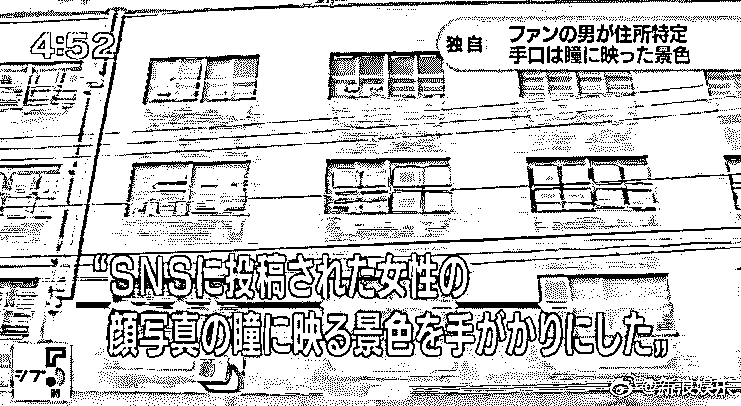********没想到，靠一张自拍就能找上门来这种只存在电影中的高智商犯罪，居然在真实生活中发生了。********有网友称他简直就是福尔摩斯再世、真人版的柯南，不去抓坏人可惜了......********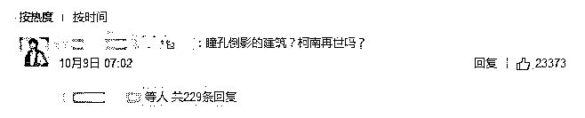********这位狂热的男粉丝给大家上演了一场真人版悬疑推理剧，有一种看《名侦探柯南》的感觉，这样的天才这样的能力，他应该去当侦探，"千里追凶手，就靠一双眼"。********可是他却用他的智商做出了这种变态的行为，实在是太傻了点。**********05.还有更恐怖的**********对于很多地理知识丰富的人来讲，普普通通的照片在他们眼里确是信息流满满。********比如我在微博发现的这张照片，对于我来讲只能看出来这是一个中午拍的照片。********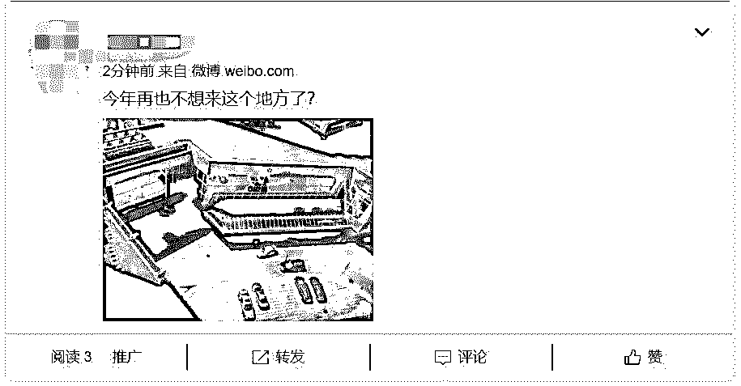********但是对于有些人来讲，图片中的信息足以让他们定位这张图片的地址了。具体看下专业人士是怎么来分析的。********因为我们是北半球，所以影子肯定不会出现在本体的南边，而建筑物面积最大的侧面一般又是向阳的，所以我们可以知道这幅图的东西南北。********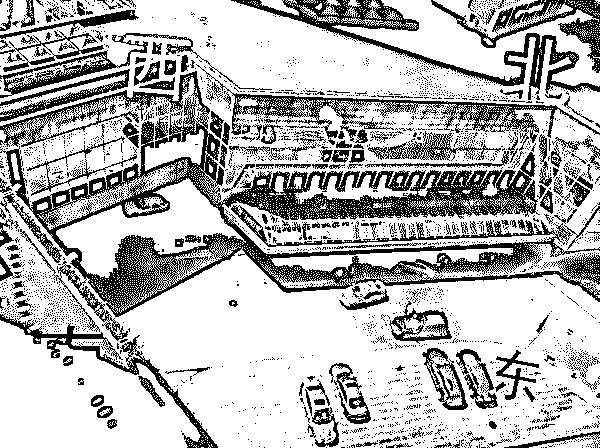********让我们继续，太阳东升西落，所以拍这幅照片的时候是下午，大概 3~4 点。********之后进一步分析各种光线的夹角、实体高度与投影长度关系，得到太阳高度角和影子长度的大致数据。********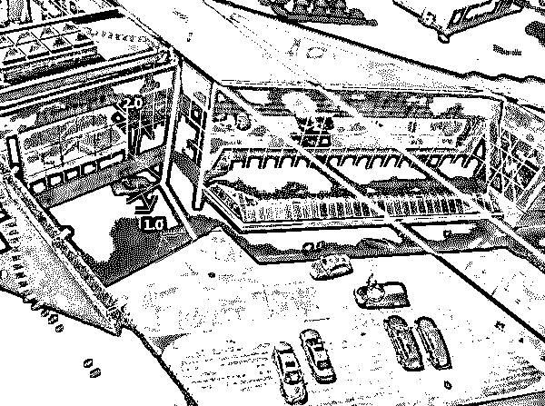********接下就需要用到一个神奇的网站 Sun Earth Tools。********这个网站能查找地球上任何一个地点，任何时刻的太阳高度角和影子长度。********根据上图猜测的数据输入后，就能得出照片拍摄地点的大致经纬度。********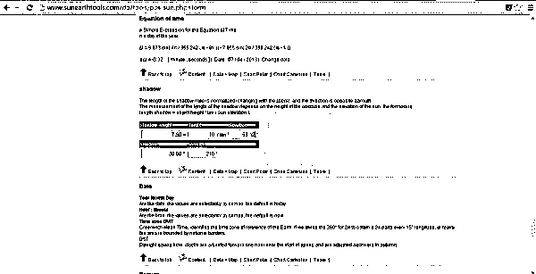********再回到影子定位的网站，当我们把月份调到 7 月的时候，下午 16 点的那条直线的方向正好和照片中影子的方向吻合！！！********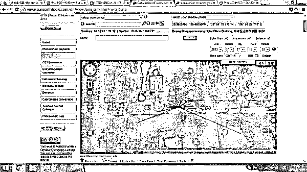********然后，在这个经纬度附近仔细搜寻一下，就能找到准确的位置。****************结果和照片中的建筑一模一样啊，这也太魔幻了吧......********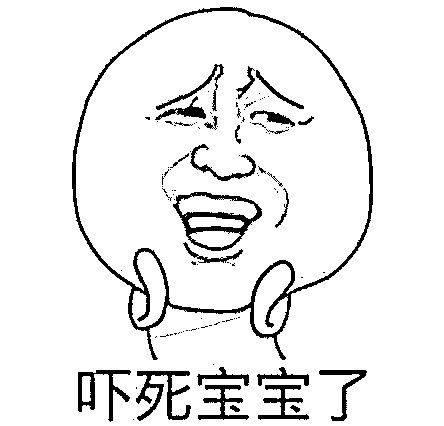**********06.一个亿的像素**********前两天某厂商出了一个新款手机，据说拍摄的照片有 1 个亿的像素，大家可能不明白一个亿像素的照片是什么概念，我找到富士中国官网的一个原图，试着和大家一起看看。********原图：********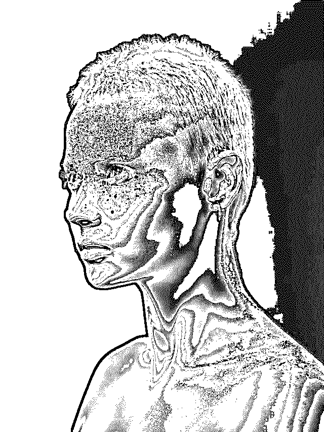********放大：**** ****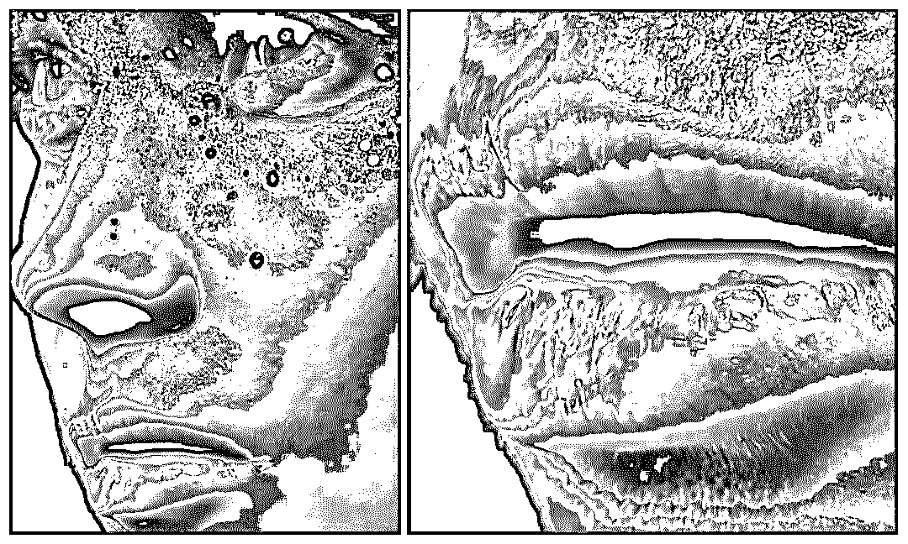********最后图片中的汗毛都可以看得非常清楚，如果这么高像素的手机对着自拍一张照片，基本上可以看清楚脸部的任何细节。********大家都知道，中国人拍照都有一个习惯就是举剪刀手，其实这个动作也极具风险。********对着镜头比剪刀手拍照的时候，在 1.5 米的距离内拍摄的照片能还原出 100%的指纹。********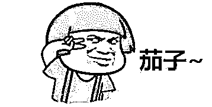********2019 年国家网络安全宣传周上海地区活动中，上海信息安全行业协会副主任张威表示，拍照时如果镜头距离够近，“剪刀手”照片通过照片放大技术和人工智能增强技术，就能将照片中人物的指纹信息还原出来。********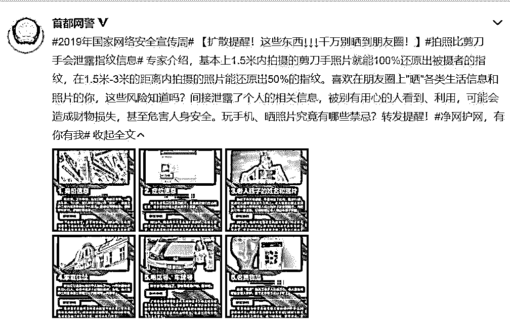********指纹被提取后通过专业材料制作成指纹膜，可被不法分子用于各种通过指纹技术来识别身份的渠道，指纹门锁、指纹支付等都能轻松破解。********看来以后拍照要反着举剪刀手了。。。**********07.自拍照可以泄露哪些信息************一般手机的拍照可以暴露以下几方面的信息：******

*   ******拍摄日期******
*   ******GPS 定位数据等等******
*   ******拍摄设备（机品牌身、镜头、闪光灯等）******
*   ******拍摄参数（快门速度、光圈 F 值、ISO 速度）******
*   ******图像处理（锐化、对比度、饱和度、白平衡等）******

******比如我在美国拍的那张照片，我在电脑端右键-属性-详细信息，就会看到以下信息：************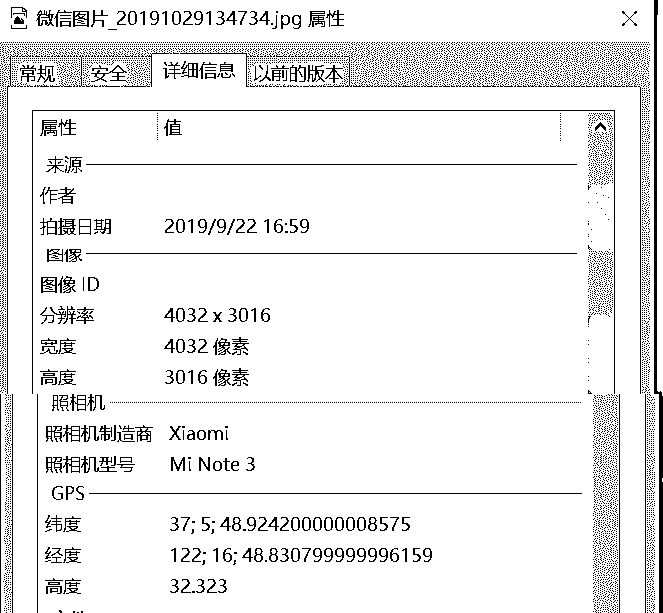************申明一下，小米真的没有给我广告费(#^.^#)************如何去掉照片中的 GPS 信息：******

1.  ******关闭掉手机相机的定位权限。各个类型的手机关闭方式不同，但都可以通过设置相关的权限去掉照片记录 GPS 的功能。******

2.  ******在社交网站上传照片的时候避免使用原图上传，一般情况下各个软件会对上传的照片进行压缩处理，自动会抹去相关的 GPS、手机型号等信息。只要不使用原图上传分享，一般可以避免掉大部分问题。******

3.  ******在电脑端删除属性和个人信息。电脑端右键-属性-详细信息，滚动条拉动到最下方的时候，会看到“删除属性和个人”信息的蓝色字样。******

    ******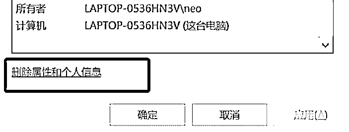******

    ******在弹出的对话框中，可以勾选你想删除的属性信息，避免个人隐私泄露。******

4.  ******网上有很多地址混淆的软件，可以更改照片中的地址，这样也可以误导那些有心人。比如软件：MagicEXIF 元数据编辑器，可以查看或者手动更改照片中的 GPS 相关信息。******

    ******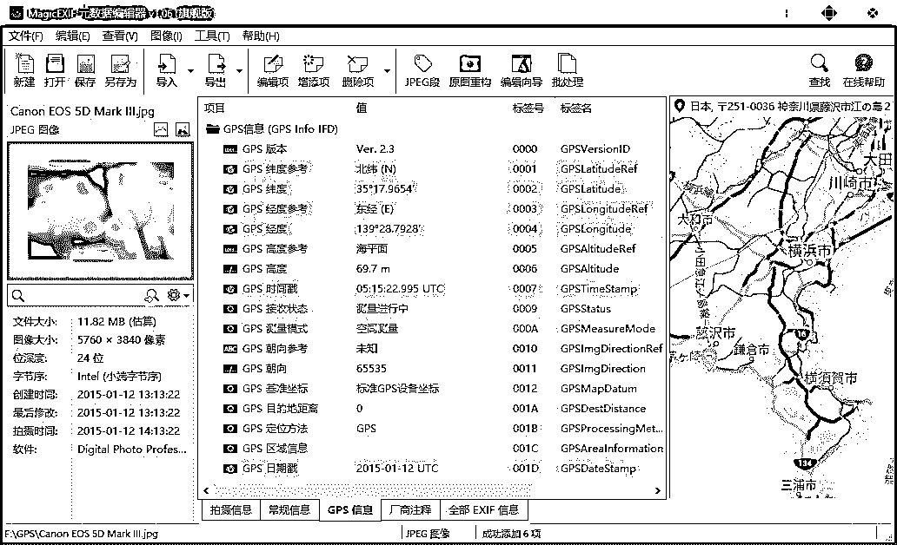******

******当然以上手段只能防止照片本身的属性信息，拍照的时候还需要注意，**不要泄露家庭的内外景信息**，**不要泄露公司的内外景信息**，避免拍照露出**指纹**或者其它敏感信息。************07.社会工程学**********上面说的照片都是我们在社交网上上公开发布泄露的，但其实会有一些人有目的的跟受害者获取一些信息，这种方式就叫做社会工程学。********先给大家介绍下什么叫做社会工程学，引自维基百科的说明：****

****在计算机科学中，社会工程学指的是通过与他人的合法地交流，来使其心理受到影响，做出某些动作或者是透露一些机密信息的方式。**** 

****这通常被认为是一种欺诈他人以收集信息、行骗和入侵计算机系统的行为。****

****在英美普通法系中，这一行为一般是被认作侵犯隐私权的。********用大白话说就是用聊天的方式来获取你的一些隐私信息，比如我们上面说的一般情况下不要发原图给陌生的网友，那么网友就会有办法来套路你。**** ****比如下面这个：********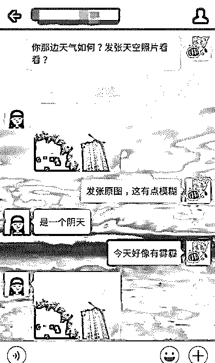********还有这个。。。********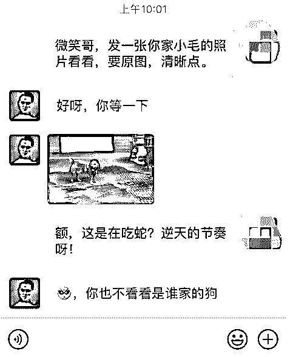********通过类似的手段骗取受害者的相关内容。让重发的手段各种各样，理由可以是：照片不清晰、图片加载失败等等。********大家在日常交流过程中需要注意，有可能陌生人想知道你家地址，就会在聊天中假装随意和你聊聊今天的天气怎么样，小区有没有下雨等话题，引诱你发个照片看看等。********如果不留意发照片给陌生人，就有可能通过 Gps 或者图片外景信息定位到你家地址。**********08.总结**********在信息越来越发达的今天，我们的各种信息都会飘落在互联网上，平时保持一定的警惕性可以避免很多问题。********如果你觉得这篇文章对你警示很大，可以发给你朋友避免他也会出现类似的问题。****

*****参考文章*****

******科技每日推送-21 岁日本女星惨遭“私生饭”猥亵，只因自拍瞳孔倒影暴露住址？******

******梦中的鱼-我是如何推理出王珞丹住址的******

******异度世界-gps 定位 | 一张照片是怎么出卖你的?******

******知乎日报-如何通过一张照片判断其拍摄的时间？******

*****大家好，我是老黑。**早年做过技术，也做过调查记者，曾协助警方打掉产值上亿的色情网站、也干掉过骗了无数人的非法集资。**之所以写【一本黑】公众号，是想用最简单的语言，告诉大家，这个世界上真的存在魔鬼，不然你没法理解人性。**如果你想认识我，不妨加我微信：****yibenheiSW***

**推荐阅读：**

[私密社群，快上车](http://mp.weixin.qq.com/s?__biz=MzU4ODAwNzUwMQ==&mid=2247486383&idx=2&sn=0821d0bff33285d235b2e1b9af9a9e27&chksm=fde21a8dca95939b496421a2177f83d8022e5a25ce95ea8b2929b17b26fe95aeb5ca902b722a&scene=21#wechat_redirect) 

[一夜薅走 700 万，背后是 70 万职业打假人的狂欢](http://mp.weixin.qq.com/s?__biz=MzU4ODAwNzUwMQ==&mid=2247486626&idx=1&sn=e20fbd5bab3b415a2193d536686bb3ff&chksm=fde21d80ca9594965853e5da54fd5fd20caa8c336406e298ff58b6fbaf3f421bf1fed83ce5ce&scene=21#wechat_redirect)

[豫章书院死灰复燃，举报者遭死亡威胁 ，还有人重度抑郁自杀](http://mp.weixin.qq.com/s?__biz=MzU4ODAwNzUwMQ==&mid=2247486597&idx=1&sn=549f291beb8b97f31e158aff7870012a&chksm=fde21da7ca9594b193f5685feb0ef09b14ab257c0b6e34c4d5b2d5caf4f24fbc1e4f7b3b4c01&scene=21#wechat_redirect)****