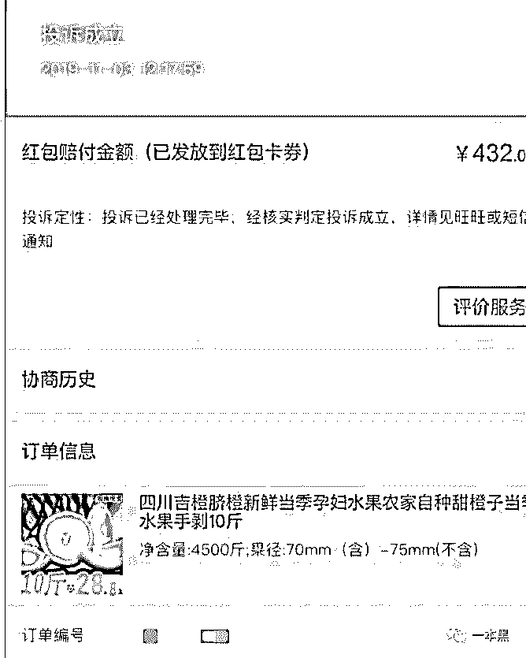
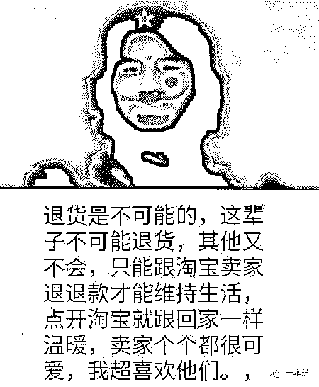
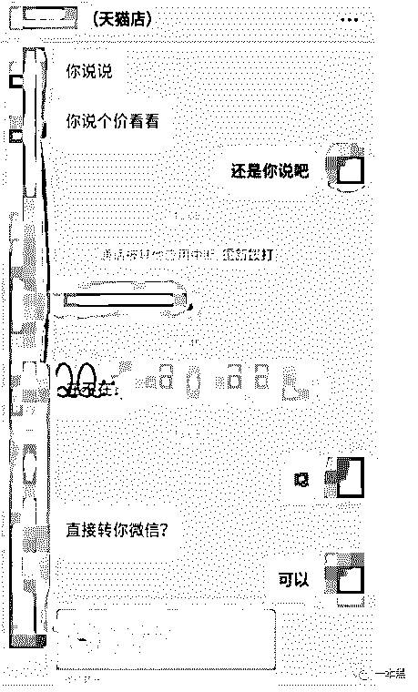
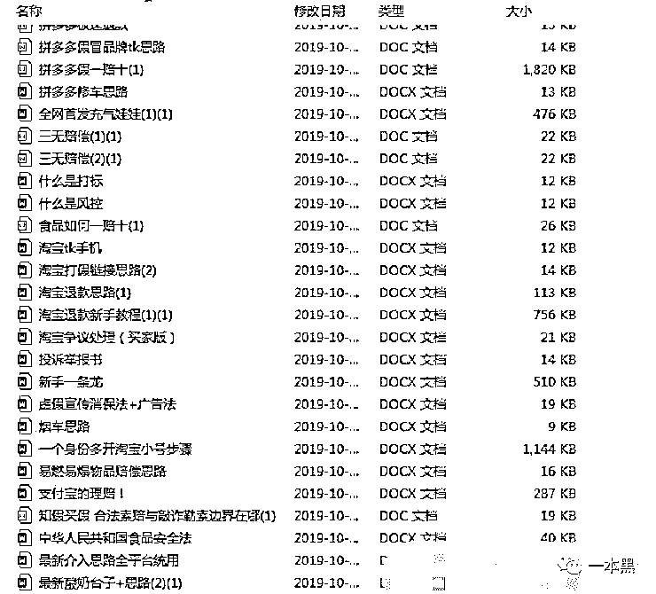
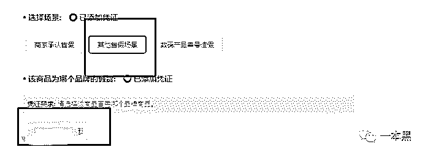
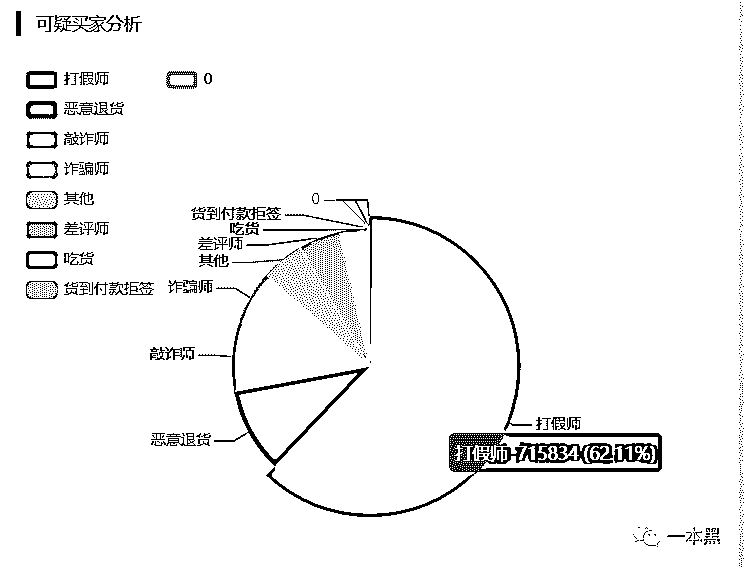
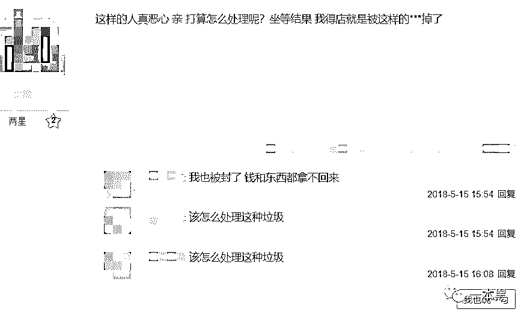
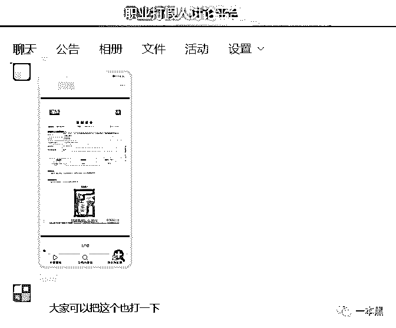
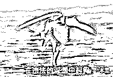
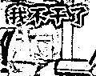

# 一夜薅走 700 万，背后是 70 万职业打假人的狂欢

> 原文：[`mp.weixin.qq.com/s?__biz=MzU4ODAwNzUwMQ==&mid=2247486626&idx=1&sn=e20fbd5bab3b415a2193d536686bb3ff&chksm=fde21d80ca9594965853e5da54fd5fd20caa8c336406e298ff58b6fbaf3f421bf1fed83ce5ce&scene=27#wechat_redirect`](http://mp.weixin.qq.com/s?__biz=MzU4ODAwNzUwMQ==&mid=2247486626&idx=1&sn=e20fbd5bab3b415a2193d536686bb3ff&chksm=fde21d80ca9594965853e5da54fd5fd20caa8c336406e298ff58b6fbaf3f421bf1fed83ce5ce&scene=27#wechat_redirect)

【黑话连篇】该栏目更多的是揭露事件或对事件的看法，以达到让人精神得到升华的目的。

* * *

前几天我们刚写了淘宝客和薅羊毛的事，隔天【B 站 up 主带领 1 万粉丝薅垮水果店】就上了热搜。私以为这已经不是薅羊毛了，这叫碰瓷，再严重一点可以说是敲诈。事情是这样的，淘宝某店铺在设置产品单位重量的是用错了单位，错把 26 元 4500g 的脐橙设置成 26 元 4500 斤。这个漏洞被 B 站 up 主“路人 A-”发现，在他的带领下，近千名粉丝瞬间拍下几万个订单，之后以买家拒不发货为由投诉店家，要求赔偿保证金。有人晒单，自己一单成功赔偿 432 元，几万单下来的赔偿需要 700 多万，于是他们成功地薅垮了这家水果店。      这家淘宝店是两个果农凑钱开的，原本想借着网络的便利尽快销售水果，却不想被羊毛党逼上了绝路。即使他们下跪，道歉，恳求，也无济于事，没有一个人愿意为钱让步（据悉店铺现已重新上线，并且被爆出炒作）。之后在各路媒体的深挖下，发现该 up 主不是第一次这么干了。在他的带领了，他和他的粉丝们曾连续搞垮过多家店，一家名为【意大利狐旗舰店】的店铺同样死于他们之手。多数媒体认为这种行为是薅羊毛，不，这不是薅羊毛，这是敲诈勒索。B 站 up 主薅垮水果店背后其实是数十万职业打假人的狂欢，他们钻各类平台漏洞，用各种理由碰瓷店主，以此获得赔偿。他们曾经叫职业打假人，现在应该叫职业碰瓷&敲诈人。**专业吃货，只退款不退货**QQ 上的职业打假群也分为两个阵营，一个叫吃货打假：只退款（原价）不退货；一个叫 职业打假：不要货只拿赔偿（500 起）。不管是哪种群，里边的人员构成及规则都是相似的。群里一般有三类人，老鸟、小白、独狼（散户）。小白一般交学费跟着老鸟干，散户自己搞自己的，偶尔交流一下经验，不收徒也不参团，从来独来独往，所以他们也叫自己独狼。此外还有，

> *上车：找人一起打假**车费/车票：跟单的好处费或者叫学费**赔偿车：与卖家协商拿赔偿金的订单**ab 单：买 A 发 B ，吃货可自由定赔偿金**先车后票：拿到赔偿后给车费**下车：成功上车并学会**学徒/徒弟：收钱带入行**表弟：关门弟子，倾囊相授*

不管是散户还是老鸟，打假的目的都是为了赚钱。现在的淘宝职业打假人和曾经新闻里报道的打假人，本质上已经发生了改变。手段或许还是一样的，但目的已然不同的，如果说以前的打假是为了维护消费者权益，净化市场。那么现在的打假更像是一种牟利或者碰瓷行为，其初衷只是为了赚钱。“食品赔偿车，上车的滴滴我”再加上几张对话或是转账的图片，这就是一个吃货的日常，通常他们会发好几张转账的截图来展示当天的收获。每张截图里都是不同的人，那些多半是徒弟们的收入。所谓的“滴滴”一般都是要给车费的 ，有些人明码标价，一般根据赔偿金额的多少决定，如果这一单赔的多，车费自然就贵一点。一般二三十左右，多的话七八十也能有。除了收车费的，还有所谓的收徒，有些定价 8 块 8 一个人，凑够了三四个人就开个禁言群，把交了钱的都拉进去，然后发几个文档，让你自己看。这哪叫收徒，这就是坑钱嘛，资料都是从其他群里搬运过来的，还不齐全。我在其他渠道找到了专门卖打假资料的，15 块钱能买到几十个文档。包含了各个专业词汇的解释，针对不同类型商品、不同品牌的打假教程以及相关的法律法规知识，而且还提供售后。      虽然干的都不是啥正经事，但 QQ 群里的骗子是真的多。想靠碰瓷商家赚钱还是先等着被骗吧。**职业打假有讲究**专业“打假”并不是像我们买东西一样等买到了假货才开始行动，他们会主动出击。使用关键词搜索商品，之后根据商品价格、店铺等级下手。和职业差评一样，打假也喜欢挑新店下手，因为成交几率高。除了个人店铺，等级低的企业店同样是可以下手的对象。吃货和打假人一般会选择散装食品、保健品、高仿类服装等产品下手，散装或者分装的食品投诉理由是三无；保健品要看是否有标注保健品等字样，功效说明中是否有标注可替代药物；高仿类产品，就直接举报售假、仿冒......吃货打假只退款不退货的前提是收到了货，但有的时候打假人动手的时候，甚至不需要下单，只要有产品的链接和卖家的对话就行，这个叫做打链接。打链接分为套话打链接和差价打链接，所谓的套话打链接，就是利用各种话术给卖家下套。询问卖家是否售假，至于卖家是否承认并不重要，因为产品的确是假的，之后再选择特定的销售进行场景举报。这种方式的打假需要多个账户同时配合，提交举报之后还需要其他的流程进行辅助。（具体略过不表）      除了套话，还有一种是利用仿品与正品之间的差价以及产品细节进行打假，差价打链接需要收到实物才能进行，否则货还没到手，卖家直接下架商品就无假可打了。一般情况下的打假，都会主动找卖家协商解决，卖家虽然对主动碰瓷很恼火，但是做生意还是和气生财的为好，于是花钱消灾是大部分卖家的选择。但总有些比较刚的卖家，他们不愿意妥协，只同意退换货，坚决不给赔偿。这个时候，打假人会走司法程序，先向工商局举报，倘若还是没有反应，那就向法院起诉。虽然起诉的流程麻烦，周期也长，但这期间的花费，最终都会由卖家来买单。不过一般卖家不会走到这一步，毕竟问题摆在那。在工商局介入的时候，卖家多半就会选择妥协，赔钱以撤诉。赔偿 500 起步，因为新消法规定最低赔偿金额 500，涉及食品药品安全的，退一赔十，不足 1000 按 1000 算。至于具体是多少，三倍还是十倍要根据问题的根源来定，是产品质量问题还是宣传问题，以及打假人的谈判能力。一般打假都是有据可依的，但也有些打假，根本就是造假，纯属无中生有。比如往外卖里扔头发然后拍照投诉，目的就是为了免单，甚至赔偿。打假人们对于新消法、广告法以及食品安全法等行业法规的熟悉程度，或许可以媲美专业的律师。除了熟悉相关法律法规，职业打假人对于每个平台的赔偿规则、对于互联网广告法以及食品药品的安全鉴定同样在行，更有甚者，还能自行制作产品鉴定书。其实凭借他们的能力，完全有能力成为一个优秀的淘宝运营，因为没有人比他们更熟悉电商环境及平台漏洞。但群里从来没人说要从良，承接同行打击报复的却不在少数。**黑吃黑还是白加黑**不管是吃货还是打假人，他们都不能称之为严格意义上的受害者，因为他们都是典型的知假买假。虽然售假的卖家也称不上是受害者，但有的时候产品出现问题的确也是无心之失，并非所有的卖家都赚烂钱。为了保护自己的权益，卖家们也想了各种方法，譬如专门用来查询异常淘宝账户的网站（如掌柜查查）、反职业打假联盟、贴吧曝光等。      *截图来自掌柜查查，职业打假师人数，预估 70 万+*还有一些卖家在法律论坛上求助，说自己明明卖的是正规的商品却被职业打假人敲诈，索要 10 倍赔偿，希望能有人支招。贴吧里有人说自己的店铺因为职业打假人的恶意举报被淘宝封掉，现在已经不做电商，但希望有一天能给他们点教训。      虽然说卖家大多数情况下会选择息事宁人，但有的时候，花了钱不仅不能保平安，或许会招来更多的投诉。因为职业打假人大多抱团，一旦发现有肉可吃，就会把消息发到群里，怂恿其他人上车。

虽然也曾经和卖家保证不会把店铺公布出去，但这个承诺压根没有任何效用，收完钱他们就在群里把这事公开了。于是有些卖家会采用极端手段，比如找人去差评师家里拉横幅，或者雇人揍一顿，就为了出一口恶气。这也是为什么职业打假人让人深恶痛绝的原因，贪得无厌对他们来说是一个很贴切的形容。其实大部分消费者能够从价格区分出正品和高仿之间的区别，专柜卖 2000 的手表，淘宝店卖 200 ，要说是正品，你会信吗？价值决定价格，品牌提升价格是不变的真理。消费者在购买商品的时候并不依靠打假人来判断商品的真伪，而打假人所谓的“打假”，在收到钱之后往往就会撤诉，这样的行为其实也是对售假的纵容。由于打假的目的不再是为了净化市场环境而是为了碰瓷甚至打击报复，打假人与卖家的立场一定是对立的，卖家认为自己是受害者，打假人觉得自己是卫道士（虽然本质还是为了赚钱）。两者看似都无辜，但其实两者都不无辜。打假的前提是卖家的确出现了不规范操作，而打假人的行为的确是有据可循的，碰瓷和正当维权的界限并不明晰，一旦越界，维权就会变成违法行为。职业差评、职业打假，这类游走在法律边缘的职业，很难用单纯的好与坏、正义与邪恶来定义，他们所做的事情虽然不能称之为正义，但他们的存在的确能够对一些不规范的卖家产生一定的震慑作用，然，以恶制恶从来不是一种值得推崇的方法。以恶制恶会助长碰瓷这种不良风气的盛行，变了味的打假让更多的无辜的卖家会被无差别打击，同样也会纵容更多的假货泛滥。倘若打假的和售假的沆瀣一气，那么市场将会如何呢？就像上文提到卖正规商品被投诉的卖家一样，劣币驱逐良币，真正有质量保证的店铺会因为一些失误被打击退出市场；卖假货的因为交了“保护费”（赔偿）继续生存。“负薪救火，扬汤止沸，以暴易暴，与乱同道”，用混乱制止混乱，用恶行制止恶行只会带来更多的混乱。正义的行为一旦成为一门赚钱的生意，那么正义就会远离。打假不应该成为一门碰瓷的生意。与其胆战心惊赚烂钱，不如踏踏实实搬砖。参考资料：

*“退遍全网，淘宝是我家”，你被职业打假人盯上了吗？郑亚飞；《卖家刊》*

***大揭秘：**神秘的 淘宝职业“打假人” 灰色产业链；**果然先生*****【一本黑的朋友们】知识星球的双十一优惠券仅剩最后 42 张，没上车的抓紧时间。

推荐阅读：

[私密社群，快上车](http://mp.weixin.qq.com/s?__biz=MzU4ODAwNzUwMQ==&mid=2247486383&idx=2&sn=0821d0bff33285d235b2e1b9af9a9e27&chksm=fde21a8dca95939b496421a2177f83d8022e5a25ce95ea8b2929b17b26fe95aeb5ca902b722a&scene=21#wechat_redirect) 

[求你们，别再当网红镰刀下的韭菜了](http://mp.weixin.qq.com/s?__biz=MzU4ODAwNzUwMQ==&mid=2247486568&idx=1&sn=72e3538ddd05119daeffc677860ff6d6&chksm=fde21d4aca95945c6b67569a4bb56a6f7524138db69114d6c757a62914ce92defd93f3afdfa6&scene=21#wechat_redirect)

[误入电话僵尸集体被敲诈，我扒出对方手机号，并劝他从良](http://mp.weixin.qq.com/s?__biz=MzU4ODAwNzUwMQ==&mid=2247486577&idx=1&sn=10c235c2de762925a93a18d9182f9455&chksm=fde21d53ca9594458dd8270122f3f44fd748215d8ea8c38fb49502e83b35874c9e1e6595a51b&scene=21#wechat_redirect)**