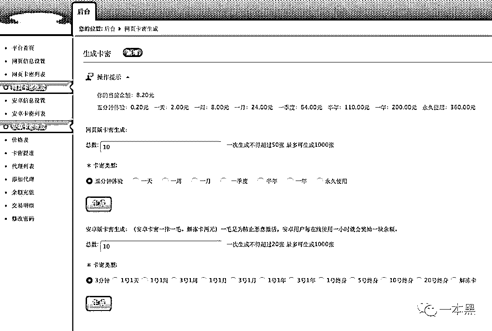

# 误入电话僵尸集体被敲诈，我扒出对方手机号，并劝他从良

> 原文：[`mp.weixin.qq.com/s?__biz=MzU4ODAwNzUwMQ==&mid=2247486577&idx=1&sn=10c235c2de762925a93a18d9182f9455&chksm=fde21d53ca9594458dd8270122f3f44fd748215d8ea8c38fb49502e83b35874c9e1e6595a51b&scene=27#wechat_redirect`](http://mp.weixin.qq.com/s?__biz=MzU4ODAwNzUwMQ==&mid=2247486577&idx=1&sn=10c235c2de762925a93a18d9182f9455&chksm=fde21d53ca9594458dd8270122f3f44fd748215d8ea8c38fb49502e83b35874c9e1e6595a51b&scene=27#wechat_redirect)

【黑客调查】

该栏目主要讲述老师傅利用【计算机基础知识】，还原网络或现实中的各种骗局和真实面目，以达到让人警醒的目的。 

* * *

事情是这样的，上周五我在社群里发了一条消息，说的是有位读者前不久打车，因为行程问题和司机吵了起来，结果第二天手机都快炸了，应该是被司机用“呼死你”报复了。后来这位读者给我发来一个网站，是在网上找的一款网页版“呼死你”。他说黑哥：“能不能帮我看看这玩意靠不靠谱，我实在是气不过。”看样子，这哥们想用其人之道还治其人之身。当时我也是没事干，所以就测试了一下自己的闲置号码，结果没过多久居然被“呼死你”背后的人发短信敲诈了，对方索要 300 元。我当时都震惊了，这帮哥们玩得也太骚了，竟然两头赚。（后台回复“社群”可进）当时我觉得，哎哟，有点意思哦！其实“呼死你”这玩意已经很多年了，没想到居然现在还在有人用。可能部分读者还不知道“呼死你”是什么，这里先做一个简单的普及。（文章后面有精彩好玩的事情发生）“呼死你”是指使用通讯费用极为低廉的网络电话作为呼叫平台，用网络电话通讯技术进行信息轰炸，它可以呼叫任何一部、任何区域的手机号码。是网贷平台、私人放贷者暴利催收的重要手段，除此之外，还会被一些人用来敲诈勒索、骚扰报复，就比如开头提到的哥们。一旦被“呼死你”锁定，手机就有可能被不间断地呼叫。“呼死你”也叫手机轰炸，他还有一个孪生兄弟叫“短信轰炸”。大家都知道，注册一个网站需要用手机接收验证码，验证通过后才能完成注册。短信轰炸就是调用大量注册网站的“发送手机验证码”接口，短时间内给同一手机号发送大量短信，以造成目标手机无法正常使用。说到“呼死你”的发展历史，其实还是挺有意思的。当时还是零几年的时候，广告这玩意还没在网上大范围铺开，那会你很难看到打开个网站就是是兄弟就来砍我，开局一把刀，装备到账秒回收。那会比较传统，广告大多数都会张贴在城市的大街小巷，特别影响市容，所以为了改变这一现状，城市协管员，也就是人们口中的城管就开始上街用铲子铲这些牛皮癣广告。但时间久了他们就发现，这样一直铲下去也不是办法。所以后来南京一家科技公司想了个招，开发出了一款信息化城市管理系统，来从根源解决这个问题。他们通过“语音呼叫”的方式，告知这些不法广告联系人，如果不在规定期限内撤掉这些广告，系统就会不间断地拨打他们的号码，让其手机无法正常使用。这就是后来的“呼死你”。经过这么多年的演变，现在“呼死你”在网上比较流行，软件基本上都是由个人开发制作，用途也早已演变成了报复、勒索、催收的手段。可能很多人看到这里会觉得，卧槽这黑科技牛逼啊，改天谁惹我不开心了，我也去搞一个报复一下。如果你这么想的话，那你就错了，因为这玩意其实很鸡肋，不仅鸡肋，你还有可能被对方反敲诈。怎么说呢？继续往下看。**二****前面说到有位读者给我发来链接，让我看看这玩意到底靠不靠谱，想着也是没事干，我就随手点开了网站。****从网站的宣传文案来看，确实很吸引人，牢牢抓住了用户的痛点，可以说是非常优秀了，****三个字概括就是：“稳准狠”。********一般这种“呼死你”的盈利模式就是靠卖积分赚钱，用户通过在发卡平台购买卡密就可以在线使用。****如果想白嫖的话，可以选择下载 APP 成为电话僵尸，参与呼死你的呼叫赚取积分。****你看，这还形成了一个闭环，有点意思。********为了测试，我联系客服购买了一个周卡，然后试着呼叫自己的闲置手机号，刚开始效果还很不错，基本上每隔几秒钟就能接到一个电话，响两声就挂断，接通也会自动挂断。********结果呼了没多久，收到提示说：“您今日更换号码已达限定次数，请凌晨 2:30 后再尝试。”****这难道还有限制不成，怎么和想象中有点不一样。********后来联系客服，客服说一天只能提交 5 次，随后又给我发了一个临时卡密，说是送我的，我差点感动得和客服聊了起来，可后来一想，网络背后乔碧罗太多，还是算了吧。****我这么硬核的人才不需要撩妹，接着测试吧。****用临时卡密继续呼的时候我总觉得太麻烦了，所以写了个脚本跑。可发现明明写着 10 秒的间隔请求，实际上 7 秒左右就触发了。****所以我开始产生怀疑，这会不会是假的。****测试过程中，每呼几次手机就不响了，但请求里却写着：“命令请求成功，10 秒后开始，不要重复开始停止，中间时间需要大于 10 秒，不然会被封禁。”********可测试了好几次，发现套路都是只有提交号码的那一次会启动“呼死你”，仅仅只能呼几分钟，问客服他也没再回我，看来这买的周卡是交了智商税。****这还不算什么，你们知道最魔幻的是什么吗？****因为我在测试的时候，是呼的自己的闲置手机号码，结果居然被这帮狗粮养的敲诈了。****对方发短信过来说：**“要不要解除电话轰炸，费用 300”。**********这时候我才知道，原来这帮孙子不仅卖卡密赚钱，还收集被轰炸人的手机号进行敲诈，这简直就是两头通吃，还吃到我头上来了。****我拿烟的手微微颤抖，这怎么能忍。****当时我把这事发在社群（知识星球）里，说自己测试“呼死你”被反敲诈了。****评论里很多人让我搞一搞这群人，大家都等着反杀！****其实，遇到这种事，我也挺好奇到底有多少人用了这款手机轰炸，又有多少人被两头通吃敲诈。****看到这里大家都知道谁要出场了，没错，就是【计算机基础知识】的持有者老师傅，遇到这种事情，老师傅最有发言权了。****而且老师傅也乐意干这种事，毕竟都搞到自己人头上了，这怎么能忍。****（只是大家平时看完文章不点赞，老师傅有点不开心）****于是老师傅点上一根经典黄鹤楼，手起刀落，先用相关工具进行了域名查询。发现该域名已经注册了两年多，而根据注册邮箱信息，发现站长还有两个“呼死你”网站。****一般这类报复性质的网站为了防止被人“底剁死”，都会用一些防 D 产品，老师傅发现对方的服务器用的还是美国的 sharktech 高防服务器。（底剁死为谐音）****并且老师傅还查到上百个二级域名，而这些域名就是该“呼死你”的下线代理网站。****通过 similarweb 分析，老师傅发现该网站上个月有十六万的访问量，直接访问量高达 43.99%，直接访问一般就是说已经购买过“呼死你”服务的记录。********按照一张周卡七十几块算下来，这成交量确实不小，一个月小几十万应该是有的。****以前还觉得这玩意挺 low 的，现在看来，任何不起眼的小买卖其实背后都是暴利啊。****紧接着，老师傅又通过娴熟的【计算机基础知识】，在分析网页代码的时候，找到了“呼死你”的后台地址。****一开始因为网页登录需要验证码不好爆破，在查看代码的时候，发现了一个可以绕过验证码的 bug，随后尝试 admin 爆破后台，成功拿到密码。****你以为这就是管理员的账户密码吗，不，这只是其中一个代理的账户，但足以观测后台的一切。****在后台里，可以进行网页版和安卓版的卡密生成，而卡密生成基本就是无成本的东西，价格表也明确标好了每个时限的成本。********我看了一下，网页版的周卡只需要 8 元，而客服卖出去的价格是 72 元，这利润简直是暴利啊。****       ****你说都这么高利润了，这帮狗粮养的还不甘心，还要收集被呼人的手机号进行敲诈，简直就是伤心病狂。****我在历史列表里，也看到了测试时候我的手机号码，这里面都是有记录的，怪不得他们可以这么快的进行敲诈。********都看到这一步了，大家是不是觉得接下来，我要搜索对方代理人的信息了。****不用收集，后台全都有，我验证过了，后台留下的代理人信息都是对方的真实信息。****      ****其中一个代理人的用户名记录的是手机号，通过使用手机号在支付宝进行添加好友的操作，我发现对方所在地是江苏连云港，姓名为*苏冉。****支付宝头像为一戴墨镜的小伙，应该 20 岁左右。****      ****看到这里，大家是不是觉得，手机号都有了，用他们的“呼死你”反呼对方一波怎么样。****行吧，为了劝这位迷途少年改邪归正，我还是决定给他上上课！****我直接在后台生成一个卡密，然后输入这哥们的手机号就开始呼。**这里需要着重说明的是，各位切忌不可模仿，我这里只是呼了对方几分钟做警告。**********几分钟过后，我用闲置号码给这哥们发了一条短信，问他要不要解除电话轰炸。****结果他反问什么价格，哈哈。看来挺淡定的，接着还装傻说自己没有搞轰炸敲诈人，还说已经报警。****然后我把后台带有他信息的截图，以及他的地理位置和名字发过去，他只回复了一句话：**“是我号码透露了一切”。******      ****后来我又和他扯淡了几句，他说自己之前是在网上看到的广告，觉得这玩意可以靠卖卡密赚钱，慢慢的又觉得可以试着敲诈别人搞点钱，所以就动了歪心思。****另外他还说，他只是一个小代理，网站也只是一个代理网站，代理网站的数据会同步到超级管理员手中，这种类似的代理网站最起码有几百个，数据加在一起是非常庞大的。****而上面有专门的人做数据收集，也就是把被呼人的手机号码收集起来，在手机被轰炸过后，他们会给指定的手机号码发送敲诈短信。****至于能不能敲诈成功就看运气了，他们也怕把事情搞大，所以一般敲诈不成功他们也不会一直去轰炸受害者。****接着我告诉他，使用“呼死你”本身已经侵犯了他人的通信自由权，敲诈更不用说了，如果他下次还继续干的话，我就让警察叔叔请他喝茶聊天，探讨一下人生。******三********最后总结一下“呼死你”的运营模式，首先通过大量的推广，引导用户安装并购买卡密使用，使用人使用过后，后台会记录被呼人的手机信息，“呼死你”代理人可以通过敲诈的方式向被呼人索要钱财，两头通吃。********一般这种呼死你在功能上是很鸡肋的，刚开始试用的时候效果非常明显，客户试用完毕觉得很有效果一般都会付费购买。********但其实呼叫的次数是很有限的，网站实际上也是骗人的，虽说有投诉按钮，但基本上没什么用，网站在你提交目标号码之后就开始欺骗你，每位代理也是心照不宣。********而这次拿到的网站仅仅只是整个电话轰炸中的一个代理站点，上百个站点组成的电话僵尸集团是非常庞大的一个产业链。********前面还提到过，想白嫖的用户可以安装软件成为电话僵尸，有钱的则自己花钱购买积分使用，但不管怎么样，其实大家都是韭菜。********网站代理人卖卡密赚下级用户的钱，还可能敲诈，但是网站代理人也是韭菜，掌握最高权限的人坐收渔翁之利，不管是代理人还是普通用户，大家都是一级一级的韭菜。****************目前市面上的“呼死你”有两种，一种是半机械版本，就是有一台单独的机器用来伪装号码或其他信息，从而实现不间断拨号，这种号码一般是正常的手机号，偶尔也有网络号码。********另一种就是这次文章提到的网页版和软件版，它可以无限换号不间断拨打，整个电话僵尸库由几百上千个代理站点组成，号码基本不会重复，网络电话居多，非常庞大。********而“呼死你”的网站服务器一般都在境外，所以一旦被呼，是比较难追溯的。********虽然现在各大运营商都针对“呼死你”给出了“防呼死你”的应对策略，但其实都不能完全避免。********另外有些手机有自带的拦截功能，其实这种功能大多数是先通过大数据生成“骚扰号码库”，然后再从拨进来的号码中进行识别拦截，所以也只能挡住部分，无法完全帮助用户避免骚扰。****

* * *

******彩蛋：****前面说到这群人不仅卖卡密赚钱，还收集被呼人的手机号进行敲诈，简直就是两头赚，说起来真的很缺德。************但其实这都不算缺德的，更缺德的是对方敲诈完你之后，会要求你加钱，然后告诉你轰炸你的人的联系方式。************卧槽，无情。************一本黑新社群已开通，社群名字叫做【一本黑的朋友们】，它没有一个具体的定位，里面会聊赚钱案例、想法、思路；它同时也是一个资源对接平台，帮助大家寻找可以合作的资源，但灰黑产严厉杜绝。
同时也会不定期邀请牛人嘉宾进来分享，听大佬的赚钱经历和想法，与牛人交流，是提升认知的捷径。总之，这是一个全新的成长型、认知升级、资源对接社群，后续会在社群内公布各种有趣玩法。**你还没上车？**

推荐阅读：

[私密社群，快上车](http://mp.weixin.qq.com/s?__biz=MzU4ODAwNzUwMQ==&mid=2247486383&idx=2&sn=0821d0bff33285d235b2e1b9af9a9e27&chksm=fde21a8dca95939b496421a2177f83d8022e5a25ce95ea8b2929b17b26fe95aeb5ca902b722a&scene=21#wechat_redirect) 

[“我花了 3888 上抖音网红培训班，现在是一名合格的韭菜”](http://mp.weixin.qq.com/s?__biz=MzU4ODAwNzUwMQ==&mid=2247486503&idx=1&sn=a483d44fe891d65df2df4d6d6d44fefb&chksm=fde21d05ca95941389be2e580fb544943524401774ceed234812b6e5168ced37cca5c56e33a6&scene=21#wechat_redirect)

[“在 nice 上花 3000 买了双烂鞋，客服说只能赔 40 块代金券”](http://mp.weixin.qq.com/s?__biz=MzU4ODAwNzUwMQ==&mid=2247486553&idx=1&sn=5941f145d9b0d6665a12fc8f7b082100&chksm=fde21d7bca95946d7a9cea736b49d19baa22f92a61fbbea7d847021aac6ebb1096b467e42857&scene=21#wechat_redirect)******