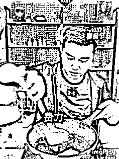
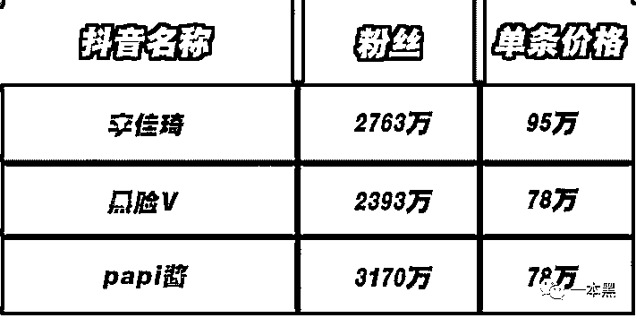
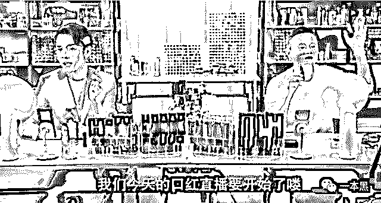
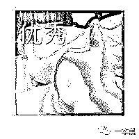
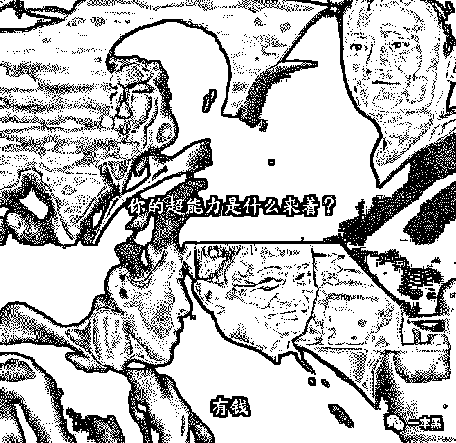
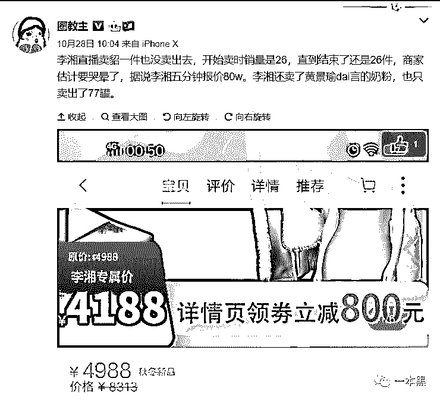
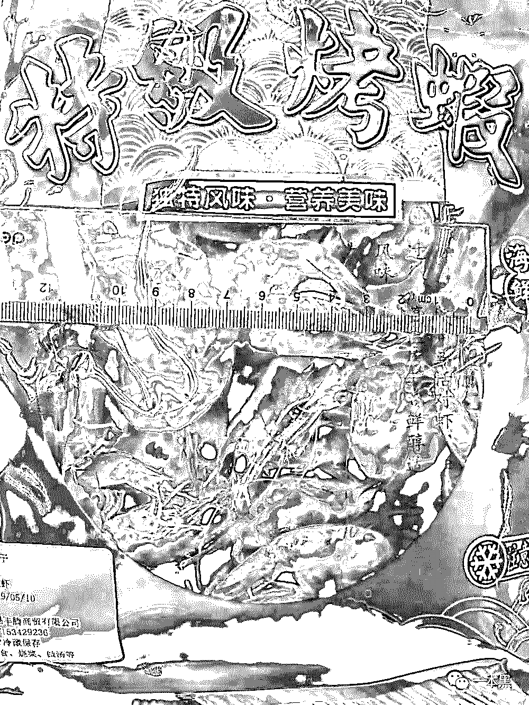

# 求你们，别再当网红镰刀下的韭菜了

> 原文：[`mp.weixin.qq.com/s?__biz=MzU4ODAwNzUwMQ==&mid=2247486568&idx=1&sn=72e3538ddd05119daeffc677860ff6d6&chksm=fde21d4aca95945c6b67569a4bb56a6f7524138db69114d6c757a62914ce92defd93f3afdfa6&scene=27#wechat_redirect`](http://mp.weixin.qq.com/s?__biz=MzU4ODAwNzUwMQ==&mid=2247486568&idx=1&sn=72e3538ddd05119daeffc677860ff6d6&chksm=fde21d4aca95945c6b67569a4bb56a6f7524138db69114d6c757a62914ce92defd93f3afdfa6&scene=27#wechat_redirect)

【黑话连篇】该栏目更多的是揭露事件或对事件的看法，以达到让人精神得到升华的目的。

* * *

“OMG，这绝对是一款又便宜又实用的不粘锅，各位女生不要错过了哦。”这是近日李佳琦直播卖不粘锅的开场白，然而紧接着就迎来了他人生中的至暗时刻，因为这个不粘锅，它现场粘锅了。起初他还试图挽救，自己动手铲鸡蛋，结果蛋糊的更厉害。尽管场面一度十分尴尬，但作为职业主播，该有的素养还是得有，李佳琦仍然坚持完成了本场直播。这场 40 万人观看的直播，翻车翻得非常彻底。或许他那句著名的口头禅 oh my god ，也已在心里变成了 oh shit 。这次翻车事件同时也透露一个真相，即网红的“亲测好用”，本人压根就没用过。虽然这次翻车了，但对于李佳琦本人来说，影响似乎并不大。在朋友圈里，李佳琦的推崇者们没有一个人对他这次翻车发表言论。而翻车的那天，仍旧有很多粉丝试图为他开脱，认为是操作手法不当而导致；又或者是马有失蹄人有失手。一句话总结：李佳琦很有个人魅力，这次翻车纯属意外，大家依然爱他。**李佳琦其人**我对于李佳琦的最初印象是【一个在抖音卖口红的男主播】。直到后来越来越多的新闻铺天而来，比如 3 分钟卖货 600 万；月入六位数，口红一哥等，这时我才知道李佳琦有多火。微博粉丝 500 万+，淘宝直播粉丝 900 万+，抖音粉丝 3000 万+。如此巨大的流量并非是靠炒作靠刷数据来的，而是实打实的真粉。* 网传李佳琦的广告报价（来自广告狂人）*看过李佳琦直播的人，很少有不被种草的。甚至有人说，第一次看李佳琦直播就买了一个沙发。这样的带货能力放眼整个直播圈，几乎无人能敌。“天不怕地不怕，就怕李佳琦 OMG”，不是吹的。我以为他是今年才火的，但是看完资料才发现，原来人家做直播已经两三年了，在彩妆行业更是摸爬滚打了很多年。在这之前，李佳琦已经拥有了很多令人眼红的成绩如：与马云 PK 卖口红，结果马云惨败；2018 年双 11，李佳琦单人的销售额达到 3 亿。如此强大的商业价值，即使是顶级流量明星也不一定比得上。从欧莱雅柜员到全网红人，很多人都总结过李佳琦能火的原因，但无非就那么几点：踏实、肯干、真诚。李佳琦有个记录是，一年 365 天，开了 389 场直播。就算是冲着钱去的，这股劲也让人感叹。你要是让我 365 天每天都码一篇文章，我估计早就把电脑砸了。想要挣比别人更多的钱，就得吃比别人更的苦，这是亘古不变的定律。李佳琦每次直播口红试色，各位女性朋友的钱包就捂不住了。原因在于，他的每一支口红真的都是涂在了自己的嘴上，而不是抹在手臂上。对于直男而言，抹在手上还是嘴巴上是没有任何区别的，但对于化妆的小仙女来说，那差别就大了，真人试色就相当于自己亲自上场了。至于口红到手之后是不是真的适合自己，那是后话了。最多的一次，李佳琦一晚上试了 380 支口红，结果就是，嘴烂了。这都不能用拼命和敬业来表达了，这简直就是行为艺术。我对他卖的产品没什么兴趣，但我觉得他的文案写的很有煽动力，我曾一度以为他是文案出身。因为他的文案真的写的非常好，比如强调产品的性价比高：@所有女生、十个女生九个都会想买、这个颜色随便买、 这款借钱都要买.....比如，形容口红颜色和质感：淋过水的砖头、接触嘴唇之后就变成了水、会让你变温柔、会被男人吃掉的颜色、嘴巴里面有星空、奶油慕斯的质感、有生命力的红色。尽管我完全分不清口红的色号和质地，但是这种极具画面感的形容，能很容易让人产生联想分得清差异。在 OMG 的助攻下，几乎没人能摆脱买买买的魔咒。假使有一天，李佳琦不再做主播了，也完全可以成为一名很好的文案。上周我们发了个抖音网红培训的骗局，骗子们利用的无非是大家啥都不会但又想赚钱的迫切心情来行骗。就像老黑在文章末尾所说的，一件事情如果你真的能做到顶尖水平，那么钱一定是附带而来。不仅仅是钱，还有其他的收获，譬如，做视频直播必须得会的拍摄、剪辑、特效、脚本撰写等等，甚至还有随之而来的人脉。在李佳琦的直播中，我们就见到了越来越多的大牌明星的身影，要说李佳琦是借明星的影响力来造势，那恐怕不见得。毕竟厂商们都说了，只要是李佳琦推荐的，就没有不好卖的。**直播带货火了**如果说李佳琦是抖音带货第一人，那么薇娅就是稳稳坐在淘宝直播金字塔尖的唯一赢家。关于薇娅的成就和头衔，比之李佳琦更让人羡慕，毕竟薇娅的成交额一开始就是以亿为单位的。

> *2016 年 5 月开始做直播，四个月实现引导成交额破亿；**2017 年帮助一家 0 粉丝的皮草店做直播，结果销售额直接上了 7000 万；**2018 年，双 11 直播两小时，销售额 2.67 亿；*

由于做直播实在太厉害，卖啥啥火，薇娅成为了很多知名品牌的推荐官，譬如宝洁、飞利浦。这么强的女性不给平台做广告实在太可惜了，于是薇娅又被阿里巴巴聘为创业导师，以鼓励更多的女性创业。我发现很有意思的一点就是每一个在主业做出一定成就的人，都会涉足公益。薇娅在直播卖货的同时会帮忙推介一些偏远地区的优质农产品，至于效果，那当然没得说。用术语来说，这叫扶贫攻坚。于是薇娅在工信部主办的一场活动中被评为“ 淘宝十大扶贫淘宝主播 ”。同样是拍视频起家的，有的人一开场就光芒万丈，有的人还在艰难维生。当大部分主播还在绞尽脑汁想段子、博同情的时候，李佳琦已经受邀去参加时装周和明星同台了；李子柒已经开始推广非物质文化遗产；而薇娅被官方授予荣誉称号，在扶贫的路上越走越坚定。人和人的差距就是这样被拉开的，这已经不是钱的事了，这叫人生价值和荣誉感以及使命感。虽然谈人生价值对我们来说还为时过早，但作为人生的奋斗目标，仍有其指导性意义。算了算了，强行装*，最为致命，老老实实搬砖才是正经。视频行业的兴起掀起了一波全民带货的高潮，不论是当红明星还是素人，大家都发现做买卖最赚钱，尤其是直播平台卖货。从微博时代的图文广告到现在视频卖货，那当然是视频的效果更好，毕竟眼见为实嘛。况且视频的发酵速度快，传播范围广，还能即时交易，成交额蹭蹭蹭就上去了。但是水一深，自然就鱼龙混杂，各路牛鬼蛇神都来抢肉吃。即使是网红本红，在流量顶端待久了也难免会有点飘。**行业乱象丛生**不想赚钱的网红不是好网红，不想赚钱的素人当不了网红。在我的抖音关注列表里，不卖货博主的少之又少。有些人只是发发自己的日常生活，顺带卖个货；有的则是专职卖货。但不管哪一种，都存在一样的问题，比如亲测好用，基本上都是自己没用过的。又回到了开头李佳琦那个翻车的不粘锅了，那就属于典型的直播前试都没试过就搁那吹的。开场一句 OMG，吊足了大家的胃口，三分钟后剧情反转，啪啪打脸。这次翻车的不粘锅，不是李佳琦的产品第一次出问题。早在这之前，就有很多人反应，买了李佳琦推荐的护肤品，结果用了之后，脸烂了。李佳琦的翻车多半是因为产品质量不过关，吃亏的是消费者。这个锅李佳琦得背，但厂家也逃不掉。有些明星就不一样，直播观看人数没问题，产品质量也没问题，但销量就，一言难尽。这次消费者是没啥损失，但是厂家就亏惨了。薇娅帮人卖皮草，0 粉丝店铺销量直接上千万，李湘也直播帮人卖貂，但尴尬的是，从直播开始到结束，一件貂都没卖出去。来的时候 26 件，走的时候还是 26 件。挥挥衣袖，没卖掉一件貂。叼啊~~~*代言费到底是 80 万还*是 8 万，没有准数  其他的明星就不说了，代言费收到手软，商家只能花钱赚吆喝。几十万一场的直播代言费，实际销量能上万就不错了。别说拉销量，不亏就该谢天谢地了。顶级网红卖货，货不好；明星，明星卖不出货。素人卖货那就更不说了，问题一大推。今年上半年，一篇名为《我一个世界五百强做食品的，被抖音卖烤虾的骗了》讲的就是抖音上多个账号以同样的故事为蓝本，勾画了一个辛勤朴实的烤虾大妈在抖音卖垃圾虾干的故事。*抖音网红虾干*
由于此视频的编剧编故事的能力太强，很多人都被故事感动花高价购买了这个虾干，结果拿回家一看，“呸，什么垃圾玩意，喂猪都不行。”三无就算了，还有一股刺鼻的腥臭味。经查实发现，这个虾干压根不是大妈烤的，而是来自江苏某贸易公司。这个故事和小罐茶的套路不是一模一样的吗？**【每一罐都是泰斗级大师手工炒制**】。八位专业炒茶大师，平均日炒茶 1466 斤，这就是小罐茶成功的秘密，也是抖音等平台众多农副产品脱销的原因。  *图片来自华尔街见闻*
直播平台卖货，除了直接卖吆喝的，大部分都是在卖故事，谁会编故事，谁就能赚钱。哦，还有剪辑，会剪辑也能赚钱。抖音上大量拼接痕迹明显的产品使用前后对比视频，大部分都是卖货的。个人直播卖货其实就像是一个流量巨大的个人便利店，一万个人突然挤进只能容纳一百人的店铺，随之而来的自然是商品破损、漏发、售后不到位等一系列问题。所谓的成也流量，败也流量，大概就是这么个意思。不管怎么说，做生意产品是首位，其次是售后。至于采用何种宣传方式，选择哪些销售平台虽然也重要，但却不是最重要的。毕竟，产品质量没保障，再多 OMG 都白瞎。

* * *

各路网红兴起，各个流量层级的明星都来卖货，人人都想要成为李佳琦，但李佳琦翻车了。网红带货不神奇，不新鲜，无非就和多年前的电视购物一样。除了头部流量，其他的人也没有那么强的带货能力。倘若不粘锅再粘几次，这样的车多翻几趟，李佳琦迟早会走下神坛。这次是李佳琦，下次又会是谁？不要迷信网红带货，视频好看不代表产品好用，网红推荐再良心，也逃不脱赚钱二字。人人都在鼓吹消费主义，网红也不例外。想要理性消费，从远离李佳琦开始；想要发家致富，从远离李佳琦们开始。一本黑新社群已开通，社群名字叫做【一本黑的朋友们】，它没有一个具体的定位，里面会聊赚钱案例、想法、思路；它同时也是一个资源对接平台，帮助大家寻找可以合作的资源，但灰黑产严厉杜绝。
同时也会不定期邀请牛人嘉宾进来分享，听大佬的赚钱经历和想法，与牛人交流，是提升认知的捷径。总之，这是一个全新的成长型、认知升级、资源对接社群，后续会在社群内公布各种有趣玩法。**你还没上车？**

推荐阅读：

[私密社群，快上车](http://mp.weixin.qq.com/s?__biz=MzU4ODAwNzUwMQ==&mid=2247486383&idx=2&sn=0821d0bff33285d235b2e1b9af9a9e27&chksm=fde21a8dca95939b496421a2177f83d8022e5a25ce95ea8b2929b17b26fe95aeb5ca902b722a&scene=21#wechat_redirect) 

[“我花了 3888 上抖音网红培训班，现在是一名合格的韭菜”](http://mp.weixin.qq.com/s?__biz=MzU4ODAwNzUwMQ==&mid=2247486503&idx=1&sn=a483d44fe891d65df2df4d6d6d44fefb&chksm=fde21d05ca95941389be2e580fb544943524401774ceed234812b6e5168ced37cca5c56e33a6&scene=21#wechat_redirect)

[“在 nice 上花 3000 买了双烂鞋，客服说只能赔 40 块代金券”](http://mp.weixin.qq.com/s?__biz=MzU4ODAwNzUwMQ==&mid=2247486553&idx=1&sn=5941f145d9b0d6665a12fc8f7b082100&chksm=fde21d7bca95946d7a9cea736b49d19baa22f92a61fbbea7d847021aac6ebb1096b467e42857&scene=21#wechat_redirect)