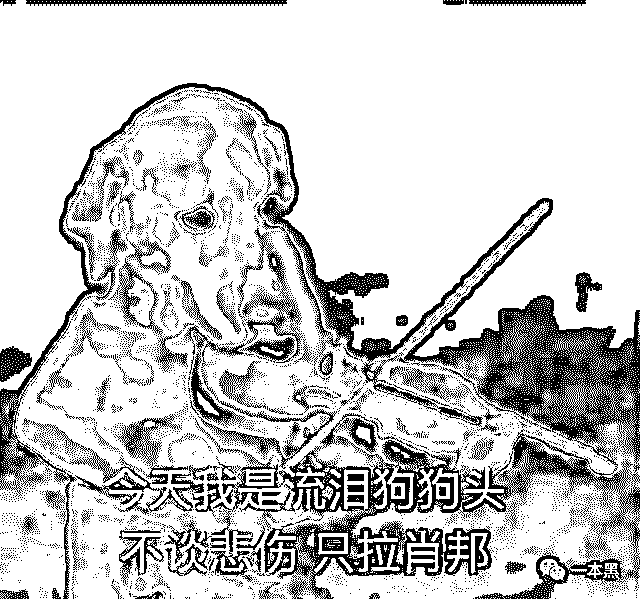
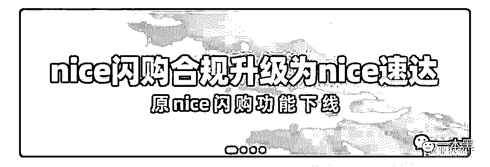
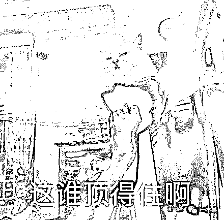
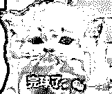
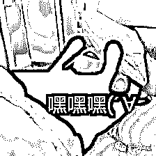
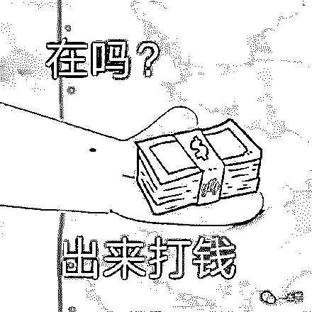
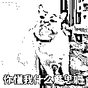

# “在 nice 上花 3000 买了双烂鞋，客服说只能赔 40 块代金券”

> 原文：[`mp.weixin.qq.com/s?__biz=MzU4ODAwNzUwMQ==&mid=2247486553&idx=1&sn=5941f145d9b0d6665a12fc8f7b082100&chksm=fde21d7bca95946d7a9cea736b49d19baa22f92a61fbbea7d847021aac6ebb1096b467e42857&scene=27#wechat_redirect`](http://mp.weixin.qq.com/s?__biz=MzU4ODAwNzUwMQ==&mid=2247486553&idx=1&sn=5941f145d9b0d6665a12fc8f7b082100&chksm=fde21d7bca95946d7a9cea736b49d19baa22f92a61fbbea7d847021aac6ebb1096b467e42857&scene=27#wechat_redirect)

【黑话连篇】该栏目更多的是揭露事件或对事件的看法，以达到让人精神得到升华的目的。

* * *

曾经我们写过炒鞋这个专门忽悠年轻人当韭菜的生意，后来因为各种原因，文章被删掉了，但炒鞋这门生意如今仍然流行。一些人觉得，反正还没崩盘，那自己就不会是最后一个，抽身来得及。一些人不再执着于囤鞋，买不买得上看缘分，买到就赚，买不到就算。佛了佛了~不过我们今天主要讨论的不是炒鞋，因为之前那波热度过去后，一些年轻人已经不再执着于炒鞋了。甚至已经完全不再观望，只把平台当成普通买鞋的渠道。可就是作为消费者，也同样被坑，场面有点惨不忍睹......事情是这样的，朋友在毒上买了一双鞋，买完后才知道，原来毒上卖鞋的都是个人卖家，也就所谓的二手鞋，鞋子拿到手发现有瑕疵，于是就申请退货。结果一个月过去了，这事还没有完结。于是朋友又上 nice 闪购买了双鞋，说是闪购的更靠谱，因为卖家的鞋检测后就直接存在平台，中间不过手，说是省去了交易双方的麻烦。但实际上闪购更加坑爹，因为闪购不支持退货退款，妥妥的一朵霸王花。这并不是个例，在黑猫上关于 nice 平台的产品质量以及退换货问题的投诉有好几千条。**1**大约一周前，nice 正式下线闪购服务，上线了一款名叫速达的服务。有人说 nice 这是在断臂求生，有人说这是自我救赎。但这和我们并没有关系，不过是妓女从良的故事而已，还是被逼无奈的那种。作为消费者，平台如何整改、如何自救并不是我们关注的重点，我们更关注的是自身的利益以及平台对于消费者权益的保障，比如，我在闪购买了双鞋，但迟迟不发货，这事咋整？平台不给说法，卖家收了钱不发货，我应该找谁解决。黑猫投诉上多位买家投诉自己在闪购上买的鞋存在刮伤及污渍，打电话找客服，客服说专员会负责解决，结果压根没等到专员的电话。无奈之下，又只能找客服，终于客服三天后给出了解决方案：赔偿 40 块，代金券。花三四千买了双烂鞋回家，不能退就算了，平台给出的解决方案居然只是 40 块的代金券。换谁谁能顶得住啊？
不仅是买鞋被坑，卖鞋的同样难逃一劫。有卖家在 nice 上抢到了一款鞋，想在 nice 闪购上卖掉于是点了立即变现，结果被买家恶意锁单（一直停在待付款状态，但不付钱也不取消订单）。结果鞋子一直晾在那，不能卖也不能变现，卖家只能眼睁睁看着价格下跌，最后这双鞋亏损了七百多。这条投诉在黑猫上晾了一个多月了，nice 至今还没回复。也不晓得这个锅平台甩不甩的掉，至于赔偿，应该有点悬。以上只是 nice“恶行”的一部分，nice 上除了刚需买鞋、卖鞋的，炒鞋的其实才是真正的主力军也是真正的冤大头。**2**你想炒鞋暴富，平台靠割韭菜长肉。nice 在 9 月底搞了一波促销活动，发放了大量的优惠券使得平台商品大幅提价，交易量暴涨。有些买到鞋的赶紧在平台转手，坐等提现收钱，结果发现被锁单 12 小时，等到锁单时间一过，平台上的商品开始大幅跌价，订单也被取消。为了及时止损，很多人最终不得不以低于买入价抛售。随后很多人开始向平台反馈，希望 nice 能够回购，而 nice 也发文致歉，并表示会承担责任，但却一直未有行动，连黑猫上的投诉也同样如此。等着等着，就等来了一大盆凉水，10 中旬，闪购被取消了。闪购取消意味着炒鞋这一行为被抑制，想要低价买高价卖的几率降低，并且成交周期拉长。鞋没那么好卖，也没那么好赚了。当然也有人认为这只是平台避险的暂时策略，同时也是为了应对即将来临的双 11 带来的冲击。不管是不是暂避风头，nice 一直在割用户的行为从未造假。除了 nice，其他的炒鞋平台也都有着各式各样的骚操作，用户体验是什么？不知道。反正，割就完了。割多了，他们会反抗。没事，霸王条款还能压一压。毕竟我的平台，都得听我的。我说不能退款就是不能退款，我说鞋是真的就是真的，谁让你们要用我的平台呢。**3**搞霸王条款不是 nice 的特权，而是整个互联网行业的现状。我并不是说每家互联网企业都在搞霸王条款，而是说这种现象在互联网行业十分的普遍。2010 年的 3Q 大战，腾讯与 360 之间相互掐架，却逼迫消费者必须做二选一的抉择的时，我们就曾经历过。可问题是用户为何要替企业间的撕逼买单？这种行为并不是为了保护用户的权益而产生，用户凭什么需要承担这种责任呢？随着各行各业互联网化程度的逐渐加深，每一个人都可能遇到霸王条款。这其中，当代年轻人最有发言权。都是二十几岁离开象牙塔去社会讨生活，虽然每个人的工作不一样，经历不一样，但前几年在吃穿住行上踩过的坑，绝对有雷同的地方。当二十出头的学生正式离开校园的那一刻开始，摆在他们面前的最严峻的问题不是工作好不好找，而是我该住哪。此时，一拨人涌向城中村，开启了隔楼握手的友情，低廉的租金意味你必须糟糕的环境，吵闹的街道以及复杂的邻里关系；另一拨人涌向了各式公寓，北欧风格的装修，昂贵的租金，但这也不意味着你就能得到好的服务，要人命的甲醛，不停上涨的租金，高额的管家费等。但不管是哪种方式的租房，网上都说的天花乱坠，其实屋子里蟑螂乱飞。

货不对板是其次，水电费才是真的乱来。一般公寓的水电费是按照商水商电的标准来定，实际上在这个标准上公寓还会再往上加，城中村的就更随意了，一切是房东自己定的，我说电费 2 块那就是 2 块，没得商量。除了水电费，住进去之后总会有东西要坏要赔钱，退租的时候，房东和公寓也总有各种借口扣掉你的押金，就算是续租，也一定会涨房租，最多 10%起。这些事除了打 12315 以外，几乎没有其他可以解决的渠道，因为租房合约里就是这么写的，不按照规定来，租户就得赔钱。然而合同是出租方拟定的，一切都是“我说了算”，对于出租方违约该如何赔偿，合同里却总是只字不提。“你有错，你就得赔钱；你没错，你还舍得赔钱”。租房面前，几乎人人都是弱者。所有的交易都是一场不平等的游戏。当人类习惯以财富和权利来衡量一个人的价值的时候，天平就开始倾斜，手握权利和财富的那一方总是被优待，并且掌握话语权和决定权。弱者的利益只有在对薄公堂的时候，才能够在法律条文里被提及。而我们每个人在最初都曾是被迫屈服的那一方，租房要签不合理的协议，甚至背负各种租房贷、套路贷。房子搞定后，找工作要面对各式各样的刁难，还要承担简历被人以每份 1 块钱的价格卖掉。甚至连坐车也要经历霸王条款，各个买票软件，总是会是默认给你买保险，买各种其他的服务。买视频会员默认帮你开通连续包月，甚至包年。下个 APP，说好免费试用，但却悄悄扣了你的钱。反正虚拟服务和虚拟产品不接受退款，钱也扣了。平台也不在乎这种不问自取的行为是否可耻，不在意《消费者权益保护法》里写了什么，只要能赚到钱就美滋滋。

* * *

霸王条款一直都没有消失，它只是从下线更多的转移到了线上。互联网企业在给我们提供便利的同时也总是企图用各种条条框框束缚我们，用各种借口窃取我们的隐私，并且不太懂得尊重用户。互联网的霸权主义从互联网企业不尊重用户的那一刻开始，并且不知道何时结束。虽然我们总是嚷嚷着要以人为本，但实际上对于绝大部分的企业来说，利益至上仍是根本。我们从来不曾否认互联网企业对于整个社会的推动作用乃至给我们带来的便利，但是当我们谈论它存在的问题时，总有人说我们以偏概全，一竿子打翻一船人。但是一边说这玩意真垃圾，一边夸它真棒，这种行为真的有点奇怪，兄弟。这就好比说你去超市买了一堆东西，里面包含很多五折商品，但是你买回家发现，其实都是原价。你的第一反应应该也是难以置信，然后发出质疑，再联系超市解决，最后提点建议。这很正常吧。不管其他方面再好，犯错就是犯错。犯错接受批评并加以改正，这很正常。其实我只是想说，如果批评不自由，那么赞美无意义。最近就有新闻说携程、高铁管家又被爆出捆绑销售了，有的附加了 20 块钱的酒店券，有的则是悄悄帮用户买了保险，还有的则是以十分不起眼的方式让用户误买了加速包。这类捆绑式的消费可以说是套路，是一种营销手段。那么 APP 不让读取全部资料就不能使用的就属于赤裸裸的霸王条款了，就像之前的换脸 app  ZAO ,一旦你给 app 授权，就意味他有权使用你的资料，你的照片，并且版权归 ZAO 所有。app 也好，各类平台也好，从来都只是工具而已，使用工具付费可以理解，可是工具强行让你提供隐私，并把你的东西强行归为己有，这显然不合理。当霸王条款逐渐以更加隐蔽的形式出现时，nice 这类平台如此明目张胆地欺压消费者也同样不合理。消费者是用户，是平台构成的基础，倘若一味把消费者当韭菜，而不懂得如何尊重用户。这样的平台，对于用户来说，存在与不存在，没有区别。如果平台有天死了，也不是被大环境逼死的，而是自己作死的。借用本山叔一句话：自己不行就不行，还说什么大环境。一本黑新社群已开通，社群名字叫做【一本黑的朋友们】，它没有一个具体的定位，里面会聊赚钱案例、想法、思路；它同时也是一个资源对接平台，帮助大家寻找可以合作的资源，但灰黑产严厉杜绝。
同时也会不定期邀请牛人嘉宾进来分享，听大佬的赚钱经历和想法，与牛人交流，是提升认知的捷径。总之，这是一个全新的成长型、认知升级、资源对接社群，后续会在社群内公布各种有趣玩法。**你还没上车？**

推荐阅读：

[私密社群，快上车](http://mp.weixin.qq.com/s?__biz=MzU4ODAwNzUwMQ==&mid=2247486383&idx=2&sn=0821d0bff33285d235b2e1b9af9a9e27&chksm=fde21a8dca95939b496421a2177f83d8022e5a25ce95ea8b2929b17b26fe95aeb5ca902b722a&scene=21#wechat_redirect) 

[国庆出游住酒店被偷拍、房门被强行打开，怎么办？](http://mp.weixin.qq.com/s?__biz=MzU4ODAwNzUwMQ==&mid=2247486399&idx=1&sn=54fc1787c019cad282ebc313971993bc&chksm=fde21a9dca95938ba93690487a435e85c548902b209f80ffc4718275c17605cec48812a1da9f&scene=21#wechat_redirect) 

[玩人性、玩套路，还是社交电商又狠又骚](http://mp.weixin.qq.com/s?__biz=MzU4ODAwNzUwMQ==&mid=2247486418&idx=1&sn=f32d8db5d6b33a5d2697bb4c83aa0baa&chksm=fde21af0ca9593e6d8aae5f5dad4b2dc373f59655edaac05ca67761587bd67cd513c858ff56c&scene=21#wechat_redirect)