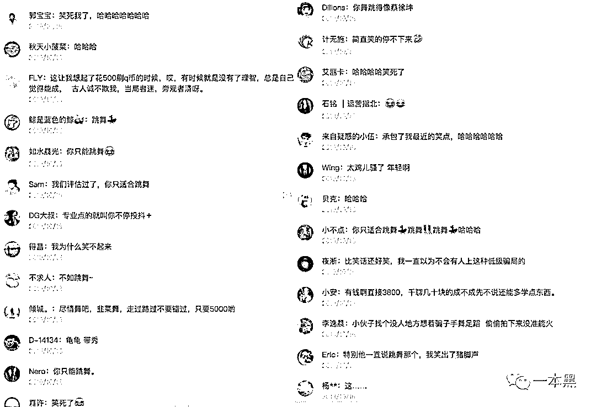
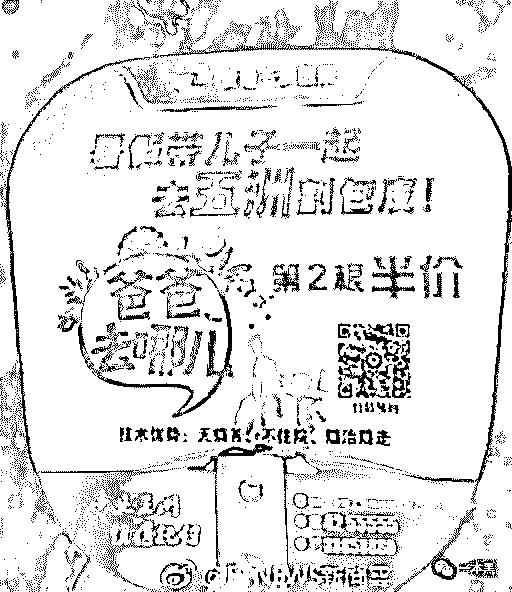
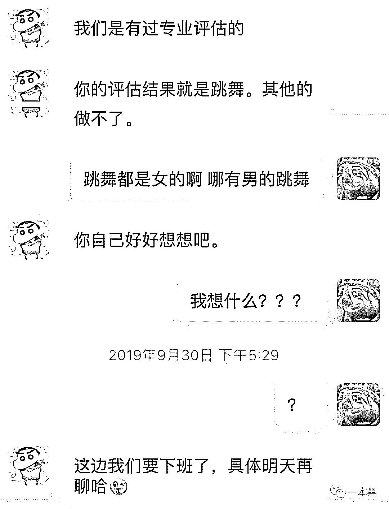
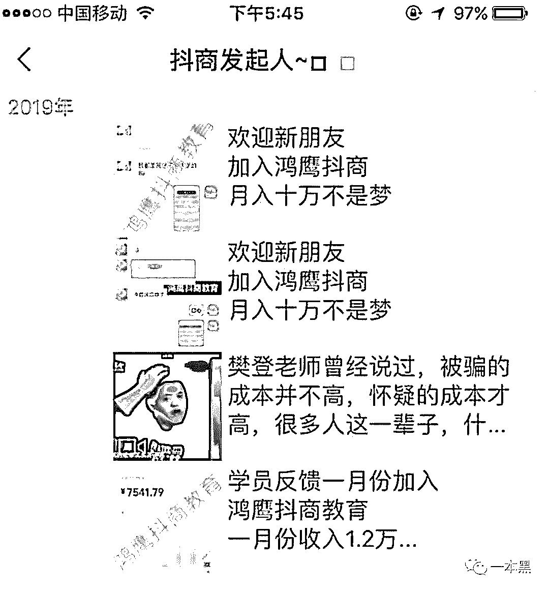

# “我花了 3888 上抖音网红培训班，现在是一名合格的韭菜”

> 原文：[`mp.weixin.qq.com/s?__biz=MzU4ODAwNzUwMQ==&mid=2247486503&idx=1&sn=a483d44fe891d65df2df4d6d6d44fefb&chksm=fde21d05ca95941389be2e580fb544943524401774ceed234812b6e5168ced37cca5c56e33a6&scene=27#wechat_redirect`](http://mp.weixin.qq.com/s?__biz=MzU4ODAwNzUwMQ==&mid=2247486503&idx=1&sn=a483d44fe891d65df2df4d6d6d44fefb&chksm=fde21d05ca95941389be2e580fb544943524401774ceed234812b6e5168ced37cca5c56e33a6&scene=27#wechat_redirect)

【黑话连篇】该栏目更多的是揭露事件或对事件的看法，以达到让人精神得到升华的目的。

* * *

以前写过很多割韭菜的文章，涉及行业千奇百怪，姿势更是一个比一个骚。那些玩空气币，玩垃圾项目投资的就不说了，最近还在有人给我留言说自己在网上玩 luo 聊被人敲诈的故事。我原以为大家在九年义务的教育背景下，都有良好的阅读能力，都会举一反三，但我发现我错了，我没考虑到韭菜和韭菜之间是有差别的，毕竟吸收的养粪不同，被割的程度也会是不同的。如果下次还在有人问我类似的问题，我建议他认真阅读，并背诵这篇文章。——（[裸聊、被敲诈、勒索、我查到对方在重庆开火锅店，是个抠脚大汉](http://mp.weixin.qq.com/s?__biz=MzU4ODAwNzUwMQ==&mid=2247485862&idx=1&sn=c966ac61c1e530fe0f1e029df41b06d2&chksm=fde21884ca95919237267636afa60ea43dda71fc9907f820c008c179292a83a9f18b90e50884&scene=21#wechat_redirect)）这种类似的事情看多了我自己都免疫了，毕竟我是受过专业训练的，再好笑我都不会笑的，除非实在是忍不住。有一句话说得好，精虫上脑的人是没有任何思考能力的，一点都没错，但奈何这是人的本性，没办法，控制不住那就只能等着被耍。我还想说另一句相似的话，**一个掉进钱眼里的人，也是没有任何思考能力的。**这是韭菜中毒的表现，得治。这句话适用于任何韭菜，我觉得他们应该把这句话抄下来，贴在自己的床头，每天早中晚默念三遍，一直念到九九八十一天，方能解毒。虽说韭菜们被割是很被动且残忍的，但我觉得并不是，我觉得他们应该是痛并快乐着，最起码，韭菜们打开了我们通往快乐之源的大门，他们是好样的。为什么这么说呢。前几天，我在朋友圈看到一篇文章，我是边看边笑，边看边笑。实在没忍住，我就把文章分享到了知识星球里，我当时心想，人得学会分享，不能我一个人笑。爱分享可是社会主义核心价值观，但我又有点怕你们被笑死。下面是社群里的评论截图，这画风大家自行感受一下。（后台回复【社群】即可进入）你看，韭菜是不是能给人带来欢乐，所以我求大家别再骂韭菜了，他们被割已经够惨的了，咱们可不能幸灾乐祸。其实这故事讲的是一个刚上大学的哥们，刚上大学嘛，都会逃课啥的，这很正常，所以他就天天宅在宿舍打游戏刷抖音，加上自己是外地来的，每个月两千块根本不够花，所以就想找点能赚钱的事干一干。人家刚上大学都想着赚钱补贴家用了，你们上大学那会都在想着干嘛呢，是不是整天只会逃课泡妞打......打篮球。要说这哥们有赚钱的想法是好的，但其实就是太钻进钱眼里了，别人一忽悠就信了，这么单纯的人上哪找去。他那会在网上看到有人教怎么做抖音运营，只需要 3888 元，就可以走上人生癫疯巅峰，当上网红年入百万。在和对方攀谈之余还进行了砍价操作，咦~，这情景怎么和 luo 聊那哥们有点像呢，不过遗憾的是这哥们的砍价功夫还不到家，死活没把这价格砍下来。要我说，我应该介绍他两认识认识，毕竟砍价再怎么也算是们手艺了。没办法，为了能像抖音上随便发个视频就几百上千万点赞的网红一样，这哥们一咬牙就乖乖交了钱。而对于一个月只有两千块生活费的他来说，这韭菜费，不对，这学知识的学费还是找同学借的。可没想到的是，原以为学完这门课后一个月能至少赚好几万，最后他却发现自己被割了韭菜。
而对方给他发的资料也仅仅只有三个文档，一个剪辑、运营、还有一个抖音大号案例，无非就是网上收集拼凑的一些东西。等他询问定制的教学计划到底是什么的时候，对方却让他去欧洲坐头等舱，说这是最近的风口视频。但明显这成本实在是太高，学费都是借来的，哪来的钱去欧洲坐头等舱啊。最后反复沟通后，对方说经过他们的专业评测，**注意，是专业评测。**说这哥们只能去街头跳热舞......没别的办法，只能跳热舞，死活都只能跳热舞，如果不会跳可以花 5000 元买他们专业的舞蹈教学视频。（图片来源于公众号李中二）结果问到最后，对方却说这 3888 元，只是给这哥们做评估的费用，而评估的结果就是这哥们只能跳热舞......只能跳热舞......事情的结尾当然是以删除好友告终，不过这哥们还被表扬了，被对方说是一名合格的韭菜，嗯，评价得很中肯，我也很赞同。（图片来源于公众号李中二）其实说到短视频培训，刚火起来那段时间就有很多人在做，就和以前很多做公众号培训的阿猫阿狗一样，没法，这玩意赚钱啊。而且这玩意可比公众号这种图文媒体火多了，门槛更低，拿个手机就能拍，简直美滋滋。相比图文媒体来说，这类短视频更能让人接受，更加碎片化，所以短时间内就有这么庞大的人群涌入，这样一来，商机是不是就跟着来了。各种培训满天飞，各种网红带货年入千万，看得我都心痒痒，这么大的流量池谁不想上去薅口肉吃。但任何行业刚起来的时候都会乱象丛生，短视频也不例外。抖音培训骗局多的是，之前就有报道说有骗子公司打着官方的旗号，做着非法敛财行为。而声称的培训内容，仅仅只是帮别人注册了一个新的抖音号。你看，傻子的钱就是这么好赚，奇妙又魔幻。短视频风口能赚钱这事不假，人人都知道，网红随便带个货就能日入百万，赚得盆满钵满，谁都想抓住这个机会，所以你会看到有些传统电商现在都在转型为社交电商，或者说视频电商了。但这里面其实还会出现另一个问题，网红带的货正规吗？前几天朋友圈不就刷屏了一件事吗，一哥们想通过线上 KOL 带货，最后却被 KOL 忽悠的事， KOL 号称在微博带货的视频有 300 多万曝光，但实际上这哥们的货一件也没卖出去。这里面反应的一大问题，其实就是互联网虚假流量的问题，就和大妈买菜砍价一样，是老生常谈的话题。首先这哥们的产品本身就有问题，所有并没有得到大众的怜悯，反转过后更多的是当成一个笑话在看，一个线下骗子想通过线上骗子收割用户，最后却被上了一课的故事，这简直就是卖拐的剧本。我之前也在抖音上买过东西，收到的货不但鸡肋没法用，还他么贵。流量，果然是们好生意。说回抖音运营培训，现在市场上的很多课程可以说是参差不齐，制作精良的课程花点钱学习一下别人的经验无可厚非，怕就怕在有些不正规的培训机构，打着造梦的口号去忽悠想要进场的小白。教授的课程全是教人怎么抄袭搬运视频，拉人入局获取介绍费。口号还是那几个模板口号，什么错过了淘宝、微博、公众号，还要错过抖音吗？话虽然没错，但怎么有股掺杂了令人恶心的味道呢！还有什么如何一条视频涨粉上百万，一天变现 3 万？如何通过抖音三个月带货变现 300 万？点进去一看尽在那放屁吹牛逼。这类文案往往能吸引很多不明真相的普通人，一旦你相信，那就只能等着被割了。交钱后他们会把你拉进一个群里，群里定期更新一些资料，你的任务就是看资料自学，这些资料上面说过了都是网上拼凑起来的。整个流程下来无非就是教你怎么养号，怎么拉人付费进群，然后拿回扣。本来想着花钱进来学知识，最后却被当韭菜给割了，不仅如此，你还得帮着别人割另一波韭菜，是不是很刺激。其实网红哪有这么好当啊，你所看到的抖音上那些有意思的大号，背后是人家一整个团队策划出来的结果，从选题到脚本，从拍摄到剪辑，都是经过反复推敲的，哪是你花几千块在这种垃圾培训机构就能学到的东西。我一直觉得，做一件事的前提是必须得感兴趣，别在出发的时候就想着要靠这东西赚钱，出发点都不对，那终点只能是坑。把事情先干好了，赚钱其实只是顺带的事，而不是玩些花花肠子。再说了，你以为现在所有的网红都过得美滋滋吗？你看到的也许只是表面。我认识几个女性朋友，一开始也是在短视频平台上拍视频玩，玩着玩着就积累了几十万的粉丝，然后就开始接广告、直播带货赚钱。一开始收入还不错，随便接个广告就能赚个小几万，勤快点一个月赚个小十万也不是不可能。但这收入一高人就容易膨胀，这些小网红一般白天睡到自然醒，中午起来吃个午饭下午逛个街顺便把视频就给拍了，各种名牌衣服包包那是以前敢都不敢想的。因为来钱确实是有点快，这些小网红只顾着平时享乐去了，视频也不知道拍啥了，即便拍可能就随便敷衍一下，慢慢的，视频的播放量和点赞急剧下滑。我那朋友我刚刚去她的账号看了下，最近的几个视频已经停留在了三四个月以前，点赞量也只有几千。再翻看朋友圈发现，已经设置了三天可见，往日的各种照片各种秀也已经消失不见。所以啊，别以为那些天天蹦迪、光鲜亮丽的网红很有钱，其实他们可能已经好久没有收入了。也更别听人一忽悠就心血来潮的想要涌入短视频这个行业，自媒体的门槛的确很低，低到只要你有手机你就可能成为网红，但也仅仅只是可能而已。那么多曾经爆火的网红，如今早已凉凉，这不是偶然事件，而是必然趋势。不管是公众号也好，视频自媒体也好，归根结底还是一门关于内容的生意，追热点也好，做深度也好，首先你得会思考，你得有方向。倘若看着别人做什么赚钱，你就跟着上，那多半是赚不到钱的。如果一门生意，连你这个门外汉都觉得有机会的话，那么它就不再是机会，更不是风口，但，你一定是那头猪，还飞不起来的那种。想要做流量的生意，那你得有持续输出内容的能力。如果没有还是算了吧，别争先恐后地去做别人的韭菜。韭菜，割多了也疼。**题外话：**这几天有不少读者让我讲讲双十一电商大促的套路，其实没什么可说的，无非就是一场民众认为占到了便宜，商家疯狂成交，皆大欢喜的购物狂欢而已。其实明白人都知道，这里面商家搞的什么预售、交定金、满减优惠之类的东西，只是为了迷惑大众，实际上真的让用户享受到优惠了吗，其实并没有。要我说，如果你想享受真正的优惠，还真不如去拼多多的百亿补贴看看，百亿补贴我推荐过好几次了，真的是电商界的一股”清流“。降价狠、库存足、品牌正、周期长，百亿补贴的很多商品都多次刷新全网史低价，简直就是价格屠夫。之前在百亿补贴买过 Airpods，后来又看到 iPhone11 补贴 500 元，别问，反正就是真香。 至于拼多多为什么要搞百亿补贴，其实之前的文章都分析过了，企业发展到一定的阶段必将面临转型或者升级，百亿补贴就是打响自己品牌升级的第一枪，所以才大手笔抛出百亿去补贴用户。最后，附一个百亿补贴的入口。

<mp-miniprogram class="miniprogram_element" data-miniprogram-appid="wx32540bd863b27570" data-miniprogram-path="pages/index/index?target_page=%2fpages%2fweb%2fweb%3fspecialUrl%3d1%26src%3dhttps%253a%252f%252fmobile.yangkeduo.com%252fbrand_activity_subsidy.html%253f_pdd_fs%253d1%2526_pdd_tc%253dffffff%2526_pdd_sbs%253d1%2526refer_scene_id%253dwxapp_ybh1024" data-miniprogram-nickname="拼多多" data-miniprogram-avatar="http://mmbiz.qpic.cn/mmbiz_png/I3ht2WMGrPhAtiaFy4pxb6lZusKOGeMn6NKIlaIdSyYKerXgoHoIunHvmrTWCibQ1PYwO2OhQoe2RWm22Yeib78hQ/640?wx_fmt=png&amp;wxfrom=200" data-miniprogram-title="百亿补贴，一起薅羊毛" data-miniprogram-imageurl="http://mmbiz.qpic.cn/mmbiz_jpg/sVQx2tT1ziaXHciaqyN2IgY2euVwmxoCA264tBzee6udFxjmWQCupibdrDf5bsFq3Ec5HTUjoQgtSWicTRvfhibYa8A/0?wx_fmt=jpeg" data-miniprogram-type="card" data-miniprogram-servicetype="0"></mp-miniprogram>

* * *

推荐阅读：

[私密社群，快上车](http://mp.weixin.qq.com/s?__biz=MzU4ODAwNzUwMQ==&mid=2247486383&idx=2&sn=0821d0bff33285d235b2e1b9af9a9e27&chksm=fde21a8dca95939b496421a2177f83d8022e5a25ce95ea8b2929b17b26fe95aeb5ca902b722a&scene=21#wechat_redirect) 

[国庆出游住酒店被偷拍、房门被强行打开，怎么办？](http://mp.weixin.qq.com/s?__biz=MzU4ODAwNzUwMQ==&mid=2247486399&idx=1&sn=54fc1787c019cad282ebc313971993bc&chksm=fde21a9dca95938ba93690487a435e85c548902b209f80ffc4718275c17605cec48812a1da9f&scene=21#wechat_redirect) 

[新浪微博，求你别再接赌博广告害人了](http://mp.weixin.qq.com/s?__biz=MzU4ODAwNzUwMQ==&mid=2247486480&idx=1&sn=1739239edcfddc5e78dda2588a59fb75&chksm=fde21d32ca959424171c09330be3774ad7338006d7234da1ad347e62cfaa59b8950668f33cde&scene=21#wechat_redirect)