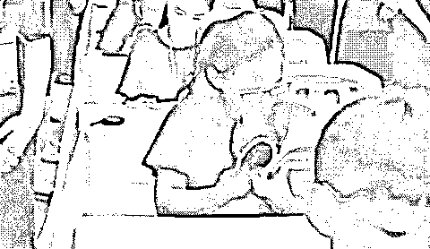

# 我潜入了价值 1w4 的量子波动速读班，现在决定向大家倾囊相授！

> 原文：[`mp.weixin.qq.com/s?__biz=MzU4ODAwNzUwMQ==&mid=2247486494&idx=1&sn=4c16a5973417844e6e87852aa00f909e&chksm=fde21d3cca95942a3e5c6f81ba0f7d566208858ebd3c63b10e8a8e50b94f94c7c3e1d9b09f99&scene=27#wechat_redirect`](http://mp.weixin.qq.com/s?__biz=MzU4ODAwNzUwMQ==&mid=2247486494&idx=1&sn=4c16a5973417844e6e87852aa00f909e&chksm=fde21d3cca95942a3e5c6f81ba0f7d566208858ebd3c63b10e8a8e50b94f94c7c3e1d9b09f99&scene=27#wechat_redirect)

大家好，我是老黑。给大家讲个好玩的事，大概在我上高三的时候，那会成绩不是特别好，无意间在网上看到一本叫【超右脑照相记忆】的书，说是只要练成，看任何东西都可以像拍照一样的深深刻在脑海里。
那会正值高考，大家都在做最后的努力，我当时就像张无忌掉进悬崖捡到九阳神功一样，祈祷这“神功”能助我高考一臂之力。后来就找各种渠道买了一本，气人的是，拿到手的是一本复印的黑白盗版书。结果还像宝一样的藏起来不让同学发现，生怕别人知道以后变得和我一样厉害。那会每天上课啥也不干，就在那研究怎么能像照相一样的把书上的知识点记下来。后来我大学毕业工作后，逐渐的就把这事儿给忘了，直到我前段时间在微博看到一则“量子波动速度大赛”的帖子。 我才突然想起，这他么不就是一个东西吗？原来我也曾深受其害！今天这篇文章来自毕导，希望大家都能认真读一读，可千万别被伪科学给骗了。 作者：毕导 简介：处女座理工男，用科学的眼光专注一本正经地胡说八道。 **01\. 从听说到嘲笑**这几天水微博的时候，我看到了一则**“量子波动速读大赛”**的消息。大概是运用量子波动的力量，**让孩子在短短几分钟内看完一本十万字的书籍！**现场图如下：
第二个小孩有点划水这踏马不就是一堆小孩在瞎翻书吗？和我找书里夹的私房钱的样子有区别吗？夏天还扇得比较凉快，冬天脑子会被吹坏吧！而且.....**这踏马和量子波动有个 p 关系啊！******量子和波动不是普朗克薛定谔他们的物理概念吗！**********怎么就能快速读书了啊！**********我查了下，发现这量子波动速读还不是个例，全国类似的教学机构遍地开花，我感觉自己为数不多的智商都快被他们翻书掀起的风给刮走了...**** ************北京、杭州、绍兴等多地的量子速读现场********仔细一看，发现里面有的娃翻书时，连书都拿倒了……****************有的娃，速读都不需要用眼睛看，蒙着眼罩就汲取了知识！我猜想是利用了书的知识波绕过眼罩发生衍射从而被看到。**** ************当然，也有清醒的小姑娘在一页一页看书，但周围人的诡异行径显然让她对世界产生了疑惑...**** ************这些迷惑行为发起者——培训机构宣称，这就是最前沿的量子波动速读(Quantum Speed Reading, QSR)，能使大脑呈现书本的动态影像，帮助孩子们高效阅读，翻得越快你的阅读速度越牛逼，甚至能拉近你和宇宙的距离！********听完后，我觉得今年的诺贝尔物理奖还是颁早了。应该由海森堡、狄拉克、薛定谔联合给这些牛逼老师颁奖，把装猫的箱子扣在他们充满智慧的大脑袋上。********事实上说出这话的老师连波动方程都写不出来，能做到向记者解释量子纠缠的时候不笑场都很难了************ ****我试图借自己浅薄的物理知识进行一番拙劣的猜想：从微观上看，书本中的知识既以“**书子**”的形态存在，也以“**书波**”分布在空间，这就是书本的波粒二象性。********高速翻书能增强其波的属性，根据测不准原理，发生量子隧穿效应，使书子穿越眼睛势垒进入大脑。****************闲得蛋疼的我去扒了一下这种神奇方法的创始者，发现它起源于日本，是由这位飞谷由美子(Yumiko Tobitani)女士发明的。****************在飞谷由老师的理论中，用这种方法看书甚至自带翻译功能，小朋友阅读外语会自动翻译成母语哦！**** ************起初我觉得这日本人真可恶，发明乱七八糟的邪说骗中国人。后来我发现，她的理论不止在中国蔓延，在欧洲、美国、印度等地都十分流行！****************当我被这辣鸡玩意笑到隔壁楼感应灯全部亮起的时候，我的脑海深处突然响起了一个理性的声音：为什么不分国籍、不分年龄、这么多人都相信这个量子波动速读课程？学生们在课上都学啥啊？难道这世上真是傻逼多？********鲁迅先生说过，科学就要质疑一切，包括质疑科学本身。我是一个科研工作者，职业素养告诉我，不要轻易嘲笑一个你不懂的新事物，除非它真的很好笑。********自古正邪不两立，我不入地狱谁入地狱？我决定亲自加入一个量子波动速读班，为大家解开心中的疑团！**********02. 从嘲笑到入教**********很快我就加入了一个量子波动速读的大家庭(以下简称**QSR**)，今天学了一下午。让我意外的是，我越学越体会到它的神奇！在我开发了我的阅读潜能后，我彻底放下了对它的全部成见！**QSR 牛逼！**********下面就让我这个二把刀根据个人的修为，向大家分享我的训练方法和成果。请大家摘下有色眼镜，从零开始跟毕老师学习。首先打开 QSR 官方网站！****************https://www.quantumspeedreading.com********网站名直接就叫 Quantum Speed Reading！这就是 QSR 正本清源的老巢！不像中国那些网站支支吾吾、用词玄幻，一看就是骗钱的，这个网站内容丰富，啥都敢说，把 QSR 课程介绍得清清楚楚。********翻书快只是 QSR 最微不足道的优点！学会 QSR，你还能**改善健康、实现愿望，甚至改变你的人生。************************第 5 条 Wish fulfillment 十分吸引我，我点开看了，真的很诱人！************************量子速读学的好，人生巅峰来得巧！这踏马谁不心动啊！果断报名！************************老师没回我，我先就着教程开始了自学。QSR 的训练主要分为三个阶段：**图像训练，眼训练，快速翻书训练。****************************第一课，看火。**闭上眼睛，深呼吸三次，在下图中盯着上方小黑点 30 秒，再把视线移到下边的小黑点。******************有没有看见下面的木堆上燃起了一团红色的火焰！这就是神奇的补色原理！由于视觉暂留效应，长时间盯着绿色的东西，你的眼睛就会看到红色的残像，非常科学！********如果你看见了，就过了第一关。老师说如果没看见，就深呼吸重看。**********第二课，看 3D 图像。**请大家盯着图中下方的紫色点 30 秒。告诉我，伴随着被紫罗兰吸引的蝴蝶，你还看到了什么？****************没错！蝴蝶飞起来了！！！我发誓我没骗人！起初我盯了半天啥玩意都没看见，后来在一起学 QSR 的伙伴的点拨下，我看到蝴蝶和紫罗兰发生了位移，蝴蝶开始飞舞了！**** ****你要是第二关都过不了，可能真的没啥天分，先往后学吧。**********第三课，脑补。**这一课其实比较水，老师说就是想象自己站在沙滩上，海浪拍岸，随着海浪节奏呼吸。然后想象自己站在广阔的平原上，风中有个气球在摇曳，想象你的呼吸把气球吸近吹远。**********第四课，飞入。**这一课非常难，我学得很差。********闭上眼眼，想象你站在一面巨大的镜子前。突然镜子里的你变成了一半大小！又变成了 1/4 大小！直到你的身体变成了看不见的粒子！********下面是关键一步！**想象你飞进了一本书**，看看书里写了什么！然后抓起你面前的随便一本书，对自己说：“这本书是我的朋友。”想象人书合一！集中精力，飞到书中！写出你看到的内容！********然而我飞入了一堆书，屁都没感受到。****************老师说，对初学者而言，推荐用图画书，先学下一课吧。**********第五课，人工照明训练。****盯着一个能红黄绿变色的灯泡，离开 2 米，盯个 30 秒，关灯，感受眼睛上残留的光。************这一课的难点主要在于这种灯很难找。毕竟你去蹦迪的时候盯着顶灯看可能被 DJ 当成傻子，到十字路口离着 2 米盯红绿灯又会被交警带走。**************************第六课，眼睛训练。****眼球跟着箭头方向运动，脑子里想象着地球上的风、雨、云、海的运动。它可以扩大你的视野并增强一目十行的能力！理论上此时应该能听见风雨大海的声音。**************************哪位听到的话，希望在评论区里说一声。****** ********第七课，疯狂眨眼训练。****只要眨眼足够快，你的大脑就会不知道你的眼睛是打开还是关闭。持之以恒，你就能闭着眼睛看到东西了。****************第九课，QSR！**终于，在经历了无数准备工作之后，我们终于来到了课程的尾声！**********戴上眼罩，快速翻一本你已经看过的书，与它合二为一，集中精力感受你看到的内容！如果不确定可以摘下眼罩对对答案。长期训练，你就可以摘下眼罩，直接利用 QSR 法快速读书了。********老师特意强调，只要你用了 QSR 法看书，即使屁都没读进去，这些书的量子信息还是会输入到脑子里，总归是有好处的。********终于，我已经自学完了 QSR 的全部课程！下面让我们来试试用量子波动速读读一本《薛定谔传》！****************好的，速读失败。我觉得老师的方法很严谨，应该没啥问题，可能还是我不够努力吧。********总之，上了一圈 QSR 课程，我的眼睛确实有被训练到，虽然有点瞎，但是很充实，注意力也难得集中了一个下午。********估计那些家长也是这么入坑的。对方先用一些没毛病的测试让你相信，再用你不懂的问题唬你，于是你心里就种下了焦虑的种子：**哎呀这个我（的孩子）不会，怎么办呢？******！**************************03. 从入教到创造**********体验了这种教育诈骗后，我发现其实大众很容易被前沿科学词汇糊弄。看来教育骗局存在一个通用公式：**** ************照这个思路，我随便搞几个科学词语就能设计课程了。下面三节课程从明天起毕老师正式开班授课！欢迎大家报名学习！**** ******1、卷积神经网络深度学习法************【原理】**在计算机技术的不断发展中，科学家发现了计算机和人共同存在的神经系统——卷积神经系统，通过对人类**卷积神经**的不断训练，就能掌握深度学习的方法。

**【教学大纲】**让孩子**一边做卷腹运动一边学习**，激发孩子潜在神经系统的卷积神经灵敏性，让孩子掌握最深度的学习方法，从此课本上的东西一看就懂，一学就会。****************真·卷肌运动**********2、虫洞理论下的八维空间全脑开发************【原理】**人脑开发只有 5%-10%，本质原因是眼睛作为心灵的窗户，视力范围却只有 100 度左右。随着人类的虫洞以及八维空间的探索一步步深入，科学家发现**后脑勺的****隐形视力**被开发后，可以激发人体内的虫洞连通，唤醒八维空间的脑容量。**********【教学大纲】**幼师通过一边旋转一边让孩子阅读，可以刺激孩子的后脑勺视力，当孩子训练到后脑勺可以读书时，说明体内的八维空间虫洞已经打通，大脑全面开发。****************脑开发现场**********3、电子跃迁心算法************【原理】**物质和人体在高能级向低能级转变的过程中会释放能量，而能量的转变本质上就是π电子向π*电子的跃迁，而圆周率π是一切运算的内核，掌握了圆周率，就掌握了运算根本。**********【教学大纲】**先通过训练**边跳跃边口算**的能力，可以让孩子们感受跳跃过程中能量跃迁的变化，进而领悟到数学运算的本质，从此**贯通微积分，口算平方根。******************电子跃迁教学法实操现场**** 

****看，复刻一个教育骗局是多么的简单啊...****

* * *

****可能很多人说家长是傻吗？这么手法拙劣的骗局，怎么都往坑里跳呢？不是这届家长不行，而是**当你有需求又不甚了解某方面时，就很容易被套路。******

****大家扪心自问，你有没有吃过酵素、买过美白丸、试过生发剂？再摸摸头发说，这些东西有效果吗？**反正我是没有**。********但还是希望大家擦亮眼睛，**用知识消灭信息差，用科学对抗伪科学**！********一本黑新社群已开通，社群名字叫做【一本黑的朋友们】，它没有一个具体的定位，里面会聊赚钱案例、想法、思路；它同时也是一个资源对接平台，帮助大家寻找可以合作的资源，但灰黑产严厉杜绝。
同时也会不定期邀请牛人嘉宾进来分享，听大佬的赚钱经历和想法，与牛人交流，是提升认知的捷径。总之，这是一个全新的成长型、认知升级、资源对接社群，后续会在社群内公布各种有趣玩法。**你还没上车？**

推荐阅读：

[私密社群，快上车](http://mp.weixin.qq.com/s?__biz=MzU4ODAwNzUwMQ==&mid=2247486383&idx=2&sn=0821d0bff33285d235b2e1b9af9a9e27&chksm=fde21a8dca95939b496421a2177f83d8022e5a25ce95ea8b2929b17b26fe95aeb5ca902b722a&scene=21#wechat_redirect) 

[国庆出游住酒店被偷拍、房门被强行打开，怎么办？](http://mp.weixin.qq.com/s?__biz=MzU4ODAwNzUwMQ==&mid=2247486399&idx=1&sn=54fc1787c019cad282ebc313971993bc&chksm=fde21a9dca95938ba93690487a435e85c548902b209f80ffc4718275c17605cec48812a1da9f&scene=21#wechat_redirect) 

[玩人性、玩套路，还是社交电商又狠又骚](http://mp.weixin.qq.com/s?__biz=MzU4ODAwNzUwMQ==&mid=2247486418&idx=1&sn=f32d8db5d6b33a5d2697bb4c83aa0baa&chksm=fde21af0ca9593e6d8aae5f5dad4b2dc373f59655edaac05ca67761587bd67cd513c858ff56c&scene=21#wechat_redirect)****