# 400 元帮你还百万债务，众筹平台是救星还是骗局？

> 原文：[`mp.weixin.qq.com/s?__biz=MzU4ODAwNzUwMQ==&mid=2247486978&idx=1&sn=7120085c9f4d0864a29c5a20182fe29d&chksm=fde21f20ca959636a9b88585571a269efbb3e13595d74d2b8e00a1d6c47f1fa24030282cf1c5&scene=27#wechat_redirect`](http://mp.weixin.qq.com/s?__biz=MzU4ODAwNzUwMQ==&mid=2247486978&idx=1&sn=7120085c9f4d0864a29c5a20182fe29d&chksm=fde21f20ca959636a9b88585571a269efbb3e13595d74d2b8e00a1d6c47f1fa24030282cf1c5&scene=27#wechat_redirect)

【黑话连篇】

该栏目更多的是揭露事件或对事件的看法，以达到让人精神升华的目的。

* * *

昨天，我在微信群看到一条消息，在众筹平台有钱还，只要 400 元，就能帮你还完百万债务，不限于网贷、高利贷，连房贷、车贷、信用卡都可以还。       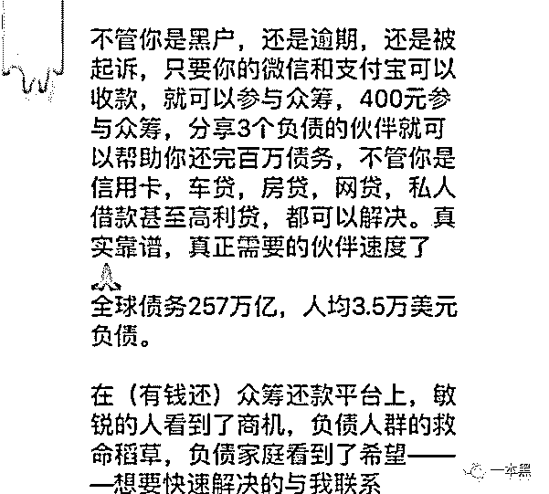       还有这样神奇的平台，绝对是在造福广大人民。毕竟现在流行超前消费，无论大学生还是职场人，谁能没点债务。特别是很多人深陷套路贷，被那些无良公司爆通讯录，咒骂恐吓，每天承受着巨大的精神压力，甚至用跳楼自杀来寻求解脱。他们已经借遍身边所有人，无比希望能有人发善心，帮助还债。但是高兴之余，我不免有个疑问。小时候，我们都有过美妙的幻想，如果每个中国人给我一块钱，我就能成为亿万富翁。后来我们知道，世上没有不劳而获的事情。但在这个众筹平台，奇迹发生了，你只要付 400 元，就能解决百万债务。难道真有那么多人愿意无偿地拿出钱，帮助别人还债？他们到底图什么？我怀着强烈的好奇心开始研究有钱还。**所谓众筹还债就是庞氏骗局****我找到一个网站，号称是国内首个众筹还债平台，以前叫有钱还，现在改名为上岸，意思是希望帮助更多的负债者清债上岸，重获美好新生活！****它还发布了一个公告，对其他仿造者进行谴责。看来这个社会有爱心的人还是很多的，大家都抢着做众筹还债平台，帮助别人。****       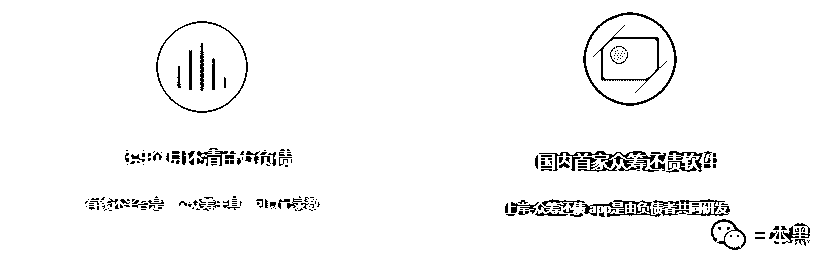       ****但网站上，我找不到任何公司信息，这有点奇怪，难道做官网的目的不是为了更好的展示公司吗？我在页面上找到专业导师的微信二维码，添加好友，寻求解惑。****导师说，这只是他做的导流网站，至于官网不重要，我只需知道这个软件可以赚到钱就行。****不愧是新模式的开创者，够霸气。****       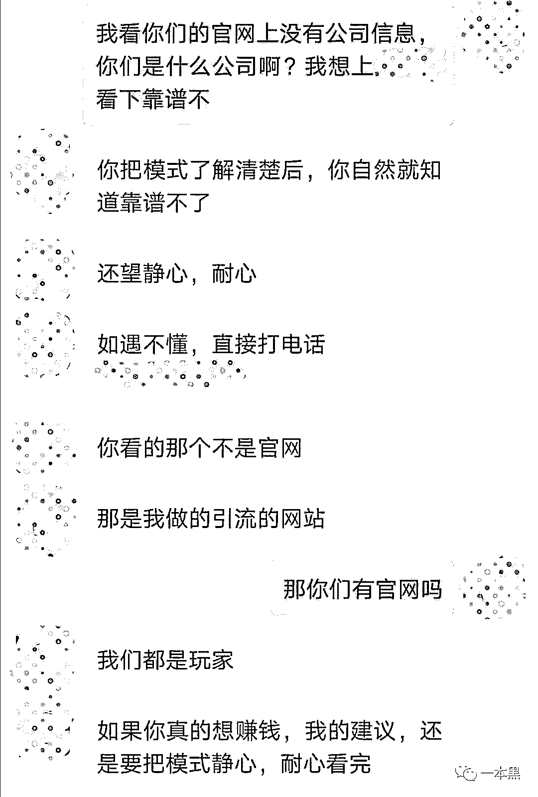       ****有钱还的初衷包装得很美好，说是一群深受负债之苦的人士，受到大病众筹平台的启发，开发出这个众筹还债平台，不仅可以帮助自己摆脱债务泥潭，他们还想推广出去，惠及更多人。****但不知为什么，这么好的 APP，你在手机应用商城是找不到的，只能通过链接下载。大概是那些审核人员太没有爱心了。****有钱还 App 将会员分为 9 阶，你的阶位越高，收到的众筹款越多。****如果你想成为 1 阶会员，需通过推荐人发来的链接，下载 App，注册，实名认证，输入推荐人的邀请码，上传自己微信或支付宝的二维码。****之后的资金交易完全是点对点，平台不作为中转站，所以它不属于资金盘。****最重要的是上传负债凭证。因为有钱还对外宣传，在你收到的众筹款能偿还全部负债后，会将你移出 App，避免你多收钱，影响帮别人还债。****这看起来很好嘛，平台的规定完全是为负债人考虑。但其实，你大概率是不会被移出的，因为你拉的人头越多，平台越赚钱。     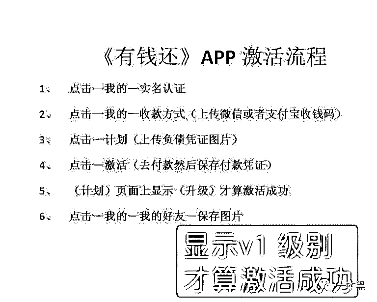       ****为成为 1 阶会员，你付出的 400 元中，200 元是给你的推荐人，另外 200 元给 9 阶会员。因为平台宣称“先付出，后收获”，你要先为别人还债。****好像也合理，每人都有付出，才是众筹。****有钱还是 3*3 的运作模式，每次升阶要付给上线 200 元。****1 阶时，你要拉 3 个下线，当这 3 人都付款 400 元成为 1 阶会员时，你就能获得 3*200=600 元。****下线会再发展下线，所有下线加起来，组成你的团队。你的团队人数越多，你就升阶越快，赚钱越多。****当你付 200 元，升为 2 阶，你的团队成员也想升 2 阶，你可以收到 3*3=9 人的 200 元，即 1800 元。****当你再付 200 元，升为 3 阶，你的团队成员也想升为 3 阶，你可以收到 3*3*3=27 人的 200 元，即 5400 元。****相当于每升一阶，你可以收到翻 3 倍的众筹款。当你升到 9 阶，总共可以收到众筹款 590 万元。****       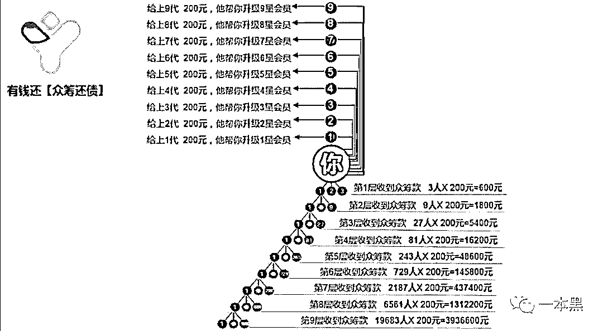****只要拉人头就能还债，这么好的事情肯定有很多人到处宣传。****随后，我找到众筹吧，关注者有 8 万多人，很多人在推荐众筹还债，除了有钱还，还有其他产品。但这些产品的本质是一样的，通过不断地拉人头来获得大笔众筹款。****       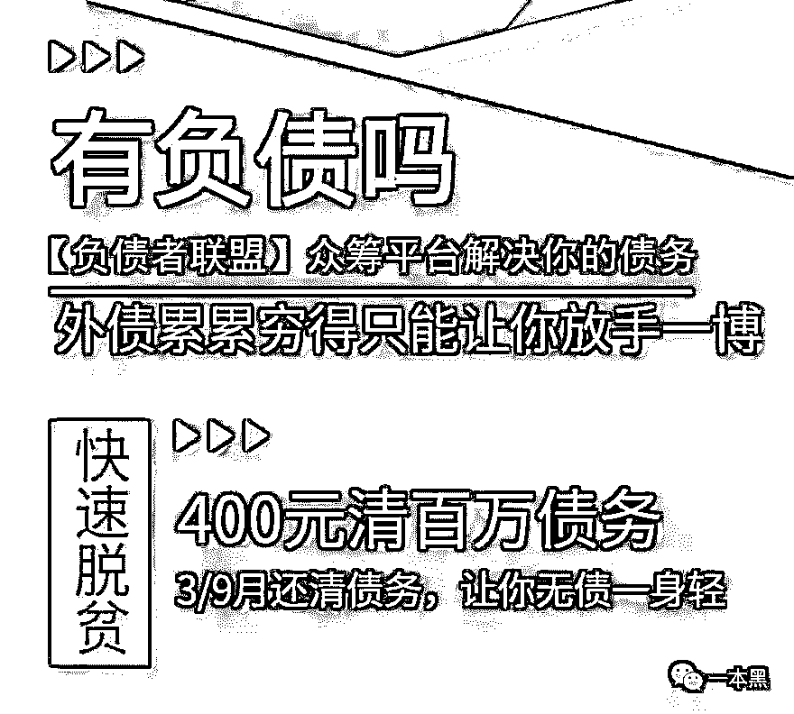       ****我在贴吧加上一个人的微信，他极力向我推荐有钱还 App，还向我展示他的收款记录。****              ****之所以不是 200 元，而是多 1 分，他向我解释，担心都是整数，次数太多，会被平台检测到。****他还录了一个视频向我证明，很多人加他微信好友，咨询有钱还。****看到这，你是否疑惑，难道有钱还 App 真是个帮人还债的工具，在做善事，是我们对它有偏见？****只是，如果这个产品真的那么好，有债务的人又那么多，应该瞬间引爆市场，为何现在推广下载还处于偷偷摸摸的状态？****不知道你有没听过庞氏骗局，就是用后来者的本金作为前面人的收益。****毕竟钱不会凭空增加，有人钱变多了，就一定有人钱减少。****在有钱还的平台上，一部分人能够还清负债，他们获得的众筹款全部来源于后来者付出的 400 元。****只有源源不断的新人成为会员，有钱还的系统才能运作起来，那些先加入者才能赚到钱。所以平台对会员的唯一要求就是不断地拉人头。****比如上岸平台的所谓导师，作为先加入者，肯定赚到了很多钱，他还特意问我有没做过互联网推广，是否有团队？果然用心很深。****       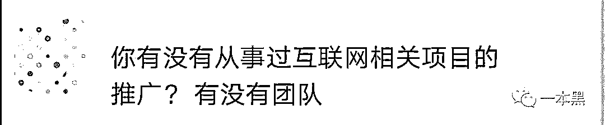       ****实际上这就是个击鼓传花的游戏，当鼓声停时，后面没人再加入有钱还系统，这个骗局就崩溃了。****但是呢，系统的设计者很聪明。对于最后一批成为会员的倒霉蛋来说，400 元并不多，损失了也不会暴跳如雷，所以大概率不会去报案。****从这个角度看，有钱还 APP 的生命力应该不短，能撑个 2、3 年。很多人会把它作为一个致富手段，就像赌博的以小博大一样。****但既然是赌博，赌客就一定有必输的一天。******买个有钱还 App，运营更赚钱********我在搜索引擎输入“有钱还”，看到一堆为有钱还 App 提供系统开发，服务支持的广告。********       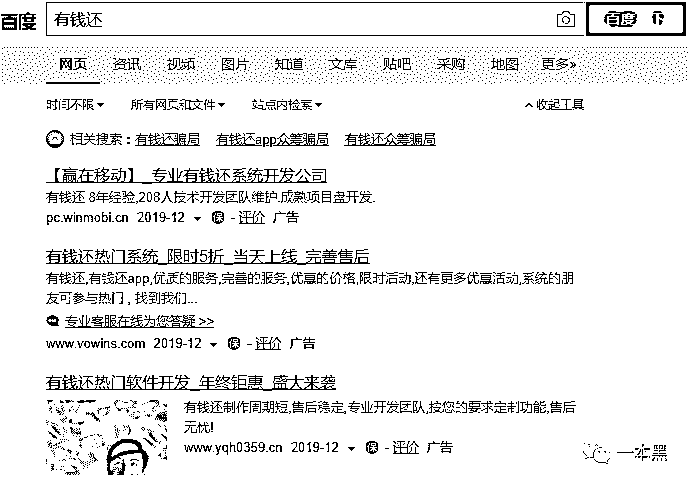       ********看来这真是个快速赚钱的好机会。我打开一个广告，扫描客服的二维码，假装是来买系统的进行咨询。********客服很热情，直接发来测试系统。我在后台可以清楚地看到会员的手机号、身份证正反面、负债记录等隐私信息。********这就有个风险，万一运营平台的人不小心，把这些信息泄露出去，会员们可能会受到网贷公司的骚扰，给本就负债的生活增加麻烦。********     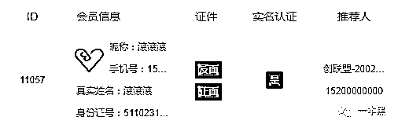       ********有人会真以为，有钱还 App 是做公益的，无偿帮助那些欠款人还清债务，因为 App 没有抽成，所有资金都是直接通过二维码到达个人账户，App 好像没有获得好处。********这就是单纯呀，运营 App 需要钱，哪有人这么无私奉献？如果真不赚钱，没人来买这个系统，那些服务商干嘛去做竞价排名广告？********客服说，有个客户很厉害，运营有钱还 App,在一星期内赚到几十万，我只是笑笑不说话。********我看着 App 的服务报价，包年套餐 12800 元，含顶级域名、苹果和安卓双 App，一年服务器费、安全防护、售后。算下成本和收益，买这个 APP 真是一笔好投资。********       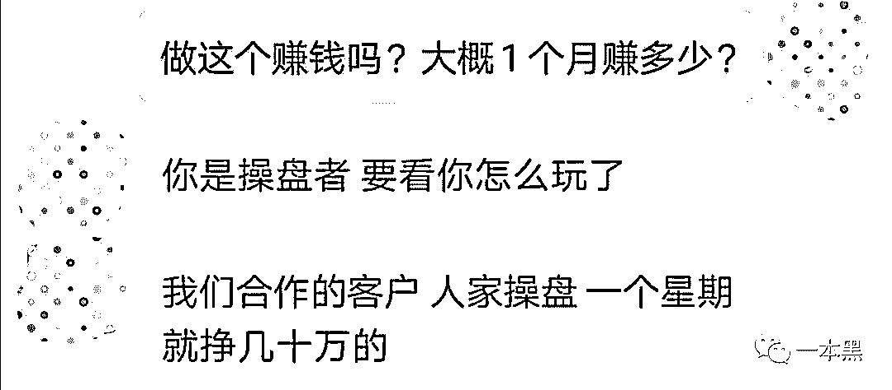       ********为了避免误导，那个客户赚那么多钱，是因为本身厉害，而不是有钱还平台好，我又问其他客户做的怎么样，他们有亏钱吗？********客服很自豪地回应，客户买了系统后，再找他们，基本都是有些系统上的问题需要解决，或者介绍新客户，还发来一些客户的截图，证明做这个真能赚钱。********       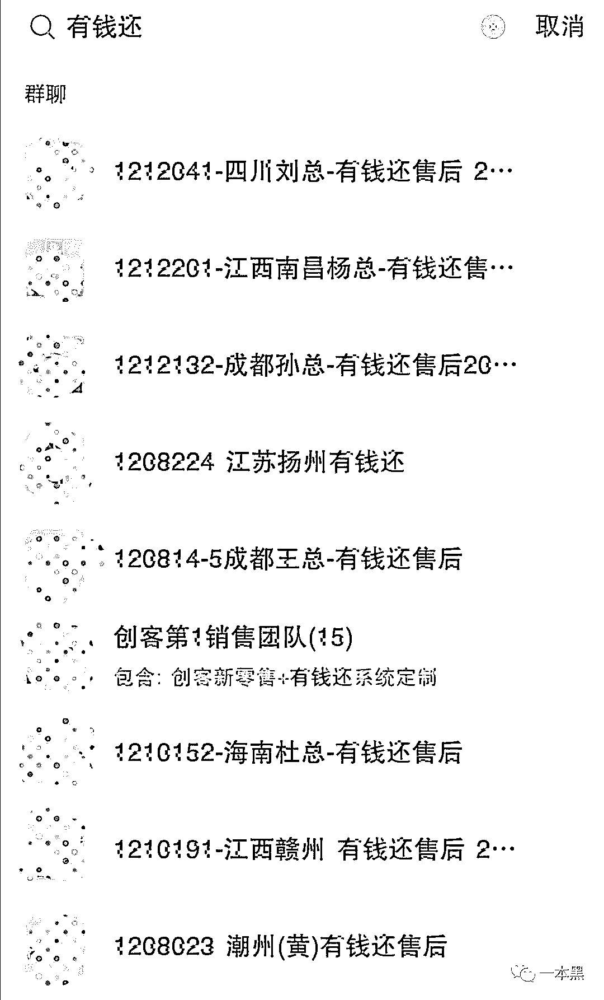       ********那么运营有钱还 App 的人是怎么赚钱的呢？********前文有提到，新人成为 1 阶会员时，除给推荐人 200 元，还要给 9 阶会员 200 元。********但这个 9 阶最开始是谁呢？所有人都要从 1 阶会员升上去，那时还没有 9 阶会员。所以它就是平台，相当于每个新人都要给平台 200 元。********       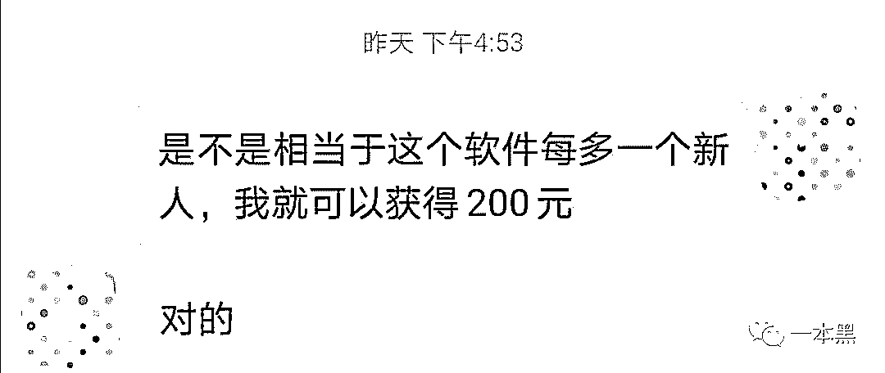       ********这就是运营平台的优势了，虽然在开始比较难，要把平台推广出去，要拉一群人成为会员。********但是只要这些人认识到平台的好处，想通过拉人头赚钱，愿意付出时间和精力，在微信群、朋友圈、论坛等各个地方推广平台，自然会有很多人受到引诱，成为会员。********作为运营者哪怕什么都不做，都可以躺赚。********这还只是运营者的一项收入来源，客服说，要等我买系统之后再说其他方法。**********你可能在帮别人发财************一本黑之前写过很多传销、各种包装华丽的骗局，其实原理都不复杂，说出来你也能理解。************被骗的人往往是想找到赚钱的捷径，来个以小博大，快速富裕，结果被现实狠狠地教训。************像这个有钱还 App，它号称是众筹还债，但想下就知道，别人为什么会帮你还债呢？你收到钱，肯定就有人亏损。************但对那些深陷债务泥潭的人来说，哪怕有一根救命稻草都要抓住，就算别人告诉他，这是个庞氏骗局，恐怕他也不愿意信。************同时很多没有债务的人，看到这是个赚钱的机会，只要抢先加入，就能通过拉人头赚钱；或者直接买个 App，自己运营，牟取更大收益。************系统服务商也眼光敏锐，知道负债的人那么多，这种众筹还债平台肯定受欢迎，直接卖 APP 和服务，每笔钱都赚得很稳当。************当这场多方参与的庞氏骗局破灭时，最后一批成为有钱还会员的接盘侠，单人只损失 400 元，并不多。但是一万人加起来，损失就有 400 万。************他们的付出直接帮助少数骗局参与者发财，我想这才是“众筹还债”的真面目吧。************牺牲小我，成全他人！*************************大家好，我是老黑。**************为防止失联，扫描下方二维码关注我小号。***************推荐阅读：**************[私密社群，快上车](http://mp.weixin.qq.com/s?__biz=MzU4ODAwNzUwMQ==&mid=2247486383&idx=2&sn=0821d0bff33285d235b2e1b9af9a9e27&chksm=fde21a8dca95939b496421a2177f83d8022e5a25ce95ea8b2929b17b26fe95aeb5ca902b722a&scene=21#wechat_redirect)************[心灵培训才是当代智商收割机的 top1](http://mp.weixin.qq.com/s?__biz=MzU4ODAwNzUwMQ==&mid=2247486873&idx=1&sn=5f0a2b851c0f036379c759c54086f055&chksm=fde21cbbca9595ad9353ad10160aebd04399ae7bff000dc4e7894538950c385282d193730121&scene=21#wechat_redirect)************[花两万块让孩子学脑门吸铁勺？](http://mp.weixin.qq.com/s?__biz=MzU4ODAwNzUwMQ==&mid=2247486934&idx=1&sn=bac18372b12157b53a7d1244b26b0455&chksm=fde21cf4ca9595e2406f08caa8af660714d148c60c3bbd9ffcb1433fc9b696c6bdb4072543c0&scene=21#wechat_redirect)[恕我直言，这届家长可能要治治脑子](http://mp.weixin.qq.com/s?__biz=MzU4ODAwNzUwMQ==&mid=2247486934&idx=1&sn=bac18372b12157b53a7d1244b26b0455&chksm=fde21cf4ca9595e2406f08caa8af660714d148c60c3bbd9ffcb1433fc9b696c6bdb4072543c0&scene=21#wechat_redirect)******