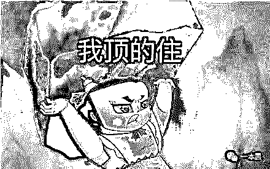
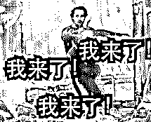
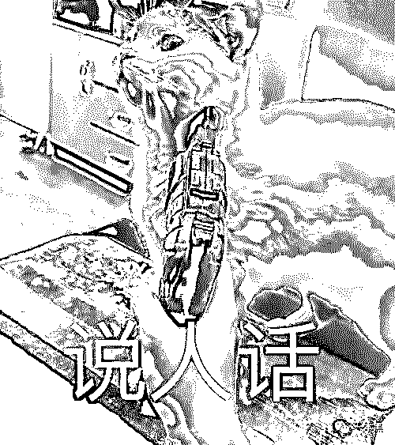
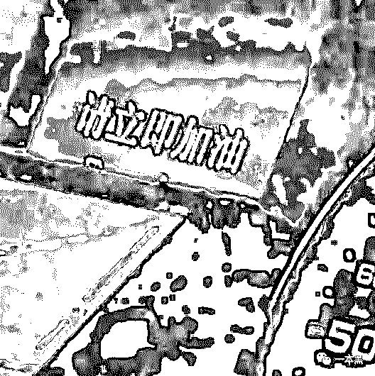

# 为什么大家都在给拼多多打广告？

> 原文：[`mp.weixin.qq.com/s?__biz=MzU4ODAwNzUwMQ==&mid=2247486847&idx=1&sn=f1aa9c40a3fe4586bd1b534c05c7568c&chksm=fde21c5dca95954b872977a92036b43c75c995c93e2d04d8e5ce4a322bc8738e4c2413892abf&scene=27#wechat_redirect`](http://mp.weixin.qq.com/s?__biz=MzU4ODAwNzUwMQ==&mid=2247486847&idx=1&sn=f1aa9c40a3fe4586bd1b534c05c7568c&chksm=fde21c5dca95954b872977a92036b43c75c995c93e2d04d8e5ce4a322bc8738e4c2413892abf&scene=27#wechat_redirect)

 上个月双十一，我看到很多人都在给拼多多打广告，这不今天双十二吗，我又看到很多大 V 在给拼多多打广告。

我就纳闷了，拼多多到底有什么样的魔力，能请得动这么多大 V，难道是有钱人的朴实无华吗？

不，我认为绝对不是。

我举起我枯燥的右手，点了一根枯燥的黄鹤楼，随着挡风的左手慢慢放下，我吐了一口烟圈，这感觉比事后还要精神，冷静分析一番后，我终于，得出了答案。

下面，请听我慢慢道来。

如果要评 2019 年的真香之王，我认为绝对非拼多多莫属，拼多多绝对是国内最经典的一个真香案例，还好网上没有关于这个奖项的投票，不然我该用计算机基础知识帮拼多多刷票了。

上个月还看过拼多多发布的第三季度财报，财报说拼多多 Q3 营收 75.14 亿元，净亏损 23.35 亿元。

当时我一看吓尿了，这还不算啥，我后来又翻了一下拼多多 Q1 和 Q2 的财报。

发现拼多多 Q1 营收 45 亿元，亏损 19 亿元；Q2 营收 73 亿元，亏损 10 亿元，这样一对比，拼多多可真是个败家子啊。

一个季度就能亏损十几二十亿，这谁顶得住啊。

可能你会想，拼多多不都上市了吗？为什么每个季度还亏损这么多钱。答案当然是他们搞的百亿补贴计划。

我在之前的文章也分析过，拼多多是做下沉市场起家的，玩的是农村包围城市的路线。在拼多多做起来之前，那会阿里和京东已经稳坐头把交椅，说白了两人都是大哥。

这时候拼多多偏偏走了一条不寻常的路，那就是玩降维打击，走边缘化的竞争路线，把手伸向国内三四五线城市的消费人群。

那会拼多多就是主打便宜，但是大家都知道，任何平台起步阶段都不可能做到完美，所以早期的拼多多出现不正规商品也成了必然。

拼多多农村包围城市的路线走通后，这时候阿里、京东坐不住了，总不能看着自己头把交椅的位置被人替代掉吧。

所以这时候京东马上发布了对标拼多多的新产品，也准备进攻下沉市场。

但与此同时，人家拼多多不跟你玩了，正当阿里京东准备“下沉”进攻三四五线城市的时候，拼多多反而开始调整战略，开始往“上行”市场突破。

所以就有了后来的“百亿补贴”，百亿补贴这词我相信大家都不陌生，我也提到过很多次，它是拼多多获取一二线城市用户，战略升级，打品牌的手段。

这是一个企业发展到一定阶段必须要经历的战略转型，拼多多一边保持在下沉市场的活跃，另一边用“百亿补贴”获取一二线城市用户的认可。

虽然我不知道拼多多是否能突围成功，但我觉得拼多多高层说的一句话挺有道理的，他说：**“在我们看来，营收支出应该被视为长期投资和虚拟资产”。**

****

**这句话一下让我想到了当年外卖平台的补贴大战，都是烧钱的玩法，前期靠各种补贴吸引用户，让用户养成点外卖的习惯，等时机一成熟，补贴停止，开始变现。**

**所以，**百亿补贴在现在看来，一定是拼多多品牌升级的重要环节**，说人话就是洗白的同时培养用户的购物习惯。**

****

**拼多多不管是用游戏化运营做电商，还是烧钱补贴打价格战，他归根结底都是一个电商平台，到最后一定都是需要赚钱的，虽然赚钱的方式可以是 toC，可以是 toB，当然也可以是 to VC。**

**但这都不重要，重要的是现在拼多多真他娘的敢真刀真枪的花百亿去抢占市场，阔少年，没毛病。**

**我记得在 iPhone11 发布之前，很多人都在吐槽其造型雷人，摄像头夸张，没有创新很平庸，但事实上呢，越来越多的人开始在拼多多上购买 iPhone11。**

****

**没办法，拼多多百亿补贴里的 iPhone11 香啊，直接最低补贴 500 元，你说这谁能顶得住。**

**说实话，以前我也觉得拼多多挺 low 的，但看着身边用拼多多的人越来越多，我出于好奇先在百亿补贴上买了低价的商品试水，结果发现还真是那么回事。**

**截止到现在，我一共在拼多多上花了小几千块钱，买过吹风机、剃须刀、抽纸、酒，还买过 AirPods Pro。**

**虽然现在百亿补贴里 AirPods Pro 已经断货，但我觉得各位还是有必要尝试一下无线耳机，之前一直用的都是有线，每次放在兜里再拿出来总是缠绕成一团，很不方便。**

**所以这种高逼格的无线耳机不仅解决了这个痛点，还拉升了整个人的气质，嗯，真香。**

****

**前段时间还有朋友在社群问我，如果要买二手摄像机的话，哪些网站比较靠谱，我说如果你是新手的话，不建议买二手，这里面坑太多，还不如直接到拼多多百亿补贴里去看看，那补贴力度，小则一两百，多的话差不多就上千了。**

**随便一个尼康就补贴快两千，随便一个富士拍立得到手价才四百多，你说这玩意买来送妹子，妹子能顶得住吗？**

****

**自从我在公众号写文章分析拼多多百亿补贴之后，不少读者也抱着试水的心态去拼多多下单，结果下单后说自己总被砍单，问我怎么回事。**

**我说你在百亿补贴都买了什么，怎么我自己买的时候不会出现这种情况。**

**他说我买了个电脑，收货后感觉还不错，接着又趁补贴买了个 iPhone11，结果就被砍单了。**

**我说难怪呢，这种情况是拼多多把你当黄牛了。简单点说就是触发了某个风控逻辑，比如收货地址异常什么的。**

**不过这一点最起码说明了百亿补贴商品的可靠性，不然也不会有这么多黄牛盯着不是。**

**上个月我还说过，每次什么双十一、双十二，各大电商平台都会搞各种优惠套路，反过来看拼多多就实在多了，直接品牌低价，拒绝套路。**

****

**所以，今天双十二，它又挥着“百亿补贴”的大旗来了，不仅优惠力度大，玩法更是无套路，直接实诚低价，更没有繁杂烧脑的游戏化运营套路。**

**各种价格吊带友商，简直是双十一的一股“清流”。百亿补贴的商品会在成本价的基础上补贴 5%-50%（即商品销售价=成本价-补贴金额），保证售价都是低于市面上的行情价。**

**百亿补贴的商家资质会经过平台严格审核，并且拼多多联合中国人保财险，承诺假一赔十。**

**反正今天是双十二，拼多多已经开启了百亿补贴专场促销，活动期间，全网爆款补贴在加码，低过全网预售价，没有烧脑套路，直接薅就完事了。 **

****

**如果拼多多双十一的车你没有赶上，第二趟你也许可以上车逛逛。**

**以上，就是为什么这么多人给拼多多打广告的原因，没别的，人家是阔少爷，有钱，任性，敢真刀真枪的玩。**

**最后贴一个百亿补贴上车入口。** 

**<mp-miniprogram class="miniprogram_element" data-miniprogram-appid="wx32540bd863b27570" data-miniprogram-path="pages/index/index?target_page=%2fpages%2fweb%2fweb%3fspecialUrl%3d1%26src%3dhttps%253a%252f%252fmobile.yangkeduo.com%252fbrand_activity_subsidy.html%253f_pdd_fs%253d1%2526_pdd_tc%253dffffff%2526_pdd_sbs%253d1%2526refer_scene_id%253dwxapp_platform_ybh1212" data-miniprogram-nickname="拼多多" data-miniprogram-avatar="http://mmbiz.qpic.cn/mmbiz_png/I3ht2WMGrPg0nMFFia35iafc4iclCQobB3kZWoKRYUKEoOp013iaCOOiauNSgvicoUS91Hp5nKb53VAJM7ibtSsRl6Dvw/640?wx_fmt=png&amp;wxfrom=200" data-miniprogram-title="上车，薅死拼多多" data-miniprogram-imageurl="http://mmbiz.qpic.cn/mmbiz_jpg/sVQx2tT1ziaWMA2GTVTewictmZlDpD7XmL0jXPEy1iaUmla6JDmcyD3V6ym6YtsrGCJ5wczoGTiaXPoDAazkDz6eFw/0?wx_fmt=jpeg" data-miniprogram-type="card" data-miniprogram-servicetype="0"></mp-miniprogram>**