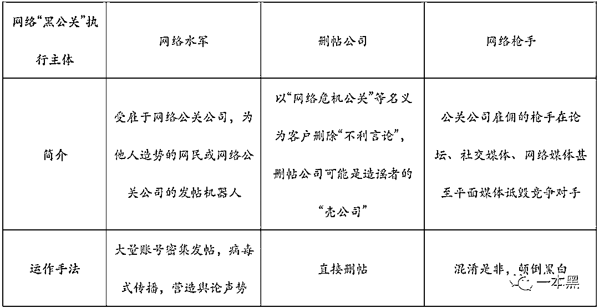

# 自媒体碰瓷，黑公关删稿，被阉割的真相和被操控的舆论

> 原文：[`mp.weixin.qq.com/s?__biz=MzU4ODAwNzUwMQ==&mid=2247486695&idx=1&sn=a50c11ab5df3d64e84cce72b1848321b&chksm=fde21dc5ca9594d37fc9f533b7f12e30174d5a976588fb475ac5a78f5bf5a03d7bfee33509dc&scene=27#wechat_redirect`](http://mp.weixin.qq.com/s?__biz=MzU4ODAwNzUwMQ==&mid=2247486695&idx=1&sn=a50c11ab5df3d64e84cce72b1848321b&chksm=fde21dc5ca9594d37fc9f533b7f12e30174d5a976588fb475ac5a78f5bf5a03d7bfee33509dc&scene=27#wechat_redirect)

【黑话连篇】

该栏目更多的是揭露事件或对事件的看法，以达到让人精神升华的目的。

* * *

这个世界上从来不缺逐利者，有人辛勤工作，夙兴夜寐；有人刀口舔血，战战兢兢。互联网上也同样如此，你永远也不会知道，网线背后的那个人此刻正在做些什么？是和我们一样辛苦码字，写些真相，还是操控舆论，制造混乱。自媒体时代崇尚言论自由，但有的时候，我们会混淆言论自由的边界。什么样的话能说，什么样的话不能说。说出去的话，发出去的文字，只要一经存在就不可能永远消失。但你知道灰黑产的存在，有时就是为了解决一些法律不允许出现的行为，譬如收费删稿和删稿收费。这两者是不一样的，收费删稿是我收你的钱帮你删别人的稿，删稿收费是你给我钱，我删掉自己写的稿。一个收钱办事，一个碰瓷收钱。一篇稿子造出一个江湖。**专业删帖，量大从优**我加了好几个负面处理的群，发现他们有的把删负面稿件/帖子称为危机公关，有的归为 SEO 优化。不管叫什么名字，穿什么马甲，干的事都是一样的——撤掉各大搜索引擎及门户网站、论坛上的企业负面信息。       这事要说技术含量，那还真谈不上。各个 SEO 交流论坛里都有专业的帖子告诉你怎样最快撤掉负面新闻，无非是投诉、举报那一套。一般的论坛、网站就是向平台方投诉，理由是诽谤造谣，侵害名誉并出具企业方的书面文档。要是这样行不通的话，就换个方法，用更多的信息覆盖。怎么个覆盖法呢？比如，有人在网上发帖说老黑人设崩塌，天天说自己帅，其实丑的一批。那这个时候，就只要找人发相同标题的帖子【老黑人设崩塌，真人令人泪目】，但打开一看，内容都是彩虹屁，还有各种美颜照。基本上只要压制住前三页的负面，保证打开都是反转的内容，这事就算搞定了。信息覆盖也是用的最多的方法，毕竟很多网站还是很有底线的，不会轻易折腰。如果是某度一类的搜索引擎，就投诉快照，可以略过文章来源由平台直接删除文章，不过这个方法的效果并不是很好。要是碰上所谓的“内部关系”，“我在 XX 有人”，那多半是看你面善好欺负。还有些大的论坛或者专业类网站，无非就是找关系，拼的还是人脉这码子事，虽然现在管得严了，但想赚钱的人总能找得到路子。至于那是真的很不知名的小网站，那“黑客”也能搞得定。虽然他们都说自己能处理全网负面，但私聊的时候都是看链接来决定做不做，然后再定价。他们承接的大多是四大门户网站、搜索引擎以及贴吧、微博以及其他泛生活类平台为主。专业论坛如丁香园这种是不可能搞的，也搞不定。     一般的负面处理，行业价格相差不大；如果是比较重大的事件，或者处理难度比较大的，每家的定价都不一样，具体问题具体分析。

> *贴吧 200 一条；**微博 1000 一条；**知乎 800 一条；**某百度下拉（推荐词）200 一条；**量大从优。*

一家企业想要删除负面，需要删除的绝对不止一个平台，一条帖子，也就是说想要解决一次负面，千元起步，上不封顶。有些还提供包年服务，20 万起。***来自北京青年报《有偿删帖一条三四千包年 20 万，苏州一伙“网络水军”7 人被拘》*删稿的才不会管你这条消息是造谣还是真相，反正给钱就删。给多少钱，删多少条。一切都明码标价，即使是真相，也同样如此。上月底，有个新闻报道说，著名直销公司 X 利曾花了 500 多万找了北京一家公关公司帮他进行 SEO 优化的工作。说是这么说，实际上就是清理网络上的负面新闻，其中包括百度、贴吧、天涯等网站的新闻及帖子。于是该公关公司及相关涉案人员因非法经营罪被抓了，其中有人获刑 9 年。大家可能并不清楚有偿删稿这事它其实是违法的，《刑法》规定，违反国家规定，擅自删除网站的负面新闻，破坏数据存储，是一种违法行为。即使你删完后又恢复了也还是犯法，因为犯罪行为已经发生了。而干这种违法的勾当，扰乱市场秩序并以此牟利的自然就是非法经营了。网上所谓的删帖公司，QQ 群里的“SEO 优化”，很多干的都是违法的事，只不过利字当头，铤而走险。加上无人举报，于是蝇营狗苟。**网络黑公关，就爱搞事**有人专门删负面，自然就有人发负面，还有的人一边发一边删。***图片来自央视新闻*这类碰瓷行为，在自媒体领域也十分常见，甚至早已成为一条完整的产业链，他们被称为网络公关，而删稿只是其中的一环。那些有组织有预谋的捏造、碰瓷、诋毁行为被称为黑公关。网络黑公关由水军、擦手（删帖）、枪手（发帖）、推手（炒作）几部分组成。有时候我们在网络上的一个迅速爆火之后又迅速消失的事件，其中或许就有黑公关的功劳。和吃瓜群众不同，黑公关的发帖删帖都是事先筹备，他们不仅负责删帖，还负责策划事件，营销推广，点火、灭火一条龙服务。      *截图来自《网络“黑公关”研究报告》*当一个负面事件被策划出来之后，最重要的就是广而告之，这也是推手最主要的作用，但有的时候，推手往往是受害者和被攻击的对象。**自媒体碰瓷，一切为了钱**企业黑公关归根结底也是为了钱，只不过是大钱，这点和自媒体截然不同。自媒体碰瓷发黑稿，纯粹是为了“养家糊口”。大部分自媒体为了生存并不会主动参与企业负面信息的传播，但也有一些例外，不仅转发企业负面还自己写。实在没有负面，自己编也可以，之后就等企业找上门来，给钱删稿。给一次钱删一次稿，企业为了避免负面消息影响企业形象，会选择包年服务，也是交保护费，用官方的语言来说，这叫与媒体保持良好的合作关系，实现双方互赢。只要交了钱，自媒体不仅不会发负面，还会定期彩虹屁伺候。和职业打假人不同的是，职业打假的前提是有假可循，而自媒体碰瓷大部分就是赤裸裸的收保护费。这和雇水军发黑稿其实是一样的，只不过水军要给钱，而粉丝是免费的。不知情的粉丝被免费充当水军，还会说，不畏强权，666。      *水军发帖价格*其他的，诸如发黑稿，QQ 群删负面，水军发帖还是黑公关炒作，不管哪一项它都是违法行为，不是诽谤、敲诈就是非法经营。想要因为暴利从事这行的兄弟姐妹们，还是先掂量一下，违法的事，咱不能干。不过网络公关这行，并不总是在碰瓷，也有企业主动找上门来的，譬如每年 3·15 打假晚会，晚会上被曝光的企业，总有些想要垂死挣扎的，就会找网络公关删帖灭火。只要企业能坚持住，把黑历史删掉，过阵子再洗个地，东山再起，指日可待啊。毕竟，xx 药酒都能重出江湖，还有什么是不可能的。当有偿删稿被定义为违法行为的时候，这类交易就穿上了各式马甲，我在淘宝上搜到了【负面处理、危机公关】等产品，但是点开一看显示的网站建设，售价 10 元。等你私聊客服的时候发现，这原来是个夹心饼干，上下两层伪装，核心还是没有变。甭管是自媒体碰瓷，还是企业雇人发黑稿，这事看起来和咱们并没有什么直接的关联，但其实，不论是哪一个，需要糊弄的都是我们这样的普通网民。碰瓷的自媒体拿粉丝当免费水军用，雇人发黑稿的企业把用户当傻子耍。那些站在舆论的顶端，掌握话语权的人，总是轻而易举就操控了我们的行为，成为雪花，还是成为最后一根稻草。其实都由不得我们。自媒体发黑稿这事太常见了，常见到每次一本黑发企业负面的时候，总有律师函警告或者“有事聊聊”，搞得我们和那些碰瓷的人一样。大企业喜欢拿律师函 “教育”我们，说自己会及时整改但希望我们撤稿，因为这损害了他们企业形象；不大不小的企业希望和我们当面谈谈，以后方便合作，但希望能先删稿；不那么知名、规模不够大的企业会选择在后台举报我们，但多半以失败告终。一本黑从来不会因为这些原因删稿，毕竟咱写的就是事实。每一个自媒体都有发声的权利，至于这声音是大声疾呼还是三缄其口，那就，凭个人良心吧。*参考资料：**《网络“黑公关”研究报告》；**暨南大学**删帖产业链：删一条负面新闻上万元；财新《新世纪》**大家好，我是老黑。*
*早年做过技术，也做过自由调查记者，曾协助警方打掉产值上亿的色情网站、也干掉过骗了无数人的非法集资。**之所以写【一本黑】公众号，是想用最简单的语言，告诉大家，这个世界上真的存在魔鬼，不然你没法理解人性。**如果你想认识我，不妨加我微信：****yibenheiSW***

**推荐阅读：**

[私密社群，快上车](http://mp.weixin.qq.com/s?__biz=MzU4ODAwNzUwMQ==&mid=2247486383&idx=2&sn=0821d0bff33285d235b2e1b9af9a9e27&chksm=fde21a8dca95939b496421a2177f83d8022e5a25ce95ea8b2929b17b26fe95aeb5ca902b722a&scene=21#wechat_redirect)

[别再骂追星族傻逼了，他们可能都是私家侦探](http://mp.weixin.qq.com/s?__biz=MzU4ODAwNzUwMQ==&mid=2247486692&idx=1&sn=abdf97a31b5491cdaa09be630cbf9c97&chksm=fde21dc6ca9594d00ea5c220eb72f7280e346c78dbb27c1d5b62a5a1b5d830043e18f927953c&scene=21#wechat_redirect)

[走路赚钱，每天 2 毛，步多多你能别骚了吗？](http://mp.weixin.qq.com/s?__biz=MzU4ODAwNzUwMQ==&mid=2247486693&idx=1&sn=c3edd7802a1cc51f4836fe3c04c8ecf1&chksm=fde21dc7ca9594d134231fcb248999297e27b13add79816c6fed0a737a3c2d3528e3c1f44dc3&scene=21#wechat_redirect)