# 别再骂追星族傻逼了，他们可能都是私家侦探

> 原文：[`mp.weixin.qq.com/s?__biz=MzU4ODAwNzUwMQ==&mid=2247486692&idx=1&sn=abdf97a31b5491cdaa09be630cbf9c97&chksm=fde21dc6ca9594d00ea5c220eb72f7280e346c78dbb27c1d5b62a5a1b5d830043e18f927953c&scene=27#wechat_redirect`](http://mp.weixin.qq.com/s?__biz=MzU4ODAwNzUwMQ==&mid=2247486692&idx=1&sn=abdf97a31b5491cdaa09be630cbf9c97&chksm=fde21dc6ca9594d00ea5c220eb72f7280e346c78dbb27c1d5b62a5a1b5d830043e18f927953c&scene=27#wechat_redirect)

【隐私泄露】

该栏目主要讲述个人隐私在线上、线下泄露的可能性，以场景进行还原，以达到让人涨姿势的目的。

* * *

上次有读者评论我：“宅男的技术到底有没有边界？” 

emmm，老师傅这样的技术宅有没有边界我不知道，我得问问。但信息如果是本身自己暴露出来的，被扒出来可能只是时间问题。

自媒体时代被称作人人都有话语权的时代，拥有了话语权意味着拥有了曝光量和热度。

但是自媒体和社交平台是一个巨大的信息载体，网络可以真实的记录你的浏览痕迹、发言踪迹。这些你有意或者无意透露出来的信息像一张巨大的网。

             

从浩如烟海的杂乱信息中心选出你想要的，一般人不会去做如此荒唐又奇怪的事。

但是有一群追星族，她们化身网络上的柯南道尔或者当代狄仁杰，在繁乱的复杂信息中抽丝剥茧，汇聚成一个个石锤图片，变成了每日热搜上的那片新鲜可口的“瓜田”。

似乎在很多人眼里，追星族就是一片又大又肥的韭菜，随便拿个东西就有钱赚；要么就是做一些追车，包机等过分的事情。

一本黑之前讲过野榜逻辑，拿着甲方的钱做个野榜，找一些媒体资源作为奖励，然后让粉丝下载 APP 注册打榜，甲方爸爸注册量满意，媒体资源是可以白嫖和置换的，粉丝朋友们快快乐乐的当着韭菜，觉得自己为偶像撑起了一切。

要么就是买偶像的信息，身份证号，飞机航班，酒店信息，做出一系列匪夷所思的操作。

但是换一种思路，追星族甘心为了自己的偶像做韭菜，甘心花大笔时间精力去追一个可能见不到的人，当然也能化身显微镜和照妖镜，去寻找一切想看的，不想看到的事情真相。

**我们不生产锤，我们只是锤的搬运工。**

**通常意义上的追星族并没有喜欢窥探隐私的欲望，只是她们有靠近自己偶像的本能，关于偶像的每一点想要去了解。**

**可是了解着探索着，就会发现一些不合逻辑的事情。好奇心和求知欲会让她们开始自己的挖掘行动。**

**虽然常用的方法就那几个，但是只要细节足够多，也是一场惊心动魄的大戏。 **

**首先是细节曝光和全网查询，举一个当年时任马龙女友，现任马龙妻子和孩子妈的夏露女士的例子。**

**夏露小姐本人在 ins、豆瓣、微博上多年、多频次发布自己的自拍更新内容，基于公开的社交平台，我们可以认为这是夏露小姐本人，并非盗号。（现在账号均已删除）**

**       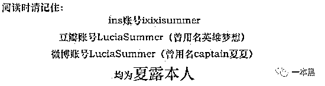      **

**基于豆瓣账号发布的无数照片可证本人真实性，于是网友们找出了夏露女士在有男友期间在豆瓣的照片和发言。**

**先来一个常识科普，豆瓣的某些小组被豆瓣网友称为“炮友组”，日常画风给大家看一下。**

**       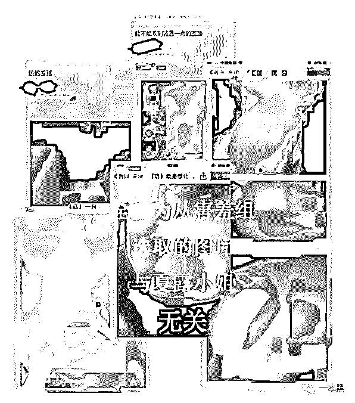      **

**让我们看看夏露小姐在本小组的发言。**

**       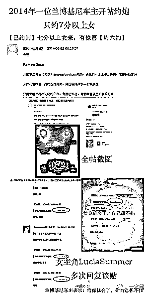      **

**好的锤了，通过细致的潜水，资料分析，女主角的出轨石锤就这样被曝光于天下。**

**但是我想说的是，除了简单的信息分析还不够，信息综合处理也是很重要的一方面。**

**下面两张照片是女主角穿着性感在南京酒店里的照片，百度百科告诉我们，女主角是南京人，在南京有房子，不需要穿着如此清凉来酒店开房。**

**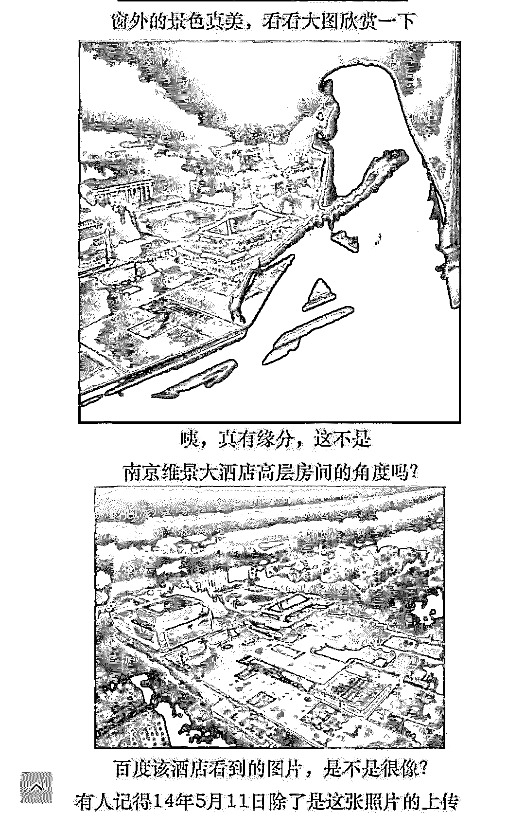  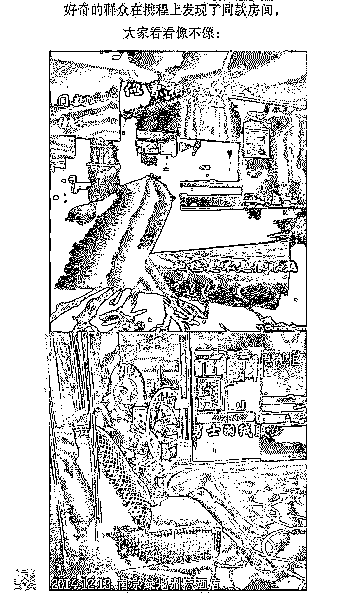**

**先给大家划重点，时间分别是：**2014 年的 5 月 11 日**和**2014 年的 12 月 13 日**。**

**怎么了，男女朋友换个环境享受一下快乐时光不可以么？**

**那你要非说有可能是男朋友，我们就来看看此时此刻女主角的男朋友在干嘛。**

**       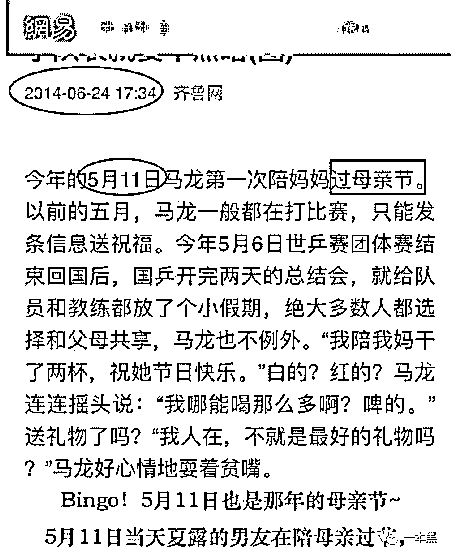      **

**       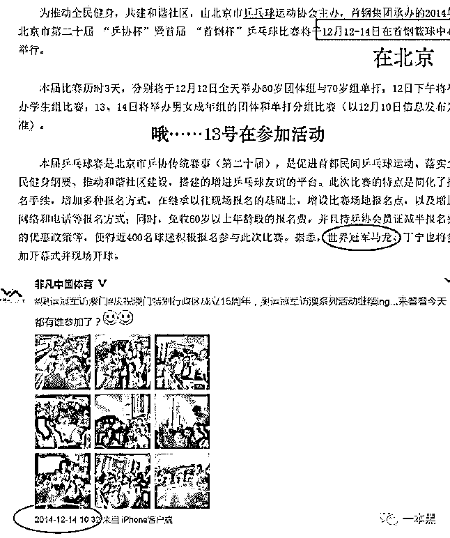      **

**怎么这么巧，男主角两次都有活动，一个在北京，一个在澳门。**

**完整的资料长达 9 页，每一张都是图文并茂，证据确凿。但是仔细想想，这样的证据寻找起来不需要高超的技术，只要足够有时间和耐心，一篇长达万字的“偶像被绿”石锤贴就出现了。**

**如果说老师傅是计算机理论基础的满分学生，那追星族就是社工基础的优秀班干部。**

**关于这一篇锤我看的是大快朵颐，记忆中文章全篇锤到女主角约炮次数大约三十几次，年龄从五十年代到九十年代不等。**

**她们扒出来要做什么？可能想给偶像一个赶紧分手的理由，却不想给偶像扣上了一顶绝世绿帽，闪闪发光。**

**不过事情也都过去了，男主角还是娶了女主角，孩子今年也两岁了，家大业大的过上了王子和公主的生活。**

**上一个例子是在成山的资料里寻找有用信息并且总结，是社工技巧里基本方法的一种，而精准的细节打击又是一种。上一个可能已经很狄仁杰了，这一次我们看一个更柯南的。**

**宋茜 2013 年发了个微博，简单的生活分享。**

**       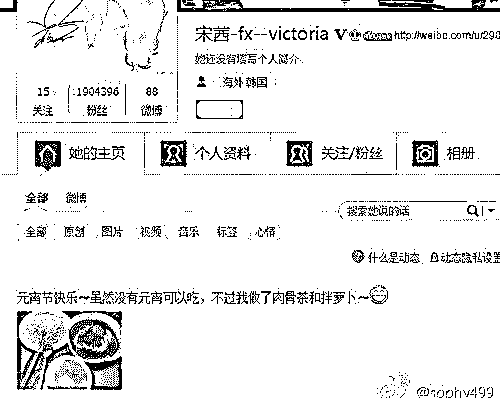      **

**来让我们盯住画面左侧的勺子，放大之后如下。**

**       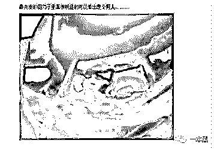      **

**旋转对比拉宽角度以后如下。**

**       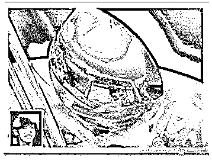      **

**恋爱，锤了。**

**论偶像和粉丝那些爱恨情仇，真的是说都说不完。细节决定成败这句话，对偶像和粉丝都实用。**

**如果说上面的两个例子，一个是资料搜集整理，一个是细节决定成败，那接下来这个可谓是二者结合，还要加上一点点现代技术。**

**这是我在写这篇文章的时候，一个朋友按着我的头给我的素材。**

**在普通人看来，一位明星发了一张自拍。**

**       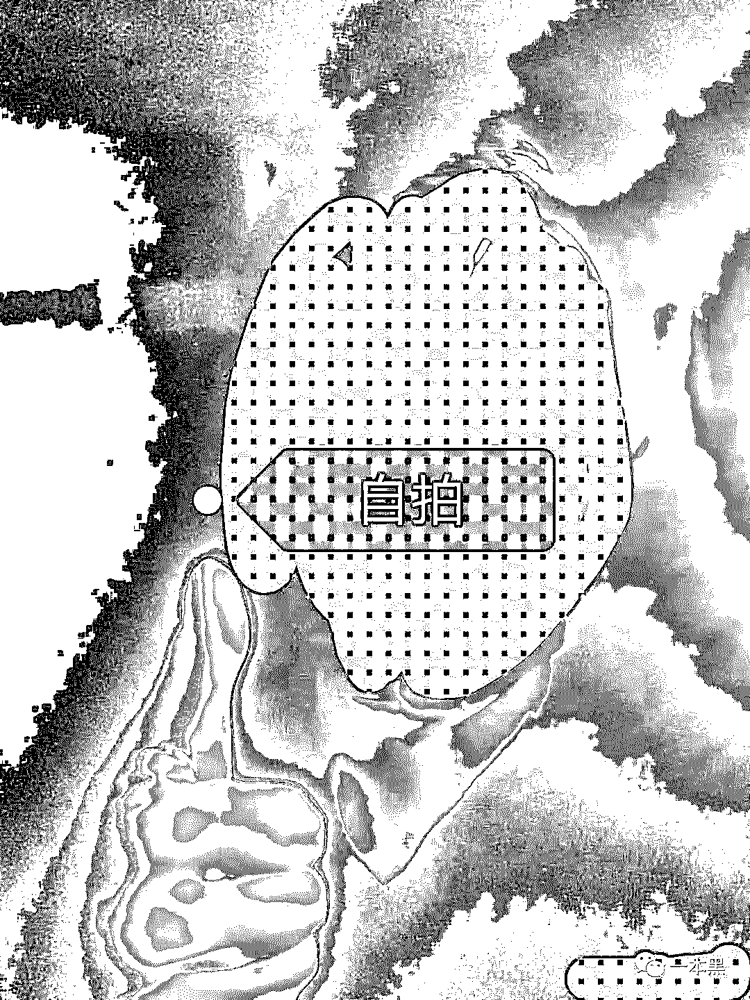      **

**我抱着“这有啥啊”的心情点开 GPS 信息，结果一无所获；又调高亮度，白平衡，企图看到后方的人，一无所有；仔细放大寻找瞳孔中的信息，也没有。**

**我真诚发问：朋友，华点在哪。**

**我万万没想到是让我观察手上的一颗痣，大家现在别往下滑，请在上图的手上寻找一颗痣好么？**

**       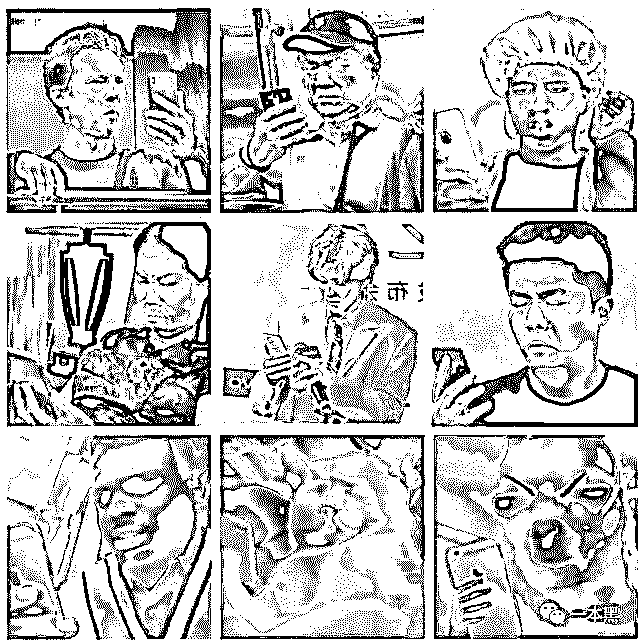      **

**       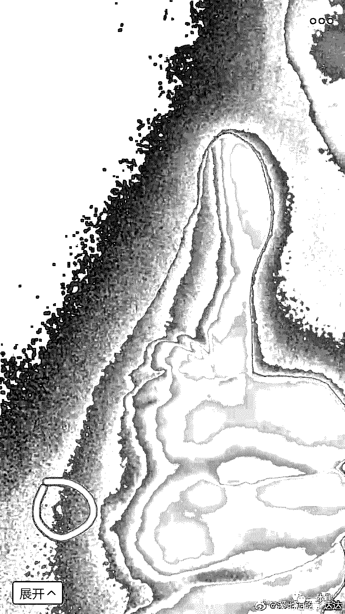      **

**即使已经身经百战，我还是一句话都说不出来。对追星族们有再多的意见我不得不佩服，这么模糊也看的清楚。**

**模糊？模糊就是你还没信我。**

**打开 PS，在三个通道里选择最清晰的一个，直接告诉你不是噪点就是清晰的一颗痣。**

**我愣住了。****缓了好一会儿才找到我的智商，我问她：“你想证明什么？有痣咋了？万一是脏东西或者黑色水笔的污渍也有可能。”****事实证明我低估了当代粉丝的能力，除了要拥有细心，智慧和手段还要拥有了解偶像身体每一寸肌肤的心，她们找到了所有大拇指的姿势，用来证明，这不是她偶像的手。****       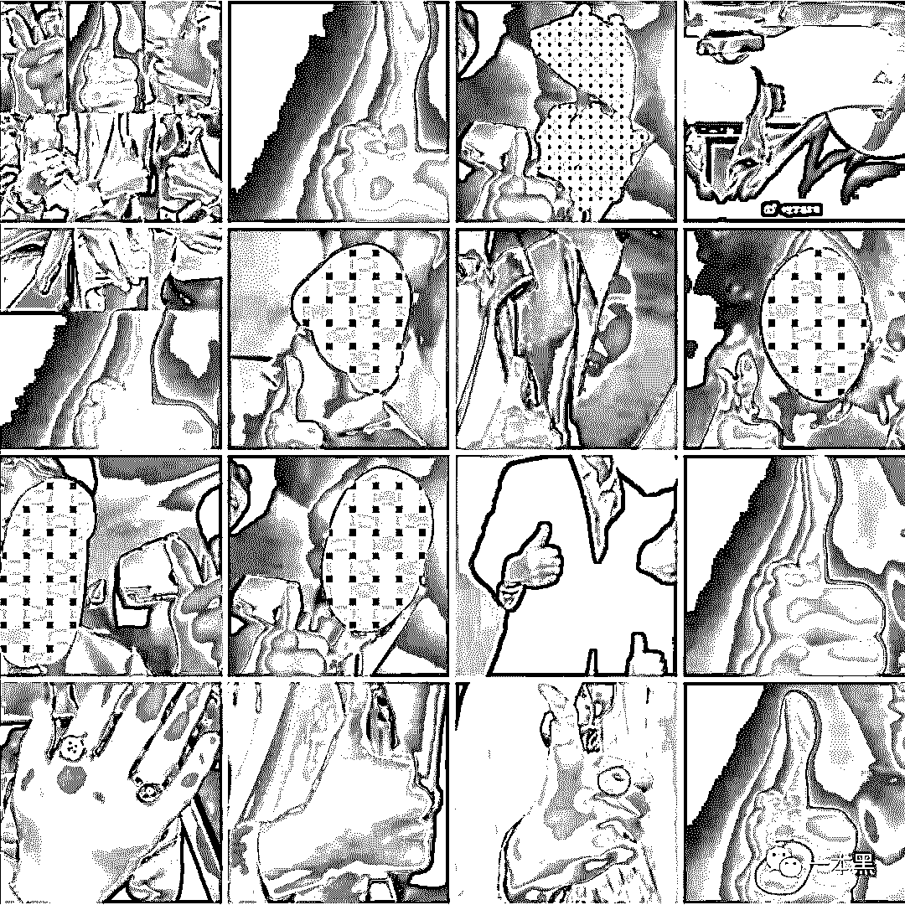      ****然后又在偶像身边所有的社交关系中，寻找一只手，此门课程要结合上一环节的海量资料整理和细节比对进行学习。****       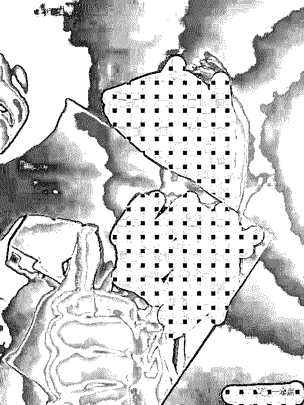      ****最后通过数以百计的图片对比，通过镜像、拉伸、扭曲、等一切手段，让一张看似八竿子打不着的照片里的手完全比对成功，犹如灰姑娘终于找到了水晶鞋一样契合。****耗费了大量时间精力的结果并没有发现偶像的恋情或者其他新闻，只是普通的同性朋友的手，似乎让很多吃瓜群众失望了。****但是粉丝们无所谓，这样做的意义不在于结果，而在于别人虽然看起来无聊、荒唐，可是这份名侦探柯南的快乐她感受到了。****结局平平淡淡，粉丝圆圆满满，大家该干嘛干嘛。******那些暗潮汹涌的粉丝行动********几乎每个粉丝都知道 IP 地址怎么查，翻墙投票怎么找 vpn 的 bug，以及身份信息从哪里买，只是大部分人不愿意这样做。********       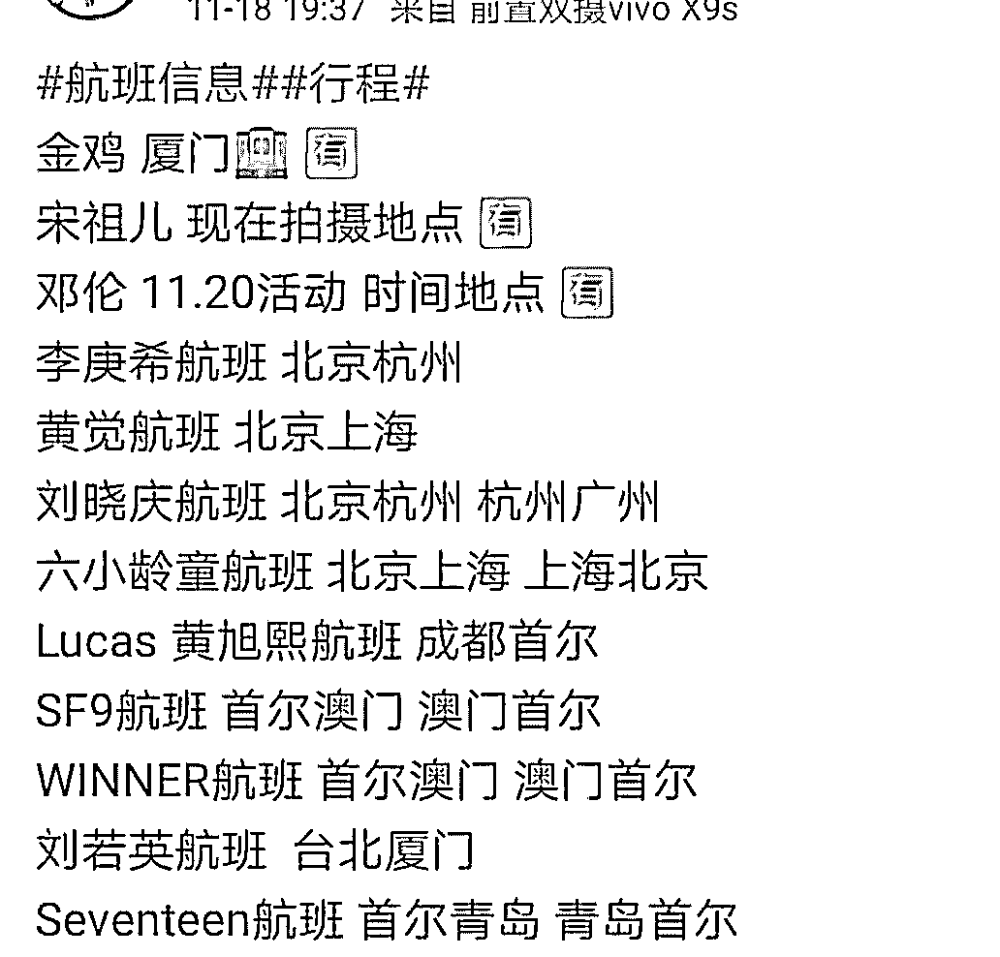      ********这样的航班行程是市面上最常买到的，卖家先给出时间和出发城市，或者告知起终点，说明他们的手里有准确的信息，付款后再告诉你航班号码和时间。********这样的信息非常便宜，从 18 线到 1 线，十块到几十块不等，没有再贵的了，薄利多销嘛，毕竟粉丝都希望自己是偶像的唯一，少去几个人是几个人。********身份证信息则比较难买，不过也不是完全没有途径，越当红的越好买，价格也贵。一个身份证号的价格在数百元不等。********不过买到了以后，航班行程，机票酒店随便你查，只要你想，大部分时刻你都能出现在偶像身边。********至于 IP 地址，这是十年前最流行的网络撕逼方式。当时互联网没有这么发达，IP 地址很容易被查到，可以定位到城市，一旦被查到就坐立难安。********十年以后只查到城市没什么必要，你查了我也不怕，而能精准定位到点的查询方式手段不太容易而且触犯法律。********他骂你一句，你高价违法查到他的精确定位，这不划算吧。********而且作为粉丝圈如此严谨的地方，堂堂正正撕逼没有关系，如果撕逼过程中你企图违法乱纪获得强有力的撕逼证据，就直接报告警察叔叔了。**********无疾而终的高段位选修************有一个女孩子，怀疑他的偶像谈恋爱苦于没有证据，每次到了关键时刻，偶像就迅速下播。************后来女孩子把偶像半年的直播素材合成一个 100G 的文件包通读，把所有女声出现的都单独剪辑，然后对比音色。************       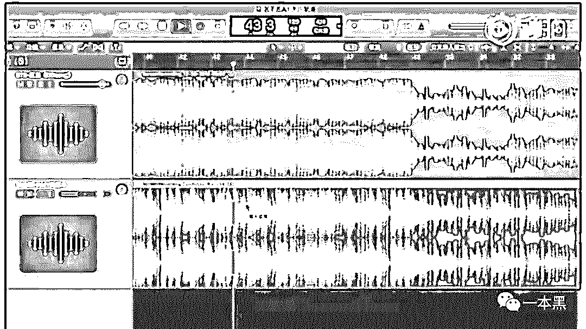   图为网络截图************蓝色是第一首歌的左右声道，灰色是第二首歌的左右声道，通过对波形图的长短对比，可以直观的看到音频的鼓点、音色、和强弱。如果过于相似就可以判断是否是同一个声音。************在对比音乐抄袭的时候，这种方法更为明显好用。如果是人声的话，先剥离背景杂音，弱化环境音，无限慢放，可以尝试听一下结果。还仅仅只是尝试，因为普遍直播的音质都非常杂乱。************如图的音频和操作，她重复了 200 多个段落，一个段落要操作半小时以上可能才会听到蛛丝马迹。************       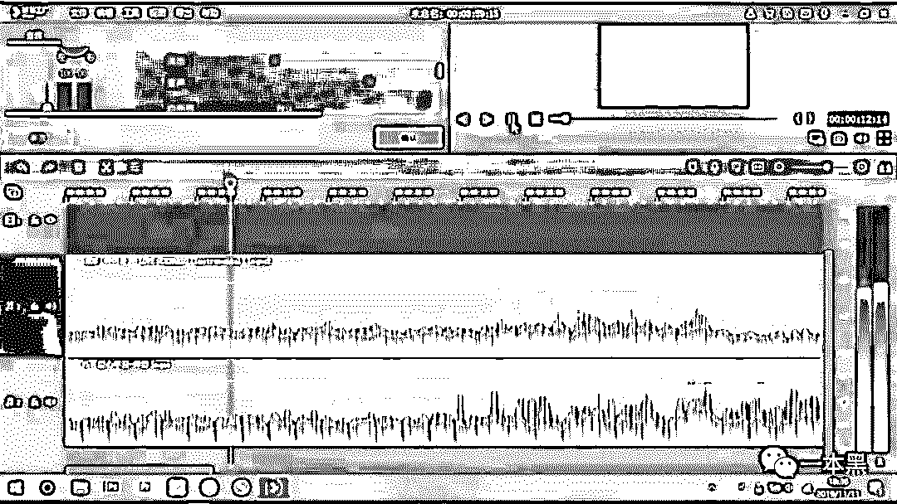      ************她的工作还没有做完，甚至没有发现重大突破，这件事情可能永远是个秘密。************不过她不是很在意，还是每天忙于遨游软件之海。但就算是石锤，也不会告诉我，毕竟帮助她偶像掩盖恋爱的实事，也是她要做的事。************再说几个边角料给大家做消遣，希望大家看完以后自查自纠，该注意的注意，该放肆的放肆。************             ************我的朋友心血来潮做了回小三，微信小号只有网友，约会时发了第二个半价的冰激凌的图片。************谁能想到她认识 7 年的网友，是她认识了 10 年刚胡搞上的男朋友的现任女友闺蜜呢。************还有，朋友三年前在微博分享的家里宠物照片，本来都已经把这事儿忘光光了，男朋友拿宠物的照片去发了朋友圈，真的有人找到了她三年前的微博并且做了对比，她又被逮住了。行吧，以后宠物照片记得少发。************啊，不对，是不要出轨。************还有个事儿，我偶像玩跑跑卡丁车，有个人老把车停他停车场，本来没放在心上，后来发现他王者荣耀 94%亲密度的女孩儿，昵称和停车场女孩挺像。************我偶像，三十好几，有妻有子，出轨是因为打游戏被粉丝扒出来。************若要人不知，除非己莫为。************男默女泪，我不说了，各位看官以后自己注意吧。**************是为爱发电不是傻白甜****************几乎每一个追星族都能通晓追星社会法则，追星的黑暗面她们比别人懂得太多。当偶像发了一张自己的手部照片，评论全都是“删了打码，透露自己信息了。”****************而在无尽的扒皮和撕逼的战场中，也会为所有无辜的人打好马赛克。****************可能这就是吃过见过吧。****************写这篇文章的初衷是因为无意间知道，很多追星族的行为已经涉及到了社工的技巧，一本黑之前提到过的方法这次就不再赘述，特意选择了几个不常见的行为和大家分享。****************       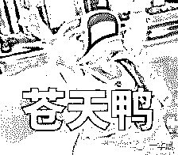      ****************有几个小 tips 和大家看一下：****************1、微博小尾巴：微博会自动显示你的机型，如果更换手机或用电脑发微博马上会被发现，记得取消 。****************2、微博定位：微博的同城定位默认开启，会被无数人看到地址相关，注意关闭。****************3、微信、微博、QQ、淘宝等一系列可以联名登录的东西，包括但不限于：预言、算命、星座、砍价等等一些列应用的授权，记得定时清理。****************4、手机号通过支付宝查询可以验证你的真实姓名，建议把通过手机号码添加这一项关掉哦。****************5、抖音会默认开启你的当前位置，同样记得关闭哦。****************追星是一个螺旋式的上升和不断自我否定的过程，得出一个偶像不会亲自承认，但所有人都心知肚明的答案。****************但是而追星的意义，是为了快乐和提升自己，和偶像的关系不大。****************追星族都是平常的女孩儿男孩，她们能关注到的事情任何人都可以做到。****************而今天所说的一切，除了谈谈旁人看不懂的追星族们的操作，更要引起大家对自己隐私保护的重视，才是这篇文章的目的所在。*****************大家好，我是老黑。*
*早年做过技术，也做过自由调查记者，曾协助警方打掉产值上亿的色情网站、也干掉过骗了无数人的非法集资。**之所以写【一本黑】公众号，是想用最简单的语言，告诉大家，这个世界上真的存在魔鬼，不然你没法理解人性。**如果你想认识我，不妨加我微信：****yibenheiSW***

推荐阅读：

[私密社群，快上车](http://mp.weixin.qq.com/s?__biz=MzU4ODAwNzUwMQ==&mid=2247486383&idx=2&sn=0821d0bff33285d235b2e1b9af9a9e27&chksm=fde21a8dca95939b496421a2177f83d8022e5a25ce95ea8b2929b17b26fe95aeb5ca902b722a&scene=21#wechat_redirect) 

[一夜薅走 700 万，背后是 70 万职业打假人的狂欢](http://mp.weixin.qq.com/s?__biz=MzU4ODAwNzUwMQ==&mid=2247486626&idx=1&sn=e20fbd5bab3b415a2193d536686bb3ff&chksm=fde21d80ca9594965853e5da54fd5fd20caa8c336406e298ff58b6fbaf3f421bf1fed83ce5ce&scene=21#wechat_redirect)

[豫章书院死灰复燃，举报者遭死亡威胁 ，还有人重度抑郁自杀](http://mp.weixin.qq.com/s?__biz=MzU4ODAwNzUwMQ==&mid=2247486597&idx=1&sn=549f291beb8b97f31e158aff7870012a&chksm=fde21da7ca9594b193f5685feb0ef09b14ab257c0b6e34c4d5b2d5caf4f24fbc1e4f7b3b4c01&scene=21#wechat_redirect)********