# 双十一啥都没买？那你有必要进来“砍”我

> 原文：[`mp.weixin.qq.com/s?__biz=MzU4ODAwNzUwMQ==&mid=2247486616&idx=1&sn=4eb02cda89b7e8c36f447040e6874b9b&chksm=fde21dbaca9594acba589c5539a3ae26e0c4446e2c27f7ef13dc9530d6013f55d48a32ff6791&scene=27#wechat_redirect`](http://mp.weixin.qq.com/s?__biz=MzU4ODAwNzUwMQ==&mid=2247486616&idx=1&sn=4eb02cda89b7e8c36f447040e6874b9b&chksm=fde21dbaca9594acba589c5539a3ae26e0c4446e2c27f7ef13dc9530d6013f55d48a32ff6791&scene=27#wechat_redirect)

 首先说明一点，今天是双十一，这篇文章是专门为一本黑社群做的广告，如果你对一本黑的社群不感兴趣，现在就可以点击关闭，我也不想浪费大家的时间。

但如果你想了解一本黑的社群，认识更多牛逼的人，看他们是怎么赚钱和思考的，不妨慢慢往下看。

大概在三个月前，我开通了一个付费社群-**知识星球**，叫【一本黑的朋友们】，当初开社群的初衷我说过。

第一，解决我和读者，读者和读者之间链接的鸿沟，我想把大家聚在一起，搞些好玩的事儿。

第二，每天都会有读者在后台提问，消息太多我没法一一回答，知识星球既可以沉淀内容，也能互动。

第三，当然是在解决需求，提供服务的同时赚点小钱，毕竟谁都没法做到内容上的公益输出，说难听点，都是出来卖的，想白嫖肯定不行。

每个月就那么点工资，与其在双十一买这买那，还不如加入一个靠谱的社群，送自己一个提升自我的机会。 

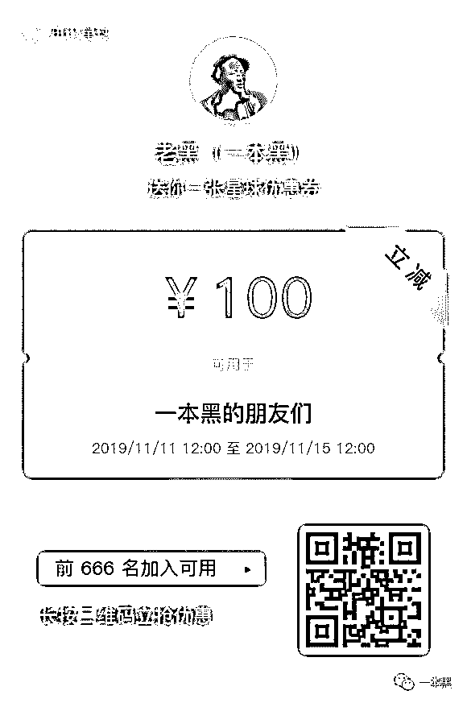

(  双十一前 666 名优惠 100 元）

我当时并没有给这个社群一个具体的定位，因为里面会分享很多东西，赚钱案例、思路想法、各种骚操作，总之它是一个提升你认知，颠覆你思维方式的社群。

并且它也是一个资源对接平台，帮助大家寻找可以合作的资源，但灰黑产严厉杜绝。

我也会不定期邀请一些大佬来社群里分享，分享啥呢？分享大佬是如何成为大佬的，分享他们的想法和赚钱经历，我始终觉得，要想成长打破瓶颈的第一步就是开眼界。

俗话说近朱者赤近墨者黑，讲的就是这个道理，你得靠近牛逼的人，看别人是怎么做事和思考的，看别人成功或者失败的经验，看得多了，很多东西自然就明白了。

为什么很多人都想加自己心目中大佬的微信，因为光是看别人的朋友圈或者动态，都能从中学到一些无法用金钱衡量的东西，这玩意是价值，是提升认知的捷径。

社群这东西，一旦提到付费，不少人肯定就会说你又在割韭菜，不好意思，星球开通三个月以来，除去周末，我基本上每天都在更新。

另外，一本黑最早的时候，有一个 99 元的付费社群，这次我把当年花 99 元进群的朋友都拉进了新社群，如果是割韭菜的话，费这些功夫干嘛。

废话不多说，先来看看这两个月以来，星球内都在交流什么内容。

星球内有个标签叫做#骚操作#，平时我会分享一些别人在营销上、赚钱上很骚的操作，基本上都是套路，都让人意想不到，不过里面确实有很多值得学习的地方。

比如之前华为搞的营销骚操作：拍了一张摩天轮上面那啥的照片，配文“人在做，HUAWEI P30 Pro 在看”，当你以为这只是一个段子的时候，其实这是人家营销公司给的营销方案而已。

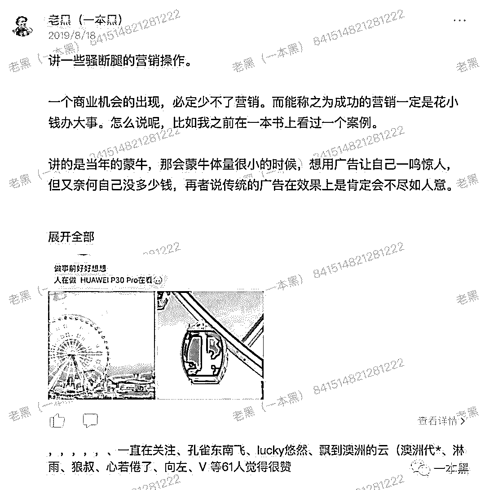

又比如一些薅羊毛的骚操作。

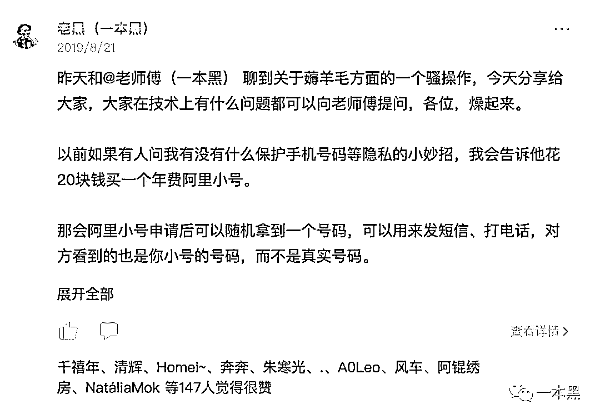

还有比如前几天公众号发文讲过淘客，刚好星球内就有一大四的学生干过几年淘客。

当时他干淘客一年能搞个十几万，这几天在帮别人搭建淘客群，一个人头 3.5，因为自己手里有资源，他花一小时引了 2000 人的 QQ 群，7000 块到手。

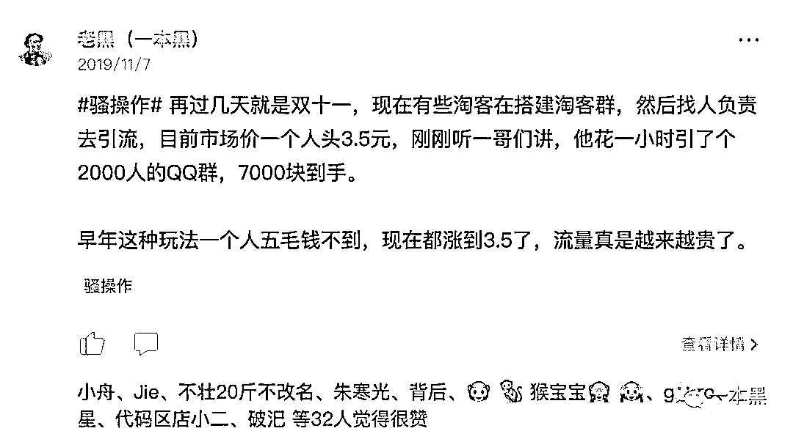

另外，除了分享骚操作外，星球内还会不定期有**牛人分享**，比如靠公众号草根逆袭的粥左罗，从月薪 2300 的服装店员做到如今成立自己的公司，年入百万。

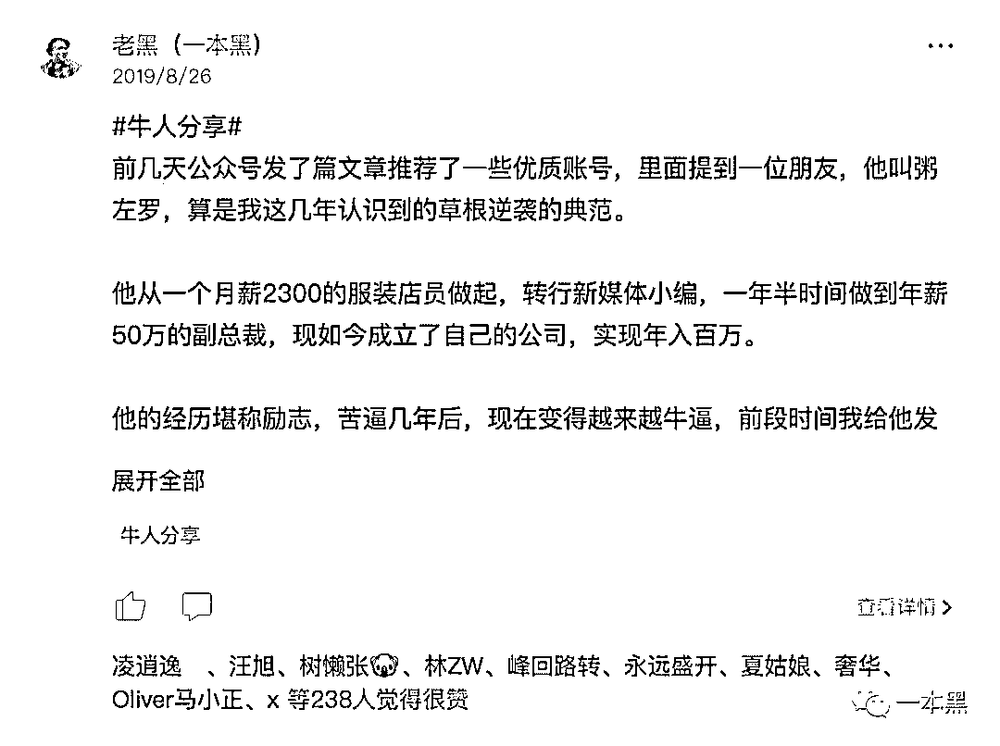

还有同样做公众号，两个月内变现 72 万的梁勇。

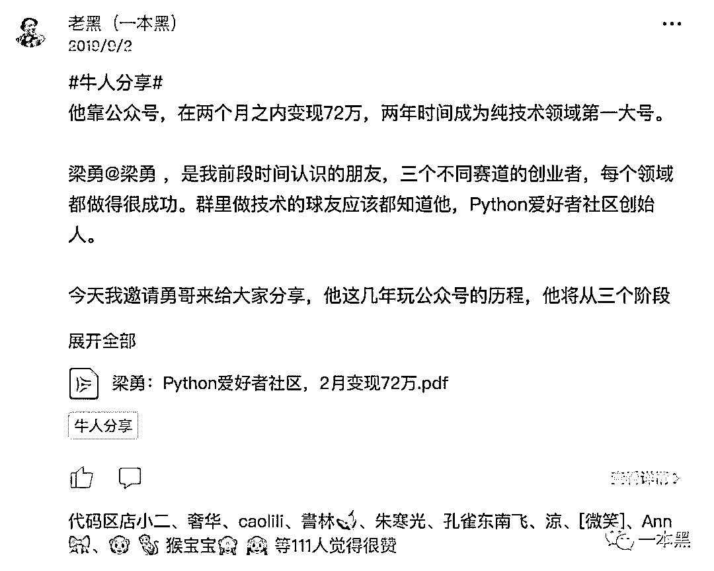

还有通过副业赚到 100 万+的设计师 Sky。

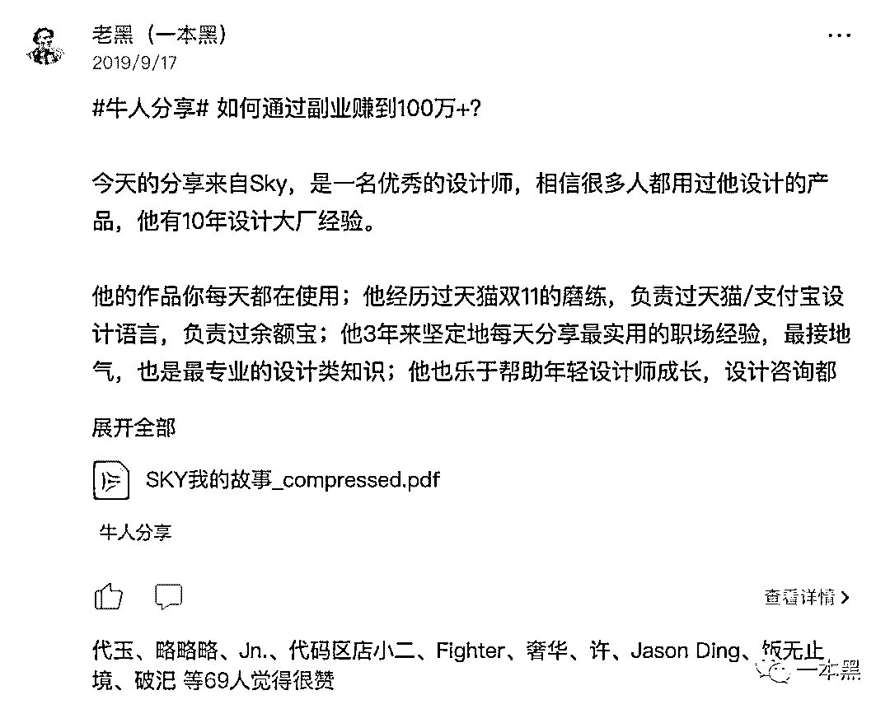

【一本黑的朋友们】创建至今，已经有 2200+小伙伴加入，我不敢保证他们能在里面学到赚钱的思路，也教不了赚钱的门道，这玩意真的没法教。

但我敢说里面分享的东西，都是能颠覆很多人的认知和思维的，但说实话这玩意急不得，得慢慢熏陶和接受信息的灌溉。

现在这个社会的人啊，大家都很焦虑，你在日常生活中所能接触到的人，除了家人就是同事，大家的水平普遍都差不多。

在赚钱、认知、眼界上都局限在一个小圈子，看不到外面的世界，更看不到别人是怎么赚钱的。

努力固然重要，但有时候方向和认知更重要，一个人呆在一个圈子里久了，思维是会固化的。

这个时代所有的生意其实都是信息差带来的复利，别人知道你不知道，别人就能从中赚钱，所以还是得多看、多吸收别人的经验。

星球内但凡是有提问，我基本都会回答，但涉及到敏感话题我一律不回答。目前我所遇到的提问基本涵盖：赚钱、骗局、套路、建议、职场、发展、情感等等方面。

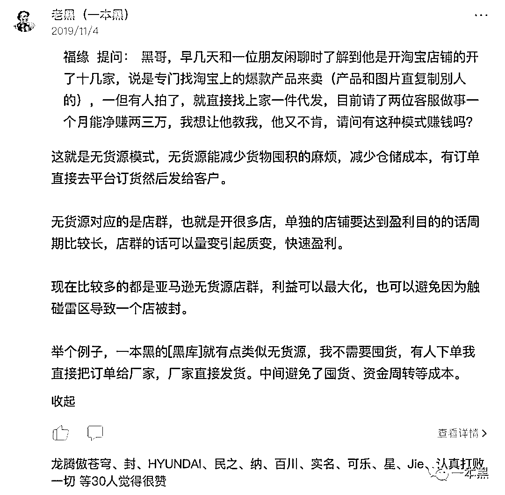

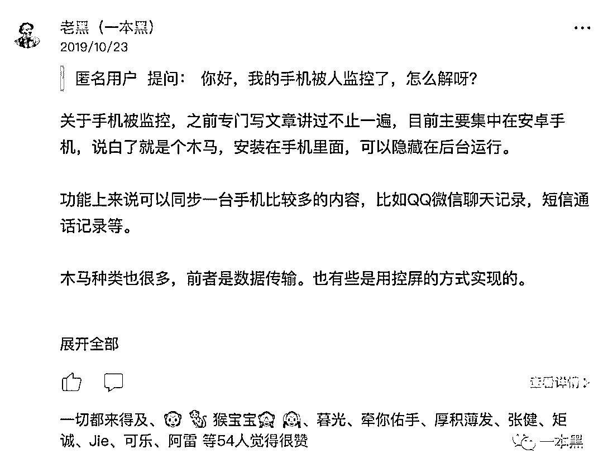

当然还会有一些嘉宾针对球友的提问，做出详细解答的。

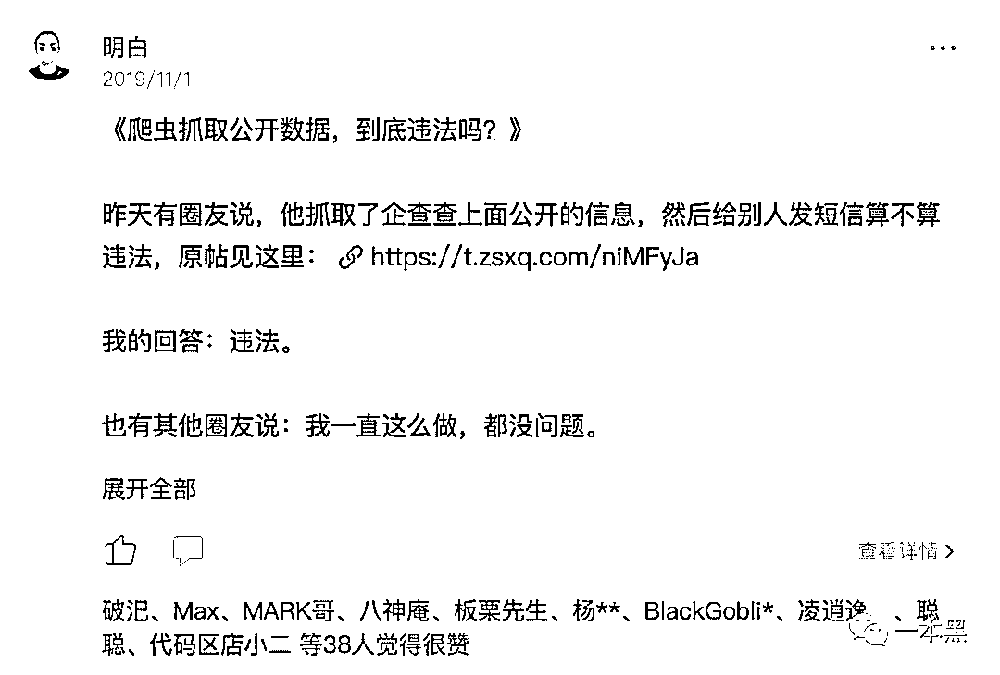

还有球友会分享自己踩坑的经验，告诉大家自己曾经遇到的套路，看别人踩过的坑，同样也是一种学习。

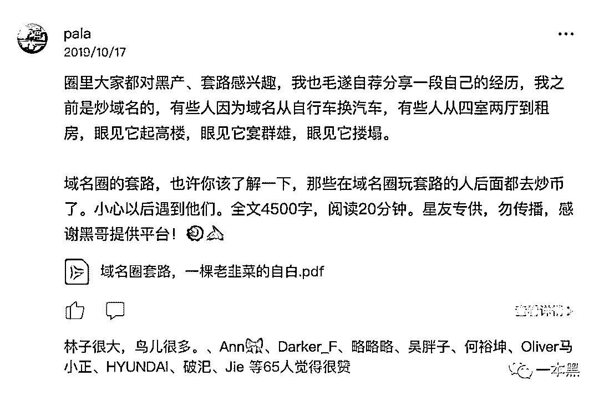

自从星球开通发言权限后，很多球友都参与到了星球话题的讨论，我突然发现星球里真的是卧虎藏龙。

里面有公司高管、创业者、自由职业者、技术高手、赚钱能人，大家都能从不同的角度思考问题，发表自己的见解。

总之，星球内的内容远比这些精彩，每个人所处的领域都是不一样的，你只会对自己工作的领域熟悉，要想打破瓶颈，这时候你就得多看，多听别人的分享，以最小的成本获得最大的收益。

今天是双十一，【一本黑的朋友们】这个星球不会降价，但知识星球官方出了一个优惠券活动，所以今天权当给大家送福利了。

之前我也看到不少学生、职场新人说入圈费有点贵，所以这次就着知识星球官方推出的限时优惠券，我给大家准备了 666 张价值 100 元的优惠券。

星球原价 299 元/年，领劵付费后只需要 199 元/年，如此大的优惠力度以后不可能再有，机会仅此一次，劵完为止。

**如何进群？**

****扫描下方二维码——领劵——付费即可进入。****

********

****(为方便查看内容，付费后请下载知识星球 APP)****

****算下来每天只需要五毛钱，就能获得一个开眼界，涨知识的机会，这个账不用我算了吧！划算。****

****社群开通后，我会陆续在社群里展开各种有趣的玩法，具体星球见。****

****再次强调，星球优惠券数量有限，想进的火速上车，这个时代别光焦虑，记得投资自己。****

****各位有心人，星球见。****