# 新浪微博，求你别再接赌博广告害人了

> 原文：[`mp.weixin.qq.com/s?__biz=MzU4ODAwNzUwMQ==&mid=2247486480&idx=1&sn=1739239edcfddc5e78dda2588a59fb75&chksm=fde21d32ca959424171c09330be3774ad7338006d7234da1ad347e62cfaa59b8950668f33cde&scene=27#wechat_redirect`](http://mp.weixin.qq.com/s?__biz=MzU4ODAwNzUwMQ==&mid=2247486480&idx=1&sn=1739239edcfddc5e78dda2588a59fb75&chksm=fde21d32ca959424171c09330be3774ad7338006d7234da1ad347e62cfaa59b8950668f33cde&scene=27#wechat_redirect)

【黑客调查】

**该栏目主要讲述老师傅利用【计算机基础知识】，还原网络或现实中的各种骗局和真实面目，以达到让人警醒的目的。** 

* * *

自从干起了自媒体，我才知道，互联网时代的流量是有多么的值钱。

这玩意可以简单粗暴的理解为资产，而且是非常值钱的重资产。

大部分人对它可能都能说出个一二三，但很多圈外人恐怕是只知其一不知其二。

通俗点说，流量就是钱，只要你有足够大的流量，奉管你是否精通变现，哪怕放个屁可能都有人买单。

话是糙了点，但确实是这样的，互联网玩的就是流量二字。

有了流量想变现还不简单吗？自身的产品需要付费这块不谈，你看多少互联网公司靠广告活得美滋滋。

所以业内有个调侃的说法是，现在的很多互联网公司其实早就变身“广告公司”了，其实这并不奇怪，流量这么值钱的东西，不用白不用。

但好像任何事物的发展都有烂尾的那一天，我觉得，互联网的广告业务已经走到了这步。

如今的各大互联网流量平台，就像一条破街道，虽然人来人往热闹非凡，但废弃的电线杆被各种妖魔鬼怪贴满牛皮癣广告，恶心至极。

他们的宗旨是，奉管它正不正规，往上贴就是了。反正这条街人流这么大，总有人会上当。

不对，是总会有人会看到，并成为自己的客户。

**一**

**之所以举这样的例子，是因为今天我想讲当今中国流量最大的社交媒体平台之一的——**新浪微博。****

**讲它干嘛？**

******讲它承接非法博彩广告、挣破钱、吃烂饭的故事。******

******微博可以说是很多奇葩广告的发源地，从电动牙刷到让人头冷的脱发产品、从淘宝低价折扣券到令人心动的减肥药，再到各种火热评论下的卖片小姐姐，你看，是不是就像电线杆上贴了又贴的牛皮癣广告。******

******甚至有人开玩笑说，微博看片，指日可待。******

******但这些其实都不算什么，比起真正的硬核广告，这些小广告简直小巫见大巫。******

******相信很多人都在微博刷到过这样的兼职广告，“小姐姐每个月两三千工资却可以到处逛街，问了她好久才告诉我怎么赚零花钱。”******

******“在家 20 天，只用一部手机就赚了 15 万”******

******“95 后奇女子在家躺 10 天，只用 100 元就赚了 5 万收入”******

******我觉得这帮人太适合干自媒体了，要是我不知道，我他么都信了，妥妥的标题党。******

******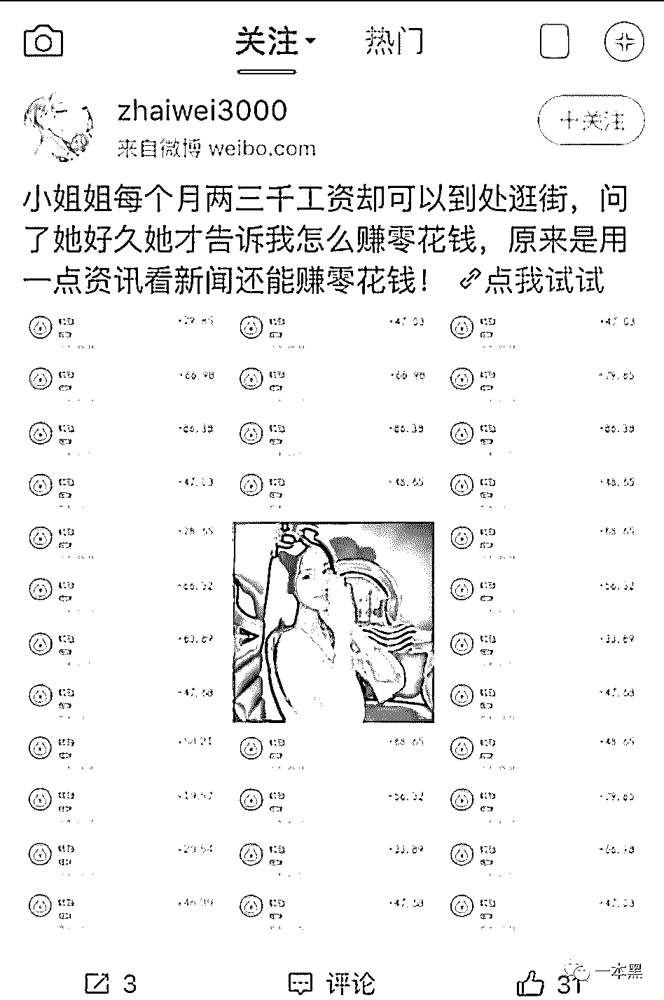******

******这些广告通常以“兼职”或者商业加盟做掩护，配合九宫格转账截图，加之风骚走位的刺激性文案，吸引着微博上亿用户的眼球，着实有点微商团队上天入地的感觉。******

******除了文案和图片做辅助外，他们都拥有一个外部链接，表面看似很正常，但当你点击链接进入后，立马会跳转到一个粗制滥造的页面。******

******里面写着一个个感天动地的励志故事，不是创业失败的老板因为加了客服微信每月多挣几万，就是三十岁妇女没钱打扮自己，老公对她越来越没耐心，后来做了这个兼职后，每天多挣六七百，整容后老公对她越来越好。******

********看着这些狗血得不能再狗血的故事，说实话，我哭了，我哭的是为什么这么傻 X 的剧情居然还有人相信。********

******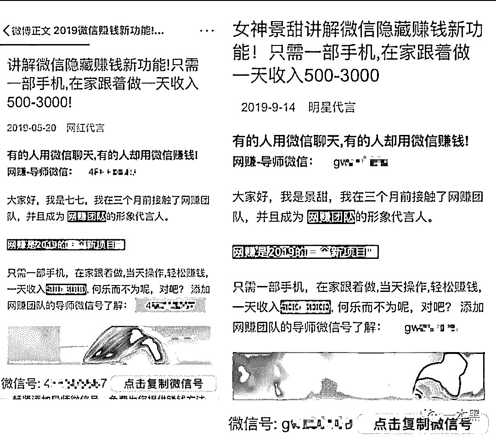******

******另外，我还发现一个有意思的事情，就是当你一旦点击过这种广告后，微博的算法会默认你喜欢这种广告骗局，于是会源源不断地向你推荐类似的广告骗局。******

******你越往下刷这种广告越多，而且剧情都还不重复，你说气人不。******

******微博接这种广告吃烂饭就算了，竟然还这么不要脸的疯狂推荐是几个意思？互联网从业者应该很清楚，能用到算法疯狂推荐，广告费恐怕不会低，再说这可不是简单的广告。******

********那这到底是个什么样的广告呢？********

******我随便找了个链接点进去，当我再次阅读页面中的“励志”剧情时，我再也忍不住发自内心的感动。******

******我颤抖着双手，添加了里面留下的微信号，祈祷这次能改变我的生活，最起码能让我抽上一包好烟。******

******添加很顺利，对方告诉我，这个兼职是通过幸运平台刷流水积分来赚取返利，一天可以赚 80-200，很轻松。******

******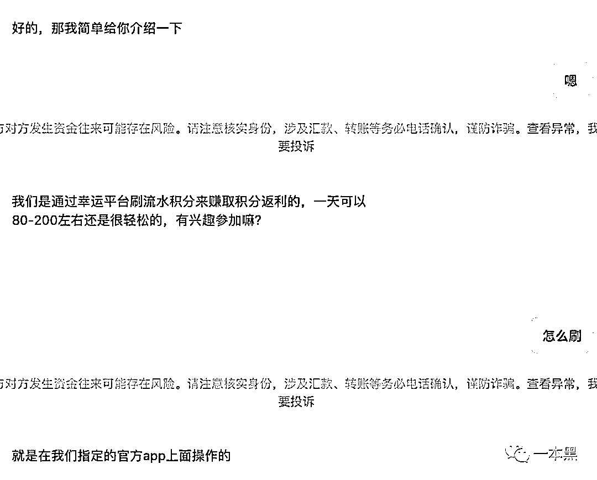******

******当我询问具体怎么操作时，他给我发了一个链接，让我去下载一个叫掌聊的 APP，注册好账号后，会有老师添加并教我具体步骤。******

******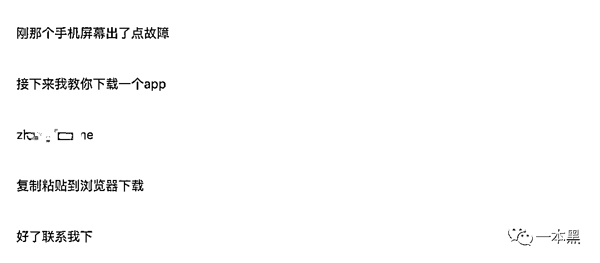******

******下载完掌聊 APP 后不久，就有一个所谓的指导老师发来信息，话术和最开始那哥们说的一样，也是说他们的赚钱模式是通过刷平台流水赚返利，只要按照他们专业老师的计划来操作就可以了，全程都有老师跟踪。******

******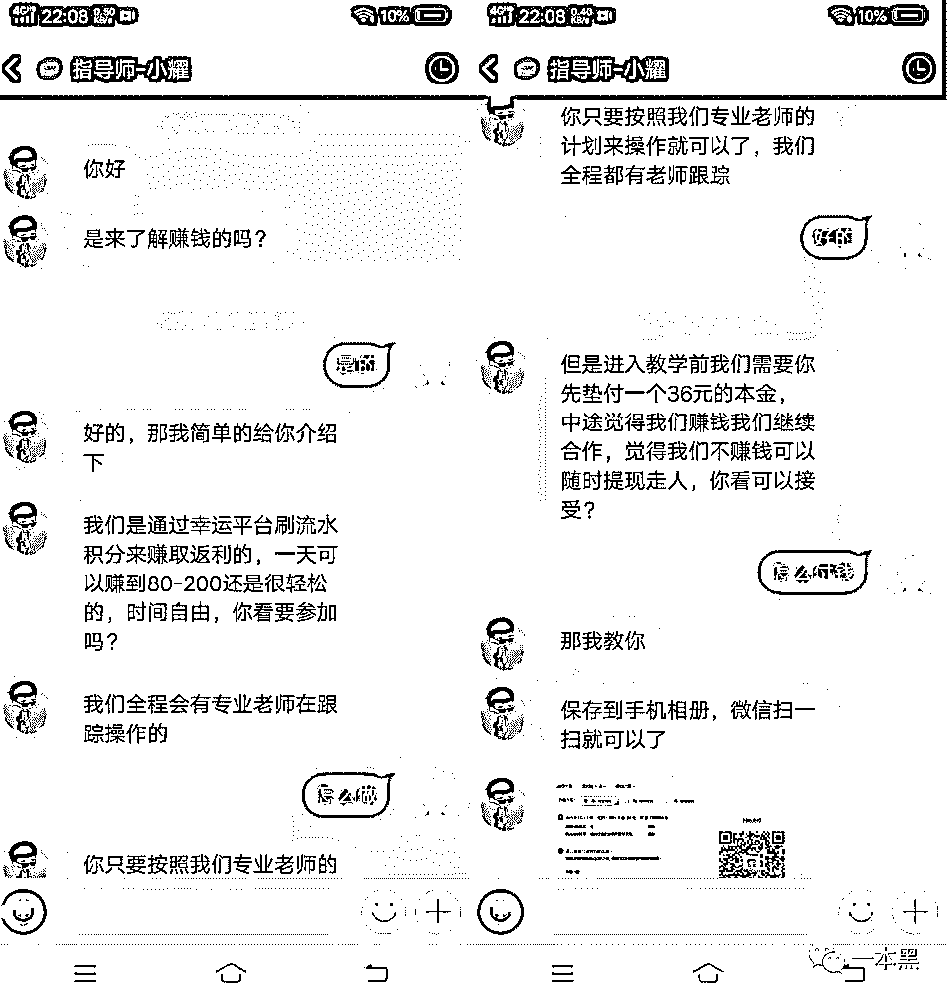******

******但是在进入教学之前需要垫付一个 36 元的本金。其实哪有什么狗屁教学，这里所说的刷平台流水无非是让你充钱在他们的赌博平台上玩游戏而已。******

******而这个赌博页面就藏在掌聊 APP 的其中一个按钮里，里面各种五花八门的彩种，什么极速快 3、幸运飞艇、全是一些地下黑彩。******

******除此之外，还有很多棋牌游戏，百家乐、龙虎斗、炸金花，感觉这里简直就是梭哈的天堂。******

************

******在赌博页面的一侧，有一栏叫中奖信息和昨日奖金榜，一边不断地滚动着某某中奖 XX 元，另一边则显示着大几十万的奖金，在这样的刺激下，不明真相的人很容易就会陷进去。******

******玩过代码的人都知道，这些其实都是代码里写好的。******

******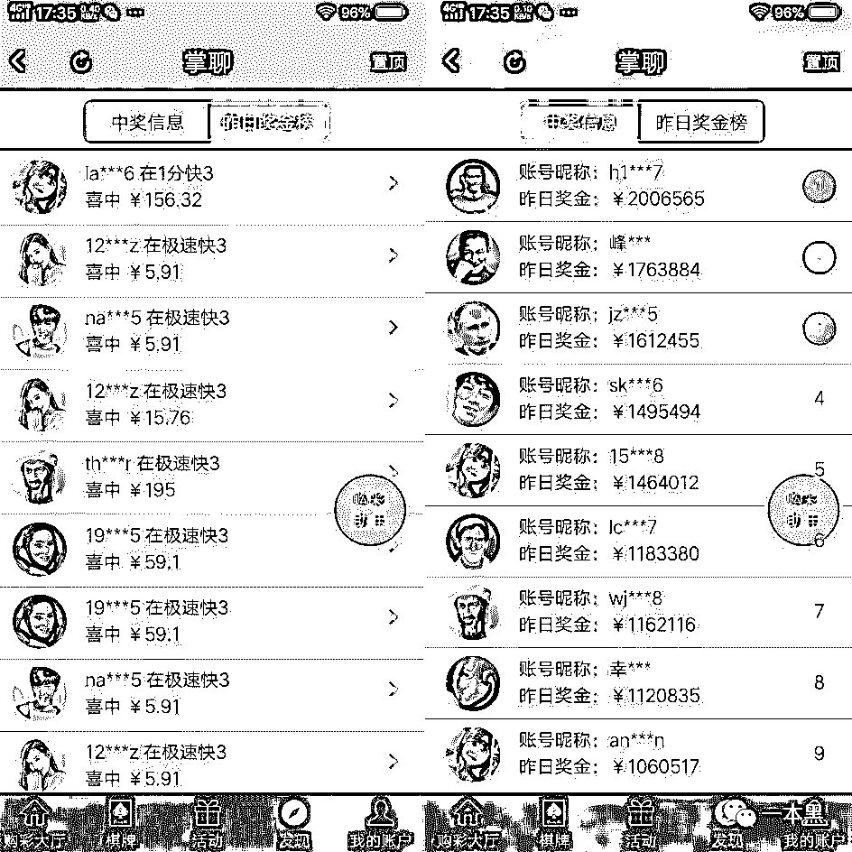******

******其实，这样的赌博平台我已经写过无数次，但依然有傻子上当，没办法，人和人之间的认知是有鸿沟般的差距的。******

******相比其他的骗局，这种由微博助力，诱导无知群众参与网络赌博的骗局更像是一种温柔陷阱。******

******它的温柔之处在于，很多人可能只是无聊刷个微博，看到声称是兼职的广告，于是添加客服微信，一步步就被带了进去。******

******参与者可能本身并不是赌博人员，可能是一位刚上大学的贫困学生，也可能是一位普通的打工者，在“导师”的一步步引导下，逐渐感受到赚钱的快感，最后慢慢沉沦直到倾家荡产、又或是陷入网贷。******

******不得不说，微博是整个链条的最大帮凶，它是最主要的引流入口，利用自己的庞大用户群，私下和博彩行业干如此偷鸡摸狗的勾当，确实够恶心的。******

********整个过程梳理起来就是：****微博承接非法地下博彩广告——博彩广告借微博平台发布吸引眼球的文案——跳转狗血剧情落地页——引导受害者加微信——把一切交易转移到微博之外——诱导受害者下载非法软件参与赌博。********

******二******

******一般来说，像微博这么大体量的社交平台推送一个广告的转化率是相当高的，更别说这种极具诱惑力的“兼职”广告了。******

******所以我特别好奇，微博到底帮这个赌博平台导了多少流量，又有多少人因为微博的推广赚到了钱，**不对，是被骗了钱。********

******所以到这一步各位应该知道谁要出场了吧。******

******没错，就是老师傅，老师傅好像很久没有出现在文章里了，这次也算是被迫营业，原因铁粉应该知道，这里不再多说。******

******不过说实在的，老师傅好久没用**【计算机基础知识】**了，恐怕这门技能都快生锈了吧。******

******准备干这事儿的时候老师傅还不知道在哪泡妞，所以我直接给他讲了我的需求，没想到老师傅很快就答应了。******

******这么痛快让我有点诧异，按平时，不递几根黄鹤楼、软中华什么的，这事怕是不好办。******

******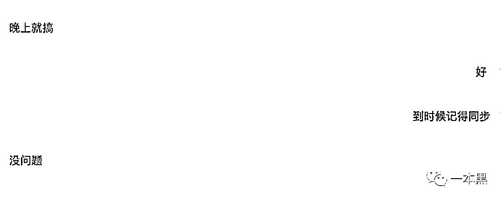******

******言归正传，第二天晚上凌晨十二点，老师傅给我发来消息，说掌聊 APP 基本已经搞定。******

************

******老师傅首先反编译了该掌聊 APP，拿到了掌聊的全套代码，代码显示当点 APP 中的某个按钮时，会请求下图红框中的接口。******

******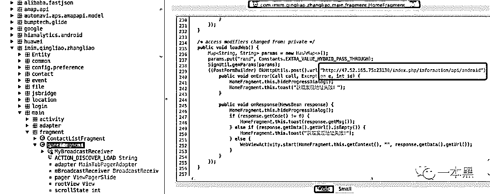******

******另外通过抓包的方式，也证实了该 APP 与赌博网站的共生关系，也就是说，当在掌聊 APP 中点击按钮，会返回该博彩网站的访问链接。******

******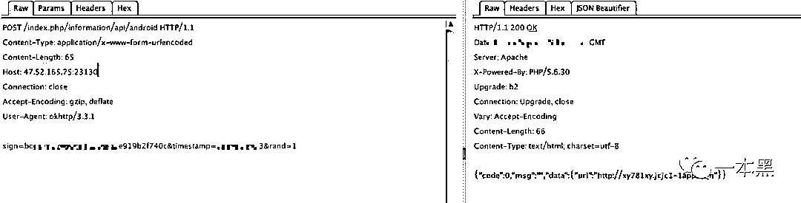******

******从系统源码上，也可以看出上面的接口请求会从数据库中查询博彩链接。******

******同时，它的数据库中也存有博彩的访问链接。******

******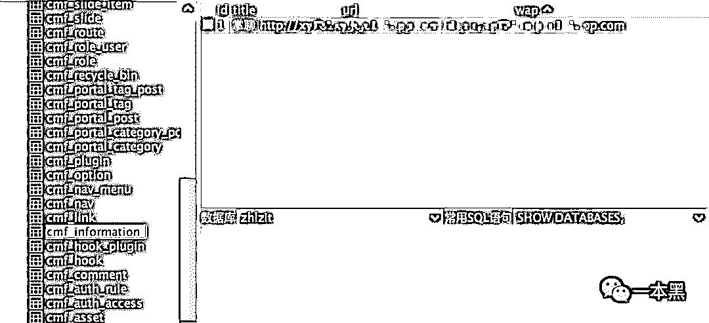******

******到这里，其实已经实锤了微博参与博彩网站的宣传，这可是实实在在的博彩啊，非不非法我就不用多说了吧。******

******第二天，老师傅突然给我截了个图，是这样的。******

******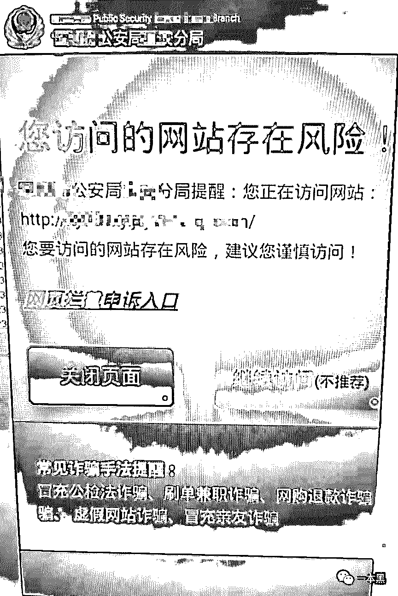******

******很显然，老师傅通过模拟器已经进入不了掌聊 APP 了，我以为要凉，但老师傅说问题不大，应该可以直接搞定后台看数据。******

******没多久，老师傅直接给我发来消息，让我登录后台看数据。******

******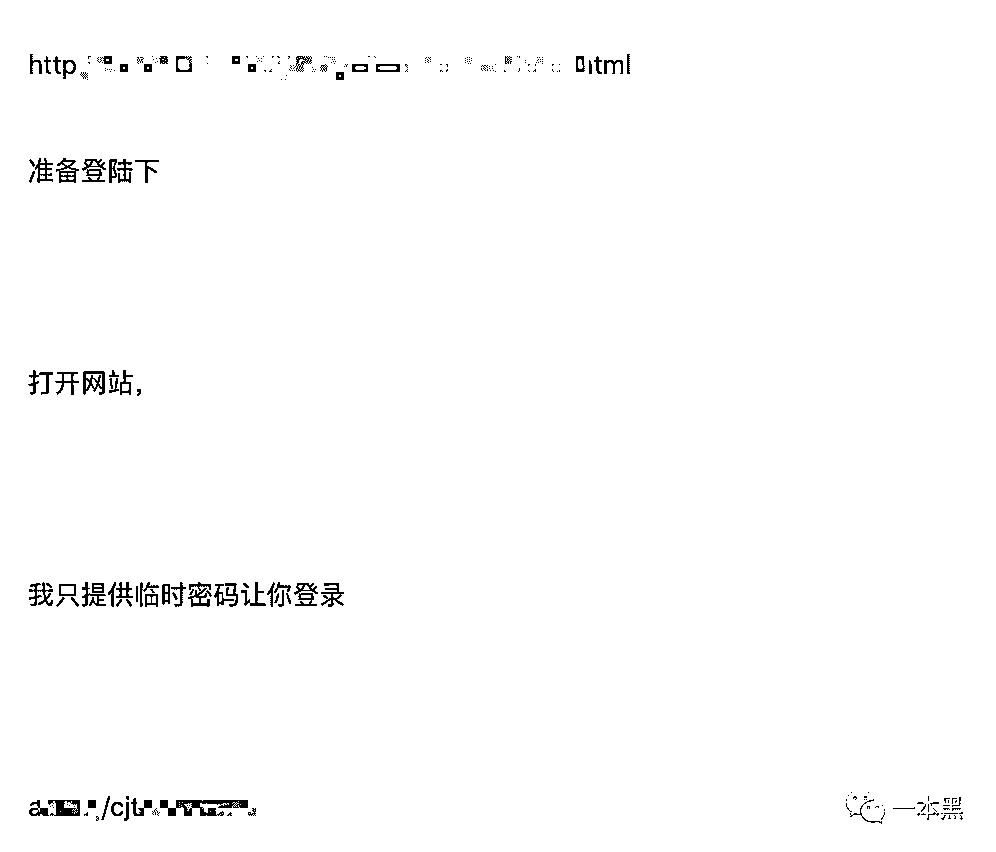******

******我在掌聊后台逛了一圈后发现，截止 10.10 日，下载掌聊 APP 的一共 38220 人。（每页显示十人）******

******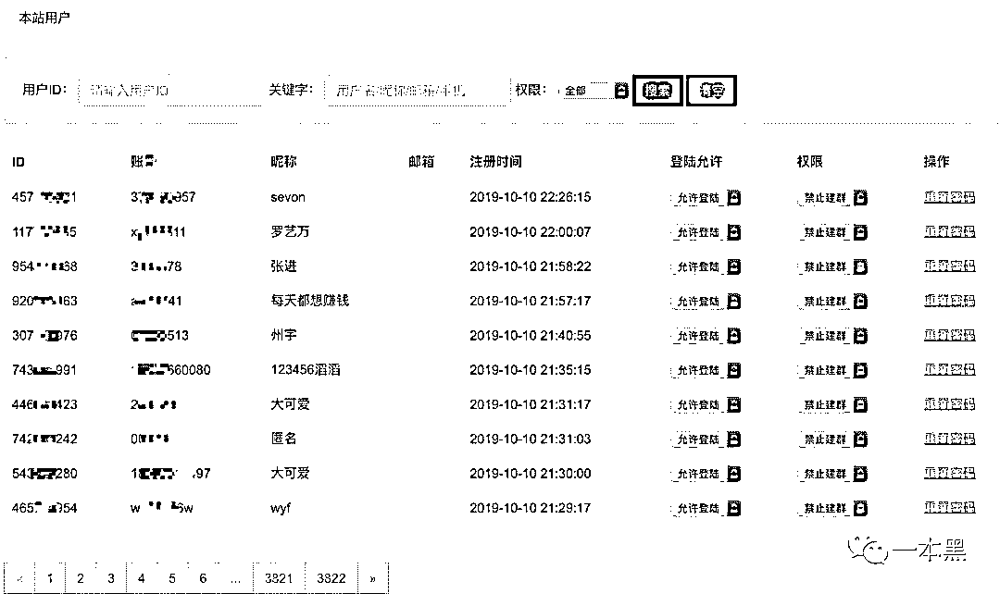******

******而后台显示掌聊 APP 的第一个用户注册时间为 2019.3.15，也就是说，通过微博的宣传，7 个月时间，仅掌聊这一个 APP 就转化了将近四万人。******

******值得注意的是，这类赌博平台往往有很多个不同的站点，而微博并不是只给该赌博网站进行了推广，整个数据没法统计，但肯定少不了。******

******从后台的数据统计来看，每天大概有 400 人注册掌聊 APP。******

******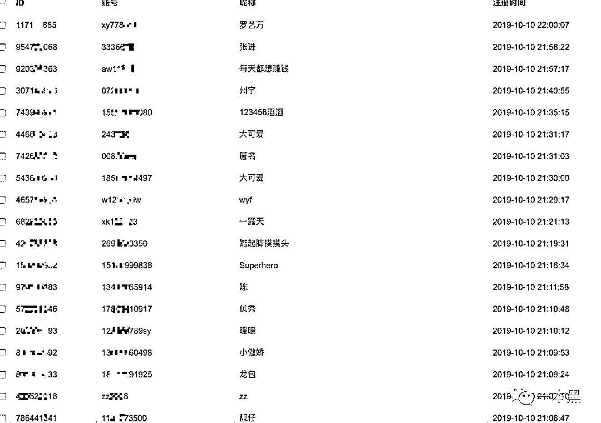******

******任何博彩网站的推广形式都差不多，无非是所谓的导师带着受害者充值去玩对应的彩种，前期肯定是让受害者尝甜头，也就是让受害者感受到赚钱的快感。******

******这时候可能会有人想着马上去提现，但是，你再怎么提都是提不了的，因为后台可以牢牢地控制你的提现动作。******

******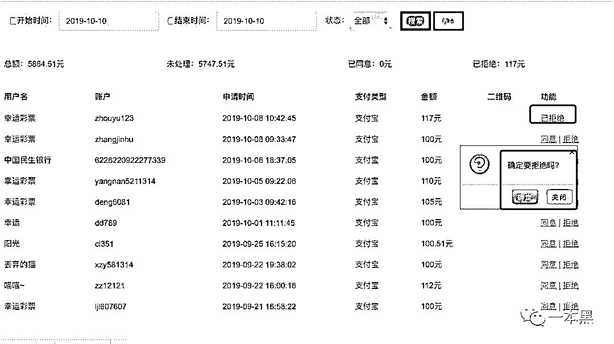******

******套路深，果然套路深！******

******另外，需要特别说明的一点是，以上的数据还只是掌聊这一个 APP 的数据，博彩网站是嵌套在掌聊 APP 里面的。******

******通过微博的算法机制，在点击过这种广告后，微博会接连不断地推荐类似的博彩广告，这些博彩广告都是同类但不同平台的。******

******如果想玩博彩网站里的游戏，是需要在博彩页面进行充值的，可以通过多种方式充值，最终的款项可能会流入个人微信账号、支付宝账号、银行卡账号等。******

******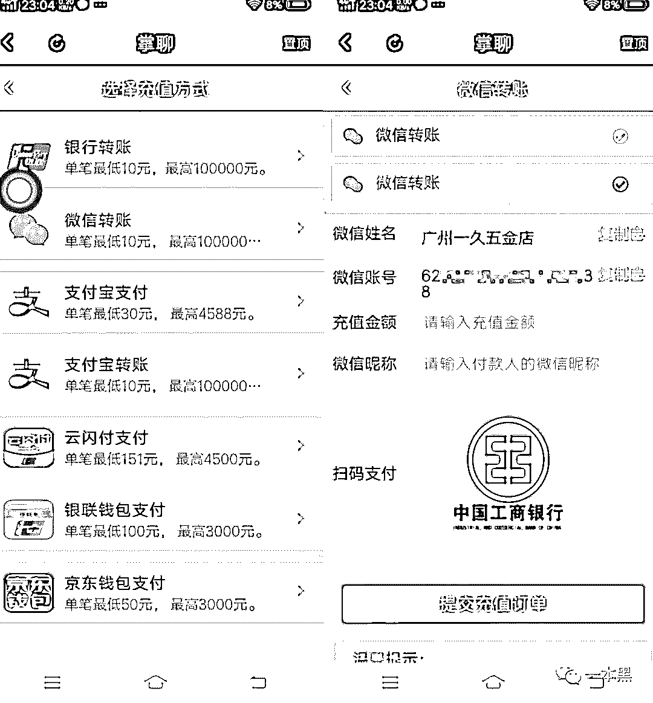******

******这帮人是真的精明，通过不同的充值渠道，把款项进行分散储存。******

******至于该博彩后台到底有多少受害者进行了充值，又充值了多少钱，这不是我们关心的重点。******

******重点是我们通过技术手段，实锤了微博承接赌博广告的证据。******

******在整个过程中，微博是赌博网站的推广者，没有微博必定不会有这么多用户进入赌博网站。******

******并且还有一点，这类赌博推广在微信或者 PC 上是打不开的，但是在微博上就能打开，你说奇怪不奇怪。******

********三********

******按理说，这种地下黑彩属于“黑五类”广告，微博不但不屏蔽，还明目张胆地进行大规模投放，说实话，真够大胆。******

******果然爱拼才会赢。******

******依据《刑法》、《广告法》等相关规定，凡是含有赌博内容的信息，是属于法律、行政法规禁止发布或传输的信息，更不得以广告的形式发布。******

******新浪微博作为广告的流量入口，对广告内容是具有高度审查责任的，我不知道微博是明知故犯还是底下人中饱私囊。******

******翻看微博 2019 年第二季度的财报后我发现，微博第二季度净营收 4.318 亿美元，其中广告和营销营收有 3.707 亿美元。******

******我不知道这其中有多少是非法广告的收入，但我知道，微博发布非法博彩广告，增加平民老百姓陷入赌博陷阱的可能，是一件极其不道德的事。******

******依我看，当今大部分的互联网巨头真的是飘了，我不否认他们对中国互联网做出的贡献，但这种吃烂饭的行为着实让人恶心。真是“取之于民用之于民”，一点都不浪费啊。******

******等等，你以为只有微博一家干这种缺德事吗？******

******我敢说现在大部分流量平台上都存在这种非法博彩广告，这似乎成了互联网公司的通病，他们哪管你广告是真是假，只要钱给够，转身就把自己的用户给卖了。******

******不信？不信你随便打开一个新闻平台，往下翻，准能找到这种打着“兼职”幌子诱导网民赌博的博彩广告。******

******以前 PC 时代的时候，这类博彩广告多见于色情网站，但现在不一样了，现在大家都不要脸了。******

******随着移动端网民的增加，赌博网站的推广逐渐被转移到移动端，利用移动端高达 8 亿的庞大流量，加之高利润网赚噱头吸引网民参赌。******

******这类赌博网站的推广成本其实是很低的，只需要一个廉价域名、固定模板页面、服务器就可以搞定，别看成本低，但是见效贼快，骗的就是互联网上那些网赚小白。******

******这种推广方式比较隐蔽，打着网赚的口号让网友真假难辨，特别是在高利益的诱惑下，部分网民不知不觉就被吸引其中。******

******在违法的同时也深受其害，有的丢掉工作、有的深陷网贷、还有人透支信用卡有家不能回，这样的例子太多了，搜索引擎随便一搜就是大把的案例。******

******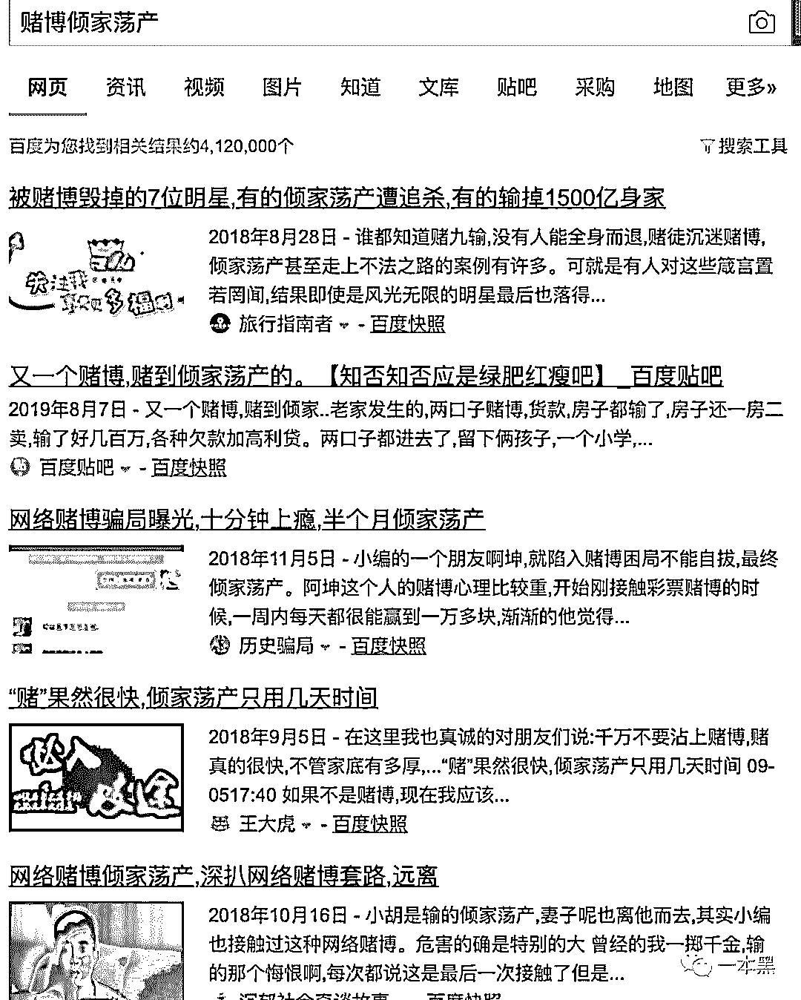******

******总之，一旦陷进去，最终的结果只会血本无归，甚至倾家荡产。******

********中国互联网表面上欣欣向荣，其实背地里这些事又有多少人知道，原来我们所生活的互联网是一个由虚假、欺骗、利益为上构成的虚幻世界。********

********各种“网赚”套路、推广页面堂而皇之地高挂在各大搜索引擎和流量平台上，不停地吞噬互联网原住民和 freshman。********

********我希望你转发这篇文章，让更多人看到当今互联网不为人知的一面，一个人的发声是苍白无力且有限的，真实纯粹的互联网环境需要更多人参与进来。********

********我更希望微博和其他流量平台，赶紧下架这种打着“网赚”噱头的兼职广告，别再坑害无辜老百姓了。********

********毕竟，谁也不想活在一个被欺骗、被套路的互联网世界中。********

******一本黑新社群已开通，社群名字叫做【一本黑的朋友们】，它没有一个具体的定位，里面会聊赚钱案例、想法、思路；它同时也是一个资源对接平台，帮助大家寻找可以合作的资源，但灰黑产严厉杜绝。
同时也会不定期邀请牛人嘉宾进来分享，听大佬的赚钱经历和想法，与牛人交流，是提升认知的捷径。总之，这是一个全新的成长型、认知升级、资源对接社群，后续会在社群内公布各种有趣玩法。**你还没上车？**

推荐阅读：

[私密社群，快上车](http://mp.weixin.qq.com/s?__biz=MzU4ODAwNzUwMQ==&mid=2247486383&idx=2&sn=0821d0bff33285d235b2e1b9af9a9e27&chksm=fde21a8dca95939b496421a2177f83d8022e5a25ce95ea8b2929b17b26fe95aeb5ca902b722a&scene=21#wechat_redirect) 

[国庆出游住酒店被偷拍、房门被强行打开，怎么办？](http://mp.weixin.qq.com/s?__biz=MzU4ODAwNzUwMQ==&mid=2247486399&idx=1&sn=54fc1787c019cad282ebc313971993bc&chksm=fde21a9dca95938ba93690487a435e85c548902b209f80ffc4718275c17605cec48812a1da9f&scene=21#wechat_redirect) 

[玩人性、玩套路，还是社交电商又狠又骚](http://mp.weixin.qq.com/s?__biz=MzU4ODAwNzUwMQ==&mid=2247486418&idx=1&sn=f32d8db5d6b33a5d2697bb4c83aa0baa&chksm=fde21af0ca9593e6d8aae5f5dad4b2dc373f59655edaac05ca67761587bd67cd513c858ff56c&scene=21#wechat_redirect)******