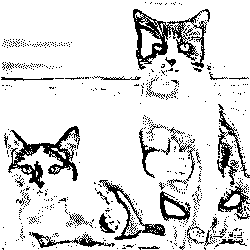
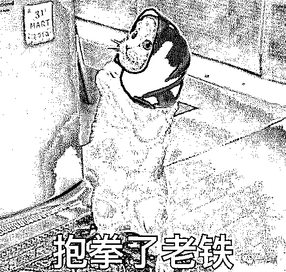
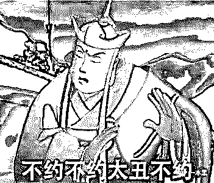
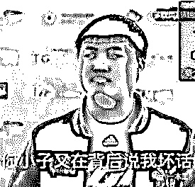
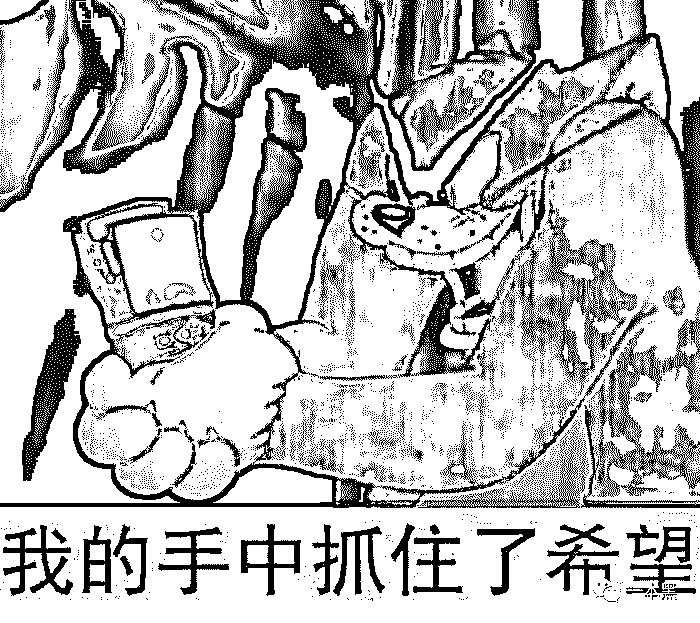

# 怎么回事？拼多多竟被用户反收割？

> 原文：[`mp.weixin.qq.com/s?__biz=MzU4ODAwNzUwMQ==&mid=2247486452&idx=1&sn=603f2a3985b7a4cdcd5221be0a3a25bd&chksm=fde21ad6ca9593c07e00fa75056ba6bb0700c46a71d04954b046351e63e27026b3c726ad74bb&scene=27#wechat_redirect`](http://mp.weixin.qq.com/s?__biz=MzU4ODAwNzUwMQ==&mid=2247486452&idx=1&sn=603f2a3985b7a4cdcd5221be0a3a25bd&chksm=fde21ad6ca9593c07e00fa75056ba6bb0700c46a71d04954b046351e63e27026b3c726ad74bb&scene=27#wechat_redirect)

最近几年互联网出了很多新词，什么下沉市场、增长黑客、私域流量。

词造得越多我越感觉到恶心，这种情况不亚于村口的翠花开个美颜就能变身露丝，菜市场门口的理发小伙剪刀一挥就成 Tony 老师，隔壁的二狗双脚一摩擦就能化身 Michael Jackson 一样。

本质上都是换个市场收割韭菜，包装这玩意骚过了是要上头的。

所以你会看到越来越多的资本开始去玩所谓的下沉市场，但进场进的快，死得更快。

之前不就写过几个作死的社交电商吗？现在你再看，都是些什么妖魔鬼怪啊，除了涉嫌传销，还是涉嫌传销。

为什么呢？因为这些哥几个根本不懂什么是市场，只觉得一线城市的用户高端，他们玩腻了或者玩不过了，觉得应该去逗逗五环外的人群了，所以也就有了所谓的下沉市场。

注意，这里的市场是有上下之分的。

咋滴，一线城市用户就是上等人群，五环外人群就是下等用户了呗。这种肤浅的想法简直沙雕极致。

首先，市场讲究的不是上下，也不是高低，你都把自己的用户按照三六九等来区分了，把他们当韭菜来收割，怎么可能让别人信你，生意靠的是诚信和有用，而不是骚手段。

这玩意就像撩妹一样，你带着为爱鼓掌的态度去，运气好顶多让你醉生梦死一回，你还想地久天长还是咋地。

所以可别再说什么下沉市场了，连态度都不端正，你服务个毛的用户。

没记错的话，下沉市场这个概念好像是从拼多多起来那会出现的，拼多多的用户主要分布在三四线城市，用户在拼多多以低价拼团，会有一种“占便宜”的心理。

毕竟分享是没有成本的，是兄弟就来砍我，这一砍，不就可以低价买到商品了吗？可不就是赚了吗？

这种策略在当下巨头垄断的环境下是有用的，事实也证明了它是一条走得通的路。

最起码人家做到了尊重市场，尊重用户，让五环外人群享受到了便宜，虽说这只是一种“农村包围城市”的策略而已，但对这个市场下的用户来说，他们是互相成就的。

为什么说互相成就，你要知道这个世界并不是所有人都是精英阶层，中国还只是一个发展中国家，没有进行过网购的人一抓一大把。

而拼多多把市场定位放在二三线城市，甚至四五线乡镇农村，一定程度上是打开了这部分群体的网购体验。

而这部分群体最需要的不正是便宜吗？

俗话说得民心者得天下，拼多多 2015 年成立，三年后成功上市，月销售额早已超过 400 亿，这数据让多少巨头叹为观止。

别人探索那么多年做出来的东西，拼多多只花了三年，可不是闹着玩的。

很多人看到这里可能觉得我在给拼多多洗地，并不是，我一直倡导看事情不能只看表面，别跟风，得过脑。

任何事物的良性发展背后必定有其道理，更别说拼多多现在这种体量。

之前有很多人跟风写拼多多假货太多，说实话，我也想写，因为这玩意有娱乐倾向，有人看啊！

但仔细思考后我发现，为什么别人能三年做到上亿用户，铺天盖地的忠实用户，虽然前期确实无品牌的商品多了点，但不管怎么样，人家如今早已跻身电商领域，完完全全的一匹黑马。

很多事情都不是一蹴而就的，当年黄峥在创立拼多多之前有过四次创业经历，不仅涉及电商领域，还做过游戏，最后还是听了很多朋友的意见才有了最早拼多多的商业模式。

社交和电商相结合，就像村口的狗蛋在快手喊老铁 666 一样，里面是有不少商机的。

另外，企业的发展是分阶段的，最开始肯定是想方设法的用策略去获取用户，然后再一步步的优化和迭代产品体验以及服务。

早期拼多多确实有很多无品牌商品，也为人诟病，但各位要记住，这只是拼多多低成本获客的策略，一招鲜不可能吃遍天，它早晚得“改邪归正”。

当年的陌陌就是一个很好的例子。

最早期的陌陌由一个门户网站的产品经理，一个开发，再加上唐岩，他们拿着 30 天 iOS 从入门到放弃，到精通就开干了。

靠着基于 LBS 功能的陌生社交，唐岩似乎实现了自己古惑仔的梦想，成功把一个社交产品做成了所谓的【约炮神器】。

唐岩太懂人性了，但是互联网玩的不就是人性吗？但这东西终究不是长久之计，这只是获客的手段。

虽然那会陌陌遭遇着来自各方的口诛笔伐，也感受到了巨大的压力，所以你会看到陌陌在基于原有产品的调性上，开始有了点洗白的意思。

在经过了 35 个版本的迭代之后，陌陌找到了直播这条路，并且让直播成为了它最大的收入引擎，带动着 MAU（用户数量统计名词，指网站、app 等月活跃用户数量（去除重复用户数））的持续复苏。

但是洗白可不是那么容易的一件事，就像擦去一个人身上的所有污点，是需要时间沉淀的。

前面说过，企业的发展是分阶段的，我毫不怀疑拼多多起家时候的无品牌、低价策略，各位进行抨击也确有道理，别说你们，我都想骂。

但仔细想想，都是干互联网的，骂有个卵用，人得擅于发现别人好的一面，不如去分析分析人家的模式学点东西来得实在。

拼多多这几年攻城拔寨，迅猛的发展让它坐上了社交电商的头把交椅，也在五环外插上了第一电商的大旗。

前期靠低价和部分不规范商品快速获客只是一种手段，但这仅仅只是一种手段，拼多多应该最清楚。

加上现在已经上市，它不可能不对平台的无品牌商品进行治理，而如何摘掉无品牌、质量差这顶帽子，拼多多还得走很长的路。

拿另外两大电商平台来说，阿里最早通过天猫促进了品牌的升级，京东也通过自营拉正了自己的影子。

那么到拼多多这里，它不可能去模仿和复制，况且这条路也不符合拼多多社交电商的调性。

那怎么办呢！

于是拼多多想了个招，在今年 618 创造出了百亿补贴计划，当时我以为这只是个短期的促销活动，但没想到在这波活动落幕之后，拼多多现在依然在干这件事。

看来百亿补贴势必要成为拼多多打响品牌升级的第一枪了。

由于此前 618 积累了不少口碑，很多人已经慢慢接受了拼多多百亿补贴中的商品不可能是假货，毕竟拼多多再傻也不可能拿真金白银去补贴假货吧。

前不久我写过一篇文章讲薅羊毛，其中就提到了拼多多的百亿补贴，当时我还特意问过拼多多的朋友这事靠不靠谱，最后得到的回复是肯定。

凡是贴着百亿补贴标记的，你随便买，假了算我输，也就是说，拼多多联合中国人寿保险推出了正品险，假一赔十。

看来，拼多多之所以推出百亿补贴计划，是想把它当做一个口碑和品牌扭转的窗口，让消费者在拼多多平台既能享受到补贴优惠，又能享受到正品和质量保障。

它的模式是这样的：百亿补贴的商品会在成本价的基础上补贴 5%-50%（即商品的销售价格=成本价-补贴金额）保证售价都是低于市面上行情价，整个活动期间所有商品补贴总金额共计为 100 亿(补完为止)。

参加百亿补贴的商家基本上都同时在天猫、京东开店，发的商品是完全一样且没有任何差别的。

拼多多这次不仅是想让利，还是在烧钱做品牌，加上这次是百亿补贴 X 四周年庆，算是一次难得的叠加活动。

你看，这是不是一次绝佳的薅羊毛机会。

上次给大家说过，我在百亿补贴里买过几瓶酒和一个 Aipods2，怎么说呢，我刚刚上去又看了一下，依然是骨折价。

另外还有苹果专场，iPhone11 系列更是最高补贴 1400 块，这等好事上哪找去？

<mp-miniprogram class="miniprogram_element" data-miniprogram-appid="wx32540bd863b27570" data-miniprogram-path="pages/index/index?target_page=%2fpages%2fweb%2fweb%3fspecialUrl%3d1%26src%3dhttps%253a%252f%252fmobile.yangkeduo.com%252fpromotion_op.html%253ftype%253d34%2526id%253d61535%2526refer_scene_id%253dwxapp_ybh1009" data-miniprogram-nickname="拼多多" data-miniprogram-avatar="http://mmbiz.qpic.cn/mmbiz_png/I3ht2WMGrPhAtiaFy4pxb6lZusKOGeMn6NKIlaIdSyYKerXgoHoIunHvmrTWCibQ1PYwO2OhQoe2RWm22Yeib78hQ/640?wx_fmt=png&amp;wxfrom=200" data-miniprogram-title="拼多多百亿补贴，一起薅羊毛！" data-miniprogram-imageurl="http://mmbiz.qpic.cn/mmbiz_jpg/sVQx2tT1ziaUKTLYpFNdWvib3QLP5QbvodL0gs3ib0m6PhT3Hn87ZoejcytrY7r9svEdyn1Z6Cicqqb9pmLzh8ibc4w/0?wx_fmt=jpeg" data-miniprogram-type="card" data-miniprogram-servicetype="0"></mp-miniprogram>

只要体验过百亿补贴，就是真香。

其实，拼多多百亿补贴的类目范围还是比较广的，除了手机数码，还有家电生活、运动户外、家纺家装、汽车用品等。

反正百亿补贴中的商品价格，都是在商家成本价的基础上，平台再出钱补贴，做到真正击穿底价。

最后说句题外话，我在知识星球里总会分享一些骚操作案例，讲的是一些让人意想不到或者令人窒息的商业或者营销手段。

拼多多的这次百亿补贴计划在我看来就是一个很骚的操作，毕竟从它诞生那天起，就没多少人能看得懂它骚出天际的玩法。

最后，贴一个百亿补贴入口。

<mp-miniprogram class="miniprogram_element" data-miniprogram-appid="wx32540bd863b27570" data-miniprogram-path="pages/index/index?target_page=%2fpages%2fweb%2fweb%3fspecialUrl%3d1%26src%3dhttps%253a%252f%252fmobile.yangkeduo.com%252fbrand_activity_subsidy.html%253f_pdd_fs%253d1%2526_pdd_tc%253dffffff%2526_pdd_sbs%253d1%2526refer_scene_id%253dwxapp_ybh1009" data-miniprogram-nickname="拼多多" data-miniprogram-avatar="http://mmbiz.qpic.cn/mmbiz_png/I3ht2WMGrPhAtiaFy4pxb6lZusKOGeMn6NKIlaIdSyYKerXgoHoIunHvmrTWCibQ1PYwO2OhQoe2RWm22Yeib78hQ/640?wx_fmt=png&amp;wxfrom=200" data-miniprogram-title="拼多多百亿补贴，一起薅羊毛！" data-miniprogram-imageurl="http://mmbiz.qpic.cn/mmbiz_jpg/sVQx2tT1ziaUKTLYpFNdWvib3QLP5QbvodSHKONNvKCpKHD2zv3ge4addv2OSiau9TKk4vEvnLkicAOAnjA7q1hRxQ/0?wx_fmt=jpeg" data-miniprogram-type="card" data-miniprogram-servicetype="0"></mp-miniprogram>

记住，任何企业的发展都是阶段性的，就像当年各大巨头的补贴大战一样，这波羊毛不薅白不薅。

** 真香↓**