# 电子烟利润这么大，怪不得镰刀一把把落下

> 原文：[`mp.weixin.qq.com/s?__biz=MzU4ODAwNzUwMQ==&mid=2247486406&idx=1&sn=9a582ca128bf7736f163f57cf2683e4b&chksm=fde21ae4ca9593f2c78ccaeb053491045f88c19e3df9a17095d01a8ff2493c48082c9508bb7d&scene=27#wechat_redirect`](http://mp.weixin.qq.com/s?__biz=MzU4ODAwNzUwMQ==&mid=2247486406&idx=1&sn=9a582ca128bf7736f163f57cf2683e4b&chksm=fde21ae4ca9593f2c78ccaeb053491045f88c19e3df9a17095d01a8ff2493c48082c9508bb7d&scene=27#wechat_redirect)

【黑话连篇】

该栏目更多的是揭露事件或对事件的看法，以达到让人精神得到升华的目的。

* * *

****你们一天到晚都说要给老师傅递烟递烟的，从来都是递芙蓉王、黄鹤楼和软中华的什么的，我就奇怪了，为什么没有人递电子烟呢？****

 ****难道是电子烟的逼格不够高，入不了老师傅的眼？

不应该呀，就凭那酷炫的外形、缤纷的香型以及那充满金属光泽的质感，怎么看怎么高级，怎么会配不上老师傅？

那，难道是老师傅不够帅，配不上这么高科技的产品？这不存在的，老师傅是个大帅比，一本黑第一帅，我不允许你们诋毁他。

我知道了，难道是质量问题会对老师傅的健康产生危害？可是广告里都写着呢，“ 0 焦油更健康、无害还能帮助戒烟 ” 。

电子烟真的这么厉害吗？

**电子烟是个啥**

**电子烟是啥？大概就是一个带了套的卷烟吧。百度说电子烟是一种模仿卷烟造型的电子产品，但其实从功能上来说，电子烟更接近爷爷用的的烟斗。**

**因为这俩都是通过加热烟油 / 烟丝获取尼古丁，以达到精神上的愉悦，两者并没有本质上的区别，只是电子加热的方式替代了直接燃烧，直接把烟油雾化，不产生焦油罢了。**

**但问题是，烟之所以让人上瘾就是因为里边含有尼古丁，而不是焦油。否则的话，还买什么烟，烧把火也行啊，不仅能吸还能玩火呢。**

**电子烟并没有从本质上解决吸烟上瘾这个问题，不管加再多的噱头，这玩意吸多了还是会上头。**

**理解这个就好说了。**

**你打开淘宝搜索电子烟，你会发现每个电子烟品牌的宣传文案都说自己 0 焦油，对人体无害。甚至还能帮助人戒烟。**

**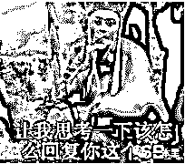**

**我觉得他在故意逗我笑。**

**吸烟有害健康，是每个人都知道的，甭管是卷烟还是电子烟，只要产生烟雾就一定会含有毒物质。**

**已知的烟雾中存在上千种物质，其中有 69 种被确认有致癌风险。**

**而电子烟和卷烟的致癌物区别，除了焦油和一氧化碳以外，没有显著区别。**

**一般常年吸烟的人，食指和中指都是焦黄色，那就是焦油的功劳。如果你喜欢用大拇指的话，那另算。**

**当然了，焦油除了染色，还会导致一系列的疾病，而电子烟能吹嘘的就是这一点了。**

**但是别忘了，除了焦油，烟雾里边还有六十几种其他的致癌物呢，危害同样不容小觑。**

**这么说吧，同样都是慢性毒药，谁能比谁高贵。**

**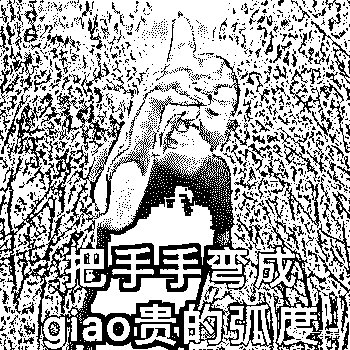**

****逆行的电子烟****

****当国内正在大力吹捧电子烟的时候，其他国家已经开始颁布电子烟的禁售令了，比如美国，9 月 11 号美国就颁布了关于调味电子烟的禁售令。****

****这是为嘛呢？电子烟这么赚钱的一个生意，他们是脑子有问题吗？有钱不赚。****

****当然不是，因为恰饭虽好，但是不恰烂饭，生意才能长久，这是生意人的共识。****

****根据美国有关部门确认，目前全美由电子烟引发的肺病大概为 530 起，其中 6 例导致死亡。****

****这只是美国一个国家的数据，其他禁止销售电子烟的国家，每个都能撂出一摞的资料来证明电子烟同样会导致肺病、呼吸道疾病等一系列问题。****

****一个对人体有害的新事物，当然是能禁止就禁止。****

****但也不知道是谁给了电子烟厂家的胆量，居然敢公然在广告里标注电子烟对身体无害这种虚假信息。****

****甚至还有的厂家为了赚钱，竟然把尼古丁说成是对人体有益的有机盐。****

****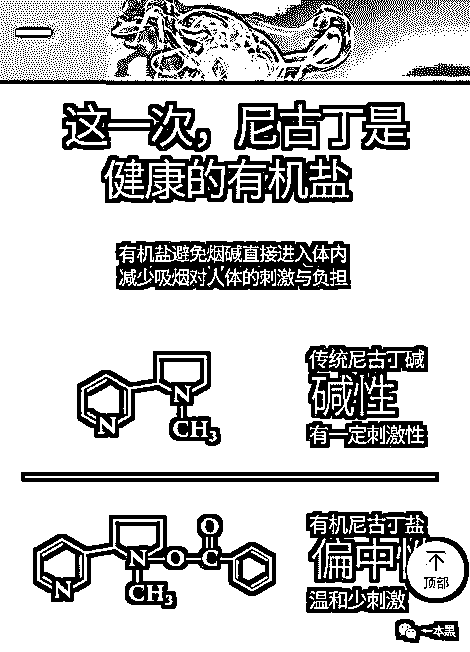****

****尼古丁盐的加入，会使得烟油雾化后尼古丁能够充分被人体吸收，尼古丁盐只是改善了口感，并不会把高浓度的尼古丁变成什么有用的东西。****

****为了赚钱，脸都不要了吗？****

****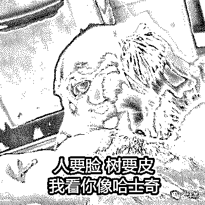****

****不仅如此，由于电子烟的加热线圈本身就是金属，所以电子烟的烟雾里面还会含有更多的金属成分，比如铬、镉和铅等，而这些是传统卷烟所不具备的。****

****重金属到底对人有没有毒，我觉得这个不需要探讨。****

****至于戒烟，更是无稽之谈了。****

****电子烟是中国人发明的，2003 年就诞生了，距今已经 16 年。你看看街上吸烟的人减少了吗？****

****用电子烟替代卷烟，让人戒烟，就像是让老师傅抽女士香烟缓解烟瘾一样。感受大概只有一个，那就是不过瘾。****

****传统卷烟，尼古丁含量高且固定，想减少尼古丁的摄入，除了少吸几口，没有其他的办法，但是电子烟可以调整尼古丁的含量。****

****烟之所以让人上瘾就是因为尼古丁，如果电子烟不再含有尼古丁了，那就不会有人上瘾，那么这门生意就不再会是可持续的了。****

****糖能让人上瘾，所以不管什么饮料，都会含糖。即使无糖可乐，都加了甜蜜素来替代糖，但你能说甜蜜素是个好东西吗？****

****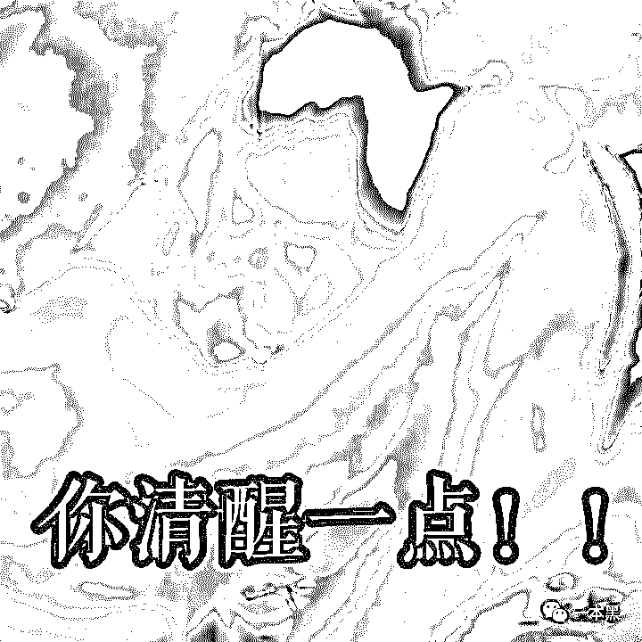****

****如果一款电子烟声称自己不含尼古丁，但仍然会让人上瘾，那就一定是有问题的。要么隐藏了成分表，要么用了替代品。****

****但是如果一个不想戒烟的人，想要通过电子烟的方式获得等量的尼古丁，就意味着得吸更多。而且电子烟方便啊，随时随地掏出来就能吸，还不要丢烟头。****

****真是“利人利己”呢。****

****至于那些声称不含尼古丁不含焦油的电子烟，我在网上搜了一下，基本没写成分表，没写就是没有。不愧是优秀厂商的惯例，这操作同样堪称优秀啊。****

****有一个比较有名的日本牌子，配料倒是写的详细，就是一堆香精+维生素+甘油。****

****我有点疑惑，这和水果软糖的成分不是一样的吗？除了不含糖。****

****所以，当香烟变成香精，这玩意就对健康有益了吗？甚至广告里还写着能美容冻龄。****

****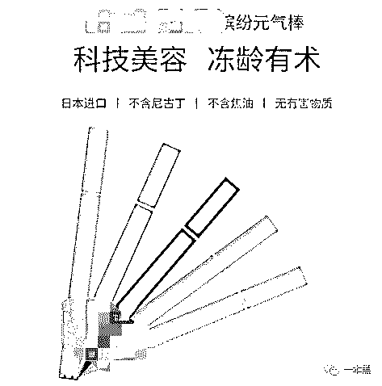****

****我感觉我的智商受到了侮辱。我是吸了防腐剂吗，为什么吸香精能冻龄？别提那点少的可怜的维生素了，大部分维生素在高温下都会失效的。****

****靠吸烟补充维生素？****

****你在这等着，不要动，我去给你买俩橘子吧~****

****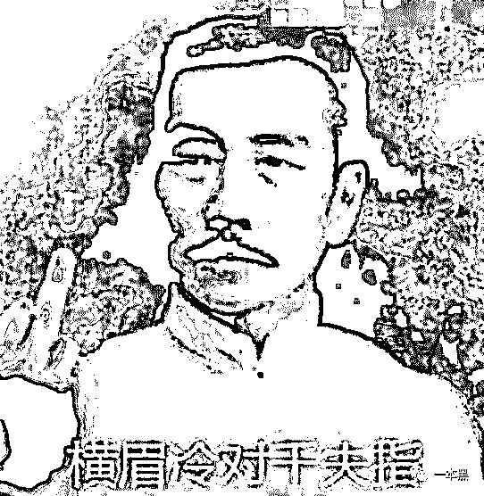****

****我感觉自己突然发现一个赚钱的好机会，专门定制各种香型的电子烟，反正电子烟的技术也不存在很大的差异，香精却是千奇百怪。****

****比如，专为吃辣人群定制的藤椒、花椒、老干妈味；肥宅人群专属的薯片、可乐、奶茶味；为夜宵爱好者量身打造的蒜烤生蚝、铁板韭菜味。****

****想想就刺激，而且应该会挺受欢迎。既能解烟瘾还能解嘴馋，戒烟又减肥，真是一举两得。****

****目前市面上主流的电子烟都爱标榜大烟雾，因为大烟雾更好玩。吸一口就能吐出比传统卷烟多得多的烟雾，但其实就是污染范围更大了。****

****小烟虽然开始流行，但它和大烟并不冲突，也不会取代大烟的存在。（小烟，是一种烟雾相对较小，但号称更卫生更健康的电子烟。）****

****中国人什么都喜欢大的，以至于星巴克连小杯都没有，上来就是中杯。****

****大，更大，最大，或许是人类永恒的追求。****

****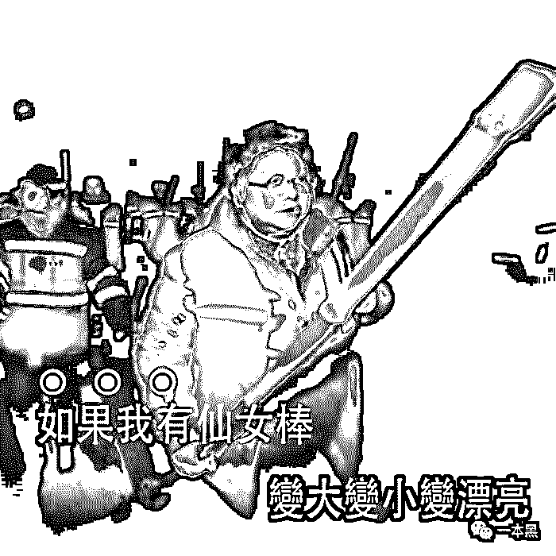****

****尽管品牌商都说电子烟的烟雾密度更低，更容易消散。但是换个角度理解就是，密度更低，飘得更高，扩散的范围更广，被迫吸二手烟的人更多。****

****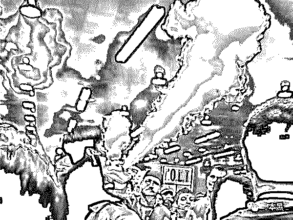****

****真是牺牲千万家，造福你一个啊。****

****曾经还有人认为电子烟可以作为重度烟瘾孕妇的戒烟选择，但实验证实，电子烟会对胎儿的肺部发育产生不良影响。（ 所以强烈建议大家不要在公共场合吸烟，尤其是有孕妇和小孩在场的时候。好人卡致谢）****

****你看吧，电子烟没那么神奇，再怎么吹它也不是一个好东西。****

******野蛮生长的电子烟江湖******

******说到这，肯定有人不服，说电子烟一种高科技产品，是有专利的。科技是有科技，至于高不高，也就那回事吧。******

******况且绝大部分的电子烟是代工的，有多少科技含量取决于品牌和哪家代工厂合作。******

******据统计，中国一共 678 家电子烟厂，深圳占 86.7%；烟油 66 家，深圳占 77%。这 678 家厂商生产了世界上 90%的电子烟，而这些代工厂正在不停地加强科技投入，想让烟油在最短最小的空间内，传输更多的尼古丁给使用者。******

******有数据显示目前国内的电子烟品牌（雾化器）大约有 1558 家，也就是说平均每两家品牌就会共用一家代工厂。******

******你买的张三牌和李四牌电子烟，极有可能来自同一个工厂，除了外观以外几乎没有区别。当然了，OEM 是目前最主流的趋势。******

******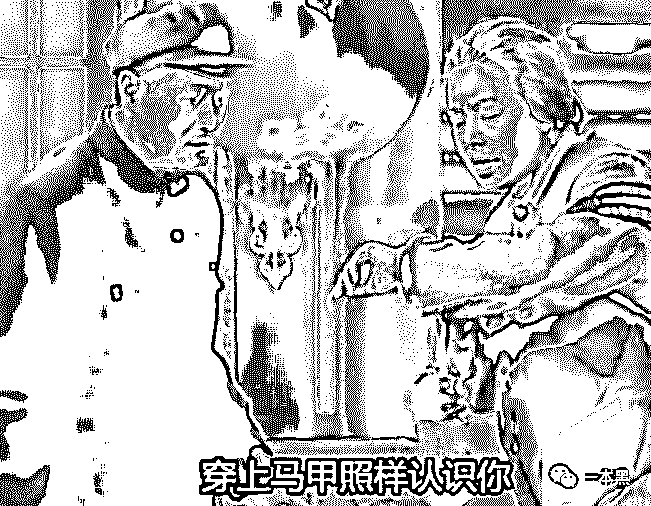******

******还有一种叫 ODM，就是完全的贴牌了。不管是外形、功能、组件，全都由厂家提供，只要打上品牌方的 logo 就行。******

******如果你很不幸花高价买到和张三李四同厂同外观同功能的王五牌电子烟，那就恭喜你了。（悄悄说一声，你买的很多零食品牌，都是采用这种模式哦。）******

******老罗和陈冠希的小野电子烟同样是 OEM 模式。******

******想当初老罗离开新东方做牛博网，后来牛博网挂了。******

******老罗曾经想用手机改变世界，后来锤子凉了。******

******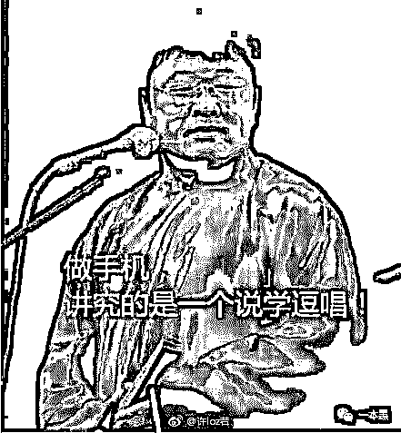******

******老罗也曾公开称抽烟有害健康，于是他做了小野电子烟。我觉得老罗应该把这句话改成“抽卷烟有害健康”，这样更有利于他卖电子烟。******

******所以如果你此时想进入电子烟这个行业，你最好把老罗当成标杆，一旦小野开始衰败就是你要离场的时候。******

******在经过 16 年的野蛮生长后，电子烟在今年迎来了爆发期。无数的资本涌入电子烟行业，于是一个新的风口又来了。******

******有业内人士透露，电子烟的毛利，70%起步。一支售价在 300 左右的电子烟，进货价约为 30 元。如此高的利润，谁不会心动呢。******

******“如果有 10%的利润,它就保证到处被使用；有 20%的利润,它就活跃起来；有 50%的利润,它就铤而走险。”资本论里的这句话，同样是电子烟现状的写照。******

******电子烟这个市场，目前是处于野蛮生长的阶段，没有强有力的对手，入行门槛又低。谁不想来分杯羹呢？******

******最开始做电子烟的，很多都是白手起家的，找厂家联系货源然后在朋友圈发图卖货，有人要就先付钱，再找厂家直接发货。就一个中间商，啥成本都不要，光是利用信息差，就赚了个盆满钵满的。******

************

******后来干这个人多了，就开始有人寻思着自己弄个品牌，还是原来的工厂还是原来的货，换个包装贴个牌，就能卖更高的价。******

******你不需要懂技术，甚至你也不需要懂产品，瞄准市面上卖的最好的几个品牌，然后相同的组件、烟油来一套，再加上一点营销技巧，在抖音微博刷一刷流量，这就是一个成熟的品牌了。******

******你的，就是我的。反正都是一个妈生的，不管叫张三还是叫李四都是流的一样的血。******

******电子烟火起来就这几年，品牌忠诚度还没有形成，只要有的新的噱头，就总有人愿意尝试。所以小野一上场，就收获了一大波粉。******

******中国烟民 3.2 亿，2017 年买电子烟的才 3500 万，也就是说电子烟的普及率才 10%左右。这个时候只要你会演讲，你就一定会有信徒。老罗深切地知道此时入局虽然晚，但仍然有机会，于是他来了。******

******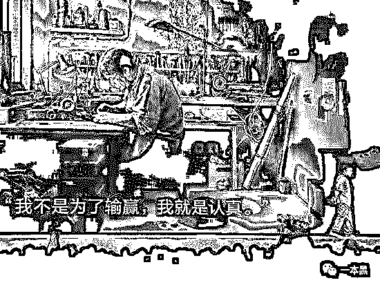******

******我不知道你有没有观察过现在的年轻人，他们的日常除了蹦迪也爱抽烟喝酒，抽烟人群的日渐低龄化，迅速扩大了烟草这个市场的边界。******

******再加上电子烟主要在网上销售，虽然法律明令禁止向未成年人销售香烟，卖家也都在文案里装模作样地写着禁止向未成年人销售电子烟，但是生意当头，还不是想买多少买多少。******

******我在询价的时候，可没有一个人问我是不是成年了。******

******那些电子烟品牌在各大社交媒体投广告的时候，也没有想过受众里是不是有很多孩子存在。******

******每一个做电子烟的，都是出于赚钱的目的，但很多人还非得打着公益的名头，说是为了国人健康，这就有点扯了。******

******赚钱就光明正大的赚钱，别给自己整高帽，也不怕摔死吗？******

* * *

******也不知道从什么时候开始，电动牙刷就火了起来，那阵子只要我打开微博，满眼都是电动牙刷的广告。后来这东西慢慢就冷下去了，毕竟就是个牙刷，再好用也不可能天天买。******

******于是热度过了，大家又想了个新法子赚钱。******

******什么球鞋啦，盲盒啦，然后就电子烟啦。******

******这仨简直是割年轻人韭菜的三把巨镰，还是齐头并进的那种。要说赚钱那还是电子烟赚钱，烟能天天抽，鞋和盲盒不可能天天买啊。******

******首先，钱不够；其次，钱还是不够，单价太高了，钱包 hold 不住啊。******

******但是电子烟不一样，烟弹是个消耗品，只要你够勤快，三天换一个不成问题。如果你抽一次性小烟，几天换只新的，也不是不可以。******

******况且，大家还觉得电子烟健康呢？每天来几口，延年益寿、冻龄固颜，还能为经济发展做贡献。******

******真是美滋滋。******

******但是烟就是烟，加再多噱头，再朋克，也还是会让人上瘾，还是会对健康产生不良影响。******

******没那么毒≠没毒。******

******电子烟早应该走下神坛，它不新奇，也不健康。******

******待在那么高的位置，接受众人膜拜，它真不配。********** ******************************一本黑新社群已开通，名字叫【一本黑的朋友们】，它没有一个具体的定位，里面会聊赚钱案例、想法、思路；它同时也是一个资源对接平台，帮助大家寻找可以合作的资源，但灰黑产严厉杜绝。********************同时也会不定期邀请牛人嘉宾进来分享，听大佬的赚钱经历和想法，与牛人交流，是提升认知的捷径。********************总之，这是一个全新的成长型、认知升级、资源对接社群，后续会在社群内公布各种有趣玩法，还不赶快上车？********************      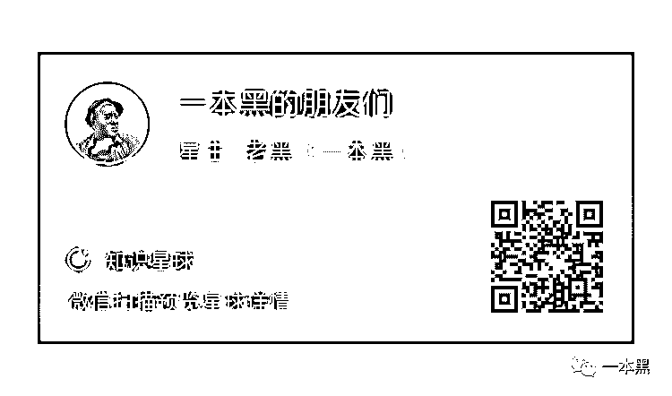**********