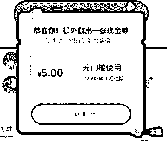
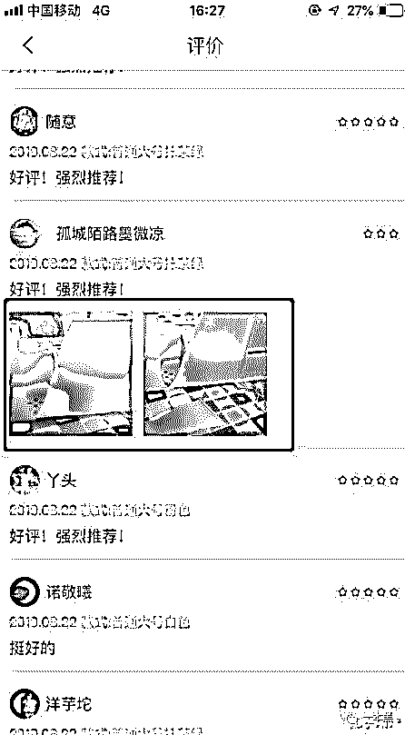
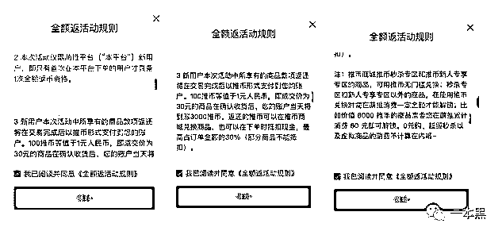
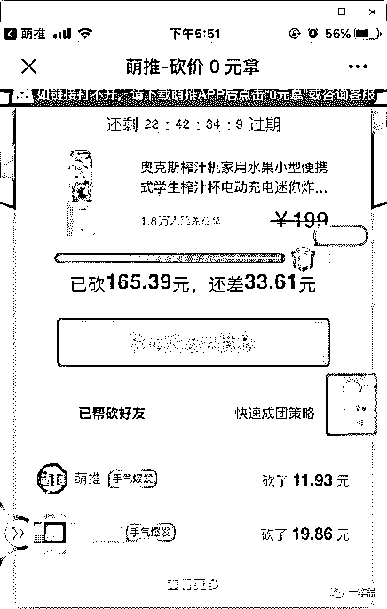
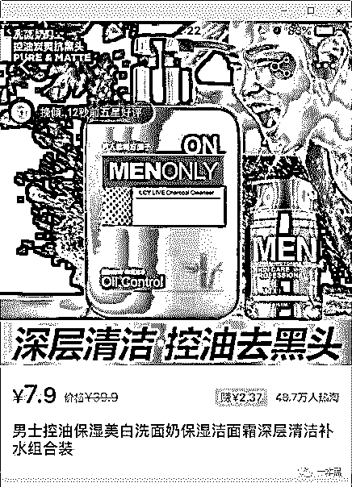
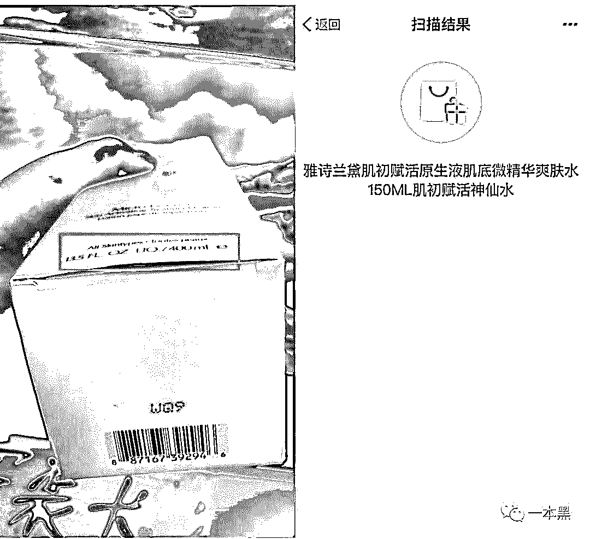
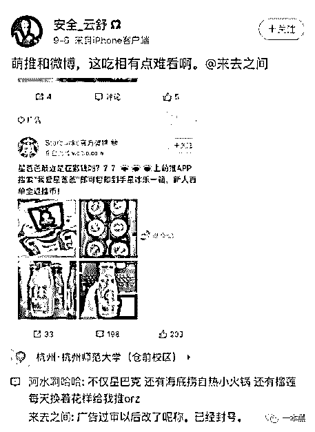
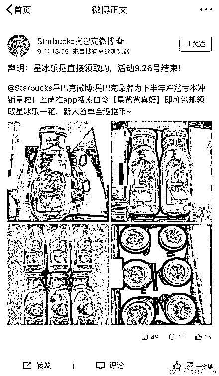

# 玩人性、玩套路，还是社交电商又狠又骚

> 原文：[`mp.weixin.qq.com/s?__biz=MzU4ODAwNzUwMQ==&mid=2247486418&idx=1&sn=f32d8db5d6b33a5d2697bb4c83aa0baa&chksm=fde21af0ca9593e6d8aae5f5dad4b2dc373f59655edaac05ca67761587bd67cd513c858ff56c&scene=27#wechat_redirect`](http://mp.weixin.qq.com/s?__biz=MzU4ODAwNzUwMQ==&mid=2247486418&idx=1&sn=f32d8db5d6b33a5d2697bb4c83aa0baa&chksm=fde21af0ca9593e6d8aae5f5dad4b2dc373f59655edaac05ca67761587bd67cd513c858ff56c&scene=27#wechat_redirect)

【黑话连篇】

该栏目更多的是揭露事件或对事件的看法，以达到让人精神得到升华的目的。

* * *

****前两天在黑猫投诉上发现了一个名叫海豚家的海淘 APP，logo 极其暗黑酷炫，评论也是一水的乌七八糟。********再后来我又在微博和抖音看到了萌推，时间再往前推一阵，正好有人在社群里问我关于淘集集模式的问题。********所以今天，我就给大家讲讲这些社交电商是如何玩人性、玩套路的。********这几个购物 APP 成立时间都不长，几乎都是去年出生今年爆火。********在哪火的？那自然是哪人多就在哪火的。譬如，抖音、快手、微博，都是社交平台。********有人的地方就有生意（羊毛），所以这些平台的推广文案都极其诱人，比如：平台现在做活动，麻辣小龙虾虾尾只要 39.9 一盒，收货后可以全额返现。********盛夏吃虾尾，人间乐事；0 元薅虾尾，羊毛盛宴啊。********于是很多人兴冲冲地在 APP 下单了，结果到手发现根本不是这回事。********虾尾的确是虾尾，也很大一盒，但就是有点奇怪的气味。********返现也的确返了，但返的不是现金而是代币，还不能提现。想要拿代币去买东西，却发现想买的都不能用代币。********这真是尴尬啊。**********社交电商与拼团购************这些 APP 都是目前最火的社交电商平台，其实就是靠社交平台火起来的电商，本质上和淘宝、京东并没有什么很大的区别。************这些平台流量巨大，但口碑却呈现出明显的两极分化。************由于前阵子萌推在抖音上做了很多广告，以至于它到现在还霸占着 App Store 免费榜第六名的位置，排在前五的有两个购物 APP 分别是拼多多和淘宝特价版。************好家伙，这流量都快赶上巨头了。************打开 APP 就提示有新人红包可以领，我觉得很开心，一来就送钱，这 APP 真实在。************结果打开一看，是个 5 块钱的优惠券，有效期：24 个小时。刚领完就提示我红包快过期了，让赶紧用掉，并且红包底下还有个倒计时，时刻在催促着你赶紧去买东西。************************哦，营造紧迫感 ！这个营销套路我知道。************看了看平台上的商品，发现一个比一个便宜，而且买东西还能返现。************好像很划算的亚子，评价还都是五星好评。************就是牌子都没怎么听过，好不容易找到个听过的洗发水牌子，结果价格直接腰斩，比其他平台旗舰店便宜了一倍！！************真的有这么好的事吗？************一件商品，如果毁誉参半我觉得正常，但是放眼望去全是 5 星好评，就会让人心慌。************于是我去微博、知乎搜了一下。************发现这个 APP 不是一般的骚，原来用户发个商品评价还需要后台审核。审核不过，你就无法评论。************看看下面那个收纳筐，东西都四分五裂了，还是五星好评呢。我想我明白那清一色的好评是咋回事了。************************于是我又看了看返现的规则，就一个感受，太鸡贼了。******

************

******首先，返现不是返现金，而是返推币，100 推币能抵 1 块钱。但这个推币不是随便哪个商品都能用的，要指定商品。（一般来说指定商品都是你不太想买的那些商品。）************其次，只有在确认收货以后才能拿到推币，推币能用于下次买东西抵现。抵多少呢？≤30%，并且指定商品才能抵扣。************还有，你如果看中了一个商品，想要用等量的推币去换。不好意思了，你可能没有资格。想要购买这个商品，你需要在平台再买同价值的东西，才能解锁购买的资格。************有网友表示自己解锁资格可以买的时候，永远找不到等价的商品。比如，我有 5000 个推币，想买个 50 块钱的东西。不好意思，平台上找不到价值 50 块钱以下的商品了。************去哪了？咱也不知道，咱也不敢问。************一个购物平台，用自己的推币买东西还要解锁资格？打怪升级吗？************真是刺激二次消费的好手段啊。永远用不完的推币，永远停不下来的买买买。************除了返推币，平台还有砍价 0 元拿专区，和很多购物平台的砍价免费拿商品一个策略。但这个有一点不一样，这个不仅可以砍价，还可以领红包抵扣。但是领这个红包套路也是蛮多的。************要分享之后才能领就算了，一个 20 块的红包分成四五次给也算了，但为什么每次领还要等个几分钟到十几分钟不等。************************最搞笑的是，你一旦参加了这个砍价活动，就得一直停留在这个页面，因为压根没有返回键。想要返回主页面，那就只能退出活动。************？？？************为了增加用户使用时长，也是不择手段了。************等你历经九九八十一难，终于买到商品的时候，你极有可能会和其他用户发出一句同样的感慨：哦豁，这是个什么垃圾。************以上只是萌推套路的一部分，还有更多的等着你去解锁。**************每一家都是套路****************不止是萌推，千万用户级的淘集集同样如此。淘集集上的商品价格简直低到令人发指。****************我在上面看了一瓶男士洗面奶，乍一看以为是曼秀雷敦，毕竟包装和代言人都一样。但是一看价格：7 块 9？****************果然不对劲，因为看完商品详情也没发现这个洗面奶是啥牌子的，人家就叫【男士控油洗面奶】。****************又或许它叫【男人就得好面子】牌洗面奶，不晓得你们找不找得到品牌名在哪里。********************************没有品牌名，所以不存在侵权问题，充其量叫“如有雷同，纯属意外。”****************后来我又看上了一款抽纸，90 包，原价 90，现价只要 5 块 8 ？还能返 1 块 7。****************天上掉馅饼啊这是。****************结果点开一看，10 包体验装 5 块 8。原来不是总价 5 块 8，而是 5 块 8 起，这个套路也是阔以哦。****************该款商品热销 3.9 万单，一看评论 4 条。****************这些还只是开胃小菜，等东西到手，就会有更多的问题，比如货不对板、商品破损、收不到货、退不了款。****************总而言之，坑。****************但是人家淘集集秉承的就是低价低质的宗旨，哦，对不起，是低价优质。质量这种东西见仁见智的嘛，没有统一的标准，但起码低价人家做到了。****************咱也不能苛求太多，毕竟咱不仅买到了货还买到了教训。买一送一，划算。****************但如果，你本身对质量并不太看重，那，那就算了，当我没说。****************不过随着消费升级的到来，大部分人不仅看质量还看品牌，所以海淘近些年也发展的很火爆。于是海豚家这个号称只做成本价的跨境电商平台就迅速火了起来。****************但是成本价需要你购买平台的会员，199 元/年，海豚家的价格相当于其他平台的七八折，且保证正品。****************买东西嘛，在哪买不是买。毕竟从来都只讲品牌忠诚度，可没听人说过平台忠诚度的，于是大家都奔向了海豚家。****************某段时间里，海豚家在 APP 的排名甚至还超过了萌推，由此可见 我国居民的消费力有多强 平台的吸引力有多强。****************步子迈大了，总会扯到蛋。海豚家也同样如此，用户量迅速上涨的同时，服务也没跟到位。****************比如找不到客服，东西到手却发现居然是临期甚至过期产品，查防伪显示其他品牌的产品。此类投诉的在微博和各大投诉平台上比比皆是。********************************货不对码（图片来自锌刻度）****************于是有人说，海豚家收了会费，却没能给用户提供相应的服务。实在可耻。****************我不知道你有没有发现这个定律，但凡依靠社交平台迅速火起来的品牌，都或多或少存在这样的问题。****************不止问题相似，他们火起来的套路也同样相似。******************社交平台推起来的社交电商********************首先，一个平台想要火起来，要有一个定位，或者有一个口号。在我看来这两者是差不多的，毕竟大部分的品牌并没有明确的定位，他们的定位可能比口号换得还频繁。********************购物平台，要说什么东西最吸引消费者，那还得是 **便宜** 啊。********************虽然人人都说自己看中质量，但其实前提是低价。物美价廉才是大家真正喜欢的，但是很多人都不会说出后半句，只会默默地把各种砍价拼团的消息发在群里，然后说一句“麻烦给我砍一刀”。********************但有时候有些东西，你还就喜欢买贵的，价格要是太便宜，你肯定会觉得有鬼。因为，“这个牌子不可能这么便宜”。********************品牌溢价的前提是你觉得这个品牌真的值这么多钱，毕竟你可能愿意上万块买双 AJ，却一定不会买上万块买莆田，就算莆田的质量更好。********************这就是品牌的力量。********************所以很多平台从来不会说自己是因东西便宜才会被消费者喜欢，都是说自己平台的商品质量好、渠道靠谱，但其实大家都知道是怎么回事。********************有了口号之后就要实施，让用户知道真的能占便宜。什么便宜人人都爱呢？当然是羊毛，不要钱的那种。********************于是这些做电商的都在抖音、快手、小红书这些地方投广告，不仅伪装官方发广告，还会找各路大 V 一起推。**********

********************

********** 一个伪装成星巴克官方的假官方********************什么广告呢？开头说的那种，不要钱、免费领价值 XXX 元的商品。原价 999，现在免费送，只要下载 APP 注册就行。********************“小米手环、星巴克咖啡统统免费送”。不要钱的，不要白不要啊。就算后来发现拿到手的并不是广告上说的东西，问题也不大。因为这是不要钱的，还是赚了啊。********************于是大家纷纷呼朋唤友来捡漏，就靠这一招，APP 的注册量就能上来了。********************一般只要上过当了，大部分人就不会再愿意相信平台了。但如果平台说买东西还是能全返，依然不要钱呢？那你可能就会犹豫了吧。********************“不要白不要”和“反正便宜”让很多人心甘情愿为低质买单，并且还会安慰自己的朋友，一分钱一分货啊。********************可一分钱一分货是我们自己对于商品的评价，不应当成为平台推诿的理由。既然说了，就应该要做到，消费者没理由为平台的欺骗行为买单。********************便宜和好货是平台自己推出来的，不是消费者硬逼着平台给的承诺。****************************************拼多多的成功上市让很多人明白，不管什么时候，低价都会是人们购物时的主要考虑因素。********************于是很多人都杀红了眼，拼命挤进早已饱和的市场，想要打着低价的名号割用户的韭菜，再用低价的借口堵住他们不满的嘴。********************人人都想成为拼多多，百亿市值、达斯达克敲钟是他们的追求，但不太可能再有下一个拼多多了，毕竟市场的容纳度是有限的。********************用户的信任同样是有限的，那些靠套路忽悠用户起来的平台，想要长久走下去，还是趁早收手的好。********************套路用一次就行了，毕竟用户也不是傻子。********************不被套路在看 ↓**********