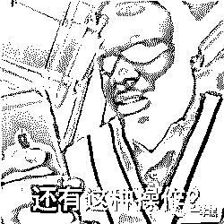
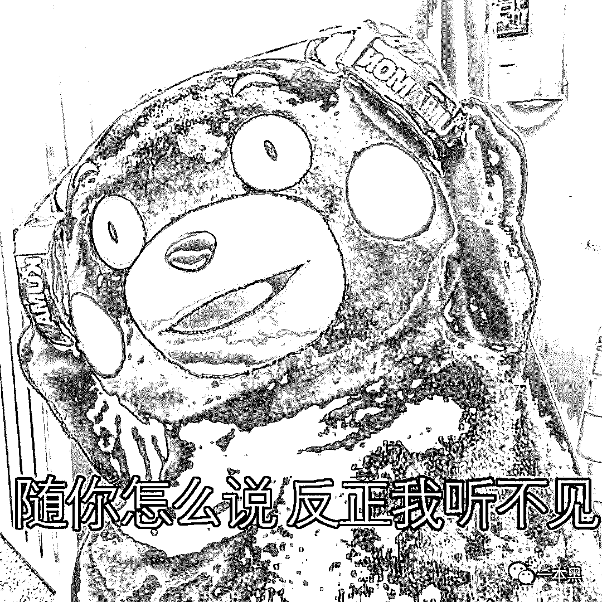
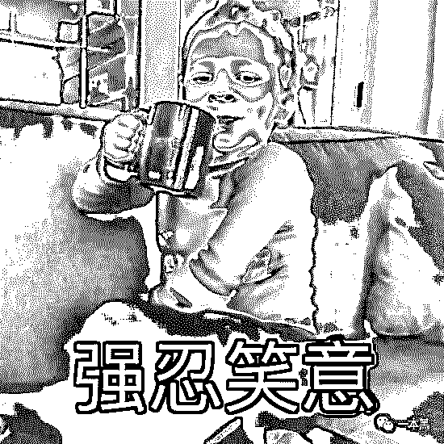
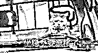
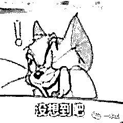
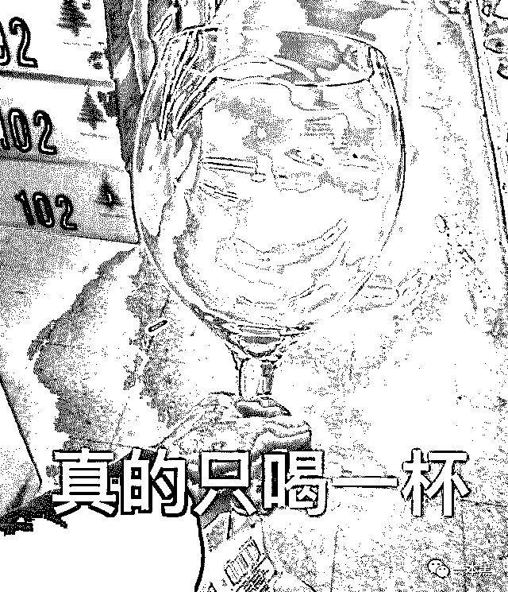

# 感觉拼多多这次要被“羊毛党”薅死

> 原文：[`mp.weixin.qq.com/s?__biz=MzU4ODAwNzUwMQ==&mid=2247486375&idx=1&sn=588e63c45d350f2549de02ce2ac221cf&chksm=fde21a85ca9593931d4e8f3a0215b61d106296c2124c29ee8a140fe219d034a353dc7d6986cb&scene=27#wechat_redirect`](http://mp.weixin.qq.com/s?__biz=MzU4ODAwNzUwMQ==&mid=2247486375&idx=1&sn=588e63c45d350f2549de02ce2ac221cf&chksm=fde21a85ca9593931d4e8f3a0215b61d106296c2124c29ee8a140fe219d034a353dc7d6986cb&scene=27#wechat_redirect)

大家好，我是老黑。

上个月我不是开了个知识星球吗，其中里面有个小栏目叫【骚操作】，会不定期分享一些让人意想不到、或者令人窒息的操作。

其中有个案例和薅羊毛有关，讲的是前几年的阿里小号，那会阿里小号申请后可以随机拿到一个号码，这个号码可以用来发短信、打电话，对方看到的也是你小号的号码，而不是真实号码。

说到阿里小号，其实人家那会的初衷是为了给用户提供一个防骚扰、防隐私泄露的解决方案。

但这个时代，骚人自有骚操作，阿里小号被不少人盯上，最后被薅得头都秃噜皮了，也正是由此，产生了一系列的连锁反应。

比如那会很多平台有新用户优惠活动，像美团、饿了么刚刚出来的时候，都在玩补贴大战，只要新用户注册就可以免单或者打折，打到骨折那种，你说害不害怕。

而这种玩法基本上是羊毛党最乐意看到的，简直就是羊毛党的年会。

所以那会有不少羊毛党就利用阿里小号去薅这些平台的羊毛，只要五块钱申请一个阿里小号，就可以名正言顺的白嫖了。

但其实这种薅羊毛的玩法是比较初级、且一次性的，你知道最骚的是什么吗？

那会滴滴还在玩补贴大战，抢占市场，新用户和司机都有各种优惠和补贴，不少人就用阿里小号去打车，跑一个大单子，然后跟司机说有急事，过一会付钱，然后......然后就溜了......

因为当时乘客用的是阿里小号，这玩意又不是实名的，所以司机找不到乘客，没办法只能吃哑巴亏。

这其实就是钻了当时滴滴的一个漏洞，当然现在已经完善。

不过这种操作都还不算是最骚的，你能想到这帮羊毛党还能把滴滴发票也顺便给薅了吗？真的是见缝就薅，残酷无情啊！

那会阿里小号有回收机制，就是你这个号码过期后，会自动回到他们的池子里。

加上很多人有开发票的需求，所以那会不少人就用阿里小号去批量登录滴滴，运气好的会发现，有一些信誉比较好的用户打车基本上都是用的阿里小号，上面就会留下很多打车记录。

这帮人就用别人的打车行程去开发票，填写公司抬头就能搞定，所以当时因为阿里小号引起的一系列连锁反应，不仅让阿里小号本身失去了原本的初心，滴滴也被薅得够呛。

另外，我记得当时有个机制是这样的，如果乘客不给钱，但是也没办法找到乘客的话，滴滴会给司机承担 50%的费用，剩下 50%则由司机自己承担，但即便是这样，司机照样伤不起。

当然，这都是过去的事情，现在基本上不会出现这种情况，阿里小号被限购，滴滴也必须要求实名制才能使用，一切都完善了起来。

整个事情看下来，其实这就是一种攻防关系，有心人利用阿里小号薅羊毛，滴滴因为存在漏洞被薅得直挠头，这不就是一种声东击西，隔山打牛吗！

阿里小号这边的羊毛出在了滴滴身上，滴滴本身因为风控的原因，被人利用阿里小号去开发票，他们之间存在一种“不正当”的“平衡”关系。

这种关系放在很多问题上是一样的，要解决某个问题，不是直接去解决问题的核心，而是需要解决一连串的问题才能到那个最大的问题。

另外，通过这件事最后我发现，滴滴的投资方里，阿里巴巴是其中之一，你说，尴尬不尴尬。

其实说到薅羊毛这件事，基本上每个人都干过，小便宜谁都想占，那些把薅羊毛当成自己职业，薅出一套房一辆车的比比皆是。

我认为，专业薅羊毛首先是不合规的，是一种游走在法律边缘的游戏，它是规模化的玩法，得考虑时间成本、批量操作等等。

但是另一种，比如某某新平台注册优惠、满减什么的，大家去参与一下很正常，这种基本上没什么门槛，人人都可以参与。

毕竟这是在规则范围内，只是借用平台拉新来满足自己占便宜的心理，自己在尝试新事物的同时，最起码也能省点。

某种层面上来说，这是一种皆大欢喜的结果。

有时候有什么合规羊毛可以薅的，我都直接在社群里告诉大家，让大家去体验一下。

但最近在社群里不少人私信我，问拼多多的羊毛可不可以薅。

这不是前几天 iPhone11 刚上市吗，很多人说拼多多的 iPhone11 怎么这么便宜，补贴下来到手价才 4999 起，这靠谱吗？

另外还有拼多多的戴森吹风机和机械键盘什么的，都比京东要便宜好几百；还有各种手机和笔记本电脑，都是全网最低价，而且比官方的渠道还要便宜。

当时我还不信，我说新 iPhone 这不才刚上市吗，怎么可能便宜这么多，所以我就上拼多多看了看。

这不看不知道，一看真的吓一跳，首先就拼多多产品本身来说，做得真的牛逼，各种领劵、拼团、积分福利，怪不得拼多多三年就上市，是有一定原因的。

看着很多低于官方售价的商品，我也产生了好奇，拼多多的各种品牌商品价格为何如此之低？

还好我认识几个拼多多的朋友，所以我就直接发微信问他们，我说你们这些品牌商品为什么这么便宜啊，现在的品牌渠道不都很透明的。

结果这位朋友告诉我，他们针对这些品牌商品其实是在搞百亿补贴活动，渠道拿到的商品肯定不可能这么便宜，百亿补贴的商品价格是在商家成交价的基础上，平台再出钱补贴，做到真正击穿底价。

我之前倒是体验过拼多多，那会有很多调侃拼多多的报道，所以我还是有个疑问，这些货能保证正品吗？

我这朋友说，凡是贴着百亿补贴标记的，你随便买，假了算我输，也就是说，拼多多联合中国人寿保险推出了正品险，假一赔十。

参加百亿补贴的商家基本上都同时在天猫、京东开店，发的商品是完全一样且没有任何差别的。

加上前不久看到不少大 V 也针对拼多多百亿补贴这事发表过观点，所以我敢确信，拼多多的这次百亿补贴是玩真的，和当初的滴滴补贴大战一样，是真的用真金白银补贴消费者。

看来，拼多多这次不仅是想让利，还是在烧钱做品牌。所以，这是一次绝佳的薅羊毛机会。

我看着看着就心动了，想着前不久 Caoz 曹大在拼多多上买过“獭祭 三割九分”这款酒，所以我就买了两瓶试试，对比同类电商平台，确实便宜不少。

而且我这人平时又爱喝两口，所以各位应该懂的，简直美滋滋。

第一次在拼多多的购物体验总的来说还算不错，只要现在认准百亿补贴的商品，都可以薅到一些羊毛。

加上前不久我自己的 AirPods 掉了，所以我再次下单买了一个百亿补贴中的 AirPods，验证过了，很 nice 的正品。

 说了这么多，独乐乐不如众乐乐，拼多多这次的百亿补贴真的下了血本，大家可以去标有百亿补贴的商品中挑选自己需要的商品。

其中有很多商品是我认为比较超值的，比如新 iPhone11、樱桃 Cheery MX8.0 机械键盘、华为手机等等。

过节什么的大家送父母什么的都很实惠。

最后，贴一个拼多多百亿补贴的入口，大家快去薅羊毛。

<mp-miniprogram class="miniprogram_element" data-miniprogram-appid="wx32540bd863b27570" data-miniprogram-path="pages/index/index?target_page=%2fpages%2fweb%2fweb%3fspecialUrl%3d1%26src%3dhttps%253a%252f%252fmobile.yangkeduo.com%252fbrand_activity_subsidy.html%253f_pdd_fs%253d1%2526_pdd_tc%253dffffff%2526_pdd_sbs%253d1_x_src%253dwechat%2526_x_campaign%253dybh0922%2526refer_scene_id%253dwxapp_ybh" data-miniprogram-nickname="拼多多" data-miniprogram-avatar="http://mmbiz.qpic.cn/mmbiz_png/I3ht2WMGrPhAtiaFy4pxb6lZusKOGeMn6NKIlaIdSyYKerXgoHoIunHvmrTWCibQ1PYwO2OhQoe2RWm22Yeib78hQ/640?wx_fmt=png&amp;wxfrom=200" data-miniprogram-title="拼多多百亿补贴专场，一起薅羊毛" data-miniprogram-imageurl="http://mmbiz.qpic.cn/mmbiz_jpg/sVQx2tT1ziaVgxgjXl9Yia6UPibf3MtMgNwhAcdpqsj0CN8eSByJxQqk8HmJkLPsE1Y6kmiceCBgRFCQo7tichYZv3Q/0?wx_fmt=jpeg" data-miniprogram-type="card" data-miniprogram-servicetype="0"></mp-miniprogram>

 我只想说，这样大力度的补贴，不要停！