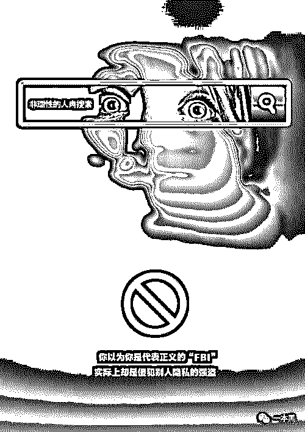
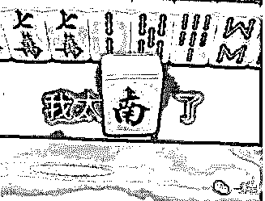
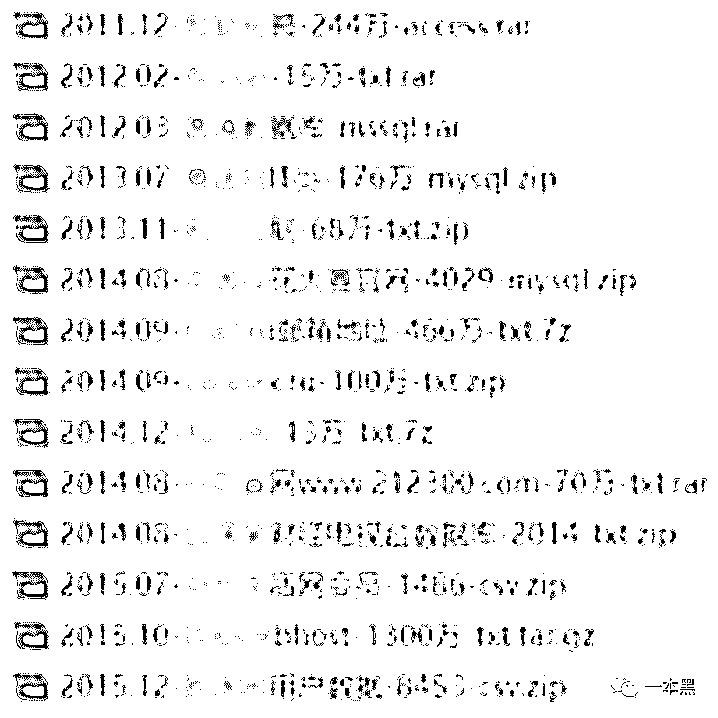
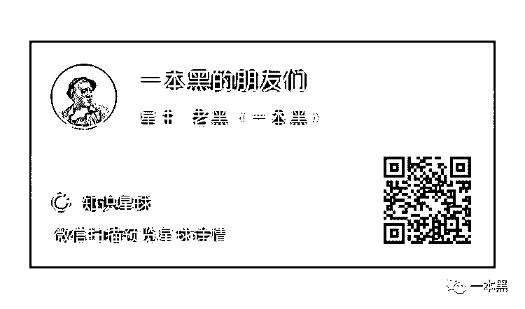

# 人肉搜索：键盘一敲，人命一条？

> 原文：[`mp.weixin.qq.com/s?__biz=MzU4ODAwNzUwMQ==&mid=2247486279&idx=1&sn=6f5526bf70d6ce81b3408db41eb939aa&chksm=fde21a65ca9593737f17e233b4036ed18328f6908993b0436afa26e6e04f9de68f37ea61f310&scene=27#wechat_redirect`](http://mp.weixin.qq.com/s?__biz=MzU4ODAwNzUwMQ==&mid=2247486279&idx=1&sn=6f5526bf70d6ce81b3408db41eb939aa&chksm=fde21a65ca9593737f17e233b4036ed18328f6908993b0436afa26e6e04f9de68f37ea61f310&scene=27#wechat_redirect)

【黑话连篇】

该栏目更多的是揭露事件或对事件的看法，以达到让人精神得到升华的目的。

* * *

 ****前段时间出差，返程的时候在飞机上看了一部陈凯歌导演的老电影《搜索》。

这部电影讲的是网络时代，因为“人肉搜索”技术，导致一个饱受指责的年轻女性走向自杀的故事。

在这个年代，“人肉搜索”更多的变成了娱乐大众和满足好奇心的利器，同时，它也可能会成为一种杀人的工具。

故事是这样的，一名上市公司董事长的秘书叶蓝秋，在得知自己身患绝症后，心灰意冷的上 了一辆公交车。

沉浸在害怕和恐慌中的她，拒绝给身边的老人让座，顿时在车上引起众人争议。这一画面刚好被电视台实习生杨佳琪拍下，实习生事后把视频交给了自己的新闻主编兼嫂子陈若兮，凭着敏锐的职业嗅觉，主编断定此视频必火，所以开始针对此事进行报道。

一时间全社会都在讨论叶蓝秋不让座事件，每个人都去人肉叶蓝秋的信息，家庭住址、毕业院校、所在公司、户籍信息等等。

人们纷纷指责她，说她不让座就算了，还调戏人老头，简直就是道德沦丧。

在病痛所带来的恐慌和社会的舆论下，叶蓝秋向老板借了 100 万，玩起了消失。却因为种种意外，又让他背负了“小三”的骂名，此时新闻主编的男朋友也卷入其中，他因为五万块钱受雇于叶蓝秋。

却不料，在彼此雇佣关系的一段时间里，这位因为不让座饱受社会指责的女人最后结束了自己的生命....

**一**

**《搜索》这部电影在 2012 年上映，影片围绕“人肉搜索”这一意象讲了一个平静的故事，放到今天来看，这种现象依然存在，依然不过时。**

**首先说一下什么是“人肉搜索”，简单来说，人肉搜索就是通过网络挖掘一个人的信息。**

**互联网发展已经二十几年了，现在的人早已习惯互联网的生活，所以或多或少的会在互联网上留下自己的个人信息。**

**它是一种通过网络上的蛛丝马迹，查询目标人物在网络上的活动痕迹，或者配合现实结果，最后整理出目标人物准确信息的一种行为。**

**这种人肉行为往往由多人参与、利用搜索引擎提供的信息进行资料整合，达到曝光某个人真实信息的目的。信息包括但不限于：手机号、身份证号、家庭注册、照片、工作单位、户籍信息等。**

****

**说到“人肉搜索”的起源，还得从猫扑网说起。**

**那会只要有人提问，就会收到四面八方的答案，假如有些网友正巧认识提问中的人，或者有技术能力去获取更多的信息，那么他们就会直接通过留言、跟帖的形式，把此人的信息公布出来。**

**比如在电影《搜索》里，叶蓝秋的公司信息就是被同事跟帖公布出去的。**

**这帮人往往看热闹不嫌事大，加上话题的火爆，参与人数众多，一般比较难追溯跟帖者的信息，主要也没人在意跟帖者是谁，曝光出别人信息就完事了。**

**互联网时代，就属这帮人键盘敲得响，要说让他当面讲两句，屁都放不出。**

** **

**“人肉搜索”并不是什么很难的技术，只要你会上网查资料，用过搜索引擎，基本人人都会那么一点。**

**因为这个时代，人的认知是逐渐升级的，保不齐自己傻 X 的时候就在某某论坛留下过自己的信息。**

**毕竟那会新鲜，大家都爱在网上冲浪，各种姿势各种体位，腿都快骚断了也不见得克制。**

**“人肉搜索”能搜集到的信息基本都是能在社交网络搜集到的，比如 QQ 空间、朋友圈、微博等都可能泄露你的个人信息，这一点毋庸置疑。**

**打个比方，微信 ID 里面可能就暴露了你的个人信息，很多人为了方便记忆，在设置微信 ID 的时候，往往会用自己的姓名首字母加上 QQ 号或者手机号。**

**总之，从微信 ID 里，可以获取到一部分信息，再通过这些信息，就很有可能挖掘出更多的信息。**

****

**人肉搜索往往有一个关键点，就是通过手机号，因为往往一个手机号更容易查询到更多的信息。**

**熟悉网络安全的朋友一定知道一个网站叫 XX007，这个网站可以查询你的手机号码或者邮箱注册了哪些网站或 APP。**

**这样一来，通过一个手机号码，就可以找到此人在这些平台的某些信息，为了避免模仿，更具体的我就不多说了。**

**另外，常规的搜索里，还有通过识图工具来搞定的。**

**比如我想要查询一个人的社交账号，但我只拿到了这个人的微信号码，可是他的微信号能暴露的东西太少，这时候我就盯上了他的头像。**

**从头像来看，比较独特，猜想他的其他账号也是用的同一个头像，所以这时候我就可以用识图工具进行查询，顺理成章地找到了对方的微博账号。**

**在微博账号里，信息都是公开的，里面可能就暴露了对方更多的信息，可能有兴趣爱好、活动轨迹、家庭信息等。**

**看过我以往文章的朋友一定知道，我常常用的一个手段，通过一个手机号验证对方真实姓名的手法，就是拿这个手机号去支付宝进行转账操作。**

**因为要想在支付宝给一个人转账，支付宝会弹出一个框，显示对方姓名的后面几位，姓需要验证，这时候就可以知道对方的一半姓名。**

**还有各种骚操作，比如把对方手机号存在通讯录，然后去抖音通过通讯录添加，如果对方玩抖音的话，也是可以看到对方动态的。**

****

**方式真的太多了，以上只是举一些很简单且常规的例子。**

**从这些例子中可以看出，互联网时代，你真的不可能有隐私，这其实挺无奈的。但换个层面说，公民的大部分隐私其实都是因为自己不小心而泄露出去的。**

**网上发表的言论、QQ 空间留下的电话号码、微信的定位等等，你在网上越活跃，你被人肉出来的风险就越高。**

**看到这里，可能有人就要说了，我又没什么特别的东西，人肉出来就人肉出来了呗，有什么大不了的。**

**我只是想说，不怕一万就怕万一，你是无所谓，但如果因为某件事牵连家人，那就很恶心了。**

****

****二****

****以前我写了很多关于隐私保护的文章，有个读者很不耐烦地说，天天听你在这吹牛逼，咋也没见到我的信息暴露多少呢！****

****他很不服气给我发来他的手机号码，让我试试看能找到他多少信息。****

********

****我当时都懒得理他，心想随便你呗，关我毛事，可这哥们还是不死心，一直给我留言让我查他的信息。看到他这么坚持，我决定给他上一课，毕竟这个年代，能坚持的人不多了。****

****过程就隐藏掉了，通过常规手段，我找到了这哥们的真实姓名、真人照片、户籍所在地、当前所在城市、职业、女朋友照片、和女朋友是怎么认识的，喜欢打什么游戏等等，全给他扒了出来。****

****把这些消息给他发过去以后，他只回答了一句话：“哥，我错了。”****

********

****其实，这些信息都是对方多年来的上网痕迹，我只是通过公开手段进行查询并分析出来的。让这哥们知道隐私安全的重要性，其实也挺好的。****

****其实，通过网络去查询一个人的信息，成功与否或者能获取到多少信息，在于这个人的暴露程度。****

****所以你会发现，要想查一个黑灰产从业者的信息，是比较困难的，因为这些人往往有反侦查意识，只能通过特殊的技术手段才有机会查到。****

****在“人肉搜索”这一环节中，不得不提的一个东西是“社工库”，他是一种数据资料的集合，是黑客通过攻击手段获取到的情报，除了通过攻击手段获取外，黑客还有可能会购买一个网站的数据进行填充。****

****在社工库中，往往会包含大量的信息，比如各个平台的个人账号、照片、密码、开房记录等。****

****当然，社工库这东西肯定是违法的，国家也是明令禁止搭建和查询的，一旦发现肯定是要负法律责任的。****

****但是人心不足蛇吞象，为了利益，社工库依然被某些人所掌握，常年活跃在互联网的地下产业链中。****

****   ****

****除了常规通过网络进行搜集、社工库查询外，个人信息还会从各平台流出，这种一般是内鬼泄露，之前写过很多次了，这里就不再多提。****

****总之，在这个年代，“人肉搜索”更多的变成了娱乐大众和满足好奇心的利器，同时，它也可能成为一种杀人的工具。****

****之前看到一个新闻，说的是一名女医生在游泳时被两名 13 岁男生摸臀，女医生让男孩道歉，但男孩不但拒绝还朝女医生吐口水，其老公没控制好情绪冲过去将一男孩按入水中。****

****后来双方被带到派出所，但问题依然没有得到解决。小孩父亲不肯息事宁人，将相关视频上传网络取名“13 岁男孩游泳池里碰陌生女子，遭女子老公狠揍”，一时间女医生遭到四面八方网友的“网络暴力”。****

****一般来说，很多不明真相的吃瓜网友对一件事的判断往往只会以看到的视频为依据，所以很多人就会无脑跟风去批评，不仅对当事人发表出攻击性语言，还进行了人肉，把女医生及家庭成员都曝光到了网上。****

****最后，女医生因为不堪网络暴力及舆论压力，最终选择了自杀。****

****类似的例子不在少数。****

> *   ****2018 年 1 月，湖南长沙辅警当街打死伤人的金毛犬遭人肉搜索，信息被挂上外网，家属被上门骚扰，几天内手机收到数千条谩骂信息；****
>     
>     
> 
> *   ****2018 年 6 月，江苏南京幼童被咬父亲摔死狗，全家遭人肉搜索，妻子割腕自杀（被救回）；****
>     
>     
> 
> *   ****2018 年 8 月，四川德阳女医生与小孩泳池起冲突，遭人肉搜索后不堪压力服药自杀身亡；****
>     
>     
> 
> *   ****2018 年 9 月，某位老师因发表了对网络小说《魔道祖师》的不满言论，遭该书粉丝人肉搜索及人身攻击。不堪骚扰的老师选择自杀，经抢救后脱离危险。****

****“人肉搜索”仿佛变成了网络暴力的帮凶，参与者抱着曝光别人看热闹的心态，全情投入进来， 殊不知给受害者造成的伤害是无法磨灭的，网络暴力真的能让人崩溃到自杀。****

****如果说选择离去是受害者最后的尊严，那那些人肉参与者就真的太没有道德底线了。或者说这已经不是道德不道德的问题了。****

********

****我说过很多次，这个时代，人不可能有隐私，真的不可能，人肉搜索真真切切地反映了这一问题。****

****你所使用的手机、你注册过的软件、你入住的酒店、你网购所填的地址，都将成为信息泄露的源头，这是不可控的，需要整个社会和企业共同来保障。****

****但对个人来说，确实有很多习惯大家应该注意。****

****就拿我自己举例，我一直对个人信息的保护比较敏感，很早之前就有意识的消除了自己留在互联网上的信息。****

****对于一切软件的权限要求，只要不使用我一律不允许，我会有好几个手机号码，生活所用的号码基本只有家人知道；另外工作中基本不会给别人留自己的手机号码，即便留只会留小号。****

****还有一个号码专门用来注册各种软件，这样即便是泄露了也无大碍。****

****之前阿里小号是个很有用的工具，只不过后来因为被人无情利用去薅羊毛最后阿里给停了，但老用户依然可以继续使用，所以我会有几个一直在用的阿里小号，用来点外卖或者填快递收货信息。****

****我觉得如果你想尽可能的保护自己的隐私安全，一定要有黑客思维，因为黑客擅长伪装和混淆，这一点运用在生活中也一样有用。****

****比如前面说，可以通过微信 ID 或者其他账号名称的形式去猜一个人的信息，所以这时候如果你有黑客思维，你在设置这些 ID 的时候，就可以刻意去混淆这些昵称。****

****打比方我要设置一个微信 ID，我可以把 ID 设置成“DSB19980214”，原意是“戴帅逼，出生于 1998.2.14。****

****别人可能会认为 DSB 是姓名缩写，后面的就是出生日期，但尴尬的是，这个昵称往往会被别人认为是“大傻逼......”****

****你说尴尬不尴尬。****

********

****另外，对于各种社交账号，别一个密码走天下，黑客里有个技术叫“撞库”，一旦泄露一个，你其他的账号也必然跟着泄露。****

****那有人就说了，一个密码好记啊，要是每个账号都用不同密码的话，那岂不是很麻烦。****

****工欲善其事必先利其器，这句话在我刚开始接触技术的时候就深有体会，所以把能用的工具都用起来，密码管理工具推荐使用 1password。****

****别再给我杠什么万一这玩意也泄露了怎么办，对不起，当我没说。****

****这篇文章只是很浅显的讨论了一下人肉搜索，里面的举例也是很简单的手段，目的不是让你学会怎么去人肉一个人，而是想让你知道隐私安全的重要性。****

****但如果你看完还是不在乎自己的隐私安全，那完全可以当我没说。****

********

****对于“人肉搜索”助力“网络暴力”所带来的结果，我想各位应该是有目共睹的，但我想说的是，现在网上的傻逼真的是太多了，很多人太缺乏独立思考能力，看到一件事拿起键盘就进行主观评判。用人云亦云、三人成虎来形容一点没错。****

****之前看过郭德纲的一个采访视频挺有意思，说的是现在的人呐，需要在一个没有后果的网络世界发泄，其实这就是人性最欠缺的地方，要是实名制发帖，网上一片太平。****

****其实这种现状也能理解，但理解归理解，我还是觉得人得有点头脑，别什么事情都能被煽动，也别跟风找成就感，多读书多看报，少吹牛逼最牢靠。****

********

****前几天都没更新，不是我在偷懒，我都在【一本黑的朋友们】社群里和大家吹牛逼，它没有一个具体的定位，里面会聊赚钱案例、想法、思路；它同时也是一个资源对接平台，帮助大家寻找可以合作的资源，但灰黑产严厉杜绝。****

****同时也会不定期邀请牛人嘉宾进来分享，听大佬的赚钱经历和想法，与牛人交流，是提升认知的捷径。****

****总之，这是一个全新的成长型、认知升级、资源对接社群，后续会在社群内公布各种有趣玩法，还不赶快上车？****

****       ****

****点个在看？********