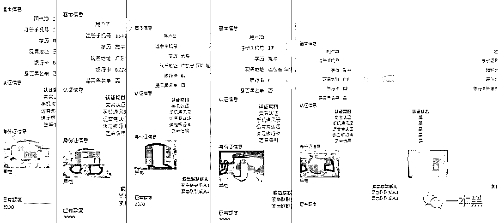
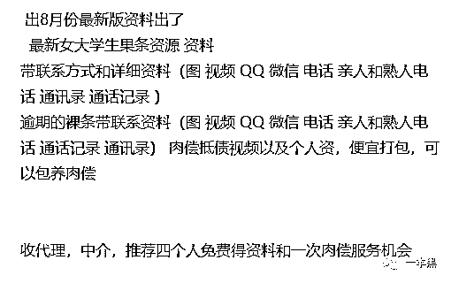
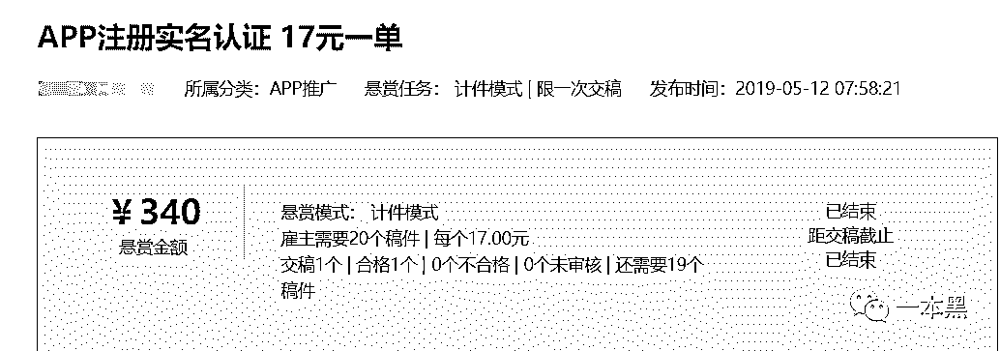
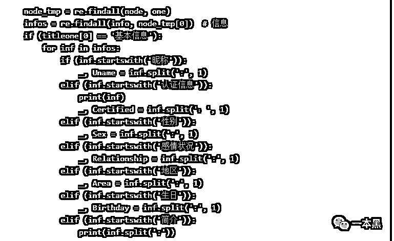
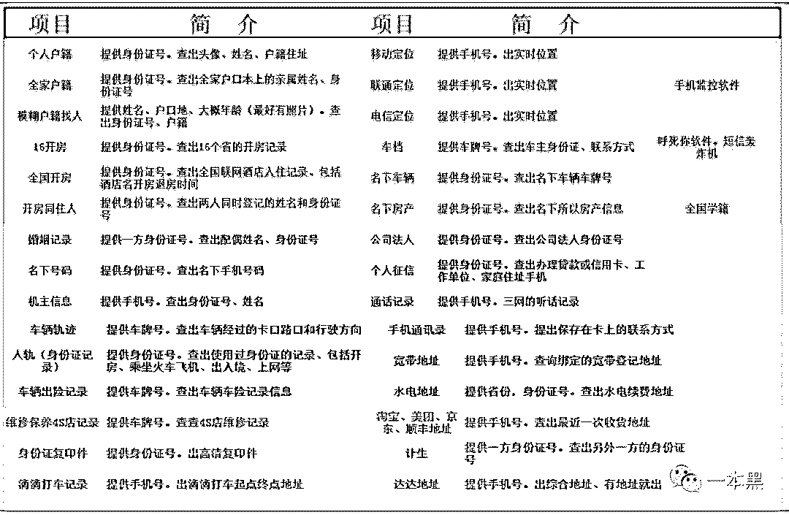
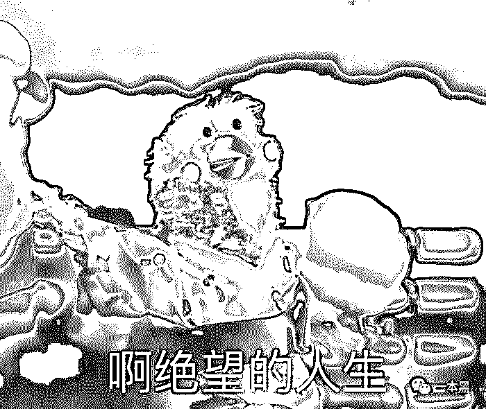
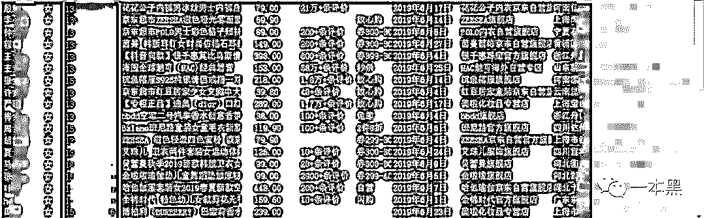
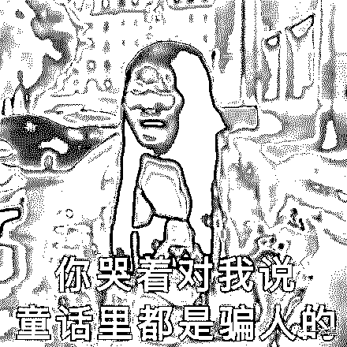
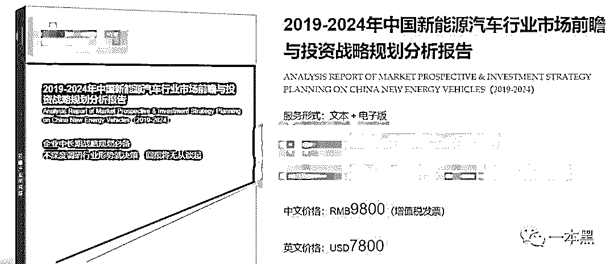

# “查开房、查违章、查配偶”，这个时代还有什么是不能查的？

> 原文：[`mp.weixin.qq.com/s?__biz=MzU4ODAwNzUwMQ==&mid=2247486270&idx=1&sn=7ec0d85159871d830749a8e536df3800&chksm=fde21a1cca95930a8ae44577d3142b9d1deed10de1c7e7d64247c552277e4174312ba3883738&scene=27#wechat_redirect`](http://mp.weixin.qq.com/s?__biz=MzU4ODAwNzUwMQ==&mid=2247486270&idx=1&sn=7ec0d85159871d830749a8e536df3800&chksm=fde21a1cca95930a8ae44577d3142b9d1deed10de1c7e7d64247c552277e4174312ba3883738&scene=27#wechat_redirect)

【黑话连篇】该栏目更多的是揭露事件或对事件的看法，以达到让人精神得到升华的目的。

* * *

****长久以来，我发现自己一直处在一种焦虑之中，对于自己隐私的焦虑。虽然我并没有做些什么不可告人的事情，但每个人都有自己的小秘密。比如我昨天点了什么外卖，今儿穿了什么颜色的袜子。********虽然在有的人看来，这都算不上隐私，但是我不想告诉别人的，它就应该是我的隐私。可是每一个想要获得我们信息的人看来，隐私它算个屁，除了换钱，毛用没有。********我们对此很愤怒，但我们无能无力。因为很多 APP 的使用规则就是：“要用，行，给隐私。不给？滚吧。”**********一**********前几天刷抖音的时候，我发现新增了一个粉丝。我一个从来不发视频的人还有资格有粉丝？打开一看，是曾经的大学同学，对方通过通讯录找到了我。********尽管每一次抖音想要匹配通讯录都被我拒绝了，然而我忘记了，通讯录里任何一个人都有权利选择同步。只要一个 APP 有同步通讯录的功能，你就能掌握通讯录里好友的爱好、定位，或者其他更深层次的信息。********小说《1984》里说到处都遍布着摄像头，老大哥一直在暗处盯着你，你的一举一动都正在被监控。********当我看到消息的瞬间，我突然产生了同样的感受。为了不让熟人知道我日常在网上干什么，我连地址都不填的啊。********其实，现在大多数拥有通讯录同步功能的软件，表面上是为了让用户和用户之间产生链接，但实际上却被不少黑产从业者和有心者利用。********最常见的一个案例就是，平时你会收到陌生好友的添加请求。请求往往是某某哥或者某某姐介绍的，出于好奇可能你会通过。********这些人无非都是灰黑产从业者或者做项目营销的，他们先通过渠道购买大量的用户信息，也就是手机号码。比如医院的信息、快递信息、新入驻业主、学生家长的信息等等。****************这几天不正是开学季吗，一定会有人用这种方法去对学生家长搞精准营销。但其实这种玩法都已经过时了，且它是有骚扰性质的。********那什么样的方式可以既能做到精准营销，又不具骚扰性质呢。**********答案是****利用抖音。**********比如，现在开学季针对学生家长，营销人员可能会给学生家长卖周边或者课程之类的，他们就通过渠道买到学生家长的手机号码，可以分为小学生、初中生、高中生，针对不同年级的学生做不同的操作。********拿到手机号码后，他们把手机号码存入手机中，形成一个通讯录，然后下载抖音，用抖音发布他们所需要销售给家长的商品视频。********因为抖音可以自动抓取手机里的通讯录信息，只要对方平时看抖音，抖音就会把这些视频推送给通讯录里面的人。****************所以你平时会遇到一种现象，刷到某个视频，视频下方会显示“你在对方通讯录”或者“你们有共同好友”。********其实这就是灰黑产从业者或者营销人员利用抖音达到精准营销的新玩法。********这些接受推送的号码主人都是很精准的学生家长，他们对这部分需求是很精准的，所以转化率自然会比以往的玩法还要精准。********类似更骚的玩法暂时不多提，下次我会在【一本黑的朋友们】社群里继续说。********在互联网世界，你根本就不能当一个透明人。即使你隐藏了信息，更改了性别和地区，别人还是能找到你，看到你的日常，知道你在位置。********每个平台都能透露关于你的部分信息。地图和打车软件记录你的踪迹，外卖软件透露你家和工作单位地址，购物软件知道你的审美和年龄段，娱乐休闲软件暴露你的爱好......****************注册的平台越多，拥有的隐私越少。********我们分散在各个平台的信息被别有居心的人收集起来，整成数据包，正在市场上以极低的价格流转。**********二************“一个也是宝，生男生女一样好。” 二三十年前，这句口号是为了解除性别歧视，倡导大家少生优生，幸福一生。************但在今天，互联网真的实现了男女无差别对待，尤其是在黑市。新生儿身份信息，打包出售，500 条起购，均价 5 毛一条，不论男女。************瞧，这可不就是男女平等的最佳例证吗？************不止新生儿，成年人的信息也同样如此。甭管你是在网上买内裤还是在线下买车买房，你所有的交易记录，身份信息，家庭住址通通都会变成一些人手里公开的秘密。************但是网上流转的大部分个人信息，仍以网贷数据为主。714 整治后，很多平台无法再生存，于是卖掉了用户信息，还有一些平台把收不回的坏账、烂账也同样打包卖了出去，毕竟能赚一点是一点。****************** ******这些信息包括了，姓名、电话、通讯录、身份证、银行卡、手持身份证照片，甚至还有果照。************************而这些人不仅卖坏账数据，甚至还卖肉偿抵债的服务，说白了就是变相招嫖。自己收不回的钱，想找人填上，就让那些还不上钱的大学生肉偿，还能顺便收点嫖资。************真是恶心至极。那些还想要裸贷的孩子们，赶紧迷途知返吧。你只要进了裸贷的坑，就出不来了。************至于网贷数据的价格，某卖家的报价如下，一手资料的价格相对贵一些，经过多次转手的数据，两三毛一条，应有尽有。******

> *******网贷数据，实时，1.5/条**************隔夜，0.6/条**************周，100/4000 条**************以上数据均提供测试，转化率可*达 70%以上******

******注册的平台多了，你也就没有隐私了。这句话真是一点也不夸张。**************三****************不仅数据种类多样，数据来源渠道同样丰富。****************这些被转手的数据包，有的来自网站数据泄露，比如几年前 Facebook、Twitter 等网站的数据泄漏事件。平台数据泄漏有的是由于漏洞被攻击而泄露，有的则是由平台方主动提供给合作伙伴。****************其次，注册实名 APP 的网赚项目同样能给这个市场提供一部分真实信息，比如下面这个，17 块一单，注册 APP，实名认证并绑定银行卡，验证通过之后，就可以拿到佣金。**************** ****************还有网络爬虫，悄咪咪地把你散落在各个网站的信息一点点收集汇总，就能够组成一个完整的用户画像。*********************************某网站爬虫教程，教大家如何爬取微博用户信息*****************下面是某黑客网站提供的服务，你一个月和谁开几次房，什么时候闯了红绿灯，家里几口人，多大年纪。在你眼里，这些都是别人不知道的秘密，但在黑客手里这些数据都是透明的。********************************当然了，查个人信息是定制服务，更多也是骗局。不要轻易相信这类网站，被骗的可不在少数。****************而更多的数据泄露则是来自所谓的内鬼窃取。****************在大批量的数据泄露事件中，新生儿数据就是典型的内鬼泄露，一些医院或是保健院的基层员工利用职责之便，从单位窃取数据，再卖给儿童影楼、保健品公司，而这些机构就会给家长打电话推销商品。********

> *********‘您好，我们影楼现在搞活动，要给你家宝贝拍套百日照吗？’******************“您好，我这里是 xxx 公司，我们最近推出一款产品，特别适合您家宝贝的体质，考虑一下吗？**”*********

********这些数据从它原本该待的地方被挪走，然后一个个被安放在了不同的节点之上。每一个有权利访问（购买数据包）的人，都可以随时随地给你打电话、发信息，甚至在你拉屎的时候来敲你家门。****************不要觉得你被冒犯了，因为在他们眼里，你从来都是裸着的。********************************在群里做交易的一般都是二道贩子也叫数据掮客，他们在倒卖数据的时候也买进各类数据，不外乎都是些简历、驾驶证、网贷、购物、身份证等可以用来推销产品的信息。****************比如我咨询的一个老哥，给我发的就是京东的数据，他说这部分数据已经有人检测过了，是真实可用。至于数据来源渠道，老哥不愿意透露给我。与其说是避免风险，我觉得他更怕同行抢生意。****************表格显示这是京东 6 月份的数据，但到底是不是京东的呢？今年四月份，京东对网上流传的数万条“京东购物数据”做出回应，“不是我们的，别乱说啊，造谣犯法。”********************************数据来源并不一定是京东，也不一定是淘宝，但测试后却发现该数据的确是真实有效的。****************多数情况下，这些游走在 QQ 群、微博、豆瓣等地的数据掮客，并不总是提供真实的数据。运气好，可能买的是真实的数据，运气不好收到的可能就是一堆废料。甚至可能连废料都拿不到，对方收完钱就跑人。****************虽然这些数据价格便宜，但是骗子眼里只有多赚和少赚。不赚？不存在的。****************卖数据的都不是好人，买数据的也同样坏。打推销电话的都算好的了，很多诈骗集团专门购买这类数据，然后设计剧本，下套。********************************之前我们曝光的*“假装客服，以衣服质量问题为由，借退款实施诈骗”*的案件，其信息就可能来源于这些数据包。******************四********************一个人去医院看病，会留下许多的数据，比如，基本的个人信息、身体状况、以往疾病史、用药情况、缴费、家人信息、复诊时间及频率等等。********************那些窃取数据的人并不会把这些信息一骨碌全卖掉，而是要先经过分类、筛查、清洗，然后根据需求，单独给你拎出几项。毕竟真实的信息是很贵的，可以多收几次钱，谁愿意做一锤子买卖。********************《网络安全法》出台前，数据市场一片混乱，很多公司也是这样靠卖用户隐私数据赚钱。在法规出台后，市场逐渐趋于合法与理性。于是，为了避免用户隐私泄露的问题，大公司用数据做其他的事情，比如，行业调研报告、竞品分析等。********************这样的行业报告，有的按份卖，一份近万元；有的按年卖，收费万元起。******************** ********************还一些公司会进行数据互通，尤其是在互金行业，黑名单数据是降低风险的重要一环。企业之间会将老赖的数据共享，在申请环节就直接将用户 pass 掉，避免出现坏账的可能。********************如果你是一个优质用户，那么每个平台都想要你的数据，因为你就是流量和购买力的象征；如果你是一个垃圾用户，恭喜，你同样受欢迎。因为每个平台都想把你拒之门外。********************当你在某个平台申请现金贷业务时，一定需要接收验证码。这时验证码短信平台会收集你的数据，然后发送给其他的网贷公司。********************这就是为什么只要你注册了一个平台，就会无数个网贷公司给你发信息，告知你可以申请多少额度的贷款，利息是多少。********************每一份数据都是有价值的，前提是看它用于什么途径。所以别再说，你没钱就不会被盯上了。就算你没有钱也没有黑料，你也可以是众多调查数据中的那颗棋子，能够充当基数，为某个行业的建设添砖加瓦。******************************

* * *

**********小部分人的隐私叫隐私，一大群人的隐私就叫大数据。在大数据浪潮之下，我们成为了无数个无私奉献的数据样本，也成为了一些公司赚钱的工具。********************一个人从出生开始，一直到去世，只要与互联网有接触，就有可能被泄露隐私。我们无法阻止自己的信息被利用，但是可以用一些手段隐藏自己的信息，比如社交软件不随意开启定位，比如点外卖不需要写到门牌号。********************用泛化的信息代替具体的地址，用专门的小号去注册一些无关紧要的账户。********************如果注定没有隐私，那就尽量少暴露真实信息。********************希望有一天，人人都有选择的权利，而不是再被*“中国人愿意用隐私换便利”* 所代表。********************因为，我们不愿意用隐私换便利。****************************************一本黑新社群已开通，社群名字叫做【一本黑的朋友们】，它没有一个具体的定位，里面会聊赚钱案例、想法、思路；它同时也是一个资源对接平台，帮助大家寻找可以合作的资源，但灰黑产严厉杜绝。同时也会不定期邀请牛人嘉宾进来分享，听大佬的赚钱经历和想法，与牛人交流，是提升认知的捷径。总之，这是一个全新的成长型、认知升级、资源对接社群，后续会在社群内公布各种有趣玩法，你还不快上车吗？（[私密社群，快上车](http://mp.weixin.qq.com/s?__biz=MzU4ODAwNzUwMQ==&mid=2247486144&idx=1&sn=e08c4c5b9bfd314a704d48e5e2e26115&chksm=fde21be2ca9592f4dce57c176022770d5bdace121618725bc3c164229a9ddfd1da08b735369c&scene=21#wechat_redirect)）**********