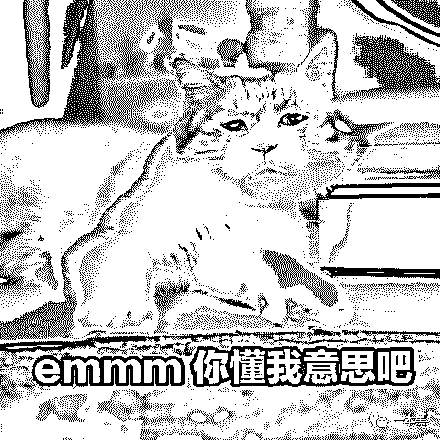
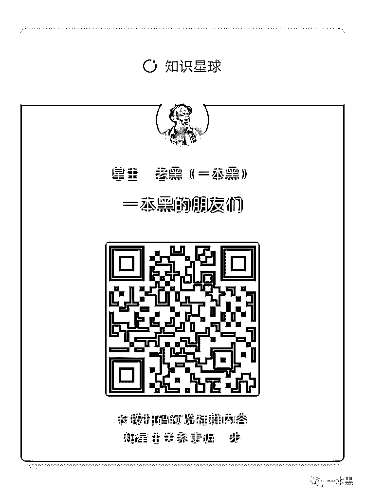

# 私密社群，快上车

> 原文：[`mp.weixin.qq.com/s?__biz=MzU4ODAwNzUwMQ==&mid=2247486144&idx=1&sn=e08c4c5b9bfd314a704d48e5e2e26115&chksm=fde21be2ca9592f4dce57c176022770d5bdace121618725bc3c164229a9ddfd1da08b735369c&scene=27#wechat_redirect`](http://mp.weixin.qq.com/s?__biz=MzU4ODAwNzUwMQ==&mid=2247486144&idx=1&sn=e08c4c5b9bfd314a704d48e5e2e26115&chksm=fde21be2ca9592f4dce57c176022770d5bdace121618725bc3c164229a9ddfd1da08b735369c&scene=27#wechat_redirect)

 以前写代码的时候，我总觉得这些密密麻麻的东西很有艺术感，什么字符串、数组、Oracle、单个看你可能会觉得很枯燥，但当把它们串联起来的时候，你会发现整段代码突然就变得有了生命。

换到现在写作，其实是一样的，不同的文字组合会产生不一样的阅读效果，同样能给人惊喜。

公众号今年已经是第七个年头，而一本黑成立也才仅仅两年多，我很庆幸一本黑成为了自媒体行业里的一块小小拼图。

感谢微信公众号这个平台，让我们这种再小的个体，也有了自己的声音。

我认为做自媒体是一件很酷的事情，它在表达之余传递价值，通过文字和读者产生链接。

在过去，一本黑的内容相对垂直、文风硬核、很追求独特的视角，但往往内容的固定会让读者产生审美疲劳，所以我们也尝试过轻松、调侃类的文章。

我相信所有自媒体人的乐趣都是一样的，就是当看到有读者留言，某一篇文章中的内容帮到了自己。

这个时候对作者来说，它是一种强烈的认同，更是一种价值反馈。

期间和不少读者有过交流，也线下见过面，听他们说起自己的故事和经历，真的是即开阔了视野也学到了东西。

毕竟这世上你我不知道的东西太多了，交流才能让彼此产生价值互换。

大家都知道，由于内容的敏感性，导致部分文章没法发出来，或者发出后因为各种原因就被删掉了。

所以大家纷纷要求建立私密社群，比如微信群、QQ 群、TG 群等。

除此之外，每天会有很多读者给我留言，询问各种各样的问题，不是我不回复，是真的回复不过来。

问题更是千奇百怪，但基本集中在两类，第一是寻求帮忙的，第二是问怎么赚钱的。

虽然这几年接触了很多灰黑产，基本上摸透了他们赚钱的路子，但这些全都游走在法律边缘，你说这个我怎么可能告诉你。

我知道很多人关注一本黑，就是想从中学习一些思路，但奉劝各位，犯法的事可千万干不得。

其实一本黑的读者里有很多聪明人，有人看了我的文章自己做了个公众号，虽然读者不多，但现在每个月能给他带来高于工资的收入。

有人具备很强的口头表达能力，听了我的建议去做抖音，现在有一百多万粉丝。

有人把我的文章扒下来，整理成册，一份 9 块钱，卖了一两万，最后把他这事告诉我，我没让他继续，但看得出这哥们是个有想法的人。

还有很多朋友，当我和他们聊天的时候，感觉简直就是在进行思维碰撞，每句话都能成为一个新的商业点子。

这时候我突然意识到，深入的交流真的能让一个人长见识，就连看别人的朋友圈都是一种认知升级。

现在，我越来越期待和优秀的人交流，听不同的人讲他们的经历，因为实在是厌倦了朋友圈不是晒娃就是晒照片、不是喜提玛莎拉蒂就是各种装逼的社交环境了。

我想各位应该也和我一样有这种烦恼。

俗话说近朱者赤，近墨者黑，跟什么样的人做朋友，你自然会成为什么样的人。

每个人都应该升级自己的朋友圈，多接触优秀的人，看他们的经历，看他们都在关注什么，以此来扩展自己的思维。

所以，结合广大读者要求开通社群的愿望，我准备开通一个付费社群，在这个社群里，我会分享一些案例和思路，也会邀请很多大牛分享自己的赚钱经历。

当然，我并不想给这个社群一个具体的定位，但它分享的内容一定是提升你认知相关的东西，还有就是在公众号不便交流的内容。

我希望通过付费的方式过滤掉一部分人，毕竟这世上太多人想空手套白狼，太多人想白嫖了。

**如何进群？**

考虑到社群内容的沉淀，我选择知识星球这个 APP。

**扫描下方二维码——付费——即可进群。**社群名字就叫**【****一本黑的朋友们****】**。

会员费暂定**299**元/年，算下来一天只要 8 毛钱，后续会阶梯性涨价，这个时代，别光焦虑，记得投资自己。

**为了方便日后交流和查看社群内容，各位最好****下载****知识星球****APP。**

  

 **欢迎什么样的人？**

**1、**我希望你是一个爱分享，能做价值输出的人，毕竟在任何一个行业，**所有的红利都将向擅于表达者倾斜。**

****2、**欢迎有互联网思维，在各领域有所成就的朋友。**

****3、**欢迎有强烈赚钱意愿、有强烈想提升自己认知的朋友。**

****4**、欢迎不满足现状，想扩展人脉，却不知从何入手的朋友。**

****5**、欢迎有各种疑问需要解答，需要别人指点的朋友，社群可以成为你的一个指路人。**

****不适合什么样的人？****

****1、不适合白嫖的人。****

****2、不适合空手套白狼，想做灰黑产等擦边行业的人。****

****3、担心交智商税的千万别进，不懂得挖掘价值的人，一块钱对他来说都是智商税。****

******为什么要收费？******

******1、过滤人群，提升社群质量。******

******2、避免人多嘴杂，杜绝白嫖群众。******

******3、付费会员更能让社群形成正向循环，是社群内容质量的保障。******

********社群提供的价值：********

********1、**分享赚钱案例、想法、思路，提升你的认知，颠覆你的思维方式。******

******2、**提供一个资源对接平台，帮助大家寻找可以合作的资源，但灰黑产严厉杜绝。****

******3、**大佬分享和互动，听大佬的想法和经历，与牛人交流，是提升认知的捷径。****

******4、**如果你在生活上、工作中有什么需要人指点的疑问，这里是一个好平台，大家会给你中肯的建议。****

****社群开通后，我会陆续在社群里展开各种有趣的玩法，具体星球见。****

****最后，再次强调，这个社群不欢迎、也不会发布灰黑产玩法，也不会教大家赚钱，因为这东西真的没法教，也根本教不了。****

******我希望这个社群能成为一个成长型社群、一个资源对接社群，一个提升你认知的社群。******

****记住，免费的东西永远是最贵的，各位有心人，星球见。****

********