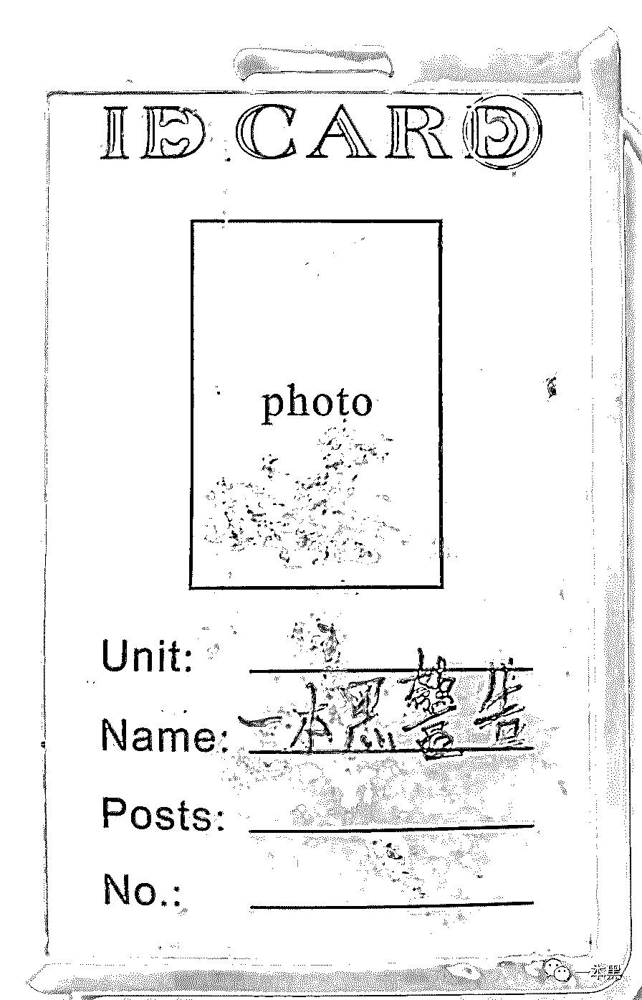
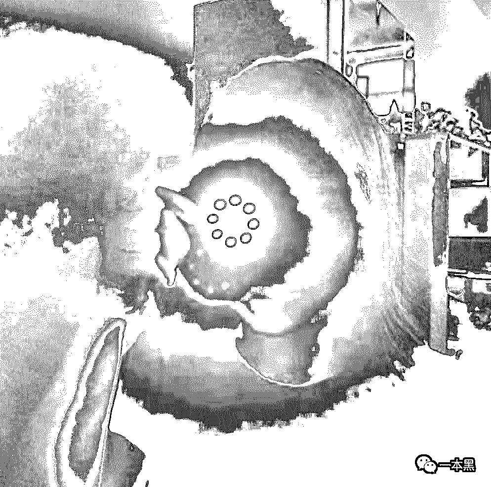
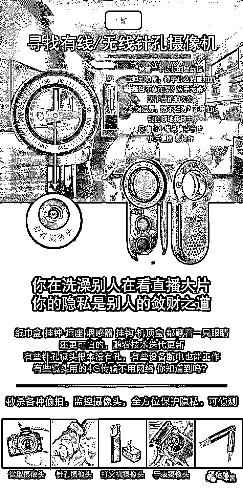
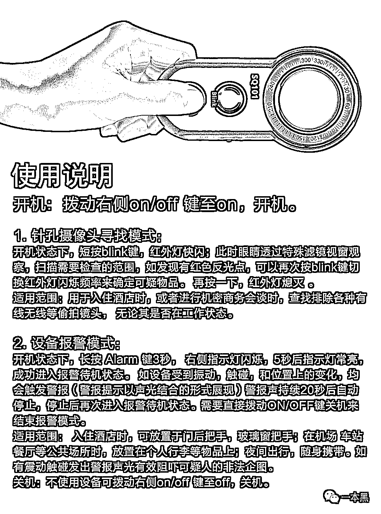
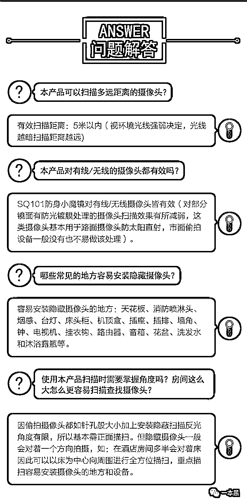

# 七夕过后，各大视频网站的偷拍区又该更新了

> 原文：[`mp.weixin.qq.com/s?__biz=MzU4ODAwNzUwMQ==&mid=2247486117&idx=1&sn=d4473bf19bbb5919c5f1b557d274237a&chksm=fde21b87ca959291a7941660d9508d7d8d7a81d1b940fc4e186d0670dd79dff1f74b54de171d&scene=27#wechat_redirect`](http://mp.weixin.qq.com/s?__biz=MzU4ODAwNzUwMQ==&mid=2247486117&idx=1&sn=d4473bf19bbb5919c5f1b557d274237a&chksm=fde21b87ca959291a7941660d9508d7d8d7a81d1b940fc4e186d0670dd79dff1f74b54de171d&scene=27#wechat_redirect)

 大家好，我是老黑。

前几天是七夕情人节，不知道你们有没有带妹子去......我是说不知道你们有和自己喜欢的妹子去吃饭。

之前看到过一个段子，说每当这种节日过后，某某网站的偷拍区又该更新了！

不过说实在的，虽然这是个段子，但偷拍这事儿确实是存在已久。

每隔一段时间，你就能看到各种新闻，某快捷酒店、民宿、甚至出租屋，被爆出有针孔偷拍设备。

你说现在的人怎么会有这种癖好，喜欢看人在酒店打架呢？

再者说，现在是暑假旅游的高峰期，很多人出门旅行都会选择住酒店，有点情调的可以会选择住小众民宿。

但其实说实话，现在越来越多的酒店、民宿被针孔摄像头攻占，也许你这头正在洗澡换衣服，那头就有一个偷拍狂在观看现场直播。

说到针孔摄像头这玩意，小巧，方便隐藏。它可以藏在房间的各个角落，比如墙上、插座里、烟雾报警器里、台灯里等等，总之只有你想不到，没有它不能藏的地方。

就比如下面这张图，是一个类似证件牌之类的东西，这个针孔摄像头就藏在字母 D 的中间。

这种针孔摄像头支持 WiFi 远程工作，支持云平台访问，可通过一个 APP 就能实时观看所录到的画面。

前几年我就和老师傅在网上买了一些材料，用树莓派等硬件制作了一个简单的偷拍仪器，还原了当下偷拍产业所用到的偷拍设备。

基本上每个人都有被偷拍的风险，只要你出差住酒店、只要你租房，就可能会沦为被偷拍的对象。

特别是女性朋友，是被偷拍的主要人群。

所以如何防止被偷拍，如何检测酒店、出租屋等场所是否暗藏摄像头就变得尤为关键，毕竟谁也不想变成打架网站上供人欣赏消遣的商品吧！

但是对于检测的方法我就要说道说道，很多人都会直接上网查询如何检测酒店是否有针孔摄像头，答案千篇一律都会告诉你用手机照明就可以了。

**这里我要告诉大家，这是谣言，根本不管用！**

**这里我要告诉大家，这是谣言，根本不管用！**

**这里我要告诉大家，这是谣言，根本不管用！**

因为手机照明发出的灯光，照射的距离很近，是没办法做到聚焦远处的，很多房间的环境是根本没办法检测出来的。

想要测试是否有针孔摄像头，前几个月我给大家推荐了一款检测设备，这款检测设备带有红外检测功能，可以有效检测出肉眼看不到的针孔摄像头。

非常适合经常出差的商务人士、旅游住酒店民宿、在外租房等任何人士，特别是姑娘。

之前进行过两期售卖，均在两小时内售罄，很多读者要求加货，但我一直没加，一来这玩意发货量大太比较麻烦，而来工厂也缺货，所以一直没能满足各位读者的要求。

但是眼尖的读者应该已经发现，我前几天在**黑库**悄悄上架了一款新品，这款新品比起之前推荐的检测设备，不仅在质量上提升了一个档次，还增加了一个报警功能。

<mp-miniprogram class="miniprogram_element" data-miniprogram-appid="wxcabd235f3d192829" data-miniprogram-path="packages/independent/goods/fastbuy/index?alias=3ervec5bksq5z" data-miniprogram-nickname="小黑库" data-miniprogram-avatar="http://mmbiz.qpic.cn/mmbiz_png/MpfnmeHaG6CsuVLZBcPEXQXhHiccicogPgbdt74gkJcz46lN2xyCz04H7xkobNptJybLb8MDXQZEK3rFqjCyv9gg/640?wx_fmt=png&amp;wxfrom=200" data-miniprogram-title="反偷拍小魔镜" data-miniprogram-imageurl="http://mmbiz.qpic.cn/mmbiz_jpg/sVQx2tT1ziaXibrj9Kic6g8JoHafib4oCFduLxVSiaTxd15TjmibvpKTHyqUiariaCxxFV2cI7tajw3YbzciaZl6ibnH3SqA/0?wx_fmt=jpeg" data-miniprogram-type="card" data-miniprogram-servicetype="0"></mp-miniprogram>

首先，这款设备叫**反偷拍小魔镜**，是最新研发的一款反偷拍、防盗窃，防身报警于一体的便携式个人防身器材。

它有闪频和稳定光两种模式，使用特殊滤镜结合红外灯，让偷拍者无处遁形。

（实际效果会更明显）

另外，当你入住酒店后，可以将它防止于门把手，玻璃窗把手；在机场、车站、餐厅灯公共场所时，防止在个人行李物品上，如果有震动触碰，他会发出报警声光有效阻吓可能发生的非法企图。

[`mp.weixin.qq.com/mp/readtemplate?t=pages/video_player_tmpl&action=mpvideo&auto=0&vid=wxv_933938277776867328`](https://mp.weixin.qq.com/mp/readtemplate?t=pages/video_player_tmpl&action=mpvideo&auto=0&vid=wxv_933938277776867328)

非常适合独自住酒店的女孩们。

至于使用说明，看下图吧！

这款设备目前已在**黑库**上架，限时售价**188**元，限量**1000**只。

点击下方图片进入小程序，或者点击一本黑菜单栏——**黑库**，即可购买。

库存有限，先到先得。

<mp-miniprogram class="miniprogram_element" data-miniprogram-appid="wxcabd235f3d192829" data-miniprogram-path="packages/independent/goods/fastbuy/index?alias=3ervec5bksq5z" data-miniprogram-nickname="小黑库" data-miniprogram-avatar="http://mmbiz.qpic.cn/mmbiz_png/MpfnmeHaG6CsuVLZBcPEXQXhHiccicogPgbdt74gkJcz46lN2xyCz04H7xkobNptJybLb8MDXQZEK3rFqjCyv9gg/640?wx_fmt=png&amp;wxfrom=200" data-miniprogram-title="反偷拍小魔镜" data-miniprogram-imageurl="http://mmbiz.qpic.cn/mmbiz_jpg/sVQx2tT1ziaXibrj9Kic6g8JoHafib4oCFduvBIichHP89RrfhAlhldvGdLVny3RYc6dxjciaZia1g10HjesvTUia8j8cQ/0?wx_fmt=jpeg" data-miniprogram-type="card" data-miniprogram-servicetype="0"></mp-miniprogram>

该设备和之前的那款比起来，在质量上提升了不少，还增加了防盗窃功能，非常适合经常出差、或者租房住的年轻人。

在第一期和第二期的售卖中，有位姑娘收到货后，立马在自己的出租屋内做了检测。

结果还真的在天花板上的烟雾报警器里找到了一个针孔摄像头。

至于后续，姑娘已经报警，现在也已经搬离了原来居住的地方。

另外各位的疑问，我整理了一些问题，比如，本产品可以扫描多远距离的摄像头？本产品对有线/无线摄像头都有效吗？这些问题下图都有答案。

需要说明的是，该设备如果没有质量问题，一律不退货，因为数量太大，如果各位都退货的话，只是在增加我们的工作量，完全没必要。

所以购买时请考虑好自己的使用场景和使用频次。

最后说一句，黑库只会上架对你们有用、且稀缺的商品，至于其他任何随便在电商平台上都能买到的物品，黑库就不上架了。

<mp-miniprogram class="miniprogram_element" data-miniprogram-appid="wxcabd235f3d192829" data-miniprogram-path="packages/independent/goods/fastbuy/index?alias=3ervec5bksq5z" data-miniprogram-nickname="小黑库" data-miniprogram-avatar="http://mmbiz.qpic.cn/mmbiz_png/MpfnmeHaG6CsuVLZBcPEXQXhHiccicogPgbdt74gkJcz46lN2xyCz04H7xkobNptJybLb8MDXQZEK3rFqjCyv9gg/640?wx_fmt=png&amp;wxfrom=200" data-miniprogram-title="反偷拍小魔镜" data-miniprogram-imageurl="http://mmbiz.qpic.cn/mmbiz_jpg/sVQx2tT1ziaXibrj9Kic6g8JoHafib4oCFducY1At9k1icghOEx6zcZImT3fV8UKTQCYynLv4XCCwZ17YftwUUJSBFg/0?wx_fmt=jpeg" data-miniprogram-type="card" data-miniprogram-servicetype="0"></mp-miniprogram>

我的初衷只是想唤起大家对个人隐私的保护，这个世界已经够恶意的了，希望我的解决方案能让你们更好的保护自己。

周末愉快！

点个在看？