# 未来集市：传销疑云下的完美独角兽，100 万会员的惊天大梦

> 原文：[`mp.weixin.qq.com/s?__biz=MzU4ODAwNzUwMQ==&mid=2247486086&idx=1&sn=c9218635641f854c15dc4bdb4c96ed1c&chksm=fde21ba4ca9592b20247572c0dd21d6786109f47ac1269c19908880f4fd15d95ba9819041ad0&scene=27#wechat_redirect`](http://mp.weixin.qq.com/s?__biz=MzU4ODAwNzUwMQ==&mid=2247486086&idx=1&sn=c9218635641f854c15dc4bdb4c96ed1c&chksm=fde21ba4ca9592b20247572c0dd21d6786109f47ac1269c19908880f4fd15d95ba9819041ad0&scene=27#wechat_redirect)

【黑话连篇】
**该栏目更多的是揭露事件或对事件的看法，以达到让人精神得到升华的目的。**

* * *

**据说微商界又吹来了一个新的风口——未来集市，虽然当年云集和贝店兴起的时候，他们也是这么说的。****雷老板说，在风口上猪都能飞起来。那么既然有风口，就一定会有猪，这一点你永远不用怀疑。****至于风停的时候，猪会不会摔死，那得看猪是怎么想的。******风口上猪都能飞起来******喵叔/文****“自用省钱，分享赚钱”这个口号是云集、贝店以及现在的未来集市通用的口号。****他们都声称，只要缴纳一定的费用，比如 399 成为平台的店主，你每年光购物就能省下一大笔钱，努力一点还能月入数十万。****当我注册完未来集市的时候，我的上级-依姐，一直在劝说我去 App 上购买 399 的注册大礼包，买完礼包就能成为店主。****而且这个礼包还是 0 成本，因为平台会返 400 块钱的购物券。相当于一毛钱没花就成了店主，而且平台还白送你 1 块钱。****多划算的买卖啊，多热心的依姐呀，我差点就心动了呢。****但我这个人向来不太相信陌生人，于是我到在知乎找到了下面这张图：  ****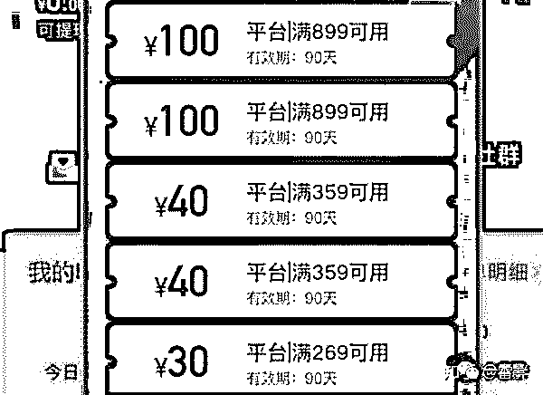*图片来源：知乎@雷胖*****不得不感叹一句，这个购物礼包的设计者真是太有运营头脑了，购物券不仅设置了使用门槛，还设置了有效期。想要用完这四百块钱的券，你在 3 个月内起码得在平台买 4000 块的东西。****这脑子干微商，简直了！****哦，不，依姐说未来集市不是微商，虽然是微商缔造者的新项目，但是未来集市叫做社交电商，比微商更高级。****依姐还说，中石化、京东也打算搞这个所谓的社交电商了，这是大势所趋。所以在大佬入局之前先抢占市场是最好的做法。****所谓“社交电商”也就是借助社交工具（如微信、微博）与用户进行沟通互动，进而促进销售的一种方式，譬如依托微信而生的微店，譬如抖音商店和小红书等等。****讲白了就是在社交软件上卖货呗，所以微商和社交电商本质上并没有区别，只是交易平台不同而已，这并不是一个什么新概念。****当依姐和我讲完这一套大道理之后，又开始忽悠我去开店了。然后我才知道所谓的“自用省钱，分享赚钱”的前提是你必须先花钱成为店主，否则一切都是空谈。****依姐还说了，平台直接和品牌方签约，所以价格方面很优惠，因为没有中间商赚差价。****“没有中间商赚差价”，哈哈哈~****某个二手车买卖网也是这么说的，然后就，赚了一大笔差价。****      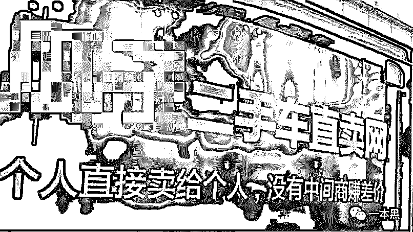****品牌—平台—店主，最中间的那个好像就是平台啊......但我没有继续质问依姐了，我不敢问啊。****依姐还说，现在外面很多诋毁、诽谤、造谣平台的文章，千万不要信。****“他们那是在眼红呢，因为我们赚到钱了，自然就有人嫉妒，你知道吧。”******你诽谤是因为你眼红******真的是诽谤造谣吗？****据创始人吴召国在微信群里透露：未来集市上线一个月时间，目前平台注册店主破百万，平台销售额高达 10 亿。****火爆程度可见一斑，据说 7 月 1 号上线当天注册店主数量就突破 20 万，30 天时间增加了 80 万店主，平均每分钟新增 18.5 个店主。****如果这个数据真实，那的确很吓人。********未来集市的火爆主要依赖于用户之间的传播，朋友圈、微信群铺天盖地都是未来集市的信息。****依姐说现在未来集市很好做，因为平台优势明显，而且补贴够多，之后依姐就给我详细讲述了未来集市的推广方式及盈利模式。****买礼包成为店主是玩未来集市的第一步，如果你不想赚钱，那就自己用用，买点东西就行了。但如果你想赚钱，那就去拉人头吧。****根据拉到的人数不同，店主一共分为三个级别：店主（黄金掌柜）——优质服务商（铂金掌柜）——战略合伙人（钻石掌柜）****这三个级别获得的佣金和平台奖励都不一样，但佣金占收入的比例其实很小，真正赚钱的还是拉人头的奖励：****店主：直推 100 元/人****服务商（拉 20 人）：直推 200 元/人+下级 100 元/人+二级 20 元/人****合伙人（拉 750 人）：直推 260 元/人+下级 160 元/人+二级 60 元/人；并享受集团 1%的分红****实际上成为合伙人之后，就可以拥有无限裂变的下级。****     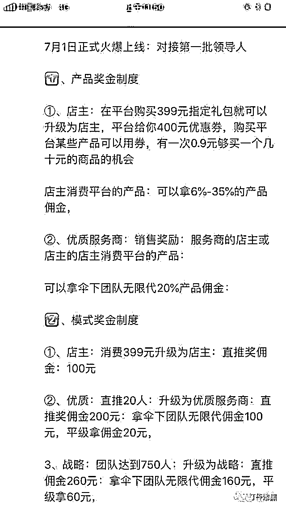****入门费、拉人头、层级返利，多么眼熟的字眼，但是大家说这不是传销。****因为未来集市不限制人身自由，也不强买强卖，一切都是你情我愿，何谈传销。****创始人吴召国说，在他的理解中，“传销是把无价值的商品进行包装，甚至是无商品，通过层层拉人头的方式赚钱”。****好，鼓掌~********？？？难道未来集市不是通过层层拉人头赚钱？在各个店主们疯狂晒收入的时候，我注意到他们的销售收入占比少的可怜。****一个钻石店主，一天 132 笔销售订单，收益才不到 40 块，连总收入的零头都不到。有的店主一天 4 笔订单，收益居然还是负的。****这叫分享赚钱？这比返利网站的返利还少呀。真正占大头的收益全部来自拉人头，否则动辄上万的甚至十数万的收益是从哪来的？P 图 P 的吗？****如果真如吴召国所说的，未来集市不是传销，那未来集市的公众号上线 10 天，就被微信以“涉嫌违规分销”而封停，又是为什么呢？****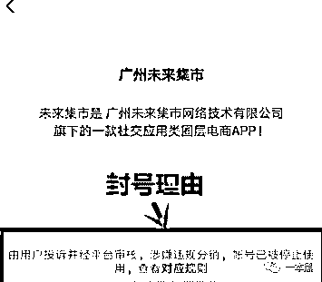******1.8 亿补贴亏损******依姐的朋友圈和所有做微商的朋友一样，全都是广告，一天能发几十条的那种。做微商就是在用信誉博收益，产品质量并非都差，但的确参差不齐。****未来集市的商品质量虽然比微商靠谱，但价格明显虚高。****将未来集市多个商品与淘宝对比发现，未来集市的商品定价比淘宝高出不少，之后未来集市会采用活动促销的方式，将价格调整至淘宝的价格区间内。****这操作和某东大节日促销送券的方式一模一样嘛，先提价再促销，然后还美其名曰“回馈客户”。****经比较发现，未来集市的数码 3C 产品，总体来说售价会比淘宝贵，而小商品与日化的价格差异不大（主要因为单价低）。最主要的是，在淘宝你可以选货源，进而选择低价的店铺。而在未来集市，你没得选。****说白了，未来集市就是一个大型线上超市呗。所谓的店主就是超市导购，没有基本工资，只拿提成的那种。****但这依然挡不住大家的热情，做免费工又咋啦？拉人头就能赚钱啊。****在未来集市的培训课上，吴召国说平台公测一个月以来，花了大量的钱补贴用户，30 天就亏损了 1.8 亿。这就足以证明平台的实力，绝非外面谣传的卷钱跑路。****除了平台实力，吴召国还在课上讲述了自己的逆袭经历、创业艰辛以及如何回报家乡父老的感人经历。具体可以参考各品牌微商大会现场的打鸡血视频，总之感人肺腑、热血沸腾。****      ****不止如此，群里还有吴召国和马云、马化腾、周鸿祎等互联网大佬的合照，据说这是彰显身份和地位的必要操作。****还有各个公司总裁、娱乐圈名人纷纷发来祝贺视频，替未来集市站台。甚至还有企业老总直接在镜头前展示自己在未来集市的收益。****所有的视频、图片和演讲，都在传递同一个意思，“连大佬都亲自下场玩未来集市了，你还不上车吗？老表。”**********搭网站、投广告、拉人头******像我们这种没啥钱又想赚钱的人，玩未来集市就是只能拼命加好友发朋友圈。但是有经商头脑的人就不一样了，比如我的上级，依姐。****你猜我是怎么加到依姐微信的？****当我百度未来集市的时候，我发现貌似有很多官网，点开之后发现每一个网站的内容也是一样的，就公司介绍，App 二维码什么的。****唯一的差别就是网站上的邀请码和个人微信有些不同，于是我就加上了依姐的微信。****而这些网页，基本就是依姐们找人搭建的一个页面，简单的展示页不需要任何交互，一两千就够了。但是依姐们可以靠这个网页吸引到成百上千的人成为她的下级。****用 3 个下级的成本赚到 300 个下级的利润。瞧瞧，这才是真正干大事的人该有的脑子。****不过现在那些页面已经消失了，转而换成了以下这种形式：****      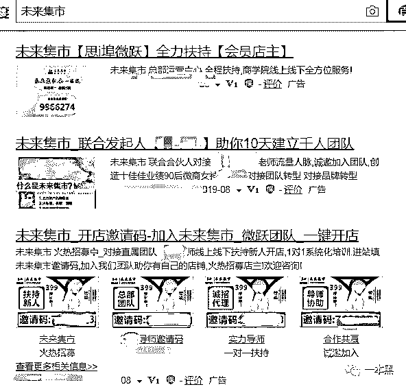      ****找人搭个网页，然后再投百度竞价广告，全面碾压那些一天到晚发圈招人的小喽喽们。****大佬果然是大佬。******B 轮战略融资******未来集市在宣传的时候，吴召国一直为平台背书，多次提及其思埠集团背景。未来集市的官方网站上也在显著位置标注了思埠的名字。**

> ***注：思埠作为微商大军的先行者，在微商界颇负盛名。曾多次在省级卫视以及央视露脸投广告。***

**但实际，某查查上显示未来集市和思埠并没有存在任何关联，甚至作为创始人的吴召国根本就没持股，只是未来集市的注册地址是思埠大厦（这也是依姐口中，思埠和未来集市关系的铁证）。****思埠集团注册了以未来集市为名的 45 个商标，涵盖各个领域。但未来集市却并未将自己的品牌注册任何商标，并且未来集市网站上的 logo 和思埠注册的商标，也是完全不同的。****从法律层面来讲，思埠集团和未来集市之间没有毛关系，思埠是思埠，未来集市是未来集市。****究竟思埠在打一个什么算盘？目前还不可知。****      *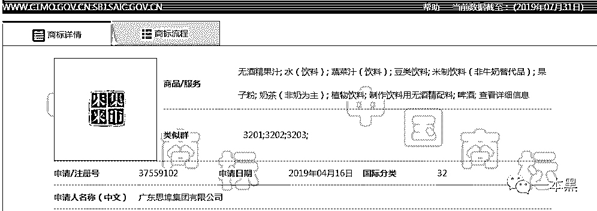**思埠集团注册的“未来集市”商标*****       *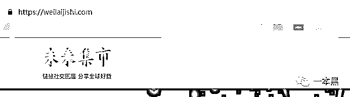未来集市官网 logo*****除了“微商奇迹”—思埠集团这个背景，未来集市在宣传时还多次声称已获得 3 家风投公司的青睐，分别是华创资本、赛富亚洲和 XXX 金融。****但我在华创和赛富亚洲的官网上并未找到任何有关未来集市的报道和项目介绍。而 XXX 金融的投资，具体金额暂未公开，但对外宣称数亿元。****    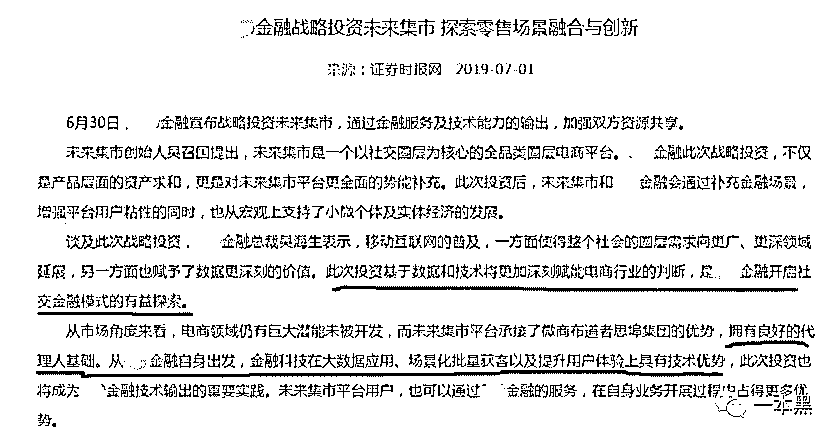****网购时代，只要有购物就会有贷款，所以 XXX 和未来集市的合作，无非就是用金钱换数据，数据最终变贷款。****在依姐们的眼中，有马云这样大佬的合影，有资本加持就能够证明平台不是传销。当然，上市也有同样的效果。****然而，今年 5 月在纳斯达克成功敲钟的云集微店至今还未能摆脱传销的阴影。****云集微店算是最早一批的付费社交电商开创者。2015 年成立，不到两年时间就通过多级分销、拉人头的方式得到了 30 万付费用户，以及上亿的会费。但在 2017 年，云集微店被杭州市场监督管理局定性为传销，并下发了一张近千万的罚单。****      *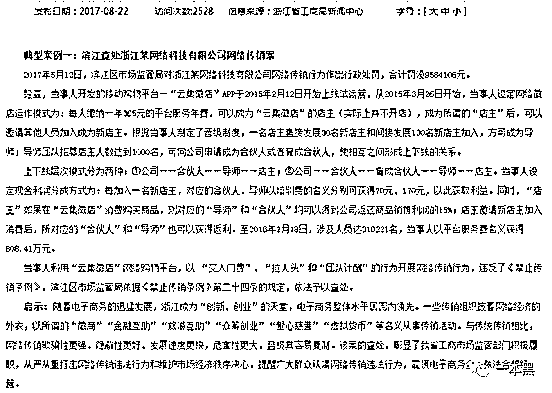浙江工商行政管理局官方截图*****在交完罚款之后，云集微店发布申明，称自己的分销方式的确存在问题，并及时进行了整改。于是两年后，云集成功上市了。****此外，返利 APP 花生日记，在 2018 年也因为传销被开出天价罚单。但目前这款 APP 也仍在运行中。****我想这大概就是未来集市肆无忌惮的原因。****只要没有被有关部门定性为传销，那么就不是传销。就算被定性为传销，交完罚款，整改一番就能重头再来。毕竟名声打响了，用户也有了，罚点钱嘛，也无所谓。****只要承认错误，然后“痛改前非”。一切不堪的过往就过去了。******未来集市的大梦想******吴兆国在培训课上说，未来集市不是社交电商的开创者，云集和贝店才是先行者，但是未来集市比贝店和云集更有前景。****并且他说，未来集市是“中国电商的新奇迹”，是“一个完美的独角兽”。****但每一个企业在快速成长，甚至威胁到其他企业的生存时，就一定会有流言蜚语，比如现在的未来集市。吴兆国说网上出现的关于未来集市的负面传闻，一方面是来自媒体对未来集市的误解，一方面是则是竞争对手专门雇人写的黑稿。****等我们这篇文章发表时，我想一本黑也会变成他们口中一个“专写黑稿”的公众号。****吴兆国一方面利用云集、贝店等先行者为自己洗脱传销的嫌疑，一方面又将造谣传销的锅推给了以云集为首的同行。****这位大哥起码长着两张嘴啊，啥都让你说了。********未来集市有一个伟大的梦想——有朝一日能去到纳斯达克敲响那面象征荣誉与理想的锣。某种意义上来说，微商是一个十分团结的集体，因为他们在为同一个理想而奋斗。****伟大的企业不止有伟大的理想，同样也关心社会问题。于是未来集市推出了线上医疗，成人版 499 包年，儿童版 999 包年。****     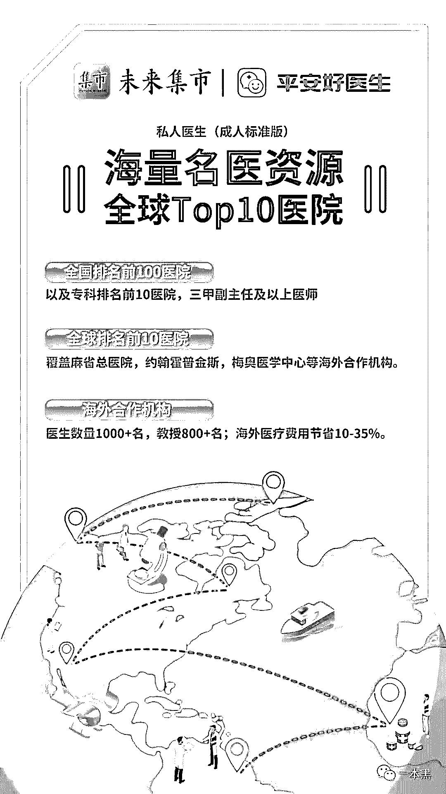****这是未来集市的大梦想，也是未来集市对社会的大贡献。********噗~********在网页和朋友圈里，我几乎见不到未来集市的负面新闻，因为都被招商信息淹没了，但是有一个地方行。****现在，打开你的 APP store，搜索未来集市，查看低分评论。你就能发现这个平台目前存在的问题。****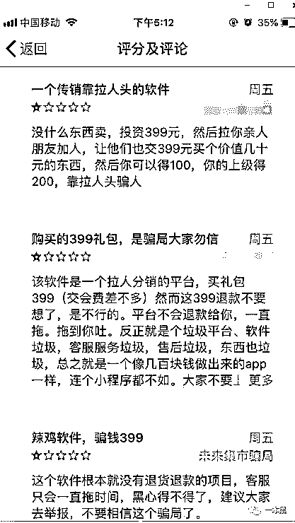****或者，你也可以去黑猫、聚投诉等平台看一看。****     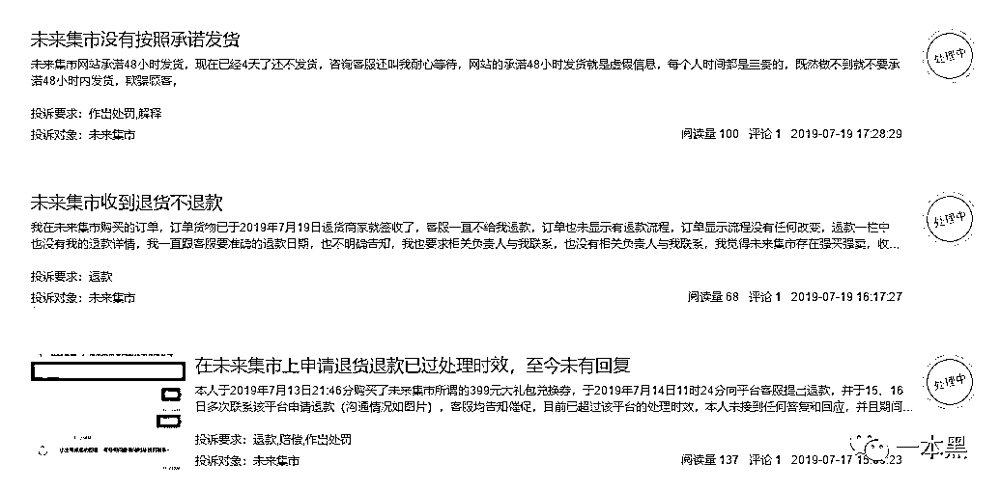****有句话，叫步子太大容易扯着蛋。不知道未来集市现在有没有体会。****很多读者在爆料或者咨询的时候，都会顺便问一句“这个平台/项目，大家都在做，特别赚钱，我能做吗？”****毕竟卖货又不赚钱，那你赚的是谁的钱呢？总不可能是平台的。****所以，****能不能做，你摸一哈自己的心口。**

****

**还原事实｜专扒黑产**

**微信 ID：darkinsider**

****

**知乎 一本黑**

**微博 一本黑 007**

**投稿、爆料、招聘、转载**

**请联系微信：chenchen_19940612**

**约稿、内容合作、联系：yibenheiSW**